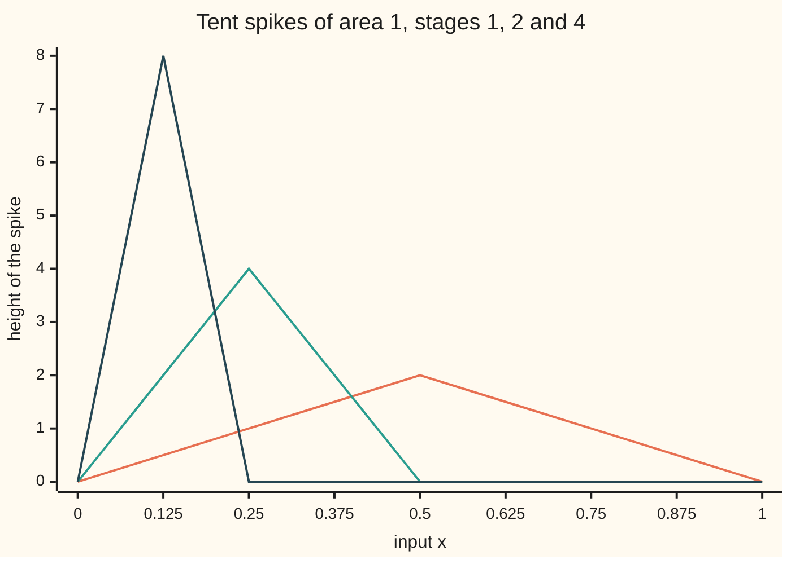

# Swapping limits: when the integral of the limit is the limit of the integrals

[Syllabus](../../../SYLLABUS.md) → [Calculus and analysis](../../../SYLLABUS.md#w06) → [Series](../../../SYLLABUS.md#w06-s06) → Swapping limits

---

## General Overview

Draw a tent with its base on the interval from 0 to 1 and its peak 2 high in the middle. Its area is half of base times height: 1. Halve the base and double the height: the area is still 1. At stage 1000 the base is a thousandth wide, the peak is 2000 high, and the area is still 1.

Watch one point, 0.01. The tent there is 0.04 high at stage 1, 4 at stage 10, and 100 at stage 50, when the peak passes over. From stage 100 on, the base ends at or before 0.01 and the height there is 0 for good. Every point ends the same way, so point by point the tents head for the zero function, whose area is 0.

Area first, then limit: 1. Limit first, then area: 0. Integrating a series one term at a time swaps these two orders, so the condition that makes the swap safe matters.

**If the stage functions close in on their limit uniformly, with one worst gap covering every input shrinking to 0, then on a closed, bounded interval the integral of the limit equals the limit of the integrals; for derivatives the slopes themselves must close in uniformly.**

**What kind of fact this is:** two theorems, both proved on this card in Why it works.

### The picture: spikes that get taller and thinner



Orange: stage 1, peak 2 at x = 0.5. Teal: stage 2, peak 4 at x = 0.25. Dark blue: stage 4, peak 8 at x = 0.125. The tents' corners fall on the sample points, so the segments drawn are the tents exactly. Each encloses area 1.

---

## The formula

Reminders: the stage-n function is $f_n$, its limit $f$, and sup is the least upper bound ([Uniform convergence](07-uniform-convergence.md)); the integral sign with ends a and b adds up area, and dx names the variable along the base ([The integral](../04-Integrals/01-riemann-integral.md)).

**The integration theorem.** If each $f_n$ is integrable on the closed interval from a to b and

$$E_n=\sup_{a\le x\le b}\,\lvert f_n(x)-f(x)\rvert \to 0,$$

then $f$ is integrable and

$$\left\lvert \int_a^b f_n(x)\,dx-\int_a^b f(x)\,dx \right\rvert \le (b-a)\,E_n,\qquad\text{so}\qquad \lim_{n\to\infty}\int_a^b f_n(x)\,dx=\int_a^b \lim_{n\to\infty} f_n(x)\,dx .$$

**Read it aloud:** the areas miss by at most width times worst gap, so when the worst gap shrinks to nothing, limit and area can be taken in either order.

**The differentiation theorem.** If each $f_n$ has a continuous derivative $f_n'$ on the closed, bounded interval, the derivatives close in uniformly on a function $g$, and at one point $x_0$ of the interval the values $f_n(x_0)$ head for a number $c$, then the $f_n$ close in uniformly on

$$f(x)=c+\int_{x_0}^{x} g(s)\,ds,\qquad\text{and}\qquad f'(x)=g(x)=\lim_{n\to\infty} f_n'(x).$$

**Read it aloud:** if the slopes settle uniformly and one height settles, the slope of the limit is the limit of the slopes.

The working case is the uniform-convergence card's series: partial sums $S_N(x)=(x/2)+(x/2)^2+\cdots+(x/2)^N$ closing in on $S(x)=x/(2-x)$ from 0 to 1. At x = 1 it is the house series 1/2 + 1/4 + 1/8 + ⋯.

| Symbol | Plain meaning | In our example | Push it up and the answer… |
| --- | --- | --- | --- |
| $f_n$, $S_N$ | the stage-n function; a partial sum of N terms | the spike with base 1/n; ten terms of the series | — |
| $f$, $S$ | the limit function | 0 for the spikes; $x/(2-x)$ | — |
| $n$, $N$ | the stage, the sequence's clock | 1, 10, 50, 1000 | spikes taller, sums closer |
| $x$, $s$ | an input; the variable along the base inside an integral | 0.01 | — |
| $a$, $b$ | the ends of the interval | 0 and 1 | a wider interval loosens the bound |
| $E_n$, $G_n$ | the worst gap of the functions; of their slopes | 2n for the spikes; 0.000976562 for ten terms | a bigger miss in area allowed |
| $f_n'$, $g$ | the slope at stage n; the limit of the slopes | cos(nx) for the waves | — |
| $x_0$, $c$ | the anchor point; the height settled on there | 0 and 0 | shifts the limit up or down |

### When it holds

- **Uniform, not pointwise.** Without it the spikes give 1 one way and 0 the other.
- **A bounded interval.** Without it a block 1/n high and n wide settles uniformly on 0, yet keeps area 1: width times worst gap is n × 1/n = 1.
- **For derivatives, uniform slopes plus one anchor.** Uniform heights alone fail (the waves sin(nx)/n below); slopes alone fail too, since the constants 1, 2, 3, … all have slope 0 and no limit.
- **Sufficient, not necessary.** A swap can work without uniform convergence; failing the test proves nothing.

---

## Why it works

### Step 0: an integral sees area, and a uniform gap is a thin strip

If every gap is at most $E_n$, the graph of $f_n$ lies in a strip of half-height $E_n$ around the graph of $f$. The area between them is at most width times $E_n$. Uniform convergence squeezes the strip to nothing; pointwise convergence gives no strip at all.

### Step 1: the limit has an integral

If each $f_n$ is continuous, so is $f$ (uniform-convergence card, Step 4), and a continuous function on a closed, bounded interval has an integral. Stages with jumps need upper and lower sums, folded below.

<details>
<summary>Detailed proof: a uniform limit of integrable functions is integrable</summary>

For a partition P of the interval, U(P, h) and L(P, h) are the upper and lower sums of h: rectangles at the sup and inf of h on each piece. Since $f_n - E_n \le f \le f_n + E_n$ everywhere, adding over pieces of total width b − a gives

$$U(P,f)-L(P,f)\le U(P,f_n)-L(P,f_n)+2(b-a)E_n .$$

Given a tolerance ε > 0, fix n with $2(b-a)E_n < ε/2$, then a partition pinching the sums of $f_n$ within ε/2. The sums of f are then within ε, which is the definition of integrable. The same bounds show f is bounded.

</details>

### Step 2: the bound on the areas

The integral of a difference is the difference of the integrals, and a function never above $E_n$ has integral at most $E_n$ times the width. So

$$\left\lvert \int_a^b f_n-\int_a^b f \right\rvert=\left\lvert \int_a^b (f_n-f) \right\rvert\le \int_a^b \lvert f_n-f\rvert \le (b-a)E_n .$$

The right side heads for 0, so the left side does. The tolerance game, with numbers. The integral of $S$ from 0 to 1, from its antiderivative −x − 2 ln(2 − x), is 2 ln 2 − 1 = 0.386294361. Land within 0.001 of it by integrating finitely many terms, each on its own: the term $(x/2)^k$ has integral $1/((k+1)2^k)$. The worst gap of $S_N$ sits at x = 1 and is the house series' leftover, $1/2^N$. For N = 10 it is 0.000976562, under 0.001. The actual miss is 0.000075870: the bound holds, generously.

### Step 3: where the spikes escape

For the stage-n spike the worst gap from zero is its peak, 2n, so the bound $(b-a)E_n$ grows instead of shrinking. The area hides in a base 1/n wide next to 0: every fixed point is eventually outside it, yet no stage is uniformly close to 0.

### Step 4: derivatives need more

Uniform heights say nothing about slopes. The waves sin(nx)/n have worst gap 1, 0.1, 0.01 at stages 1, 10, 100, but their slope cos(nx) is 1 at x = 0 at every stage, while their limit, zero, has slope 0.

So the theorem puts the uniformity on the slopes. By the fundamental theorem each stage is its anchor height plus the area under its slope; the anchor heads for $c$, Step 2 carries the area to the area under $g$, and the fundamental theorem read backwards gives the limit the slope $g$.

<details>
<summary>Detailed proof: the differentiation theorem</summary>

Let $G_n$, the sup of $\lvert f_n' - g\rvert$, head for 0. The limit g is continuous, so $F(x) = c + \int_{x_0}^{x} g(s)\,ds$ exists and $F' = g$. For every x in the interval,

$$\lvert f_n(x)-F(x)\rvert \le \lvert f_n(x_0)-c\rvert+\left\lvert \int_{x_0}^{x} (f_n'-g) \right\rvert \le \lvert f_n(x_0)-c\rvert+(b-a)G_n .$$

The right side has no x in it and heads for 0, so $f_n \to F$ uniformly and $f' = F' = g = \lim f_n'$.

</details>

The series passes. The slope of $(x/2)^k$ is $k x^{k-1}/2^k$, at most $k/2^k$ from 0 to 1; these caps add to 2.000000, so the M-test (uniform-convergence card, Step 5) makes the slopes converge uniformly, and every partial sum is 0 at the anchor 0. At x = 0.5 the terms' slopes add to 0.888889, matching the formula $2/(2-x)^2$ and a difference quotient of $S$.

Another route, dominated convergence in wing 10, replaces the uniform gap by one fixed function of finite area lying above the size of every stage.

---

## Worked numbers, by hand

| Step | Arithmetic | Value |
| --- | --- | --- |
| spike area, stage 1000 | ½ × (1/1000) × 2000 | **1** |
| spike height at 0.01, stages 1, 10, 50, 1000 | 4n^2 × 0.01 on the rising side, 0 past the base | 0.04, 4, 100, 0 |
| integral of $S$ from 0 to 1 | 2 ln 2 − 1 | 0.386294361 |
| first ten terms integrated | 1/4 + 1/12 + 1/32 + ⋯ + 1/(11 × 2^10) | 0.386218491 |
| promised miss | width 1 × worst gap 1/2^10 | 0.000976562 |
| actual miss | 0.386294361 − 0.386218491 | **0.000075870** |

For the spikes the swap turns 1 into 0; for the series it costs 0.000075870, inside the promised 0.000976562.

### What breaks if you drop a piece

| Mistake | Comes out at | What went wrong |
| --- | --- | --- |
| Pointwise convergence only (spikes) | limit of integrals 1, integral of limit 0 | worst gap 2n grows, so no strip holds the area |
| Uniform heights, no control of slopes (waves) | slope at 0 stays 1; the limit's slope is 0 | worst gap 0.01 at stage 100 says nothing about steepness |
| An unbounded interval (blocks 1/n high on 0 to n) | worst gap 0.001 at stage 1000, area still 1 | width times worst gap is 1 at every stage |

The code prints all three.

---

## Code, from first principles, and it actually runs

The code writes its own rectangle and Simpson sums; only sine and the logarithm come from the language. Two roads each: spike area by triangle and by rectangles; the series' integral by antiderivative, Simpson and term by term; the slope by adding terms' slopes and by a difference quotient.

### Python

```python
# Swapping limits -- the check behind the card.  math's sin and log are
# primitives; every integral, slope and sum below is built here, and each
# answer is reached by two roads that share no arithmetic.
from math import sin, log

def spike(n, x):                    # tent on [0, 1/n], peak 2n at x = 1/(2n)
    return max(0.0, 2 * n - abs(4 * n * n * x - 2 * n))

def midpoint(f, a, b, m):           # m rectangles, each read at its middle
    h = (b - a) / m
    return h * sum(f(a + (i + 0.5) * h) for i in range(m))

def simpson(f, a, b, m):            # m strips (m even), weights 1 4 2 4 ... 4 1
    h = (b - a) / m
    return h / 3 * sum((1 if i in (0, m) else 4 if i % 2 else 2) * f(a + i * h) for i in range(m + 1))

def S(x):                           # the sum of (x/2)^k for k = 1, 2, 3, ...
    return x / (2 - x)

for n in (1, 2, 4):
    print(f"chart n={n}:", " ".join(f"{spike(n, i / 8):.2f}" for i in range(9)))
for n in (1, 10, 50, 1000):
    tri = 0.5 * (1 / n) * (2 * n)                               # road one: half base times height
    rect = midpoint(lambda x: spike(n, x), 0.0, 1.0, 100000)    # road two: 100,000 rectangles
    assert abs(tri - rect) < 1e-9
    print(f"spike n={n}: worst gap {2 * n}, area by triangle {tri:.6f}, "
          f"by rectangles {rect:.6f}, height at x=0.01 {spike(n, 0.01):.6f}")
print(f"integral of the limit (0 everywhere): {midpoint(lambda x: 0.0, 0.0, 1.0, 1000):.6f}")
exact = 2 * log(2) - 1                                          # from the antiderivative -x - 2 ln(2 - x)
simp = simpson(S, 0.0, 1.0, 1000)
print(f"integral of S on [0, 1]: antiderivative {exact:.9f}, Simpson {simp:.9f}")
for N in (5, 10, 20):
    worst = max(abs(S(i / 1000) - sum((i / 2000) ** k for k in range(1, N + 1))) for i in range(1001))
    tbt = sum(1 / ((k + 1) * 2 ** k) for k in range(1, N + 1))  # integrate term by term
    assert 0 < simp - tbt <= (1 - 0) * worst                  # miss <= (b - a) * worst gap
    print(f"N={N}: worst gap {worst:.9f}, integrals of terms {tbt:.9f}, miss {exact - tbt:.9f}")
h = 1e-6
for n in (1, 10, 100):
    worst = max(abs(sin(n * i / 10000)) / n for i in range(70001))
    slope0 = (sin(n * h) - sin(-n * h)) / (2 * n * h)           # difference quotient at 0
    assert abs(slope0 - 1) < 1e-6 and abs(worst * n - 1) < 1e-3 # gap 1/n, slope stuck at 1
    print(f"wave n={n}: worst gap {worst:.6f}, slope at 0 {slope0:.6f}; limit 0, its slope 0")
x = 0.5
tbt = sum(k * x ** (k - 1) / 2 ** k for k in range(1, 80))     # slopes of the terms, added
dq = (S(x + h) - S(x - h)) / (2 * h)                            # slope of the sum, measured
assert abs(tbt - dq) < 1e-7
print(f"slope of S at {x}: term by term {tbt:.6f}, difference quotient {dq:.6f}, "
      f"formula 2/(2-x)^2 {2 / (2 - x) ** 2:.6f}")
print(f"caps on the slope terms, k/2^k added to k=60: {sum(k / 2 ** k for k in range(1, 61)):.6f}")
for n in (10, 1000):
    print(f"block n={n} on [0, {n}]: worst gap {1 / n:.6f}, area {midpoint(lambda t: 1 / n, 0.0, n, 1000):.6f}")
print("ALL CHECKS PASS")
```

**Ran 2026-09-27 on macOS, Python 3.14.6, standard library only. All checks passed. Output, pasted from the run:**

```
chart n=1: 0.00 0.50 1.00 1.50 2.00 1.50 1.00 0.50 0.00
chart n=2: 0.00 2.00 4.00 2.00 0.00 0.00 0.00 0.00 0.00
chart n=4: 0.00 8.00 0.00 0.00 0.00 0.00 0.00 0.00 0.00
spike n=1: worst gap 2, area by triangle 1.000000, by rectangles 1.000000, height at x=0.01 0.040000
spike n=10: worst gap 20, area by triangle 1.000000, by rectangles 1.000000, height at x=0.01 4.000000
spike n=50: worst gap 100, area by triangle 1.000000, by rectangles 1.000000, height at x=0.01 100.000000
spike n=1000: worst gap 2000, area by triangle 1.000000, by rectangles 1.000000, height at x=0.01 0.000000
integral of the limit (0 everywhere): 0.000000
integral of S on [0, 1]: antiderivative 0.386294361, Simpson 0.386294361
N=5: worst gap 0.031250000, integrals of terms 0.382291667, miss 0.004002694
N=10: worst gap 0.000976562, integrals of terms 0.386218491, miss 0.000075870
N=20: worst gap 0.000000954, integrals of terms 0.386294320, miss 0.000000042
wave n=1: worst gap 1.000000, slope at 0 1.000000; limit 0, its slope 0
wave n=10: worst gap 0.100000, slope at 0 1.000000; limit 0, its slope 0
wave n=100: worst gap 0.010000, slope at 0 1.000000; limit 0, its slope 0
slope of S at 0.5: term by term 0.888889, difference quotient 0.888889, formula 2/(2-x)^2 0.888889
caps on the slope terms, k/2^k added to k=60: 2.000000
block n=10 on [0, 10]: worst gap 0.100000, area 1.000000
block n=1000 on [0, 1000]: worst gap 0.001000, area 1.000000
ALL CHECKS PASS
```

### Rust

Same numbers, same labels, built with `rustc --edition 2021 -O`.

```rust
// Swapping limits -- the same check as the Python, in Rust.  No crates.
// sin and ln are primitives; every integral, slope and sum below is built
// here, and each answer is reached by two roads that share no arithmetic.
fn spike(n: f64, x: f64) -> f64 { // tent on [0, 1/n], peak 2n at x = 1/(2n)
    (2.0 * n - (4.0 * n * n * x - 2.0 * n).abs()).max(0.0)
}

fn midpoint(f: impl Fn(f64) -> f64, a: f64, b: f64, m: usize) -> f64 { // m rectangles, read at the middle
    let h = (b - a) / m as f64;
    h * (0..m).map(|i| f(a + (i as f64 + 0.5) * h)).sum::<f64>()
}

fn simpson(f: impl Fn(f64) -> f64, a: f64, b: f64, m: usize) -> f64 { // weights 1 4 2 4 ... 4 1
    let h = (b - a) / m as f64;
    let w = |i: usize| if i == 0 || i == m { 1.0 } else if i % 2 == 1 { 4.0 } else { 2.0 };
    h / 3.0 * (0..=m).map(|i| w(i) * f(a + i as f64 * h)).sum::<f64>()
}

fn s(x: f64) -> f64 { x / (2.0 - x) } // the sum of (x/2)^k for k = 1, 2, 3, ...

fn main() {
    for n in [1.0, 2.0, 4.0] {
        let r: Vec<String> = (0..9).map(|i| format!("{:.2}", spike(n, i as f64 / 8.0))).collect();
        println!("chart n={}: {}", n, r.join(" "));
    }
    for n in [1.0, 10.0, 50.0, 1000.0] {
        let tri = 0.5 * (1.0 / n) * (2.0 * n);                      // road one: half base times height
        let rect = midpoint(|x| spike(n, x), 0.0, 1.0, 100000);     // road two: 100,000 rectangles
        assert!((tri - rect).abs() < 1e-9);
        println!("spike n={}: worst gap {}, area by triangle {:.6}, by rectangles {:.6}, height at x=0.01 {:.6}",
            n, 2.0 * n, tri, rect, spike(n, 0.01));
    }
    println!("integral of the limit (0 everywhere): {:.6}", midpoint(|_| 0.0, 0.0, 1.0, 1000));
    let exact = 2.0 * 2f64.ln() - 1.0;                              // from the antiderivative -x - 2 ln(2 - x)
    let simp = simpson(s, 0.0, 1.0, 1000);
    println!("integral of S on [0, 1]: antiderivative {:.9}, Simpson {:.9}", exact, simp);
    for big_n in [5, 10, 20] {
        let partial = |x: f64| (1..=big_n).map(|k| (x / 2.0).powi(k)).sum::<f64>();
        let worst = (0..=1000).map(|i| (s(i as f64 / 1000.0) - partial(i as f64 / 1000.0)).abs()).fold(0.0, f64::max);
        let tbt: f64 = (1..=big_n).map(|k| 1.0 / ((k + 1) as f64 * 2f64.powi(k))).sum(); // term by term
        assert!(0.0 < simp - tbt && simp - tbt <= (1.0 - 0.0) * worst); // miss <= (b - a) * worst gap
        println!("N={}: worst gap {:.9}, integrals of terms {:.9}, miss {:.9}", big_n, worst, tbt, exact - tbt);
    }
    let h = 1e-6;
    for n in [1.0, 10.0, 100.0] {
        let worst = (0..=70000).map(|i| (n * i as f64 / 10000.0).sin().abs() / n).fold(0.0, f64::max);
        let slope0 = ((n * h).sin() - (-n * h).sin()) / (2.0 * n * h); // difference quotient at 0
        assert!((slope0 - 1.0).abs() < 1e-6 && (worst * n - 1.0).abs() < 1e-3); // gap 1/n, slope stuck at 1
        println!("wave n={}: worst gap {:.6}, slope at 0 {:.6}; limit 0, its slope 0", n, worst, slope0);
    }
    let x: f64 = 0.5;
    let tbt: f64 = (1..80).map(|k| k as f64 * x.powi(k - 1) / 2f64.powi(k)).sum(); // slopes of the terms
    let dq = (s(x + h) - s(x - h)) / (2.0 * h);                     // slope of the sum, measured
    assert!((tbt - dq).abs() < 1e-7);
    println!("slope of S at {}: term by term {:.6}, difference quotient {:.6}, formula 2/(2-x)^2 {:.6}",
        x, tbt, dq, 2.0 / (2.0 - x).powi(2));
    let caps: f64 = (1..61).map(|k| k as f64 / 2f64.powi(k)).sum();
    println!("caps on the slope terms, k/2^k added to k=60: {:.6}", caps);
    for n in [10.0, 1000.0] {
        println!("block n={} on [0, {}]: worst gap {:.6}, area {:.6}", n, n, 1.0 / n, midpoint(|_| 1.0 / n, 0.0, n, 1000));
    }
    println!("ALL CHECKS PASS");
}
```

**Ran 2026-09-27 on macOS, rustc 1.98.1, no crates. All checks passed. Output, pasted from the run:**

```
chart n=1: 0.00 0.50 1.00 1.50 2.00 1.50 1.00 0.50 0.00
chart n=2: 0.00 2.00 4.00 2.00 0.00 0.00 0.00 0.00 0.00
chart n=4: 0.00 8.00 0.00 0.00 0.00 0.00 0.00 0.00 0.00
spike n=1: worst gap 2, area by triangle 1.000000, by rectangles 1.000000, height at x=0.01 0.040000
spike n=10: worst gap 20, area by triangle 1.000000, by rectangles 1.000000, height at x=0.01 4.000000
spike n=50: worst gap 100, area by triangle 1.000000, by rectangles 1.000000, height at x=0.01 100.000000
spike n=1000: worst gap 2000, area by triangle 1.000000, by rectangles 1.000000, height at x=0.01 0.000000
integral of the limit (0 everywhere): 0.000000
integral of S on [0, 1]: antiderivative 0.386294361, Simpson 0.386294361
N=5: worst gap 0.031250000, integrals of terms 0.382291667, miss 0.004002694
N=10: worst gap 0.000976562, integrals of terms 0.386218491, miss 0.000075870
N=20: worst gap 0.000000954, integrals of terms 0.386294320, miss 0.000000042
wave n=1: worst gap 1.000000, slope at 0 1.000000; limit 0, its slope 0
wave n=10: worst gap 0.100000, slope at 0 1.000000; limit 0, its slope 0
wave n=100: worst gap 0.010000, slope at 0 1.000000; limit 0, its slope 0
slope of S at 0.5: term by term 0.888889, difference quotient 0.888889, formula 2/(2-x)^2 0.888889
caps on the slope terms, k/2^k added to k=60: 2.000000
block n=10 on [0, 10]: worst gap 0.100000, area 1.000000
block n=1000 on [0, 1000]: worst gap 0.001000, area 1.000000
ALL CHECKS PASS
```

The two outputs are identical.

> [!TIP]
> **Try changing**
> Guess first, then run it.
> - **Rectangles wider than the spike.** Change `100000` to `1000` where the spike's area is summed. At stage 1000 one rectangle covers the whole base and reads it at the peak, the area comes out 2, and the first assert stops the program.
> - **The house series' own slope.** Set `x` to `1` in the slope check. The terms' slopes add to 2, matching the formula and the caps' total.
> - **Integrate the wrong terms.** Change `(k + 1)` to `k` in the term-by-term integral. The terms overshoot the true area and the theorem's assert stops the program.

---

## The usual mistake

> [!warning]
> **Believing that if every point settles, the areas settle.** Every point of the spikes settles at 0, yet every stage has area 1. Only a shrinking worst gap pins the area down.
>
> - **Checking the gap on a grid.** A spike thinner than the grid spacing falls between samples; the grid sees nothing of a worst gap that is really 2n.
> - **Differentiating a uniform limit.** The waves settle uniformly on 0; their slopes at 0 stay at 1.
> - **Reading the theorem backwards.** A failed swap on a bounded interval proves the convergence was not uniform; convergence that is not uniform does not prove the swap fails.

---

## Where you meet it in real life

- **Series integrated term by term.** A power series converges uniformly on closed intervals inside its radius, so it integrates one term at a time ([Power series](04-power-series.md)); 1/4 + 1/12 + 1/32 + ⋯ = 2 ln 2 − 1 is one case.
- **Impulses.** A hammer blow is modelled as a spike of fixed total push over a shrinking time. Its limit as a function is 0, so an impulse is treated as a distribution instead.

> **Say it back**
> Limit then area, and area then limit, can disagree: tent spikes of area 1 settle point by point on 0. If the worst gap over a bounded interval shrinks to 0, the areas differ by at most width times that gap, so the orders agree. Ten terms of the series, integrated one at a time, land within 0.000075870 of 2 ln 2 − 1. Derivatives need the slopes to settle uniformly and one height to settle.

---

## What this builds on

- [Uniform convergence](07-uniform-convergence.md): the worst gap, continuity of a uniform limit, and the M-test used on the slopes.
- [The integral](../04-Integrals/01-riemann-integral.md): upper and lower sums, and the integral's respect for differences and sizes.

## Where this goes next

- [Differentiating under the integral](../08-Multiple%20Integrals/05-differentiating-under-the-integral.md): the same swap, with a difference quotient as the limit.
- Distributions: the spikes' limit made into an object, the delta.
- Differentiating a series term by term: both theorems applied to sums of waves.
- Fourier inversion: a swap over an unbounded line, beyond this card's bounded interval.

The spikes' limit loses their area, yet an area of 1 packed at one point is a real thing; what kind of object holds it is the question Distributions answers.

---

## Sources

Verified 2026-09-27: every link below resolves to a page naming the cited work.

- Lebl, Jiří. *Basic Analysis I*, §6.2 "Interchange of limits". [Open textbook page](https://www.jirka.org/ra/html/sec_liminter.html). Theorems 6.2.4 and 6.2.10: the integral and derivative versions.
- Abbott, Stephen. *Understanding Analysis*, 2nd ed. Springer, 2015. [Publisher page](https://link.springer.com/book/10.1007/978-1-4939-2712-8). Both theorems, with counterexamples of this card's kind.
- Tao, Terence. *Analysis II*, 3rd ed. Hindustan Book Agency and Springer, 2016. [Publisher page](https://link.springer.com/book/10.1007/978-981-10-1804-6). Both interchange theorems from the definitions.
