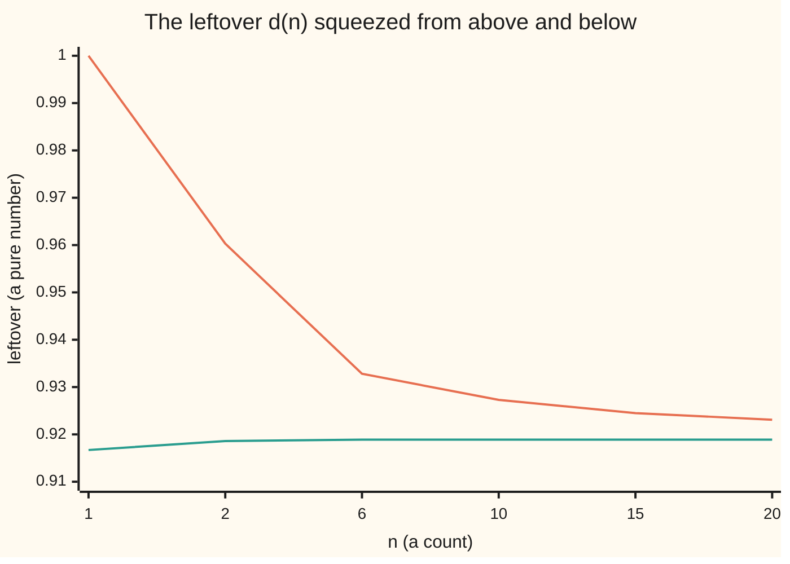

# Stirling's approximation: how big n factorial is, proved with integrals only

[Syllabus](../../../SYLLABUS.md) → [Calculus and analysis](../../../SYLLABUS.md#w06) → [Series](../../../SYLLABUS.md#w06-s06) → Stirling's approximation

---

## General Overview

Twenty runners can finish a race in 20 × 19 × 18 × … × 2 × 1 orders. That product is 20 factorial, written 20!, and multiplied out it is 2432902008176640000, about 2.4329 × 10^18 ([Factorials](../../04-Combinatorics%20and%20graphs/01-Counting%20Principles/03-factorial.md)).

A number that size cannot be simplified inside a formula, and it hides how fast n! grows. Divide 20 by e, the base of natural logs, to get 7.357589. Raise that to the 20th power: 2.1613 × 10^17. Multiply by the square root of 2π × 20, which is 11.209982. The result, 2.4228 × 10^18, is 20! to within a ratio of 0.995842.

That is Stirling's approximation, proved here with areas under ln x, one Taylor series and integrals of powers of sin x.

**The factorial of n is, to a ratio that tends to 1, the square root of 2πn times n over e raised to the nth power; the proof traps ln n! between two areas and fixes the constant with Wallis's integrals.**

**What kind of fact this is:** an approximation, with its error proved in Why it works: the truth is the estimate times a factor between 1 and e^(1/(12n)).

### The picture: a squeeze that pins the constant

Take ln n!, subtract (n + ½) ln n − n, and call the leftover d(n). The proof shows d(n) falls, d(n) − 1/(12n) rises, and both close on ln √(2π).



Orange: d(n), falling. Green: d(n) − 1/(12n), rising. They close on 0.91893853, which is ln √(2π).

---

## The formula

Notation first, in words. A wavy equals sign, $a_n \sim b_n$, means "the ratio a_n / b_n heads for 1 as n grows": the two sides agree in percentage, not in difference.

$$n! \sim \sqrt{2\pi n}\,\left(\frac{n}{e}\right)^{n}$$

**Read it aloud:** n factorial is, in ratio, the square root of 2π n times n over e to the nth.

The card proves a sharper statement, true at every n from 1 up:

$$n! = \sqrt{2\pi n}\,\left(\frac{n}{e}\right)^{n} e^{\theta_n}, \qquad 0 < \theta_n < \frac{1}{12n}$$

**Read it aloud:** the estimate is always a little low, and the factor that repairs it lies between 1 and e to the one over 12n.

| Symbol | Plain meaning | In our example | Push it up and the answer… |
| --- | --- | --- | --- |
| $n$ | the count multiplied up to | 20 runners | n! outgrows any power of n |
| $n!$ | the product 1 × 2 × … × n | 2.4329 × 10^18 | — |
| $e$, $\pi$ | base of natural logs; circle constant | π built as 3.141592653590 | fixed |
| $\theta_n$ | the repair exponent | between 0 and 1/240 at n = 20 | shrinks |
| $d_n$ | the leftover, ln n! − (n + ½) ln n + n | 0.9231 at n = 20 | falls to C |
| $C$ | where the leftover settles | 0.91893853 | — |
| $W_k$, $k$ | area under sin x to the kth power, 0 to π/2 | W_20 = 0.2767696821 | shrinks |
| $m$, $t$ | helpers: half an even k; 1/(2n + 1) | m = 1000 | — |

$d_n$ is the d(n) plotted above, a sequence with n as its clock.

### When it holds

- **n is a positive whole number.** The bound holds from n = 1 up; fractions need the gamma function.
- **Agreement is in ratio, not difference.** At n = 20 the ratio is 0.995842, yet the difference is 1.0115 × 10^16, and it grows without bound.
- **1/(12n) is the first of a string of corrections** that never settles for a fixed n: more terms help for a while, then hurt.

---

## Why it works

### Step 0: turn the product into a sum, and trap the sum between areas

The log of a product is the sum of the logs: ln 20! = ln 2 + ln 3 + … + ln 20. Each ln k is the height of a strip of width 1 under the rising curve y = ln x, so it is trapped between the area just before it and the area just after. Areas under ln x have the exact antiderivative x ln x − x. The proof tightens that trap.

### Step 1: two integrals give the shape (n/e)^n

The rising curve stays below height ln k from k − 1 to k, and above it from k to k + 1:

$$\int_{k-1}^{k} \ln x\,dx \;\le\; \ln k \;\le\; \int_{k}^{k+1} \ln x\,dx$$

Add these from k = 2 to n, start the right-hand area at 1 (adding a little), and use the antiderivative:

$$n\ln n - n + 1 \;\le\; \ln n! \;\le\; (n+1)\ln(n+1) - n$$

At n = 20: 40.914645 ≤ 42.335616 ≤ 43.934971. So 20! lies between 5.8750 × 10^17 and 1.2042 × 10^19. The shape is found, since e^(n ln n − n) is (n/e)^n, but the band is far too wide to use.

### Step 2: the trapezoid rule and a Taylor series show the leftover settles

Slanted strip tops, the trapezoid rule ([Numerical integration](../04-Integrals/08-numerical-integration.md)), sum under ln x to ln n! − ½ ln n. That sum minus the antiderivative's value at n, n ln n − n, is the leftover to watch:

$$d_n = \ln n! - \left(n + \tfrac{1}{2}\right)\ln n + n$$

From n to n + 1 the leftover changes by

$$d_n - d_{n+1} = \left(n + \tfrac12\right)\ln\frac{n+1}{n} - 1$$

Now name $t = 1/(2n+1)$. Then (n + 1)/n = (1 + t)/(1 − t) and n + ½ = 1/(2t). The Taylor series of ln(1 + t) minus that of ln(1 − t) ([Taylor series](05-taylor-series.md)) keeps only the odd powers, doubled:

$$\ln\frac{1+t}{1-t} = 2\left(t + \frac{t^3}{3} + \frac{t^5}{5} + \cdots\right)$$

Multiply by 1/(2t) and subtract 1:

$$d_n - d_{n+1} = \frac{t^2}{3} + \frac{t^4}{5} + \frac{t^6}{7} + \cdots$$

Every term is positive, so the leftover falls at every step. Each term is also at most the matching term of the geometric series t^2/3 × (1 + t^2 + t^4 + …), whose sum, written back in n, gives

$$d_n - d_{n+1} < \frac{1}{12n(n+1)} = \frac{1}{12n} - \frac{1}{12(n+1)}$$

Rearranged: d_n − 1/(12n) rises at every step. A falling sequence sits above a rising one with a gap of 1/(12n) that shrinks to nothing, so the real numbers having no gaps force both onto one number, called C ([No gaps](../01-Limits%20and%20Continuity/02-supremum-and-completeness.md)). So C < d_n < C + 1/(12n), which unpacks to

$$n! = e^{C}\sqrt{n}\left(\frac{n}{e}\right)^{n} e^{\theta_n}, \qquad 0 < \theta_n < \frac{1}{12n}$$

At n = 100 the squeeze pins C between 0.91893853 and 0.91977186. Numbers alone never name C; the next two steps do.

### Step 3: Wallis's integrals pin π/2 between two products of factorials

Let $W_k$ be the area under sin x to the kth power, from 0 to π/2. Integration by parts ([Integration by parts](../04-Integrals/04-integration-by-parts.md)) gives the rule W_k = (k − 1)/k × W_(k−2), starting from W_0 = π/2 and W_1 = 1.

Between 0 and π/2, sin x lies between 0 and 1, so a higher power is never larger: W_(2m+1) ≤ W_(2m) ≤ W_(2m−1). The rule makes the outer two differ only by the factor (2m + 1)/(2m). Writing the products as factorials, with m standing for half an even k:

$$P_m \le \frac{\pi}{2} \le P_m\,\frac{2m+1}{2m}, \qquad P_m = \frac{2^{4m}\,(m!)^4}{\big((2m)!\big)^2\,(2m+1)}$$

At m = 1000 this reads 1.570404 ≤ π/2 ≤ 1.571189. The check confirms the rule on W_20: Simpson's rule and the parts formula both give 0.2767696821.

### Step 4: feed Step 2 into Step 3 and C comes out

Put Step 2's form, e^C √n (n/e)^n, into P_m. The 2^(4m) and the (m/e)^(4m) cancel, leaving

$$P_m \approx \frac{e^{2C}\,m}{2(2m+1)} \longrightarrow \frac{e^{2C}}{4}$$

The repair factors tend to 1. But P_m also tends to π/2, so e^(2C) = 2π and e^C = √(2π): Step 2's formula is Stirling's.

<details>
<summary>Detailed proof: the cancellation in Step 4, and the limits, with epsilon</summary>

From Step 2, m! = e^C √m (m/e)^m e^(θ_m) and (2m)! = e^C √(2m) (2m/e)^(2m) e^(θ_(2m)). Then (m!)^4 = e^(4C) m^2 (m/e)^(4m) e^(4θ_m), and ((2m)!)^2 = e^(2C) (2m) 2^(4m) (m/e)^(4m) e^(2θ_(2m)). Divide:

P_m = e^(2C) × m / (2(2m + 1)) × e^(4θ_m − 2θ_(2m)).

The middle factor tends to 1/4; the exponent lies between −1/(12m) and 1/(3m), so the last factor tends to 1.

From Step 3, 0 ≤ π/2 − P_m ≤ π/(4m): for any ε > 0, every m > π/(4ε) puts P_m within ε of π/2. A sequence has one limit, so e^(2C)/4 = π/2.

Step 2's settling: d_n falls and stays above d_1 − 1/12, so it converges to its greatest lower bound C; d_n − 1/(12n) differs from it by 1/(12n), which tends to 0. Both move strictly at every step, so the inequalities are strict.

</details>

Another route measures n! as the area under t^n e^(−t), one bump, using the bell-curve integral: see [Stirling's formula](../../07-Complex%20analysis/09-Special%20Functions%20and%20the%20Zeta%20Function/04-stirlings-formula.md).

---

## Worked numbers, by hand

| Step | Arithmetic | Value |
| --- | --- | --- |
| exact product | 20 × 19 × … × 1 | 2432902008176640000 |
| divide by e | 20 / e | 7.357589 |
| raise to the 20th | 7.357589^20 | 2.1613 × 10^17 |
| square-root factor | √(2π × 20) | 11.209982 |
| estimate | 11.209982 × 2.1613 × 10^17 | **2.4228 × 10^18** |
| ratio to the truth | estimate / 20! | **0.995842** |
| repair factor | estimate × (1 + 1/(12 × 20)) | 2.4329 × 10^18, ratio **0.99999169** |

Three multiplications size a product of twenty numbers; one more factor corrects it.

### What breaks if you drop a piece

| Mistake | Comes out at | What went wrong |
| --- | --- | --- |
| Drop √(2πn) | 2.1613 × 10^17, ratio 0.0888 | Right in the log, wrong in the number |
| Subtract instead of divide | 20! − estimate = 1.0115 × 10^16 | The promise is a ratio |
| Stop at Step 1's lower integral | e(20/e)^20 = 5.8750 × 10^17, ratio 0.2415 | Misses the slanted strip tops' ½ ln n |

The code prints all three.

---

## Code, from first principles, and it actually runs

Three roads. Road one multiplies out 20! exactly and tests it against Step 1's integral band and the 1/(12n) band. Road two squeezes C from the leftover at n = 100. Road three evaluates Wallis's bracket at m = 1000, after Simpson's rule confirms the parts formula for W_20. π is built from Machin's series, π/4 = 4 arctan(1/5) − arctan(1/239), so roads two and three meet an independent π.

### Python

```python
# Stirling's approximation -- the check behind the card, on 20!.  Standard library
# only; log, exp, sqrt and sin are primitives; pi is built from Machin's series.
from math import log, exp, sqrt, sin

def atan_inv(q):                  # arctan(1/q) from its own alternating series
    total, k, term = 0.0, 0, 1.0 / q
    while term > 1e-18:
        total += (-1) ** k * term / (2 * k + 1)
        k, term = k + 1, term / (q * q)
    return total

def sci(x):                       # 2.4329 x 10^18, printed the same in Rust
    m, e = f"{x:.4e}".split("e")
    return f"{m} x 10^{int(e)}"

def ln_fact(n):                   # ln n! as a sum of logs, one per factor
    return sum(log(k) for k in range(2, n + 1))

def d(n):                         # ln n! minus the trapezoid shape
    return ln_fact(n) - (n + 0.5) * log(n) + n

PI = 16 * atan_inv(5) - 4 * atan_inv(239)
n, fact = 20, 1
for k in range(2, n + 1):
    fact *= k                     # road one: the exact integer
lo, hi = n * log(n) - n + 1, (n + 1) * log(n + 1) - n
est = sqrt(2 * PI * n) * (n / exp(1)) ** n
print(f"pi from Machin's series: {PI:.12f}")
print(f"20! exact: {fact}")
print(f"integral bounds on ln 20!: {lo:.6f} < {ln_fact(n):.6f} < {hi:.6f}")
print(f"so 20! lies between {sci(exp(lo))} and {sci(exp(hi))}")
print(f"20/e = {n / exp(1):.6f}; (20/e)^20 = {sci((n / exp(1)) ** n)}; sqrt(40 pi) = {sqrt(2 * PI * n):.6f}")
print(f"Stirling estimate: {sci(est)}; ratio to 20! = {est / fact:.6f}")
print(f"with the 1/(12n) factor: {sci(est * (1 + 1 / (12 * n)))}; ratio = {est * (1 + 1 / (12 * n)) / fact:.8f}")
for m in (1, 2, 6, 10, 15, 20):
    print(f"chart, n = {m}: d(n) = {d(m):.4f}, d(n) - 1/(12n) = {d(m) - 1 / (12 * m):.4f}")
big = 100                        # road two: squeeze the constant C
c_hi, c_lo = d(big), d(big) - 1 / (12 * big)
print(f"C, squeezed at n = 100: between {c_lo:.8f} and {c_hi:.8f}; ln sqrt(2 pi) = {0.5 * log(2 * PI):.8f}")
h = PI / 2 / 200                  # Simpson's rule on sin^20 over 0 to pi/2
simpson = sum((1 if j in (0, 200) else 4 if j % 2 else 2) * sin(j * h) ** 20
              for j in range(201)) * h / 3
reduction = PI / 2
for k in range(20, 0, -2):
    reduction *= (k - 1) / k      # parts: W_k = (k - 1)/k times W_(k-2)
print(f"W_20 by Simpson: {simpson:.10f}; by the parts formula: {reduction:.10f}")
m = 1000                          # road three: Wallis's integrals of sin^k
wallis = 4 * m * log(2) + 4 * ln_fact(m) - 2 * ln_fact(2 * m) - log(2 * m + 1)
w_lo, w_hi = exp(wallis), exp(wallis) * (2 * m + 1) / (2 * m)
print(f"Wallis, m = 1000: {w_lo:.6f} < pi/2 < {w_hi:.6f}; pi/2 = {PI / 2:.6f}")
print(f"mistake 1, drop sqrt(2 pi n): {sci((n / exp(1)) ** n)}, ratio {(n / exp(1)) ** n / fact:.4f}")
print(f"mistake 2, subtract instead of divide: 20! - estimate = {sci(fact - est)}")
print(f"mistake 3, stop at the lower integral: e (20/e)^20 = {sci(exp(lo))}, ratio {exp(lo) / fact:.4f}")
assert lo < log(fact) < hi                          # integrals sandwich the exact product
assert c_lo < 0.5 * log(2 * PI) < c_hi              # squeeze meets Machin's pi
assert w_lo < PI / 2 < w_hi                         # Wallis meets Machin's pi
assert abs(simpson - reduction) < 1e-9              # parts formula meets Simpson
assert est < fact < est * exp(1 / (12 * n))        # the card's 1/(12n) sandwich
print("ALL CHECKS PASS")
```

**Ran 2026-09-27 on macOS, Python 3.14.6, standard library only. All checks passed. Output, pasted from the run:**

```
pi from Machin's series: 3.141592653590
20! exact: 2432902008176640000
integral bounds on ln 20!: 40.914645 < 42.335616 < 43.934971
so 20! lies between 5.8750 x 10^17 and 1.2042 x 10^19
20/e = 7.357589; (20/e)^20 = 2.1613 x 10^17; sqrt(40 pi) = 11.209982
Stirling estimate: 2.4228 x 10^18; ratio to 20! = 0.995842
with the 1/(12n) factor: 2.4329 x 10^18; ratio = 0.99999169
chart, n = 1: d(n) = 1.0000, d(n) - 1/(12n) = 0.9167
chart, n = 2: d(n) = 0.9603, d(n) - 1/(12n) = 0.9186
chart, n = 6: d(n) = 0.9328, d(n) - 1/(12n) = 0.9189
chart, n = 10: d(n) = 0.9273, d(n) - 1/(12n) = 0.9189
chart, n = 15: d(n) = 0.9245, d(n) - 1/(12n) = 0.9189
chart, n = 20: d(n) = 0.9231, d(n) - 1/(12n) = 0.9189
C, squeezed at n = 100: between 0.91893853 and 0.91977186; ln sqrt(2 pi) = 0.91893853
W_20 by Simpson: 0.2767696821; by the parts formula: 0.2767696821
Wallis, m = 1000: 1.570404 < pi/2 < 1.571189; pi/2 = 1.570796
mistake 1, drop sqrt(2 pi n): 2.1613 x 10^17, ratio 0.0888
mistake 2, subtract instead of divide: 20! - estimate = 1.0115 x 10^16
mistake 3, stop at the lower integral: e (20/e)^20 = 5.8750 x 10^17, ratio 0.2415
ALL CHECKS PASS
```

### Rust

Same numbers, same labels, built with `rustc --edition 2021 -O`.

```rust
// Stirling's approximation -- the same check as the Python, in Rust, on 20!.
// No crates; ln, exp, sqrt and sin are primitives; pi is built from Machin's series.
fn atan_inv(q: f64) -> f64 {           // arctan(1/q) from its own alternating series
    let (mut total, mut k, mut term) = (0.0, 0.0, 1.0 / q);
    while term > 1e-18 {
        let sign = if (k as i64) % 2 == 0 { 1.0 } else { -1.0 };
        total += sign * term / (2.0 * k + 1.0);
        k += 1.0;
        term /= q * q;
    }
    total
}

fn sci(x: f64) -> String {             // 2.4329 x 10^18, printed the same in Python
    let s = format!("{:.4e}", x);
    let (m, e) = s.split_once('e').unwrap();
    format!("{} x 10^{}", m, e)
}

fn ln_fact(n: u64) -> f64 {            // ln n! as a sum of logs, one per factor
    (2..=n).map(|k| (k as f64).ln()).sum()
}

fn d(n: u64) -> f64 {                  // ln n! minus the trapezoid shape
    ln_fact(n) - (n as f64 + 0.5) * (n as f64).ln() + n as f64
}

fn main() {
    let pi = 16.0 * atan_inv(5.0) - 4.0 * atan_inv(239.0);
    let n: u64 = 20;
    let fact: u64 = (2..=n).product();                  // road one: the exact integer
    let (nf, e) = (n as f64, 1f64.exp());
    let (lo, hi) = (nf * nf.ln() - nf + 1.0, (nf + 1.0) * (nf + 1.0).ln() - nf);
    let est = (2.0 * pi * nf).sqrt() * (nf / e).powi(20);
    let factf = fact as f64;
    println!("pi from Machin's series: {:.12}", pi);
    println!("20! exact: {}", fact);
    println!("integral bounds on ln 20!: {:.6} < {:.6} < {:.6}", lo, ln_fact(n), hi);
    println!("so 20! lies between {} and {}", sci(lo.exp()), sci(hi.exp()));
    println!("20/e = {:.6}; (20/e)^20 = {}; sqrt(40 pi) = {:.6}", nf / e, sci((nf / e).powi(20)), (2.0 * pi * nf).sqrt());
    println!("Stirling estimate: {}; ratio to 20! = {:.6}", sci(est), est / factf);
    let corr = est * (1.0 + 1.0 / (12.0 * nf));
    println!("with the 1/(12n) factor: {}; ratio = {:.8}", sci(corr), corr / factf);
    for m in [1u64, 2, 6, 10, 15, 20] {
        println!("chart, n = {}: d(n) = {:.4}, d(n) - 1/(12n) = {:.4}", m, d(m), d(m) - 1.0 / (12.0 * m as f64));
    }
    let big = 100u64;                                   // road two: squeeze the constant C
    let (c_hi, c_lo) = (d(big), d(big) - 1.0 / (12.0 * big as f64));
    println!("C, squeezed at n = 100: between {:.8} and {:.8}; ln sqrt(2 pi) = {:.8}", c_lo, c_hi, 0.5 * (2.0 * pi).ln());
    let h = pi / 2.0 / 200.0;                           // Simpson's rule on sin^20 over 0 to pi/2
    let simpson: f64 = (0..=200u32)
        .map(|j| (if j == 0 || j == 200 { 1.0 } else if j % 2 == 1 { 4.0 } else { 2.0 }) * (j as f64 * h).sin().powi(20))
        .sum::<f64>() * h / 3.0;
    let mut reduction = pi / 2.0;
    for k in (2..=20).rev().step_by(2) {
        reduction *= (k as f64 - 1.0) / k as f64;       // parts: W_k = (k - 1)/k times W_(k-2)
    }
    println!("W_20 by Simpson: {:.10}; by the parts formula: {:.10}", simpson, reduction);
    let m = 1000u64;                                    // road three: Wallis's integrals of sin^k
    let mf = m as f64;
    let wallis = 4.0 * mf * 2f64.ln() + 4.0 * ln_fact(m) - 2.0 * ln_fact(2 * m) - (2.0 * mf + 1.0).ln();
    let (w_lo, w_hi) = (wallis.exp(), wallis.exp() * (2.0 * mf + 1.0) / (2.0 * mf));
    println!("Wallis, m = 1000: {:.6} < pi/2 < {:.6}; pi/2 = {:.6}", w_lo, w_hi, pi / 2.0);
    let bare = (nf / e).powi(20);
    println!("mistake 1, drop sqrt(2 pi n): {}, ratio {:.4}", sci(bare), bare / factf);
    println!("mistake 2, subtract instead of divide: 20! - estimate = {}", sci(factf - est));
    println!("mistake 3, stop at the lower integral: e (20/e)^20 = {}, ratio {:.4}", sci(lo.exp()), lo.exp() / factf);
    assert!(lo < factf.ln() && factf.ln() < hi);                         // integrals sandwich the product
    assert!(c_lo < 0.5 * (2.0 * pi).ln() && 0.5 * (2.0 * pi).ln() < c_hi); // squeeze meets Machin's pi
    assert!(w_lo < pi / 2.0 && pi / 2.0 < w_hi);                         // Wallis meets Machin's pi
    assert!((simpson - reduction).abs() < 1e-9);                         // parts formula meets Simpson
    assert!(est < factf && factf < est * (1.0 / (12.0 * nf)).exp());    // the card's 1/(12n) sandwich
    println!("ALL CHECKS PASS");
}
```

**Ran 2026-09-27 on macOS, rustc 1.98.1, no crates. All checks passed. Output, pasted from the run:**

```
pi from Machin's series: 3.141592653590
20! exact: 2432902008176640000
integral bounds on ln 20!: 40.914645 < 42.335616 < 43.934971
so 20! lies between 5.8750 x 10^17 and 1.2042 x 10^19
20/e = 7.357589; (20/e)^20 = 2.1613 x 10^17; sqrt(40 pi) = 11.209982
Stirling estimate: 2.4228 x 10^18; ratio to 20! = 0.995842
with the 1/(12n) factor: 2.4329 x 10^18; ratio = 0.99999169
chart, n = 1: d(n) = 1.0000, d(n) - 1/(12n) = 0.9167
chart, n = 2: d(n) = 0.9603, d(n) - 1/(12n) = 0.9186
chart, n = 6: d(n) = 0.9328, d(n) - 1/(12n) = 0.9189
chart, n = 10: d(n) = 0.9273, d(n) - 1/(12n) = 0.9189
chart, n = 15: d(n) = 0.9245, d(n) - 1/(12n) = 0.9189
chart, n = 20: d(n) = 0.9231, d(n) - 1/(12n) = 0.9189
C, squeezed at n = 100: between 0.91893853 and 0.91977186; ln sqrt(2 pi) = 0.91893853
W_20 by Simpson: 0.2767696821; by the parts formula: 0.2767696821
Wallis, m = 1000: 1.570404 < pi/2 < 1.571189; pi/2 = 1.570796
mistake 1, drop sqrt(2 pi n): 2.1613 x 10^17, ratio 0.0888
mistake 2, subtract instead of divide: 20! - estimate = 1.0115 x 10^16
mistake 3, stop at the lower integral: e (20/e)^20 = 5.8750 x 10^17, ratio 0.2415
ALL CHECKS PASS
```

The two outputs match line for line.

> [!TIP]
> **Try changing**
> Guess first, then run the Python.
> - **Drop the half.** In `d`, change `(n + 0.5)` to `n`. The leftover now grows like half of ln n, and the second assert stops the run.
> - **Squeeze harder.** Set `big = 1000`. The lower edge then sits closer to ln √(2π) than rounding in a thousand added logs can resolve: Python passes, the same change in Rust fails the second assert. A limit of floating point, not of the theorem.
> - **Mismatch the powers.** Change `** 20` in the Simpson sum to `** 21`. Simpson now measures W_21 against the parts formula's W_20, and the fourth assert stops the run.

---

## The usual mistake

> [!warning]
> **Reading "approximately equal" as "close in plain units".** The promise is a ratio. At n = 20 the ratio is 0.995842 and 20! minus the estimate is still 1.0115 × 10^16. As n grows the ratio heads for 1 and the difference grows without bound.
>
> - **Dropping the square-root factor.** (20/e)^20 is a ratio of 0.0888: ln √(2πn) is small next to n ln n, so the log looks close while the number is not.
> - **Stopping at one integral.** Ratio 0.2415: the integral sees the shape, not the √n.
> - **Multiplying out n! before taking the log.** Floating point overflows in the low hundreds; work with ln n! from the start.

---

## Where you meet it in real life

- **Sorting.** Sorting by comparing pairs must tell all n! orders apart, so it needs at least log2 n! comparisons (log to base 2: each comparison halves the choices). Stirling makes that roughly n log2 n, the floor in Sorting and searching.
- **Physics and information.** Arrangements of many particles or symbols are ratios of factorials; the log form n ln n − n turns them into entropy.
- **Software.** Scientific libraries return ln n! through a log-gamma function, because n! overflows; for large n they use Stirling's series.

> **Say it back**
> Logs turn n! into a sum of ln k, which areas under ln x trap, giving the shape (n/e)^n. A Taylor series shows the leftover falls while the leftover minus 1/(12n) rises, so both settle on one constant. Wallis's integrals pin π/2 between factorial products and force the constant to be √(2π). So n! is √(2πn)(n/e)^n times a factor between 1 and e^(1/(12n)): at n = 20, 2.4228 × 10^18 against 2.4329 × 10^18.

---

## What this builds on

- [Numerical integration](../04-Integrals/08-numerical-integration.md): the trapezoid and Simpson rules behind Step 2 and the W_20 check.
- [Taylor series](05-taylor-series.md): the series for ln(1 + t) that proves the leftover falls.
- [Factorials](../../04-Combinatorics%20and%20graphs/01-Counting%20Principles/03-factorial.md): what n! counts, and why it grows so fast.

## Where this goes next

- Sorting and searching: log2 n! comparisons, read through Stirling, as the floor on sorting.

The formula sizes n!; how that size becomes a speed limit on sorting n items is the question Sorting and searching answers.

---

## Sources

Verified 2026-09-27: every link below resolves to the publisher's page.

- Graham, Ronald L., Donald E. Knuth, and Oren Patashnik. *Concrete Mathematics: A Foundation for Computer Science*, 2nd ed. Addison-Wesley, 1994. [Publisher page](https://www.informit.com/store/concrete-mathematics-a-foundation-for-computer-science-9780201558029). Chapter 9: Stirling's series from sums against integrals.
- Robbins, Herbert. "A Remark on Stirling's Formula." *The American Mathematical Monthly* 62, no. 1 (1955): 26–29. [DOI 10.2307/2308012](https://doi.org/10.2307/2308012). The two-sided 1/(12n) bound, by Step 2's argument.
- O'Connor, J. J., and E. F. Robertson. "James Stirling." MacTutor Archive, University of St Andrews. [Biography](https://mathshistory.st-andrews.ac.uk/Biographies/Stirling/). Places the formula at Example 2 of Proposition 28 in Stirling's 1730 *Methodus Differentialis*.
