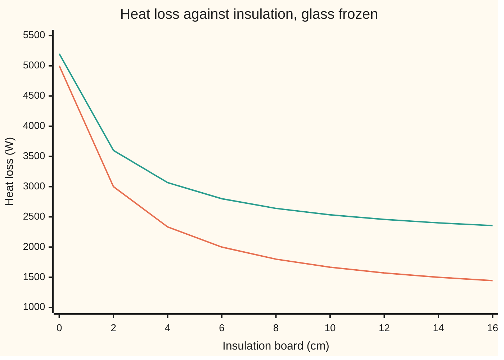

# Partial derivatives: change one input, freeze the rest

[Syllabus](../../../SYLLABUS.md) → [Calculus and analysis](../../../SYLLABUS.md#w06) → [Several Variables](../../../SYLLABUS.md#w06-s07) → Partial derivatives

---

## General Overview

A house has 120 m^2 of outside wall: some glass, the rest brick lined with insulation board. It is 20 °C warmer inside than out. With 6 cm of board and 20 m^2 of glass, the house loses 2,000 watts: 1,000 through the walls, 1,000 through the glass.

To compare a centimetre more board with a square metre less glass, move one and keep the other where it is. More board, glass kept at 20 m^2: each centimetre saves about 125 W. More glass, board kept at 6 cm: each square metre costs 40 W.

Each is an ordinary derivative, taken with every other input frozen: a **partial derivative**, the term used from here on. The choices also interact. More glass means less wall, so it changes what board is worth; board changes what glass costs. The two cross-effects are the same number, and the card proves why.

**A partial derivative is the rate of the output when one input moves and all others are held fixed; the two mixed rates, one partial stepped along the other input, agree when they are continuous.**

**What kind of fact this is:** a definition; one theorem rides with it (the mixed rates agree, called Clairaut's theorem), proved on this card in Why it works.

### The picture: two frozen slices



Orange: 20 m^2 of glass. Green: 40 m^2. Each curve is a slice with the glass frozen; its slope is the board partial: at 6 cm, −125 W per cm on orange, −100 on green. The gap between slopes is the mixed rate at work.

---

## The formula

Notation first, in words. A partial derivative is written with a curly d, ∂, read "partial": $\frac{\partial Q}{\partial t}$ is "the rate of Q per unit of t, all else held fixed". A derivative is the limit of average rates ([The derivative](../02-Derivatives/01-the-derivative.md)).

The heat loss in watts, with $t$ cm of board and $g$ m^2 of glass, is

$$Q(t,g) = \Delta T\left(\frac{A-g}{R(t)} + Ug\right), \qquad R(t) = 0.5 + \frac{t}{4}$$

Each partial is the one-input derivative, with the other input frozen:

$$\frac{\partial Q}{\partial t} = \lim_{h\to 0}\frac{Q(t+h,g) - Q(t,g)}{h}, \qquad \frac{\partial Q}{\partial g} = \lim_{k\to 0}\frac{Q(t,g+k) - Q(t,g)}{k}$$

**Read it aloud:** step the board by h with the glass frozen, divide the change in heat loss by h, and let h shrink; likewise for glass.

A partial of a partial is a **second partial**. A **mixed** one is written right to left: $\frac{\partial^2 Q}{\partial g\,\partial t}$ means "the rate in t first, then the rate of that in g". The theorem:

$$\frac{\partial^2 Q}{\partial g\,\partial t} = \frac{\partial^2 Q}{\partial t\,\partial g}$$

**Read it aloud:** how much glass changes the value of board equals how much board changes the cost of glass.

| Symbol | Plain meaning | In our example | Push it up and the answer… |
| --- | --- | --- | --- |
| $Q(t, g)$ | heat loss, watts | 2,000 W | — |
| $t$ | insulation board, cm | 6 cm | loss falls, by less each cm |
| $g$ | glass area, m^2, taken out of the wall | 20 m^2 | loss rises 40 W per m^2 |
| $R(t)$ | wall's resistance to heat, m^2 °C per W: brick alone 0.5, and each cm of board (0.01 m conducting 0.04 W per m per °C) adds 0.25 | 2.00 at 6 cm | wall leaks less |
| $A$, $\Delta T$, $U$ | whole wall area; temperature gap; glass's loss per m^2 per °C | 120 m^2; 20 °C; 2.5 W | $\Delta T$ scales every rate; $A$ only the board rate; $U$ only the glass rate |
| $h$, $k$ | steps in board (cm) and glass (m^2), never 0 | 1 down to 0.001 | quotient drifts from the rate |
| $\frac{\partial Q}{\partial t}$, $\frac{\partial Q}{\partial g}$ | the partials: output units per unit of the input moved | −125 W per cm, 40 W per m^2 | — |
| $\frac{\partial^2 Q}{\partial g\,\partial t}$, $\frac{\partial^2 Q}{\partial t\,\partial g}$ | the mixed partials, W per cm per m^2 | 1.25 both | — |

### When it holds

- **The frozen inputs are named.** The total 120 m^2 stays fixed; freezing the brick area instead gives 50 W per m^2.
- **The one-input limit exists.** A corner or a jump along the line where only that input moves leaves no partial there.
- **For the mixed partials to agree: second partials continuous near the point.** Without it, G in Why it works gives −1 and +1.
- **Partials see only two directions.** A function can have both and still jump along a diagonal; see [Tangent planes](02-differentiability-and-tangent-planes.md).

---

## Why it works

### Step 0: a frozen input is a constant

With the glass fixed, heat loss is a function of the board alone, and every one-input rule applies. A partial needs only a decision about what stays still.

### Step 1: the board rate, from the definition

At 6 cm the resistance is 2.00, and 100 m^2 of wall lose 20 × 100 / 2 = 1,000 W. Step the board by $h$ cm: the wall loss becomes 2,000 / (2 + h/4), and the glass term does not move. So

$$\frac{Q(6+h,20) - Q(6,20)}{h} = \frac{1}{h}\left(\frac{2000}{2+h/4} - 1000\right) = \frac{-1000}{8+h}$$

Dividing by h is allowed because h is not zero. As h heads for 0 the quotient heads for **−125 W per cm**.

The tolerance game: the quotient is off by 125h / (8 + h), so to land within 0.1 W per cm of −125, any step under 0.8 / 124.9, about 0.006405 cm, will do.

For any setting, the quotient rule ([Product and quotient rules](../02-Derivatives/02-product-and-quotient-rules.md)) gives

$$\frac{\partial Q}{\partial t} = -\frac{\Delta T\,(A-g)}{4\,R(t)^2}$$

At 14 cm it is −31.25 W per cm, a quarter of the rate at 6 cm: board has diminishing returns.

### Step 2: the glass rate is a straight line

Freeze the board at 6 cm and add $k$ m^2 of glass. The glass loses 20 × 2.5 × k = 50k W more; the smaller wall loses 20 × k / 2 = 10k W less. The quotient is 40 for every step: **40 W per m^2**. In general

$$\frac{\partial Q}{\partial g} = \Delta T\left(U - \frac{1}{R(t)}\right)$$

each square metre swapped costs the glass's loss minus the wall's. At 14 cm it is 45: a better wall makes glass dearer.

### Step 3: the two mixed rates, separately

Board at 6 cm, glass free: the board rate is −20 × (120 − g) / 16 = −150 + 1.25g, whose rate in g is **1.25**. More glass leaves less wall for board to cover.

Glass at 20 m^2, board free: the glass rate is 50 − 80 / (2 + t). Stepping t by h from 6 gives the quotient 10 / (8 + h), heading for **1.25**. More board makes the wall that glass replaces leak less.

On the chart, 20 m^2 more glass moved the slope from −125 to −100: 20 times 1.25.

### Step 4: why the orders must agree

Read the heat loss at the four corners of a small rectangle, board $t$ and $t + h$, glass $g$ and $g + k$:

$$\text{corners} = Q(t{+}h,g{+}k) - Q(t{+}h,g) - Q(t,g{+}k) + Q(t,g)$$

Grouped one way it is a board step's effect changing with glass; grouped the other, a glass step's effect changing with board. Divided by hk it approximates both mixed partials: 1.111111 at h = k = 1, 1.234568 at 0.1, 1.249844 at 0.001.

The mean value theorem ([Mean value theorem](../03-What%20Derivatives%20Tell%20You/02-mean-value-theorem.md)), used twice, makes that quotient equal each mixed partial somewhere inside the rectangle. Shrink it, and continuity drags both values to one limit.

<details>
<summary>Detailed proof</summary>

Assume both mixed partials exist and are continuous near (t, g). Fix small nonzero h and k; call the corners quantity D.

Let φ(s) = Q(s, g + k) − Q(s, g), so D = φ(t + h) − φ(t). The mean value theorem gives s1 between t and t + h with D = h × [∂Q/∂t(s1, g + k) − ∂Q/∂t(s1, g)]. Applied again in the glass, it gives g1 between g and g + k with D = hk × (∂^2 Q/∂g∂t)(s1, g1).

With ψ(u) = Q(t + h, u) − Q(t, u) the same two steps give D = hk × (∂^2 Q/∂t∂g)(s2, g2), inside the same rectangle.

Given ε above 0, continuity gives δ above 0 within which each mixed partial stays within ε of its value at (t, g). With |h| + |k| below δ, both values at (t, g) lie within ε of D / (hk), so within 2ε of each other. As ε was arbitrary, they are equal.

</details>

The hypothesis matters. Take G, a function of inputs x and y, equal to 0 at the origin and elsewhere to

$$G(x, y) = \frac{x\,y\,(x^2 - y^2)}{x^2 + y^2}$$

Its x-rate along the y-axis is −y; its y-rate along the x-axis is x. So the mixed partial is −1 taking x first, +1 taking y first. The corners quotient at the origin, (h^2 − k^2) / (h^2 + k^2), has no single limit, because G's second partials jump there.

---

## Worked numbers, by hand

| Step | Arithmetic | Value |
| --- | --- | --- |
| Wall resistance at 6 cm | 0.5 + 6 / 4 | 2.00 |
| Wall and glass loss | 20 × 100 / 2; 20 × 2.5 × 20 | 1,000 W each |
| Board step of 1 cm | −1000 / 9 | −111.1111 W per cm |
| Board step of 0.001 cm | −1000 / 8.001 | −124.9844 W per cm |
| Board rate | −1000 / 8 | **−125 W per cm** |
| Glass rate, any step | 20 × (2.5 − 1 / 2) | **40 W per m^2** |
| Mixed rate, both orders | 20 / (4 × 2 × 2) | **1.25 W per cm per m^2** |

Each square metre of glass makes a centimetre of board worth 1.25 W less.

### What breaks if you drop a piece

| Mistake | Comes out at | What went wrong |
| --- | --- | --- |
| Glass added on top of 120 m^2 of wall | glass 50.00 W per m^2, mixed 0.00 | froze the brick area, not the total |
| Rate read as a whole-centimetre change | −125.00 predicted, −111.11 W actual | a finite step bends away from the rate |
| Swapping the order on G | −1 one way, +1 the other | second partials jump; the hypothesis is gone |

---

## Code, from first principles, and it actually runs

Two independent roads to each rate: raw difference quotients over shrinking steps, and the hand algebra. The mixed rate comes three ways: the corners, and each hand formula stepped in the other input. G, the mistakes and every chart point are printed too.

### Python

```python
# Partial derivatives -- the check behind the card.  Nothing is imported.
# A house loses heat through walls and windows: Q(t, g) = DT ((A - g) / R(t) + U g)
# watts, where t is cm of insulation, g is square metres of glass (glass replaces
# wall), and R(t) = 0.5 + t / 4 is the wall's resistance.  Each rate is reached by
# two roads: raw difference quotients over shrinking steps, and the hand formula.
A, DT, U, T0, G0 = 120.0, 20.0, 2.5, 6.0, 20.0

def R(t): return 0.5 + t / 4                          # wall resistance, m2 K per W
def Q(t, g): return DT * ((A - g) / R(t) + U * g)     # heat loss, watts
def qt(t, g, h): return (Q(t + h, g) - Q(t, g)) / h   # freeze glass, step insulation
def qg(t, g, k): return (Q(t, g + k) - Q(t, g)) / k   # freeze insulation, step glass
def Qt(t, g): return -DT * (A - g) / (4 * R(t) ** 2)  # hand formula, W per cm
def Qg(t, g): return DT * (U - 1 / R(t))              # hand formula, W per m2
def box(t, g, h, k): return (Q(t + h, g + k) - Q(t + h, g) - Q(t, g + k) + Q(t, g)) / (h * k)
def G(x, y): return 0.0 if x == y == 0 else x * y * (x * x - y * y) / (x * x + y * y)

print(f"model: {A:.0f} m2 of wall in all, {DT:.0f} C warmer inside, glass {U} W per m2 per C, "
      f"wall resistance {R(0)} + {R(1) - R(0)} per cm (0.01 m / 0.04)")
print(f"heat loss at t = 6 cm, g = 20 m2: {Q(T0, G0):.2f} W (wall resistance {R(T0):.2f}, "
      f"walls {DT * (A - G0) / R(T0):.2f}, glass {DT * U * G0:.2f})")
for h in [1, 0.1, 0.01, 0.001]:
    q = qt(T0, G0, h)
    print(f"insulation step {h} cm: quotient {q:.4f} W per cm, algebra {-1000 / (8 + h):.4f}, off by {abs(q - Qt(T0, G0)):.4f}")
    assert abs(q - (-1000 / (8 + h))) < 1e-8              # raw road == hand algebra
print(f"glass steps 1, 0.1, 0.01 m2: quotients {', '.join(f'{qg(T0, G0, k):.4f}' for k in [1, 0.1, 0.01])}; "
      f"formula {Qg(T0, G0):.4f} W per m2")
assert abs(qg(T0, G0, 0.01) - Qg(T0, G0)) < 1e-8 and abs(qt(T0, G0, 1e-6) - Qt(T0, G0)) < 1e-3
lo, hi = 0.0, 1.0                                         # halve to the widest step within 0.1
for _ in range(60):
    mid = (lo + hi) / 2
    lo, hi = (mid, hi) if abs(qt(T0, G0, mid) - Qt(T0, G0)) <= 0.1 else (lo, mid)
print(f"to land within 0.1 W per cm of -125: widest step by halving {lo:.6f} cm; algebra 0.8/124.9 = {0.8 / 124.9:.6f}")
for s in [1, 0.1, 0.001]:
    print(f"mixed, four corners {s} cm by {s} m2: {box(T0, G0, s, s):.6f} W per cm per m2")
tg = (Qt(T0, G0 + 1e-6) - Qt(T0, G0)) / 1e-6              # insulation rate, stepped in glass
gt = (Qg(T0 + 1e-6, G0) - Qg(T0, G0)) / 1e-6              # glass rate, stepped in insulation
print(f"mixed, insulation then glass {tg:.4f}; glass then insulation {gt:.4f}; hand {DT / (4 * R(T0) ** 2):.4f}")
assert abs(tg - 1.25) < 1e-4 and abs(gt - 1.25) < 1e-4 and abs(box(T0, G0, 1e-3, 1e-3) - 1.25) < 1e-3
print(f"one more cm: exact change {Q(7, G0) - Q(T0, G0):.2f} W, the rate predicts {Qt(T0, G0):.2f} W")
print(f"second case, t = 14 cm: insulation {Qt(14, G0):.4f} (step 0.001: {qt(14, G0, 0.001):.4f}) W per cm; glass {Qg(14, G0):.4f} W per m2")
e, n = 1e-7, 1e-3                                         # inner step far below outer step
xy = ((G(e, n) - G(0, n)) / e - (G(e, 0) - G(0, 0)) / e) / n    # x first, then y
yx = ((G(n, e) - G(n, 0)) / e - (G(0, e) - G(0, 0)) / e) / n    # y first, then x
print(f"counterexample G at the origin: x then y {xy:.6f}, y then x {yx:.6f}")
assert abs(xy + 1) < 1e-4 and abs(yx - 1) < 1e-4              # hand limits: -1 and +1
Qw = lambda t, g: DT * (A / R(t) + U * g)                 # mistake: glass added on top of 120 m2 of wall
print(f"mistake, walls kept at 120 m2: glass rate {(Qw(T0, G0 + 1) - Qw(T0, G0)):.2f} W per m2, mixed "
      f"{(Qw(T0 + 1, G0 + 1) - Qw(T0 + 1, G0) - Qw(T0, G0 + 1) + Qw(T0, G0)):.2f}")
for g in [20, 40]:
    print(f"chart, g = {g}: " + " ".join(f"{Q(t, g):.2f}" for t in range(0, 17, 2)) + f"; slope at 6 cm {Qt(T0, g):.2f}")
print("ALL CHECKS PASS")
```

**Ran 2026-09-27 on macOS, Python 3.14.6, standard library only. All checks passed. Output, pasted from the run:**

```
model: 120 m2 of wall in all, 20 C warmer inside, glass 2.5 W per m2 per C, wall resistance 0.5 + 0.25 per cm (0.01 m / 0.04)
heat loss at t = 6 cm, g = 20 m2: 2000.00 W (wall resistance 2.00, walls 1000.00, glass 1000.00)
insulation step 1 cm: quotient -111.1111 W per cm, algebra -111.1111, off by 13.8889
insulation step 0.1 cm: quotient -123.4568 W per cm, algebra -123.4568, off by 1.5432
insulation step 0.01 cm: quotient -124.8439 W per cm, algebra -124.8439, off by 0.1561
insulation step 0.001 cm: quotient -124.9844 W per cm, algebra -124.9844, off by 0.0156
glass steps 1, 0.1, 0.01 m2: quotients 40.0000, 40.0000, 40.0000; formula 40.0000 W per m2
to land within 0.1 W per cm of -125: widest step by halving 0.006405 cm; algebra 0.8/124.9 = 0.006405
mixed, four corners 1 cm by 1 m2: 1.111111 W per cm per m2
mixed, four corners 0.1 cm by 0.1 m2: 1.234568 W per cm per m2
mixed, four corners 0.001 cm by 0.001 m2: 1.249844 W per cm per m2
mixed, insulation then glass 1.2500; glass then insulation 1.2500; hand 1.2500
one more cm: exact change -111.11 W, the rate predicts -125.00 W
second case, t = 14 cm: insulation -31.2500 (step 0.001: -31.2480) W per cm; glass 45.0000 W per m2
counterexample G at the origin: x then y -1.000000, y then x 1.000000
mistake, walls kept at 120 m2: glass rate 50.00 W per m2, mixed 0.00
chart, g = 20: 5000.00 3000.00 2333.33 2000.00 1800.00 1666.67 1571.43 1500.00 1444.44; slope at 6 cm -125.00
chart, g = 40: 5200.00 3600.00 3066.67 2800.00 2640.00 2533.33 2457.14 2400.00 2355.56; slope at 6 cm -100.00
ALL CHECKS PASS
```

### Rust

```rust
// Partial derivatives -- the check behind the card.  std only.
// A house loses heat through walls and windows: Q(t, g) = DT ((A - g) / R(t) + U g)
// watts, where t is cm of insulation, g is square metres of glass (glass replaces
// wall), and R(t) = 0.5 + t / 4 is the wall's resistance.  Each rate is reached by
// two roads: raw difference quotients over shrinking steps, and the hand formula.
const A: f64 = 120.0;
const DT: f64 = 20.0;
const U: f64 = 2.5;
const T0: f64 = 6.0;
const G0: f64 = 20.0;

fn r(t: f64) -> f64 { 0.5 + t / 4.0 } // wall resistance, m2 K per W
fn q(t: f64, g: f64) -> f64 { DT * ((A - g) / r(t) + U * g) } // heat loss, watts
fn qt(t: f64, g: f64, h: f64) -> f64 { (q(t + h, g) - q(t, g)) / h } // freeze glass, step insulation
fn qg(t: f64, g: f64, k: f64) -> f64 { (q(t, g + k) - q(t, g)) / k } // freeze insulation, step glass
fn qt_f(t: f64, g: f64) -> f64 { -DT * (A - g) / (4.0 * r(t) * r(t)) } // hand formula, W per cm
fn qg_f(t: f64) -> f64 { DT * (U - 1.0 / r(t)) } // hand formula, W per m2
fn bx(t: f64, g: f64, h: f64, k: f64) -> f64 { (q(t + h, g + k) - q(t + h, g) - q(t, g + k) + q(t, g)) / (h * k) }
fn gg(x: f64, y: f64) -> f64 { if x == 0.0 && y == 0.0 { 0.0 } else { x * y * (x * x - y * y) / (x * x + y * y) } }

fn main() {
    println!("model: {:.0} m2 of wall in all, {:.0} C warmer inside, glass {} W per m2 per C, wall resistance {} + {} per cm (0.01 m / 0.04)",
        A, DT, U, r(0.0), r(1.0) - r(0.0));
    println!("heat loss at t = 6 cm, g = 20 m2: {:.2} W (wall resistance {:.2}, walls {:.2}, glass {:.2})",
        q(T0, G0), r(T0), DT * (A - G0) / r(T0), DT * U * G0);
    for (h, lab) in [(1.0, "1"), (0.1, "0.1"), (0.01, "0.01"), (0.001, "0.001")] {
        let v = qt(T0, G0, h);
        println!("insulation step {} cm: quotient {:.4} W per cm, algebra {:.4}, off by {:.4}",
            lab, v, -1000.0 / (8.0 + h), (v - qt_f(T0, G0)).abs());
        assert!((v - (-1000.0 / (8.0 + h))).abs() < 1e-8); // raw road == hand algebra
    }
    let gs: Vec<String> = [1.0, 0.1, 0.01].iter().map(|&k| format!("{:.4}", qg(T0, G0, k))).collect();
    println!("glass steps 1, 0.1, 0.01 m2: quotients {}; formula {:.4} W per m2", gs.join(", "), qg_f(T0));
    assert!((qg(T0, G0, 0.01) - qg_f(T0)).abs() < 1e-8 && (qt(T0, G0, 1e-6) - qt_f(T0, G0)).abs() < 1e-3);
    let (mut lo, mut hi) = (0.0_f64, 1.0_f64); // halve to the widest step within 0.1
    for _ in 0..60 {
        let mid = (lo + hi) / 2.0;
        if (qt(T0, G0, mid) - qt_f(T0, G0)).abs() <= 0.1 { lo = mid } else { hi = mid }
    }
    println!("to land within 0.1 W per cm of -125: widest step by halving {:.6} cm; algebra 0.8/124.9 = {:.6}", lo, 0.8 / 124.9);
    for (s, lab) in [(1.0, "1"), (0.1, "0.1"), (0.001, "0.001")] {
        println!("mixed, four corners {} cm by {} m2: {:.6} W per cm per m2", lab, lab, bx(T0, G0, s, s));
    }
    let tg = (qt_f(T0, G0 + 1e-6) - qt_f(T0, G0)) / 1e-6; // insulation rate, stepped in glass
    let gt = (qg_f(T0 + 1e-6) - qg_f(T0)) / 1e-6; // glass rate, stepped in insulation
    println!("mixed, insulation then glass {:.4}; glass then insulation {:.4}; hand {:.4}", tg, gt, DT / (4.0 * r(T0) * r(T0)));
    assert!((tg - 1.25).abs() < 1e-4 && (gt - 1.25).abs() < 1e-4 && (bx(T0, G0, 1e-3, 1e-3) - 1.25).abs() < 1e-3);
    println!("one more cm: exact change {:.2} W, the rate predicts {:.2} W", q(7.0, G0) - q(T0, G0), qt_f(T0, G0));
    println!("second case, t = 14 cm: insulation {:.4} (step 0.001: {:.4}) W per cm; glass {:.4} W per m2",
        qt_f(14.0, G0), qt(14.0, G0, 0.001), qg_f(14.0));
    let (e, n) = (1e-7, 1e-3); // inner step far below outer step
    let xy = ((gg(e, n) - gg(0.0, n)) / e - (gg(e, 0.0) - gg(0.0, 0.0)) / e) / n; // x first, then y
    let yx = ((gg(n, e) - gg(n, 0.0)) / e - (gg(0.0, e) - gg(0.0, 0.0)) / e) / n; // y first, then x
    println!("counterexample G at the origin: x then y {:.6}, y then x {:.6}", xy, yx);
    assert!((xy + 1.0).abs() < 1e-4 && (yx - 1.0).abs() < 1e-4); // hand limits: -1 and +1
    let qw = |t: f64, g: f64| DT * (A / r(t) + U * g); // mistake: glass added on top of 120 m2 of wall
    println!("mistake, walls kept at 120 m2: glass rate {:.2} W per m2, mixed {:.2}", qw(T0, G0 + 1.0) - qw(T0, G0),
        qw(T0 + 1.0, G0 + 1.0) - qw(T0 + 1.0, G0) - qw(T0, G0 + 1.0) + qw(T0, G0));
    for g in [20.0, 40.0] {
        let pts: Vec<String> = (0..9).map(|i| format!("{:.2}", q(2.0 * i as f64, g))).collect();
        println!("chart, g = {}: {}; slope at 6 cm {:.2}", g, pts.join(" "), qt_f(T0, g));
    }
    println!("ALL CHECKS PASS");
}
```

**Ran 2026-09-27 on macOS, rustc 1.98.1, no crates. All checks passed. Output, pasted from the run:**

```
model: 120 m2 of wall in all, 20 C warmer inside, glass 2.5 W per m2 per C, wall resistance 0.5 + 0.25 per cm (0.01 m / 0.04)
heat loss at t = 6 cm, g = 20 m2: 2000.00 W (wall resistance 2.00, walls 1000.00, glass 1000.00)
insulation step 1 cm: quotient -111.1111 W per cm, algebra -111.1111, off by 13.8889
insulation step 0.1 cm: quotient -123.4568 W per cm, algebra -123.4568, off by 1.5432
insulation step 0.01 cm: quotient -124.8439 W per cm, algebra -124.8439, off by 0.1561
insulation step 0.001 cm: quotient -124.9844 W per cm, algebra -124.9844, off by 0.0156
glass steps 1, 0.1, 0.01 m2: quotients 40.0000, 40.0000, 40.0000; formula 40.0000 W per m2
to land within 0.1 W per cm of -125: widest step by halving 0.006405 cm; algebra 0.8/124.9 = 0.006405
mixed, four corners 1 cm by 1 m2: 1.111111 W per cm per m2
mixed, four corners 0.1 cm by 0.1 m2: 1.234568 W per cm per m2
mixed, four corners 0.001 cm by 0.001 m2: 1.249844 W per cm per m2
mixed, insulation then glass 1.2500; glass then insulation 1.2500; hand 1.2500
one more cm: exact change -111.11 W, the rate predicts -125.00 W
second case, t = 14 cm: insulation -31.2500 (step 0.001: -31.2480) W per cm; glass 45.0000 W per m2
counterexample G at the origin: x then y -1.000000, y then x 1.000000
mistake, walls kept at 120 m2: glass rate 50.00 W per m2, mixed 0.00
chart, g = 20: 5000.00 3000.00 2333.33 2000.00 1800.00 1666.67 1571.43 1500.00 1444.44; slope at 6 cm -125.00
chart, g = 40: 5200.00 3600.00 3066.67 2800.00 2640.00 2533.33 2457.14 2400.00 2355.56; slope at 6 cm -100.00
ALL CHECKS PASS
```

The two outputs agree line for line.

> [!TIP]
> **Try changing**
> Guess first, then run it.
> - **Better glass.** Set `U = 0.5`. The glass rate reads 0.0000: at 6 cm wall and glass leak alike.
> - **Thicker board.** Set `T0 = 14.0`. The first assert stops the run: −1000 / (8 + h) was worked at 6 cm.
> - **Equal steps on G.** Set `e` equal to `n`. Both orders read 0.000000 and the G assert stops the run: the order of the limits is what separated −1 from +1.

---

## The usual mistake

> [!warning]
> **Not naming what is held fixed.** "Heat loss per square metre of glass" is 40 W with the total wall fixed and 50 with the brick fixed: partials of two different functions.
>
> - **Treating a rate as a change.** One more centimetre saves 111.11 W, not 125; the rate is exact only in the limit.
> - **Reading the order backwards.** $\frac{\partial^2 Q}{\partial g\,\partial t}$ takes the t-rate first. For the house it makes no difference; for G it flips −1 to +1.
> - **Ranking rates in different units.** W per cm against W per m^2 is settled by prices, not sizes.

---

## Where you meet it in real life

- **Option risk.** Each Greek is a partial of an option's price: [Delta](../../12-Financial%20mathematics/09-The%20Greeks%2C%20one%20each/01-delta.md) in the stock price, [Vega](../../12-Financial%20mathematics/09-The%20Greeks%2C%20one%20each/03-vega.md) in volatility. [Vanna](../../12-Financial%20mathematics/09-The%20Greeks%2C%20one%20each/06-vanna.md) is a mixed partial, one value either way.
- **Thermodynamics.** Equal mixed partials link tabulated rates (The thermodynamic laws).

> **Say it back**
> A function of several inputs has one rate per input: move it, freeze the rest, take the ordinary derivative. Board saves 125 W per centimetre; glass costs 40 W per square metre. Glass changes board's value by 1.25, and board changes glass's cost by the same 1.25. Mixed partials agree when continuous; G shows they can differ otherwise.

---

## What this builds on

- [The derivative](../02-Derivatives/01-the-derivative.md): the limit of average rates, used here one input at a time.

## Where this goes next

- [Tangent planes](02-differentiability-and-tangent-planes.md): one tangent plane.
- [Differentiating under the integral](../08-Multiple%20Integrals/05-differentiating-under-the-integral.md): an integral's partial.
- [Divergence and curl](../09-Vector%20Calculus/03-divergence-and-curl.md): spreading and spin.
- [The complex derivative](../../07-Complex%20analysis/02-Holomorphic%20Functions/01-complex-derivative-and-cauchy-riemann.md), [Harmonic functions](../../07-Complex%20analysis/07-Conformal%20Maps%20and%20Harmonic%20Functions/04-harmonic-functions-and-conjugates.md): partials forced to match.
- [Exact equations](../../08-Differential%20equations%20and%20dynamics/01-Rate%20Equations/08-exact-equations.md): mixed partials as a test.
- [Linearisation](../../08-Differential%20equations%20and%20dynamics/06-Nonlinear%20Dynamics%20in%20the%20Plane/02-linearisation-and-the-jacobian.md): partials near a rest point.
- [A partial differential equation](../../08-Differential%20equations%20and%20dynamics/10-The%20Classical%20PDEs/01-what-a-pde-says.md), A PDE problem: equations in partials.
- [The Euler-Lagrange equation](../../08-Differential%20equations%20and%20dynamics/12-Calculus%20of%20Variations%20and%20Optimal%20Control/01-functionals-and-the-euler-lagrange-equation.md): partials of a cost.
- [The Black-Scholes equation](../../12-Financial%20mathematics/08-The%20Black-Scholes%20call%20and%20put/07-black-scholes-equation.md): an option's partials.
- [Delta](../../12-Financial%20mathematics/09-The%20Greeks%2C%20one%20each/01-delta.md), [Gamma](../../12-Financial%20mathematics/09-The%20Greeks%2C%20one%20each/02-gamma.md), [Vega](../../12-Financial%20mathematics/09-The%20Greeks%2C%20one%20each/03-vega.md), [Theta](../../12-Financial%20mathematics/09-The%20Greeks%2C%20one%20each/04-theta.md), [Rho and dividend rho](../../12-Financial%20mathematics/09-The%20Greeks%2C%20one%20each/05-rho-and-dividend-rho.md): one input at a time.
- [Vanna](../../12-Financial%20mathematics/09-The%20Greeks%2C%20one%20each/06-vanna.md), [Volga](../../12-Financial%20mathematics/09-The%20Greeks%2C%20one%20each/07-volga.md), [Charm](../../12-Financial%20mathematics/09-The%20Greeks%2C%20one%20each/08-charm.md): mixed and second partials.
- [Digital Greeks and pin risk](../../12-Financial%20mathematics/10-Digitals%20and%20the%20implied%20density/03-digital-greeks-and-pin-risk.md), [The Greeks of a currency option](../../12-Financial%20mathematics/21-FX%20vanilla%20options%20-%20Garman-Kohlhagen%20and%20the%20desk%20conventions/03-garman-kohlhagen-greeks.md), [Vanna and volga](../../12-Financial%20mathematics/22-The%20FX%20smile%20-%20risk%20reversals%2C%20butterflies%20and%20vanna-volga/03-vanna-and-volga-on-the-smile.md), [Greeks of a spread option](../../12-Financial%20mathematics/26-Options%20on%20commodity%20futures%20and%20spreads/05-spread-option-greeks.md): other contracts.
- [Dupire local volatility](../../12-Financial%20mathematics/13-Local%20volatility%20and%20jumps/01-dupire-local-volatility.md): volatility from partials.
- The thermodynamic laws: the frozen quantity named.
- Finite differences on a grid, Two space dimensions: quotients on grids.
- Weak derivatives: rough functions.
- Smooth and singular points: all partials vanishing.
- Levi-Civita connection: curved distance.

Partials see two lines only, board alone or glass alone; whether they predict a change in both at once is [Tangent planes](02-differentiability-and-tangent-planes.md).

---

## Sources

Verified 2026-09-27: every link below resolves to the publisher's page.

- Strang, Gilbert, and Edwin Herman. *Calculus Volume 3*. OpenStax, 2016. [Section 4.3, Partial Derivatives](https://openstax.org/books/calculus-volume-3/pages/4-3-partial-derivatives). Definition, higher partials, Clairaut's theorem.
- Ling, Samuel J., Jeff Sanny, and William Moebs. *University Physics Volume 2*. OpenStax, 2016. [Section 1.6, Mechanisms of Heat Transfer](https://openstax.org/books/university-physics-volume-2/pages/1-6-mechanisms-of-heat-transfer). Conduction and the R factor behind the house model.
- Auroux, Denis. *18.02SC Multivariable Calculus*. MIT OpenCourseWare, 2010. [Course page](https://ocw.mit.edu/courses/18-02sc-multivariable-calculus-fall-2010/). Lectures and problems on partials.
- O'Connor, J. J., and E. F. Robertson. "Alexis Clairaut." MacTutor Archive, University of St Andrews. [Biography](https://mathshistory.st-andrews.ac.uk/Biographies/Clairaut/). Dates his 1739 and 1740 work on integrating factors.
