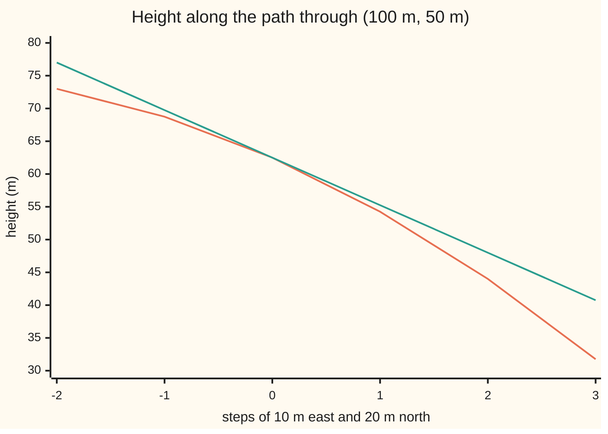

# Tangent planes: the linear model of a surface, and the honest definition of differentiable

[Syllabus](../../../SYLLABUS.md) → [Calculus and analysis](../../../SYLLABUS.md#w06) → [Several Variables](../../../SYLLABUS.md#w06-s07) → Tangent planes

---

## General Overview

A surveyor stands on a grassy hillside, 100 m east and 50 m north of a peg. The ground there stands 62.5 m high. It falls 0.225 m per metre walked due east and 0.25 m per metre due north: the hill's partial derivatives, slopes along one compass line at a time ([Partial derivatives](01-partial-derivatives.md)).

Lay a flat board on the ground there, tilted to match both slopes. It predicts the height at every nearby point, in every direction. That board is the **tangent plane**, the term used from here on. Walk 10 m east and 20 m north: the plane says 55.25 m, the hill is at 54.25 m.

When is the plane a trustworthy stand-in? Two slopes, measured along two lines, can fail to fix it; the card gives the test that decides.

**A surface is differentiable at a point when one plane matches it so closely that the height error, divided by the step length, heads for zero in every direction at once; continuous slopes guarantee it, and the two slopes build the plane.**

**What kind of fact this is:** a definition; the test by continuous slopes is a theorem, proved on this card in Why it works.

### The picture: hill and plane along one path



Orange: the hill's height along the path. Green: the tangent plane's height along the same path. They touch at step 0, where the surveyor stands; one step out the plane sits 1.0 m above the grass, and the gap grows as the square of the distance.

---

## The formula

Notation first, in words. A point on the map is written $(x, y)$: $x$ metres east and $y$ metres north of the peg. The hill's height there is $f(x, y)$. The slope east is written $f_x$, short for the partial derivative $\partial f/\partial x$; the slope north is $f_y$. The surveyor's point is $(a, b)$ = (100, 50). A step from there is $h$ metres east and $k$ metres north; its length on the map is $\rho$ (rho), by Pythagoras $\rho = \sqrt{h^2 + k^2}$.

The tangent plane at $(a, b)$ is the flat surface of heights

$$z = f(a,b) + f_x(a,b)\,(x - a) + f_y(a,b)\,(y - b)$$

**Read it aloud:** start at the height here, then add the east slope times the distance east and the north slope times the distance north.

The **remainder** $R$ is the true height minus the plane's height, after a step $(h, k)$:

$$R(h,k) = f(a+h,\, b+k) - \big[f(a,b) + f_x(a,b)\,h + f_y(a,b)\,k\big]$$

The definition. The hill is **differentiable** at $(a, b)$ when

$$\frac{R(h,k)}{\rho} \to 0 \quad \text{as } \rho \to 0, \text{ from every direction at once}$$

**Read it aloud:** the plane's error, measured per metre of step, heads for zero however the step shrinks.

"Every direction at once" is the honest part: for any tolerance, one radius must serve every step inside it, east, north or slanting.

The arrow $(-f_x, -f_y, 1)$, here (0.225, 0.250, 1), stands straight out of the plane, its **normal**: every arrow lying in the plane has zero dot product with it ([The dot product](../../03-Algebra/06-Dot%20Products%20and%20Best%20Fits/01-dot-product.md)).

| Symbol | Plain meaning | In our example | Push it up and the answer… |
| --- | --- | --- | --- |
| $f$, $z$ | height of the hill; height of the plane | 62.5 m at the surveyor | — |
| $x$, $y$ | metres east and north of the peg | any nearby point | — |
| $a$, $b$ | the point where the plane touches | 100 m, 50 m | new point, new plane |
| $h$, $k$ | a step east and north from there | 10 m, 20 m | remainder grows as step squared |
| $f_x$, $f_y$ | slope east and slope north, metres of height per metre walked | −0.225, −0.25 | plane tilts more steeply |
| $\rho$ | length of the step on the map | 22.360680 m | error per metre grows |
| $R$ | true height minus plane height | −1.0 m at that step | — |
| $g$, $t$ | a creased surface that fails the test; its distance along the diagonal | $g = xy/\sqrt{x^2+y^2}$ | ratio stays 0.5 |

### When it holds

- **Slopes exist near the point.** The proof walks short lines beside it.
- **Slopes are continuous at the point** (nearby slopes are close to these). Drop this and the crease $g$ below has both slopes zero and no tangent plane.
- **The point is inside the region.** At a cliff edge, outward steps are not allowed.
- **The test is enough, not required.** Some surfaces with jumpy slopes are still differentiable.

---

## Why it works

### Step 0: judge the error per metre of step

On a continuous surface the error shrinks with the step whatever the tilt. Dividing by the step length separates the planes: a wrong tilt leaves an error in proportion to the step, the right one far less.

### Step 1: if a plane works, its slopes are the partial derivatives

Suppose some plane $f(a,b) + Ah + Bk$ passes the test. Step due east, so $k = 0$: the ratio says the east difference quotient minus A heads for zero, so A is the east slope. Stepping north makes B the north slope. The two slopes name the only candidate.

A differentiable surface is also continuous: its height change is the plane's change plus the remainder, and both shrink with the step.

### Step 2: continuous slopes guarantee the plane

Walk from $(a, b)$ to $(a+h, b+k)$ in two legs, east then north. Each leg moves one coordinate, a one-variable problem. The [Mean value theorem](../03-What%20Derivatives%20Tell%20You/02-mean-value-theorem.md) says each leg's height change is its length times the slope at some point along it.

On the hill, walking to (110, 70): the east leg changes the height by −2.35 m, which is 10 × −0.235, the east slope at (105, 50). The north leg by −5.9 m, 20 × −0.295, the north slope at (110, 60). Together, −8.25 m: exactly 62.5 m down to 54.25 m.

The leg slopes are taken near $(a, b)$, not at it. If slopes are continuous, they differ from $f_x$ and $f_y$ by amounts that shrink with the step; the remainder is those differences times $h$ and $k$, so per metre it heads for zero.

<details>
<summary>Detailed proof: continuous partial derivatives imply differentiable</summary>

Let the slopes exist on a disc around (a, b) and be continuous at (a, b); take a step (h, k) of length ρ inside it. The mean value theorem on each leg gives f(a+h, b+k) − f(a, b) = h·f_x(ξ, b) + k·f_y(a+h, η), with ξ between a and a+h and η between b and b+k. Both points lie within ρ of (a, b).

So R = h·α + k·β, with α = f_x(ξ, b) − f_x(a, b) and β = f_y(a+h, η) − f_y(a, b). Given ε > 0, continuity gives δ > 0 with both slope differences below ε/2 at every point within δ. For 0 < ρ < δ, |R| ≤ ε/2·|h| + ε/2·|k| ≤ ε·ρ. So |R|/ρ ≤ ε, one δ serving every direction.

</details>

### Step 3: the hill passes, with numbers

The hill's height is $f(x,y) = 80 - 0.001x^2 - 0.0005xy - 0.002y^2$ metres. Its slopes, $-0.002x - 0.0005y$ east and $-0.0005x - 0.004y$ north, are continuous everywhere, so Step 2 applies. Expanding the height at $(100+h, 50+k)$ gives the remainder exactly:

$$R(h,k) = -\left(0.001h^2 + 0.0005hk + 0.002k^2\right)$$

Since $0.001h^2 + 0.002k^2$ is at most $0.002\rho^2$, and twice $|hk|$ is at most $h^2 + k^2 = \rho^2$, the size of $R$ is at most 0.00225 times $\rho^2$, so the error per metre is at most 0.00225 times $\rho$.

The tolerance game, with numbers: to keep the error below a thousandth of the step in every direction, any step up to 0.44 m works, where the bound gives 0.000990. A scan of 360 directions there finds the worst ratio at 0.000906. Along the surveyor's path, a tenfold shorter step gives a tenfold smaller ratio: −0.044721, −0.004472, −0.000447.

### Step 4: a crease the slopes cannot see

Take the surface $g(x, y) = xy/\sqrt{x^2 + y^2}$, with height 0 at the origin. It is a cone with its tip at the origin: every line through the tip is straight on it, rising over two quarters of the map and falling over the other two. The east and north lines lie flat at height 0, so both slopes at the origin are 0 and the only candidate plane is $z = 0$.

Walk out along the diagonal to the point $(t, t)$. The height is $|t|/\sqrt{2}$ and the step length is $\sqrt{2}\,|t|$, so the ratio is 0.5 however small $t$ is: at $t$ = 0.01 the height is 0.007071 m over a step of 0.014142 m. No tangent plane exists, though both slopes do and the surface is continuous (twice $|xy|$ is at most $x^2 + y^2$, so the height is at most half the step). The broken hypothesis: the east slope is 0.353553 at every diagonal point $(t, t)$ but 0 at the origin, so it is not continuous there.

In one variable the same test is the tangent line of [Linear approximation](../03-What%20Derivatives%20Tell%20You/01-linear-approximation-and-related-rates.md), where one slope is enough.

---

## Worked numbers, by hand

| Step | Arithmetic | Value |
| --- | --- | --- |
| height at the surveyor | f(100, 50) | 62.5 m |
| slope east | −0.002 × 100 − 0.0005 × 50 | −0.225 |
| slope north | −0.0005 × 100 − 0.004 × 50 | −0.25 |
| plane at (110, 70) | 62.5 + 10 × (−0.225) + 20 × (−0.25) | 55.25 m |
| hill at (110, 70) | f(110, 70) | 54.25 m |
| remainder | −(0.001 × 10^2 + 0.0005 × 10 × 20 + 0.002 × 20^2) | **−1.0 m** |
| step length | square root of 10^2 + 20^2 | 22.360680 m |
| error per metre | −1.0 ÷ 22.360680 | **−0.044721** |

A walk of about 22 m leaves the board 1 m above the grass; at a tenth of the walk the gap is 0.01 m.

### What breaks if you drop a piece

| Mistake | Comes out at | What went wrong |
| --- | --- | --- |
| Treating the plane as exact a step away | 55.25 m, against a true 54.25 m | The remainder is −1.0 m |
| Plane from zero slopes on the crease $g$ | $z = 0$ misses 0.007071 m over a 0.014142 m step | Continuity of the slopes was dropped |
| Dropping the shift by $a$ and $b$ | 20.25 m at (110, 70) | Slopes multiply distance from the point, not from the peg |

The code prints all three.

---

## Code, from first principles, and it actually runs

Road one: slopes by formula, remainder by hand expansion. Road two: slopes from shrinking difference quotients, heights evaluated directly, and Step 2's two-leg walk. The asserts check that the roads meet, that no direction at 0.44 m breaks a thousandth, and that the crease keeps its ratio of 0.5.

### Python

```python
# Tangent planes -- the check behind the card.  A hill's height is
# f(x, y) = 80 - 0.001x^2 - 0.0005xy - 0.002y^2 metres, x metres east and y
# metres north of a survey peg.  Road one: slopes by formula, remainder expanded
# by hand.  Road two: slopes from difference quotients, heights evaluated
# directly.  Then the crease g(x, y) = xy / sqrt(x^2 + y^2), whose slopes lie.
from math import sqrt, cos, sin, pi

def f(x, y): return 80 - 0.001 * x * x - 0.0005 * x * y - 0.002 * y * y
def fx(x, y): return -0.002 * x - 0.0005 * y           # slope east, by formula
def fy(x, y): return -0.0005 * x - 0.004 * y           # slope north, by formula
def hand(h, k): return -(0.001 * h * h + 0.0005 * h * k + 0.002 * k * k)
def g(x, y): return 0.0 if x == 0 and y == 0 else x * y / sqrt(x * x + y * y)

A, B = 100.0, 50.0
Z, SX, SY = f(A, B), fx(A, B), fy(A, B)
def plane(x, y): return Z + SX * (x - A) + SY * (y - B)
print(f"hill: f(100, 50) = {Z:.6f} m; slopes by formula f_x = {SX:.6f}, f_y = {SY:.6f}")
qs = [((f(A + s, B) - Z) / s, (f(A, B + s) - Z) / s) for s in (1, 0.1, 0.01, 1e-6)]
print("forward differences, steps 1, 0.1, 0.01: f_x " + ", ".join(f"{q[0]:.6f}" for q in qs[:3])
      + "; f_y " + ", ".join(f"{q[1]:.6f}" for q in qs[:3]))
print(f"normal (-f_x, -f_y, 1) = ({-SX:.3f}, {-SY:.3f}, 1)")
east, north = f(110, 50) - Z, f(110, 70) - f(110, 50)
print(f"two legs: east {east:.6f} = 10 x {fx(105, 50):.6f}, north {north:.6f} = 20 x {fy(110, 60):.6f},"
      f" total {east + north:.6f}")
assert abs(qs[3][0] - SX) + abs(qs[3][1] - SY) < 1e-5 and abs(east - 10 * fx(105, 50)) + abs(north - 20 * fy(110, 60)) < 1e-9
for h, k in ((10, 20), (1, 2), (0.1, 0.2)):
    rho, act = sqrt(h * h + k * k), f(A + h, B + k)
    rem = act - plane(A + h, B + k)
    assert abs(rem - hand(h, k)) < 1e-9               # direct height minus plane = hand expansion
    print(f"step ({h}, {k}): rho {rho:.6f}, actual {act:.6f}, plane {plane(A + h, B + k):.6f},"
          f" remainder {rem:.6f}, by hand {hand(h, k):.6f}, ratio {rem / rho:.6f}")
R0 = 0.44
dirs = [2 * pi * i / 360 for i in range(360)]
worst = max(abs(f(A + R0 * cos(t), B + R0 * sin(t)) - plane(A + R0 * cos(t), B + R0 * sin(t))) for t in dirs) / R0
print(f"worst ratio over 360 directions at rho 0.44 m: {worst:.6f}; hand bound 0.00225 x 0.44 = {0.00225 * R0:.6f}")
assert worst < 0.001 and worst <= 0.00225 * R0
for t in (0.1, 0.01, 0.001):
    ax, ay = (g(t, 0) - g(0, 0)) / t, (g(0, t) - g(0, 0)) / t
    rho = sqrt(2 * t * t)
    ratio, slope = g(t, t) / rho, (g(t + t * 1e-6, t) - g(t, t)) / (t * 1e-6)
    print(f"crease t = {t}: axis quotients {ax:.1f}, {ay:.1f}; g(t, t) = {g(t, t):.6f}, rho {rho:.6f},"
          f" ratio {ratio:.6f}; east slope at (t, t) {slope:.6f}")
    assert ax == ay == 0 and abs(ratio - 0.5) < 1e-9 and abs(slope - 1 / (2 * sqrt(2))) < 1e-5
S = [-2, -1, 0, 1, 2, 3]
print("chart, steps of (10 m east, 20 m north): " + ", ".join(str(s) for s in S))
print("chart, hill (m): " + ", ".join(f"{f(A + 10 * s, B + 20 * s):.2f}" for s in S))
print("chart, plane (m): " + ", ".join(f"{plane(A + 10 * s, B + 20 * s):.2f}" for s in S))
print(f"mistake, plane without the shift, at (110, 70): {Z + SX * 110 + SY * 70:.6f} m")
```

**Ran 2026-09-27 on macOS, Python 3.14.6, standard library only. All checks passed. Output, pasted from the run:**

```
hill: f(100, 50) = 62.500000 m; slopes by formula f_x = -0.225000, f_y = -0.250000
forward differences, steps 1, 0.1, 0.01: f_x -0.226000, -0.225100, -0.225010; f_y -0.252000, -0.250200, -0.250020
normal (-f_x, -f_y, 1) = (0.225, 0.250, 1)
two legs: east -2.350000 = 10 x -0.235000, north -5.900000 = 20 x -0.295000, total -8.250000
step (10, 20): rho 22.360680, actual 54.250000, plane 55.250000, remainder -1.000000, by hand -1.000000, ratio -0.044721
step (1, 2): rho 2.236068, actual 61.765000, plane 61.775000, remainder -0.010000, by hand -0.010000, ratio -0.004472
step (0.1, 0.2): rho 0.223607, actual 62.427400, plane 62.427500, remainder -0.000100, by hand -0.000100, ratio -0.000447
worst ratio over 360 directions at rho 0.44 m: 0.000906; hand bound 0.00225 x 0.44 = 0.000990
crease t = 0.1: axis quotients 0.0, 0.0; g(t, t) = 0.070711, rho 0.141421, ratio 0.500000; east slope at (t, t) 0.353553
crease t = 0.01: axis quotients 0.0, 0.0; g(t, t) = 0.007071, rho 0.014142, ratio 0.500000; east slope at (t, t) 0.353553
crease t = 0.001: axis quotients 0.0, 0.0; g(t, t) = 0.000707, rho 0.001414, ratio 0.500000; east slope at (t, t) 0.353553
chart, steps of (10 m east, 20 m north): -2, -1, 0, 1, 2, 3
chart, hill (m): 73.00, 68.75, 62.50, 54.25, 44.00, 31.75
chart, plane (m): 77.00, 69.75, 62.50, 55.25, 48.00, 40.75
mistake, plane without the shift, at (110, 70): 20.250000 m
```

### Rust

```rust
// Tangent planes -- the check behind the card.  A hill's height is
// f(x, y) = 80 - 0.001x^2 - 0.0005xy - 0.002y^2 metres, x metres east and y
// metres north of a survey peg.  Road one: slopes by formula, remainder expanded
// by hand.  Road two: slopes from difference quotients, heights evaluated
// directly.  Then the crease g(x, y) = xy / sqrt(x^2 + y^2), whose slopes lie.
use std::f64::consts::PI;

fn f(x: f64, y: f64) -> f64 { 80.0 - 0.001 * x * x - 0.0005 * x * y - 0.002 * y * y }
fn fx(x: f64, y: f64) -> f64 { -0.002 * x - 0.0005 * y } // slope east, by formula
fn fy(x: f64, y: f64) -> f64 { -0.0005 * x - 0.004 * y } // slope north, by formula
fn hand(h: f64, k: f64) -> f64 { -(0.001 * h * h + 0.0005 * h * k + 0.002 * k * k) }
fn g(x: f64, y: f64) -> f64 { if x == 0.0 && y == 0.0 { 0.0 } else { x * y / (x * x + y * y).sqrt() } }
fn join(v: &[f64], p: usize) -> String {
    v.iter().map(|x| format!("{:.*}", p, x)).collect::<Vec<_>>().join(", ")
}

fn main() {
    let (a, b) = (100.0, 50.0);
    let (z, sx, sy) = (f(a, b), fx(a, b), fy(a, b));
    let plane = |x: f64, y: f64| z + sx * (x - a) + sy * (y - b);
    println!("hill: f(100, 50) = {:.6} m; slopes by formula f_x = {:.6}, f_y = {:.6}", z, sx, sy);
    let steps = [1.0, 0.1, 0.01, 1e-6];
    let qx: Vec<f64> = steps.iter().map(|&s| (f(a + s, b) - z) / s).collect();
    let qy: Vec<f64> = steps.iter().map(|&s| (f(a, b + s) - z) / s).collect();
    println!("forward differences, steps 1, 0.1, 0.01: f_x {}; f_y {}", join(&qx[..3], 6), join(&qy[..3], 6));
    println!("normal (-f_x, -f_y, 1) = ({:.3}, {:.3}, 1)", -sx, -sy);
    let (east, north) = (f(110.0, 50.0) - z, f(110.0, 70.0) - f(110.0, 50.0));
    println!("two legs: east {:.6} = 10 x {:.6}, north {:.6} = 20 x {:.6}, total {:.6}",
             east, fx(105.0, 50.0), north, fy(110.0, 60.0), east + north);
    assert!((qx[3] - sx).abs() + (qy[3] - sy).abs() < 1e-5
            && (east - 10.0 * fx(105.0, 50.0)).abs() + (north - 20.0 * fy(110.0, 60.0)).abs() < 1e-9);
    for (h, k) in [(10.0_f64, 20.0_f64), (1.0, 2.0), (0.1, 0.2)] {
        let (rho, act) = ((h * h + k * k).sqrt(), f(a + h, b + k));
        let rem = act - plane(a + h, b + k);
        assert!((rem - hand(h, k)).abs() < 1e-9); // direct height minus plane = hand expansion
        println!("step ({}, {}): rho {:.6}, actual {:.6}, plane {:.6}, remainder {:.6}, by hand {:.6}, ratio {:.6}",
                 h, k, rho, act, plane(a + h, b + k), rem, hand(h, k), rem / rho);
    }
    let r0 = 0.44;
    let mut worst: f64 = 0.0;
    for i in 0..360 {
        let t = 2.0 * PI * i as f64 / 360.0;
        let (x, y) = (a + r0 * t.cos(), b + r0 * t.sin());
        worst = worst.max((f(x, y) - plane(x, y)).abs() / r0);
    }
    println!("worst ratio over 360 directions at rho 0.44 m: {:.6}; hand bound 0.00225 x 0.44 = {:.6}", worst, 0.00225 * r0);
    assert!(worst < 0.001 && worst <= 0.00225 * r0);
    for t in [0.1_f64, 0.01, 0.001] {
        let (ax, ay) = ((g(t, 0.0) - g(0.0, 0.0)) / t, (g(0.0, t) - g(0.0, 0.0)) / t);
        let rho = (2.0 * t * t).sqrt();
        let (ratio, slope) = (g(t, t) / rho, (g(t + t * 1e-6, t) - g(t, t)) / (t * 1e-6));
        println!("crease t = {}: axis quotients {:.1}, {:.1}; g(t, t) = {:.6}, rho {:.6}, ratio {:.6}; east slope at (t, t) {:.6}",
                 t, ax, ay, g(t, t), rho, ratio, slope);
        assert!(ax == 0.0 && ay == 0.0 && (ratio - 0.5).abs() < 1e-9 && (slope - 1.0 / (2.0 * 2f64.sqrt())).abs() < 1e-5);
    }
    let s: [i32; 6] = [-2, -1, 0, 1, 2, 3];
    let hill: Vec<f64> = s.iter().map(|&n| f(a + 10.0 * n as f64, b + 20.0 * n as f64)).collect();
    let flat: Vec<f64> = s.iter().map(|&n| plane(a + 10.0 * n as f64, b + 20.0 * n as f64)).collect();
    println!("chart, steps of (10 m east, 20 m north): {}", s.iter().map(|n| n.to_string()).collect::<Vec<_>>().join(", "));
    println!("chart, hill (m): {}", join(&hill, 2));
    println!("chart, plane (m): {}", join(&flat, 2));
    println!("mistake, plane without the shift, at (110, 70): {:.6} m", z + sx * 110.0 + sy * 70.0);
}
```

**Ran 2026-09-27 on macOS, rustc 1.98.1, no crates. All checks passed. Output, pasted from the run:**

```
hill: f(100, 50) = 62.500000 m; slopes by formula f_x = -0.225000, f_y = -0.250000
forward differences, steps 1, 0.1, 0.01: f_x -0.226000, -0.225100, -0.225010; f_y -0.252000, -0.250200, -0.250020
normal (-f_x, -f_y, 1) = (0.225, 0.250, 1)
two legs: east -2.350000 = 10 x -0.235000, north -5.900000 = 20 x -0.295000, total -8.250000
step (10, 20): rho 22.360680, actual 54.250000, plane 55.250000, remainder -1.000000, by hand -1.000000, ratio -0.044721
step (1, 2): rho 2.236068, actual 61.765000, plane 61.775000, remainder -0.010000, by hand -0.010000, ratio -0.004472
step (0.1, 0.2): rho 0.223607, actual 62.427400, plane 62.427500, remainder -0.000100, by hand -0.000100, ratio -0.000447
worst ratio over 360 directions at rho 0.44 m: 0.000906; hand bound 0.00225 x 0.44 = 0.000990
crease t = 0.1: axis quotients 0.0, 0.0; g(t, t) = 0.070711, rho 0.141421, ratio 0.500000; east slope at (t, t) 0.353553
crease t = 0.01: axis quotients 0.0, 0.0; g(t, t) = 0.007071, rho 0.014142, ratio 0.500000; east slope at (t, t) 0.353553
crease t = 0.001: axis quotients 0.0, 0.0; g(t, t) = 0.000707, rho 0.001414, ratio 0.500000; east slope at (t, t) 0.353553
chart, steps of (10 m east, 20 m north): -2, -1, 0, 1, 2, 3
chart, hill (m): 73.00, 68.75, 62.50, 54.25, 44.00, 31.75
chart, plane (m): 77.00, 69.75, 62.50, 55.25, 48.00, 40.75
mistake, plane without the shift, at (110, 70): 20.250000 m
```

> [!TIP]
> **Try changing**
> - **Double the step to (20, 40).** Guess first: the remainder is four times larger, being built from products of step lengths; the ratio doubles.
> - **Step the other way, (−10, −20).** Guess first: the remainder is still −1.0 m. Every term in it is a product of two step lengths, so flipping both signs changes nothing; the hill bends down on every side.

---

## The usual mistake

> [!warning]
> **Two slopes, therefore a plane.** The slopes are checked on two lines only. The crease $g$ has both slopes 0 at the origin, yet along the diagonal $z = 0$ misses by half the step. The slopes name the only possible plane; the ratio test, or continuous slopes, proves it works.
>
> - **Error to zero is not enough.** The crease's error is 0.000707 m at $t$ = 0.001, yet 0.5 per metre of step.
> - **Forgetting to shift.** 62.5 − 0.225x − 0.25y measures from the peg, not the surveyor: 20.25 m at (110, 70).

---

## Where you meet it in real life

- **Terrain models.** A digital map of the ground treats each small patch as a tilted flat piece; its error is the remainder over the patch.
- **Error bars.** A quantity computed from two measurements shifts by slope times error in each, summed: the tangent plane at work.
- **Computer graphics.** Shading a surface uses its normal; brightness follows its angle to the light.

> **Say it back**
> A tangent plane starts at the height here and tilts by the east and north slopes. A surface is differentiable when the plane's error per metre of step heads for zero in every direction at once. Continuous slopes guarantee it, by a two-leg walk. The crease has both slopes zero and no plane: its diagonal ratio stays 0.5.

---

## What this builds on

- [Partial derivatives](01-partial-derivatives.md): the two slopes, each taken along one line with the other coordinate held fixed.
- [The dot product](../../03-Algebra/06-Dot%20Products%20and%20Best%20Fits/01-dot-product.md): step length by Pythagoras, and the plane as every arrow at right angles to its normal.

## Where this goes next

- [Gradient](03-gradient-and-directional-derivatives.md): the slope in any direction, read off the plane as a dot product.
- Dimension and tangent space: tangent spaces of shapes cut out by polynomials.
- Complex manifolds and Kahler forms: spaces with a flat model at every point.
- Regular surface: tangent planes for surfaces such as a sphere, not graphs of a height.

The plane gives the slope along every direction, but not yet which direction is steepest or how steep it is; [Gradient](03-gradient-and-directional-derivatives.md) answers both.

---

## Sources

Verified 2026-09-27: every link below resolves to the publisher's page.

- Strang, Gilbert, Edwin Herman et al. *Calculus Volume 3*, OpenStax, §4.4. [Tangent Planes and Linear Approximations](https://openstax.org/books/calculus-volume-3/pages/4-4-tangent-planes-and-linear-approximations). The plane, the ratio definition, and the continuous-slopes test.
- Auroux, Denis. *18.02SC Multivariable Calculus*, MIT OpenCourseWare, 2010. [Unit 2: Partial Derivatives](https://ocw.mit.edu/courses/18-02sc-multivariable-calculus-fall-2010/pages/2.-partial-derivatives/). Lectures on the tangent-plane approximation.
- Tao, Terence. *Analysis II*, 3rd ed. Hindustan Book Agency and Springer, 2016. [Publisher page](https://link.springer.com/book/10.1007/978-981-10-1804-6). Chapter 6 proves the test from the definitions, in any number of variables.
