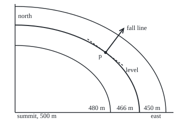

# Gradient: the direction of steepest climb and the rate in any direction

[Syllabus](../../../SYLLABUS.md) → [Calculus and analysis](../README.md) → [Several Variables](../README.md#s07) → Gradient

---

## General Overview

A skier stops on an open snowfield below a rounded summit. A map puts the summit at the origin, with distances in metres: x metres east, y metres north. The snow's height above sea level is h(x, y) = 500 − x^2/800 − y^2/400 metres. The skier stands at x = 120, y = 80, at a height of 466 m.

Due east, the snow drops 0.3 m per metre of map distance. Due north it drops 0.4 m per metre; northeast, 0.494975 m. None of these is the steepest. Skiers call the steepest line the fall line: where a dropped ball starts to roll. Here it heads more north than east and drops 0.5 m per metre.

Two numbers, the east rate and the north rate, settle every heading. Packed into one arrow they are the **gradient**, the word used from here on. The arrow points up the steepest climb, its length is that climb's rate, and it crosses the map's contour lines at right angles.

**Where a surface has a tangent plane, the rate in any direction is the gradient dotted with that direction, so the gradient points up the steepest climb, its length is the steepest rate, and it stands at right angles to the level contours.**

**What kind of fact this is:** a theorem, proved on this card in Why it works; the gradient itself is a definition.

### The picture: the skier on the contour map

<p align="center"></p>

To scale: 1.5 px per metre in both directions, summit at the bottom-left corner. The skier p sits at (120, 80) on the 466 m contour. The fall-line arrow is 40 m long, heading (0.6, 0.8). The dashed level line runs 30 m each way along (−0.8, 0.6) and touches the contour at p.

---

## The formula

Notation first, in words. The curly-d partial derivative $\partial h/\partial x$ is the rate of h per metre east with y held fixed ([Partial derivatives](01-partial-derivatives.md)). The gradient is written $\nabla h$, read "grad h"; the upside-down triangle is called nabla. It is the pair of partial derivatives, taken at one point:

$$\nabla h(p)=\left(\frac{\partial h}{\partial x}(p),\ \frac{\partial h}{\partial y}(p)\right)$$

A direction is an arrow $u = (u_1, u_2)$ of length 1: one metre of map distance. The **directional derivative** $D_u h(p)$ is the rate of height per metre travelled from $p$ along $u$:

$$D_u h(p)=\lim_{t\to 0}\frac{h(p+t\,u)-h(p)}{t}=\nabla h(p)\cdot u=\frac{\partial h}{\partial x}(p)\,u_1+\frac{\partial h}{\partial y}(p)\,u_2$$

**Read it aloud:** the rate in any direction is the east rate times the eastward share of the step, plus the north rate times the northward share.

In lengths and an angle, with $|\nabla h(p)|$ the arrow's length (the square root of the sum of its squared parts) and $\theta$ the angle between it and $u$:

$$\nabla h(p)\cdot u=|\nabla h(p)|\cos\theta$$

**Read it aloud:** the rate is the gradient's length times the cosine of the angle away from it, so it peaks along the gradient, bottoms out against it, and is zero across it.

| Symbol | Plain meaning | In our example | Push it up and the answer… |
| --- | --- | --- | --- |
| $h$ | height of the snow, metres | 466 m at p | steeper hill, larger rates |
| $x$, $y$ | metres east and north of the summit | 120, 80 | further out, steeper |
| $p$ | the point where the rates are taken | (120, 80) | moving p turns the gradient |
| $u$, $u_1$, $u_2$ | a direction of length 1; its east and north shares | fall line (0.6, 0.8) | turning u moves the rate between −0.5 and 0.5 |
| $\nabla h$ | the gradient: both partial derivatives as one arrow | (−0.3, −0.4) | longer arrow, steeper slope |
| $D_u h$ | the rate along u | −0.5 on the fall line | capped by the arrow's length |
| $t$ | metres travelled along u | 10, 1, 0.01 | larger gap from the limit |
| $\theta$ | angle between the gradient and u | 180° on the fall line | rate follows its cosine |

Rates are in metres of height per metre of ground.

### When it holds

- **A tangent plane at p** ([Tangent planes](02-differentiability-and-tangent-planes.md)). Partial derivatives alone are not enough: the crease in What breaks has both partials 0, yet its diagonal rate is 0.353553.
- **A direction of length 1.** A longer arrow scales the rate: (1, 1) gives −0.7, steeper than the true steepest.
- **Both inputs in one unit, at right angles.** "Steepest" assumes a metre east counts as a metre north. With wall thickness and window area, the shelf's house-heating inputs, the steepest heading changes when a unit changes.
- **A non-zero gradient.** At the summit the gradient is (0, 0): every rate is 0 and there is no fall line.
- **A smooth contour through p, for the right angle.** Continuous partial derivatives and a non-zero gradient guarantee one ([Inverse and implicit function theorems](07-inverse-and-implicit-function-theorems.md)).

---

## Why it works

### Step 0: close up, the slope is a tilted plane

A small enough patch of snow is nearly a tilted plane. There a step east changes the height at one fixed rate, a step north at another, and any step is part east, part north: its height change is the sum of the two parts.

### Step 1: the rate along a line is the dot product

Differentiability says: near p, a small step changes the height by the plane's amount, the gradient dotted with the step, plus an error small even compared with the step's length. Step $t$ metres along $u$: the plane's part is $t$ times $\nabla h(p)\cdot u$. Divide by $t$. The error over $t$ shrinks to 0, and the formula is left.

On the ski slope the error can be written out exactly. Along the fall line h(p + t u) = 466 − 0.5 t − 0.00205 t^2, so the quotient is −0.5 − 0.00205 t: −0.5205 at 10 m, −0.50205 at 1 m, −0.5000205 at 0.01 m. To land within 0.001 of −0.5, any step under 0.48 m will do.

### Step 2: the steepest direction is along the gradient

A dot product is the two lengths multiplied, times the cosine of the angle between the arrows ([The dot product](../../03-Algebra/06-Dot%20Products%20and%20Best%20Fits/01-dot-product.md)). The direction has length 1, so the rate is the gradient's length times cos θ. A cosine is 1 only at angle 0 and −1 only at 180°. So the steepest climb runs along the gradient, the steepest descent straight against it, each at the gradient's length. Here the gradient (−0.3, −0.4) has length 0.5: the fall line is (0.6, 0.8), at 0.5 m per metre.

A blind search agrees. Trying 3,600 headings a tenth of a degree apart, by difference quotients of h alone, the steepest is 53.1° from east, direction (0.600420, 0.799685), rate −0.500000.

### Step 3: the gradient crosses the contours at right angles

A contour is a level set: all points at one height, here 466 m. Along it the height does not change, so the rate along its direction is 0. By Step 1 that rate is the gradient dotted with the contour's direction, and a zero dot product of non-zero arrows is a right angle.

The check tests this without the gradient. It fixes x at 120 ± d, finds by halving an interval the y back on 466 m, and measures the chord. Its slope is −0.756362 at d = 10, −0.750062 at d = 1, −0.750000 at d = 0.01; the gradient predicts −(∂h/∂x)/(∂h/∂y) = −0.750000. The gradient's dot product with the unit chord falls from 0.002030 to 0.000020 to 0.000000.

The zero rate holds only at p itself. A straight 20 m traverse along the level direction (−0.8, 0.6) ends 0.68 m lower, because the contour curves away from the straight line; that curving is measured on [Hessian](05-hessian-and-second-order-approximation.md).

<details>
<summary>Detailed proof</summary>

Let $h$ be differentiable at $p$, with gradient $g=\nabla h(p)$: for every $\varepsilon>0$ there is a $\delta>0$ with $|h(p+s)-h(p)-g\cdot s|\le\varepsilon|s|$ whenever $0<|s|<\delta$.

**Rate.** Take $|u|=1$, $0<|t|<\delta$ and $s=t\,u$, so $|s|=|t|$. Divide by $|t|$: $\left|\frac{h(p+tu)-h(p)}{t}-g\cdot u\right|\le\varepsilon$. So the limit exists and equals $g\cdot u$.

**Maximum.** By the Cauchy–Schwarz inequality, $|g\cdot u|\le|g|\,|u|=|g|$, with equality only when $u$ is a multiple of the gradient. For $g\ne0$, $u=g/|g|$ gives the unique maximum $|g|$, and $u=-g/|g|$ the unique minimum $-|g|$.

**Right angle.** Let $c(\tau)$ be a curve with $c(0)=p$, $h(c(\tau))=h(p)$ near 0, and $c'(0)=w\ne0$. Write $c(\tau)-p=\tau w+r(\tau)$ with $|r(\tau)|/|\tau|\to0$. Then $0=h(c(\tau))-h(p)=\tau\,(g\cdot w)+g\cdot r(\tau)+E(\tau)$, where $|E(\tau)|\le\varepsilon\,|c(\tau)-p|\le2\varepsilon|w|\,|\tau|$ once the parameter is near enough 0. Divide by the parameter and let it shrink: $|g\cdot w|\le2\varepsilon|w|$ for every $\varepsilon>0$, so $g\cdot w=0$.

</details>

The chain rule reaches Step 3 in one line, differentiating the constant height along the contour: [Chain rule in several variables](04-multivariable-chain-rule-and-jacobians.md).

---

## Worked numbers, by hand

| Step | Arithmetic | Value |
| --- | --- | --- |
| height at p | 500 − 14400/800 − 6400/400 = 500 − 18 − 16 | 466 m |
| east rate | ∂h/∂x = −x/400 = −120/400 | −0.3 |
| north rate | ∂h/∂y = −y/200 = −80/200 | −0.4 |
| gradient length | square root of 0.09 + 0.16 | 0.5 |
| fall line | minus the gradient over its length: (0.3, 0.4)/0.5 | (0.6, 0.8) |
| rate on the fall line | −0.3 × 0.6 + (−0.4) × 0.8 = −0.18 − 0.32 | **−0.5 m per metre** |
| northeast, for comparison | (−0.3 − 0.4) divided by the square root of 2 | −0.494975 |
| along the contour | −0.3 × (−0.8) + (−0.4) × 0.6 = 0.24 − 0.24 | 0 |

Down the fall line the skier loses half a metre of height per metre across the map. Northeast is barely gentler: a cosine is flat near its peak.

### What breaks if you drop a piece

| Mistake | Comes out at | What went wrong |
| --- | --- | --- |
| Direction (1, 1), not length 1 | −0.7, beyond the steepest | The arrow is longer than 1 m |
| Skiing along the gradient | +0.5: climbing | The gradient points uphill |
| A crease, x^2 y/(x^2 + y^2), 0 at the origin | formula 0 on the diagonal, true 0.353553 | Partials exist, no tangent plane |
| Straight traverse taken as the contour | 0.68 m lower after 20 m | The contour curves |

The code prints all four; the crease's diagonal quotient stays 0.353553 at every step.

---

## Code, from first principles, and it actually runs

The partials are written by hand; every rate from them is checked against difference quotients of h. Two roads per claim: dot product against quotient, a 3,600-heading search against the fall-line formula, and a contour found by halving intervals against the right angle. Only square root, sine, cosine and pi are imported.

### Python

```python
# Gradient and directional derivatives -- the check behind the card.  Standard
# library only.  The slope: height h(x, y) = 500 - x^2/800 - y^2/400 metres, x metres
# east and y metres north of the summit.  The skier stands at p = (120, 80).
from math import sqrt, cos, sin, pi
def h(x, y): return 500 - x * x / 800 - y * y / 400
X, Y = 120.0, 80.0
gx, gy = -X / 400, -Y / 200                  # road 1: partials by hand, per metre
size = sqrt(gx * gx + gy * gy)
down = (-gx / size, -gy / size)              # steepest descent: minus the gradient, unit length
def dot(u): return gx * u[0] + gy * u[1]
def quot(f, x, y, u, t): return (f(x + t * u[0], y + t * u[1]) - f(x, y)) / t   # road 2
def contour_y(x, level):                     # own bisection: the y that puts x on the contour
    lo, hi = 0.0, 200.0
    for _ in range(100):
        mid = (lo + hi) / 2
        lo, hi = (mid, hi) if h(x, mid) > level else (lo, mid)
    return (lo + hi) / 2
r2 = sqrt(2)
print(f"height at p {h(X, Y):.3f} m; gradient ({gx:.6f}, {gy:.6f}); length {size:.6f}")
print(f"rate east {dot((1, 0)):.6f}, north {dot((0, 1)):.6f}, northeast {dot((1 / r2, 1 / r2)):.6f}")
print(f"steepest descent direction ({down[0]:.6f}, {down[1]:.6f}); rate {dot(down):.6f}")
for t in (10, 1, 0.01):
    q = quot(h, X, Y, down, t)
    print(f"difference quotient downhill, step {t:g} m: {q:.7f}; gap per metre of step {(q - dot(down)) / t:.5f}")
best = min(range(3600), key=lambda k: quot(h, X, Y, (cos(k * pi / 1800), sin(k * pi / 1800)), 1e-6))
bu = (cos(best * pi / 1800), sin(best * pi / 1800))
brate = quot(h, X, Y, bu, 1e-6)
print(f"search of 3600 headings: best {best / 10:.1f} deg, ({bu[0]:.6f}, {bu[1]:.6f}), rate {brate:.6f}")
tang = (-down[1], down[0])
print(f"level direction ({tang[0]:.6f}, {tang[1]:.6f}): rate {dot(tang):.6f}")
lev = h(X, Y)
for d in (10, 1, 0.01):
    cx, cy = 2 * d, contour_y(X + d, lev) - contour_y(X - d, lev)
    n = sqrt(cx * cx + cy * cy)
    print(f"contour chord, x = 120 +- {d:g}: slope {cy / cx:.6f}; gradient dot unit chord {dot((cx / n, cy / n)):.6f}")
print(f"tangent slope from the gradient: {-gx / gy:.6f}")
print(f"straight traverse 20 m along the level direction: height change {h(X + 20 * tang[0], Y + 20 * tang[1]) - lev:.6f} m")
print(f"mistake, direction (1, 1) not unit length: rate {dot((1, 1)):.6f}")
print(f"mistake, skiing along +gradient: rate {dot((-down[0], -down[1])):.6f}")
def crease(x, y): return 0.0 if x == 0 and y == 0 else x * x * y / (x * x + y * y)
cq = [quot(crease, 0, 0, (1 / r2, 1 / r2), t) for t in (0.1, 0.001)]
cg = (quot(crease, 0, 0, (1, 0), 1e-6), quot(crease, 0, 0, (0, 1), 1e-6))
print(f"crease at origin: partials ({cg[0]:.6f}, {cg[1]:.6f}); formula gives 0; quotients {cq[0]:.6f}, {cq[1]:.6f}")
S, OX, OY = 1.5, 30, 225                     # figure: 1.5 px per metre, summit at (30, 225)
def px(x, y): return f"({OX + S * x:.2f}, {OY - S * y:.2f})"
print(f"figure, p {px(X, Y)}; arrow end {px(X + 40 * down[0], Y + 40 * down[1])}; "
      f"level ends {px(X + 30 * tang[0], Y + 30 * tang[1])} {px(X - 30 * tang[0], Y - 30 * tang[1])}")
print("figure, contour radii px " + "; ".join(f"{L} m: {S * sqrt(800 * (500 - L)):.2f} x {S * sqrt(400 * (500 - L)):.2f}" for L in (480, 466, 450)))
assert abs(brate - (-size)) < 1e-5 and abs(bu[0] - down[0]) < 1e-3   # search vs formula
assert abs(quot(h, X, Y, down, 1e-6) - dot(down)) < 1e-5             # quotient vs dot product
cy = contour_y(X + 0.01, lev) - contour_y(X - 0.01, lev)
assert abs(cy / 0.02 - (-gx / gy)) < 1e-4                           # bisected contour vs gradient
assert cq[1] - (cg[0] / r2 + cg[1] / r2) > 0.3                      # crease: formula fails
print("ALL CHECKS PASS")
```

**Ran 2026-09-27 on macOS, Python 3.14.6, standard library only. All checks passed. Output, pasted from the run:**

```
height at p 466.000 m; gradient (-0.300000, -0.400000); length 0.500000
rate east -0.300000, north -0.400000, northeast -0.494975
steepest descent direction (0.600000, 0.800000); rate -0.500000
difference quotient downhill, step 10 m: -0.5205000; gap per metre of step -0.00205
difference quotient downhill, step 1 m: -0.5020500; gap per metre of step -0.00205
difference quotient downhill, step 0.01 m: -0.5000205; gap per metre of step -0.00205
search of 3600 headings: best 53.1 deg, (0.600420, 0.799685), rate -0.500000
level direction (-0.800000, 0.600000): rate 0.000000
contour chord, x = 120 +- 10: slope -0.756362; gradient dot unit chord 0.002030
contour chord, x = 120 +- 1: slope -0.750062; gradient dot unit chord 0.000020
contour chord, x = 120 +- 0.01: slope -0.750000; gradient dot unit chord 0.000000
tangent slope from the gradient: -0.750000
straight traverse 20 m along the level direction: height change -0.680000 m
mistake, direction (1, 1) not unit length: rate -0.700000
mistake, skiing along +gradient: rate 0.500000
crease at origin: partials (0.000000, 0.000000); formula gives 0; quotients 0.353553, 0.353553
figure, p (210.00, 105.00); arrow end (246.00, 57.00); level ends (174.00, 78.00) (246.00, 132.00)
figure, contour radii px 480 m: 189.74 x 134.16; 466 m: 247.39 x 174.93; 450 m: 300.00 x 212.13
ALL CHECKS PASS
```

### Rust

Same numbers, same labels, built with `rustc --edition 2021 -O`.

```rust
// Gradient and directional derivatives -- the same check as the Python, in Rust.
// Std only.  Height h(x, y) = 500 - x^2/800 - y^2/400 metres; the skier is at (120, 80).
use std::f64::consts::PI;
fn h(x: f64, y: f64) -> f64 { 500.0 - x * x / 800.0 - y * y / 400.0 }
fn crease(x: f64, y: f64) -> f64 { if x == 0.0 && y == 0.0 { 0.0 } else { x * x * y / (x * x + y * y) } }
fn quot(f: fn(f64, f64) -> f64, x: f64, y: f64, u: (f64, f64), t: f64) -> f64 {
    (f(x + t * u.0, y + t * u.1) - f(x, y)) / t // road 2: the difference quotient
}
fn contour_y(x: f64, level: f64) -> f64 { // own bisection: the y that puts x on the contour
    let (mut lo, mut hi) = (0.0, 200.0);
    for _ in 0..100 {
        let mid = (lo + hi) / 2.0;
        if h(x, mid) > level { lo = mid } else { hi = mid }
    }
    (lo + hi) / 2.0
}
fn px(x: f64, y: f64) -> String { format!("({:.2}, {:.2})", 30.0 + 1.5 * x, 225.0 - 1.5 * y) }
fn main() {
    let (x0, y0) = (120.0_f64, 80.0_f64);
    let (gx, gy) = (-x0 / 400.0, -y0 / 200.0); // road 1: partials by hand
    let size = (gx * gx + gy * gy).sqrt();
    let down = (-gx / size, -gy / size);
    let dot = |u: (f64, f64)| gx * u.0 + gy * u.1;
    let r2 = 2.0_f64.sqrt();
    println!("height at p {:.3} m; gradient ({:.6}, {:.6}); length {:.6}", h(x0, y0), gx, gy, size);
    println!("rate east {:.6}, north {:.6}, northeast {:.6}", dot((1.0, 0.0)), dot((0.0, 1.0)), dot((1.0 / r2, 1.0 / r2)));
    println!("steepest descent direction ({:.6}, {:.6}); rate {:.6}", down.0, down.1, dot(down));
    for t in [10.0, 1.0, 0.01] {
        let q = quot(h, x0, y0, down, t);
        println!("difference quotient downhill, step {} m: {:.7}; gap per metre of step {:.5}", t, q, (q - dot(down)) / t);
    }
    let head = |k: usize| ((k as f64 * PI / 1800.0).cos(), (k as f64 * PI / 1800.0).sin());
    let mut best = 0;
    for k in 1..3600 {
        if quot(h, x0, y0, head(k), 1e-6) < quot(h, x0, y0, head(best), 1e-6) { best = k }
    }
    let bu = head(best);
    let brate = quot(h, x0, y0, bu, 1e-6);
    println!("search of 3600 headings: best {:.1} deg, ({:.6}, {:.6}), rate {:.6}", best as f64 / 10.0, bu.0, bu.1, brate);
    let tang = (-down.1, down.0);
    println!("level direction ({:.6}, {:.6}): rate {:.6}", tang.0, tang.1, dot(tang));
    let lev = h(x0, y0);
    for d in [10.0, 1.0, 0.01] {
        let (cx, cy) = (2.0 * d, contour_y(x0 + d, lev) - contour_y(x0 - d, lev));
        let n = (cx * cx + cy * cy).sqrt();
        println!("contour chord, x = 120 +- {}: slope {:.6}; gradient dot unit chord {:.6}", d, cy / cx, dot((cx / n, cy / n)));
    }
    println!("tangent slope from the gradient: {:.6}", -gx / gy);
    println!("straight traverse 20 m along the level direction: height change {:.6} m", h(x0 + 20.0 * tang.0, y0 + 20.0 * tang.1) - lev);
    println!("mistake, direction (1, 1) not unit length: rate {:.6}", dot((1.0, 1.0)));
    println!("mistake, skiing along +gradient: rate {:.6}", dot((-down.0, -down.1)));
    let cq = [quot(crease, 0.0, 0.0, (1.0 / r2, 1.0 / r2), 0.1), quot(crease, 0.0, 0.0, (1.0 / r2, 1.0 / r2), 0.001)];
    let cg = (quot(crease, 0.0, 0.0, (1.0, 0.0), 1e-6), quot(crease, 0.0, 0.0, (0.0, 1.0), 1e-6));
    println!("crease at origin: partials ({:.6}, {:.6}); formula gives 0; quotients {:.6}, {:.6}", cg.0, cg.1, cq[0], cq[1]);
    println!("figure, p {}; arrow end {}; level ends {} {}", px(x0, y0), px(x0 + 40.0 * down.0, y0 + 40.0 * down.1),
             px(x0 + 30.0 * tang.0, y0 + 30.0 * tang.1), px(x0 - 30.0 * tang.0, y0 - 30.0 * tang.1));
    let radii: Vec<String> = [480.0_f64, 466.0, 450.0].iter()
        .map(|l| format!("{} m: {:.2} x {:.2}", l, 1.5 * (800.0 * (500.0 - l)).sqrt(), 1.5 * (400.0 * (500.0 - l)).sqrt())).collect();
    println!("figure, contour radii px {}", radii.join("; "));
    assert!((brate - (-size)).abs() < 1e-5 && (bu.0 - down.0).abs() < 1e-3); // search vs formula
    assert!((quot(h, x0, y0, down, 1e-6) - dot(down)).abs() < 1e-5); // quotient vs dot product
    let cy = contour_y(x0 + 0.01, lev) - contour_y(x0 - 0.01, lev);
    assert!((cy / 0.02 - (-gx / gy)).abs() < 1e-4); // bisected contour vs gradient
    assert!(cq[1] - (cg.0 / r2 + cg.1 / r2) > 0.3); // crease: formula fails
    println!("ALL CHECKS PASS");
}
```

**Ran 2026-09-27 on macOS, rustc 1.98.1, no crates. All checks passed. Output, pasted from the run:**

```
height at p 466.000 m; gradient (-0.300000, -0.400000); length 0.500000
rate east -0.300000, north -0.400000, northeast -0.494975
steepest descent direction (0.600000, 0.800000); rate -0.500000
difference quotient downhill, step 10 m: -0.5205000; gap per metre of step -0.00205
difference quotient downhill, step 1 m: -0.5020500; gap per metre of step -0.00205
difference quotient downhill, step 0.01 m: -0.5000205; gap per metre of step -0.00205
search of 3600 headings: best 53.1 deg, (0.600420, 0.799685), rate -0.500000
level direction (-0.800000, 0.600000): rate 0.000000
contour chord, x = 120 +- 10: slope -0.756362; gradient dot unit chord 0.002030
contour chord, x = 120 +- 1: slope -0.750062; gradient dot unit chord 0.000020
contour chord, x = 120 +- 0.01: slope -0.750000; gradient dot unit chord 0.000000
tangent slope from the gradient: -0.750000
straight traverse 20 m along the level direction: height change -0.680000 m
mistake, direction (1, 1) not unit length: rate -0.700000
mistake, skiing along +gradient: rate 0.500000
crease at origin: partials (0.000000, 0.000000); formula gives 0; quotients 0.353553, 0.353553
figure, p (210.00, 105.00); arrow end (246.00, 57.00); level ends (174.00, 78.00) (246.00, 132.00)
figure, contour radii px 480 m: 189.74 x 134.16; 466 m: 247.39 x 174.93; 450 m: 300.00 x 212.13
ALL CHECKS PASS
```

The two outputs agree line for line.

> [!TIP]
> **Try changing**
> - **Stand due north of the summit.** Set X to 0. Guess first: the fall line? Due north, (0, 1), at −0.4.
> - **Make the hill round.** Change 800 to 400 in h and the east partial to -X / 200. Guess first: the fall line? Straight away from the summit: the contours are now circles.
> - **Take a long step in the search.** Change its 1e-6 to 1. Guess first: does it still find −0.5? No: every quotient now carries the t^2 term from Step 1, and the first assert fails.
> - **Break the partials.** Change -X / 400 to -X / 300. Guess first: which assert fails? The first: the search never uses the partials.

---

## The usual mistake

> [!warning]
> **The gradient points uphill.** The fall line is its negative. Reading (−0.3, −0.4) as "the way down" sends the skier toward the summit, climbing 0.5 m per metre.
>
> - **A direction not of length 1.** (1, 1) gives −0.7, beating the true steepest.
> - **Partials without a tangent plane.** The crease: partials 0, diagonal rate 0.353553.
> - **Adding the partials' sizes.** 0.3 + 0.4 = 0.7 is not the steepest rate; squares combine, giving 0.5.
> - **A level direction is not a level path.** The straight traverse drops 0.68 m in 20 m.

---

## Where you meet it in real life

- **Runoff and avalanches.** Water and a released slab start down the fall line. Terrain software traces flow by the steepest drop between neighbouring grid cells.
- **Weather maps.** Isobars are pressure contours; the pressure gradient crosses them at right angles, and air is pushed against it, from high toward low.
- **Training models.** Gradient descent steps against an error's gradient: Gradient descent.
- **Portfolio risk.** Risk's gradient in the position sizes splits it among holdings: [Whose risk is it](../../12-Financial%20mathematics/39-Value%20at%20Risk%20and%20Expected%20Shortfall/06-var-decomposition-euler-and-component-var.md).

> **Say it back**
> The gradient is the east and north rates as one arrow. With a tangent plane, the rate along any direction of length 1 is the gradient dotted with it. That is the gradient's length times a cosine, so it peaks along the gradient and bottoms out against it. Along a contour the rate is zero, so the gradient crosses contours at right angles. On the slope the gradient is (−0.3, −0.4), and the fall line drops 0.5 m per metre along (0.6, 0.8).

---

## What this builds on

- [Tangent planes](02-differentiability-and-tangent-planes.md): the tangent plane whose tilt the gradient records.
- [The dot product](../../03-Algebra/06-Dot%20Products%20and%20Best%20Fits/01-dot-product.md): lengths times cosine, and the Cauchy–Schwarz bound behind the maximum.

## Where this goes next

- [Chain rule in several variables](04-multivariable-chain-rule-and-jacobians.md): rates along curving paths.
- [Lagrange multipliers](08-lagrange-multipliers.md): at a constrained best point, two gradients line up.
- [Line integrals of a field](../09-Vector%20Calculus/02-line-integrals.md): the gradient summed along a path returns the height change.
- [Whose risk is it](../../12-Financial%20mathematics/39-Value%20at%20Risk%20and%20Expected%20Shortfall/06-var-decomposition-euler-and-component-var.md): risk's gradient, shared among positions.
- Gradient descent: small steps down an error's fall line.
- Gradient descent: how fast they reach the bottom.
- Covectors and tensor fields: the gradient as a rule turning a direction into a rate.

---

## Sources

Verified 27 Sep 2026: every link below resolves to the publisher's page.

- Strang, Gilbert, and Edwin Herman. *Calculus Volume 3*, section 4.6. OpenStax, 2016. [Directional Derivatives and the Gradient](https://openstax.org/books/calculus-volume-3/pages/4-6-directional-derivatives-and-the-gradient). Free; the rate formula, steepest direction and level-curve right angle.
- Auroux, Denis, et al. *18.02SC Multivariable Calculus*, Fall 2010. MIT OpenCourseWare. [Part B: Chain Rule, Gradient and Directional Derivatives](https://ocw.mit.edu/courses/18-02sc-multivariable-calculus-fall-2010/pages/2.-partial-derivatives/part-b-chain-rule-gradient-and-directional-derivatives/). Lectures proving the level-curve right angle.
