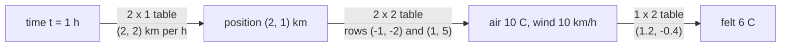
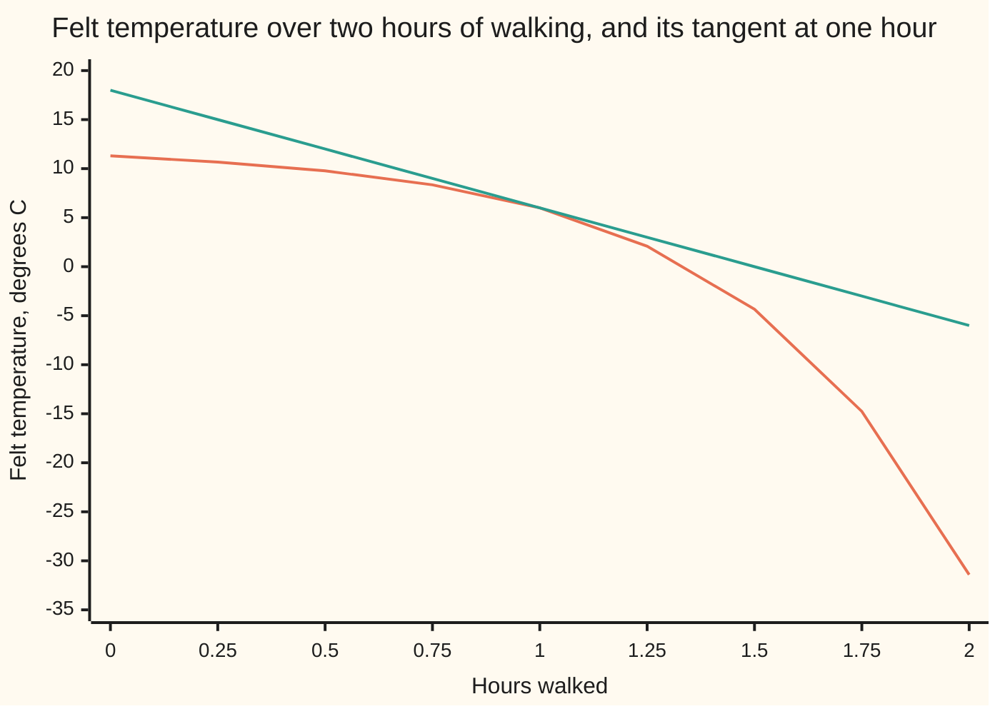

# Chain rule in several variables: derivative matrices multiply

[Syllabus](../../../SYLLABUS.md) → [Calculus and analysis](../../../SYLLABUS.md#w06) → [Several Variables](../../../SYLLABUS.md#w06-s07) → Chain rule in several variables

---

## General Overview

A hiker walks up a hillside for an hour. She is then 2 km east and 1 km north of the car park, moving at 2 km/h east and 2 km/h north. The air there is 10 °C and the wind 10 km/h. Wind makes cold air feel colder; in the simple model below, her skin reports 6 °C.

How fast is that felt temperature falling at that moment?

Three maps sit in a line. Time sets position. Position sets air temperature and wind speed. Those two set the felt temperature. Each map has a table of rates, one per input and output pair. Multiply the three tables in order, as matrices: the felt temperature is falling at 12 °C per hour.

The one-variable chain rule multiplied single rates ([Chain rule](../02-Derivatives/03-chain-rule.md)). Here each link passes on several numbers, so each rate becomes a table.

**When maps are chained, the table of rates of the whole chain is the product of the links' tables, outer link on the left, each table read where the chain actually is.**

**What kind of fact this is:** a theorem, proved on this card in Why it works; the Jacobian matrix it multiplies is a definition.

### The picture: three maps, three tables



Each arrow carries its link's table. Their product, outer first, is −12 °C per hour.

---

## The formula

A reminder: a partial derivative, written with a curly d, is an output's rate when one input moves alone ([Partial derivatives](01-partial-derivatives.md)).

One new notation, in words first: the **Jacobian matrix** of a map g, written $J_g$, is the table of its partial derivatives, one row per output and one column per input, in a declared order. Row i, column j holds the rate of output i per unit of input j, in output units per input unit. A one-output map's Jacobian is its gradient as a row; a path's is its velocity as a column.

For $g$ after $f$, the chain rule reads

$$J_{g \circ f}(a) = J_g\big(f(a)\big)\,J_f(a)$$

**Read it aloud:** the rate table of g after f is g's table, read at the point f delivers, times f's table, read at the start.

The hike has three links: the path $p$, the weather map $G$ and the felt temperature $F$.

$$p(t) = (2t,\ t^2), \quad G(x, y) = (13 - x - y^2,\ 5 + xy + 3y), \quad F(A, w) = A - 0.02\,w\,(30 - A)$$

$$\frac{d}{dt}F\big(G(p(t))\big) = J_F\big(G(p(t))\big)\; J_G\big(p(t)\big)\; J_p(t)$$

Shapes 1 × 2, 2 × 2 and 2 × 1 multiply to 1 × 1: one rate, in °C per hour.

| Symbol | Plain meaning | In our example | Push it up and the answer… |
| --- | --- | --- | --- |
| $t$, $h$ | hours walked; a small time step | 1 h; 0.01 h | tables read later in the walk |
| $x$, $y$ | km east, km north of the car park | 2, 1 | colder, windier air |
| $p$ | the path: time to position | (2t, t^2) | faster walk, faster change |
| $A$, $w$ | air temperature, °C; wind speed, km/h | 10; 10 | felt up with A, down with w |
| $G$ | the weather map: position to (A, w) | as above | — |
| $F$ | felt temperature from air and wind | 6 °C | — |
| $J_p$, $J_G$, $J_F$, $J_g$ | Jacobians of the three links; of any map g | 2 × 1, 2 × 2, 1 × 2 | answer moves in proportion |
| $f$, $g$, $a$ | any inner map, outer map, starting point | p and G; t = 1 | — |

### When it holds

- **Each map is differentiable where it is read, not merely equipped with partials.** Differentiable means one flat table predicts small moves in every direction ([Tangent planes](02-differentiability-and-tangent-planes.md)). The field `q(x, y) = x^2 y / (x^2 + y^2)`, 0 at the origin, has both partials 0 there, so the rule predicts rate 0 along the walk (t, t); the real rate is 0.5.
- **Each table is read at the point its map receives.** The weather table belongs at (2, 1); read at (1, 1) it gives −11.20 °C per hour.
- **One declared order of inputs and outputs.** Swap the weather table's rows and columns: −2.40.
- **Units agree along the chain.** Time in minutes divides the answer by 60.

---

## Why it works

### Step 0: near a point, every map acts like its table

Nudge the clock by a small step h. The hiker moves about $J_p$ times h; the weather changes by about $J_G$ times that move; the felt temperature by about $J_F$ times that change. One table after another is a matrix product ([Matrix multiplication](../../03-Algebra/04-Matrices/03-matrix-multiplication.md)). The work is making "about" exact.

### Step 1: build each table one column at a time

A column is what one input does when it moves alone. At (2, 1), moving east changes air at −1 °C per km and wind at y = 1 km/h per km: column (−1, 1). Moving north changes air at −2y = −2 and wind at x + 3 = 5: column (−2, 5).

The path's table is its velocity, (2, 2t) = (2, 2) km/h. The felt map's row, at air 10 and wind 10, is 1 + 0.02w = 1.2 °C per °C of air and −0.02(30 − A) = −0.4 °C per km/h of wind.

### Step 2: each entry of the product is a sum over routes

A clock nudge reaches the felt temperature by four routes, each a product of three rates:

| Route | Rates multiplied | °C per hour |
| --- | --- | --- |
| east, then air | 1.2 × (−1) × 2 | −2.40 |
| north, then air | 1.2 × (−2) × 2 | −4.80 |
| east, then wind | (−0.4) × 1 × 2 | −0.80 |
| north, then wind | (−0.4) × 5 × 2 | −4.00 |

They add to −12.00. Matrix multiplication is this bookkeeping: row against column, multiply pairs, add.

### Step 3: the leftover errors die away

Write each map's change as (table + slippage) × step, the slippage being how far the table misses over that step. Substitute one into the next and divide only by h, never by a change that could be zero. Differentiability makes every slippage shrink with h.

The tolerance game, with numbers. The secant (the average rate over one step) misses −12 by 1.30880 at h = 0.1 hour, 0.12322 at 0.01, and 0.01225 at 0.001. To land within 0.01 °C per hour, any forward step under 0.000816 hour, 2.93 seconds, will do.

<details>
<summary>Detailed proof</summary>

Let h be a small step in the input. Let f be differentiable at a with Jacobian M, and g at b = f(a) with Jacobian N; ‖v‖ is a vector's length. Then f(a + h) = f(a) + Mh + E(h) and g(b + v) = g(b) + Nv + R(v), with E(h)/‖h‖ → 0, R(v)/‖v‖ → 0, R(0) = 0. Fixed matrices stretch lengths by at most fixed factors: ‖Mz‖ ≤ m‖z‖, ‖Nz‖ ≤ n‖z‖.

Put v = Mh + E(h). Then g(f(a + h)) − g(b) = NMh + N E(h) + R(v). Given 0 < ε < 1, choose δ > 0 so that 0 < ‖h‖ < δ gives ‖E(h)‖ < ε‖h‖, hence ‖v‖ ≤ (m + 1)‖h‖, with δ also small enough that this v obeys ‖R(v)‖ ≤ ε‖v‖. The leftover is at most (n + m + 1)ε‖h‖. So g after f has Jacobian NM at a. No step divides by v, which may be zero.

</details>

### Step 4: order is fixed, grouping is free

The outer table sits on the left because it acts last; the shapes fit no other way. Grouping is free, since matrix multiplication is associative. Right pair first: the weather changes at (−6, 12), air in °C per hour and wind in km/h per hour; the felt row turns that into −12. Left pair first: (−1.60, −4.40) °C per km, the felt temperature's gradient on the map; its dot product with the velocity (2, 2) is again −12, the directional rate of [Gradient](03-gradient-and-directional-derivatives.md).

Left-first grouping over thousands of links is Reverse mode.

---

## Worked numbers, by hand

| Step | Arithmetic | Value |
| --- | --- | --- |
| position at 1 h | (2 × 1, 1 × 1) | (2, 1) km |
| velocity | (2, 2 × 1) | (2, 2) km/h |
| air, wind there | 13 − 2 − 1; 5 + 2 + 3 | 10 °C; 10 km/h |
| weather table rows | (−1, −2 × 1) and (1, 2 + 3) | (−1, −2), (1, 5) |
| weather rates per hour | −1 × 2 − 2 × 2; 1 × 2 + 5 × 2 | −6 °C/h; 12 km/h per h |
| felt table | 1 + 0.02 × 10; −0.02 × 20 | (1.2, −0.4) |
| felt rate | 1.2 × (−6) + (−0.4) × 12 | **−12 °C per hour** |

One hour in, the hiker feels 6 °C, falling at 12 °C per hour; the two wind routes supply −0.80 and −4.00 of that.

### What breaks if you drop a piece

| Mistake | Comes out at | What went wrong |
| --- | --- | --- |
| Weather table read at (1, 1) | −11.20 °C/h | The hiker is at (2, 1), not (1, 1) |
| Weather table transposed | −2.40 °C/h | Rows and columns swapped, so rates pair with the wrong inputs |
| Wind ignored, felt taken as air | −6.00 °C/h | The wind routes are dropped |
| Partials only, at the crease of q | 0.00, true rate 0.50 | q is not differentiable at the origin |

The code prints all four.

---

## Code, from first principles, and it actually runs

Road 1 multiplies the three Jacobians. Road 2 composes the walk into one function of time and takes shrinking secants, with a central secant for the tight comparison. The script also checks the left-grouped product against nudges in x and y.

### Python

```python
# Chain rule in several variables -- the check behind the card.  Nothing is
# imported.  A hiker walks the path p(t) = (2t, t^2) km (east, north) after t
# hours.  The weather map G(x, y) = (13 - x - y^2, 5 + xy + 3y) gives air
# temperature A in C and wind w in km/h; the felt temperature is
# F(A, w) = A - 0.02 w (30 - A).  Rate of the felt temperature at t = 1.
def p(t): return (2 * t, t * t)
def G(x, y): return (13 - x - y * y, 5 + x * y + 3 * y)
def F(A, w): return A - 0.02 * w * (30 - A)
def felt(t): return F(*G(*p(t)))
def matmul(P, Q):                       # rows of P against columns of Q
    return [[sum(P[i][k] * Q[k][j] for k in range(len(Q))) for j in range(len(Q[0]))]
            for i in range(len(P))]
def fmt(v, d=2): return "[" + ", ".join(f"{x:.{d}f}" for x in v) + "]"
t = 1.0
x, y = p(t); A, w = G(x, y)
Jp = [[2.0], [2 * t]]                                   # 2 x 1: km/h east, north
JG = [[-1.0, -2 * y], [y, x + 3]]                       # 2 x 2: read at (x, y)
JF = [[1 + 0.02 * w, -0.02 * (30 - A)]]                 # 1 x 2: read at (A, w)
inner = matmul(JG, Jp)                                  # rates of A and w per hour
chain = matmul(JF, inner)[0][0]                         # road 1: matrices multiply
grad = matmul(JF, JG)[0]                                # felt C per km, east and north
print(f"at t = 1 h: position ({x:.0f}, {y:.0f}) km, air {A:.0f} C, wind {w:.0f} km/h, felt {F(A, w):.2f} C")
print(f"J_p = {fmt([r[0] for r in Jp], 0)}; J_G rows {fmt(JG[0], 0)}, {fmt(JG[1], 0)}; J_F = {fmt(JF[0], 1)}")
print(f"J_G J_p: air {inner[0][0]:.0f} C/h, wind {inner[1][0]:.0f} km/h per h")
print(f"road 1, J_F (J_G J_p) = {chain:.2f} C/h")
routes = [JF[0][i] * JG[i][j] * Jp[j][0] for i in range(2) for j in range(2)]
print(f"four routes t -> x or y -> A or w -> F: {fmt(routes)}, sum {sum(routes):.2f}")
print(f"grouped the other way, J_F J_G = {fmt(grad)} C/km, times J_p: {grad[0] * Jp[0][0] + grad[1] * Jp[1][0]:.2f}")
e = 1e-6                                               # felt gradient on the map, by nudges
fx = (F(*G(x + e, y)) - F(*G(x - e, y))) / (2 * e); fy = (F(*G(x, y + e)) - F(*G(x, y - e))) / (2 * e)
print(f"felt gradient by nudging x and y: {fmt([fx, fy], 4)} C/km")
errs = []
for h in (0.1, 0.01, 0.001):                           # road 2: secants of the composed walk
    qq = (felt(t + h) - felt(t)) / h; errs.append(qq - chain)
    print(f"road 2, secant over h = {h:g} h: {qq:.5f} C/h, misses by {qq - chain:.5f}")
lo, hi = 0.0, 0.1                                      # largest step within 0.01 C/h
for _ in range(60):
    mid = (lo + hi) / 2
    if abs((felt(t + mid) - felt(t)) / mid - chain) < 0.01: lo = mid
    else: hi = mid
print(f"tolerance: every forward step under {int(lo * 1e6) / 1e6:.6f} h ({int(lo * 360000) / 100:.2f} s) lands within 0.01 C/h")
central = (felt(t + 1e-5) - felt(t - 1e-5)) / 2e-5
print(f"road 2, central secant over h = 0.00001 h: {central:.6f} C/h")
JGbad = [[-1.0, -2 * 1.0], [1.0, 1.0 + 3]]              # J_G read at (1, 1), not (2, 1)
print(f"mistake 1, J_G read at (1, 1): {matmul(JF, matmul(JGbad, Jp))[0][0]:.2f} C/h")
JGT = [[JG[0][0], JG[1][0]], [JG[0][1], JG[1][1]]]      # rows and columns swapped
print(f"mistake 2, J_G transposed: {matmul(JF, matmul(JGT, Jp))[0][0]:.2f} C/h")
print(f"mistake 3, wind ignored, felt = air: {inner[0][0]:.2f} C/h")
def q(a, b): return 0.0 if a == b == 0 else a * a * b / (a * a + b * b)   # a crease at 0
qx, qy = (q(1e-6, 0) - q(0, 0)) / 1e-6, (q(0, 1e-6) - q(0, 0)) / 1e-6
walk = (q(1e-6, 1e-6) - q(0, 0)) / 1e-6
print(f"crease: partials at 0 are {qx:.2f}, {qy:.2f}, so chain gives {qx + qy:.2f}; walking the diagonal gives {walk:.2f}")
pts = [i / 4 for i in range(9)]
print("chart, felt C at t = 0, 0.25, ..., 2:", fmt([felt(s) for s in pts]))
print("chart, tangent at t = 1:", fmt([felt(t) + chain * (s - t) for s in pts]))
assert abs(chain - central) < 1e-6                     # matrices = the composed walk
assert 9 < errs[0] / errs[1] < 11 and abs(errs[2]) < 0.05   # secants close in, tenfold
assert abs(grad[0] - fx) < 1e-6 and abs(grad[1] - fy) < 1e-6   # J_F J_G = nudged gradient
assert abs(walk - 0.5) < 1e-9 and qx + qy == 0         # the crease breaks the rule
print("ALL CHECKS PASS")
```

**Ran 2026-09-27 on macOS, Python 3.14.6, standard library only. All checks passed. Output, pasted from the run:**

```
at t = 1 h: position (2, 1) km, air 10 C, wind 10 km/h, felt 6.00 C
J_p = [2, 2]; J_G rows [-1, -2], [1, 5]; J_F = [1.2, -0.4]
J_G J_p: air -6 C/h, wind 12 km/h per h
road 1, J_F (J_G J_p) = -12.00 C/h
four routes t -> x or y -> A or w -> F: [-2.40, -4.80, -0.80, -4.00], sum -12.00
grouped the other way, J_F J_G = [-1.60, -4.40] C/km, times J_p: -12.00
felt gradient by nudging x and y: [-1.6000, -4.4000] C/km
road 2, secant over h = 0.1 h: -13.30880 C/h, misses by -1.30880
road 2, secant over h = 0.01 h: -12.12322 C/h, misses by -0.12322
road 2, secant over h = 0.001 h: -12.01225 C/h, misses by -0.01225
tolerance: every forward step under 0.000816 h (2.93 s) lands within 0.01 C/h
road 2, central secant over h = 0.00001 h: -12.000000 C/h
mistake 1, J_G read at (1, 1): -11.20 C/h
mistake 2, J_G transposed: -2.40 C/h
mistake 3, wind ignored, felt = air: -6.00 C/h
crease: partials at 0 are 0.00, 0.00, so chain gives 0.00; walking the diagonal gives 0.50
chart, felt C at t = 0, 0.25, ..., 2: [11.30, 10.67, 9.77, 8.35, 6.00, 2.09, -4.34, -14.76, -31.42]
chart, tangent at t = 1: [18.00, 15.00, 12.00, 9.00, 6.00, 3.00, 0.00, -3.00, -6.00]
ALL CHECKS PASS
```

### Rust

Same numbers, same labels.

```rust
// Chain rule in several variables -- the same check as the Python, in Rust.
// No crates.  Path p(t) = (2t, t^2) km; weather map G(x, y) = (13 - x - y^2,
// 5 + xy + 3y) gives air temperature A in C and wind w in km/h; felt
// temperature F(A, w) = A - 0.02 w (30 - A).  Rate of the felt temperature at t = 1.
fn p(t: f64) -> (f64, f64) { (2.0 * t, t * t) }
fn g(x: f64, y: f64) -> (f64, f64) { (13.0 - x - y * y, 5.0 + x * y + 3.0 * y) }
fn f(a: f64, w: f64) -> f64 { a - 0.02 * w * (30.0 - a) }
fn fg(x: f64, y: f64) -> f64 { let (a, w) = g(x, y); f(a, w) }
fn felt(t: f64) -> f64 { let (x, y) = p(t); fg(x, y) }
fn matmul(p: &[Vec<f64>], q: &[Vec<f64>]) -> Vec<Vec<f64>> {   // rows of p against columns of q
    (0..p.len()).map(|i| (0..q[0].len()).map(|j| (0..q.len()).map(|k| p[i][k] * q[k][j]).sum()).collect()).collect()
}
fn fmt(v: &[f64], d: usize) -> String {
    format!("[{}]", v.iter().map(|x| format!("{:.*}", d, x)).collect::<Vec<_>>().join(", "))
}
fn q(a: f64, b: f64) -> f64 { if a == 0.0 && b == 0.0 { 0.0 } else { a * a * b / (a * a + b * b) } }
fn main() {
    let t = 1.0;
    let (x, y) = p(t);
    let (a, w) = g(x, y);
    let jp = vec![vec![2.0], vec![2.0 * t]];                            // 2 x 1: km/h east, north
    let jg = vec![vec![-1.0, -2.0 * y], vec![y, x + 3.0]];              // 2 x 2: read at (x, y)
    let jf = vec![vec![1.0 + 0.02 * w, -0.02 * (30.0 - a)]];            // 1 x 2: read at (A, w)
    let inner = matmul(&jg, &jp);                                       // rates of A and w per hour
    let chain = matmul(&jf, &inner)[0][0];                              // road 1: matrices multiply
    let grad = matmul(&jf, &jg)[0].clone();                             // felt C per km
    println!("at t = 1 h: position ({:.0}, {:.0}) km, air {:.0} C, wind {:.0} km/h, felt {:.2} C", x, y, a, w, f(a, w));
    println!("J_p = {}; J_G rows {}, {}; J_F = {}", fmt(&[jp[0][0], jp[1][0]], 0), fmt(&jg[0], 0), fmt(&jg[1], 0), fmt(&jf[0], 1));
    println!("J_G J_p: air {:.0} C/h, wind {:.0} km/h per h", inner[0][0], inner[1][0]);
    println!("road 1, J_F (J_G J_p) = {:.2} C/h", chain);
    let routes: Vec<f64> = (0..4).map(|n| jf[0][n / 2] * jg[n / 2][n % 2] * jp[n % 2][0]).collect();
    println!("four routes t -> x or y -> A or w -> F: {}, sum {:.2}", fmt(&routes, 2), routes.iter().sum::<f64>());
    println!("grouped the other way, J_F J_G = {} C/km, times J_p: {:.2}", fmt(&grad, 2), grad[0] * jp[0][0] + grad[1] * jp[1][0]);
    let e = 1e-6;                                                       // felt gradient by nudges
    let fx = (fg(x + e, y) - fg(x - e, y)) / (2.0 * e);
    let fy = (fg(x, y + e) - fg(x, y - e)) / (2.0 * e);
    println!("felt gradient by nudging x and y: {} C/km", fmt(&[fx, fy], 4));
    let mut errs = Vec::new();
    for h in [0.1, 0.01, 0.001] {                                       // road 2: secants of the walk
        let qq = (felt(t + h) - felt(t)) / h;
        errs.push(qq - chain);
        println!("road 2, secant over h = {} h: {:.5} C/h, misses by {:.5}", h, qq, qq - chain);
    }
    let (mut lo, mut hi) = (0.0_f64, 0.1_f64);                          // largest step within 0.01 C/h
    for _ in 0..60 {
        let mid = (lo + hi) / 2.0;
        if ((felt(t + mid) - felt(t)) / mid - chain).abs() < 0.01 { lo = mid } else { hi = mid }
    }
    println!("tolerance: every forward step under {:.6} h ({:.2} s) lands within 0.01 C/h", (lo * 1e6).floor() / 1e6, (lo * 360000.0).floor() / 100.0);
    let central = (felt(t + 1e-5) - felt(t - 1e-5)) / 2e-5;
    println!("road 2, central secant over h = 0.00001 h: {:.6} C/h", central);
    let jg_bad = vec![vec![-1.0, -2.0 * 1.0], vec![1.0, 1.0 + 3.0]];   // J_G read at (1, 1), not (2, 1)
    println!("mistake 1, J_G read at (1, 1): {:.2} C/h", matmul(&jf, &matmul(&jg_bad, &jp))[0][0]);
    let jgt = vec![vec![jg[0][0], jg[1][0]], vec![jg[0][1], jg[1][1]]]; // rows and columns swapped
    println!("mistake 2, J_G transposed: {:.2} C/h", matmul(&jf, &matmul(&jgt, &jp))[0][0]);
    println!("mistake 3, wind ignored, felt = air: {:.2} C/h", inner[0][0]);
    let (qx, qy) = ((q(1e-6, 0.0) - q(0.0, 0.0)) / 1e-6, (q(0.0, 1e-6) - q(0.0, 0.0)) / 1e-6);
    let walk = (q(1e-6, 1e-6) - q(0.0, 0.0)) / 1e-6;
    println!("crease: partials at 0 are {:.2}, {:.2}, so chain gives {:.2}; walking the diagonal gives {:.2}", qx, qy, qx + qy, walk);
    let pts: Vec<f64> = (0..9).map(|i| i as f64 / 4.0).collect();
    println!("chart, felt C at t = 0, 0.25, ..., 2: {}", fmt(&pts.iter().map(|&s| felt(s)).collect::<Vec<_>>(), 2));
    println!("chart, tangent at t = 1: {}", fmt(&pts.iter().map(|&s| felt(t) + chain * (s - t)).collect::<Vec<_>>(), 2));
    assert!((chain - central).abs() < 1e-6);                            // matrices = the composed walk
    assert!(errs[0] / errs[1] > 9.0 && errs[0] / errs[1] < 11.0 && errs[2].abs() < 0.05);
    assert!((grad[0] - fx).abs() < 1e-6 && (grad[1] - fy).abs() < 1e-6); // J_F J_G = nudged gradient
    assert!((walk - 0.5).abs() < 1e-9 && qx + qy == 0.0);               // the crease breaks the rule
    println!("ALL CHECKS PASS");
}
```

**Ran 2026-09-27 on macOS, rustc 1.98.1, no crates. All checks passed. Output, pasted from the run:**

```
at t = 1 h: position (2, 1) km, air 10 C, wind 10 km/h, felt 6.00 C
J_p = [2, 2]; J_G rows [-1, -2], [1, 5]; J_F = [1.2, -0.4]
J_G J_p: air -6 C/h, wind 12 km/h per h
road 1, J_F (J_G J_p) = -12.00 C/h
four routes t -> x or y -> A or w -> F: [-2.40, -4.80, -0.80, -4.00], sum -12.00
grouped the other way, J_F J_G = [-1.60, -4.40] C/km, times J_p: -12.00
felt gradient by nudging x and y: [-1.6000, -4.4000] C/km
road 2, secant over h = 0.1 h: -13.30880 C/h, misses by -1.30880
road 2, secant over h = 0.01 h: -12.12322 C/h, misses by -0.12322
road 2, secant over h = 0.001 h: -12.01225 C/h, misses by -0.01225
tolerance: every forward step under 0.000816 h (2.93 s) lands within 0.01 C/h
road 2, central secant over h = 0.00001 h: -12.000000 C/h
mistake 1, J_G read at (1, 1): -11.20 C/h
mistake 2, J_G transposed: -2.40 C/h
mistake 3, wind ignored, felt = air: -6.00 C/h
crease: partials at 0 are 0.00, 0.00, so chain gives 0.00; walking the diagonal gives 0.50
chart, felt C at t = 0, 0.25, ..., 2: [11.30, 10.67, 9.77, 8.35, 6.00, 2.09, -4.34, -14.76, -31.42]
chart, tangent at t = 1: [18.00, 15.00, 12.00, 9.00, 6.00, 3.00, 0.00, -3.00, -6.00]
ALL CHECKS PASS
```

The two outputs match line for line.

### The felt temperature along the walk



The curve is the felt temperature along the walk; the straight line is its tangent at one hour, touching at 6 °C and falling at 12 °C per hour.

> [!TIP]
> **Try changing**
> - **Half an hour in.** Guess first, then set `t = 0.5`. Every table is re-read at (1, 0.25) km and the rate is −4.43 °C per hour; the first line keeps its "t = 1 h" label.
> - **Gentler wind chill.** Guess first, then change 0.02 to 0.01 in `F` and `JF`. The felt row becomes (1.1, −0.2) and the rate −9.00 °C per hour.
> - **A stale table.** Change 0.02 to 0.01 in `F` only. The secants head for −9, road 1 still says −12, and the first assert stops the run.

---

## The usual mistake

> [!warning]
> **Reading a table at the wrong point.** The weather table belongs where the hiker is at t = 1, which is (2, 1). Read at (1, 1), it gives −11.20 °C per hour instead of −12.
>
> - **Transposing a table.** Rows are outputs, columns inputs; swapped, the answer is −2.40.
> - **Dropping a route.** Felt taken as air temperature gives −6.
> - **Wrong order.** Velocity first, then weather, then felt row: 2 × 1 times 2 × 2 does not fit.

---

## Where you meet it in real life

- **Training neural networks.** A network is a long chain of maps; Backpropagation is this product grouped from the left.
- **Error budgets.** Input errors spread through a formula by its Jacobian ([Error propagation](../../13-Engineering%20mathematics/01-Units%20and%20Modelling/07-error-propagation-and-sensitivity.md)).
- **Risk from market quotes.** A price depends on model settings, which depend on quotes: a chain of tables ([Adjoint differentiation](../../12-Financial%20mathematics/07-Greeks%20by%20Numbers%20and%20Calibration/03-adjoint-differentiation-in-outline.md)).

> **Say it back**
> A map's Jacobian is its table of rates: one row per output, one column per input. Chain maps and the tables multiply, outer on the left, each read where its map is fed. Each entry of the product adds every route, each a product of rates. For the hiker: −12 °C per hour. The maps must be differentiable, not merely have partials.

---

## What this builds on

- [Gradient](03-gradient-and-directional-derivatives.md): the gradient that forms the felt map's row, and the directional rate that the left grouping reproduces.
- [Matrix multiplication](../../03-Algebra/04-Matrices/03-matrix-multiplication.md): row against column, and why the product is associative but not commutative.

## Where this goes next

- [Hessian](05-hessian-and-second-order-approximation.md): the table of second rates.
- [Inverse and implicit function theorems](07-inverse-and-implicit-function-theorems.md): an undoable Jacobian means a locally undoable map.
- [Change of variables](../08-Multiple%20Integrals/03-change-of-variables-and-jacobians.md): the determinant as an area scale.
- [Adjoint differentiation](../../12-Financial%20mathematics/07-Greeks%20by%20Numbers%20and%20Calibration/03-adjoint-differentiation-in-outline.md): all price sensitivities in one backward pass.
- [Error propagation](../../13-Engineering%20mathematics/01-Units%20and%20Modelling/07-error-propagation-and-sensitivity.md): errors pushed through a formula.
- Gradient descent: steps downhill on chained gradients.
- Backpropagation: the product grouped from the output end.
- Automatic differentiation: derivatives of whole programs.
- Newton in several unknowns, and Broyden when a Jacobian is too expensive: the Jacobian as Newton's slope.
- Reverse mode: left-first grouping, mechanised.
- Canonical form: coordinates chosen to simplify an equation.
- Curvature and torsion at any speed: bending, whatever clock traces the curve.
- Tangent space and differential: the Jacobian without coordinates.

Each table here is read at one point; how the tables change from point to point, bending the flat prediction, is [Hessian](05-hessian-and-second-order-approximation.md).

---

## Sources

Verified 2026-09-27: every link below resolves to the publisher's page.

- Lebl, Jiří. *Basic Analysis I & II: Introduction to Real Analysis*. [Section 8.3, The derivative](https://www.jirka.org/ra/html/sec_svtheder.html). The derivative as a linear map; Theorem 8.3.7 proves the chain rule.
- Strang, Gilbert, and Edwin "Jed" Herman. *Calculus Volume 3*. OpenStax. [Section 4.5, The Chain Rule](https://openstax.org/books/calculus-volume-3/pages/4-5-the-chain-rule). Tree diagrams of routes; worked examples along paths.
- Auroux, Denis, et al. *Multivariable Calculus*, 18.02SC. MIT OpenCourseWare. [Course page](https://ocw.mit.edu/courses/18-02sc-multivariable-calculus-fall-2010/). Lectures and problems on the chain rule and Jacobians.
