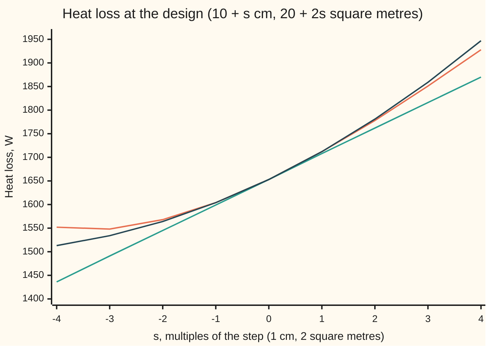

# Hessian: the matrix of second derivatives and the quadratic model it gives

[Syllabus](../../../SYLLABUS.md) → [Calculus and analysis](../../../SYLLABUS.md#w06) → [Several Variables](../../../SYLLABUS.md#w06-s07) → Hessian

---

## General Overview

A house has 100 square metres of outside wall: 20 of glass, the rest insulated 10 cm thick. On a day 20 degrees colder outside than in, it loses 1653.333 watts. What if it had 11 cm of insulation and 22 square metres of glass?

The tangent plane answers from two slopes: each extra centimetre saves 44.444 W, each extra square metre of glass costs 49.333 W. It predicts 1707.556 W. The truth is 1712.000 W. The slopes themselves change as the design moves.

Those changes are second derivatives; with two choices there are four, set out in a square table, the **Hessian**. Adding half of what it predicts gives 1712.370 W. It holds a surprise too: insulation changes what a window costs, and glass changes what insulation saves, by exactly the same amount.

**The Hessian is the table of second partial derivatives; when they are continuous it is symmetric, and adding half its quadratic form to the tangent plane gives a model whose error shrinks faster than the step squared.**

**What kind of fact this is:** the Hessian and the model are definitions; the symmetry and the error claim are theorems, proved on this card in Why it works.

### The picture: heat loss along the path through the new design



Orange is the true heat loss, green the tangent plane, dark the quadratic model. At s = 1, the new design, orange and dark both read 1712 and green 1708. Farther out all three part, the plane first.

---

## The formula

Notation first, in words. Heat loss Q, in watts, depends on insulation t in cm and window area A in square metres. The solid wall, 100 − A square metres, resists heat by 0.5 plus a quarter per centimetre of insulation (in square-metre degrees per watt); glass passes 2.8 W per square metre per degree; the 20 degrees multiply everything:

$$Q(t,A)=20\left(\frac{100-A}{0.5+t/4}+2.8\,A\right)$$

A partial derivative is the rate of change in one input with the other held fixed ([Partial derivatives](01-partial-derivatives.md)). Here it is a subscript: $Q_t$ is the rate of Q per cm of insulation. Two subscripts mean differentiate twice, left letter first: $Q_{tA}$ is the rate at which $Q_t$ changes per square metre of glass. The gradient $\nabla Q=(Q_t,Q_A)$ lists the two slopes ([Gradient](03-gradient-and-directional-derivatives.md)).

The **Hessian** at the design p is the table of second partial derivatives:

$$H(p)=\begin{pmatrix} Q_{tt}&Q_{tA}\\Q_{At}&Q_{AA} \end{pmatrix}$$

The **second-order model** for a step $h=(h_t,h_A)$ away from p, written out with $Q_{tA}=Q_{At}$:

$$Q(p+h)=Q(p)+\nabla Q(p)\cdot h+\tfrac12\,h^{\mathsf T} H(p)\,h+R_2(h)$$

$$\tfrac12\,h^{\mathsf T} H h=\tfrac12 Q_{tt}\,h_t^2+Q_{tA}\,h_t h_A+\tfrac12 Q_{AA}\,h_A^2$$

**Read it aloud:** the new heat loss is the old one, plus each slope times its step, plus half of each bend times its step squared, plus the cross term, plus a remainder that shrinks faster than the step squared.

| Symbol | Plain meaning | In our example | Push it up and the answer… |
| --- | --- | --- | --- |
| $Q$, $t$, $A$, $R$ | heat loss (W); insulation (cm); glass (square metres); wall resistance 0.5 + t/4 | 1653.333 W; 10; 20; 3 | insulation lowers Q, glass raises it |
| $p$ | the current design, the anchor | (10, 20) | new slopes and bends |
| $h$, $h_t$, $h_A$ | the step and its two parts | (1, 2) | bigger remainder |
| $\nabla Q$, $Q_t$, $Q_A$ | gradient: the first partials | −44.444 W per cm; 49.333 W per square metre | bigger first-order change |
| $H$, $Q_{tt}$, $Q_{AA}$ | Hessian; its straight bends | 7.4074 W per cm per cm; 0 | bigger correction |
| $Q_{tA}$, $Q_{At}$ | mixed bends, two orders | 0.5556 W per cm per square metre | stronger coupling |
| $T_1$, $T_2$, $R_2$ | tangent plane; quadratic model; what it misses | 1707.556; 1712.370; −0.370 W | — |
| $\varphi$, $s$, $\theta$, $\xi$ | Q along the path p + s h; how far along; points in (0, 1) where a derivative is read | s = 1: new design | — |

The transpose $h^{\mathsf T}$ lays the step on its side so it can multiply the table from the left; $h^{\mathsf T} H h$ is the table's quadratic form ([Quadratic forms](../../03-Algebra/07-Eigenvalues%20and%20Symmetric%20Matrices/05-quadratic-forms-and-positive-definite.md)). Each term comes out in watts.

### When it holds

- **Mixed partials exist near p and are continuous at p.** Then $Q_{tA}=Q_{At}$; without it the orders can give −1 and +1 (What breaks).
- **Second partials continuous near p.** Then the remainder over the step squared heads for 0; without it, not necessarily.
- **Third derivatives bounded along the path.** Then the remainder is at most a constant times the step cubed.
- **Not a hypothesis: the model is local.** At s = −4 it reads 1513 W; the house loses 1552 W.

---

## Why it works

### Step 0: a straight path turns two inputs into one

Walk in a straight line from the current design to the new one: at fraction s of the way the design is p + s h. Heat loss along the walk, $\varphi(s)=Q(p+s h)$, is a function of one number, so one-variable Taylor ([Taylor's theorem](../03-What%20Derivatives%20Tell%20You/05-taylors-theorem.md)) applies. The Hessian is what its second derivative turns out to be.

### Step 1: the path's slope is the gradient, its bend the Hessian

By the chain rule in several variables ([Chain rule in several variables](04-multivariable-chain-rule-and-jacobians.md)), $\varphi'(s)=Q_t h_t+Q_A h_A$. Apply it again to each slope:

$$\varphi''(s)=Q_{tt}h_t^2+Q_{tA}h_t h_A+Q_{At}h_A h_t+Q_{AA}h_A^2=h^{\mathsf T} H\,h$$

On the heat-loss path: 7.4074 + 2 × 0.5556 × 2 + 0 = 9.6296. A second difference of $\varphi$ alone, no formulas, also gives 9.6296.

### Step 2: the mixed bends agree

Take the rectangle from the design to 1 cm more insulation and 2 square metres more glass. Add the heat loss at two opposite corners; subtract the other two. Read one way, it is how much the insulation saving changed across the extra glass; the other way, how much the window cost changed across the extra insulation.

Divided by the area, 1 × 2, it is 0.5128. Shrink the rectangle tenfold: 0.5510. Again: 0.5551. The target is 0.5556; to land within 0.001 of it, 0.01 cm by 0.02 square metres is small enough.

The mean value theorem ([Mean value theorem](../03-What%20Derivatives%20Tell%20You/02-mean-value-theorem.md)) turns one reading into $Q_{tA}$ at some point of the rectangle and the other into $Q_{At}$ at another point, equal in value. As the rectangle shrinks both points close on p, so continuity there makes the values at p agree. So H is symmetric, and Step 1's two cross terms merge into $2Q_{tA}h_t h_A$.

<details>
<summary>Detailed proof: mixed partials agree</summary>

Let $D(h,k)=Q(t+h,A+k)-Q(t+h,A)-Q(t,A+k)+Q(t,A)$. With $u(x)=Q(x,A+k)-Q(x,A)$, the mean value theorem gives $D=h\,u'(t+\theta h)$, and $u'(x)=Q_t(x,A+k)-Q_t(x,A)$, so again $D=hk\,Q_{tA}(t+\theta h,A+\theta' k)$, with $\theta,\theta'$ in (0, 1). With $v(y)=Q(t+h,y)-Q(t,y)$ instead, $D=hk\,Q_{At}(t+\psi h,A+\psi' k)$, with $\psi,\psi'$ in (0, 1).

Given $\varepsilon>0$, continuity at $(t,A)$ gives $\delta>0$ with both mixed partials within $\varepsilon$ of their values at $(t,A)$ whenever $|h|,|k|<\delta$. Then $|Q_{tA}(t,A)-Q_{At}(t,A)|<2\varepsilon$ for every $\varepsilon>0$, so they are equal. ∎

</details>

### Step 3: Taylor along the path gives the model and its error

Taylor with Lagrange's remainder for $\varphi$ from 0 to 1: $\varphi(1)=\varphi(0)+\varphi'(0)+\tfrac12\varphi''(\theta)$ for some $\theta$ in (0, 1). With Step 1:

$$Q(p+h)=Q(p)+\nabla Q(p)\cdot h+\tfrac12\,h^{\mathsf T} H(p+\theta h)\,h$$

The Hessian is read somewhere along the path. Swapping in $H(p)$ leaves a remainder of half $h^{\mathsf T}(H(p+\theta h)-H(p))h$. If the entries are continuous, that difference of tables heads for zero with the step, so the remainder shrinks faster than the step squared.

<details>
<summary>Detailed proof: the remainder is small beside the step squared</summary>

Given a tolerance $\eta>0$, continuity gives a radius within which each entry stays within that tolerance of its value at p. For a step inside it,
$$|R_2(h)|\le\tfrac12\,\eta\,(|h_t|+|h_A|)^2\le\eta\,(h_t^2+h_A^2),$$
since $(|h_t|-|h_A|)^2\ge0$. The tolerance was arbitrary, so $R_2(h)/(h_t^2+h_A^2)$ heads for 0. (Inputs in different units need a scale each; the conclusion does not depend on it.) ∎

</details>

### Step 4: on the heat-loss path the error is pinned from both sides

One derivative further, the remainder is $\varphi'''(\xi)/6$ for some $\xi$ in (0, 1). Here $\varphi'''(s)=-195/u^4$, where $u=3+s/4$ is the wall resistance along the way, running from 3 to 3.25. So the remainder lies between −0.4012 and −0.2913. The true one, 1712.000 − 1712.370, is −0.3704: inside.

<details>
<summary>The algebra behind the third derivative</summary>

Along the path $t=10+s$ and $A=20+2s$, so $u=3+s/4$ and $100-A=104-8u$. Then $\varphi(s)=20\,(104/u-8+56+5.6\,s)$. Each s-derivative of $1/u$ brings a factor 1/4, so the third derivative is $20 \times 104 \times (-6)/u^4 \times (1/4)^3=-195/u^4$.

</details>

Scaling the step by s scales that remainder by about $s^3$. At s = 1, 0.5, 0.25 the quadratic misses by 0.3704, 0.0481, 0.0061 W and the plane by 4.4444, 1.1556, 0.2948 W: ratios 7.69, 7.84 and 3.85, 3.92, closing on 8 and 4.

A second route builds H from second differences of Q alone; the code takes it, and [Numerical derivatives](../03-What%20Derivatives%20Tell%20You/08-numerical-derivatives-and-sensitivity.md) sizes the step.

---

## Worked numbers, by hand

| Step | Arithmetic | Value |
| --- | --- | --- |
| heat loss now | 20 × (80/3 + 2.8 × 20), with R = 3 | 1653.333 W |
| slope in t | $Q_t=-5(100-A)/R^2$ = −5 × 80 / 9 | −44.444 W per cm |
| slope in A | $Q_A=20(2.8-1/R)$ | 49.333 W per square metre |
| bend in t | $Q_{tt}=2.5(100-A)/R^3$ = 2.5 × 80 / 27 | 7.4074 |
| mixed bend, both orders | $5/R^2$ = 5/9 | 0.5556 |
| bend in A | Q is a straight line in A | 0 |
| tangent plane | 1653.333 − 44.444 × 1 + 49.333 × 2 | 1707.556 W |
| Hessian correction | ½ × 7.4074 × 1 + 0.5556 × 1 × 2 + 0 | 3.704 + 1.111 = 4.815 W |
| quadratic model | 1707.556 + 4.815 | **1712.370 W** |
| true heat loss | Q(11, 22) | 1712.000 W |

Of the 4.815 W correction, 1.111 W is the mixed term: thicker insulation makes glass cost more, because the wall it replaces was better.

### What breaks if you drop a piece

| Mistake | Comes out at | What went wrong |
| --- | --- | --- |
| No one-half on the Hessian term | 1717.185 W | bends counted twice; the ½ is one-variable Taylor's |
| No mixed term | 1711.259 W | the two choices treated as independent |
| Stop at the tangent plane | 1707.556 W | the slopes change as the design moves |
| Swap the order on xy(x^2 − y^2)/(x^2 + y^2), 0 at the origin | −1.000 one way, 1.000 the other | its mixed partials are not continuous at the origin |

There the slope in x along x = 0 is −y, rate −1 in y; the slope in y along y = 0 is x, rate +1 in x.

---

## Code, from first principles, and it actually runs

Three roads: derivatives by hand; second differences of Q with step 0.01; the second difference along the path. The asserts check that the first two agree on every entry, that the path's bend is $h^{\mathsf T} H h$, that the remainder sits in Lagrange's window, and that halving the step divides the errors by 4 and 8, within 0.5.

### Python

```python
# Hessian check, nothing imported.  Heat loss Q in watts through 100 m^2 of wall:
# insulation t cm thick, window area A m^2, 20 degrees inside to out.  Road 1:
# hand-derived gradient and Hessian.  Road 2: difference quotients of Q alone.
# Road 3: Q along the straight path to the new design, as one variable.

def Q(t, A):
    return 20 * ((100 - A) / (0.5 + t / 4) + 2.8 * A)

t0, A0, ht, hA = 10.0, 20.0, 1.0, 2.0              # current design, and the step
R = 0.5 + t0 / 4                                   # wall resistance, 3
g = (-20 * (100 - A0) / (4 * R * R), 20 * (2.8 - 1 / R))         # road 1: Q_t, Q_A
H = ((40 * (100 - A0) / (16 * R ** 3), 5 / (R * R)), (5 / (R * R), 0.0))

def model(s, order, half=0.5, mixed=1):            # tangent plane or quadratic at s*step
    a, b = s * ht, s * hA
    lin = Q(t0, A0) + g[0] * a + g[1] * b
    quad = H[0][0] * a * a + mixed * 2 * H[0][1] * a * b + H[1][1] * b * b
    return lin + (half * quad if order == 2 else 0)

def rect(h, k):                                    # double difference over an h-by-k rectangle
    return (Q(t0 + h, A0 + k) - Q(t0 + h, A0) - Q(t0, A0 + k) + Q(t0, A0)) / (h * k)

e = 0.01                                           # road 2: centred differences, step e
Qtt = (Q(t0 + e, A0) - 2 * Q(t0, A0) + Q(t0 - e, A0)) / e ** 2
QAA = round((Q(t0, A0 + e) - 2 * Q(t0, A0) + Q(t0, A0 - e)) / e ** 2, 4) + 0.0
QtA = (Q(t0 + e, A0 + e) - Q(t0 + e, A0 - e) - Q(t0 - e, A0 + e) + Q(t0 - e, A0 - e)) / (4 * e * e)
phi = lambda s: Q(t0 + s * ht, A0 + s * hA)        # road 3: the path as one variable
phi2 = (phi(e) - 2 * phi(0) + phi(-e)) / e ** 2
hHh = H[0][0] * ht * ht + 2 * H[0][1] * ht * hA + H[1][1] * hA * hA
rem = phi(1) - model(1, 2)
win = tuple(-20 * (100 - A0 + 4 * hA * R / ht) * (ht / 4) ** 3 / u ** 4 for u in (R, R + ht / 4))  # phi'''/6, u from 3 to 3.25
e1 = [abs(phi(s) - model(s, 1)) for s in (1, 0.5, 0.25)]
e2 = [abs(phi(s) - model(s, 2)) for s in (1, 0.5, 0.25)]
f = lambda x, y: 0.0 if x == y == 0 else x * y * (x * x - y * y) / (x * x + y * y)
d = 1e-7
fx = lambda y: (f(d, y) - f(-d, y)) / (2 * d)      # slope in x, on the line x = 0
fy = lambda x: (f(x, d) - f(x, -d)) / (2 * d)      # slope in y, on the line y = 0
print(f"current design: Q(10, 20) = {Q(t0, A0):.3f} W")
print(f"road 1 gradient: Q_t = {g[0]:.3f} W per cm, Q_A = {g[1]:.3f} W per m^2")
print(f"road 1 Hessian: Q_tt = {H[0][0]:.4f}, Q_tA = Q_At = {H[0][1]:.4f}, Q_AA = {H[1][1]:.4f}")
print(f"road 2 differences: Q_tt = {Qtt:.4f}, Q_tA = {QtA:.4f}, Q_AA = {QAA:.4f}")
print("rectangle quotient, 1 x 2, 0.1 x 0.2, 0.01 x 0.02: " + ", ".join(f"{rect(k, 2 * k):.4f}" for k in (1, 0.1, 0.01)))
print(f"step (1 cm, 2 m^2): exact {phi(1):.3f}, tangent plane {model(1, 1):.3f}, quadratic {model(1, 2):.3f}")
print(f"correction {model(1, 2) - model(1, 1):.3f} = {0.5 * H[0][0]:.3f} thickness + {2 * H[0][1]:.3f} mixed + {2 * H[1][1]:.3f} windows")
print(f"road 3, along the path: phi''(0) = {phi2:.4f}, h^T H h = {hHh:.4f}")
print(f"remainder {rem:.4f}, Lagrange window [{win[0]:.4f}, {win[1]:.4f}]")
print("error at s = 1, 0.5, 0.25: tangent " + ", ".join(f"{x:.4f}" for x in e1) + "; quadratic " + ", ".join(f"{x:.4f}" for x in e2))
print(f"halving s divides them by {e1[0] / e1[1]:.2f}, {e1[1] / e1[2]:.2f} and {e2[0] / e2[1]:.2f}, {e2[1] / e2[2]:.2f}")
xs = range(-4, 5)
print("chart s: " + ", ".join(str(s) for s in xs))
print("chart exact: " + ", ".join(f"{phi(s):.0f}" for s in xs))
print("chart tangent: " + ", ".join(f"{model(s, 1):.0f}" for s in xs))
print("chart quadratic: " + ", ".join(f"{model(s, 2):.0f}" for s in xs))
print(f"mistakes: no one-half {model(1, 2, half=1):.3f}, no mixed term {model(1, 2, mixed=0):.3f}")
print(f"xy(x^2 - y^2)/(x^2 + y^2) at 0: x then y {(fx(1e-3) - fx(-1e-3)) / 2e-3:.3f}, y then x {(fy(1e-3) - fy(-1e-3)) / 2e-3:.3f}")
assert all(abs(a - b) < 1e-3 for a, b in ((Qtt, H[0][0]), (QtA, H[0][1]), (QAA, H[1][1])))
assert abs(phi2 - hHh) < 1e-3                      # the path's bend is h^T H h
assert win[0] < rem < win[1]                       # the true remainder obeys Lagrange
assert all(abs(e1[i] / e1[i + 1] - 4) < 0.5 and abs(e2[i] / e2[i + 1] - 8) < 0.5 for i in range(2))
print("ALL CHECKS PASS")
```

**Ran 2026-09-27 on macOS, Python 3.14.6, standard library only. All checks passed. Output, pasted from the run:**

```
current design: Q(10, 20) = 1653.333 W
road 1 gradient: Q_t = -44.444 W per cm, Q_A = 49.333 W per m^2
road 1 Hessian: Q_tt = 7.4074, Q_tA = Q_At = 0.5556, Q_AA = 0.0000
road 2 differences: Q_tt = 7.4074, Q_tA = 0.5556, Q_AA = 0.0000
rectangle quotient, 1 x 2, 0.1 x 0.2, 0.01 x 0.02: 0.5128, 0.5510, 0.5551
step (1 cm, 2 m^2): exact 1712.000, tangent plane 1707.556, quadratic 1712.370
correction 4.815 = 3.704 thickness + 1.111 mixed + 0.000 windows
road 3, along the path: phi''(0) = 9.6296, h^T H h = 9.6296
remainder -0.3704, Lagrange window [-0.4012, -0.2913]
error at s = 1, 0.5, 0.25: tangent 4.4444, 1.1556, 0.2948; quadratic 0.3704, 0.0481, 0.0061
halving s divides them by 3.85, 3.92 and 7.69, 7.84
chart s: -4, -3, -2, -1, 0, 1, 2, 3, 4
chart exact: 1552, 1548, 1568, 1604, 1653, 1712, 1778, 1851, 1928
chart tangent: 1436, 1491, 1545, 1599, 1653, 1708, 1762, 1816, 1870
chart quadratic: 1513, 1534, 1564, 1604, 1653, 1712, 1781, 1859, 1947
mistakes: no one-half 1717.185, no mixed term 1711.259
xy(x^2 - y^2)/(x^2 + y^2) at 0: x then y -1.000, y then x 1.000
ALL CHECKS PASS
```

### Rust

Same numbers, same labels, built with `rustc --edition 2021 -O`.

```rust
// Hessian check, std only.  Heat loss Q in watts through 100 m^2 of wall:
// insulation t cm thick, window area A m^2, 20 degrees inside to out.  Road 1:
// hand-derived gradient and Hessian.  Road 2: difference quotients of Q alone.
// Road 3: Q along the straight path to the new design, as one variable.

fn q(t: f64, a: f64) -> f64 { 20.0 * ((100.0 - a) / (0.5 + t / 4.0) + 2.8 * a) }

const T0: f64 = 10.0; const A0: f64 = 20.0; const HT: f64 = 1.0; const HA: f64 = 2.0;

struct M { g: [f64; 2], h: [[f64; 2]; 2] }

impl M {
    // tangent plane (order 1) or quadratic (order 2) at s times the step
    fn model(&self, s: f64, order: u32, half: f64, mixed: f64) -> f64 {
        let (a, b) = (s * HT, s * HA);
        let lin = q(T0, A0) + self.g[0] * a + self.g[1] * b;
        let quad = self.h[0][0] * a * a + mixed * 2.0 * self.h[0][1] * a * b + self.h[1][1] * b * b;
        lin + if order == 2 { half * quad } else { 0.0 }
    }
}

fn rect(h: f64, k: f64) -> f64 { (q(T0 + h, A0 + k) - q(T0 + h, A0) - q(T0, A0 + k) + q(T0, A0)) / (h * k) }
fn phi(s: f64) -> f64 { q(T0 + s * HT, A0 + s * HA) } // road 3: the path as one variable
fn f(x: f64, y: f64) -> f64 { if x == 0.0 && y == 0.0 { 0.0 } else { x * y * (x * x - y * y) / (x * x + y * y) } }
fn join(v: &[f64], p: usize) -> String { v.iter().map(|x| format!("{:.*}", p, x)).collect::<Vec<_>>().join(", ") }

fn main() {
    let r = 0.5 + T0 / 4.0; // wall resistance, 3
    let m = M { g: [-20.0 * (100.0 - A0) / (4.0 * r * r), 20.0 * (2.8 - 1.0 / r)], // road 1
        h: [[40.0 * (100.0 - A0) / (16.0 * r.powi(3)), 5.0 / (r * r)], [5.0 / (r * r), 0.0]] };
    let e = 0.01; // road 2: centred differences, step e
    let qtt = (q(T0 + e, A0) - 2.0 * q(T0, A0) + q(T0 - e, A0)) / (e * e);
    let qaa = ((q(T0, A0 + e) - 2.0 * q(T0, A0) + q(T0, A0 - e)) / (e * e) * 1e4).round() / 1e4 + 0.0;
    let qta = (q(T0 + e, A0 + e) - q(T0 + e, A0 - e) - q(T0 - e, A0 + e) + q(T0 - e, A0 - e)) / (4.0 * e * e);
    let phi2 = (phi(e) - 2.0 * phi(0.0) + phi(-e)) / (e * e);
    let hhh = m.h[0][0] * HT * HT + 2.0 * m.h[0][1] * HT * HA + m.h[1][1] * HA * HA;
    let rem = phi(1.0) - m.model(1.0, 2, 0.5, 1.0);
    let (w, k) = (HT / 4.0, 100.0 - A0 + 4.0 * HA * r / HT); // phi'''/6 = -20 k w^3 / u^4, u from 3 to 3.25
    let win = (-20.0 * k * w.powi(3) / r.powi(4), -20.0 * k * w.powi(3) / (r + w).powi(4));
    let e1: Vec<f64> = [1.0, 0.5, 0.25].iter().map(|&s| (phi(s) - m.model(s, 1, 0.5, 1.0)).abs()).collect();
    let e2: Vec<f64> = [1.0, 0.5, 0.25].iter().map(|&s| (phi(s) - m.model(s, 2, 0.5, 1.0)).abs()).collect();
    let d = 1e-7;
    let fx = |y: f64| (f(d, y) - f(-d, y)) / (2.0 * d); // slope in x, on the line x = 0
    let fy = |x: f64| (f(x, d) - f(x, -d)) / (2.0 * d); // slope in y, on the line y = 0
    println!("current design: Q(10, 20) = {:.3} W", q(T0, A0));
    println!("road 1 gradient: Q_t = {:.3} W per cm, Q_A = {:.3} W per m^2", m.g[0], m.g[1]);
    println!("road 1 Hessian: Q_tt = {:.4}, Q_tA = Q_At = {:.4}, Q_AA = {:.4}", m.h[0][0], m.h[0][1], m.h[1][1]);
    println!("road 2 differences: Q_tt = {:.4}, Q_tA = {:.4}, Q_AA = {:.4}", qtt, qta, qaa);
    println!("rectangle quotient, 1 x 2, 0.1 x 0.2, 0.01 x 0.02: {}", join(&[1.0, 0.1, 0.01].map(|k| rect(k, 2.0 * k)), 4));
    println!("step (1 cm, 2 m^2): exact {:.3}, tangent plane {:.3}, quadratic {:.3}", phi(1.0), m.model(1.0, 1, 0.5, 1.0), m.model(1.0, 2, 0.5, 1.0));
    println!("correction {:.3} = {:.3} thickness + {:.3} mixed + {:.3} windows",
        m.model(1.0, 2, 0.5, 1.0) - m.model(1.0, 1, 0.5, 1.0), 0.5 * m.h[0][0], 2.0 * m.h[0][1], 2.0 * m.h[1][1]);
    println!("road 3, along the path: phi''(0) = {:.4}, h^T H h = {:.4}", phi2, hhh);
    println!("remainder {:.4}, Lagrange window [{:.4}, {:.4}]", rem, win.0, win.1);
    println!("error at s = 1, 0.5, 0.25: tangent {}; quadratic {}", join(&e1, 4), join(&e2, 4));
    println!("halving s divides them by {:.2}, {:.2} and {:.2}, {:.2}", e1[0] / e1[1], e1[1] / e1[2], e2[0] / e2[1], e2[1] / e2[2]);
    let xs: Vec<f64> = (-4..5).map(|s| s as f64).collect();
    println!("chart s: {}", join(&xs, 0));
    println!("chart exact: {}", join(&xs.iter().map(|&s| phi(s)).collect::<Vec<_>>(), 0));
    println!("chart tangent: {}", join(&xs.iter().map(|&s| m.model(s, 1, 0.5, 1.0)).collect::<Vec<_>>(), 0));
    println!("chart quadratic: {}", join(&xs.iter().map(|&s| m.model(s, 2, 0.5, 1.0)).collect::<Vec<_>>(), 0));
    println!("mistakes: no one-half {:.3}, no mixed term {:.3}", m.model(1.0, 2, 1.0, 1.0), m.model(1.0, 2, 0.5, 0.0));
    println!("xy(x^2 - y^2)/(x^2 + y^2) at 0: x then y {:.3}, y then x {:.3}", (fx(1e-3) - fx(-1e-3)) / 2e-3, (fy(1e-3) - fy(-1e-3)) / 2e-3);
    assert!([(qtt, m.h[0][0]), (qta, m.h[0][1]), (qaa, m.h[1][1])].iter().all(|(a, b)| (a - b).abs() < 1e-3));
    assert!((phi2 - hhh).abs() < 1e-3); // the path's bend is h^T H h
    assert!(win.0 < rem && rem < win.1); // the true remainder obeys Lagrange
    assert!((0..2).all(|i| (e1[i] / e1[i + 1] - 4.0).abs() < 0.5 && (e2[i] / e2[i + 1] - 8.0).abs() < 0.5));
    println!("ALL CHECKS PASS");
}
```

**Ran 2026-09-27 on macOS, rustc 1.98.1, no crates. All checks passed. Output, pasted from the run:**

```
current design: Q(10, 20) = 1653.333 W
road 1 gradient: Q_t = -44.444 W per cm, Q_A = 49.333 W per m^2
road 1 Hessian: Q_tt = 7.4074, Q_tA = Q_At = 0.5556, Q_AA = 0.0000
road 2 differences: Q_tt = 7.4074, Q_tA = 0.5556, Q_AA = 0.0000
rectangle quotient, 1 x 2, 0.1 x 0.2, 0.01 x 0.02: 0.5128, 0.5510, 0.5551
step (1 cm, 2 m^2): exact 1712.000, tangent plane 1707.556, quadratic 1712.370
correction 4.815 = 3.704 thickness + 1.111 mixed + 0.000 windows
road 3, along the path: phi''(0) = 9.6296, h^T H h = 9.6296
remainder -0.3704, Lagrange window [-0.4012, -0.2913]
error at s = 1, 0.5, 0.25: tangent 4.4444, 1.1556, 0.2948; quadratic 0.3704, 0.0481, 0.0061
halving s divides them by 3.85, 3.92 and 7.69, 7.84
chart s: -4, -3, -2, -1, 0, 1, 2, 3, 4
chart exact: 1552, 1548, 1568, 1604, 1653, 1712, 1778, 1851, 1928
chart tangent: 1436, 1491, 1545, 1599, 1653, 1708, 1762, 1816, 1870
chart quadratic: 1513, 1534, 1564, 1604, 1653, 1712, 1781, 1859, 1947
mistakes: no one-half 1717.185, no mixed term 1711.259
xy(x^2 - y^2)/(x^2 + y^2) at 0: x then y -1.000, y then x 1.000
ALL CHECKS PASS
```

> [!TIP]
> **Try changing**
> - **Guess first:** halve the step, `ht, hA = 0.5, 1.0`. Answer: the plane misses by 1.1556 W, the quadratic by 0.0481 W.
> - **Guess first:** quarter it, `ht, hA = 0.25, 0.5`. Answer: 0.2948 W and 0.0061 W.
> - **Guess first:** drop the mixed term, `mixed=0` in `def model`. Answer: the quadratic reads 1711.259 W, farther from 1712.000 than 1712.370, and the halving assert fails: the error now shrinks only like the step squared.
> - **Guess first:** read the chart lines at s = −4. Answer: the house loses 1552 W; the quadratic says 1513, the plane 1436.

---

## The usual mistake

> [!warning]
> **Expecting the cube law from continuity alone.** Continuous second derivatives promise only an error shrinking faster than the step squared. Dividing by 8 per halving needs bounded third derivatives; here they give the window −0.4012 to −0.2913.
>
> - **Keeping only the diagonal.** The mixed term appears twice in $h^{\mathsf T} H h$; dropping it gives 1711.259 W.
> - **Calling every Hessian a bowl.** Here $Q_{AA}=0$ and the quadratic form takes both signs; the shapes are sorted in [Extrema in several variables](06-multivariable-extrema.md).

---

## Where you meet it in real life

- **Building design.** The mixed entry is why the best window area depends on the wall.
- **Numerical optimisation.** Newton's method jumps to the quadratic model's lowest point, then rebuilds it (Optimality conditions).
- **Bonds.** Price against two interest rates uses this model; one rate is [Duration and convexity](../../12-Financial%20mathematics/01-Money%2C%20Dates%20and%20Discounting/06-duration-and-convexity.md).

> **Say it back**
> The Hessian is the table of second partial derivatives: how each slope changes as each input moves. Continuous mixed partials make the order irrelevant, so the table is symmetric. Along a straight line the bend is step, table, step. One-variable Taylor along that line gives the model: value, plus gradient times step, plus half the quadratic form. Its error shrinks faster than the step squared, and like its cube when third derivatives are bounded.

---

## What this builds on

- [Chain rule in several variables](04-multivariable-chain-rule-and-jacobians.md): the rate along a path, used twice in Step 1.
- [Quadratic forms](../../03-Algebra/07-Eigenvalues%20and%20Symmetric%20Matrices/05-quadratic-forms-and-positive-definite.md): what $h^{\mathsf T} H h$ is.

## Where this goes next

- [Extrema in several variables](06-multivariable-extrema.md): at a flat point the Hessian sorts peak, pit and saddle.
- [Convex functions](09-convex-functions.md): a Hessian form never negative means a bowl.
- [Exact equations](../../08-Differential%20equations%20and%20dynamics/01-Rate%20Equations/08-exact-equations.md): equal mixed partials test exactness.
- Linearisation: the expansion cut after one term, for moving systems.
- Optimality conditions: tests for a best design.
- Riemannian Hessian: the Hessian on curved spaces.

---

## Sources

Verified 2026-09-27: every link below resolves to the publisher's page.

- Lebl, Jiří. *Basic Analysis II: Introduction to Real Analysis*, section 8.6. [Higher order derivatives](https://www.jirka.org/ra/html/sec_mvhighordders.html). Proposition 8.6.2 with proof: continuous second partials can be taken in either order.
- Lebl, Jiří. *Basic Analysis I*, section 4.3. [Taylor's theorem](https://www.jirka.org/ra/html/sec_taylor.html). The one-variable theorem with Lagrange's remainder, applied along the path.
- Strang, Gilbert, and Edwin Herman. *Calculus Volume 3*. OpenStax, 2016. [4.3 Partial Derivatives](https://openstax.org/books/calculus-volume-3/pages/4-3-partial-derivatives). Higher-order partials and Clairaut's theorem, worked at first-course level.
