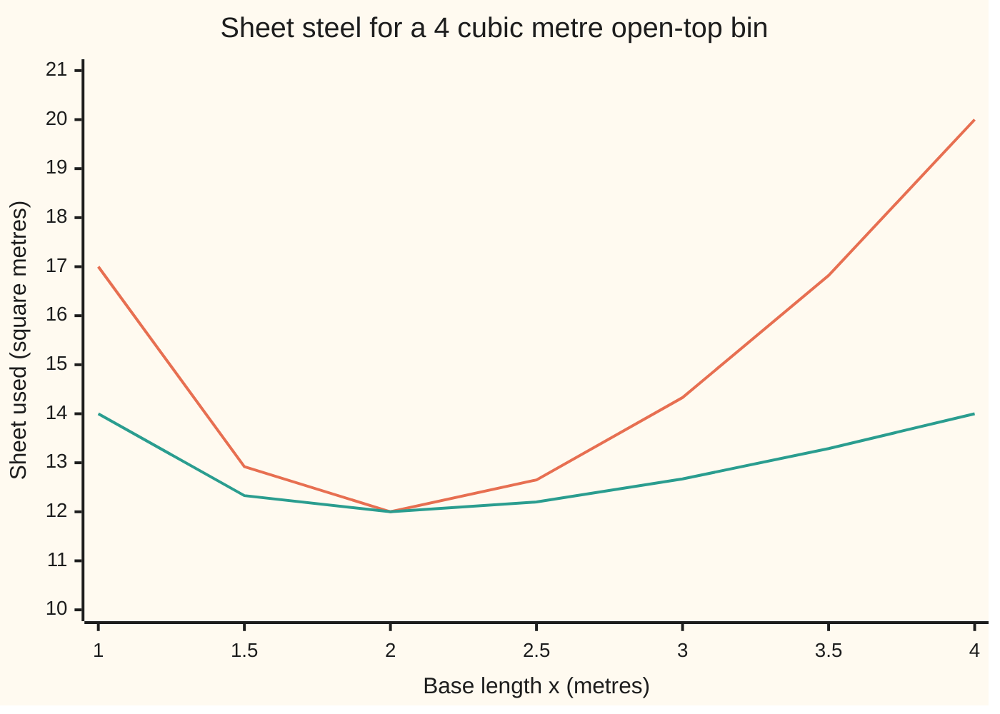

# Extrema in several variables: peaks, pits and saddles

Calculus and analysis → Several Variables → Flat spots and what they are → Extrema in several variables

---

## General Overview

A workshop folds open-top steel bins holding 4 cubic metres. Steel is sold by the square metre, so the cheapest bin uses least sheet. The base is x metres by y metres; the height must then be 4/(xy) metres.

A long thin base wastes steel on long walls; a tiny base needs tall walls. With one dial, the best point has slope zero. With two dials there are two slopes, and both zero is not enough. The flat spot could be a pit (lowest nearby), a peak (highest nearby) or a saddle: lowest along one road and highest along another, like a mountain pass.

The answer, proved below: a 2-metre square base, 1 metre tall, 12 square metres of steel.

**A smooth lowest or highest point inside the region has every slope zero; the Hessian sorts such a flat spot into pit, peak or saddle; only a whole-region argument makes a pit lowest overall.**

**What kind of fact this is:** a theorem, proved on this card in Why it works.

### The picture: steel used along two roads through the best bin



Orange keeps the base square (y = x); green holds the width at 2 metres. Both bottom out at 12 square metres over x = 2. The picture suggests a pit; the proof decides.

---

## The formula

Notation from this shelf: a curly $\partial$ marks a partial derivative, the rate as one input moves and the others hold still; the gradient $\nabla S$ lists those rates ([gradient-and-directional-derivatives](03-gradient-and-directional-derivatives.md)); the Hessian $H$ is the square table of second partial derivatives.

The sheet used is the base plus four walls. Two walls are x long and 4/(xy) tall, 4/y each; the other two are 4/x each:

$$S(x,y) = xy + \frac{2V}{x} + \frac{2V}{y}, \qquad V = 4.$$

**Find the flat spots,** where both slopes vanish:

$$\nabla S = \left(y - \frac{2V}{x^2},\; x - \frac{2V}{y^2}\right) = (0, 0).$$

**Sort them** with the Hessian's entries at the spot: A, the second rate in x; C, the second rate in y; B, the mixed rate (x then y). Then

$$D = AC - B^2.$$

| At a flat spot | Verdict |
| --- | --- |
| D > 0 and A > 0 | pit: strict local minimum |
| D > 0 and A < 0 | peak: strict local maximum |
| D < 0 | saddle |
| D = 0 | no verdict |

**Read it aloud:** D is the table's corner products, AC, minus the mixed rate squared; its sign, with A's, names the flat spot.

"Local" means best nearby; "global", best of all allowed points; "strict", no nearby tie. Near a flat spot a small step $h$ = ($h_1$ in x, $h_2$ in y) changes S by about

$$\tfrac12\left(A h_1^2 + 2B h_1 h_2 + C h_2^2\right),$$

half the quadratic form $h^{\mathsf T}Hh$: one number built from the step and the table.

| Symbol | Plain meaning | In our example | Push it up and the answer… |
| --- | --- | --- | --- |
| $S$ | sheet steel used, square metres | 12 at the best bin | — |
| $x$, $y$ | base length and width, metres | both 2 at the best bin | past 2, base outgrows wall savings |
| $V$ | volume held, cubic metres | 4 | more steel |
| $\nabla S$, $\partial$ | the two slopes, square metres per metre | (0, 0) at the best bin | nonzero: one way is cheaper |
| $H$, $A$, $B$, $C$ | Hessian and its entries, square metres per square metre | 2, 1, 2 | larger A, C: a steeper pit |
| $D$ | AC − B^2, the Hessian's determinant | 3 | below 0: a saddle |
| $h$, $h_1$, $h_2$ | a small step, metres | (0.1, 0.1) | the quadratic picture drifts |
| $\lambda$ | an eigenvalue: H's stretch along a square-on direction | 3 along (1, 1), 1 along (1, −1) | a firmer pit |

### When it holds

- **Inside the region.** An edge's lowest point need not be flat; check edges separately.
- **Smooth:** continuous second partials nearby. |x| + |y| is lowest at a corner with no gradient.
- **D not zero.** x^4 + y^4 and x^4 − y^4 share an all-zero Hessian at (0, 0): a pit and a saddle.
- **Local only.** Global needs its own argument, Step 4.
- **Two inputs.** With more, a pit needs every eigenvalue of H positive.

---

## Why it works

### Step 0: a lowest point is lowest along every road through it

If (2, 2) beats every nearby shape, hold the width at 2 and vary the length: a one-dial problem lowest at x = 2, so slope zero there ([monotonicity-and-optimisation](../03-What%20Derivatives%20Tell%20You/03-monotonicity-and-optimisation.md)). The same holds for the width. So the gradient is zero. Flat says nothing about which way the ground bends.

For the bin: y = 8/x^2 and x = 8/y^2. Substituting, x = x^4/8, so x^3 = 8, x = 2 and y = 2. That is the only flat spot with positive sides.

### Step 1: near a flat spot, the surface is a quadratic bowl or pass

By the Hessian card, the change in S is gradient times step, plus half the quadratic form, plus a remainder shrinking faster than the squared step length. At a flat spot only the last two remain.

On the bin, A = 4V/x^3 = 2, B = 1, C = 2. The step (0.1, 0.1) raises the steel by 0.029048; half the quadratic form predicts 0.030000. The step (0.1, −0.1) raises it by 0.010050 against 0.010000.

### Step 2: completing the square sorts the quadratic form

When A is not zero,

$$A h_1^2 + 2B h_1 h_2 + C h_2^2 = A\left(h_1 + \frac{B}{A} h_2\right)^2 + \frac{D}{A}\, h_2^2 ,$$

as multiplying out confirms.

- A > 0 and D > 0: both terms are at least zero and vanish together only at h = (0, 0). Every step goes up.
- A < 0 and D > 0: both at most zero. Every step goes down.
- D < 0: the step (1, 0) gives A and the step (−B, A) gives A times D, opposite signs: some steps rise, some fall. (If A = 0, swap the roles of x and y; if C = 0 too, the steps (1, 1) and (1, −1) give 2B and −2B.)

The bin: A = 2, D = 3. A pit. Negate the cost and A = −2, D = 3: a peak.

### Step 3: the bowl beats the remainder

The spectral theorem ([spectral-theorem](../../03-Algebra/07-Eigenvalues%20and%20Symmetric%20Matrices/04-spectral-theorem.md)) gives H two square-on directions along which it only stretches; the stretches, its eigenvalues, are 3 along (1, 1) and 1 along (1, −1). So the quadratic form is at least the smallest, $\lambda$ = 1, times the squared step length. The remainder shrinks faster, so for short steps it stays under a quarter of that floor and the rise stays positive: a strict pit. The picture's square-base road runs along (1, 1), the most sharply curved direction.

<details>
<summary>Detailed proof</summary>

Let S have continuous second partials near p, with ∇S(p) = 0, and A > 0, D > 0 at p. The eigenvalues have product D > 0 and sum A + C > 0, so both are positive; with λ the smaller, $h^{\mathsf T}H(p)h \ge \lambda\lvert h\rvert^2$.

With g(t) = S(p + th), [taylors-theorem](../03-What%20Derivatives%20Tell%20You/05-taylors-theorem.md) gives S(p + h) − S(p) = ½g''(τ) = ½ $h^{\mathsf T}H(p + \tau h)h$ for some τ in (0, 1), since g'(0) = 0.

Set ε = λ/2. Continuity gives δ > 0 with every entry of H(q) − H(p) within ε/2 of zero when |q − p| < δ, so their quadratic forms differ by at most (ε/2)(|h₁| + |h₂|)^2 ≤ ε|h|^2. For 0 < |h| < δ, S(p + h) − S(p) ≥ ½(λ − ε)|h|^2 = ¼λ|h|^2 > 0. Use −S for a peak; for D < 0, Step 2's two steps, scaled small, keep their signs by the same bound.

</details>

### Step 4: from the best nearby bin to the best bin

The allowed region, all positive x and y, runs to infinity, so a pit need not be global. Fence it: the closed square with sides from 8/13 = 0.615385 to 169/8 = 21.125000 metres. Outside it, and on its edges, the steel is at least 13 square metres:

a side below 0.615385 makes its walls, 8/x or 8/y, exceed 13, and a side above 21.125000 with the other at least 0.615385 makes the base exceed 13. The lowest edge value found is 17.437647. Inside, S is continuous on a closed bounded square, so the extreme value theorem ([extreme-value-theorem](../01-Limits%20and%20Continuity/07-extreme-value-theorem.md)) gives a cheapest point. It costs at most 12, so it is off the fence, flat by Step 0, hence (2, 2). The pit is global.

A calculus-free grid search over the fence lands on (2.000, 2.000) with 12.000000.

The other route to "local is global" is convexity, a Hessian passing the pit test everywhere ([convex-functions](09-convex-functions.md)). The bin fails it far out, where the wall curvatures shrink below the cross term.

---

## Worked numbers, by hand

| Step | Arithmetic | Value |
| --- | --- | --- |
| Flat-spot equations | y = 8/x^2, x = 8/y^2 | x^3 = 8 |
| The spot | x = 2, y = 8/4 | base 2 by 2 metres |
| Height | 4/(2 × 2) | 1 metre |
| Steel | 4 + 8/2 + 8/2 | 12 square metres |
| Hessian | A = 16/2^3, B = 1, C = 16/2^3 | 2, 1, 2 |
| Sort | D = 2 × 2 − 1 × 1 = 3, A > 0 | pit |
| Fence | outside 0.615385 to 21.125000, over 13 | **global minimum, 12 square metres** |

Base, one wall pair and the other split the steel 4, 4, 4.

### What breaks if you drop a piece

| Mistake | Comes out at | What went wrong |
| --- | --- | --- |
| Skip D | x^2 + 3xy + y^2: A = C = 2, D = −5; (0.1, 0.1) rises 0.050000, (0.1, −0.1) falls 0.010000 | a saddle |
| Trust D = 0 | x^4 + y^4 is 0.000100 at (0.1, 0); x^4 − y^4 is −0.000100 at (0, 0.1) | zero Hessian, pit or saddle |
| Call a pit global | x^2 + y^2 − x^4: pit of value 0 at (0, 0), yet −12 at (2, 0) | no fence |

---

## Code, from first principles, and it actually runs

Two independent roads. Road one is calculus: Newton's method ([newtons-method](../03-What%20Derivatives%20Tell%20You/06-newtons-method.md)) on the gradient, with the Hessian as its slope, eight jumps from (1, 3); then difference quotients, eigenvalues and real rises. Road two is a grid search over the fence, plus a scan of two of its edges (the cost is symmetric in x and y). Four asserts: difference quotients against the formula, real rise against the quadratic model, grid winner against Newton, D's verdict against two steps.

### Python

```python
# Open-top box holding 4 cubic metres: base x by y metres, height 4/(xy).
V = 4.0
S = lambda x, y: x * y + 2 * V / x + 2 * V / y          # sheet area, square metres
grad = lambda x, y: (y - 2 * V / x**2, x - 2 * V / y**2)
hess = lambda x, y: (4 * V / x**3, 1.0, 4 * V / y**3)     # A, B, C from the formula
x, y = 1.0, 3.0                                           # road 1: Newton on gradient = 0
for step in range(8):
    (gx, gy), (a, b, c) = grad(x, y), hess(x, y)
    d = a * c - b * b
    x, y = x - (c * gx - b * gy) / d, y - (a * gy - b * gx) / d
gx, gy = grad(x, y)
print(f"newton from (1,3), 8 steps: x={x:.6f} y={y:.6f} gradient size={(gx*gx+gy*gy)**0.5:.9f}")
print(f"stationary box: base {x:.6f} by {y:.6f}, height {V/(x*y):.6f}, area {S(x,y):.6f}")
def dq(f, x, y, h=1e-3):                                    # second difference quotients
    return ((f(x+h, y) - 2*f(x, y) + f(x-h, y)) / h**2,
            (f(x+h, y+h) - f(x+h, y-h) - f(x-h, y+h) + f(x-h, y-h)) / (4*h*h),
            (f(x, y+h) - 2*f(x, y) + f(x, y-h)) / h**2)
cls = lambda a, d: "saddle" if d < 0 else "no verdict" if d == 0 else "strict local minimum" if a > 0 else "strict local maximum"
A, B, C = hess(x, y); fxx, fxy, fyy = dq(S, x, y)
assert max(abs(fxx-A), abs(fxy-B), abs(fyy-C)) < 1e-4
print(f"hessian formula A={A:.6f} B={B:.6f} C={C:.6f}; difference quotients {fxx:.6f} {fxy:.6f} {fyy:.6f}")
D, T = A*C - B*B, A + C
lam = ((T + (T*T - 4*D)**0.5) / 2, (T - (T*T - 4*D)**0.5) / 2)
print(f"D={D:.6f} trace={T:.6f} eigenvalues {lam[0]:.6f} and {lam[1]:.6f}: {cls(A, D)}")
print(f"sign flip, minus the area: A={-A:.6f} D={D:.6f}: {cls(-A, D)}")
for hx, hy in ((0.1, 0.1), (0.1, -0.1)):
    rise, quad = S(x+hx, y+hy) - S(x, y), 0.5 * (A*hx*hx + 2*B*hx*hy + C*hy*hy)
    assert abs(rise - quad) < 0.1 * quad
    print(f"step ({hx},{hy}): actual rise {rise:.6f}, half h'Hh {quad:.6f}")
M = 13.0                                                     # any area above the best
lo, hi = 2*V / M, M * M / (2*V)                              # fence: area > M outside
edge = [S(e, t) for e in (lo, hi) for t in (lo + (hi-lo)*k/400 for k in range(401))]
print(f"fence: x or y = {lo:.6f} or {hi:.6f} gives area >= {M:.0f}; lowest edge value {min(edge):.6f}")
best = min((S(0.05*i, 0.05*j), 0.05*i, 0.05*j) for i in range(int(lo*20)+1, int(hi*20)+1) for j in range(int(lo*20)+1, int(hi*20)+1))
best = min((S(best[1] + 0.001*i, best[2] + 0.001*j), best[1] + 0.001*i, best[2] + 0.001*j) for i in range(-60, 61) for j in range(-60, 61))
assert abs(best[1] - x) < 2e-3 and abs(best[2] - y) < 2e-3 and best[0] >= S(x, y) - 1e-12
print(f"road 2, grid search over the fence: best ({best[1]:.3f}, {best[2]:.3f}) area {best[0]:.6f}")
print("chart square base y=x:", ", ".join(f"{S(s, s):.2f}" for s in (1, 1.5, 2, 2.5, 3, 3.5, 4)))
print("chart y fixed at 2:", ", ".join(f"{S(s, 2):.2f}" for s in (1, 1.5, 2, 2.5, 3, 3.5, 4)))
f3 = lambda x, y: x*x + 3*x*y + y*y                           # A = C = 2, cross term 3
a3, b3, c3 = dq(f3, 0.0, 0.0); d3 = a3*c3 - b3*b3
assert cls(a3, d3) == "saddle" and f3(0.1, 0.1) > 0 > f3(0.1, -0.1)
print(f"breaks, x^2+3xy+y^2: D={d3:.0f}, rise along (0.1,0.1) {f3(0.1,0.1):.6f}, along (0.1,-0.1) {f3(0.1,-0.1):.6f}: {cls(a3, d3)}")
print(f"breaks, flat Hessian: x^4+y^4 at (0.1,0) {0.1**4:.6f}; x^4-y^4 at (0,0.1) {-0.1**4:.6f}")
g = lambda x, y: x*x + y*y - x**4
print(f"breaks, x^2+y^2-x^4: value 0 at the local minimum (0,0), g(2,0) = {g(2, 0):.6f}")
```

**Ran 2026-09-27 on macOS, Python 3.14.6, standard library only. All checks passed. Output, pasted from the run:**

```
newton from (1,3), 8 steps: x=2.000000 y=2.000000 gradient size=0.000000000
stationary box: base 2.000000 by 2.000000, height 1.000000, area 12.000000
hessian formula A=2.000000 B=1.000000 C=2.000000; difference quotients 2.000000 1.000000 2.000000
D=3.000000 trace=4.000000 eigenvalues 3.000000 and 1.000000: strict local minimum
sign flip, minus the area: A=-2.000000 D=3.000000: strict local maximum
step (0.1,0.1): actual rise 0.029048, half h'Hh 0.030000
step (0.1,-0.1): actual rise 0.010050, half h'Hh 0.010000
fence: x or y = 0.615385 or 21.125000 gives area >= 13; lowest edge value 17.437647
road 2, grid search over the fence: best (2.000, 2.000) area 12.000000
chart square base y=x: 17.00, 12.92, 12.00, 12.65, 14.33, 16.82, 20.00
chart y fixed at 2: 14.00, 12.33, 12.00, 12.20, 12.67, 13.29, 14.00
breaks, x^2+3xy+y^2: D=-5, rise along (0.1,0.1) 0.050000, along (0.1,-0.1) -0.010000: saddle
breaks, flat Hessian: x^4+y^4 at (0.1,0) 0.000100; x^4-y^4 at (0,0.1) -0.000100
breaks, x^2+y^2-x^4: value 0 at the local minimum (0,0), g(2,0) = -12.000000
```

### Rust

```rust
// Open-top box holding 4 cubic metres: base x by y metres, height 4/(xy).
const V: f64 = 4.0;
fn s(x: f64, y: f64) -> f64 { x * y + 2.0 * V / x + 2.0 * V / y } // sheet area, square metres
fn grad(x: f64, y: f64) -> (f64, f64) { (y - 2.0 * V / (x * x), x - 2.0 * V / (y * y)) }
fn hess(x: f64, y: f64) -> (f64, f64, f64) { (4.0 * V / x.powi(3), 1.0, 4.0 * V / y.powi(3)) }
fn dq(f: impl Fn(f64, f64) -> f64, x: f64, y: f64) -> (f64, f64, f64) { // second difference quotients
    let h = 1e-3;
    ((f(x + h, y) - 2.0 * f(x, y) + f(x - h, y)) / (h * h),
     (f(x + h, y + h) - f(x + h, y - h) - f(x - h, y + h) + f(x - h, y - h)) / (4.0 * h * h),
     (f(x, y + h) - 2.0 * f(x, y) + f(x, y - h)) / (h * h))
}
fn cls(a: f64, d: f64) -> &'static str {
    if d < 0.0 { "saddle" } else if d == 0.0 { "no verdict" } else if a > 0.0 { "strict local minimum" } else { "strict local maximum" }
}
fn row(f: impl Fn(f64) -> f64) -> String {
    [1.0, 1.5, 2.0, 2.5, 3.0, 3.5, 4.0].iter().map(|&t| format!("{:.2}", f(t))).collect::<Vec<_>>().join(", ")
}
fn main() {
    let (mut x, mut y) = (1.0_f64, 3.0_f64); // road 1: Newton on gradient = 0
    for _ in 0..8 {
        let ((gx, gy), (a, b, c)) = (grad(x, y), hess(x, y));
        let d = a * c - b * b;
        let (nx, ny) = (x - (c * gx - b * gy) / d, y - (a * gy - b * gx) / d);
        x = nx; y = ny;
    }
    let (gx, gy) = grad(x, y);
    println!("newton from (1,3), 8 steps: x={:.6} y={:.6} gradient size={:.9}", x, y, (gx * gx + gy * gy).sqrt());
    println!("stationary box: base {:.6} by {:.6}, height {:.6}, area {:.6}", x, y, V / (x * y), s(x, y));
    let (a, b, c) = hess(x, y);
    let (fxx, fxy, fyy) = dq(s, x, y);
    assert!((fxx - a).abs().max((fxy - b).abs()).max((fyy - c).abs()) < 1e-4);
    println!("hessian formula A={:.6} B={:.6} C={:.6}; difference quotients {:.6} {:.6} {:.6}", a, b, c, fxx, fxy, fyy);
    let (d, t) = (a * c - b * b, a + c);
    let r = (t * t - 4.0 * d).sqrt();
    println!("D={:.6} trace={:.6} eigenvalues {:.6} and {:.6}: {}", d, t, (t + r) / 2.0, (t - r) / 2.0, cls(a, d));
    println!("sign flip, minus the area: A={:.6} D={:.6}: {}", -a, d, cls(-a, d));
    for (hx, hy) in [(0.1, 0.1), (0.1, -0.1)] {
        let rise = s(x + hx, y + hy) - s(x, y);
        let quad = 0.5 * (a * hx * hx + 2.0 * b * hx * hy + c * hy * hy);
        assert!((rise - quad).abs() < 0.1 * quad);
        println!("step ({},{}): actual rise {:.6}, half h'Hh {:.6}", hx, hy, rise, quad);
    }
    let m = 13.0; // any area above the best
    let (lo, hi) = (2.0 * V / m, m * m / (2.0 * V)); // fence: area > m outside
    let mut edge = f64::INFINITY;
    for e in [lo, hi] {
        for k in 0..=400 { edge = edge.min(s(e, lo + (hi - lo) * k as f64 / 400.0)); }
    }
    println!("fence: x or y = {:.6} or {:.6} gives area >= {:.0}; lowest edge value {:.6}", lo, hi, m, edge);
    let mut best = (f64::INFINITY, 0.0, 0.0);
    let (i0, i1) = ((lo * 20.0) as i32 + 1, (hi * 20.0) as i32 + 1);
    for i in i0..i1 { for j in i0..i1 {
        let (u, v) = (0.05 * i as f64, 0.05 * j as f64);
        if s(u, v) < best.0 { best = (s(u, v), u, v); }
    } }
    let (bx, by) = (best.1, best.2);
    for i in -60..=60 { for j in -60..=60 {
        let (u, v) = (bx + 0.001 * i as f64, by + 0.001 * j as f64);
        if s(u, v) < best.0 { best = (s(u, v), u, v); }
    } }
    assert!((best.1 - x).abs() < 2e-3 && (best.2 - y).abs() < 2e-3 && best.0 >= s(x, y) - 1e-12);
    println!("road 2, grid search over the fence: best ({:.3}, {:.3}) area {:.6}", best.1, best.2, best.0);
    println!("chart square base y=x: {}", row(|t| s(t, t)));
    println!("chart y fixed at 2: {}", row(|t| s(t, 2.0)));
    let f3 = |x: f64, y: f64| x * x + 3.0 * x * y + y * y; // A = C = 2, cross term 3
    let (a3, b3, c3) = dq(f3, 0.0, 0.0);
    let d3 = a3 * c3 - b3 * b3;
    assert!(cls(a3, d3) == "saddle" && f3(0.1, 0.1) > 0.0 && 0.0 > f3(0.1, -0.1));
    println!("breaks, x^2+3xy+y^2: D={:.0}, rise along (0.1,0.1) {:.6}, along (0.1,-0.1) {:.6}: {}", d3, f3(0.1, 0.1), f3(0.1, -0.1), cls(a3, d3));
    println!("breaks, flat Hessian: x^4+y^4 at (0.1,0) {:.6}; x^4-y^4 at (0,0.1) {:.6}", 0.1_f64.powi(4), -0.1_f64.powi(4));
    let g = |x: f64, y: f64| x * x + y * y - x.powi(4);
    println!("breaks, x^2+y^2-x^4: value 0 at the local minimum (0,0), g(2,0) = {:.6}", g(2.0, 0.0));
}
```

**Ran 2026-09-27 on macOS, rustc 1.98.1, no crates. All checks passed. Output, pasted from the run:**

```
newton from (1,3), 8 steps: x=2.000000 y=2.000000 gradient size=0.000000000
stationary box: base 2.000000 by 2.000000, height 1.000000, area 12.000000
hessian formula A=2.000000 B=1.000000 C=2.000000; difference quotients 2.000000 1.000000 2.000000
D=3.000000 trace=4.000000 eigenvalues 3.000000 and 1.000000: strict local minimum
sign flip, minus the area: A=-2.000000 D=3.000000: strict local maximum
step (0.1,0.1): actual rise 0.029048, half h'Hh 0.030000
step (0.1,-0.1): actual rise 0.010050, half h'Hh 0.010000
fence: x or y = 0.615385 or 21.125000 gives area >= 13; lowest edge value 17.437647
road 2, grid search over the fence: best (2.000, 2.000) area 12.000000
chart square base y=x: 17.00, 12.92, 12.00, 12.65, 14.33, 16.82, 20.00
chart y fixed at 2: 14.00, 12.33, 12.00, 12.20, 12.67, 13.29, 14.00
breaks, x^2+3xy+y^2: D=-5, rise along (0.1,0.1) 0.050000, along (0.1,-0.1) -0.010000: saddle
breaks, flat Hessian: x^4+y^4 at (0.1,0) 0.000100; x^4-y^4 at (0,0.1) -0.000100
breaks, x^2+y^2-x^4: value 0 at the local minimum (0,0), g(2,0) = -12.000000
```

The two outputs agree line for line.

> [!TIP]
> **Try changing**
> - **A bigger bin.** Set `V = 32.0` and `M = 49.0`. Guess first. Base and height double, steel quadruples to 48, and the Hessian stays 2, 1, 2, since x^3 = 2V at the spot.
> - **Close the saddle.** Change `3*x*y` to `2*x*y` in `f3`. Guess first. It becomes (x + y)^2: D is 0 up to rounding, the step (0.1, −0.1) changes nothing, a flat valley, and the saddle assert stops the run.
> - **Shrink the fence.** Set `lo` to 2.5. Guess first. The grid winner sits at the fence corner nearest (2, 2), where the gradient is not zero, and the grid assert stops the run.

---

## The usual mistake

> [!warning]
> **Treating "gradient zero" as "found the minimum".** Level ground can be a pit, a peak or a pass; the second derivatives decide. Even a pit is only best nearby; the cheapest bin overall needed the fence.
>
> - **Checking only the axis directions.** For x^2 + 3xy + y^2, A and C are positive yet the step (0.1, −0.1) falls by 0.010000.
> - **Reading D = 0 as "no extremum".** x^4 + y^4 has a strict pit with an all-zero Hessian.
> - **Forgetting the edges.** A boundary minimum can have a nonzero gradient.

---

## Where you meet it in real life

- **Packaging.** Cans, cartons and bins trade base against walls; if the base costs more, the answer moves off the square and the same recipe finds it.
- **Fitting models to data.** A least-squares fit is the pit of summed squared errors; its Hessian says how firmly the data pin each parameter ([calibration-as-least-squares](../../12-Financial%20mathematics/07-Greeks%20by%20Numbers%20and%20Calibration/06-calibration-as-least-squares.md)).

> **Say it back**
> A smooth lowest or highest point inside the region has every partial slope zero. Near a flat spot the surface is half the Hessian's quadratic form plus a fading remainder. With two inputs, D = AC − B^2 and the sign of A sort it into pit, peak or saddle; zero D gives no verdict. A pit is only best nearby; the bin's pit, 12 square metres, is fenced into the global minimum.

---

## What this builds on

- [hessian-and-second-order-approximation](05-hessian-and-second-order-approximation.md): the Hessian and the quadratic picture, Step 1.
- [spectral-theorem](../../03-Algebra/07-Eigenvalues%20and%20Symmetric%20Matrices/04-spectral-theorem.md): square-on directions and real eigenvalues, Step 3.

## Where this goes next

- [lagrange-multipliers](08-lagrange-multipliers.md): flat spots when the inputs must satisfy an equation that cannot be solved by hand, as the volume was.
- [convex-functions](09-convex-functions.md): every pit global, no fence needed.
- [calibration-as-least-squares](../../12-Financial%20mathematics/07-Greeks%20by%20Numbers%20and%20Calibration/06-calibration-as-least-squares.md): model fitting as a pit.
- linear-quadratic-regulator: control as the pit of a quadratic cost.
- local-and-global-minima: local against global in general.
- optimality-conditions: these tests in any number of inputs.

---

## Sources

Verified 2026-09-27: every link below resolves to the publisher's page.

- Strang, Gilbert, Edwin Herman et al. *Calculus Volume 3*, OpenStax. [Section 4.7](https://openstax.org/books/calculus-volume-3/pages/4-7-maxima-minima-problems). The D test, saddles, a lidless box.
- Lebl, Jiří. *Basic Analysis: Introduction to Real Analysis*. [Higher order derivatives](https://www.jirka.org/ra/html/sec_mvhighordders.html). Second partials in several variables and the two-variable second derivative test, with Taylor's theorem as the tool.
- Strang, Gilbert. *Introduction to Linear Algebra*. [Book page](https://math.mit.edu/~gs/linearalgebra/). Positive definite matrices by completing the square and by eigenvalues.
