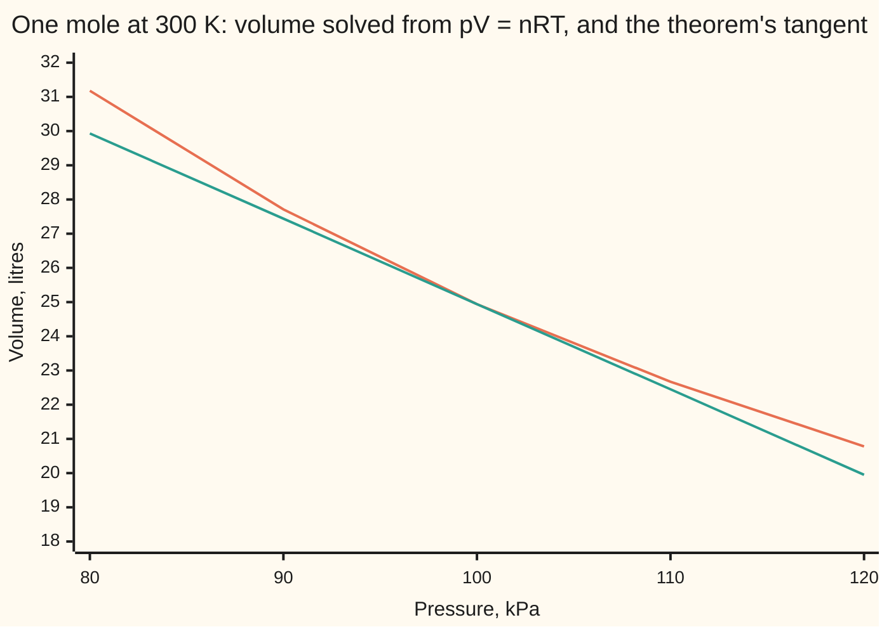

# Inverse and implicit function theorems: when an equation can be solved for one variable locally

[Syllabus](../../../SYLLABUS.md) → [Calculus and analysis](../../../SYLLABUS.md#w06) → [Several Variables](../../../SYLLABUS.md#w06-s07) → Inverse and implicit function theorems

---

## General Overview

One mole of air sits in a cylinder at 100 kPa and 300 K. The ideal gas law ties pressure, volume and temperature: pressure times volume equals 8.314 times temperature, in kilopascals, litres and kelvin. So the volume is 24.942 litres.

Warm the gas by 1 K: how much does the volume grow? Here the law rearranges for volume. Under the van der Waals law, a closer fit for carbon dioxide, it becomes a cubic in volume and rearranging is hopeless, yet the same rate is wanted.

The **implicit function theorem** says when an equation tying several quantities defines one of them as a function of the others near a known state, and gives that function's rates without writing it down. The **inverse function theorem** says when a map from several numbers to as many numbers can be run backwards near a point. Both test one thing: a matrix of rates must be invertible.

**Near a state that satisfies the equation, if the equation's rate in the unknown is not zero, the unknown is a smooth function of the rest (one with continuous partials), and its rates are minus the other rates divided by that one.**

**What kind of fact this is:** two theorems, proved on this card in Why it works; the existence half is in the folded Detailed proof.

### The picture: the volume curve and its tangent



The curve is the volume solved afresh at each pressure; the straight line is the tangent at the known state, slope −0.249420 litres per kPa, the theorem's rate.

---

## The formula

Reminders: ∂V/∂T, with the curly d, is litres gained per kelvin with pressure held still ([Partial derivatives](01-partial-derivatives.md)). A map's **Jacobian** is the grid of its partial derivatives, a row per output ([Chain rule in several variables](04-multivariable-chain-rule-and-jacobians.md)).

Write the gas law as one expression that must be zero:

$$F(p, V, T) = pV - nRT = 0$$

**Inverse function theorem.** Let $G$ take n numbers to n numbers, with continuous partial derivatives near a point $x_0$. If its Jacobian $J$ there is invertible, then near $x_0$ the map has an undo $G^{-1}$ with continuous partials, and

$$J_{G^{-1}}\big(G(x_0)\big) = J_G(x_0)^{-1}$$

**Read it aloud:** where the rate grid can be inverted, the map can be undone nearby, and the undo's rate grid is the inverse grid.

**Implicit function theorem.** Split the variables into $x$, left free, and $y$, the $m$ unknowns. Take $m$ equations $F(x, y) = 0$ holding at a known state $x_0$, $y_0$. If the square block ∂F/∂y, the equations' rates in the unknowns, is invertible there, then near $x_0$ exactly one nearby $y$ solves them, with continuous partials in $x$, and

$$\frac{\partial y}{\partial x} = -\left(\frac{\partial F}{\partial y}\right)^{-1}\frac{\partial F}{\partial x}$$

**Read it aloud:** the unknowns' rates are minus the inverse of their own block times the free variables' block.

For the gas, one equation and one unknown $V$: the block is the number ∂F/∂V = p, and inverting it is dividing.

$$\frac{\partial V}{\partial T} = -\frac{\partial F/\partial T}{\partial F/\partial V} = \frac{nR}{p}, \qquad \frac{\partial V}{\partial p} = -\frac{\partial F/\partial p}{\partial F/\partial V} = -\frac{V}{p}$$

| Symbol | Plain meaning | In our example | Push it up and the answer… |
| --- | --- | --- | --- |
| $p$, $V$, $T$ | pressure, volume, temperature | 100 kPa, 24.942 L, 300 K | more pressure: smaller rates |
| $n$, $R$ | amount of gas in moles; the gas constant | 1 mol; 8.314 kPa L per mol per K | — |
| $F$ | the law as one expression, zero on every real state | pV − nRT | — |
| $\partial F/\partial V$, $\partial F/\partial p$, $\partial F/\partial T$ | the rates of F in each variable, others held | 100, 24.942, −8.314 | ∂F/∂V near 0: the rates of V blow up |
| $G$, $H$, $J$ | maps from n numbers to n numbers; a Jacobian | G: (V, T) to (p, T), `[[-4.009302, 0.333333], [0, 1]]` | — |
| $x$, $y$, $m$, $x_0$, $y_0$ | free variables, the m unknowns, the known state | x = (p, T), y = V, m = 1 | — |
| $a$, $b$ | van der Waals constants: attraction, molecule volume | 364 kPa L^2 per mol^2; 0.04267 L per mol | — |
| $k$ | a small pressure step | 1 kPa down to 0.001 kPa | larger k: the quotient drifts from −0.249420 |

### When it holds

- **Continuous partials near the state.** The proof needs the Jacobian to change little nearby.
- **The unknowns' block is invertible: here ∂F/∂V = p is not zero.** Drop it and the guarantee goes. At p = 0 and T = 0 every volume solves the law; at p = 0 and T = 1 K none does. At carbon dioxide's critical point ∂F/∂V is 0: one volume still solves, but it has no finite rate in pressure.
- **As many equations as unknowns.** Ask pV = nRT to fix both V and T at a set pressure and a whole line of pairs solves it.
- **Near the state only.** The neighbourhood's size is not given. Below 304 K the van der Waals law gives carbon dioxide three volumes for each pressure in a band near condensation.

---

## Why it works

### Step 0: close up, a smooth map is almost its linear part

Close up, a map with continuous partials differs from its tangent-plane version by an error shrinking faster than the step ([Tangent planes](02-differentiability-and-tangent-planes.md)). A linear map with an invertible matrix can be undone exactly. The theorem says the undoing survives the small error.

### Step 1: the inverse theorem on the gas

Let $G$ send (V, T) to (p, T), with p = nRT/V. Its Jacobian has rows (∂p/∂V, ∂p/∂T) and (0, 1): ∂p/∂V = −nRT/V^2 = −4.009302 kPa per litre, ∂p/∂T = nR/V = 0.333333 kPa per kelvin.

The determinant is −4.009302, not zero, so $G$ can be undone near the state. Call these s and c. The matrix `[[s, c], [0, 1]]` has inverse `[[1/s, -c/s], [0, 1]]` ([The inverse matrix](../../03-Algebra/05-Solving%20Systems/03-inverse-matrix.md)), whose top row is −0.249420 and 0.083140: ∂V/∂p and ∂V/∂T, read off without solving for V.

Given the undo, the formula is the chain rule: undoing then doing returns the input, so the two Jacobians multiply to the identity.

### Step 2: why the undo exists

To reach an output near $G(x_0)$, start at $x_0$ and correct repeatedly by the inverse Jacobian times what the output still misses. The Jacobian barely changes nearby, so each correction at least halves the gap, closing on exactly one input: the contraction principle of [Fixed points](../03-What%20Derivatives%20Tell%20You/07-fixed-point-iteration-and-the-contraction-principle.md).

<details>
<summary>Detailed proof</summary>

Let J = J_G(x_0) be invertible; ||M|| is the largest stretch a matrix M applies. For a target y set φ(x) = x + J^{-1}(y − G(x)); its fixed points solve G(x) = y. By continuity of the partials pick r > 0 with ||I − J^{-1}J_G(x)|| ≤ 1/2 on the closed ball |x − x_0| ≤ r. The mean value inequality (a map moves points apart by at most its largest stretch times their distance) makes φ halve distances there.

If |y − G(x_0)| < δ = r/(2||J^{-1}||), φ maps the ball into itself, so it has exactly one fixed point, G^{-1}(y). The same bound gives |x − x'| ≤ 2||J^{-1}|| |G(x) − G(x')|: G^{-1} is continuous. Inverting G(x + h) − G(x) = J_G(x)h + o(|h|), where o(|h|) is an error that vanishes faster than |h|, then shows G^{-1} is differentiable with Jacobian J_G(x)^{-1}, continuous in y.

</details>

### Step 3: the implicit theorem is the inverse theorem in disguise

Let $H$ keep the free variables and record the equation: (p, T, V) to (p, T, F). Its Jacobian has rows (1, 0, 0), (0, 1, 0) and (∂F/∂p, ∂F/∂T, ∂F/∂V), so its determinant is ∂F/∂V = p = 100. Not zero, so $H$ can be undone. Feed the undo (p, T, 0): it returns the one nearby (p, T, V) with F = 0. With several unknowns the determinant is that of the block ∂F/∂y.

### Step 4: the rate formula, and the tolerance game

Along the branch, F(p, V(p, T), T) stays 0. By the chain rule, ∂F/∂T + ∂F/∂V · ∂V/∂T = 0: −8.314 + 100 · ∂V/∂T = 0, so ∂V/∂T = 0.083140 litres per kelvin. In p: 24.942 + 100 · ∂V/∂p = 0, so ∂V/∂p = −0.249420 litres per kPa.

The second road solves the law for V by halving an interval, before and after a pressure step k, and divides the change by k. It misses −0.249420 by 0.002470 at k = 1 kPa, 0.000249 at 0.1, 0.000025 at 0.01 and 0.000002 at 0.001. To land within 0.001, any upward step under 0.40254 kPa will do.

### Step 5: the case with no tidy formula

Carbon dioxide follows the van der Waals law, (p + an^2/V^2)(V − nb) = nRT, a cubic in V. At 100 kPa and 300 K the halving search gives 24.838374 L. There ∂F/∂V = p − an^2/V^2 + 2abn^3/V^3 = 99.412023, so ∂V/∂T = nR/99.412023 = 0.083632 L per kelvin. The solver's quotient agrees to six places.

The one-variable version, a curve in the plane, is [Implicit and inverse differentiation](../02-Derivatives/06-implicit-and-inverse-differentiation.md).

---

## Worked numbers, by hand

| Step | Arithmetic | Value |
| --- | --- | --- |
| volume at the state | 8.314 × 300 / 100 | 24.942 L |
| rates of F | ∂F/∂p = V, ∂F/∂V = p, ∂F/∂T = −nR | 24.942, 100, −8.314 |
| hypothesis | ∂F/∂V = 100 | not zero |
| warming rate | 8.314 / 100 | **0.083140 L per K** |
| squeezing rate | −24.942 / 100 | **−0.249420 L per kPa** |
| 3 K warmer, 2 kPa more | 3 × 0.083140 − 2 × 0.249420 | −0.249420 L |
| solved exactly | 8.314 × 303 / 102 − 24.942 | −0.244529 L |

The rates predict the quarter-litre shrink closely, not exactly, because the volume curve bends.

### What breaks if you drop a piece

| Mistake | Comes out at | What went wrong |
| --- | --- | --- |
| Minus sign dropped | −0.083140 L per K | Warmed gas at fixed pressure would shrink |
| Ratio upside down | 12.027905 | That is ∂T/∂V, kelvin per litre |
| ∂F/∂V = 0 at carbon dioxide's critical point | quotients −0.005451, then −0.569757 | Steps shrink a thousandfold, quotients grow a hundredfold: no finite rate |
| ∂F/∂V = 0 at p = 0, T = 0 | F = 0 at V = 1, 10 and 100 | Every volume solves; at T = 1 K, F = −8.314 and none does |

The critical point is V = 3b = 0.12801 L, T = 304.01 K, p = 7404.4 kPa, where the pressure curve goes flat.

---

## Code, from first principles, and it actually runs

Nothing is imported. Road 1 is the theorems' formulas: the implicit rate and the inverse Jacobian. Road 2 solves the law by halving an interval and takes difference quotients. Carbon dioxide is the second case; its critical point is the failed hypothesis.

### Python

```python
# Inverse and implicit function theorems -- the check behind the card.  Nothing
# is imported.  One mole of gas: p in kPa, V in litres, T in kelvin, and
# F(p, V, T) = pV - nRT = 0.  Road 1 is the theorems' formula; road 2 solves
# F = 0 for V by halving and takes shrinking difference quotients.
n, R, P, T = 1.0, 8.314, 100.0, 300.0     # R in kPa L per (mol K); the known state
A, B = 364.0, 0.04267                      # van der Waals constants for carbon dioxide
def ideal(p, V, t): return p * V - n * R * t
def vdw(p, V, t): return (p + A * n * n / (V * V)) * (V - n * B) - n * R * t
def solve(F, p, t, lo=0.05, hi=500.0):     # F < 0 below the root, > 0 above it
    for _ in range(200):
        mid = (lo + hi) / 2
        if F(p, mid, t) < 0: lo = mid
        else: hi = mid
    return (lo + hi) / 2
V = solve(ideal, P, T)
Fp, FV, FT = V, P, -n * R                  # the three partials of pV - nRT
dVdT, dVdp = -FT / FV, -Fp / FV            # road 1: implicit function theorem
s, c = -n * R * T / (V * V), n * R / V     # Jacobian of (V, T) -> (p, T): [[s, c], [0, 1]]
inv_row = (1 / s, -c / s)                  # top row of its inverse matrix
print(f"state: n = {n:.0f} mol, p = {P:.0f} kPa, T = {T:.0f} K; V by halving {V:.6f} L; |F| = {abs(ideal(P, V, T)):.9f}")
print(f"partials: dF/dp = {Fp:.6f}, dF/dV = {FV:.6f}, dF/dT = {FT:.6f}")
print(f"road 1, implicit: dV/dT = {dVdT:.6f} L per K, dV/dp = {dVdp:.6f} L per kPa")
print(f"inverse theorem: Jacobian [[{s:.6f}, {c:.6f}], [0, 1]], det {s:.6f}; inverse top row {inv_row[0]:.6f}, {inv_row[1]:.6f}")
errs = []
for k in (1.0, 0.1, 0.01, 0.001):          # road 2: shrinking pressure steps
    q = (solve(ideal, P + k, T) - V) / k
    errs.append(q - dVdp)
    print(f"road 2, pressure step {k} kPa: quotient {q:.6f}, error {q - dVdp:.6f}")
qT = (solve(ideal, P, T + 1e-3) - solve(ideal, P, T - 1e-3)) / 2e-3
print(f"road 2, temperature: central quotient {qT:.6f} L per K")
lo, hi = 0.0, 10.0                         # largest pressure step within 0.001
for _ in range(60):
    mid = (lo + hi) / 2
    if (solve(ideal, P + mid, T) - V) / mid - dVdp < 0.001: lo = mid
    else: hi = mid
print(f"tolerance: every pressure step under {lo:.5f} kPa lands within 0.001 of {dVdp:.6f}")
lin, exact = 3 * dVdT + 2 * dVdp, solve(ideal, P + 2, T + 3) - V
print(f"3 K warmer and 2 kPa more: predicted change {lin:.6f} L, solved change {exact:.6f} L")
ps = [80, 90, 100, 110, 120]
print("chart, V on the 300 K isotherm:", ", ".join(f"{solve(ideal, p, T):.2f}" for p in ps))
print("chart, tangent line at 100 kPa:", ", ".join(f"{V + dVdp * (p - P):.2f}" for p in ps))
W = solve(vdw, P, T)                       # second case: no tidy formula for V
WV = P - A * n * n / (W * W) + 2 * A * B * n ** 3 / W ** 3
wq = (solve(vdw, P, T + 1e-3) - solve(vdw, P, T - 1e-3)) / 2e-3
print(f"CO2 (a = {A:.0f}, b = {B}) at the same state: V {W:.6f} L; dF/dV {WV:.6f}; dV/dT implicit {n * R / WV:.6f}, quotient {wq:.6f}")
Vc, Tc, pc = 3 * B, 8 * A / (27 * R * B), A / (27 * B * B)
Fc = pc - A / Vc ** 2 + 2 * A * B / Vc ** 3
Vs = solve(vdw, pc, Tc, 0.05, 1.0)
qc = [(solve(vdw, pc + k, Tc, 0.05, 1.0) - Vs) / k for k in (1.0, 0.001)]
print(f"CO2 critical point: V {Vc:.5f} L (halving: {Vs:.5f}), T {Tc:.2f} K, p {pc:.1f} kPa; |dF/dV| {abs(Fc):.9f}")
print(f"critical quotients for pressure steps 1 and 0.001 kPa: {qc[0]:.6f}, {qc[1]:.6f}")
print(f"mistake 1, minus dropped: dV/dT = {FT / FV:.6f}; mistake 2, ratio upside down: {-FV / FT:.6f}")
print(f"mistake 3, p = 0 and T = 0: F at V = 1, 10, 100 is {ideal(0, 1, 0):.0f}, {ideal(0, 10, 0):.0f}, "
      f"{ideal(0, 100, 0):.0f}; at T = 1 K it is {ideal(0, 1, 1):.3f} for every V")
assert abs(errs[-1]) < 1e-5 and 9 < errs[1] / errs[2] < 11        # quotients close on road 1
assert abs(inv_row[1] - qT) < 1e-8 and abs(dVdT - qT) < 1e-8      # both theorems vs solver
assert abs(n * R / WV - wq) < 1e-8                                 # CO2: formula vs solver
assert qc[1] / qc[0] > 50                                          # no finite rate at dF/dV = 0
print("ALL CHECKS PASS")
```

**Ran 2026-09-27 on macOS, Python 3.14.6, standard library only. All checks passed. Output, pasted from the run:**

```
state: n = 1 mol, p = 100 kPa, T = 300 K; V by halving 24.942000 L; |F| = 0.000000000
partials: dF/dp = 24.942000, dF/dV = 100.000000, dF/dT = -8.314000
road 1, implicit: dV/dT = 0.083140 L per K, dV/dp = -0.249420 L per kPa
inverse theorem: Jacobian [[-4.009302, 0.333333], [0, 1]], det -4.009302; inverse top row -0.249420, 0.083140
road 2, pressure step 1.0 kPa: quotient -0.246950, error 0.002470
road 2, pressure step 0.1 kPa: quotient -0.249171, error 0.000249
road 2, pressure step 0.01 kPa: quotient -0.249395, error 0.000025
road 2, pressure step 0.001 kPa: quotient -0.249418, error 0.000002
road 2, temperature: central quotient 0.083140 L per K
tolerance: every pressure step under 0.40254 kPa lands within 0.001 of -0.249420
3 K warmer and 2 kPa more: predicted change -0.249420 L, solved change -0.244529 L
chart, V on the 300 K isotherm: 31.18, 27.71, 24.94, 22.67, 20.78
chart, tangent line at 100 kPa: 29.93, 27.44, 24.94, 22.45, 19.95
CO2 (a = 364, b = 0.04267) at the same state: V 24.838374 L; dF/dV 99.412023; dV/dT implicit 0.083632, quotient 0.083632
CO2 critical point: V 0.12801 L (halving: 0.12801), T 304.01 K, p 7404.4 kPa; |dF/dV| 0.000000000
critical quotients for pressure steps 1 and 0.001 kPa: -0.005451, -0.569757
mistake 1, minus dropped: dV/dT = -0.083140; mistake 2, ratio upside down: 12.027905
mistake 3, p = 0 and T = 0: F at V = 1, 10, 100 is 0, 0, 0; at T = 1 K it is -8.314 for every V
ALL CHECKS PASS
```

### Rust

Same numbers, same labels, built with `rustc --edition 2021 -O`.

```rust
// Inverse and implicit function theorems -- the same check as the Python, in
// Rust.  No crates.  One mole of gas: p in kPa, V in litres, T in kelvin, and
// F(p, V, T) = pV - nRT = 0.  Road 1 is the theorems' formula; road 2 solves
// F = 0 for V by halving and takes shrinking difference quotients.
const N: f64 = 1.0;
const R: f64 = 8.314;                      // kPa L per (mol K)
const P: f64 = 100.0;
const T: f64 = 300.0;                      // the known state
const A: f64 = 364.0;
const B: f64 = 0.04267;                    // van der Waals constants for carbon dioxide

fn ideal(p: f64, v: f64, t: f64) -> f64 { p * v - N * R * t }
fn vdw(p: f64, v: f64, t: f64) -> f64 { (p + A * N * N / (v * v)) * (v - N * B) - N * R * t }
fn solve(f: fn(f64, f64, f64) -> f64, p: f64, t: f64, mut lo: f64, mut hi: f64) -> f64 {
    for _ in 0..200 {                      // F < 0 below the root, > 0 above it
        let mid = (lo + hi) / 2.0;
        if f(p, mid, t) < 0.0 { lo = mid } else { hi = mid }
    }
    (lo + hi) / 2.0
}
fn gas(p: f64, t: f64) -> f64 { solve(ideal, p, t, 0.05, 500.0) }
fn co2(p: f64, t: f64) -> f64 { solve(vdw, p, t, 0.05, 500.0) }

fn main() {
    let v = gas(P, T);
    let (fp, fv, ft) = (v, P, -N * R);     // the three partials of pV - nRT
    let (dvdt, dvdp) = (-ft / fv, -fp / fv); // road 1: implicit function theorem
    let (s, c) = (-N * R * T / (v * v), N * R / v); // Jacobian of (V, T) -> (p, T)
    let inv_row = (1.0 / s, -c / s);       // top row of its inverse matrix
    println!("state: n = {:.0} mol, p = {:.0} kPa, T = {:.0} K; V by halving {:.6} L; |F| = {:.9}", N, P, T, v, ideal(P, v, T).abs());
    println!("partials: dF/dp = {:.6}, dF/dV = {:.6}, dF/dT = {:.6}", fp, fv, ft);
    println!("road 1, implicit: dV/dT = {:.6} L per K, dV/dp = {:.6} L per kPa", dvdt, dvdp);
    println!("inverse theorem: Jacobian [[{:.6}, {:.6}], [0, 1]], det {:.6}; inverse top row {:.6}, {:.6}", s, c, s, inv_row.0, inv_row.1);
    let mut errs = Vec::new();
    for k in [1.0_f64, 0.1, 0.01, 0.001] { // road 2: shrinking pressure steps
        let q = (gas(P + k, T) - v) / k;
        errs.push(q - dvdp);
        println!("road 2, pressure step {:?} kPa: quotient {:.6}, error {:.6}", k, q, q - dvdp);
    }
    let qt = (gas(P, T + 1e-3) - gas(P, T - 1e-3)) / 2e-3;
    println!("road 2, temperature: central quotient {:.6} L per K", qt);
    let (mut lo, mut hi) = (0.0_f64, 10.0_f64); // largest pressure step within 0.001
    for _ in 0..60 {
        let mid = (lo + hi) / 2.0;
        if (gas(P + mid, T) - v) / mid - dvdp < 0.001 { lo = mid } else { hi = mid }
    }
    println!("tolerance: every pressure step under {:.5} kPa lands within 0.001 of {:.6}", lo, dvdp);
    let (lin, exact) = (3.0 * dvdt + 2.0 * dvdp, gas(P + 2.0, T + 3.0) - v);
    println!("3 K warmer and 2 kPa more: predicted change {:.6} L, solved change {:.6} L", lin, exact);
    let ps = [80.0, 90.0, 100.0, 110.0, 120.0];
    let iso: Vec<String> = ps.iter().map(|&p| format!("{:.2}", gas(p, T))).collect();
    let tan: Vec<String> = ps.iter().map(|&p| format!("{:.2}", v + dvdp * (p - P))).collect();
    println!("chart, V on the 300 K isotherm: {}", iso.join(", "));
    println!("chart, tangent line at 100 kPa: {}", tan.join(", "));
    let w = co2(P, T);                     // second case: no tidy formula for V
    let wv = P - A * N * N / (w * w) + 2.0 * A * B * N.powi(3) / w.powi(3);
    let wq = (co2(P, T + 1e-3) - co2(P, T - 1e-3)) / 2e-3;
    println!("CO2 (a = {:.0}, b = {}) at the same state: V {:.6} L; dF/dV {:.6}; dV/dT implicit {:.6}, quotient {:.6}", A, B, w, wv, N * R / wv, wq);
    let (vc, tc, pc) = (3.0 * B, 8.0 * A / (27.0 * R * B), A / (27.0 * B * B));
    let fc = pc - A / vc.powi(2) + 2.0 * A * B / vc.powi(3);
    let vs = solve(vdw, pc, tc, 0.05, 1.0);
    let qc: Vec<f64> = [1.0, 0.001].iter().map(|&k| (solve(vdw, pc + k, tc, 0.05, 1.0) - vs) / k).collect();
    println!("CO2 critical point: V {:.5} L (halving: {:.5}), T {:.2} K, p {:.1} kPa; |dF/dV| {:.9}", vc, vs, tc, pc, fc.abs());
    println!("critical quotients for pressure steps 1 and 0.001 kPa: {:.6}, {:.6}", qc[0], qc[1]);
    println!("mistake 1, minus dropped: dV/dT = {:.6}; mistake 2, ratio upside down: {:.6}", ft / fv, -fv / ft);
    println!("mistake 3, p = 0 and T = 0: F at V = 1, 10, 100 is {:.0}, {:.0}, {:.0}; at T = 1 K it is {:.3} for every V",
             ideal(0.0, 1.0, 0.0), ideal(0.0, 10.0, 0.0), ideal(0.0, 100.0, 0.0), ideal(0.0, 1.0, 1.0));
    assert!(errs[3].abs() < 1e-5 && errs[1] / errs[2] > 9.0 && errs[1] / errs[2] < 11.0); // quotients close
    assert!((inv_row.1 - qt).abs() < 1e-8 && (dvdt - qt).abs() < 1e-8); // both theorems vs solver
    assert!((N * R / wv - wq).abs() < 1e-8);                       // CO2: formula vs solver
    assert!(qc[1] / qc[0] > 50.0);                                 // no finite rate at dF/dV = 0
    println!("ALL CHECKS PASS");
}
```

**Ran 2026-09-27 on macOS, rustc 1.98.1, no crates. All checks passed. Output, pasted from the run:**

```
state: n = 1 mol, p = 100 kPa, T = 300 K; V by halving 24.942000 L; |F| = 0.000000000
partials: dF/dp = 24.942000, dF/dV = 100.000000, dF/dT = -8.314000
road 1, implicit: dV/dT = 0.083140 L per K, dV/dp = -0.249420 L per kPa
inverse theorem: Jacobian [[-4.009302, 0.333333], [0, 1]], det -4.009302; inverse top row -0.249420, 0.083140
road 2, pressure step 1.0 kPa: quotient -0.246950, error 0.002470
road 2, pressure step 0.1 kPa: quotient -0.249171, error 0.000249
road 2, pressure step 0.01 kPa: quotient -0.249395, error 0.000025
road 2, pressure step 0.001 kPa: quotient -0.249418, error 0.000002
road 2, temperature: central quotient 0.083140 L per K
tolerance: every pressure step under 0.40254 kPa lands within 0.001 of -0.249420
3 K warmer and 2 kPa more: predicted change -0.249420 L, solved change -0.244529 L
chart, V on the 300 K isotherm: 31.18, 27.71, 24.94, 22.67, 20.78
chart, tangent line at 100 kPa: 29.93, 27.44, 24.94, 22.45, 19.95
CO2 (a = 364, b = 0.04267) at the same state: V 24.838374 L; dF/dV 99.412023; dV/dT implicit 0.083632, quotient 0.083632
CO2 critical point: V 0.12801 L (halving: 0.12801), T 304.01 K, p 7404.4 kPa; |dF/dV| 0.000000000
critical quotients for pressure steps 1 and 0.001 kPa: -0.005451, -0.569757
mistake 1, minus dropped: dV/dT = -0.083140; mistake 2, ratio upside down: 12.027905
mistake 3, p = 0 and T = 0: F at V = 1, 10, 100 is 0, 0, 0; at T = 1 K it is -8.314 for every V
ALL CHECKS PASS
```

The two outputs match line for line.

> [!TIP]
> **Try changing**
> - **A hotter state.** Guess first, then set `T` to `600.0`. The volume doubles to 49.884000 L; ∂V/∂T stays 0.083140, since nR/p ignores temperature; ∂V/∂p doubles to −0.498840.
> - **Leave the critical point.** Guess first, then change `8 * A` to `8.3 * A`, about 11 K hotter. The pressure curve is no longer flat, both quotients read −0.000066, and the last assert fails.

---

## The usual mistake

> [!warning]
> **Differentiating an equation proves nothing about whether a solution exists.** Step 4 assumes a smooth V(p, T) is already there. At p = 0 and T = 0 the algebra divides by zero and every volume solves the law. Check ∂F/∂V first.
>
> - **Dropping the minus sign.** It gives −0.083140 L per K: gas that shrinks when warmed.
> - **Dividing the wrong way round.** 12.027905 is kelvin per litre, the rate of T in V.

---

## Where you meet it in real life

- **Chemical engineering.** Equations of state like van der Waals do not solve neatly for volume; expansion rates come from this card's formula.
- **Robot arms.** Joint angles in, hand position out; working backwards is the inverse theorem, and a zero Jacobian determinant is a singular pose.
- **Constrained optimisation.** The implicit theorem makes a surface given by one equation locally a graph, which is what [Lagrange multipliers](08-lagrange-multipliers.md) relies on.

> **Say it back**
> An equation defines one quantity as a smooth function of the rest near a known state, if its rate in that unknown is not zero. The unknown's rates are minus the other rates divided by that one: for one mole at 100 kPa and 300 K, 0.083140 L per kelvin and −0.249420 L per kPa. The implicit theorem is the inverse theorem applied to a map that keeps the free variables and records the equation. Where the rate is zero, as at carbon dioxide's critical point, it fails.

---

## What this builds on

- [Chain rule in several variables](04-multivariable-chain-rule-and-jacobians.md): the Jacobian, and the chain rule that turns F = 0 into the rate formula.
- [The inverse matrix](../../03-Algebra/05-Solving%20Systems/03-inverse-matrix.md): when a square matrix can be undone, and the 2 by 2 inverse of Step 1.

## Where this goes next

- Lagrange multipliers, proved: constraints as local graphs, regularity made precise.
- Diffeomorphism, immersion, submersion: an invertible Jacobian as a local change of coordinates.
- Regular value theorem: the solutions of F = 0 forming a smooth surface.
- The Jacobian conjecture: whether a polynomial map with constant nonzero Jacobian determinant has a global polynomial inverse, still open.

---

## Sources

Verified 27 Sep 2026: every link below resolves to the publisher's page.

- Lebl, Jiří. *Basic Analysis II*. [Section 8.5, Inverse and implicit function theorems](https://www.jirka.org/ra/html/sec_svinvfuncthm.html). Free; both proofs by contraction.
- Spivak, Michael. *Calculus on Manifolds*. CRC Press. [Publisher page](https://www.routledge.com/Calculus-On-Manifolds-A-Modern-Approach-To-Classical-Theorems-Of-Advanced-Calculus/Spivak/p/book/9780805390216). Chapter 2 derives the implicit theorem by Step 3's map.
- Apostol, Tom M. *Calculus, Volume 2*, 2nd ed. Wiley. [Publisher page](https://www.wiley.com/en-us/Calculus%2C+Volume+2%2C+2nd+Edition-p-9781119496762). Implicit functions of several variables and the Jacobian test.
