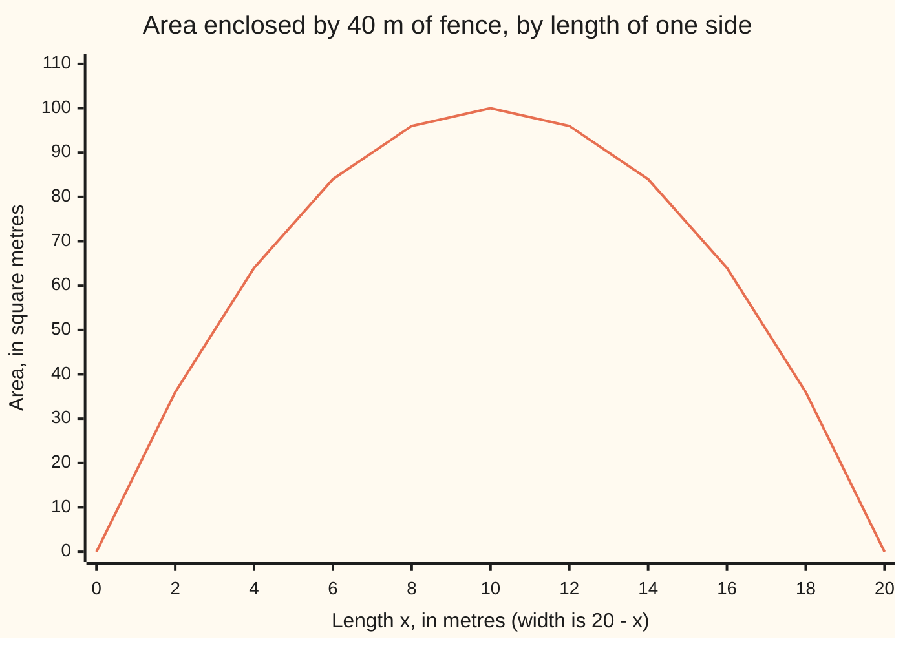
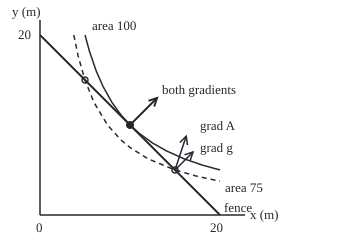

# Lagrange multipliers: the best point on a constraint is where the gradients line up

[Syllabus](../../../SYLLABUS.md) → [Calculus and analysis](../../../SYLLABUS.md#w06) → [Several Variables](../../../SYLLABUS.md#w06-s07) → Lagrange multipliers

---

## General Overview

A roll of 40 metres of fencing will enclose a rectangular paddock. A thin strip, 18 m by 2 m, holds 36 square metres. A 15 m by 5 m pen holds 75. A 10 m square holds 100, and no other shape does better.

There are two dials, length and width, and a rule tying them: the sides add to 40 m. Calculus with no rule seeks a point where every rate is zero ([Extrema in several variables](06-multivariable-extrema.md)); for area, only the empty paddock. The real question: which shape the fence allows is best?

Lagrange's answer, published in 1788, adds one unknown. At the best point, the direction that grows the area fastest is the direction that uses fence fastest. The stretch factor between those two arrows is the **multiplier**, the word used from here on. It is also a price: one more metre of fence buys about 5 square metres.

**At the best point allowed by a rule, the gradient of what is being optimised is a multiple of the gradient of the rule, and that multiple is the rate at which the best value improves as the rule is loosened.**

**What kind of fact this is:** a theorem, proved on this card in Why it works, price reading included.

### The picture: area along the fence



The line is the area of every rectangle the fence allows. It peaks at 100 m^2 at a length of 10 m.

---

## The formula

Notation first, in words. The rule is written $g(x, y) = P$: a function of the dials equals a fixed number. The gradient $\nabla A$, "grad A", is the arrow of the partial rates of $A$ ([Gradient](03-gradient-and-directional-derivatives.md)). The Greek letter $\lambda$, "lambda", is the multiplier.

$$\nabla A(x, y) = \lambda \, \nabla g(x, y), \qquad g(x, y) = P$$

**Read it aloud:** at the best point, the arrow of steepest area gain is some number times the arrow of steepest fence use, and the point still obeys the fence.

For the paddock, $A = xy$ and $g = 2x + 2y$, so $\nabla A = (y, x)$ and $\nabla g = (2, 2)$. The formula is three ordinary equations in three unknowns:

$$y = 2\lambda, \qquad x = 2\lambda, \qquad 2x + 2y = 40.$$

The same equations say that the helper function $\mathcal{L} = A - \lambda\,(g - P)$, the **Lagrangian**, has zero rate in $x$, in $y$ and in $\lambda$. That is bookkeeping, not a claim that it has a maximum.

| Symbol | Plain meaning | In our example | Push it up and the answer… |
| --- | --- | --- | --- |
| $x$, $y$, $p$ | length and width; $p$, the best point, in the proof | 10 m, 10 m | leaves the fence unless the other drops |
| $A$, $f$ | what is made best: area $A = xy$ ($f$ in the proof) | 100 m^2 | — |
| $g$ | the rule's function: fence used, $2x + 2y$ | 40 m | — |
| $P$, $c$ | the fixed amount allowed ($c$ in the proof) | 40 m | best area rises about $\lambda$ per metre |
| $\nabla A$, $\nabla g$ | gradients: arrows of partial rates | $(10, 10)$, $(2, 2)$ | — |
| $\lambda$ | the multiplier: stretch between the arrows, and the rule's price, objective units per rule unit | 5 m^2 per metre | a dearer rule |
| $t$ | a step that stays on the fence | $(1, -1)$ | — |
| $\mathcal{L}$ | the Lagrangian | zero rates at (10, 10, 5) | — |

### When it holds

- **Smooth functions.** $A$ and $g$ need continuous partial rates; a kink has no gradient.
- **A regular rule: $\nabla g$ is not the zero arrow.** Write the same fence as $(2x + 2y - 40)^2 = 0$ and its gradient is $(0, 0)$ all along it; the true best point then solves no multiplier equation.
- **Equality, not a ceiling.** "At most 40 m" adds edges, such as zero width, which are checked by hand.
- **Necessary, not sufficient.** A solution can be a worst point or neither; candidates still need comparing.

---

## Why it works

### Step 0: at the best point, walking along the rule gains nothing

From the 15 m by 5 m pen, a step to 14 by 6 raises the area from 75 to 84 m^2, so the pen is not best. At the best point no step along the fence pays, to first order: its rate of gain is zero.

### Step 1: the allowed steps are the ones the rule's gradient does not see

A step $t$ changes fence use at the rate $\nabla g \cdot t$, a dot product. Staying on the fence makes that rate zero. For $\nabla g = (2, 2)$ that leaves $t = (1, -1)$ and its multiples: one side grows as the other shrinks.

### Step 2: at the best point, the area's gradient does not see them either

The area changes along that step at the rate $\nabla A \cdot t = y - x$. At the 15 by 5 pen that is $5 - 15 = -10$: lengthening loses 10 m^2 per metre, so shortening gains it. At the best point the rate is zero, or one direction would pay: $\nabla A \cdot t = 0$.

### Step 3: two arrows at right angles to the same step lie along one line

In the plane, the arrows at right angles to $t = (1, -1)$ are the multiples of $(1, 1)$, and both gradients are among them. Since $\nabla g$ is not zero, $\nabla A = \lambda \nabla g$ for some number $\lambda$. Here the regular-rule condition is used: a zero $\nabla g$ has only zero multiples.

### Step 4: solve

$y = 2\lambda$ and $x = 2\lambda$ give $x = y$. The fence gives $4x = 40$. So $x = y = 10$ m and $\lambda = 5$. The equations have no other solution, so if a best rectangle exists, it is this square.

### Step 5: prove it is the best, not just a candidate

Along the fence, $y = 20 - x$, and the area is $x(20 - x) = 100 - (x - 10)^2$. A square is never negative, so no allowed rectangle beats 100 m^2, and only the 10 by 10 square reaches it. This second road uses no multiplier.

### Step 6: the multiplier is the price of the rule

Let the fence length $P$ vary, and assume the best point moves smoothly with it; the best area $A^*(P)$ moves too. By the chain rule ([Chain rule in several variables](04-multivariable-chain-rule-and-jacobians.md)), the best area's rate is $\nabla A$ dotted with the best point's velocity, how fast it moves per metre of fence. Swap in $\lambda \nabla g$: the rate is $\lambda$ times the rate of $g$, and $g$ equals $P$ throughout, so that rate is 1. The best area grows at $\lambda$ square metres per metre of fence.

Here $A^*(P) = P^2 / 16$, with rate $40 / 8 = 5$ at 40 m. A 41 m fence gives a 10.25 m square, 105.0625 m^2: a gain of 5.0625, the extra from the bend.

Against a river, one long side needs no fence: $x + 2y = 40$. The same steps give 20 m by 10 m and $\lambda = 10$; each metre of fence works twice as hard.

<details>
<summary>Detailed proof, for any smooth objective and one regular rule in the plane</summary>

Let $f$ and $g$ have continuous partial rates near $p = (a, b)$, with $g(p) = c$, $\nabla g(p) \neq 0$, and $p$ a local best point of $f$ among nearby points with $g = c$. Write $f_x = \partial f / \partial x$ and so on, and say $g_y \neq 0$ at $p$ (else swap $x$ and $y$). The implicit function theorem ([Inverse and implicit function theorems](07-inverse-and-implicit-function-theorems.md)) gives a smooth $Y(x)$ near $x = a$ with $Y(a) = b$ and $g(x, Y(x)) = c$, covering the rule near $p$.

Then $\Phi(x) = f(x, Y(x))$ has a local best value at the inner point $x = a$, so $0 = \Phi'(a) = f_x + f_y Y'(a)$, while $g_x + g_y Y'(a) = 0$, partials at $p$. Put $\lambda = f_y / g_y$. Then $f_y = \lambda g_y$, and $f_x = -f_y Y'(a) = -\lambda g_y Y'(a) = \lambda g_x$.

</details>


Several rules bring one multiplier each, and "at most" rules add sign conditions: Lagrange multipliers, proved.

### The picture: the fence touches the best area curve

<p align="center"></p>

Scale: 9 pixels per metre. The straight line is the fence, length plus width 20 m. The dashed curve, every 75 m^2 rectangle, crosses it at two pens; the solid curve, every 100 m^2 rectangle, only touches it, at the square, where the gradients share a line. Arrows show direction only.

---

## Worked numbers, by hand

| Step | Arithmetic | Value |
| --- | --- | --- |
| line them up | $y = 2\lambda$, $x = 2\lambda$ | $x = y$ |
| use the fence | $2x + 2y = 40$, so $4x = 40$ | $x = y = 10$ m |
| multiplier | $\lambda = y / 2 = 10 / 2$ | **5 m^2 per metre** |
| best area | $10 \times 10$ | **100 m^2** |
| check the price | 41 m: $10.25 \times 10.25$ | 105.0625 m^2, gain 5.0625 |
| river | $y = \lambda$, $x = 2\lambda$, $x + 2y = 40$ | 20 by 10, 200 m^2, $\lambda = 10$ |

The square is best, and one more metre of fence is worth about 5 m^2 of grass.

### What breaks if you drop a piece

| Mistake | Comes out at | What went wrong |
| --- | --- | --- |
| Set $\nabla A = 0$, no fence | (0, 0), area 0 | Only the empty paddock has zero rates |
| Drop the fence equation | $\lambda = 6$: 12 by 12, 48 m, 144 m^2 | Every square solves the gradient equations |
| Square the rule: $(2x + 2y - 40)^2 = 0$ | gradient (0, 0) at (10, 10); no $\lambda$ | The rule is no longer regular |
| Four-side price used by the river | predicts 5 m^2; true gain 10.125 | A multiplier belongs to one rule |

The code prints all four.

---

## Code, from first principles, and it actually runs

Two roads to the best paddock, for both fences. Road one solves the multiplier equations by Cramer's rule. Road two never mentions a multiplier: a golden-section search (a bracket shrunk by the golden ratio each step) walks the fence to the peak. The price comes from road two alone, as the best area's difference quotient over a millimetre of fence, checked against road one's $\lambda$. A third assert checks Step 5's identity at 141 points.

### Python

```python
# Lagrange multipliers -- the check behind the card.  Standard library only.
# Fence a rectangle, x by y metres, with P metres of fence: a*x + b*y = P.
# Four sides: a = b = 2.  Beside a river (no fence on one long side): a = 1, b = 2.
# Road one solves the Lagrange equations y = lam*a, x = lam*b, a*x + b*y = P.
# Road two walks along the fence and searches for the biggest area.
def det(m):
    return (m[0][0] * (m[1][1] * m[2][2] - m[1][2] * m[2][1])
            - m[0][1] * (m[1][0] * m[2][2] - m[1][2] * m[2][0])
            + m[0][2] * (m[1][0] * m[2][1] - m[1][1] * m[2][0]))

def lagrange(a, b, P):                  # Cramer's rule on the 3 x 3 system
    m, rhs = [[0, 1, -a], [1, 0, -b], [a, b, 0]], [0, 0, P]
    d = det(m)
    col = lambda j: [[rhs[i] if k == j else m[i][k] for k in range(3)] for i in range(3)]
    return [det(col(j)) / d for j in range(3)]

def search(a, b, P):                    # golden-section search along the fence
    area = lambda x: x * (P - a * x) / b
    lo, hi, r = 0.0, P / a, (5 ** 0.5 - 1) / 2
    for _ in range(200):
        p, q = hi - r * (hi - lo), lo + r * (hi - lo)
        if area(p) < area(q): lo = p
        else: hi = q
    x = (lo + hi) / 2
    return x, area(x)

def price(a, b, P, h=1e-3):             # slope of the best area as the fence grows
    return (search(a, b, P + h)[1] - search(a, b, P - h)[1]) / (2 * h)

for name, a, b in (("four sides", 2, 2), ("river", 1, 2)):
    x, y, lam = lagrange(a, b, 40)
    sx, sa = search(a, b, 40)
    pr = price(a, b, 40)
    print(f"{name}: Lagrange x = {x:.6f}, y = {y:.6f}, lambda = {lam:.6f}, area = {x * y:.6f}")
    print(f"{name}: search along the fence x = {sx:.6f}, area = {sa:.6f}; price slope = {pr:.6f}")
    print(f"{name}: 41 m of fence gives area {search(a, b, 41)[1]:.4f}, gain {search(a, b, 41)[1] - sa:.4f}")
    assert abs(sx - x) < 1e-6 and abs(sa - x * y) < 1e-6      # two roads, one best point
    assert abs(pr - lam) < 1e-6                                # the multiplier is the price
xs = list(range(0, 21, 2))
print("area along the four-side fence, x = 0, 2, ..., 20:", " ".join(str(x * (20 - x)) for x in xs))
pts = [k / 7 for k in range(141)]                    # 0 to 20 m in steps of 1/7
assert all(abs((100 - x * (20 - x)) - (x - 10) ** 2) < 1e-12 for x in pts)
print(f"square identity 100 - x(20 - x) = (x - 10)^2 holds at {len(pts)} points on the fence")
for x, y in ((10, 10), (15, 5)):
    print(f"at ({x}, {y}): grad A = ({y}, {x}), grad g = (2, 2), area {x * y}, rate as x grows along the fence = {y - x}")
x0, y0 = 0, 0                            # grad A = (y, x) = (0, 0) has one solution
print(f"mistake 1, grad A = 0 with no fence: ({x0}, {y0}), area {x0 * y0}")
x2 = y2 = 2 * 6                          # y = 2*lam, x = 2*lam with lam = 6, fence ignored
print(f"mistake 2, no fence equation: lambda = 6 gives {x2} by {y2}, fence {2 * x2 + 2 * y2}, area {x2 * y2}")
s = 2 * (2 * 10 + 2 * 10 - 40)
print(f"mistake 3, fence squared: its gradient at (10, 10) = ({s * 2}, {s * 2}), grad A = (10, 10)")
print(f"mistake 4, river priced at 5: predicts gain 5, true gain {search(1, 2, 41)[1] - 200:.4f}")
px = lambda x, y: (40 + 9 * x, 215 - 9 * y)
print("figure, 9 px per m, origin (40, 215): fence ends", px(0, 20), px(20, 0),
      "touch", px(10, 10), "crossings", px(5, 15), px(15, 5))
print("ALL CHECKS PASS")
```

**Ran 2026-09-27 on macOS, Python 3.14.6, standard library only. All checks passed. Output, pasted from the run:**

```
four sides: Lagrange x = 10.000000, y = 10.000000, lambda = 5.000000, area = 100.000000
four sides: search along the fence x = 10.000000, area = 100.000000; price slope = 5.000000
four sides: 41 m of fence gives area 105.0625, gain 5.0625
river: Lagrange x = 20.000000, y = 10.000000, lambda = 10.000000, area = 200.000000
river: search along the fence x = 20.000000, area = 200.000000; price slope = 10.000000
river: 41 m of fence gives area 210.1250, gain 10.1250
area along the four-side fence, x = 0, 2, ..., 20: 0 36 64 84 96 100 96 84 64 36 0
square identity 100 - x(20 - x) = (x - 10)^2 holds at 141 points on the fence
at (10, 10): grad A = (10, 10), grad g = (2, 2), area 100, rate as x grows along the fence = 0
at (15, 5): grad A = (5, 15), grad g = (2, 2), area 75, rate as x grows along the fence = -10
mistake 1, grad A = 0 with no fence: (0, 0), area 0
mistake 2, no fence equation: lambda = 6 gives 12 by 12, fence 48, area 144
mistake 3, fence squared: its gradient at (10, 10) = (0, 0), grad A = (10, 10)
mistake 4, river priced at 5: predicts gain 5, true gain 10.1250
figure, 9 px per m, origin (40, 215): fence ends (40, 35) (220, 215) touch (130, 125) crossings (85, 80) (175, 170)
ALL CHECKS PASS
```

### Rust

Same numbers, same labels, built with `rustc --edition 2021 -O`.

```rust
// Lagrange multipliers -- the same check as the Python, in Rust.  No crates.
// Fence a rectangle, x by y metres, with P metres of fence: a*x + b*y = P.
// Four sides: a = b = 2.  Beside a river (no fence on one long side): a = 1, b = 2.
// Road one solves the Lagrange equations y = lam*a, x = lam*b, a*x + b*y = P.
// Road two walks along the fence and searches for the biggest area.
fn det(m: &[[f64; 3]; 3]) -> f64 {
    m[0][0] * (m[1][1] * m[2][2] - m[1][2] * m[2][1])
        - m[0][1] * (m[1][0] * m[2][2] - m[1][2] * m[2][0])
        + m[0][2] * (m[1][0] * m[2][1] - m[1][1] * m[2][0])
}

fn lagrange(a: f64, b: f64, p: f64) -> [f64; 3] {  // Cramer's rule on the 3 x 3 system
    let m = [[0.0, 1.0, -a], [1.0, 0.0, -b], [a, b, 0.0]];
    let rhs = [0.0, 0.0, p];
    let d = det(&m);
    let mut out = [0.0; 3];
    for j in 0..3 {
        let mut c = m;
        for i in 0..3 { c[i][j] = rhs[i] }
        out[j] = det(&c) / d;
    }
    out
}

fn search(a: f64, b: f64, p: f64) -> (f64, f64) {  // golden-section search along the fence
    let area = |x: f64| x * (p - a * x) / b;
    let (mut lo, mut hi, r) = (0.0, p / a, (5f64.sqrt() - 1.0) / 2.0);
    for _ in 0..200 {
        let (u, v) = (hi - r * (hi - lo), lo + r * (hi - lo));
        if area(u) < area(v) { lo = u } else { hi = v }
    }
    let x = (lo + hi) / 2.0;
    (x, area(x))
}

fn price(a: f64, b: f64, p: f64) -> f64 {          // slope of the best area as the fence grows
    let h = 1e-3;
    (search(a, b, p + h).1 - search(a, b, p - h).1) / (2.0 * h)
}

fn main() {
    for (name, a, b) in [("four sides", 2.0, 2.0), ("river", 1.0, 2.0)] {
        let [x, y, lam] = lagrange(a, b, 40.0);
        let (sx, sa) = search(a, b, 40.0);
        let pr = price(a, b, 40.0);
        let a41 = search(a, b, 41.0).1;
        println!("{}: Lagrange x = {:.6}, y = {:.6}, lambda = {:.6}, area = {:.6}", name, x, y, lam, x * y);
        println!("{}: search along the fence x = {:.6}, area = {:.6}; price slope = {:.6}", name, sx, sa, pr);
        println!("{}: 41 m of fence gives area {:.4}, gain {:.4}", name, a41, a41 - sa);
        assert!((sx - x).abs() < 1e-6 && (sa - x * y).abs() < 1e-6);  // two roads, one best point
        assert!((pr - lam).abs() < 1e-6);                              // the multiplier is the price
    }
    let row: Vec<String> = (0..=20).step_by(2).map(|x: i64| (x * (20 - x)).to_string()).collect();
    println!("area along the four-side fence, x = 0, 2, ..., 20: {}", row.join(" "));
    let pts: Vec<f64> = (0..141).map(|k| k as f64 / 7.0).collect();   // 0 to 20 m in steps of 1/7
    assert!(pts.iter().all(|&x| ((100.0 - x * (20.0 - x)) - (x - 10.0).powi(2)).abs() < 1e-12));
    println!("square identity 100 - x(20 - x) = (x - 10)^2 holds at {} points on the fence", pts.len());
    for (x, y) in [(10, 10), (15, 5)] {
        println!("at ({}, {}): grad A = ({}, {}), grad g = (2, 2), area {}, rate as x grows along the fence = {}", x, y, y, x, x * y, y - x);
    }
    let (x0, y0) = (0, 0);                            // grad A = (y, x) = (0, 0) has one solution
    println!("mistake 1, grad A = 0 with no fence: ({}, {}), area {}", x0, y0, x0 * y0);
    let (x2, y2) = (2 * 6, 2 * 6);                    // y = 2*lam, x = 2*lam with lam = 6, fence ignored
    println!("mistake 2, no fence equation: lambda = 6 gives {} by {}, fence {}, area {}", x2, y2, 2 * x2 + 2 * y2, x2 * y2);
    let s = 2 * (2 * 10 + 2 * 10 - 40);
    println!("mistake 3, fence squared: its gradient at (10, 10) = ({}, {}), grad A = (10, 10)", s * 2, s * 2);
    println!("mistake 4, river priced at 5: predicts gain 5, true gain {:.4}", search(1.0, 2.0, 41.0).1 - 200.0);
    let px = |x: i64, y: i64| format!("({}, {})", 40 + 9 * x, 215 - 9 * y);
    println!("figure, 9 px per m, origin (40, 215): fence ends {} {} touch {} crossings {} {}",
             px(0, 20), px(20, 0), px(10, 10), px(5, 15), px(15, 5));
    println!("ALL CHECKS PASS");
}
```

**Ran 2026-09-27 on macOS, rustc 1.98.1, no crates. All checks passed. Output, pasted from the run:**

```
four sides: Lagrange x = 10.000000, y = 10.000000, lambda = 5.000000, area = 100.000000
four sides: search along the fence x = 10.000000, area = 100.000000; price slope = 5.000000
four sides: 41 m of fence gives area 105.0625, gain 5.0625
river: Lagrange x = 20.000000, y = 10.000000, lambda = 10.000000, area = 200.000000
river: search along the fence x = 20.000000, area = 200.000000; price slope = 10.000000
river: 41 m of fence gives area 210.1250, gain 10.1250
area along the four-side fence, x = 0, 2, ..., 20: 0 36 64 84 96 100 96 84 64 36 0
square identity 100 - x(20 - x) = (x - 10)^2 holds at 141 points on the fence
at (10, 10): grad A = (10, 10), grad g = (2, 2), area 100, rate as x grows along the fence = 0
at (15, 5): grad A = (5, 15), grad g = (2, 2), area 75, rate as x grows along the fence = -10
mistake 1, grad A = 0 with no fence: (0, 0), area 0
mistake 2, no fence equation: lambda = 6 gives 12 by 12, fence 48, area 144
mistake 3, fence squared: its gradient at (10, 10) = (0, 0), grad A = (10, 10)
mistake 4, river priced at 5: predicts gain 5, true gain 10.1250
figure, 9 px per m, origin (40, 215): fence ends (40, 35) (220, 215) touch (130, 125) crossings (85, 80) (175, 170)
ALL CHECKS PASS
```

The two outputs match line for line.

> [!TIP]
> **Try changing**
> Guess first, then run it.
> - **A longer roll.** Change the three `40`s in the loop to `60`. Answer: 15 by 15, 225 m^2, $\lambda = 7.5$.
> - **Fence the river side at double cost.** Change the river's `1, 2` to `3, 2`. Answer: $x = 20/3 \approx 6.667$ m, $y = 10$ m, $\lambda = 10/3 \approx 3.333$.

---

## The usual mistake

> [!warning]
> **Treating the multiplier equations as the answer.** They list candidates, which may be worst points or neither, and they never list edges such as a zero-width strip. The square is confirmed by Step 5.
>
> - **Reading $\lambda$ as the answer.** $\lambda = 5$ is square metres per metre of fence; the area is 100.

---

## Where you meet it in real life

- **Economics.** A fixed budget is spent for the most benefit; the multiplier is the worth of one more pound, called the shadow price.
- **Mechanics.** A bead on a wire obeys a rule; the multiplier is the wire's push, in Lagrangian and Hamiltonian mechanics.
- **Machine learning.** A support vector machine finds the widest gap between two classes; the multipliers pick out the points that matter, in Support vector machines.

> **Say it back**
> A rule ties the dials, so only some steps are allowed. At the best point no allowed step pays, so both gradients are at right angles to every allowed step and share a line: one is $\lambda$ times the other. With the rule, that lists candidates, which still need checking. The multiplier is the rule's price: 5 m^2 per metre of fence.

---

## What this builds on

- [Gradient](03-gradient-and-directional-derivatives.md): the gradient, and the rate along a direction as a dot product.
- [Extrema in several variables](06-multivariable-extrema.md): best points with no rule, where the whole gradient must vanish.

## Where this goes next

- [Convex functions](09-convex-functions.md): when a candidate is sure to be best.
- Lagrange multipliers, proved: many rules, and "at most" rules.
- [Paths with a budget](../../08-Differential%20equations%20and%20dynamics/12-Calculus%20of%20Variations%20and%20Optimal%20Control/03-constrained-paths-and-the-hanging-chain.md): the unknown is a whole curve.
- [The efficient frontier](../../12-Financial%20mathematics/37-Portfolio%20Theory/02-efficient-frontier-and-minimum-variance.md): least risk, set return.
- [Almgren-Chriss](../../12-Financial%20mathematics/49-Microstructure%20and%20Execution/04-optimal-execution-almgren-chriss.md): selling a fixed block at least cost.
- Lagrangian and Hamiltonian mechanics: the multiplier as a force.
- Support vector machines: multipliers pick support points.
- The slope transform: prices as a transform.
- Minimax: solve for the prices first.
- Regular value theorem: a regular rule cuts a smooth surface.
- Riemannian gradient descent: walking the rule itself.

---

## Sources

Verified 2026-09-27: every link below resolves to the publisher's page.

- OpenStax. *Calculus Volume 3*, section 4.8, "Lagrange Multipliers". [Section page](https://openstax.org/books/calculus-volume-3/pages/4-8-lagrange-multipliers). Free; one and two rules, with the tangent argument.
- Apostol, Tom M. *Calculus, Volume 2*, 2nd ed. Wiley, 1969. [Publisher page](https://www.wiley.com/en-us/Calculus%2C+Volume+2%3A+Multi-Variable+Calculus+and+Linear+Algebra+with+Applications+to+Differential+Equations+and+Probability%2C+2nd+Edition-p-9780471000075). Extrema with constraints, proved through the implicit function theorem.
- O'Connor, J. J., and E. F. Robertson. "Joseph-Louis Lagrange." MacTutor Archive, University of St Andrews. [Biography](https://mathshistory.st-andrews.ac.uk/Biographies/Lagrange/). Dates the *Mécanique analytique* to 1788.
