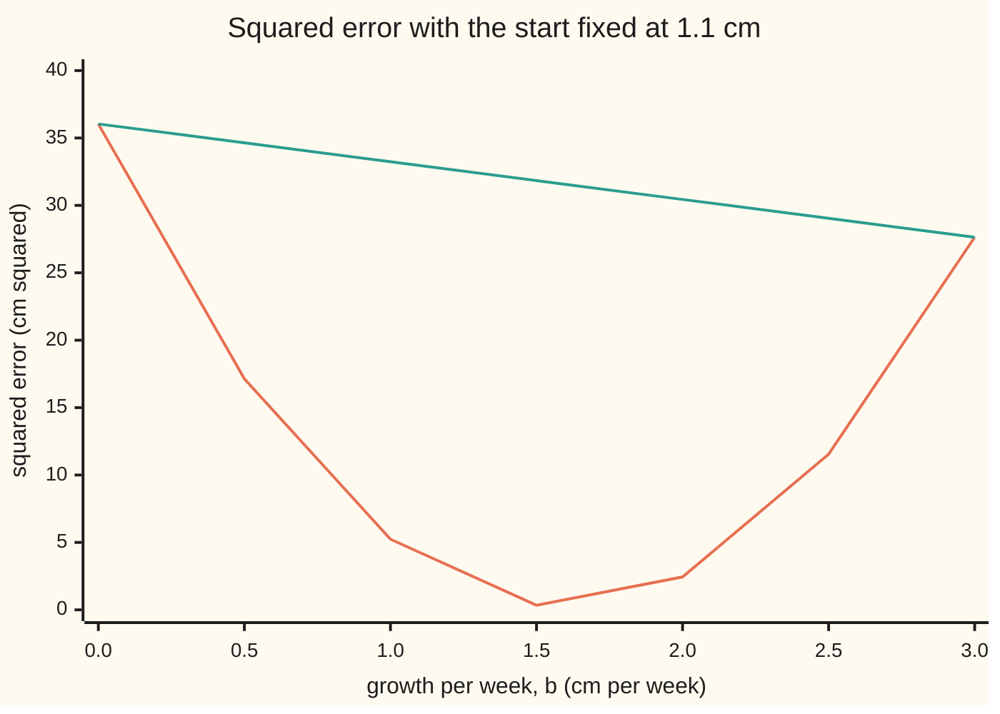

# Convex functions: bowls, chords above the graph, and why a local minimum is the global one

[Syllabus](../../../SYLLABUS.md) → [Calculus and analysis](../README.md) → [Several Variables](../README.md#s07) → Convex functions

---

## General Overview

A seedling on a windowsill is measured weekly. At weeks 0, 1, 2 and 3 it stands 1 cm, 3 cm, 4 cm and 6 cm tall. A straight line predicts growth: height = a + b × week, with a the starting height in cm and b the growth in cm per week.

No line hits all four points. Square each miss and add: that total is the **squared error**. The best line minimises it: a = 1.1 cm, b = 1.6 cm per week, squared error 0.2 cm^2.

Could a far-off pair do as well? Could a computer walking downhill stop in a lesser dip? No and no: over all pairs (a, b), squared error is a bowl with one bottom. A bowl-shaped function is **convex**.

**A function is convex when every chord between two points of its graph lies on or above the graph; then any dip is the deepest one.**

**What kind of fact this is:** a definition; three theorems ride with it (the Hessian test, local minimum is global, Jensen's inequality), proved on this card in Why it works.

### The picture: one slice through the bowl, and a chord



The curved line is the squared error as b runs from 0 to 3, a held at 1.1 cm; the straight line is the chord joining its ends, never below it.

---

## The formula

Notation first, in words. A point is a pair, $p = (a, b)$. Mixing two points with weight t takes t of one and 1 − t of the other: the half-and-half mix of (0, 2) and (2, 1) is (1, 1.5). As t runs from 0 to 1 the mix slides from q to p.

$$f\big(tp+(1-t)q\big)\le tf(p)+(1-t)f(q),\quad 0\le t\le 1$$

**Read it aloud:** the function at a mix is at most the mix of its values: graph under chord. **Strictly convex**: strictly under, for p ≠ q and t strictly between 0 and 1.

The seedling's squared error, the sigma sign adding over the measurements:

$$S(a,b)=\sum_{i=1}^{n}\big(y_i-a-bx_i\big)^2$$

**Read it aloud:** each measured height minus the line's prediction, squared, then added.

The test uses the Hessian H, the table of second partial derivatives ([Hessian](05-hessian-and-second-order-approximation.md)). Its quadratic form $v^{\top} H v$, read "v transposed H v", is f's second derivative along direction v.

$$v^{\top}Hv\ge 0\quad\text{for every } v \text{, at every point}$$

**Read it aloud:** in every direction, everywhere, the graph never curves downward.

Jensen's inequality stretches the chord to k points:

$$f\Big(\sum_{i=1}^{k}\theta_ip_i\Big)\le\sum_{i=1}^{k}\theta_if(p_i),\qquad \theta_i\ge 0,\ \sum_{i=1}^{k}\theta_i=1$$

**Read it aloud:** the function at a weighted average of points is at most the weighted average of its values.

| Symbol | Plain meaning | In our example | Push it up and the answer… |
| --- | --- | --- | --- |
| $S$ | squared error, cm^2 | 0.200 at the best line | a worse fit |
| $a$, $b$ | start (cm), growth (cm per week) | 1.1 and 1.6 at the bottom | S climbs away from there |
| $x_i$, $y_i$, $n$ | week, height of measurement i; count | 0 to 3; 1, 3, 4, 6 cm; 4 | larger n, steeper bowl |
| $f$ | any function under test | S, or the wavy w in What breaks | — |
| $p$, $q$, $t$ | two points, mixing weight | (0, 2), (2, 1), t = ½ | t near 1 sits near p |
| $H$ | Hessian: second partial derivatives | `[[8, 12], [12, 28]]` everywhere | steeper walls |
| $v$ | a direction, a pair of numbers | (2, −1) | — |
| $\theta_i$, $k$, $p_i$ | Jensen's weights (theta), count, points | 0.5, 0.3, 0.2; 3 points | average moves toward that point |

### When it holds

A definition; the theorems need:

- **A domain holding every segment.** The (a, b) plane does; two separate intervals do not.
- **Two derivatives for the Hessian test.** The absolute value has a corner at 0: convex, no Hessian there.
- **The test everywhere.** One point is not enough: What breaks, row 1.
- **Strictness for one answer.** Otherwise a flat floor: row 2. Strictness allows at most one bottom; e^x, strictly convex, has none.

---

## Why it works

### Step 0: a bowl is decided one straight line at a time

Convexity only compares points on a segment, and along a line the height is a function of one variable. If every such slice is a one-variable bowl, the function is convex.

### Step 1: nonnegative second derivative puts the chord above

[Second derivatives](../02-Derivatives/08-higher-derivatives-and-concavity.md) called this shape *concave up*. Subtract the chord from the graph: the gap is 0 at both ends, and its slope never decreases, since its second derivative is the graph's. A slope that never decreases cannot climb then fall, so the gap stays at or below 0.

### Step 2: the Hessian gives every slice's second derivative

Along the line from p in direction v the height is g(t) = f(p + t v). By [Chain rule in several variables](04-multivariable-chain-rule-and-jacobians.md), its second derivative is $v^{\top} H v$ at the point reached, nonnegative by the test; Step 1 finishes.

For the seedling, H has entries 2n = 8, twice the week sum = 12, twice the squared-week sum = 28, everywhere. Direction v = (c, d) scores 8c^2 + 24cd + 28d^2, which is

$$v^{\top}Hv=2\sum_{i=1}^{n}\big(c+dx_i\big)^2,$$

a sum of squares, 0 only if c + d x_i = 0 for every measurement: c = d = 0 unless all weeks are equal. So S is strictly convex. The eigenvalues (stretch factors) multiply to the determinant, 8 × 28 − 12^2 = 80, and add to the trace, 36; both positive, so both eigenvalues are: 33.62 and 2.38.

<details>
<summary>Detailed proof: second derivative at least 0 puts the graph under every chord</summary>

Let f'' ≥ 0 on an interval holding q < p, and L the chord through (q, f(q)) and (p, f(p)). Put g = f − L: g(q) = g(p) = 0 and g'' ≥ 0, so g' never decreases. If g(c) > 0 for some c between, the mean value theorem gives u in (q, c) with g'(u) = g(c)/(c − q) > 0 and s in (c, p) with g'(s) = −g(c)/(p − c) < 0: g' fell, a contradiction. So f ≤ L. In several variables each slice g(t) = f(p + t v) has g''(t) = v^T H(p + t v) v.

</details>

### Step 3: a local minimum is the global minimum

A **local minimum** has nothing lower close by. Suppose p is one and a far point q is lower. With t close to 1 the mix sits just beside p, where the chord, t f(p) + (1 − t) f(q), is below f(p), and the graph is under the chord. Points beside p are lower: a contradiction.

Under strict convexity two lowest points are impossible: their midpoint would sit strictly under the chord joining them. So least squares has one answer, and the check's downhill walk reaches (1.1, 1.6) from (10, −10) and (−10, 10) alike.

### Step 4: Jensen, one point at a time

Two points is the definition. Three points are a two-point mix of the first and the average of the other two. Apply the definition twice; induction reaches any k. Under strict convexity, equality needs every point with positive weight to be the same point.

<details>
<summary>Detailed proof: Jensen for k points</summary>

For k = 1 both sides are f(p_1). Assume k − 1 points work. If θ_k = 1 both sides are f(p_k). Otherwise let s = 1 − θ_k and m = Σ_{i<k} (θ_i / s) p_i. Then Σ θ_i p_i = s m + θ_k p_k, so f(Σ θ_i p_i) ≤ s f(m) + θ_k f(p_k) ≤ Σ_{i<k} θ_i f(p_i) + θ_k f(p_k): the definition, then the claim for k − 1.

</details>

For S, with constant Hessian, the Jensen gap is exactly half the weighted average of $v^{\top} H v$ over the steps from the average point to each point. Two points at weight ½ give the chord gap: steps ±d/2 from the midpoint, d = p − q, so the gap is $d^{\top} H d / 8$. Random averages are [Jensen's inequality](../../09-Probability%20and%20statistics/02-Random%20Variables/06-jensens-inequality.md).

---

## Worked numbers, by hand

| Step | Arithmetic | Value |
| --- | --- | --- |
| sums | weeks, squared weeks, heights, week × height | 6, 14, 14, 29 |
| growth b | (4 × 29 − 6 × 14) ÷ (4 × 14 − 6^2) = 32 ÷ 20 | **1.6 cm per week** |
| start a | (14 − 1.6 × 6) ÷ 4 | **1.1 cm** |
| misses | 1 − 1.1, 3 − 2.7, 4 − 4.3, 6 − 5.9 | −0.1, 0.3, −0.3, 0.1 |
| squared error | 0.01 + 0.09 + 0.09 + 0.01 | **0.2 cm^2** |
| chord | S(0, 2) = 2, S(2, 1) = 2; midpoint S(1, 1.5) | 0.5, under 2 |
| gap two ways | 2 − 0.5; (8 × 4 − 24 × 2 + 28) ÷ 8 | **1.5** |
| Jensen | weights 0.5, 0.3, 0.2 on (0, 2), (2, 1), (3, 0): S = 2, 2, 14 | average 4.4 |
| Jensen's left side | S at the average point (1.2, 1.3) | 1.14, gap 3.26 |

Rows two and three solve the normal equations of [Extrema in several variables](06-multivariable-extrema.md); convexity makes that flat point the answer.

### What breaks if you drop a piece

| Mistake | Comes out at | What went wrong |
| --- | --- | --- |
| Not convex: w(x) = x^4 − 4x^2 + x | downhill from 2 stops at x = 1.3470, w = −2.6186; the bottom is x = −1.4730, w = −5.4442 | w''(0) = −8.00: a hump between dips |
| Not strict: all four measurements in week 2 | S(3.5, 0) = S(1.5, 1) = 13.00, determinant 0 | start and slope cannot be told apart |
| Jensen read backwards | S at the average, 1.14, against the average of S, 4.40 | the average point is the lower side |

---

## Code, from first principles, and it actually runs

Two roads to the best line, sharing no arithmetic: the normal equations, and a downhill walk from two far starts with slopes from central differences (height a small step ahead minus a small step behind, over twice the step). The walk's error closes to within 0.001 by 100 steps. The Hessian and both gaps are computed two ways each.

### Python

```python
# Convex functions -- the check behind the card.  Nothing imported.  A seedling measured at
# weeks 0-3; fit height = a + b*week.  The squared error S(a, b) is convex: two roads, one fit.
X, Y = [0, 1, 2, 3], [1, 3, 4, 6]

def S(a, b, xs=X):                                   # squared error of the line a + b*x
    return sum((y - a - b * x) ** 2 for x, y in zip(xs, Y))

def descend(f, p, rate, steps, h=1e-4):              # gradient descent, slopes by central differences
    p = list(p)
    for _ in range(steps):
        g = [(f(*[p[j] + h * (i == j) for j in range(len(p))]) -
              f(*[p[j] - h * (i == j) for j in range(len(p))])) / (2 * h) for i in range(len(p))]
        p = [pj - rate * gj for pj, gj in zip(p, g)]
    return p

n, sx, sy = len(X), sum(X), sum(Y)
sxx, sxy = sum(x * x for x in X), sum(x * y for x, y in zip(X, Y))
b = (n * sxy - sx * sy) / (n * sxx - sx * sx)        # road 1: the normal equations, solved
a = (sy - b * sx) / n
H = [[2 * n, 2 * sx], [2 * sx, 2 * sxx]]             # Hessian of S, from its formula
e = 0.01                                             # Hessian again, by second differences
Hd = [[(S(a + e, b) - 2 * S(a, b) + S(a - e, b)) / e ** 2,
       (S(a + e, b + e) - S(a + e, b - e) - S(a - e, b + e) + S(a - e, b - e)) / (4 * e * e)],
      [0, (S(a, b + e) - 2 * S(a, b) + S(a, b - e)) / e ** 2]]
Hd[1][0] = Hd[0][1]
det, tr = H[0][0] * H[1][1] - H[0][1] ** 2, H[0][0] + H[1][1]
lam = [(tr + (tr * tr - 4 * det) ** 0.5) / 2, (tr - (tr * tr - 4 * det) ** 0.5) / 2]
quad = lambda d: sum(d[i] * H[i][j] * d[j] for i in range(2) for j in range(2))   # d'Hd
ends = [descend(S, s, 0.05, 400) for s in ((10, -10), (-10, 10))]
errs = [max(abs(u - v) for u, v in zip(descend(S, (10, -10), 0.05, k), (a, b))) for k in (25, 50, 100, 200)]
bs = [0.5 * k for k in range(7)]
P, W = [(0, 2), (2, 1), (3, 0)], [0.5, 0.3, 0.2]     # Jensen: three fits, three weights
m = [sum(w * p[i] for w, p in zip(W, P)) for i in range(2)]
jgap = sum(w * S(*p) for w, p in zip(W, P)) - S(*m)
jgap2 = sum(w * quad([p[0] - m[0], p[1] - m[1]]) / 2 for w, p in zip(W, P))
cgap, cgap2 = (S(0, 2) + S(2, 1)) / 2 - S(1, 1.5), quad([2, -1]) / 8
wf = lambda x: x ** 4 - 4 * x * x + x                # a wavy error curve: not convex
wl, wr = descend(wf, (-2,), 0.01, 2000)[0], descend(wf, (2,), 0.01, 2000)[0]
X2 = [2, 2, 2, 2]                                    # all four measurements in week 2
det2 = (2 * 4) * (2 * sum(x * x for x in X2)) - (2 * sum(X2)) ** 2
print(f"weeks {X}, heights {Y} cm")
print(f"sums: x {sx}, x^2 {sxx}, y {sy}, xy {sxy}; residuals " + ", ".join(f"{y - a - b * x:.1f}" for x, y in zip(X, Y)))
print(f"road 1, normal equations: a = {a:.3f} cm, b = {b:.3f} cm/week, S = {S(a, b):.3f}")
for s, p in zip(("(10, -10)", "(-10, 10)"), ends):
    print(f"road 2, descent from {s}: a = {p[0]:.6f}, b = {p[1]:.6f}")
print("descent error after 25, 50, 100, 200 steps: " + ", ".join(f"{x:.1e}" for x in errs))
print(f"Hessian by formula: {H}; by second differences: [[{Hd[0][0]:.4f}, {Hd[0][1]:.4f}], [{Hd[1][0]:.4f}, {Hd[1][1]:.4f}]]")
print(f"determinant {det}, trace {tr}, stretch factors {lam[0]:.2f} and {lam[1]:.2f}")
print("chart b: " + ", ".join(f"{x:.1f}" for x in bs))
print("chart S(1.1, b): " + ", ".join(f"{S(1.1, x):.2f}" for x in bs))
print("chart chord: " + ", ".join(f"{S(1.1, 0) + (S(1.1, 3) - S(1.1, 0)) * x / 3:.2f}" for x in bs))
print(f"chord: S(0, 2) = {S(0, 2):.2f}, S(2, 1) = {S(2, 1):.2f}, S(1, 1.5) = {S(1, 1.5):.2f}; gap {cgap:.2f}, by d'Hd/8 {cgap2:.2f}")
print(f"Jensen: S at (0, 2), (2, 1), (3, 0): " + ", ".join(f"{S(*p):.2f}" for p in P) + f"; mix ({m[0]:.2f}, {m[1]:.2f}), S at mix {S(*m):.2f}, mix of S {S(*m) + jgap:.2f}; gap {jgap:.2f}, by Hessian {jgap2:.2f}")
print(f"mistake 1, wavy curve: w''(0) = {(wf(e) - 2 * wf(0) + wf(-e)) / e ** 2:.2f}; descent from 2 stops at x = {wr:.4f}, w = {wf(wr):.4f}; from -2 at x = {wl:.4f}, w = {wf(wl):.4f}")
print(f"mistake 2, all weeks 2: determinant {det2}; S(3.5, 0) = {S(3.5, 0, X2):.2f}, S(1.5, 1) = {S(1.5, 1, X2):.2f}")
assert all(abs(p[0] - a) < 1e-6 and abs(p[1] - b) < 1e-6 for p in ends)          # two roads, one fit
assert all(abs(Hd[i][j] - H[i][j]) < 1e-6 for i in range(2) for j in range(2))   # Hessian two ways
assert abs(jgap - jgap2) < 1e-9 and abs(cgap - cgap2) < 1e-9 and jgap > 0        # Jensen gap two ways
assert wf(wl) < wf(wr) - 1 and abs(S(3.5, 0, X2) - S(1.5, 1, X2)) < 1e-12        # what breaks
print("ALL CHECKS PASS")
```

**Ran 2026-09-27 on macOS, Python 3.14.6, standard library only. All checks passed. Output, pasted from the run:**

```
weeks [0, 1, 2, 3], heights [1, 3, 4, 6] cm
sums: x 6, x^2 14, y 14, xy 29; residuals -0.1, 0.3, -0.3, 0.1
road 1, normal equations: a = 1.100 cm, b = 1.600 cm/week, S = 0.200
road 2, descent from (10, -10): a = 1.100000, b = 1.600000
road 2, descent from (-10, 10): a = 1.100000, b = 1.600000
descent error after 25, 50, 100, 200 steps: 5.0e-01, 2.1e-02, 3.7e-05, 1.2e-10
Hessian by formula: [[8, 12], [12, 28]]; by second differences: [[8.0000, 12.0000], [12.0000, 28.0000]]
determinant 80, trace 36, stretch factors 33.62 and 2.38
chart b: 0.0, 0.5, 1.0, 1.5, 2.0, 2.5, 3.0
chart S(1.1, b): 36.04, 17.14, 5.24, 0.34, 2.44, 11.54, 27.64
chart chord: 36.04, 34.64, 33.24, 31.84, 30.44, 29.04, 27.64
chord: S(0, 2) = 2.00, S(2, 1) = 2.00, S(1, 1.5) = 0.50; gap 1.50, by d'Hd/8 1.50
Jensen: S at (0, 2), (2, 1), (3, 0): 2.00, 2.00, 14.00; mix (1.20, 1.30), S at mix 1.14, mix of S 4.40; gap 3.26, by Hessian 3.26
mistake 1, wavy curve: w''(0) = -8.00; descent from 2 stops at x = 1.3470, w = -2.6186; from -2 at x = -1.4730, w = -5.4442
mistake 2, all weeks 2: determinant 0; S(3.5, 0) = 13.00, S(1.5, 1) = 13.00
ALL CHECKS PASS
```

### Rust

Same numbers, same labels, built with `rustc --edition 2021 -O`.

```rust
// Convex functions -- the same check as the Python, in Rust.  No crates.  One
// seedling measured at weeks 0-3; fit height = a + b*week by least squares.
// S(a, b), the squared error, is convex: two roads reach one fit.
const X: [f64; 4] = [0.0, 1.0, 2.0, 3.0]; const Y: [f64; 4] = [1.0, 3.0, 4.0, 6.0];

fn s_err(a: f64, b: f64, xs: &[f64; 4]) -> f64 {        // squared error of the line a + b*x
    xs.iter().zip(Y.iter()).map(|(x, y)| (y - a - b * x).powi(2)).sum()
}
fn s(p: &[f64]) -> f64 { s_err(p[0], p[1], &X) }
fn wf(p: &[f64]) -> f64 { let x = p[0]; x.powi(4) - 4.0 * x * x + x }   // a wavy error curve

fn descend(f: fn(&[f64]) -> f64, start: &[f64], rate: f64, steps: usize) -> Vec<f64> {
    let (mut p, h) = (start.to_vec(), 1e-4);            // gradient descent, central differences
    for _ in 0..steps {
        let g: Vec<f64> = (0..p.len()).map(|i| {
            let (mut up, mut dn) = (p.clone(), p.clone()); up[i] += h; dn[i] -= h;
            (f(&up) - f(&dn)) / (2.0 * h)
        }).collect();
        for i in 0..p.len() { p[i] -= rate * g[i] }
    }
    p
}
fn sci(x: f64) -> String {                              // 5.0e-01, as Python writes it
    let t = format!("{:.1e}", x); let (m, e) = t.split_once('e').unwrap(); let k: i32 = e.parse().unwrap();
    format!("{}e{}{:02}", m, if k < 0 { '-' } else { '+' }, k.abs())
}
fn list(v: &[f64], d: usize) -> String { v.iter().map(|x| format!("{:.*}", d, x)).collect::<Vec<_>>().join(", ") }

fn main() {
    let n = 4.0;
    let (sx, sy, sxx): (f64, f64, f64) = (X.iter().sum(), Y.iter().sum(), X.iter().map(|x| x * x).sum());
    let sxy: f64 = X.iter().zip(Y.iter()).map(|(x, y)| x * y).sum();
    let b = (n * sxy - sx * sy) / (n * sxx - sx * sx);  // road 1: the normal equations, solved
    let a = (sy - b * sx) / n;
    let h = [[2.0 * n, 2.0 * sx], [2.0 * sx, 2.0 * sxx]];   // Hessian of S, from its formula
    let e = 0.01;                                       // Hessian again, by second differences
    let sa = |da: f64, db: f64| s(&[a + da, b + db]);
    let h01 = (sa(e, e) - sa(e, -e) - sa(-e, e) + sa(-e, -e)) / (4.0 * e * e);
    let hd = [[(sa(e, 0.0) - 2.0 * sa(0.0, 0.0) + sa(-e, 0.0)) / (e * e), h01],
              [h01, (sa(0.0, e) - 2.0 * sa(0.0, 0.0) + sa(0.0, -e)) / (e * e)]];
    let (det, tr) = (h[0][0] * h[1][1] - h[0][1] * h[0][1], h[0][0] + h[1][1]);
    let root = (tr * tr - 4.0 * det).sqrt();
    let quad = |d: [f64; 2]| (0..2).map(|i| (0..2).map(|j| d[i] * h[i][j] * d[j]).sum::<f64>()).sum::<f64>();
    let ends: Vec<Vec<f64>> = [[10.0, -10.0], [-10.0, 10.0]].iter().map(|st| descend(s, st, 0.05, 400)).collect();
    let errs: Vec<String> = [25, 50, 100, 200].iter().map(|&k| descend(s, &[10.0, -10.0], 0.05, k))
        .map(|p| sci((p[0] - a).abs().max((p[1] - b).abs()))).collect();
    let bs: Vec<f64> = (0..7).map(|k| 0.5 * k as f64).collect();
    let (pts, wts) = ([[0.0, 2.0], [2.0, 1.0], [3.0, 0.0]], [0.5, 0.3, 0.2]);   // Jensen: three fits
    let m: Vec<f64> = (0..2).map(|i| (0..3).map(|k| wts[k] * pts[k][i]).sum()).collect();
    let jgap = (0..3).map(|k| wts[k] * s(&pts[k])).sum::<f64>() - s(&m);
    let jgap2: f64 = (0..3).map(|k| wts[k] * quad([pts[k][0] - m[0], pts[k][1] - m[1]]) / 2.0).sum();
    let (cgap, cgap2) = ((s(&[0.0, 2.0]) + s(&[2.0, 1.0])) / 2.0 - s(&[1.0, 1.5]), quad([2.0, -1.0]) / 8.0);
    let (wl, wr) = (descend(wf, &[-2.0], 0.01, 2000)[0], descend(wf, &[2.0], 0.01, 2000)[0]);
    let x2 = [2.0; 4];                                  // all four measurements in week 2
    let det2 = (2.0 * 4.0) * (2.0 * x2.iter().map(|x| x * x).sum::<f64>()) - (2.0 * x2.iter().sum::<f64>()).powi(2);
    println!("weeks [0, 1, 2, 3], heights [1, 3, 4, 6] cm");
    println!("sums: x {}, x^2 {}, y {}, xy {}; residuals {}", sx, sxx, sy, sxy, list(&X.iter().zip(Y.iter()).map(|(x, y)| y - a - b * x).collect::<Vec<_>>(), 1));
    println!("road 1, normal equations: a = {:.3} cm, b = {:.3} cm/week, S = {:.3}", a, b, s(&[a, b]));
    for (st, p) in ["(10, -10)", "(-10, 10)"].iter().zip(ends.iter()) { println!("road 2, descent from {}: a = {:.6}, b = {:.6}", st, p[0], p[1]) }
    println!("descent error after 25, 50, 100, 200 steps: {}", errs.join(", "));
    println!("Hessian by formula: [[{}, {}], [{}, {}]]; by second differences: [[{:.4}, {:.4}], [{:.4}, {:.4}]]",
             h[0][0], h[0][1], h[1][0], h[1][1], hd[0][0], hd[0][1], hd[1][0], hd[1][1]);
    println!("determinant {}, trace {}, stretch factors {:.2} and {:.2}", det, tr, (tr + root) / 2.0, (tr - root) / 2.0);
    println!("chart b: {}", list(&bs, 1));
    println!("chart S(1.1, b): {}", list(&bs.iter().map(|&x| s(&[1.1, x])).collect::<Vec<_>>(), 2));
    let (c0, c3) = (s(&[1.1, 0.0]), s(&[1.1, 3.0]));
    println!("chart chord: {}", list(&bs.iter().map(|&x| c0 + (c3 - c0) * x / 3.0).collect::<Vec<_>>(), 2));
    println!("chord: S(0, 2) = {:.2}, S(2, 1) = {:.2}, S(1, 1.5) = {:.2}; gap {:.2}, by d'Hd/8 {:.2}",
             s(&[0.0, 2.0]), s(&[2.0, 1.0]), s(&[1.0, 1.5]), cgap, cgap2);
    println!("Jensen: S at (0, 2), (2, 1), (3, 0): {}; mix ({:.2}, {:.2}), S at mix {:.2}, mix of S {:.2}; gap {:.2}, by Hessian {:.2}",
             list(&pts.iter().map(|p| s(p)).collect::<Vec<_>>(), 2), m[0], m[1], s(&m), s(&m) + jgap, jgap, jgap2);
    println!("mistake 1, wavy curve: w''(0) = {:.2}; descent from 2 stops at x = {:.4}, w = {:.4}; from -2 at x = {:.4}, w = {:.4}",
             (wf(&[e]) - 2.0 * wf(&[0.0]) + wf(&[-e])) / (e * e), wr, wf(&[wr]), wl, wf(&[wl]));
    println!("mistake 2, all weeks 2: determinant {}; S(3.5, 0) = {:.2}, S(1.5, 1) = {:.2}", det2, s_err(3.5, 0.0, &x2), s_err(1.5, 1.0, &x2));
    assert!(ends.iter().all(|p| (p[0] - a).abs() < 1e-6 && (p[1] - b).abs() < 1e-6));    // two roads, one fit
    assert!((0..2).all(|i| (0..2).all(|j| (hd[i][j] - h[i][j]).abs() < 1e-6)));          // Hessian two ways
    assert!((jgap - jgap2).abs() < 1e-9 && (cgap - cgap2).abs() < 1e-9 && jgap > 0.0);  // Jensen gap two ways
    assert!(wf(&[wl]) < wf(&[wr]) - 1.0 && (s_err(3.5, 0.0, &x2) - s_err(1.5, 1.0, &x2)).abs() < 1e-12);
    println!("ALL CHECKS PASS");
}
```

**Ran 2026-09-27 on macOS, rustc 1.98.1, no crates. All checks passed. Output, pasted from the run:**

```
weeks [0, 1, 2, 3], heights [1, 3, 4, 6] cm
sums: x 6, x^2 14, y 14, xy 29; residuals -0.1, 0.3, -0.3, 0.1
road 1, normal equations: a = 1.100 cm, b = 1.600 cm/week, S = 0.200
road 2, descent from (10, -10): a = 1.100000, b = 1.600000
road 2, descent from (-10, 10): a = 1.100000, b = 1.600000
descent error after 25, 50, 100, 200 steps: 5.0e-01, 2.1e-02, 3.7e-05, 1.2e-10
Hessian by formula: [[8, 12], [12, 28]]; by second differences: [[8.0000, 12.0000], [12.0000, 28.0000]]
determinant 80, trace 36, stretch factors 33.62 and 2.38
chart b: 0.0, 0.5, 1.0, 1.5, 2.0, 2.5, 3.0
chart S(1.1, b): 36.04, 17.14, 5.24, 0.34, 2.44, 11.54, 27.64
chart chord: 36.04, 34.64, 33.24, 31.84, 30.44, 29.04, 27.64
chord: S(0, 2) = 2.00, S(2, 1) = 2.00, S(1, 1.5) = 0.50; gap 1.50, by d'Hd/8 1.50
Jensen: S at (0, 2), (2, 1), (3, 0): 2.00, 2.00, 14.00; mix (1.20, 1.30), S at mix 1.14, mix of S 4.40; gap 3.26, by Hessian 3.26
mistake 1, wavy curve: w''(0) = -8.00; descent from 2 stops at x = 1.3470, w = -2.6186; from -2 at x = -1.4730, w = -5.4442
mistake 2, all weeks 2: determinant 0; S(3.5, 0) = 13.00, S(1.5, 1) = 13.00
ALL CHECKS PASS
```

The two outputs match line for line.

> [!TIP]
> **Try changing**
> Guess first, then run.
> - **A different last height.** Set the week-3 height in `Y` to 9. The fit moves to a = 0.500, b = 2.500, S = 3.500; the Hessian, built from weeks only, stays `[[8, 12], [12, 28]]`.
> - **Too big a step.** In `ends`, raise the rate from 0.05 to 0.07. Past 2 ÷ 33.62, about 0.059, steps overshoot: the first assert fails.
> - **A different start on the wavy curve.** Start the second walk on w at 0.1, not 2. It rolls left to −1.4730; both walks agree and the fourth assert fails.

---

## The usual mistake

> [!warning]
> **Taking a flat spot as the answer without convexity.** Slopes of 0 find dips, humps and saddles alike; only convexity makes a dip the lowest. The wavy w has a dip at x = 1.3470, w = −2.6186; its bottom is −5.4442.
>
> - **Testing the Hessian at one point.** w''(x) = 12x^2 − 8 passes at both dips and fails at 0: w''(0) = −8.00.
> - **Reading convex as one answer.** With all four measurements in week 2, (3.5, 0) and (1.5, 1) both give 13.00.
> - **Flipping Jensen.** Convex: the average point is lower, 1.14 against 4.40. Concave (the negative of convex) flips it.

---

## Where you meet it in real life

- **Machine learning.** Downhill walks are safe on convex error measures and can be trapped on others, like w: Gradient descent.
- **Option prices.** A call is convex in its strike, so a butterfly (one call at each outer strike, minus two at the middle) never costs below zero: [Shape across strikes and expiries](../../12-Financial%20mathematics/08-The%20Black-Scholes%20call%20and%20put/05-strike-and-calendar-shape.md).
- **Planning.** A linear program's cost and allowed region are convex, so a local best plan is best: Linear programs.

> **Say it back**
> A convex function has every chord on or above its graph. A Hessian test in every direction, everywhere, proves it. Any dip is then the lowest point; strict convexity makes it unique. Squared error's Hessian is twice a sum of squares, so least squares has one answer: 1.1 cm and 1.6 cm per week. Jensen extends the chord to weighted averages.

---

## What this builds on

- [Hessian](05-hessian-and-second-order-approximation.md): the Hessian and its quadratic form.
- [Extrema in several variables](06-multivariable-extrema.md): flat points as candidates, which convexity makes the answer.

## Where this goes next

- [Jensen's inequality](../../09-Probability%20and%20statistics/02-Random%20Variables/06-jensens-inequality.md): Jensen for expectations.
- [Holder's inequality](../../10-Measure%20and%20integration/07-Sizes%20of%20Functions/02-holders-inequality.md): sizes of functions, bounded by convexity.
- [Jensen's inequality](../../10-Measure%20and%20integration/07-Sizes%20of%20Functions/04-jensens-inequality.md): Jensen for integrals.
- [Shape across strikes and expiries](../../12-Financial%20mathematics/08-The%20Black-Scholes%20call%20and%20put/05-strike-and-calendar-shape.md): option prices convex in strike.
- KL divergence: Jensen makes it never negative.
- Linear programs: linear cost, convex region.
- Gradient descent: how fast the downhill walk closes.
- Support vector machines: a classifier from a convex problem.
- Convex functions: more tests, and operations that keep convexity.
- Hahn-Banach: a linear rule kept under a convex bound.
- Separation: flat walls touching convex sets.
- Lax-Milgram: one answer in infinitely many variables.
- Krein-Milman: convex sets rebuilt from corners.
- The slope transform: slopes at corners.
- Riemannian Hessian: the Hessian test on curved spaces.
- Relaxation and rounding: a convex stand-in, then rounding back.

One answer exists and downhill finds it; testing convexity when the Hessian varies from point to point is Convex functions.

---

## Sources

Verified 27 Sep 2026: every link below resolves to the publisher's page.

- Boyd, Stephen, and Lieven Vandenberghe. *Convex Optimization*. Cambridge University Press, 2004. [Authors' page with the full text](https://web.stanford.edu/~boyd/cvxbook/); [publisher page](https://doi.org/10.1017/CBO9780511804441). Chapter 3: the chord definition, the second-order test, Jensen.
- Rockafellar, R. Tyrrell. *Convex Analysis*. Princeton University Press, 1970. [Publisher page](https://press.princeton.edu/books/paperback/9780691015866/convex-analysis). The rigorous standard.
- Jensen, J. L. W. V. "Sur les fonctions convexes et les inégalités entre les valeurs moyennes." *Acta Mathematica* 30 (1906), 175–193. [DOI](https://doi.org/10.1007/BF02418571). The inequality's origin.
