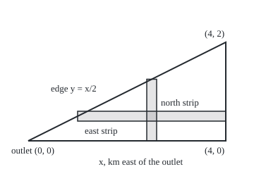

# Double integrals: volume under a surface by slicing twice

[Syllabus](../../../SYLLABUS.md) → [Calculus and analysis](../../../SYLLABUS.md#w06) → [Multiple Integrals](../../../SYLLABUS.md#w06-s08) → Double integrals

---

## General Overview

A storm crosses a triangular catchment: the land whose rain drains to one river gauge. Measured in km from the outlet, its corners are (0, 0), (4, 0) and (4, 2), so its area is 4 km^2. Rain gauges read 6 mm at the outlet, 6 mm at the south-east corner and 20 mm at the north-east corner, under the hills.

How much water fell? At one depth everywhere it would be depth times area, and 1 mm over 1 km^2 is 1,000 m^3. Here the depth varies. So cut the land into small patches, take depth times area on each, and add. Finer patches close in on 40,000 m^3, or 40 million litres.

Picture the rain as a sheet of water, thick under the hills: its volume is the volume under a surface whose height is the depth. From here on the patch-and-add total is the **double integral** of the depth. The working trick is to slice twice: add the rain along strips running north, then add the strips. Strips running east give the same total.

**A double integral adds depth times area over a region; for a continuous depth it can be computed as strips of strips, in either order, as long as each order's limits describe the same region.**

**What kind of fact this is:** the double integral is a definition; that either slicing order gives it is a theorem (Fubini's), proved on this card in Why it works.

### The picture: the catchment and two ways to slice it

<p align="center"></p>

To scale: 70 px per km both ways. Each strip is 0.2 km across and ends at the edge y = x/2.

---

## The formula

Notation first, in words. A doubled integral sign with a region under it, then $dA$, means "add over every small patch of area in that region". Two single integral signs in a row mean "do the inner one first, holding the outer variable fixed".

Write $x$ for km east of the outlet, $y$ for km north, and $f(x, y) = 6 + 3y + xy$ for the rain depth there in mm; it matches all three gauges. The catchment is the region $D$. Patch number k has area $\Delta A_k$ and a sample point $(x_k, y_k)$ inside it.

$$\iint_D f\,dA = \lim_{\text{patches}\to 0}\ \sum_k f(x_k, y_k)\,\Delta A_k$$

**Read it aloud:** the double integral of f over D is what depth-times-area sums settle on as every patch shrinks.

Fubini's theorem turns that into two ordinary integrals. Describe $D$ by north strips: $x$ from $a$ to $b$, each strip from $y = g_1(x)$ to $y = g_2(x)$. Or by east strips: $y$ from $c$ to $d$, each strip from $x = h_1(y)$ to $x = h_2(y)$. Then

$$\iint_D f\,dA = \int_a^b\!\left[\int_{g_1(x)}^{g_2(x)} f(x,y)\,dy\right]dx = \int_c^d\!\left[\int_{h_1(y)}^{h_2(y)} f(x,y)\,dx\right]dy$$

**Read it aloud:** add along each north strip, then add the strips west to east; or add along each east strip, then add them south to north.

| Symbol | Plain meaning | In our example | Push it up and the answer… |
| --- | --- | --- | --- |
| $f$ | rain depth at a point, mm | 6 + 3y + xy | more water |
| $x$, $y$ | km east and km north of the outlet | the triangle 0 ≤ y ≤ x/2, 0 ≤ x ≤ 4 | — |
| $D$ | the region added over | the catchment, 4 km^2 | a bigger region collects more |
| $\Delta A_k$, $dA$ | a patch's area, and the patch in the limit | cells 4/n km by 2/n km | — |
| $n$ | pieces per side of the grid or strip | 4, 16, 64 | the sums close in on 40 |
| $a$, $b$, $g_1$, $g_2$ | outer range of x; bottom and top of a north strip | 0, 4; y = 0 and y = x/2 | a higher top edge takes in more land |
| $c$, $d$, $h_1$, $h_2$ | outer range of y; west and east ends of an east strip | 0, 2; x = 2y and x = 4 | — |
| $\iint_D f\,dA$ | the total, in mm·km^2 | 40 mm·km^2 = 40,000 m^3 | — |

### When it holds

- **Bounded depth.** A depth that runs off to infinity can make the orders disagree: the spike in What breaks gives +0.785398 one way, −0.785398 the other.
- **Continuous depth, or jumps only along curves.** A curve has no area, so jumps along finitely many curves do no harm.
- **A region described by strips.** Each strip is one piece whose ends move continuously with the outer variable; an L-shaped region is cut into such pieces first.
- **The same region both ways.** Keeping the old limits after a swap counts different land.

---

## Why it works

### Step 0: a thin strip is a one-variable problem

Fix $x$ and walk north. Along that line the depth depends on $y$ alone, so the rain on a thin strip is an ordinary integral times the strip's width, which [The integral](../04-Integrals/01-riemann-integral.md) handles. What needs proof is that strips-then-add equals patch-and-add.

### Step 1: patch sums settle, with actual numbers

Grid the rectangle from (0, 0) to (4, 2) into n by n cells, depth 0 outside the triangle. Each cell's lowest depth times its area, added, is the **lower sum**; highest depths give the **upper sum**. The total sits between.

Depth climbs at most 2 mm per km eastward (y ≤ 2) and 7 northward (3 + x, x ≤ 4). So a cell 4/n by 2/n km spans at most 2 × 4/n + 7 × 2/n = 22/n mm; over 8 km^2 that is 22 × 8/n of gap. The n cells cut by the edge, partly at depth 0, can span 20 mm over 8/n km^2: another 20 × 8/n.

So upper minus lower is at most (22 × 8 + 20 × 8)/n = 336/n, and 336 cells a side land within 1 mm·km^2: the check finds lower 39.7781, upper 40.2226, gap 0.4444. Any tolerance is met the same way.

### Step 2: the strips sit inside the same bracket

In one column of cells, the rain along any north strip lies between the column's lowest depths and its highest depths, each times the cell heights, added. Adding columns traps strips-then-add between the same lower and upper sums as the patches. A bracket that shrinks below any tolerance holds only one number, so the totals agree. Rows work the same way, so east strips agree too.

<details>
<summary>Detailed proof</summary>

R is a rectangle holding D, F is f set to 0 outside D, ε (epsilon) a tolerance, δ (delta) a cell size.

**Existence.** f is continuous on the closed, bounded D, so |f| ≤ M for some M, and f is uniformly continuous: pick δ so that points closer than δ differ by under ε/(2 area(R)). The boundary is finitely many continuous graphs, so for fine grids the cells meeting it total under ε/(4M) in area. Then U − L < ε/2 + 2M × ε/(4M) = ε.

**Slicing.** Let G(x) be the integral of F(x, y) over y; it exists, since F(x, ·) is continuous but for at most two jumps. For x in column i, Σ_j m_ij Δy_j ≤ G(x) ≤ Σ_j M_ij Δy_j. Times Δx_i, added over i: every lower and upper sum of G lies in [L, U]. As U − L → 0, G is integrable with the double integral as its integral. Swap x and y for the other order.

</details>

### Step 3: north strips, by hand

At fixed $x$ the strip runs from y = 0 to y = x/2. With $x$ held constant, an antiderivative of 6 + 3y + xy in $y$ is 6y + (3 + x)y^2/2:

$$\int_0^{x/2}(6 + 3y + xy)\,dy = 3x + \tfrac{3}{8}x^2 + \tfrac{1}{8}x^3$$

At x = 2 that strip carries 8.5 mm·km^2 per km of width. Now add the strips:

$$\int_0^4\left(3x + \tfrac{3}{8}x^2 + \tfrac{1}{8}x^3\right)dx = 24 + 8 + 8 = 40$$

### Step 4: east strips, by re-describing the triangle

Swapping the order means rebuilding the limits from the picture. At fixed $y$ the east strip starts at the edge y = x/2, which is x = 2y, and ends at x = 4; $y$ runs from 0 to 2.

$$\int_{2y}^{4}(6 + 3y + xy)\,dx = 24 + 8y - 6y^2 - 2y^3$$

At y = 1 that strip carries 24 mm·km^2 per km of thickness. Adding the strips:

$$\int_0^2\left(24 + 8y - 6y^2 - 2y^3\right)dy = 48 + 16 - 16 - 8 = 40$$

Different antiderivatives, different limits, one total.

Another route re-shapes the region instead of the order: [Change of variables](03-change-of-variables-and-jacobians.md) maps the triangle to a square and pays for the stretch with a factor.

---

## Worked numbers, by hand

| Step | Arithmetic | Value |
| --- | --- | --- |
| region | x from 0 to 4, y from 0 to x/2 | area 4 km^2 |
| inner integral, north strip | 3x + (3/8)x^2 + (1/8)x^3 | 8.5 at x = 2 |
| outer integral | 3 × 16/2 + 3 × 64/24 + 256/32 | 24 + 8 + 8 = 40 |
| other order, inner | 24 + 8y − 6y^2 − 2y^3 | 24 at y = 1 |
| other order, outer | 48 + 16 − 16 − 8 | 40 |
| units | 40 mm·km^2 × 1,000 m^3 per mm·km^2 | **40,000 m^3 = 40 million litres** |

The catchment took in 40,000 m^3 of rain; the gauge downstream sees that, less what soaks in or evaporates.

### What breaks if you drop a piece

| Mistake | Comes out at | What went wrong |
| --- | --- | --- |
| Rectangle limits: x 0 to 4, y 0 to 2 | 88.00 | the empty half counted |
| East strips from x = 0 to x = 2y | 48.00 | the wrong side of the edge |
| n = 4 grid depths added, no cell area | 80.50 | mm added, not mm·km^2 |
| Spike (x^2 − y^2)/(x^2 + y^2)^2 on the unit square | +0.785398 one order, −0.785398 the other | depth unbounded near (0, 0) |

The last row drops boundedness. The inner integrals are 1/(1 + x^2) and −1/(1 + y^2) (the first checked at x = 0.5: both 0.800000), so the orders give +π/4 and −π/4.

---

## Code, from first principles, and it actually runs

Nothing is imported. Roads to 40: the hand antiderivatives; midpoint sums along north strips ("vertical" in the code) and east strips ("horizontal"); a grid with no slicing (edge cells count half); the Step 1 bracket. Asserts: each hand strip formula matches a strip sum, each numerical road lands within 10/n^2, the bracket traps 40 within 336/n, and the spike's inner formula matches a midpoint sum.

### Python

```python
# Double integrals -- the check behind the card.  Nothing is imported.
# Rain depth f(x, y) = 6 + 3y + xy mm on the catchment 0 <= y <= x/2, 0 <= x <= 4 (km).
# Roads: hand antiderivatives both orders; nested midpoint sums (vertical = north strips,
# horizontal = east strips); a grid of cells with no slicing; the lower/upper bracket.
def depth(x, y):
    return 6 + 3 * y + x * y
def mid(g, a, b, n):                           # midpoint sum of g on [a, b], n pieces
    h = (b - a) / n
    return sum(g(a + (k + 0.5) * h) for k in range(n)) * h
def vertical(f, n):                            # x from 0 to 4, then y from 0 to x/2
    return mid(lambda x: mid(lambda y: f(x, y), 0, x / 2, n), 0, 4, n)

def horizontal(f, n):                          # y from 0 to 2, then x from 2y to 4
    return mid(lambda y: mid(lambda x: f(x, y), 2 * y, 4, n), 0, 2, n)

def grid(f, n):                                # cells 4/n by 2/n; cells on the edge count half
    w, h = 4 / n, 2 / n
    return sum(f((i + 0.5) * w, (j + 0.5) * h) * w * h * (1 if j < i else 0.5)
               for i in range(n) for j in range(i + 1))

def bracket(f, n):                             # depth rises east and north: extremes at cell corners
    w, h, lo, hi = 4 / n, 2 / n, 0.0, 0.0
    for i in range(n):
        for j in range(i + 1):                  # an edge cell's lowest value is 0, outside the edge
            hi += f((i + 1) * w, (j + 1) * h) * w * h
            lo += f(i * w, j * h) * w * h if j < i else 0.0
    return lo, hi

inner_v = lambda x: 3 * x + 3 * x**2 / 8 + x**3 / 8       # hand: north strip at x, y from 0 to x/2
inner_h = lambda y: 24 + 8 * y - 6 * y**2 - 2 * y**3       # hand: east strip at y, x from 2y to 4
v_exact = 3 * 4**2 / 2 + 3 * 4**3 / 24 + 4**4 / 32        # integral of inner_v from 0 to 4
h_exact = 24 * 2 + 8 * 2**2 / 2 - 6 * 2**3 / 3 - 2 * 2**4 / 4   # integral of inner_h from 0 to 2
print(f"corners: depth {depth(0, 0):.0f}, {depth(4, 0):.0f}, {depth(4, 2):.0f} mm; area {4 * 2 / 2:.0f} km^2")
print(f"vertical slice at x = 2: {inner_v(2):.3f}; midpoint {mid(lambda y: depth(2, y), 0, 1, 64):.3f}")
print(f"horizontal slice at y = 1: {inner_h(1):.3f}; midpoint {mid(lambda x: depth(x, 1), 2, 4, 64):.3f}")
print(f"exact: vertical order {v_exact:.4f}, horizontal order {h_exact:.4f} mm km^2")
assert all(abs(inner_v(2 * t) - mid(lambda y: depth(2 * t, y), 0, t, 8)) < 1e-9 and    # hand strips match
           abs(inner_h(t) - mid(lambda x: depth(x, t), 2 * t, 4, 8)) < 1e-9 for t in (0.3, 1, 1.7))
for n in (4, 16, 64):
    v, hz, g = vertical(depth, n), horizontal(depth, n), grid(depth, n)
    print(f"n = {n}: vertical {v:.4f}, horizontal {hz:.4f}, grid {g:.4f}; "
          f"errors {v - v_exact:+.4f}, {hz - v_exact:+.4f}, {g - v_exact:+.4f}")
    assert abs(v - v_exact) < 10 / n**2 and abs(hz - h_exact) < 10 / n**2 and abs(g - v_exact) < 10 / n**2
lo, hi = bracket(depth, 336)
print(f"bracket n = 336: lower {lo:.4f}, upper {hi:.4f}, gap {hi - lo:.4f}; bound (22 x 8 + 20 x 8)/n = {(22 * 8 + 20 * 8) / 336:.4f}")
assert lo <= v_exact <= hi and hi - lo <= (22 * 8 + 20 * 8) / 336         # the tolerance game, played
print(f"volume: {v_exact:.0f} mm km^2 = {v_exact * 1000:.0f} m^3 = {v_exact:.0f} million litres")
rect = mid(lambda x: mid(lambda y: depth(x, y), 0, 2, 64), 0, 4, 64)
wrong = mid(lambda y: mid(lambda x: depth(x, y), 0, 2 * y, 64), 0, 2, 64)
print(f"mistake, rectangle limits 0..4 and 0..2: {rect:.2f}; wrong side of the edge: {wrong:.2f}")
print(f"mistake, n = 4 grid depths added without the cell area: {grid(depth, 4) / 0.5:.2f}")
spike = lambda x, y: (x * x - y * y) / (x * x + y * y) ** 2      # unbounded at the corner
dy_first = mid(lambda x: 1 / (1 + x * x), 0, 1, 1000)     # inner y-integral = 1/(1 + x^2)
dx_first = mid(lambda y: -1 / (1 + y * y), 0, 1, 1000)    # inner x-integral = -1/(1 + y^2)
print(f"spike at x = 0.5: inner closed form {1 / 1.25:.6f}, midpoint {mid(lambda y: spike(0.5, y), 0, 1, 4000):.6f}")
assert abs(mid(lambda y: spike(0.5, y), 0, 1, 4000) - 1 / 1.25) < 1e-6
print(f"spike on the unit square: dy first {dy_first:.6f}, dx first {dx_first:.6f}")
print("figure, 70 px per km; corners (40,200), (320,200), (320,60); vertical strip x = "
      f"{40 + 70 * 2.4:.0f} to {40 + 70 * 2.6:.0f}, top y = {200 - 70 * 1.25:.1f}; horizontal strip y = {200 - 70 * 0.6:.0f} to {200 - 70 * 0.4:.0f}, x = {40 + 70 * 1:.0f} to 320")
print("ALL CHECKS PASS")
```

**Ran 2026-09-27 on macOS, Python 3.14.6, standard library only. All checks passed. Output, pasted from the run:**

```
corners: depth 6, 6, 20 mm; area 4 km^2
vertical slice at x = 2: 8.500; midpoint 8.500
horizontal slice at y = 1: 24.000; midpoint 24.000
exact: vertical order 40.0000, horizontal order 40.0000 mm km^2
n = 4: vertical 39.6250, horizontal 40.5000, grid 40.2500; errors -0.3750, +0.5000, +0.2500
n = 16: vertical 39.9766, horizontal 40.0312, grid 40.0156; errors -0.0234, +0.0312, +0.0156
n = 64: vertical 39.9985, horizontal 40.0020, grid 40.0010; errors -0.0015, +0.0020, +0.0010
bracket n = 336: lower 39.7781, upper 40.2226, gap 0.4444; bound (22 x 8 + 20 x 8)/n = 1.0000
volume: 40 mm km^2 = 40000 m^3 = 40 million litres
mistake, rectangle limits 0..4 and 0..2: 88.00; wrong side of the edge: 48.00
mistake, n = 4 grid depths added without the cell area: 80.50
spike at x = 0.5: inner closed form 0.800000, midpoint 0.800000
spike on the unit square: dy first 0.785398, dx first -0.785398
figure, 70 px per km; corners (40,200), (320,200), (320,60); vertical strip x = 208 to 222, top y = 112.5; horizontal strip y = 158 to 172, x = 110 to 320
ALL CHECKS PASS
```

### Rust

Same numbers, same labels, built with `rustc --edition 2021 -O`.

```rust
// Double integrals -- the same check as the Python, in Rust.  No crates.
// Rain depth f(x, y) = 6 + 3y + xy mm on the catchment 0 <= y <= x/2, 0 <= x <= 4 (km).
// Roads: hand antiderivatives both orders; nested midpoint sums (vertical = north strips,
// horizontal = east strips); a grid of cells with no slicing; the lower/upper bracket.
fn depth(x: f64, y: f64) -> f64 { 6.0 + 3.0 * y + x * y }
fn mid(g: &dyn Fn(f64) -> f64, a: f64, b: f64, n: usize) -> f64 {   // midpoint sum, n pieces
    let h = (b - a) / n as f64;
    (0..n).map(|k| g(a + (k as f64 + 0.5) * h)).sum::<f64>() * h
}

fn vertical(f: fn(f64, f64) -> f64, n: usize) -> f64 {           // x from 0 to 4, y from 0 to x/2
    mid(&|x| mid(&|y| f(x, y), 0.0, x / 2.0, n), 0.0, 4.0, n)
}

fn horizontal(f: fn(f64, f64) -> f64, n: usize) -> f64 {         // y from 0 to 2, x from 2y to 4
    mid(&|y| mid(&|x| f(x, y), 2.0 * y, 4.0, n), 0.0, 2.0, n)
}

fn grid(f: fn(f64, f64) -> f64, n: usize) -> f64 {               // cells on the edge count half
    let (w, h) = (4.0 / n as f64, 2.0 / n as f64);
    let mut s = 0.0;
    for i in 0..n {
        for j in 0..=i {
            let part = if j < i { 1.0 } else { 0.5 };
            s += f((i as f64 + 0.5) * w, (j as f64 + 0.5) * h) * w * h * part;
        }
    }
    s
}

fn bracket(f: fn(f64, f64) -> f64, n: usize) -> (f64, f64) {   // extremes at cell corners
    let (w, h) = (4.0 / n as f64, 2.0 / n as f64);
    let (mut lo, mut hi) = (0.0, 0.0);
    for i in 0..n {
        for j in 0..=i {                                        // an edge cell's lowest value is 0
            hi += f((i + 1) as f64 * w, (j + 1) as f64 * h) * w * h;
            if j < i { lo += f(i as f64 * w, j as f64 * h) * w * h; }
        }
    }
    (lo, hi)
}

fn spike(x: f64, y: f64) -> f64 { (x * x - y * y) / (x * x + y * y).powi(2) }   // unbounded at the corner

fn main() {
    let inner_v = |x: f64| 3.0 * x + 3.0 * x * x / 8.0 + x.powi(3) / 8.0;     // hand: north strip at x
    let inner_h = |y: f64| 24.0 + 8.0 * y - 6.0 * y * y - 2.0 * y.powi(3);     // hand: east strip at y
    let v_exact: f64 = 3.0 * 16.0 / 2.0 + 3.0 * 64.0 / 24.0 + 256.0 / 32.0;           // integral of inner_v, 0 to 4
    let h_exact = 24.0 * 2.0 + 8.0 * 4.0 / 2.0 - 6.0 * 8.0 / 3.0 - 2.0 * 16.0 / 4.0; // integral of inner_h, 0 to 2
    println!("corners: depth {:.0}, {:.0}, {:.0} mm; area {:.0} km^2", depth(0.0, 0.0), depth(4.0, 0.0), depth(4.0, 2.0), 4.0 * 2.0 / 2.0);
    println!("vertical slice at x = 2: {:.3}; midpoint {:.3}", inner_v(2.0), mid(&|y| depth(2.0, y), 0.0, 1.0, 64));
    println!("horizontal slice at y = 1: {:.3}; midpoint {:.3}", inner_h(1.0), mid(&|x| depth(x, 1.0), 2.0, 4.0, 64));
    println!("exact: vertical order {:.4}, horizontal order {:.4} mm km^2", v_exact, h_exact);
    assert!([0.3, 1.0, 1.7].iter().all(|&t| (inner_v(2.0 * t) - mid(&|y| depth(2.0 * t, y), 0.0, t, 8)).abs() < 1e-9
        && (inner_h(t) - mid(&|x| depth(x, t), 2.0 * t, 4.0, 8)).abs() < 1e-9));   // hand strips match
    for n in [4usize, 16, 64] {
        let (v, hz, g) = (vertical(depth, n), horizontal(depth, n), grid(depth, n));
        let bound = 10.0 / (n * n) as f64;
        println!("n = {}: vertical {:.4}, horizontal {:.4}, grid {:.4}; errors {:+.4}, {:+.4}, {:+.4}",
                 n, v, hz, g, v - v_exact, hz - v_exact, g - v_exact);
        assert!((v - v_exact).abs() < bound && (hz - h_exact).abs() < bound && (g - v_exact).abs() < bound);
    }
    let (lo, hi) = bracket(depth, 336);
    println!("bracket n = 336: lower {:.4}, upper {:.4}, gap {:.4}; bound (22 x 8 + 20 x 8)/n = {:.4}", lo, hi, hi - lo, (22.0 * 8.0 + 20.0 * 8.0) / 336.0);
    assert!(lo <= v_exact && v_exact <= hi && hi - lo <= (22.0 * 8.0 + 20.0 * 8.0) / 336.0);   // the tolerance game, played
    println!("volume: {:.0} mm km^2 = {:.0} m^3 = {:.0} million litres", v_exact, v_exact * 1000.0, v_exact);
    let rect = mid(&|x| mid(&|y| depth(x, y), 0.0, 2.0, 64), 0.0, 4.0, 64);
    let wrong = mid(&|y| mid(&|x| depth(x, y), 0.0, 2.0 * y, 64), 0.0, 2.0, 64);
    println!("mistake, rectangle limits 0..4 and 0..2: {:.2}; wrong side of the edge: {:.2}", rect, wrong);
    println!("mistake, n = 4 grid depths added without the cell area: {:.2}", grid(depth, 4) / 0.5);
    let dy_first = mid(&|x| 1.0 / (1.0 + x * x), 0.0, 1.0, 1000);         // inner y-integral = 1/(1 + x^2)
    let dx_first = mid(&|y| -1.0 / (1.0 + y * y), 0.0, 1.0, 1000);        // inner x-integral = -1/(1 + y^2)
    let at_half = mid(&|y| spike(0.5, y), 0.0, 1.0, 4000);
    println!("spike at x = 0.5: inner closed form {:.6}, midpoint {:.6}", 1.0 / 1.25, at_half);
    assert!((at_half - 1.0 / 1.25).abs() < 1e-6);
    println!("spike on the unit square: dy first {:.6}, dx first {:.6}", dy_first, dx_first);
    println!("figure, 70 px per km; corners (40,200), (320,200), (320,60); vertical strip x = {:.0} to {:.0}, top y = {:.1}; horizontal strip y = {:.0} to {:.0}, x = {:.0} to 320",
             40.0 + 70.0 * 2.4, 40.0 + 70.0 * 2.6, 200.0 - 70.0 * 1.25, 200.0 - 70.0 * 0.6, 200.0 - 70.0 * 0.4, 40.0 + 70.0 * 1.0);
    println!("ALL CHECKS PASS");
}
```

**Ran 2026-09-27 on macOS, rustc 1.98.1, no crates. All checks passed. Output, pasted from the run:**

```
corners: depth 6, 6, 20 mm; area 4 km^2
vertical slice at x = 2: 8.500; midpoint 8.500
horizontal slice at y = 1: 24.000; midpoint 24.000
exact: vertical order 40.0000, horizontal order 40.0000 mm km^2
n = 4: vertical 39.6250, horizontal 40.5000, grid 40.2500; errors -0.3750, +0.5000, +0.2500
n = 16: vertical 39.9766, horizontal 40.0312, grid 40.0156; errors -0.0234, +0.0312, +0.0156
n = 64: vertical 39.9985, horizontal 40.0020, grid 40.0010; errors -0.0015, +0.0020, +0.0010
bracket n = 336: lower 39.7781, upper 40.2226, gap 0.4444; bound (22 x 8 + 20 x 8)/n = 1.0000
volume: 40 mm km^2 = 40000 m^3 = 40 million litres
mistake, rectangle limits 0..4 and 0..2: 88.00; wrong side of the edge: 48.00
mistake, n = 4 grid depths added without the cell area: 80.50
spike at x = 0.5: inner closed form 0.800000, midpoint 0.800000
spike on the unit square: dy first 0.785398, dx first -0.785398
figure, 70 px per km; corners (40,200), (320,200), (320,60); vertical strip x = 208 to 222, top y = 112.5; horizontal strip y = 158 to 172, x = 110 to 320
ALL CHECKS PASS
```

> [!TIP]
> **Try changing**
> - **Depth 1 everywhere.** Guess first: the hand strip formulas no longer match the strips, so the first assert fails. The numerical roads alone would print the area, 4.
> - **The east strip's start.** Guess first: change 2 * y, 4 to 0, 2 * y in horizontal. That order heads for 48, the table's second mistake, and the assert stops it.
> - **Edge cells at full weight.** Guess first: set the 0.5 in grid to 1. The grid overcounts along the edge, its error shrinks only like 1/n, and the 10/n^2 assert fails.

---

## The usual mistake

> [!warning]
> **Swapping dy dx without redrawing the region.** Moving the limits along with the symbols leaves an outer limit of x/2 that still contains x, so the answer is a formula, not a number. Inner limits may depend on the outer variable; outer limits are plain numbers. Read new limits off the picture: x from 2y to 4, y from 0 to 2. The table in What breaks prints what the usual slips give: 88.00 and 48.00, not 40.

---

## Where you meet it in real life

- **Hydrology.** A depth surface fitted between gauges, integrated over the catchment.
- **Probability.** A joint density over a region gives a probability: [Joint densities](../../09-Probability%20and%20statistics/05-Transformations%20and%20Joint%20Laws/02-joint-densities-and-marginals.md).
- **The bell curve.** Squaring its integral into a double integral is how [The Gaussian integral](04-gaussian-integral.md) finds its value.
- **Computation.** Weather and engineering codes add patches as the grid road does: Many dimensions.

> **Say it back**
> A double integral adds depth times area over a region, as the limit of patch sums. For a bounded, continuous depth it equals strips of strips: integrate along each strip with the other variable fixed, then integrate the strips. Each order needs its own limits, read off a picture of the same region. On the catchment both give 40 mm·km^2, or 40,000 m^3. Drop boundedness and the orders can disagree.

---

## What this builds on

- [The integral](../04-Integrals/01-riemann-integral.md): lower and upper sums, the gap test, and the one-variable integral each strip uses.

## Where this goes next

- [Triple integrals](02-triple-integrals.md): a third variable, for solids.
- [Green's theorem](../09-Vector%20Calculus/06-greens-theorem.md): a region's integral traded for a walk round its edge.
- [Convolution](../../07-Complex%20analysis/08-Transforms%20in%20Outline/04-convolution-theorem.md): an order swap proves it.
- [The beta function](../../07-Complex%20analysis/09-Special%20Functions%20and%20the%20Zeta%20Function/03-beta-function.md): two integrals multiplied into one double integral.
- [Convolution](../../08-Differential%20equations%20and%20dynamics/08-Laplace%20Transforms%20for%20Initial-Value%20Problems/07-convolution-and-the-impulse-response.md): the swap over a triangle like this one.
- [Laplace's equation](../../08-Differential%20equations%20and%20dynamics/10-The%20Classical%20PDEs/07-laplaces-equation-and-harmonic-functions.md): averages over discs.
- [Joint densities](../../09-Probability%20and%20statistics/05-Transformations%20and%20Joint%20Laws/02-joint-densities-and-marginals.md): the inner integral integrates a variable out.
- [Product measure](../../10-Measure%20and%20integration/06-Product%20Measures%20and%20Fubini/02-product-measure.md): Fubini in full, and the hypothesis the spike breaks.
- Many dimensions: grids and random points in many dimensions.
- Transforms in two and three dimensions: scanner readings are strip integrals.
- Surface area: patch area on a curved surface.

Rain soaking into the ground fills a solid, and adding over a volume is [Triple integrals](02-triple-integrals.md).

---

## Sources

Verified 2026-09-27: every link below resolves to the publisher's page.

- OpenStax. *Calculus Volume 3*, section 5.1. [Double Integrals over Rectangular Regions](https://openstax.org/books/calculus-volume-3/pages/5-1-double-integrals-over-rectangular-regions). Patch sums and Fubini on a rectangle.
- OpenStax. *Calculus Volume 3*, section 5.2. [Double Integrals over General Regions](https://openstax.org/books/calculus-volume-3/pages/5-2-double-integrals-over-general-regions). Strip descriptions and changing the order.
- Apostol, Tom M. *Calculus, Volume 2*, 2nd ed. Wiley. [Publisher page](https://www.wiley.com/en-us/Calculus%2C+Volume+2%3A+Multi+Variable+Calculus+and+Linear+Algebra+with+Applications+to+Differential+Equations+and+Probability%2C+2nd+Edition-p-9780471000075). Chapter 11 builds double integrals from step functions and proves the iterated-integral theorem.
