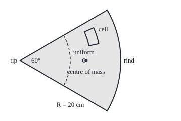

# Triple integrals: mass, moments and centres in three dimensions

Calculus and analysis → Multiple Integrals → Mass in solids → Triple integrals

---

## General Overview

A cheese wheel 20 cm in radius and 10 cm tall is cut into equal wedges, each spanning 60 degrees. The rind has dried and packed tight, so density (mass per cubic centimetre) rises steadily from 1.0 g/cm^3 at the wedge's tip, the wheel's old centre, to 1.5 g/cm^3 at the rind.

How heavy is the wedge, and where does it balance? Volume times density fails: there is no single density. Instead, cut the wedge into tiny cubes, weigh each as density times volume, and add. As the cubes shrink the sum settles on one number: the **triple integral**, the name used from here on. Weight each cube's mass by its position, divide by the total, and the result is the **centre of mass**. The wedge weighs 2792.53 g; its centre of mass lies on its middle line, 13.1303 cm from the tip. A uniform wedge's lies at 12.7324 cm.

**A triple integral adds density times volume over every tiny piece of a solid; weight each piece by its position, divide by the total, and the result is the point where the solid balances.**

**What kind of fact this is:** a method, resting on a definition (the limit of cube sums) and a theorem (adding one direction at a time gives the same limit), proved in Why it works.

### The picture: the wedge seen from above

<p align="center"></p>

Scale 1 cm = 10 units; the 10 cm height points out of the page. Density is 1.25 g/cm^3 on the dashed arc 10 cm out. The outlined cell spans 14 to 16 cm out and 12 to 24 degrees. Filled dot: the centre of mass, 13.1303 cm out. Open dot: a uniform wedge's, 12.7324 cm.

---

## The formula

Notation first, in words. Two integral signs add over a flat region ([double-integrals](01-double-integrals.md)). Three in a row, with the solid's name at the foot, add over a solid: $\iiint_E \rho\,dV$ is read "the integral over E of rho dV", where $dV$ is one tiny piece's volume and $\rho$ (rho) is density.

$$M = \iiint_E \rho\,dV \qquad Q_x = \iiint_E x\,\rho\,dV \qquad \bar{x} = \frac{Q_x}{M}$$

**Read it aloud:** mass $M$ is density times volume added over the solid; the moment $Q_x$ is the same sum with each piece also times its $x$, its distance from the tip along the wedge's middle line; the balance point $\bar{x}$ (x bar) is moment over mass. With $\rho = 1$ the first sum is plain volume.

In cylindrical coordinates ([cylindrical-and-spherical-coordinates](../../05-Geometry%20and%20trig/04-Coordinates%20and%20Curves/07-cylindrical-and-spherical-coordinates.md)) $r$ is distance from the wheel's axis, $\theta$ (theta) the angle from the middle line in radians, and $z$ the height. The wedge, of radius $R$, height $H$ and angle $\alpha$ (alpha), is every point with $r$ from 0 to $R$, $\theta$ from $-\alpha/2$ to $\alpha/2$, and $z$ from 0 to $H$. Density is $1 + r/40$ g/cm^3. A tiny piece has volume $dV = r\,dr\,d\theta\,dz$, so

$$M = \int_{-\alpha/2}^{\alpha/2} \int_0^R \int_0^H \left(1 + \frac{r}{40}\right) r \, dz\, dr\, d\theta$$

**Read it aloud:** add up the height, then outward, then across the angle; each piece counts density times r times three small steps.

| Symbol | Plain meaning | In our example | Push it up and the answer… |
| --- | --- | --- | --- |
| $E$, $V$ | the solid; its volume | the wedge; 2094.40 cm^3 | more mass |
| $\rho$ | density, mass per cubic centimetre | 1 + r/40 g/cm^3: 1.0 at the tip, 1.5 at the rind | centre moves toward the denser part |
| $x$, $y$, $z$ | position in cm: x from the tip along the middle line, y across, z up | x from 0 to 20 | — |
| $r$, $\theta$ | distance from the wheel's axis; angle from the middle line, in radians | r from 0 to 20 | — |
| $R$, $H$, $\alpha$ | wheel radius; height; wedge angle | 20 cm; 10 cm; 60 degrees = 1.047198 rad | wider angle pulls the centre inward |
| $dV$, $h$ | volume of one tiny piece; side of a test cube | r dr dθ dz; 1, 0.50, 0.25 cm | smaller h, smaller gap |
| $M$, $Q_x$, $m$ | mass; moment, mass times x added up; one piece's mass | 2792.53 g; 36666.67 g cm | — |
| $\bar{x}$, $\bar{y}$, $\bar{z}$ | the centre of mass, read "x bar" and so on | 13.1303 cm, 0, 5.0000 cm | — |

### When it holds

- **A bounded solid whose surface has no volume.** Cubes the surface cuts are neither in nor out, but their volume shrinks with the cubes: the cube road's gap falls from 45.99 g to 2.42 g.
- **Finite density.** Density growing like 1/r^2 toward the axis gives infinite mass: r times 1/r^2 has no finite integral down to 0.
- **Continuous density.** Then all six orders of adding x, y and z agree; an integrand that changes sign and blows up at a corner can give two answers.
- **Positive total mass.** The centre divides by M; with negative "density", such as charge, it can be undefined or outside the solid.

---

## Why it works

### Step 0: small enough, density is nearly constant

Inside a small cube density hardly changes, so its mass is density times volume almost exactly. The limit of the cube sums, as the cubes shrink, is the triple integral, by definition.

### Step 1: add one direction at a time

A sum over a grid of cubes can be added in any order: each vertical column first, then rows of columns. In the limit the column sums become an integral in $z$, leaving a double integral over the base. So a triple integral is three single integrals, innermost first.

<details>
<summary>Detailed proof: the cube limit exists and equals the one-at-a-time answer</summary>

A continuous density on a closed box is uniformly continuous: for any allowed error $\varepsilon > 0$ there is a cube side $h$ below which density varies by less than $\varepsilon$ inside every cube. The sum using each cube's smallest density (lower sum) and the one using its largest (upper sum) then differ by at most $\varepsilon$ times the box's volume, and every cube sum lies between them. So all cube sums close on one number.

Each column's integral lies, cube by cube, between the smallest and largest densities times the cube's height; integrating the column totals over the base stays between the same lower and upper sums. Two numbers trapped between squeezing bounds are equal. Relabelling axes gives the other orders.

For the wedge, set density to zero outside it. The jump sits on the surface. Cubes of side $h$ touching it number about a constant over $h^2$, so their volume is about a constant times $h$, which vanishes.

</details>

### Step 2: describe the solid

In x, y and z the wedge is awkward: y runs between the straight cuts until the rind's curve takes over, so the description splits in two. In cylindrical coordinates $r$, $\theta$ and $z$ each run over a fixed range: the wedge is a box.

### Step 3: a cylindrical cell's volume is r dr dθ dz

A cell between radii $r$ and $r + dr$, across angle $d\theta$, is a slice of a ring. Its top face has area $\tfrac{1}{2}d\theta\,\left((r+dr)^2 - r^2\right) = (r + \tfrac{1}{2}dr)\,dr\,d\theta$. Times its height, the volume is $r\,dr\,d\theta\,dz$ plus a term that vanishes faster than the cell. The factor $r$ is there because an angle step is longer far out: tip cells are slivers, rind cells are fat, as the outlined cell shows.

### Step 4: the centre of mass is where the moments cancel

Pieces of mass $m$ at positions $x$ on a rod balance where the sum of $(x - \bar{x})$ times $m$ is zero ([centre-of-mass-and-pappus](../05-Curves%20and%20Solids/05-centre-of-mass-and-pappus.md)). Solving, $\bar{x}$ is the sum of $x$ times $m$ over the sum of $m$. With shrinking cubes as pieces, the top becomes $Q_x$ and the bottom $M$.

Every piece at $y$ has a mirror at $-y$ of equal density, so $\bar{y}$ is 0. Density ignores height, so $\bar{z}$ is half of $H$: 5.0000 cm.

### Step 5: the wedge, by hand

Density depends on $r$ only, so the integrals separate: the height gives $H$, the angle $\alpha$, the radius $\int_0^R (r + r^2/40)\,dr = R^2/2 + R^3/120$. So

$$M = \alpha H \left(\frac{R^2}{2} + \frac{R^3}{120}\right) = 10.4720 \times 266.6667 = 2792.53 \text{ g}$$

For the moment, $x = r\cos\theta$. Integrating $\cos\theta$ across the angle gives $2\sin(\alpha/2)$, which is 1 here. The radius integral gains an $r$: $R^3/3 + R^4/160$. So $Q_x = 2\sin(\alpha/2)\,H\,(R^3/3 + R^4/160)$, and dividing by $M$ gives $\bar{x}$.

With density 1, the same steps give the uniform centroid (the shape's own balance point), $4R\sin(\alpha/2)/(3\alpha)$. The denser rind pulls the balance point outward, from 12.7324 to 13.1303 cm.

---

## Worked numbers, by hand

| Step | Arithmetic | Value |
| --- | --- | --- |
| volume | half of α × R^2 × H | 2094.40 cm^3 |
| radius integral, mass | 200.0000 + 66.6667 | 266.6667 |
| angle × height | 1.047198 × 10 | 10.4720 |
| mass | 10.4720 × 266.6667 | **2792.53 g** |
| radius integral, moment | 2666.6667 + 1000.0000 | 3666.6667 |
| moment | 1 × 10 × 3666.6667 | 36666.67 g cm |
| centre of mass | 36666.67 / 2792.53 | **13.1303 cm** |
| average density | 2792.53 / 2094.40 | 1.3333 g/cm^3 |

The wedge weighs 2792.53 g and balances on its middle line at mid-height, 13.1303 cm from the tip. Its average density, 1.3333 g/cm^3, beats the 1.25 halfway out: most volume lies far out.

### What breaks if you drop a piece

| Mistake | Comes out at | What went wrong |
| --- | --- | --- |
| Drop the r in r dr dθ dz | 261.80, in g/cm, not g | Every cell counted as if it sat 1 cm from the axis |
| Ignore density in the centre | 12.7324 cm, not 13.1303 | The shape's balance point, not the cheese's |
| Divide the moment by volume | 17.5070 cm | g cm over cm^3 is not a length |

The code prints all three.

---

## Code, from first principles, and it actually runs

Two roads that share no arithmetic. Road one evaluates Step 5's formulas. Road two is the definition: fill the bounding box with cubes of side 1, 0.50 and 0.25 cm, keep those whose centre is inside the wedge, add density times volume, and position times that for the moments. It works in x, y and z, never using the factor $r$, so agreement confirms Step 3; it also finds $\bar{y}$ and $\bar{z}$ without assuming symmetry. A second case runs road two with density 1 against the uniform-centroid formula.

### Python

```python
# Triple integrals -- the check behind the card.  Standard library only.
# A 60-degree wedge cut from a cheese wheel of radius 20 cm and height 10 cm.
# Density at distance r cm from the wheel's axis: 1 + r/40 g/cm^3.
# Road one: the antiderivatives worked by hand in cylindrical coordinates.
# Road two: the definition itself.  Cut the wedge's bounding box into cubes,
# keep each cube whose centre lies in the wedge, add density times volume.
# Road two never uses the r in r dr dtheta dz.
import math
R, H, A = 20.0, 10.0, math.pi / 3              # radius, height, wedge angle
S, T = math.sin(A / 2), math.tan(A / 2)

def rho(r): return 1 + r / 40                  # density, g/cm^3

def cubes(n, dens):                            # n cubes per cm along each edge
    h = 1 / n
    m = qx = qy = qz = 0.0
    for i in range(int(R * n)):
        x = (i + 0.5) * h
        for j in range(-int(R * S * n), int(R * S * n)):
            y = (j + 0.5) * h
            if abs(y) > x * T or x * x + y * y > R * R:
                continue                       # this cube's centre is outside
            for k in range(int(H * n)):
                z = (k + 0.5) * h
                dm = dens(math.sqrt(x * x + y * y)) * h ** 3
                m, qx, qy, qz = m + dm, qx + x * dm, qy + y * dm, qz + z * dm
    return m, qx / m, qy / m, qz / m

V = A / 2 * R ** 2 * H                                  # plain volume
M = A * H * (R ** 2 / 2 + R ** 3 / 120)                 # hand: mass
QX = 2 * S * H * (R ** 3 / 3 + R ** 4 / 160)            # hand: x-moment
XU = 4 * R * S / (3 * A)                                # hand: uniform centroid
print(f"wedge: radius {R:.0f} cm, height {H:.0f} cm, angle 60 degrees = {A:.6f} rad")
print(f"hand: volume {V:.2f} cm^3, mass {M:.2f} g, x-moment {QX:.2f} g cm")
print(f"hand: centre of mass x {QX / M:.4f} cm, y 0, z {H / 2:.4f} cm")
print(f"hand: r-integrals {R**2 / 2:.4f} + {R**3 / 120:.4f} = {M / (A * H):.4f} and "
      f"{R**3 / 3:.4f} + {R**4 / 160:.4f} = {QX / (2 * S * H):.4f}; angle x height {A * H:.4f}")
print(f"hand: density {rho(0):.4f} at the tip, {rho(10):.4f} at r = 10, {rho(R):.4f} at the rind; "
      f"average {M / V:.4f} g/cm^3")
print(f"hand: uniform centroid x {XU:.4f} cm")
errs = []
for n in (1, 2, 4):
    m, xb, yb, zb = cubes(n, rho)
    errs.append(abs(m - M))
    print(f"cubes of side {1 / n:.2f} cm: mass {m:.2f} g (gap {M - m:.2f}), "
          f"centre x {xb:.4f} y {abs(yb):.4f} z {zb:.4f}")
vu, xu, _, _ = cubes(4, lambda r: 1.0)
print(f"cubes of side 0.25 cm, density 1: volume {vu:.2f} cm^3, centroid x {xu:.4f} cm")
print(f"mistake 1, drop the r in r dr dtheta dz: 'mass' {A * H * (R + R * R / 80):.2f}")
print(f"mistake 2, ignore density: centre x {XU:.4f} cm, not {QX / M:.4f}")
print(f"mistake 3, divide the moment by volume: centre x {QX / V:.4f} cm")
F = 10                                                  # figure: 1 cm = 10 units
pt = lambda r, d: f"({40 + F * r * math.cos(math.radians(d)):.2f}, {120 - F * r * math.sin(math.radians(d)):.2f})"
print(f"figure, 1 cm = {F} units; tip {pt(0, 0)}; corners {pt(R, 30)} {pt(R, -30)}; rind {pt(R, 0)}; mid-arc ends {pt(10, 30)} {pt(10, -30)}")
print(f"figure, cell r 14 to 16 cm, 12 to 24 degrees {pt(14, 12)} {pt(16, 12)} {pt(16, 24)} {pt(14, 24)}; dots {pt(QX / M, 0)} {pt(XU, 0)}")
assert abs(m - M) / M < 0.002 and abs(xb - QX / M) < 0.01    # road two meets road one
assert abs(vu - V) / V < 0.002 and abs(xu - XU) < 0.01        # uniform case, own formula
assert errs[2] < errs[0] / 4                                  # the gap closes as cubes shrink
assert abs(zb - H / 2) < 1e-9 and abs(yb) < 1e-9              # symmetry, found not assumed
print("ALL CHECKS PASS")
```

**Ran 2026-09-27 on macOS, Python 3.14.6, standard library only. All checks passed. Output, pasted from the run:**

```
wedge: radius 20 cm, height 10 cm, angle 60 degrees = 1.047198 rad
hand: volume 2094.40 cm^3, mass 2792.53 g, x-moment 36666.67 g cm
hand: centre of mass x 13.1303 cm, y 0, z 5.0000 cm
hand: r-integrals 200.0000 + 66.6667 = 266.6667 and 2666.6667 + 1000.0000 = 3666.6667; angle x height 10.4720
hand: density 1.0000 at the tip, 1.2500 at r = 10, 1.5000 at the rind; average 1.3333 g/cm^3
hand: uniform centroid x 12.7324 cm
cubes of side 1.00 cm: mass 2746.54 g (gap 45.99), centre x 13.1431 y 0.0000 z 5.0000
cubes of side 0.50 cm: mass 2779.66 g (gap 12.87), centre x 13.1279 y 0.0000 z 5.0000
cubes of side 0.25 cm: mass 2790.11 g (gap 2.42), centre x 13.1327 y 0.0000 z 5.0000
cubes of side 0.25 cm, density 1: volume 2092.50 cm^3, centroid x 12.7357 cm
mistake 1, drop the r in r dr dtheta dz: 'mass' 261.80
mistake 2, ignore density: centre x 12.7324 cm, not 13.1303
mistake 3, divide the moment by volume: centre x 17.5070 cm
figure, 1 cm = 10 units; tip (40.00, 120.00); corners (213.21, 20.00) (213.21, 220.00); rind (240.00, 120.00); mid-arc ends (126.60, 70.00) (126.60, 170.00)
figure, cell r 14 to 16 cm, 12 to 24 degrees (176.94, 90.89) (196.50, 86.73) (186.17, 54.92) (167.90, 63.06); dots (171.30, 120.00) (167.32, 120.00)
ALL CHECKS PASS
```

### Rust

Same numbers, same labels, built with `rustc --edition 2021 -O`.

```rust
// Triple integrals -- the same check as the Python, in Rust.  No crates.
// A 60-degree wedge cut from a cheese wheel of radius 20 cm and height 10 cm.
// Density at distance r cm from the wheel's axis: 1 + r/40 g/cm^3.
// Road one: the antiderivatives worked by hand in cylindrical coordinates.
// Road two: the definition itself.  Cut the wedge's bounding box into cubes,
// keep each cube whose centre lies in the wedge, add density times volume.
// Road two never uses the r in r dr dtheta dz.
const R: f64 = 20.0;
const H: f64 = 10.0;

fn rho(r: f64) -> f64 { 1.0 + r / 40.0 }

fn cubes(n: i64, dens: &dyn Fn(f64) -> f64) -> (f64, f64, f64, f64) {
    let a = std::f64::consts::PI / 3.0;
    let (s, t, h) = ((a / 2.0).sin(), (a / 2.0).tan(), 1.0 / n as f64);
    let (mut m, mut qx, mut qy, mut qz) = (0.0, 0.0, 0.0, 0.0);
    let jmax = (R * s * n as f64) as i64;
    for i in 0..(R * n as f64) as i64 {
        let x = (i as f64 + 0.5) * h;
        for j in -jmax..jmax {
            let y = (j as f64 + 0.5) * h;
            if y.abs() > x * t || x * x + y * y > R * R { continue } // centre outside
            for k in 0..(H * n as f64) as i64 {
                let z = (k as f64 + 0.5) * h;
                let dm = dens((x * x + y * y).sqrt()) * h * h * h;
                m += dm; qx += x * dm; qy += y * dm; qz += z * dm;
            }
        }
    }
    (m, qx / m, qy / m, qz / m)
}

fn pt(r: f64, d: f64) -> String {                // figure: 1 cm = 10 units
    let t = d.to_radians();
    format!("({:.2}, {:.2})", 40.0 + 10.0 * r * t.cos(), 120.0 - 10.0 * r * t.sin())
}

fn main() {
    let a = std::f64::consts::PI / 3.0;
    let s = (a / 2.0).sin();
    let v = a / 2.0 * R * R * H;                                       // plain volume
    let m0 = a * H * (R * R / 2.0 + R * R * R / 120.0);                // hand: mass
    let qx0 = 2.0 * s * H * (R * R * R / 3.0 + R * R * R * R / 160.0); // hand: x-moment
    let xu0 = 4.0 * R * s / (3.0 * a);                                 // hand: uniform centroid
    println!("wedge: radius {:.0} cm, height {:.0} cm, angle 60 degrees = {:.6} rad", R, H, a);
    println!("hand: volume {:.2} cm^3, mass {:.2} g, x-moment {:.2} g cm", v, m0, qx0);
    println!("hand: centre of mass x {:.4} cm, y 0, z {:.4} cm", qx0 / m0, H / 2.0);
    println!("hand: r-integrals {:.4} + {:.4} = {:.4} and {:.4} + {:.4} = {:.4}; angle x height {:.4}",
             R * R / 2.0, R * R * R / 120.0, m0 / (a * H), R * R * R / 3.0, R.powi(4) / 160.0,
             qx0 / (2.0 * s * H), a * H);
    println!("hand: density {:.4} at the tip, {:.4} at r = 10, {:.4} at the rind; average {:.4} g/cm^3",
             rho(0.0), rho(10.0), rho(R), m0 / v);
    println!("hand: uniform centroid x {:.4} cm", xu0);
    let mut errs = Vec::new();
    let (mut m, mut xb, mut yb, mut zb) = (0.0, 0.0, 0.0, 0.0);
    for n in [1_i64, 2, 4] {
        (m, xb, yb, zb) = cubes(n, &rho);
        errs.push((m - m0).abs());
        println!("cubes of side {:.2} cm: mass {:.2} g (gap {:.2}), centre x {:.4} y {:.4} z {:.4}",
                 1.0 / n as f64, m, m0 - m, xb, yb.abs(), zb);
    }
    let (vu, xu, _, _) = cubes(4, &|_r| 1.0);
    println!("cubes of side 0.25 cm, density 1: volume {:.2} cm^3, centroid x {:.4} cm", vu, xu);
    println!("mistake 1, drop the r in r dr dtheta dz: 'mass' {:.2}", a * H * (R + R * R / 80.0));
    println!("mistake 2, ignore density: centre x {:.4} cm, not {:.4}", xu0, qx0 / m0);
    println!("mistake 3, divide the moment by volume: centre x {:.4} cm", qx0 / v);
    println!("figure, 1 cm = 10 units; tip {}; corners {} {}; rind {}; mid-arc ends {} {}",
             pt(0.0, 0.0), pt(R, 30.0), pt(R, -30.0), pt(R, 0.0), pt(10.0, 30.0), pt(10.0, -30.0));
    println!("figure, cell r 14 to 16 cm, 12 to 24 degrees {} {} {} {}; dots {} {}",
             pt(14.0, 12.0), pt(16.0, 12.0), pt(16.0, 24.0), pt(14.0, 24.0), pt(qx0 / m0, 0.0), pt(xu0, 0.0));
    assert!((m - m0).abs() / m0 < 0.002 && (xb - qx0 / m0).abs() < 0.01); // road two meets road one
    assert!((vu - v).abs() / v < 0.002 && (xu - xu0).abs() < 0.01);       // uniform case, own formula
    assert!(errs[2] < errs[0] / 4.0);                                     // the gap closes as cubes shrink
    assert!((zb - H / 2.0).abs() < 1e-9 && yb.abs() < 1e-9);              // symmetry, found not assumed
    println!("ALL CHECKS PASS");
}
```

**Ran 2026-09-27 on macOS, rustc 1.98.1, no crates. All checks passed. Output, pasted from the run:**

```
wedge: radius 20 cm, height 10 cm, angle 60 degrees = 1.047198 rad
hand: volume 2094.40 cm^3, mass 2792.53 g, x-moment 36666.67 g cm
hand: centre of mass x 13.1303 cm, y 0, z 5.0000 cm
hand: r-integrals 200.0000 + 66.6667 = 266.6667 and 2666.6667 + 1000.0000 = 3666.6667; angle x height 10.4720
hand: density 1.0000 at the tip, 1.2500 at r = 10, 1.5000 at the rind; average 1.3333 g/cm^3
hand: uniform centroid x 12.7324 cm
cubes of side 1.00 cm: mass 2746.54 g (gap 45.99), centre x 13.1431 y 0.0000 z 5.0000
cubes of side 0.50 cm: mass 2779.66 g (gap 12.87), centre x 13.1279 y 0.0000 z 5.0000
cubes of side 0.25 cm: mass 2790.11 g (gap 2.42), centre x 13.1327 y 0.0000 z 5.0000
cubes of side 0.25 cm, density 1: volume 2092.50 cm^3, centroid x 12.7357 cm
mistake 1, drop the r in r dr dtheta dz: 'mass' 261.80
mistake 2, ignore density: centre x 12.7324 cm, not 13.1303
mistake 3, divide the moment by volume: centre x 17.5070 cm
figure, 1 cm = 10 units; tip (40.00, 120.00); corners (213.21, 20.00) (213.21, 220.00); rind (240.00, 120.00); mid-arc ends (126.60, 70.00) (126.60, 170.00)
figure, cell r 14 to 16 cm, 12 to 24 degrees (176.94, 90.89) (196.50, 86.73) (186.17, 54.92) (167.90, 63.06); dots (171.30, 120.00) (167.32, 120.00)
ALL CHECKS PASS
```

> [!TIP]
> **Try changing**
> - **Density 1 everywhere.** Guess first: the centre moves toward the tip, to the uniform centroid, 12.7324 cm.
> - **A taller wheel, H = 20.** Guess first: mass doubles, the balance point along x stays put, and the centre's height doubles.
> - **Delete the inside test in the cube loop.** Guess first: the sum weighs the whole bounding box and the first assert fails.

---

## The usual mistake

> [!warning]
> **Dropping the r in r dr dθ dz.** The wedge is a box in $r$, $\theta$ and $z$, yet its cells are not equal: an angle step is longer far out. Without the $r$ the "mass" is 261.80, in grams per centimetre: a length went missing.
>
> - **The density halfway out as the average.** 1.25 g/cm^3 against a true average of 1.3333: too little mass.
> - **The angle in degrees.** $\alpha$ must be in radians: 1.047198, not 60.
> - **Box bounds for a non-box.** Running y over a fixed range weighs a rectangle of cheese that was never there.

---

## Where you meet it in real life

- **Medical scanners.** A CT scan reports density in small cubes (voxels); summing density times voxel volume, as road two does, weighs an organ.
- **Loading ships and aircraft.** Fuel in a curved tank shifts the centre of mass, which sets whether the craft trims level.
- **The Earth's interior.** Density rises toward the core; a triple integral in spherical coordinates turns a density model into a mass that must match what orbits reveal.
- **Spinning things.** Weight each piece by squared distance from an axis and the same integral says how hard a body is to spin up: rigid-body-rotation-and-moment-of-inertia.

> **Say it back**
> A triple integral cuts a solid into tiny pieces, multiplies each volume by the density there, and adds, in the limit. It is computed one direction at a time, once the solid is described as ranges of coordinates. In cylindrical coordinates a piece's volume is r dr dθ dz, since an angle step is longer far out. Weighting by position and dividing by mass gives the centre of mass. The wedge weighs 2792.53 g and balances 13.1303 cm from its tip, beyond a uniform wedge's 12.7324 cm.

---

## What this builds on

- [double-integrals](01-double-integrals.md): adding over a region one direction at a time, here with a third layer.
- [cylindrical-and-spherical-coordinates](../../05-Geometry%20and%20trig/04-Coordinates%20and%20Curves/07-cylindrical-and-spherical-coordinates.md): the coordinates that make the wedge a box.

## Where this goes next

- [change-of-variables-and-jacobians](03-change-of-variables-and-jacobians.md): the stretch factor for any coordinates, of which r is one case.
- [divergence-theorem](../09-Vector%20Calculus/07-divergence-theorem.md): outflow from each piece, added over a solid, equals the flow through its surface.
- rigid-body-rotation-and-moment-of-inertia: squared distance times mass, for spinning bodies.
- ricci-and-scalar-curvature: volumes of small balls in curved space, integrated the same way.

---

## Sources

Verified 2026-09-27: every link below resolves to the publisher's page.

- OpenStax. *Calculus Volume 3*, section 5.4, "Triple Integrals". [OpenStax page](https://openstax.org/books/calculus-volume-3/pages/5-4-triple-integrals). Box sums, adding one direction at a time, and solids described by bounds.
- OpenStax. *Calculus Volume 3*, section 5.5, "Triple Integrals in Cylindrical and Spherical Coordinates". [OpenStax page](https://openstax.org/books/calculus-volume-3/pages/5-5-triple-integrals-in-cylindrical-and-spherical-coordinates). The cylindrical cell and its r dr dθ dz.
- OpenStax. *Calculus Volume 3*, section 5.6, "Calculating Centers of Mass and Moments of Inertia". [OpenStax page](https://openstax.org/books/calculus-volume-3/pages/5-6-calculating-centers-of-mass-and-moments-of-inertia). Mass, first moments and the centre of mass of a solid.
