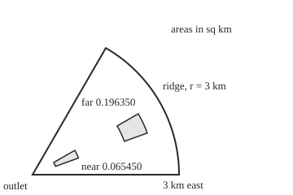

# Change of variables: polar, cylindrical and spherical, and the Jacobian that fixes the area

Calculus and analysis → Multiple Integrals → Stretched coordinates → Change of variables

---

## General Overview

A valley fans out from the outlet where its stream leaves: from above, a slice of circle 3 km from outlet to ridge, opening through 60 degrees. In one storm the rain lies 20 mm deep at the outlet and deepens by 10 mm per kilometre out, to 50 mm at the ridge. How much water fell?

On an east-north grid the ridge is a curve. In distance-and-angle coordinates the valley is a rectangle of addresses, distance 0 to 3 km by angle 0 to 60 degrees, and depth depends on distance alone.

The price: equal address steps do not cover equal ground. A patch 0.5 km deep and 10 degrees wide covers 0.065450 square kilometres near the outlet and 0.196350 out by the ridge. The correcting factor is the **Jacobian**, the local area stretch of the coordinate change. With it the storm left 188,496 cubic metres; without it, far less.

**To integrate in new coordinates, rewrite the integrand in them and multiply by the size of the Jacobian determinant, the area or volume one small address patch covers per unit of address.**

**What kind of fact this is:** a theorem, proved in Why it works, in full in the folded Detailed proof.

---

## The formula

Reminders: a double or triple integral totals a quantity patch by patch over a region ([double-integrals](01-double-integrals.md)). The Jacobian matrix of a map holds its partial derivatives, each output's rate per unit of each input ([multivariable-chain-rule-and-jacobians](../07-Several%20Variables/04-multivariable-chain-rule-and-jacobians.md)). Its determinant, det, is a linear map's signed area factor; the bars take its size.

$T$ sends an address $(u, v)$ to a place $(x, y)$. $S$ is the region of addresses, $D$ the places it covers, $f$ the quantity totalled. In the table below, z is height, ρ distance from a centre, φ the angle down from the vertical.

$$\iint_D f(x,y)\,dx\,dy \;=\; \iint_S f\big(T(u,v)\big)\,\big|\det J_T(u,v)\big|\,du\,dv$$

**Read it aloud:** the total over places equals the total over addresses, each weighted by the quantity at its place and by the ground its patch covers.

| System | The map | Area or volume element |
| --- | --- | --- |
| polar | x = r cos θ, y = r sin θ | dA = r dr dθ |
| cylindrical | polar, with height z unchanged | dV = r dr dθ dz |
| spherical | x = ρ sin φ cos θ, y = ρ sin φ sin θ, z = ρ cos φ | dV = ρ^2 sin φ dρ dφ dθ |

On the valley, depth f = 20 + 10r mm, r in km:

$$\int_0^{\pi/3}\!\!\int_0^3 (20 + 10r)\,r\,dr\,d\theta \;=\; \frac{\pi}{3}\,(90 + 90) \;=\; 60\pi \;=\; 188.495559\ \text{mm km}^2$$

One millimetre over one square kilometre is 1,000 cubic metres: 188,496 cubic metres.

| Symbol | Plain meaning | In our example | Push it up and the answer… |
| --- | --- | --- | --- |
| $x$, $y$ | place: km east and north of the outlet | the valley floor | — |
| $r$, $\theta$ | distance from the outlet; angle from the east edge, radians | 0 to 3 km, 0 to π/3 | larger r: more ground per patch |
| $f$ | the quantity totalled, here rain depth in mm | 20 + 10r | total grows in proportion |
| $u$, $v$, $S$ | general addresses; their region | r, θ; a rectangle | — |
| $D$, $T$ | the places; the map onto them | the fan; polar map | — |
| $J_T$ | Jacobian matrix of T; its determinant's size is the stretch | r | each patch counts more |
| $z$, $\rho$, $\phi$ | height; distance from a centre; angle down from vertical | tank; raindrop radius 2 mm | — |
| $dA$, $dV$ | one small patch's area or volume | r dr dθ | — |

### When it holds

- **T covers each place once, except on a set of zero area.** Run the angle twice round a round floor and it counts 62831.853 square metres for 31415.927.
- **T has continuous partial derivatives.** Otherwise the patch argument fails: a corner has no single stretch.
- **The determinant vanishes only on a set of zero area.** Polar squashes the edge r = 0 onto one point, the outlet; no ground is lost.
- **Angles in radians.** In degrees the valley gets 10800.000000 mm km^2.
- **f continuous, D bounded.** Unbounded regions need a limit on top ([gaussian-integral](04-gaussian-integral.md)).

---

## Why it works

### Step 0: a small address patch lands as a small patch of ground, scaled by one number

Close up, a smooth map looks linear, and a linear map multiplies every area by its determinant's size. So a small address patch covers about |det J_T| times its own area; weighting and adding turns a total over places into one over addresses.

### Step 1: in polar coordinates, far patches cover more ground

Two address patches, each 0.5 km deep and 10 degrees wide: one 0.5 to 1 km out, one 2 to 2.5 km out.

<p align="center"></p>

Scale: 60 px per km, outlet at (40, 215); both shaded patches run from 20 to 30 degrees.

A ring slice between radii r1 and r2 through angle Δθ has area (r2^2 − r1^2) Δθ / 2, which factors as middle radius × depth × angle. Near: 0.75 × 0.5 × (10 degrees in radians) = 0.065450 square kilometres. Far: 2.25 × 0.5 × (10 degrees in radians) = 0.196350, three times as much at three times the distance. Ground per unit of address is r, exactly.

### Step 2: the Jacobian gives the same factor, for any smooth map

Nudge r and the place moves along (cos θ, sin θ), 1 km per km. Nudge θ and it moves along (−r sin θ, r cos θ), r km per radian, at right angles. The area factor is the determinant of these columns:

$$J_T = \begin{pmatrix}\cos\theta & -r\sin\theta\\ \sin\theta & r\cos\theta\end{pmatrix},\qquad \det J_T = r\cos^2\theta + r\sin^2\theta = r.$$

Built from difference quotients alone at r = 2.25 km and 25 degrees, it prints 2.250000. For columns not at right angles the determinant still measures the slanted parallelogram, so the theorem uses it, not a product of lengths.

### Step 3: from one patch to the whole region

Cut the address region into small patches. Each lands on ground of area |det J_T| times its own, up to an error far smaller than the patch, and the quantity barely changes across it. The two sums differ by a fraction of the total that shrinks with the patches; both close on their integrals, so the integrals agree.

<details>
<summary>Detailed proof</summary>

Hypotheses: S closed and bounded, its edge of zero area; T with continuous partial derivatives, one-to-one with nonzero determinant inside S; f continuous on D = T(S).

Local step. A linear map L scales area by |det L|. The partial derivatives are uniformly continuous on S, so for each ε > 0 some δ > 0 makes T(q) within εh of T(p) + J_T(p)(q − p) on any square Q of side h < δ centred at p. So T(Q) differs from the linear image by a border of area at most C ε h^2, C fixed by a bound on the Jacobian: area T(Q) = |det J_T(p)| h^2 within C ε h^2.

Global step. Grid S in squares of side h; those touching the edge have total area tending to 0. Inner squares land as patches overlapping only along edges. The sums of f(T(p)) |det J_T(p)| h^2 and of f(T(p)) × area T(Q) are Riemann sums for the right and left sides, and differ by at most C ε × area of S × max |f|. Let h, then ε, go to 0.

</details>

### Step 4: cylindrical coordinates add a height

Cylindrical coordinates add height z to polar. The Jacobian gains a row and column holding a single 1, so the factor stays r. A round tank of radius 100 m holds 2π times the integral of r from 0 to 100 per metre of depth, 31415.927 cubic metres; the storm fills it to 6.000000 m.

### Step 5: spherical coordinates, and where ρ^2 sin φ comes from

Spherical coordinates give distance ρ from a centre, angle φ down from the vertical, and compass angle θ. Nudges move a place dρ, then ρ dφ round a circle of radius ρ, then ρ sin φ dθ round a latitude circle of radius ρ sin φ. They are at right angles: the box is ρ^2 sin φ dρ dφ dθ. At ρ = 2, φ = 60 degrees, the difference-quotient Jacobian prints 3.464102, as does ρ^2 sin φ.

A raindrop of radius 2 mm: 2π for θ, times 2 from sin φ over 0 to π, times 8/3 from ρ^2 over 0 to 2, gives 32π/3 = 33.510322 cubic millimetres. Without sin φ it is 52.637890: latitude circles near the poles are small.

---

## Worked numbers, by hand

| Step | Arithmetic | Value |
| --- | --- | --- |
| valley in addresses | r from 0 to 3 km, θ from 0 to π/3 | a rectangle |
| area stretch | det J_T | r |
| depth times stretch | (20 + 10r) r = 20r + 10r^2 | — |
| first piece, r from 0 to 3 | 10 × 3^2 | 90 |
| second piece | (10/3) × 3^3 | 90 |
| angle | (π/3) × 180 | **60π = 188.495559 mm km^2** |
| to cubic metres | × 1,000 | **188,496** |
| valley area | (π/3) × 3^2 / 2 | 4.712389 sq km |
| mean depth | 188.495559 / 4.712389 | 40.000000 mm |

The valley took 188,496 cubic metres, a mean of 40 mm; not the 35 mm halfway between outlet and ridge, because most ground lies far out, where rain is deeper.

### What breaks if you drop a piece

| Mistake | Comes out at | What went wrong |
| --- | --- | --- |
| factor r left out | 109.955743 mm km^2 | address area taken for ground area |
| angle in degrees | 10800.000000 mm km^2 | a degree is not an arc length on the unit circle |
| angle run twice round, tank floor | 62831.853 sq m, not 31415.927 | the map covers each place twice |
| sin φ left out, raindrop | 52.637890 cubic mm, not 33.510322 | latitude circles shrink towards the poles |

In the third row the Jacobian is still r; one-to-one failed.

---

## Code, from first principles, and it actually runs

Two roads to the valley's total sharing no step: polar with the factor r, by Simpson's rule (a weighted strip sum, exact for cubics), and an east-north grid of small squares that never mentions r ([double-integrals](01-double-integrals.md)). The Jacobians are measured, not quoted: difference-quotient columns, determinant expanded by hand. Patch areas come from polygons hugging each patch's arcs.

### Python

```python
# Change of variables -- the check behind the card.  Standard library only.  Rain on a
# fan: radius 3 km, opening 60 degrees, 20 + 10 r mm deep at r km from the outlet.  Road 1:
# polar, with the factor r.  Road 2: an x-y grid that never mentions r.  Then the Jacobians.
import math
PI, R = math.pi, 3.0
TH, DEG = PI / 3, PI / 180                    # the fan's opening, and one degree, in radians
def simpson(f, a, b, n=100):                  # Simpson's rule on n (even) strips
    h, s = (b - a) / n, f(a) + f(b)
    for k in range(1, n):
        s += (4 if k % 2 else 2) * f(a + k * h)
    return s * h / 3
def grid(n):                                  # road 2: n x n midpoint cells on the square 0..3 km
    h, s = R / n, 0.0
    for i in range(n):
        for j in range(n):
            x, y = (i + 0.5) * h, (j + 0.5) * h
            if x * x + y * y <= R * R and y <= math.sqrt(3) * x:
                s += depth(math.sqrt(x * x + y * y))
    return s * h * h
def jac(T, p, h=1e-6):                        # matrix of rates, one central difference per input
    cols = [[(u - v) / (2 * h) for u, v in zip(T(*(p[:k] + [p[k] + h] + p[k+1:])), T(*(p[:k] + [p[k] - h] + p[k+1:])))] for k in range(len(p))]
    return [[cols[j][i] for j in range(len(p))] for i in range(len(p))]
def patch(r1, r2, t1, t2, m=400):             # a fan patch's area, as a polygon hugging both arcs
    pts = [pol(r2, t1 + (t2 - t1) * k / m) for k in range(m + 1)] + [pol(r1, t2 - (t2 - t1) * k / m) for k in range(m + 1)]
    s = 0.0
    for (x1, y1), (x2, y2) in zip(pts, pts[1:] + pts[:1]):
        s += x1 * y2 - x2 * y1
    return s / 2
depth = lambda r: 20 + 10 * r                 # mm of rain at r km from the outlet
pol = lambda r, t: (r * math.cos(t), r * math.sin(t))
sph = lambda p, f, t: (p * math.sin(f) * math.cos(t), p * math.sin(f) * math.sin(t), p * math.cos(f))
det2 = lambda m: m[0][0] * m[1][1] - m[0][1] * m[1][0]
det3 = lambda m: sum(m[0][j] * (m[1][(j + 1) % 3] * m[2][(j + 2) % 3] - m[1][(j + 2) % 3] * m[2][(j + 1) % 3]) for j in range(3))
exact = 60 * PI                               # by hand: (pi/3) x (90 + 90)
polar = simpson(lambda t: simpson(lambda r: depth(r) * r, 0, R), 0, TH)
print(f"road 1, polar with factor r: {polar:.6f} mm km2; by hand (pi/3) x (90 + 90) = {exact:.6f}")
for n in (100, 400, 1600):
    g = grid(n)
    print(f"road 2, x-y grid {n:4}: {g:.6f} mm km2, error {g - exact:+.6f}")
area = TH * simpson(lambda r: r, 0, R)
print(f"area {area:.6f} km2; mean depth {polar / area:.6f} mm; water {polar * 1000:.0f} m3")
dp, ds = det2(jac(pol, [2.25, 25 * DEG])), det3(jac(sph, [2.0, 60 * DEG, 0.7]))
print(f"Jacobian by difference quotients: polar at r 2.25 {dp:.6f}; spherical at rho 2, phi 60 deg {ds:.6f} (rho^2 sin phi {4 * math.sin(60 * DEG):.6f})")
areas = [patch(r1, r1 + 0.5, 20 * DEG, 30 * DEG) for r1 in (0.5, 2.0)]
for r1, a in zip((0.5, 2.0), areas):
    print(f"patch r {r1:.1f}..{r1 + 0.5:.1f} km, 20..30 deg: polygon {a:.6f} km2; r dr dtheta {(r1 + 0.25) * 0.5 * 10 * DEG:.6f}")
drop = 2 * PI * simpson(lambda p: p * p, 0, 2) * simpson(math.sin, 0, PI)
print(f"raindrop radius 2 mm: {drop:.6f} mm3; 4/3 pi 2^3 = {32 * PI / 3:.6f}; sin phi dropped {2 * PI * PI * 8 / 3:.6f}")
per_m = 2 * PI * simpson(lambda r: r, 0, 100)
print(f"round tank radius 100 m: {per_m:.3f} m3 per metre (theta run twice round: {2 * per_m:.3f}); the storm fills it to {polar * 1000 / per_m:.6f} m")
print(f"mistakes: r dropped {TH * simpson(depth, 0, R):.6f}; rim-outlet average x area {35 * area:.6f}; degrees {60 * simpson(lambda r: depth(r) * r, 0, R):.6f}")
px = lambda r, t: f"({40 + 60 * r * math.cos(t):.2f}, {215 - 60 * r * math.sin(t):.2f})"
print(f"figure, 60 px per km, outlet (40, 215), rim ends {px(3, 0)} {px(3, TH)}")
for r1 in (0.5, 2.0):
    print(f"figure, patch r {r1:.1f}..{r1 + 0.5:.1f}:", " ".join(px(r, t * DEG) for r, t in ((r1, 20), (r1 + 0.5, 20), (r1 + 0.5, 30), (r1, 30))))
assert abs(polar - exact) < 1e-9                                  # polar Simpson meets the hand answer
assert abs(g - exact) < 0.05                                      # the grid, blind to r, closes on it
assert abs(dp - 2.25) < 1e-6 and abs(ds - 4 * math.sin(60 * DEG)) < 1e-6
assert abs(areas[1] - 2.25 * 0.5 * 10 * DEG) < 1e-6 and abs(drop - 32 * PI / 3) < 1e-6
print("ALL CHECKS PASS")
```

**Ran 2026-09-27 on macOS, Python 3.14.6, standard library only. All checks passed. Output, pasted from the run:**

```
road 1, polar with factor r: 188.495559 mm km2; by hand (pi/3) x (90 + 90) = 188.495559
road 2, x-y grid  100: 188.613258 mm km2, error +0.117699
road 2, x-y grid  400: 188.494727 mm km2, error -0.000832
road 2, x-y grid 1600: 188.496360 mm km2, error +0.000800
area 4.712389 km2; mean depth 40.000000 mm; water 188496 m3
Jacobian by difference quotients: polar at r 2.25 2.250000; spherical at rho 2, phi 60 deg 3.464102 (rho^2 sin phi 3.464102)
patch r 0.5..1.0 km, 20..30 deg: polygon 0.065450 km2; r dr dtheta 0.065450
patch r 2.0..2.5 km, 20..30 deg: polygon 0.196350 km2; r dr dtheta 0.196350
raindrop radius 2 mm: 33.510322 mm3; 4/3 pi 2^3 = 33.510322; sin phi dropped 52.637890
round tank radius 100 m: 31415.927 m3 per metre (theta run twice round: 62831.853); the storm fills it to 6.000000 m
mistakes: r dropped 109.955743; rim-outlet average x area 164.933614; degrees 10800.000000
figure, 60 px per km, outlet (40, 215), rim ends (220.00, 215.00) (130.00, 59.12)
figure, patch r 0.5..1.0: (68.19, 204.74) (96.38, 194.48) (91.96, 185.00) (65.98, 200.00)
figure, patch r 2.0..2.5: (152.76, 173.96) (180.95, 163.70) (169.90, 140.00) (143.92, 155.00)
ALL CHECKS PASS
```

### Rust

```rust
// Change of variables -- the same check in Rust, std only.  Rain on a fan: radius
// 3 km, opening 60 degrees, 20 + 10 r mm deep at r km from the outlet.  Road 1: polar,
// with the factor r.  Road 2: an x-y grid that never mentions r.  Then the Jacobians.
use std::f64::consts::PI;
const R: f64 = 3.0;                              // the fan's radius in km
const TH: f64 = PI / 3.0; const DEG: f64 = PI / 180.0;   // its opening, and one degree, in radians
fn simpson(f: &dyn Fn(f64) -> f64, a: f64, b: f64) -> f64 {   // Simpson's rule, 100 strips
    let (n, mut s) = (100, f(a) + f(b));
    let h = (b - a) / n as f64;
    for k in 1..n { s += if k % 2 == 1 { 4.0 } else { 2.0 } * f(a + k as f64 * h); }
    s * h / 3.0
}
fn depth(r: f64) -> f64 { 20.0 + 10.0 * r }      // mm of rain at r km from the outlet
fn grid(n: usize) -> f64 {                       // road 2: n x n midpoint cells on the square 0..3 km
    let (h, mut s) = (R / n as f64, 0.0);
    for i in 0..n {
        for j in 0..n {
            let (x, y) = ((i as f64 + 0.5) * h, (j as f64 + 0.5) * h);
            if x * x + y * y <= R * R && y <= 3f64.sqrt() * x { s += depth((x * x + y * y).sqrt()); }
        }
    }
    s * h * h
}
fn pol(p: &[f64]) -> Vec<f64> { vec![p[0] * p[1].cos(), p[0] * p[1].sin()] }
fn sph(p: &[f64]) -> Vec<f64> { vec![p[0] * p[1].sin() * p[2].cos(), p[0] * p[1].sin() * p[2].sin(), p[0] * p[1].cos()] }
fn jac(t: &dyn Fn(&[f64]) -> Vec<f64>, p: &[f64]) -> Vec<Vec<f64>> {   // one central difference per input
    let h = 1e-6; let cols: Vec<Vec<f64>> = (0..p.len()).map(|k| {
        let (mut a, mut b) = (p.to_vec(), p.to_vec());
        a[k] += h; b[k] -= h;
        t(&a).iter().zip(t(&b).iter()).map(|(u, v)| (u - v) / (2.0 * h)).collect()
    }).collect();
    (0..p.len()).map(|i| (0..p.len()).map(|j| cols[j][i]).collect()).collect()
}
fn det2(m: &Vec<Vec<f64>>) -> f64 { m[0][0] * m[1][1] - m[0][1] * m[1][0] }
fn det3(m: &Vec<Vec<f64>>) -> f64 {
    (0..3).map(|j| m[0][j] * (m[1][(j + 1) % 3] * m[2][(j + 2) % 3] - m[1][(j + 2) % 3] * m[2][(j + 1) % 3])).sum()
}
fn patch(r1: f64, r2: f64, t1: f64, t2: f64) -> f64 {   // a fan patch's area, as a polygon hugging both arcs
    let m = 400;
    let mut pts: Vec<Vec<f64>> = (0..=m).map(|k| pol(&[r2, t1 + (t2 - t1) * k as f64 / m as f64])).collect();
    pts.extend((0..=m).map(|k| pol(&[r1, t2 - (t2 - t1) * k as f64 / m as f64])));
    let mut s = 0.0;
    for k in 0..pts.len() { let (a, b) = (&pts[k], &pts[(k + 1) % pts.len()]); s += a[0] * b[1] - b[0] * a[1]; }
    s / 2.0
}
fn px(r: f64, t: f64) -> String { format!("({:.2}, {:.2})", 40.0 + 60.0 * r * t.cos(), 215.0 - 60.0 * r * t.sin()) }
fn main() {
    let exact = 60.0 * PI;                        // by hand: (pi/3) x (90 + 90)
    let polar = simpson(&|_t| simpson(&|r| depth(r) * r, 0.0, R), 0.0, TH);
    println!("road 1, polar with factor r: {:.6} mm km2; by hand (pi/3) x (90 + 90) = {:.6}", polar, exact);
    let mut g = 0.0;
    for n in [100usize, 400, 1600] {
        g = grid(n);
        println!("road 2, x-y grid {:4}: {:.6} mm km2, error {:+.6}", n, g, g - exact);
    }
    let area = TH * simpson(&|r| r, 0.0, R);
    println!("area {:.6} km2; mean depth {:.6} mm; water {:.0} m3", area, polar / area, polar * 1000.0);
    let (dp, ds) = (det2(&jac(&pol, &[2.25, 25.0 * DEG])), det3(&jac(&sph, &[2.0, 60.0 * DEG, 0.7])));
    println!("Jacobian by difference quotients: polar at r 2.25 {:.6}; spherical at rho 2, phi 60 deg {:.6} (rho^2 sin phi {:.6})", dp, ds, 4.0 * (60.0 * DEG).sin());
    let areas: Vec<f64> = [0.5, 2.0].iter().map(|&r1| patch(r1, r1 + 0.5, 20.0 * DEG, 30.0 * DEG)).collect();
    for (r1, a) in [0.5, 2.0].iter().zip(areas.iter()) {
        println!("patch r {:.1}..{:.1} km, 20..30 deg: polygon {:.6} km2; r dr dtheta {:.6}", r1, r1 + 0.5, a, (r1 + 0.25) * 0.5 * 10.0 * DEG);
    }
    let drop = 2.0 * PI * simpson(&|p| p * p, 0.0, 2.0) * simpson(&|f: f64| f.sin(), 0.0, PI);
    println!("raindrop radius 2 mm: {:.6} mm3; 4/3 pi 2^3 = {:.6}; sin phi dropped {:.6}", drop, 32.0 * PI / 3.0, 2.0 * PI * PI * 8.0 / 3.0);
    let per_m = 2.0 * PI * simpson(&|r| r, 0.0, 100.0);
    println!("round tank radius 100 m: {:.3} m3 per metre (theta run twice round: {:.3}); the storm fills it to {:.6} m", per_m, 2.0 * per_m, polar * 1000.0 / per_m);
    println!("mistakes: r dropped {:.6}; rim-outlet average x area {:.6}; degrees {:.6}", TH * simpson(&depth, 0.0, R), 35.0 * area, 60.0 * simpson(&|r| depth(r) * r, 0.0, R));
    println!("figure, 60 px per km, outlet (40, 215), rim ends {} {}", px(3.0, 0.0), px(3.0, TH));
    for r1 in [0.5, 2.0] {
        let c: Vec<String> = [(r1, 20.0), (r1 + 0.5, 20.0), (r1 + 0.5, 30.0), (r1, 30.0)].iter().map(|&(r, t)| px(r, t * DEG)).collect();
        println!("figure, patch r {:.1}..{:.1}: {}", r1, r1 + 0.5, c.join(" "));
    }
    assert!((polar - exact).abs() < 1e-9);                            // polar Simpson meets the hand answer
    assert!((g - exact).abs() < 0.05);                                // the grid, blind to r, closes on it
    assert!((dp - 2.25).abs() < 1e-6 && (ds - 4.0 * (60.0 * DEG).sin()).abs() < 1e-6);
    assert!((areas[1] - 2.25 * 0.5 * 10.0 * DEG).abs() < 1e-6 && (drop - 32.0 * PI / 3.0).abs() < 1e-6);
    println!("ALL CHECKS PASS");
}
```

**Ran 2026-09-27 on macOS, rustc 1.98.1, no crates. All checks passed. Output, pasted from the run:**

```
road 1, polar with factor r: 188.495559 mm km2; by hand (pi/3) x (90 + 90) = 188.495559
road 2, x-y grid  100: 188.613258 mm km2, error +0.117699
road 2, x-y grid  400: 188.494727 mm km2, error -0.000832
road 2, x-y grid 1600: 188.496360 mm km2, error +0.000800
area 4.712389 km2; mean depth 40.000000 mm; water 188496 m3
Jacobian by difference quotients: polar at r 2.25 2.250000; spherical at rho 2, phi 60 deg 3.464102 (rho^2 sin phi 3.464102)
patch r 0.5..1.0 km, 20..30 deg: polygon 0.065450 km2; r dr dtheta 0.065450
patch r 2.0..2.5 km, 20..30 deg: polygon 0.196350 km2; r dr dtheta 0.196350
raindrop radius 2 mm: 33.510322 mm3; 4/3 pi 2^3 = 33.510322; sin phi dropped 52.637890
round tank radius 100 m: 31415.927 m3 per metre (theta run twice round: 62831.853); the storm fills it to 6.000000 m
mistakes: r dropped 109.955743; rim-outlet average x area 164.933614; degrees 10800.000000
figure, 60 px per km, outlet (40, 215), rim ends (220.00, 215.00) (130.00, 59.12)
figure, patch r 0.5..1.0: (68.19, 204.74) (96.38, 194.48) (91.96, 185.00) (65.98, 200.00)
figure, patch r 2.0..2.5: (152.76, 173.96) (180.95, 163.70) (169.90, 140.00) (143.92, 155.00)
ALL CHECKS PASS
```

The outputs match line for line. The grid error stalls, −0.000832 at 400 a side and +0.000800 at 1600, because squares cut by the curved ridge are kept or dropped whole.

> [!TIP]
> **Try changing**
> Guess first, then run it.
> - **Rain 40 mm everywhere.** Road one still prints 188.495559: 40 mm is the mean depth.
> - **Drop `* r` from road one.** It prints 109.955743 and the first assert stops the run.
> - **Swap φ and θ in `sph`.** The determinant turns negative and the third assert fails; the sign records input order, volume uses the size.

---

## The usual mistake

> [!warning]
> **Swapping dx dy for dr dθ and stopping there.** The address rectangle is 3 km by π/3 radians, km-radians, not ground; the valley covers 4.712389 square kilometres. Leave out r and the total drops from 188.495559 to 109.955743 mm km^2.
>
> - **Averaging the endpoints.** 35 mm times the area gives 164.933614; the far ground is larger and wetter.
> - **The inverse map's factor.** The stretch belongs to the map from addresses to places, r; the reverse map's 1/r is wrong and blows up at the outlet.

---

## Where you meet it in real life

- **Weather radar.** Radar measures rain by range and bearing, so its cells grow with distance; catchment totals carry the factor r.
- **Planets and radiation.** Spherical shells give an atmosphere's mass and the energy radiated in every direction ([surface-integrals-and-flux](../09-Vector%20Calculus/05-surface-integrals-and-flux.md)).
- **Random numbers and scans.** Bell-shaped random numbers from uniform ones rest on the polar factor ([rejection-sampling-and-box-muller](../../09-Probability%20and%20statistics/11-Simulation/03-rejection-sampling-and-box-muller.md)); CT scanners sample by angle and offset (multidimensional-transform-and-tomography).

> **Say it back**
> New coordinates relabel the ground without resizing it. A small address patch covers the Jacobian determinant's size times its own area: r in polar and cylindrical, ρ^2 sin φ in spherical. Rewrite the integrand, multiply by the factor, integrate over the addresses, covering each place once. The valley took 188,496 cubic metres, a mean of 40 mm.

---

## What this builds on

- [triple-integrals](02-triple-integrals.md): totals over solids, which the cylindrical and spherical factors rewrite.
- [multivariable-chain-rule-and-jacobians](../07-Several%20Variables/04-multivariable-chain-rule-and-jacobians.md): the Jacobian matrix as the best linear stand-in for a map near a point.

## Where this goes next

- [gaussian-integral](04-gaussian-integral.md): the polar factor on the whole plane.
- [surface-integrals-and-flux](../09-Vector%20Calculus/05-surface-integrals-and-flux.md): a stretch factor for a curved surface.
- [rejection-sampling-and-box-muller](../../09-Probability%20and%20statistics/11-Simulation/03-rejection-sampling-and-box-muller.md): the same factor keeps total probability at 1.
- multidimensional-transform-and-tomography: polar coordinates in frequency.
- pullback-and-change-of-variables: the theorem again, with the sign of the determinant kept.

The bell curve e^(−x^2) has no antiderivative in familiar functions; whether the factor r totals it over the infinite plane is what [gaussian-integral](04-gaussian-integral.md) settles.

---

## Sources

Verified 2026-09-27: every link below resolves to the publisher's page.

- Strang, Gilbert, Edwin Herman, et al. *Calculus Volume 3*, OpenStax, Rice University. [Section 5.7, Change of Variables in Multiple Integrals](https://openstax.org/books/calculus-volume-3/pages/5-7-change-of-variables-in-multiple-integrals). Free; the theorem and worked maps.
- The same book, [Section 5.5, Triple Integrals in Cylindrical and Spherical Coordinates](https://openstax.org/books/calculus-volume-3/pages/5-5-triple-integrals-in-cylindrical-and-spherical-coordinates). The factors r and ρ^2 sin φ, pictured.
- Apostol, Tom M. *Calculus, Volume 2*, 2nd ed. Wiley, 1969. [Publisher page](https://www.wiley.com/en-us/Calculus%2C+Volume+2%3A+Multi-Variable+Calculus+and+Linear+Algebra+with+Applications+to+Differential+Equations+and+Probability%2C+2nd+Edition-p-9780471000075). A full proof for double integrals.
