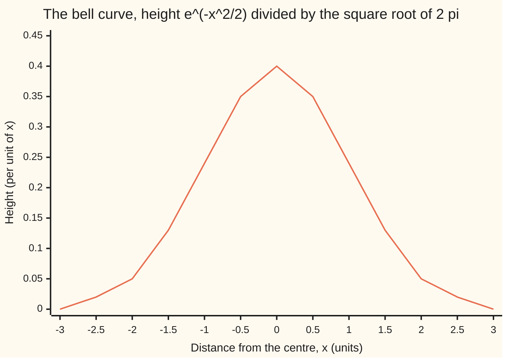
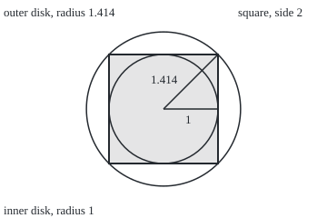

# The Gaussian integral: the integral of e to the minus x squared is root pi

[Syllabus](../../../SYLLABUS.md) → [Calculus and analysis](../README.md) → [Multiple Integrals](../README.md#s08) → The Gaussian integral

---

## General Overview

The bell curve of statistics is drawn with a height of 0.398942 at its centre. It falls to 0.24 one unit out and 0.05 two units out. That odd peak height makes the total area under the curve exactly 1, so areas under the bell read as shares of a whole: a share 0.682689 lies within one unit of the centre, 0.954500 within two, 0.997300 within three.

Why that height? The curve is a scaled copy of e to the minus x squared, running out to infinity both ways. No formula built from powers, roots, logs, exponentials and trig functions has this curve as its rate (a theorem of Liouville, not proved here), so the route through an antiderivative (a function whose rate is the curve) is closed.

The way round, credited to Poisson, is to square the unknown area. The square is a total over the plane with circular symmetry, and polar coordinates finish it. Out comes π; the area is its square root.

**The area under e to the minus x squared, over the whole line, is the square root of π; so the bell curve with peak height one over the square root of 2π has area exactly 1.**

**What kind of fact this is:** a theorem, proved on this card in Why it works, with the tolerance argument in a folded Detailed proof.

### The picture: the bell whose area is 1



The one line is the bell's height, to two decimals, at half-unit steps. From three units out it rounds to 0.00, but it never reaches zero.

---

## The formula

Reminders. An improper integral is the limit of integrals as a cutoff heads for infinity ([Improper integrals](../04-Integrals/07-improper-integrals.md)). In polar coordinates a small patch has area r dr dθ, the r being the Jacobian factor ([Change of variables](03-change-of-variables-and-jacobians.md)).

$$I \;=\; \int_{-\infty}^{\infty} e^{-x^2}\,dx \;=\; \sqrt{\pi} \;=\; 1.772453850906\ldots$$

**Read it aloud:** the area under e to the minus x squared, from far left to far right, is the square root of π.

For any positive number $a$,

$$\int_{-\infty}^{\infty} e^{-a x^2}\,dx = \sqrt{\pi / a}, \qquad \text{so with } a = \tfrac12:\quad \int_{-\infty}^{\infty} e^{-x^2/2}\,dx = \sqrt{2\pi} = 2.506628.$$

Dividing by that total gives the bell of the chart:

$$\varphi(x) = \frac{1}{\sqrt{2\pi}}\, e^{-x^2/2}, \qquad \int_{-\infty}^{\infty} \varphi(x)\,dx = 1.$$

| Symbol | Plain meaning | In our example | Push it up and the answer… |
| --- | --- | --- | --- |
| $x$, $y$ | position along the line; a second, independent copy of it | −3 to 3 on the chart | the height falls fast |
| $e$ | the base of natural exponentials, built by series in wing 01 | e^(−1) at x = 1 | — |
| $\pi$ | the circle constant; the check builds it from a series | 3.141592653590 | — |
| $I$ | the whole area under e^(−x^2) | 1.772454 | — |
| $R$, $s$, $I_R$ | a cutoff; a disk's radius; the area from −R to R | R = 2 gives 1.764163 | I_R climbs to I |
| $r$, $\theta$ | polar address: distance from the origin, angle in radians | disk of radius 1 | wider rings, more area |
| $a$ | the squeeze factor on the exponent | 1, then 1/2 for the bell | narrower curve, area √(π/a) |
| $\varphi$ | the bell: e^(−x^2/2) scaled to area 1 | peak 0.398942 | — |

### When it holds

- **A positive squeeze factor.** With $a = 0$ the curve is flat at 1 and the strip from −10 to 10 already holds 20.000000; no finite total exists.
- **Both tails converge on their own.** The whole-line area is the left tail plus the right tail, each a limit; here the tail beyond a cutoff R on either side is below e^(−R^2)/(2R).
- **Angles in radians.** The polar patch r dr dθ is exact only in radians; in degrees the π would not appear.
- **The positive root.** I^2 = π has two roots; a positive curve takes the positive one.

---

## Why it works

### Step 0: square the area, and the plane has circular symmetry

Multiply e^(−x^2) by e^(−y^2) and the exponents add: e^(−(x^2 + y^2)). That depends only on distance from the origin, since x^2 + y^2 is the distance squared. In polar coordinates the patch factor r is exactly what this integrand needs to have an antiderivative. The one-dimensional problem has none; the two-dimensional one is easy.

### Step 1: the whole-line area exists

Past a cutoff R, x/R is at least 1, so slipping it in can only raise the area:

$$\int_R^{\infty} e^{-x^2}\,dx \;\le\; \frac{1}{R}\int_R^{\infty} x\,e^{-x^2}\,dx \;=\; \frac{e^{-R^2}}{2R}.$$

The x buys the antiderivative −e^(−x^2)/2. Both tails together are at most e^(−R^2)/R. The tolerance game, with numbers: to land within 0.01 of the whole area, R = 2 suffices, bound 0.009158, actual tails 0.008291. Within 0.0001 needs R = 3: bound 0.000041, actual 0.000039. So I_R heads for a limit I as R heads for infinity.

### Step 2: square a finite piece

On the square from −R to R both ways, I_R times itself is a double integral, because the integrand splits into an x part times a y part ([Double integrals](01-double-integrals.md)):

$$I_R^{\,2} = \int_{-R}^{R} e^{-x^2}\,dx \int_{-R}^{R} e^{-y^2}\,dy = \iint_{\text{square}} e^{-(x^2+y^2)}\,dx\,dy.$$

Nothing infinite has happened yet. At R = 1, I_R is 1.493648 and its square 2.230985.

### Step 3: the same integrand over a disk, in polar coordinates

Over a disk of radius s centred at the origin, write x^2 + y^2 = r^2 and a patch as r dr dθ:

$$\int_0^{2\pi}\!\!\int_0^{s} e^{-r^2}\, r\,dr\,d\theta \;=\; 2\pi\Big[-\tfrac12 e^{-r^2}\Big]_0^{s} \;=\; \pi\big(1 - e^{-s^2}\big).$$

The factor r is the whole trick: r e^(−r^2) is the rate of −e^(−r^2)/2. At s = 1 the disk holds 1.985865. A 1000 by 1000 grid of small squares inside that disk, with no polar coordinates, gives 1.985950.

### Step 4: trap the square between two disks

<p align="center"></p>

Scale: 60 px per unit, origin at (180, 120), R = 1.

The disk of radius R fits inside the square. Every corner of the square is at distance R√2 from the centre, so the square fits inside the disk of radius R√2. The integrand is positive, so a bigger region holds more:

$$\pi\big(1 - e^{-R^2}\big) \;\le\; I_R^{\,2} \;\le\; \pi\big(1 - e^{-2R^2}\big).$$

At R = 1: 1.985865 ≤ 2.230985 ≤ 2.716424. At R = 2: 3.084052 ≤ 3.112270 ≤ 3.140539. At R = 3: 3.141205 ≤ 3.141454 ≤ 3.141593. Both walls close on π, because e^(−R^2) heads for 0.

### Step 5: take the limit, then the root

By Step 1, I_R heads for I, so I_R^2 heads for I^2. By Step 4, I_R^2 heads for π. One sequence has one limit, so I^2 = π, and since the curve is positive, I = √π.

<details>
<summary>Detailed proof</summary>

Let $f(x) = e^{-x^2}$, continuous and positive.

Convergence. For $T > R > 0$ the integral of f from R to T is below $e^{-R^2}/(2R)$ and grows with T, so it has a limit (the real numbers have no gaps). With the mirror tail, $I = \lim I_R$ exists and $0 \le I - I_R \le e^{-R^2}/R$.

Regions. On the closed square $Q_R = [-R, R]^2$, iterated integration gives $I_R^2 = \iint_{Q_R} e^{-(x^2+y^2)}\,dA$. On the closed disk $B_s = \{x^2 + y^2 \le s^2\}$ the polar map fails to be one-to-one only on the origin and one ray, sets of zero area, so change of variables gives $\pi(1 - e^{-s^2})$.

Squeeze. $B_R \subset Q_R \subset B_{R\sqrt2}$ and the integrand is positive, so $\pi(1 - e^{-R^2}) \le I_R^2 \le \pi(1 - e^{-2R^2})$. Given $\varepsilon > 0$, choose a cutoff with $\pi e^{-R_0^2} < \varepsilon$; then for every $R > R_0$ both walls lie within $\varepsilon$ of $\pi$, so $|I_R^2 - \pi| < \varepsilon$. Also $I_R^2 \to I^2$, since squaring is continuous. Limits are unique, so $I^2 = \pi$, and $I > 0$ gives $I = \sqrt\pi$. Every double integral was over a bounded region.

</details>

### Step 6: from √π to the bell's area of 1

Substitute x = √2 u, so dx = √2 du, on each cutoff and let R head for infinity: the area under e^(−x^2/2) is √2 times √π, which is √(2π) = 2.506628. In general x = u/√a gives √(π/a). Divide the curve by √(2π) and its area is 1: the bell, peak height 0.398942.

A second road avoids the plane: attach a parameter to the integrand and differentiate under the integral sign ([Differentiating under the integral](05-differentiating-under-the-integral.md)).

---

## Worked numbers, by hand

| Step | Arithmetic | Value |
| --- | --- | --- |
| area from −1 to 1 | Simpson's rule (parabolas through triples of points), in the code | 1.493648 |
| its square | the unrounded area, squared | 2.230985 |
| inner disk, R = 1 | π(1 − e^(−1)) | 1.985865 |
| outer disk, R = 1 | π(1 − e^(−2)) | 2.716424 |
| walls at R = 3 | π(1 − e^(−9)) and π(1 − e^(−18)) | 3.141205 and 3.141593 |
| the whole area | √π | **1.772453850906** |
| stretched by √2 | √2 × √π = √(2π) | 2.506628 |
| bell's peak | 1 / 2.506628 | 0.398942 |
| bell's area | 2.506628 / 2.506628 | **1.000000000** |

The peak 0.398942 is the one height that makes the bell's total exactly 1.

### What breaks if you drop a piece

| Mistake | Comes out at | What went wrong |
| --- | --- | --- |
| Drop the r in polar, disk R = 1 | 4.692434, not 1.985865 | Polar patches far out were counted as small as near ones |
| Put 1/√π in front of e^(−x^2/2) | area 1.414214, not 1 | The √2 from stretching was lost |
| Drop a > 0: take a = 0 | the strip from −10 to 10 holds 20.000000 | A flat curve has no finite area |
| Treat the square as the disk at R = 1 | 1.985865 for 2.230985 | They are different regions; only the limit agrees |

The code prints all four.

---

## Code, from first principles, and it actually runs

Two roads meet at √π. Road one adds up e^(−x^2) from −6 to 6 by Simpson's rule (parabolas through triples of points); the tails beyond are far below the printed digits. Road two builds π from Machin's series, π = 16 arctan(1/5) − 4 arctan(1/239), by its own partial sums, and takes the root. A grid sum checks the polar step without polar coordinates, and the bell's area is summed directly.

### Python

```python
# The Gaussian integral -- the check behind the card.  Standard library only;
# math supplies exp and sqrt as primitives, never pi.  Road one integrates
# e^(-x^2) by Simpson's rule; road two builds pi from Machin's arctan series
# and takes its root.  A grid over the disk checks the polar step without polar.
from math import exp, sqrt

def simpson(f, a, b, n=1200):             # n even: weights 1, 4, 2, 4, ..., 4, 1
    h = (b - a) / n
    s = f(a) + f(b) + sum((4 if k % 2 else 2) * f(a + k * h) for k in range(1, n))
    return s * h / 3

def arctan_inv(x):                        # arctan(1/x) from its own partial sums
    return sum((-1) ** k / ((2 * k + 1) * x ** (2 * k + 1)) for k in range(30))

def disk_by_grid(R, n=1000):              # squares whose centres lie in the disk
    h, tot = 2 * R / n, 0.0
    for i in range(n):
        x = -R + (i + 0.5) * h
        for j in range(n):
            y = -R + (j + 0.5) * h
            if x * x + y * y <= R * R:
                tot += exp(-x * x - y * y)
    return tot * h * h

g = lambda x: exp(-x * x)
PI = 16 * arctan_inv(5) - 4 * arctan_inv(239)
I = simpson(g, -6, 6)
print(f"pi by Machin's series: {PI:.12f}")
print(f"road 1, Simpson on [-6, 6], 1200 strips: I = {I:.12f}")
print(f"road 2, square root of the series pi:     {sqrt(PI):.12f}")
squeeze = []
for R in (1, 2, 3):
    lo, sq, hi = PI * (1 - exp(-R * R)), simpson(g, -R, R) ** 2, PI * (1 - exp(-2 * R * R))
    squeeze.append((lo, sq, hi))
    print(f"squeeze R = {R}: I_R = {sqrt(sq):.6f}; disk {lo:.6f} <= square {sq:.6f} <= disk {hi:.6f}")
for R in (2, 3):
    print(f"tails beyond R = {R}: actual {I - simpson(g, -R, R):.6f}, bound e^(-R^2)/R {exp(-R * R) / R:.6f}")
grid = disk_by_grid(1)
print(f"disk R = 1 by a 1000 x 1000 grid, no polar: {grid:.6f}; polar formula {PI * (1 - exp(-1)):.6f}")
root2pi = sqrt(2 * PI)
bell = lambda x: exp(-x * x / 2) / root2pi
print(f"bell: sqrt(2 pi) = {root2pi:.6f}; peak height 1/sqrt(2 pi) = {1 / root2pi:.6f}")
area = simpson(bell, -8, 8)
print(f"bell area by Simpson on [-8, 8]: {area:.9f}")
print("bell area within 1, 2, 3 of the centre: " + ", ".join(f"{simpson(bell, -k, k):.6f}" for k in (1, 2, 3)))
print("chart, bell height at x = -3, -2.5, ..., 3: " + ", ".join(f"{bell(k / 2):.2f}" for k in range(-6, 7)))
print(f"figure, centre (180, 120); 60 per unit; square 120 to 240; inner radius 60.00; outer radius {60 * sqrt(2):.2f} = 60 x {sqrt(2):.3f}")
print(f"mistake, drop r in the polar disk R = 1: {2 * PI * simpson(g, 0, 1):.6f}")
print(f"mistake, 1/sqrt(pi) in front of e^(-x^2/2): area {simpson(lambda x: exp(-x * x / 2), -8, 8) / sqrt(PI):.6f}")
print(f"mistake, a = 0: the strip [-10, 10] holds {simpson(lambda x: exp(0 * x * x), -10, 10):.6f}")
assert abs(I - sqrt(PI)) < 1e-10                       # two roads to root pi
assert all(lo <= sq <= hi for lo, sq, hi in squeeze)   # square trapped between disks
assert abs(grid - PI * (1 - exp(-1))) < 1e-3           # polar factor r, checked on a grid
assert abs(area - 1) < 1e-10                           # the bell's area is 1
print("ALL CHECKS PASS")
```

**Ran 2026-09-27 on macOS, Python 3.14.6, standard library only. All checks passed. Output, pasted from the run:**

```
pi by Machin's series: 3.141592653590
road 1, Simpson on [-6, 6], 1200 strips: I = 1.772453850906
road 2, square root of the series pi:     1.772453850906
squeeze R = 1: I_R = 1.493648; disk 1.985865 <= square 2.230985 <= disk 2.716424
squeeze R = 2: I_R = 1.764163; disk 3.084052 <= square 3.112270 <= disk 3.140539
squeeze R = 3: I_R = 1.772415; disk 3.141205 <= square 3.141454 <= disk 3.141593
tails beyond R = 2: actual 0.008291, bound e^(-R^2)/R 0.009158
tails beyond R = 3: actual 0.000039, bound e^(-R^2)/R 0.000041
disk R = 1 by a 1000 x 1000 grid, no polar: 1.985950; polar formula 1.985865
bell: sqrt(2 pi) = 2.506628; peak height 1/sqrt(2 pi) = 0.398942
bell area by Simpson on [-8, 8]: 1.000000000
bell area within 1, 2, 3 of the centre: 0.682689, 0.954500, 0.997300
chart, bell height at x = -3, -2.5, ..., 3: 0.00, 0.02, 0.05, 0.13, 0.24, 0.35, 0.40, 0.35, 0.24, 0.13, 0.05, 0.02, 0.00
figure, centre (180, 120); 60 per unit; square 120 to 240; inner radius 60.00; outer radius 84.85 = 60 x 1.414
mistake, drop r in the polar disk R = 1: 4.692434
mistake, 1/sqrt(pi) in front of e^(-x^2/2): area 1.414214
mistake, a = 0: the strip [-10, 10] holds 20.000000
ALL CHECKS PASS
```

### Rust

Same numbers, same labels, built with `rustc --edition 2021 -O`.

```rust
// The Gaussian integral -- the same check as the Python, in Rust.  No crates;
// exp and sqrt are primitives, never the constant pi.  Road one integrates
// e^(-x^2) by Simpson's rule; road two builds pi from Machin's arctan series
// and takes its root.  A grid over the disk checks the polar step without polar.
fn simpson(f: &dyn Fn(f64) -> f64, a: f64, b: f64) -> f64 {
    let n = 1200;                                  // even: weights 1, 4, 2, 4, ..., 4, 1
    let h = (b - a) / n as f64;
    let mut s = f(a) + f(b);
    for k in 1..n { s += if k % 2 == 1 { 4.0 } else { 2.0 } * f(a + k as f64 * h) }
    s * h / 3.0
}

fn arctan_inv(x: f64) -> f64 {                     // arctan(1/x) from its own partial sums
    (0..30).map(|k| (-1f64).powi(k) / ((2 * k + 1) as f64 * x.powi(2 * k + 1))).sum()
}

fn disk_by_grid(r: f64, n: usize) -> f64 {         // squares whose centres lie in the disk
    let h = 2.0 * r / n as f64;
    let mut tot = 0.0;
    for i in 0..n {
        let x = -r + (i as f64 + 0.5) * h;
        for j in 0..n {
            let y = -r + (j as f64 + 0.5) * h;
            if x * x + y * y <= r * r { tot += (-x * x - y * y).exp() }
        }
    }
    tot * h * h
}

fn main() {
    let g = |x: f64| (-x * x).exp();
    let pi = 16.0 * arctan_inv(5.0) - 4.0 * arctan_inv(239.0);
    let i_all = simpson(&g, -6.0, 6.0);
    println!("pi by Machin's series: {:.12}", pi);
    println!("road 1, Simpson on [-6, 6], 1200 strips: I = {:.12}", i_all);
    println!("road 2, square root of the series pi:     {:.12}", pi.sqrt());
    let mut squeeze = Vec::new();
    for r in [1.0f64, 2.0, 3.0] {
        let (lo, sq, hi) = (pi * (1.0 - (-r * r).exp()), simpson(&g, -r, r).powi(2), pi * (1.0 - (-2.0 * r * r).exp()));
        squeeze.push((lo, sq, hi));
        println!("squeeze R = {}: I_R = {:.6}; disk {:.6} <= square {:.6} <= disk {:.6}", r, sq.sqrt(), lo, sq, hi);
    }
    for r in [2.0f64, 3.0] {
        println!("tails beyond R = {}: actual {:.6}, bound e^(-R^2)/R {:.6}", r, i_all - simpson(&g, -r, r), (-r * r).exp() / r);
    }
    let grid = disk_by_grid(1.0, 1000);
    println!("disk R = 1 by a 1000 x 1000 grid, no polar: {:.6}; polar formula {:.6}", grid, pi * (1.0 - (-1.0f64).exp()));
    let root2pi = (2.0 * pi).sqrt();
    let bell = |x: f64| (-x * x / 2.0).exp() / root2pi;
    println!("bell: sqrt(2 pi) = {:.6}; peak height 1/sqrt(2 pi) = {:.6}", root2pi, 1.0 / root2pi);
    let area = simpson(&bell, -8.0, 8.0);
    println!("bell area by Simpson on [-8, 8]: {:.9}", area);
    let within: Vec<String> = [1.0, 2.0, 3.0].iter().map(|&k| format!("{:.6}", simpson(&bell, -k, k))).collect();
    println!("bell area within 1, 2, 3 of the centre: {}", within.join(", "));
    let heights: Vec<String> = (-6..7).map(|k| format!("{:.2}", bell(k as f64 / 2.0))).collect();
    println!("chart, bell height at x = -3, -2.5, ..., 3: {}", heights.join(", "));
    println!("figure, centre (180, 120); 60 per unit; square 120 to 240; inner radius 60.00; outer radius {:.2} = 60 x {:.3}", 60.0 * 2f64.sqrt(), 2f64.sqrt());
    println!("mistake, drop r in the polar disk R = 1: {:.6}", 2.0 * pi * simpson(&g, 0.0, 1.0));
    println!("mistake, 1/sqrt(pi) in front of e^(-x^2/2): area {:.6}", simpson(&|x: f64| (-x * x / 2.0).exp(), -8.0, 8.0) / pi.sqrt());
    println!("mistake, a = 0: the strip [-10, 10] holds {:.6}", simpson(&|x: f64| (0.0 * x * x).exp(), -10.0, 10.0));
    assert!((i_all - pi.sqrt()).abs() < 1e-10);                        // two roads to root pi
    assert!(squeeze.iter().all(|&(lo, sq, hi)| lo <= sq && sq <= hi)); // square trapped between disks
    assert!((grid - pi * (1.0 - (-1.0f64).exp())).abs() < 1e-3);        // polar factor r, on a grid
    assert!((area - 1.0).abs() < 1e-10);                               // the bell's area is 1
    println!("ALL CHECKS PASS");
}
```

**Ran 2026-09-27 on macOS, rustc 1.98.1, no crates. All checks passed. Output, pasted from the run:**

```
pi by Machin's series: 3.141592653590
road 1, Simpson on [-6, 6], 1200 strips: I = 1.772453850906
road 2, square root of the series pi:     1.772453850906
squeeze R = 1: I_R = 1.493648; disk 1.985865 <= square 2.230985 <= disk 2.716424
squeeze R = 2: I_R = 1.764163; disk 3.084052 <= square 3.112270 <= disk 3.140539
squeeze R = 3: I_R = 1.772415; disk 3.141205 <= square 3.141454 <= disk 3.141593
tails beyond R = 2: actual 0.008291, bound e^(-R^2)/R 0.009158
tails beyond R = 3: actual 0.000039, bound e^(-R^2)/R 0.000041
disk R = 1 by a 1000 x 1000 grid, no polar: 1.985950; polar formula 1.985865
bell: sqrt(2 pi) = 2.506628; peak height 1/sqrt(2 pi) = 0.398942
bell area by Simpson on [-8, 8]: 1.000000000
bell area within 1, 2, 3 of the centre: 0.682689, 0.954500, 0.997300
chart, bell height at x = -3, -2.5, ..., 3: 0.00, 0.02, 0.05, 0.13, 0.24, 0.35, 0.40, 0.35, 0.24, 0.13, 0.05, 0.02, 0.00
figure, centre (180, 120); 60 per unit; square 120 to 240; inner radius 60.00; outer radius 84.85 = 60 x 1.414
mistake, drop r in the polar disk R = 1: 4.692434
mistake, 1/sqrt(pi) in front of e^(-x^2/2): area 1.414214
mistake, a = 0: the strip [-10, 10] holds 20.000000
ALL CHECKS PASS
```

The two outputs match line for line.

> [!TIP]
> **Try changing**
> Guess first, then run it.
> - **Stop early.** In road one, change `simpson(g, -6, 6)` to `simpson(g, -2, 2)`. Guess: I falls by the two tails, 0.008291, and the first assert stops the run.
> - **Wrong region.** In the grid, change `x * x + y * y <= R * R` to `abs(x) + abs(y) <= R`, a diamond inside the disk. Guess: the grid total falls well below 1.985865 and the third assert stops it.
> - **Squeeze harder.** In the bell, replace `exp(-x * x / 2)` by `exp(-x * x)`. Guess: the area becomes √π divided by √(2π), which is 1/√2, and the last assert fails.

---

## The usual mistake

> [!warning]
> **Treating the integral over the square as the integral over the disk.** They are different regions: at R = 1 the square holds 2.230985 and the disk 1.985865. The proof never equates them; it traps the square between two disks whose walls close on π.
>
> - **A cutoff called exact.** At R = 2 the area is 1.764163, short of √π by the tails, 0.008291.
> - **Forgetting the r.** The unit disk then gives 4.692434, and no antiderivative is left to finish with.

---

## Where you meet it in real life

- **Statistics.** The normal distribution's constant 1/√(2π) is this card's result; see [Normal](../../09-Probability%20and%20statistics/04-Continuous%20Distributions/04-normal-distribution.md).
- **Heat spreading in a rod.** A point of heat spreads as a Gaussian whose total stays fixed, the subject of [The heat kernel](../../08-Differential%20equations%20and%20dynamics/10-The%20Classical%20PDEs/10-the-heat-kernel.md).
- **Option prices.** The Black-Scholes formula is a Gaussian integral over future prices, in [Black-Scholes by expectation](../../12-Financial%20mathematics/05-Black-Scholes%20from%20the%20Ground%20Up/04-black-scholes-by-risk-neutral-expectation.md).

> **Say it back**
> No antiderivative finds the area under e to the minus x squared. Its square is a total over the plane that depends only on distance from the centre. Over a disk, polar coordinates bring a factor r and the total π(1 − e^(−s^2)). A square is trapped between two disks, so its total is squeezed to π, and the area is √π. Stretching by √2 gives √(2π); dividing by it gives the bell area 1.

---

## What this builds on

- [Change of variables](03-change-of-variables-and-jacobians.md): the polar patch r dr dθ, on bounded disks.
- [Improper integrals](../04-Integrals/07-improper-integrals.md): the whole-line area as a limit of cutoffs, and comparison for the tails.

## Where this goes next

- [The heat kernel](../../08-Differential%20equations%20and%20dynamics/10-The%20Classical%20PDEs/10-the-heat-kernel.md): a Gaussian that widens with time and keeps its area.
- [Normal](../../09-Probability%20and%20statistics/04-Continuous%20Distributions/04-normal-distribution.md): the bell read as probabilities, with a centre and a width.
- [Black-Scholes by expectation](../../12-Financial%20mathematics/05-Black-Scholes%20from%20the%20Ground%20Up/04-black-scholes-by-risk-neutral-expectation.md): an option price as a Gaussian integral.
- Weighted Gauss rules: integrating against e^(−x^2) with a few well-placed points.
- Similarity solutions: the area up to a point, not the whole line.
- Two pairs worth memorising: the Gaussian as its own frequency picture.

---

## Sources

Verified 2026-09-27: every link below resolves to the publisher's page.

- Conrad, Keith. "The Gaussian Integral." University of Connecticut. [PDF](https://kconrad.math.uconn.edu/blurbs/analysis/gaussianintegral.pdf). Several proofs; the first is the polar one, credited to Poisson, and a closing section gives the history.
- Apostol, Tom M. *Calculus*, Volume 2, 2nd ed. Wiley. [Publisher page](https://www.wiley.com/en-us/Calculus%2C+Volume+2%3A+Multi-Variable+Calculus+and+Linear+Algebra+with+Applications+to+Differential+Equations+and+Probability%2C+2nd+Edition-p-9780471000075). Double integrals and the change to polar coordinates used in Steps 2 to 4.
- Apostol, Tom M. *Calculus*, Volume 1, 2nd ed. Wiley. [Publisher page](https://www.wiley.com/en-us/Calculus%2C+Volume+1%3A+One-Variable+Calculus%2C+with+an+Introduction+to+Linear+Algebra%2C+2nd+Edition-p-9780471000051). Improper integrals and the comparison test of Step 1.
