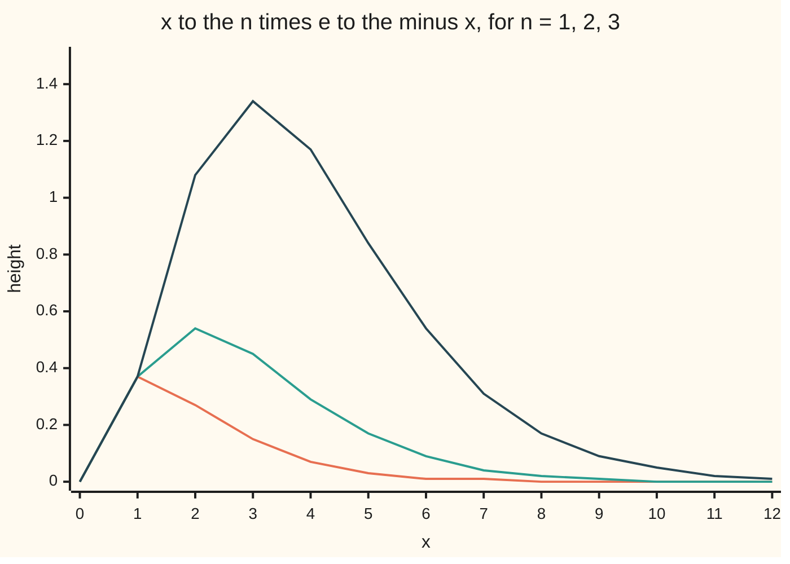

# Differentiating under the integral: when the derivative can go inside

[Syllabus](../../../SYLLABUS.md) → [Calculus and analysis](../README.md) → [Multiple Integrals](../README.md#s08) → Differentiating under the integral

---

## General Overview

Take the curve x^3 e^(-x) for x from 0 outwards. It starts at 0, climbs to 1.34 at x = 3, then dies away as the exponential beats the cube. The whole area under it, out to infinity, is exactly 6. With a fourth power it is 24. The areas are factorials: 3! = 6, 4! = 24.

Integration by parts reaches 6 in three rounds. A shorter road: put a dial t in the exponent, e^(-tx). The area under that is 1/t. Turn the dial and each height changes at its own rate; the total changes at the sum of those rates. Differentiate 1/t three times, flip the sign, and out comes the area under x^3 e^(-tx) for every t at once. Richard Feynman used the trick again and again.

The trick swaps derivative and integral. Swaps can fail; below is a proof of when this one is safe, plus the terms for moving ends.

**If a function and its rate in the parameter are continuous on a closed rectangle, the derivative of its integral over a fixed interval is the integral of that rate; if the ends move, the right end adds its height times its speed and the left end subtracts it.**

**What kind of fact this is:** a theorem, proved on this card in Why it works, with the tolerance details in a folded Detailed proof.

### The picture: three curves whose areas are 1, 2 and 6



Orange: n = 1, area 1. Teal: n = 2, area 2. Dark blue: n = 3, area 6. Each extra power of x pushes the hump right and multiplies the area by the new power.

---

## The formula

Reminder: the curly d marks a partial derivative, the rate in one input with the others held still ([Partial derivatives](../07-Several%20Variables/01-partial-derivatives.md)).

The integrand has two inputs: the dial $t$, called the **parameter** from here on, and the position $x$ along the base. The total over x depends on the parameter alone: $F(t)$.

**Fixed ends.**

$$F(t)=\int_a^b f(t,x)\,dx \quad\Longrightarrow\quad F'(t)=\int_a^b \frac{\partial f}{\partial t}(t,x)\,dx$$

**Read it aloud:** the rate of the total per unit of the parameter is the total of the rates.

**Moving ends.** If the ends are themselves functions of the parameter, $a(t)$ and $b(t)$:

$$\frac{d}{dt}\int_{a(t)}^{b(t)} f(t,x)\,dx=\int_{a(t)}^{b(t)} \frac{\partial f}{\partial t}(t,x)\,dx+f\big(t,b(t)\big)\,b'(t)-f\big(t,a(t)\big)\,a'(t)$$

**Read it aloud:** the heights inside change, the right end sweeps in area at its height times its speed, and the left end sweeps area out the same way.

The second is the **Leibniz integral rule**. On the example, the total of x^n e^(-tx) from 0 to infinity is n!/t^(n+1).

| Symbol | Plain meaning | In our example | Push it up and the answer… |
| --- | --- | --- | --- |
| $t$ | the parameter: a dial inside the integrand | the decay rate, 1 or 2 | the area shrinks, like 1/t^(n+1) |
| $x$ | the position the integral runs over | 0 to infinity; 0 to 10 when cut | — |
| $n$, $n!$ | the power of x; 1 × 2 × ⋯ × n | n = 3, 3! = 6 | the area grows by the factor n + 1 at t = 1 |
| $f$ | the integrand, a height depending on t and x | x^3 e^(-tx) | — |
| $F$, $J$ | the total as a function of t; the total with a moving end | F(1) = 6; J(1) = 0.264241 | — |
| $a$, $b$ | the ends of the interval, fixed or moving | 0 and 10; b(t) = 1/t | a later right end adds area |
| $a'$, $b'$ | the ends' speeds per unit of t | b'(1) = -1 | a faster right end adds more |
| $h$ | a small step in t, for a difference quotient | 0.1, 0.01, 0.001 | a larger quotient error |

F'(t) is in the total's units per unit of t; here both are bare numbers.

### When it holds

- **Continuity on a closed rectangle.** f and its t-rate continuous for t in a closed interval (here 1/2 to 2) and x from a to b. Drop it and the swap can fail: x t^3/(x^2 + t^2)^2 on 0 to 1 has a total with slope 1/2 at t = 0, while every x-slope there is 0.
- **A bounded x-range.** An infinite range needs a tail shrinking for every t at once. At t = 0 the area under e^(-tx) is infinite, and 1/t blows up.
- **Ends with speeds.** a(t) and b(t) need derivatives, and f must be continuous where the ends sit.

---

## Why it works

### Step 0: the derivative of the total is a limit of totals of quotients

The total's difference quotient over a step h is a total of quotients, one per x:

$$\frac{F(t+h)-F(t)}{h}=\int_a^b \frac{f(t+h,x)-f(t,x)}{h}\,dx$$

Each quotient inside heads for the t-rate at its x. The limit passes through the integral when the quotients close in **uniformly**: one worst gap for every x, shrinking to 0 ([Swapping limits](../06-Series/08-swapping-limits-with-integrals-and-derivatives.md)).

### Step 1: one step size works for every x

Play the tolerance game on e^(-tx), cut at b = 10, for t from 1/2 to 2. The t-rate is -x e^(-tx). Its own t-rate, x^2 e^(-tx), is at most x^2 e^(-x/2), and that never exceeds 2.165 on the base.

The mean value theorem makes each x's quotient equal to the t-rate somewhere between t and t + h. That rate moves at most 2.165 per unit of t, so the quotient misses it by at most 2.165 × h, **at every x at once**. Over a base 10 wide the total misses by at most 10 × 2.165 × h. To land within 0.001, a step of 0.0000462 is enough. That is a worst case: at h = 0.001 the guarantee is 0.022 and the real miss 0.000996.

### Step 2: in general, continuity does the same job

Without a formula for the second rate, continuity of the t-rate on a closed rectangle still gives one step size for all x, and the fixed-end formula follows.

<details>
<summary>Detailed proof: the fixed-end theorem</summary>

Let f and its t-rate f_t be continuous for t from p to q and x from a to b, with t strictly between p and q and t + h kept in that range. A continuous function on a closed, bounded rectangle is uniformly continuous, a compactness fact: for every ε > 0 there is δ > 0 with |f_t(s, x) - f_t(t, x)| < ε for all x in [a, b] whenever |s - t| < δ.

For 0 < |h| < δ and each x, the mean value theorem gives a ξ between t and t + h with (f(t + h, x) - f(t, x))/h = f_t(ξ, x). Since |ξ - t| < δ, the quotient is within ε of f_t(t, x), for every x. Integrating,

$$\left|\frac{F(t+h)-F(t)}{h}-\int_a^b f_t(t,x)\,dx\right|\le (b-a)\,\varepsilon .$$

ε was arbitrary, so F'(t) exists and equals the integral of f_t.

</details>

### Step 3: moving ends add two strips

Freeze the ends and the total changes at the integral of rates. Let the right end move from b to b + b'h: it sweeps a strip b'h wide and about f(t, b) tall, so adds area at rate f(t, b) b'. The left end does the same with the opposite sign.

As algebra: let G(t, u, v) be the integral of f(t, x) from u to v. Its partial rates are the integral of the t-rate (Step 2), f(t, v) and -f(t, u) (the fundamental theorem of calculus). All are continuous, so the chain rule for G(t, a(t), b(t)) gives the Leibniz rule term by term ([Chain rule in several variables](../07-Several%20Variables/04-multivariable-chain-rule-and-jacobians.md)).

**The example.** Cut the curve x e^(-tx) at one decay length, b(t) = 1/t, where e^(-tx) has fallen to 1/e. Call the total $J$. At t = 1:

- inside: the integral of -x^2 e^(-x) from 0 to 1, -0.160603;
- right end: height e^(-1) times speed b'(1) = -1, giving -0.367879;
- left end: fixed, 0.

Sum: -0.528482. The substitution u = tx turns J into (1 - 2/e)/t^2, whose slope at t = 1 is -2 + 4/e = -0.528482.

### Step 4: the hard integral

Cut the range at b. For t from 1/2 to 2, e^(-tx) and all its t-rates are continuous, so Step 2 applies n times:

$$\frac{d^n}{dt^n}\int_0^b e^{-tx}\,dx=(-1)^n\int_0^b x^n e^{-tx}\,dx$$

Let b run through 1, 2, 3, …. The left totals head for 1/t. The right side's tails shrink for every t at once: for t at least 1/2 the n = 3 tail beyond b = 60 is at most 0.000000045. So the swapping card's derivative theorem passes the limit through each derivative:

$$\int_0^\infty x^n e^{-tx}\,dx=(-1)^n\frac{d^n}{dt^n}\,\frac1t=\frac{n!}{t^{n+1}}$$

The last step is the power rule n times, each step bringing down the next whole number. At t = 1 the area is n!.

**A second road, with no parameter.** The function 6(1 - e^(-b)(1 + b + b^2/2 + b^3/6)) is 0 at b = 0, and its slope in b is b^3 e^(-b): the product rule cancels all but the last term. By the fundamental theorem of calculus it is the area under x^3 e^(-x) from 0 to b: 5.937984 at b = 10. The tail, 0.062016, shrinks to 0 because e^(-b) beats every power of b.

---

## Worked numbers, by hand

| Step | Arithmetic | Value |
| --- | --- | --- |
| easy total | antiderivative -e^(-tx)/t, from 0 on | area under e^(-tx) is 1/t |
| differentiate once | inside -x e^(-tx); outside -1/t^2 | area under x e^(-tx) is 1/t^2 |
| twice | -1/t^2 becomes 2/t^3 | area under x^2 e^(-tx) is 2/t^3 |
| three times | 2/t^3 becomes -6/t^4 | area under x^3 e^(-tx) is 6/t^4 |
| t = 1 | 6/1 | **6** |
| t = 2 | 6/16 | **0.375** |

Doubling the decay rate cuts the area sixteenfold: each of the four factors of 1/t halves it.

### What breaks if you drop a piece

| Mistake | Comes out at | What went wrong |
| --- | --- | --- |
| Moving cutoff, endpoint term dropped | -0.160603, not -0.528482 | The right end sweeps area out as it moves in |
| Endpoint term with the wrong sign | 0.207277 | A right end moving left removes area |
| Answer at t = 1 used for t = 2 | 6, not 0.375 | The 1/t^4 was dropped |
| Rate not continuous: x t^3/(x^2 + t^2)^2 | total's slope 0.499950 near t = 0; integral of slopes 0 | Quotient 25.0 at x = t = 0.01, growing as 1/(4t): no step fits every x |

The code prints all four.

---

## Code, from first principles, and it actually runs

Every integral is the script's own Simpson sum: parabolas through equally spaced points. The hard integral comes by two roads: direct integration out to 60, and n!/t^(n+1). Shrinking difference quotients stay inside the tolerance game's guarantee; the cut area meets its endpoint-built formula, the moving cutoff its closed form.

### Python

```python
# Differentiating under the integral -- the check behind the card.  Only exp
# and e come from the standard library; every integral is the card's own
# Simpson sum.  Road one integrates x^n e^(-tx) directly; road two differentiates
# the easy total 1/t n times.  Then the bounded rule, a moving cutoff, a failure.
from math import exp, e as E                   # primitives only; every integral is ours
def simpson(g, a, b, m=6000):                  # parabolas through equal steps
    w = (b - a) / m
    return w / 3 * sum((1 if i in (0, m) else 4 if i % 2 else 2) * g(a + i * w) for i in range(m + 1))
def area(n, t, b=60.0): return simpson(lambda x: x ** n * exp(-t * x), 0, b)
def by_parameter(n, t):                        # (1/t) differentiated n times, sign dropped
    p = 1
    for k in range(1, n + 1): p *= k
    return p / t ** (n + 1)
for n in (1, 2, 3):
    print(f"chart n={n}:", " ".join(f"{x ** n * exp(-x):.2f}" for x in range(13)))
lad = [area(n, 1.0) for n in range(5)]
print("t=1, n=0..4, Simpson on [0, 60]: ", " ".join(f"{v:.6f}" for v in lad))
print("t=1, n=0..4, n!/t^(n+1):         ", " ".join(f"{by_parameter(n, 1.0):.6f}" for n in range(5)))
print(f"n=3, t=2: Simpson {area(3, 2.0):.6f}; 3!/2^4 {by_parameter(3, 2.0):.6f}; forget the t: 6")
F10 = lambda t: simpson(lambda x: exp(-t * x), 0, 10, 2000)
slope = simpson(lambda x: -x * exp(-x), 0, 10, 2000)
print(f"bounded rule on [0, 10] at t=1: integral of -x e^(-x) {slope:.9f}; closed -(1 - 11/e^10) {-(1 - 11 * exp(-10)):.9f}")
worst = max((x / 1000) ** 2 * exp(-(x / 1000) / 2) for x in range(10001))
miss = []
for h in (0.1, 0.01, 0.001):
    dq = (F10(1 + h) - F10(1)) / h
    miss.append((h, abs(dq - slope)))
    print(f"  difference quotient, h={h}: {dq:.9f}, off by {abs(dq - slope):.9f}; guaranteed within {10 * worst * h:.6f}")
print(f"tolerance game: worst x^2 e^(-x/2) on [0, 10] {worst:.3f}; step for 0.001: {0.001 / (10 * worst):.7f}")
cut = simpson(lambda x: x ** 3 * exp(-x), 0, 10, 2000)
closed = 6 * (1 - exp(-10) * (1 + 10 + 50 + 1000 / 6))
tail60 = 96 * exp(-30) * (1 + 30 + 450 + 4500)
print(f"n=3 cut at b=10: Simpson {cut:.6f}; endpoint-built {closed:.6f}; tail {6 - closed:.6f}; worst tail at b=60, t>=1/2: {tail60:.9f}")
J = lambda t: simpson(lambda x: x * exp(-t * x), 0, 1 / t, 2000)
inner = simpson(lambda x: -x * x * exp(-x), 0, 1, 2000)
edge = 1 * exp(-1) * -1                        # f(1, b(1)) times b'(1), b(t) = 1/t
dqJ = (J(1.0001) - J(0.9999)) / 0.0002
print(f"moving cutoff b=1/t at t=1: J {J(1.0):.6f}; inside {inner:.6f}; endpoint {edge:.6f}; sum {inner + edge:.6f}")
print(f"  J'(1) by difference quotient {dqJ:.6f}; closed -2 + 4/e {-2 + 4 / E:.6f}")
print(f"mistakes: drop the endpoint {inner:.6f}; flip its sign {inner - edge:.6f}")
bad = lambda x, t: x * t ** 3 / (x * x + t * t) ** 2 if x or t else 0.0
Fb = simpson(lambda x: bad(x, 0.01), 0, 1, 20000)
print(f"broken hypothesis: slope of total at t=0 {Fb / 0.01:.6f}; integral of slopes 0; quotient at x=t=0.01 {bad(0.01, 0.01) / 0.01:.1f}")
assert all(abs(lad[n] - by_parameter(n, 1.0)) < 1e-6 for n in range(5)) and abs(area(3, 2.0) - by_parameter(3, 2.0)) < 1e-7
assert all(m <= 10 * worst * h for h, m in miss) and miss[-1][1] < 1e-3 and abs(slope + 1 - 11 * exp(-10)) < 1e-9
assert abs(cut - closed) < 1e-8 and abs(Fb / 0.01 - 0.5) < 1e-4
assert abs(dqJ - (inner + edge)) < 1e-6 and abs(dqJ - (-2 + 4 / E)) < 1e-6
print("ALL CHECKS PASS")
```

**Ran 2026-09-28 on macOS, Python 3.14.6, standard library only. All checks passed. Output, pasted from the run:**

```
chart n=1: 0.00 0.37 0.27 0.15 0.07 0.03 0.01 0.01 0.00 0.00 0.00 0.00 0.00
chart n=2: 0.00 0.37 0.54 0.45 0.29 0.17 0.09 0.04 0.02 0.01 0.00 0.00 0.00
chart n=3: 0.00 0.37 1.08 1.34 1.17 0.84 0.54 0.31 0.17 0.09 0.05 0.02 0.01
t=1, n=0..4, Simpson on [0, 60]:  1.000000 1.000000 2.000000 6.000000 24.000000
t=1, n=0..4, n!/t^(n+1):          1.000000 1.000000 2.000000 6.000000 24.000000
n=3, t=2: Simpson 0.375000; 3!/2^4 0.375000; forget the t: 6
bounded rule on [0, 10] at t=1: integral of -x e^(-x) -0.999500601; closed -(1 - 11/e^10) -0.999500601
  difference quotient, h=0.1: -0.908788743, off by 0.090711857; guaranteed within 2.165365
  difference quotient, h=0.01: -0.989626300, off by 0.009874301; guaranteed within 0.216536
  difference quotient, h=0.001: -0.998504359, off by 0.000996242; guaranteed within 0.021654
tolerance game: worst x^2 e^(-x/2) on [0, 10] 2.165; step for 0.001: 0.0000462
n=3 cut at b=10: Simpson 5.937984; endpoint-built 5.937984; tail 0.062016; worst tail at b=60, t>=1/2: 0.000000045
moving cutoff b=1/t at t=1: J 0.264241; inside -0.160603; endpoint -0.367879; sum -0.528482
  J'(1) by difference quotient -0.528482; closed -2 + 4/e -0.528482
mistakes: drop the endpoint -0.160603; flip its sign 0.207277
broken hypothesis: slope of total at t=0 0.499950; integral of slopes 0; quotient at x=t=0.01 25.0
ALL CHECKS PASS
```

### Rust

Same numbers, same labels, built with `rustc --edition 2021 -O`.

```rust
// Differentiating under the integral -- the same check as the Python, in Rust.
// No crates.  Only exp and e come from std; every integral is the card's own
// Simpson sum.  Road one integrates x^n e^(-tx) directly; road two differentiates
// the easy total 1/t n times.  Then the bounded rule, a moving cutoff, a failure.
use std::f64::consts::E;

fn simpson<G: Fn(f64) -> f64>(g: G, a: f64, b: f64, m: usize) -> f64 {   // parabolas through equal steps
    let w = (b - a) / m as f64;
    let mut s = 0.0;
    for i in 0..=m {
        let c = if i == 0 || i == m { 1.0 } else if i % 2 == 1 { 4.0 } else { 2.0 };
        s += c * g(a + i as f64 * w);
    }
    w / 3.0 * s
}

fn area(n: i32, t: f64) -> f64 { simpson(|x| x.powi(n) * (-t * x).exp(), 0.0, 60.0, 6000) }

fn by_parameter(n: i32, t: f64) -> f64 {        // (1/t) differentiated n times, sign dropped
    let mut p = 1.0;
    for k in 1..=n { p *= k as f64 }
    p / t.powi(n + 1)
}

fn bad(x: f64, t: f64) -> f64 { if x == 0.0 && t == 0.0 { 0.0 } else { x * t.powi(3) / (x * x + t * t).powi(2) } }

fn main() {
    for n in 1..=3 {
        let row: Vec<String> = (0..13).map(|x| format!("{:.2}", (x as f64).powi(n) * (-(x as f64)).exp())).collect();
        println!("chart n={}: {}", n, row.join(" "));
    }
    let lad: Vec<f64> = (0..5).map(|n| area(n, 1.0)).collect();
    let fmt = |v: Vec<f64>| v.iter().map(|x| format!("{:.6}", x)).collect::<Vec<_>>().join(" ");
    println!("t=1, n=0..4, Simpson on [0, 60]:  {}", fmt(lad.clone()));
    println!("t=1, n=0..4, n!/t^(n+1):          {}", fmt((0..5).map(|n| by_parameter(n, 1.0)).collect()));
    println!("n=3, t=2: Simpson {:.6}; 3!/2^4 {:.6}; forget the t: 6", area(3, 2.0), by_parameter(3, 2.0));
    let f10 = |t: f64| simpson(|x| (-t * x).exp(), 0.0, 10.0, 2000);
    let slope = simpson(|x| -x * (-x).exp(), 0.0, 10.0, 2000);
    println!("bounded rule on [0, 10] at t=1: integral of -x e^(-x) {:.9}; closed -(1 - 11/e^10) {:.9}", slope, -(1.0 - 11.0 * (-10.0f64).exp()));
    let worst = (0..=10000).map(|x| { let x = x as f64 / 1000.0; x * x * (-x / 2.0).exp() }).fold(0.0, f64::max);
    let mut miss = Vec::new();
    for h in [0.1, 0.01, 0.001] {
        let dq = (f10(1.0 + h) - f10(1.0)) / h;
        miss.push((h, (dq - slope).abs()));
        println!("  difference quotient, h={}: {:.9}, off by {:.9}; guaranteed within {:.6}", h, dq, (dq - slope).abs(), 10.0 * worst * h);
    }
    println!("tolerance game: worst x^2 e^(-x/2) on [0, 10] {:.3}; step for 0.001: {:.7}", worst, 0.001 / (10.0 * worst));
    let cut = simpson(|x| x.powi(3) * (-x).exp(), 0.0, 10.0, 2000);
    let closed = 6.0 * (1.0 - (-10.0f64).exp() * (1.0 + 10.0 + 50.0 + 1000.0 / 6.0));
    let tail60 = 96.0 * (-30.0f64).exp() * (1.0 + 30.0 + 450.0 + 4500.0);
    println!("n=3 cut at b=10: Simpson {:.6}; endpoint-built {:.6}; tail {:.6}; worst tail at b=60, t>=1/2: {:.9}", cut, closed, 6.0 - closed, tail60);
    let j = |t: f64| simpson(|x| x * (-t * x).exp(), 0.0, 1.0 / t, 2000);
    let inner = simpson(|x| -x * x * (-x).exp(), 0.0, 1.0, 2000);
    let edge = 1.0 * (-1.0f64).exp() * -1.0;     // f(1, b(1)) times b'(1), b(t) = 1/t
    let dqj = (j(1.0001) - j(0.9999)) / 0.0002;
    println!("moving cutoff b=1/t at t=1: J {:.6}; inside {:.6}; endpoint {:.6}; sum {:.6}", j(1.0), inner, edge, inner + edge);
    println!("  J'(1) by difference quotient {:.6}; closed -2 + 4/e {:.6}", dqj, -2.0 + 4.0 / E);
    println!("mistakes: drop the endpoint {:.6}; flip its sign {:.6}", inner, inner - edge);
    let fb = simpson(|x| bad(x, 0.01), 0.0, 1.0, 20000);
    println!("broken hypothesis: slope of total at t=0 {:.6}; integral of slopes 0; quotient at x=t=0.01 {:.1}", fb / 0.01, bad(0.01, 0.01) / 0.01);
    assert!((0..5).all(|n| (lad[n as usize] - by_parameter(n, 1.0)).abs() < 1e-6) && (area(3, 2.0) - by_parameter(3, 2.0)).abs() < 1e-7);
    assert!(miss.iter().all(|&(h, m)| m <= 10.0 * worst * h) && miss[2].1 < 1e-3 && (slope + 1.0 - 11.0 * (-10.0f64).exp()).abs() < 1e-9);
    assert!((cut - closed).abs() < 1e-8 && (fb / 0.01 - 0.5).abs() < 1e-4);
    assert!((dqj - (inner + edge)).abs() < 1e-6 && (dqj - (-2.0 + 4.0 / E)).abs() < 1e-6);
    println!("ALL CHECKS PASS");
}
```

**Ran 2026-09-28 on macOS, rustc 1.98.1, no crates. All checks passed. Output, pasted from the run:**

```
chart n=1: 0.00 0.37 0.27 0.15 0.07 0.03 0.01 0.01 0.00 0.00 0.00 0.00 0.00
chart n=2: 0.00 0.37 0.54 0.45 0.29 0.17 0.09 0.04 0.02 0.01 0.00 0.00 0.00
chart n=3: 0.00 0.37 1.08 1.34 1.17 0.84 0.54 0.31 0.17 0.09 0.05 0.02 0.01
t=1, n=0..4, Simpson on [0, 60]:  1.000000 1.000000 2.000000 6.000000 24.000000
t=1, n=0..4, n!/t^(n+1):          1.000000 1.000000 2.000000 6.000000 24.000000
n=3, t=2: Simpson 0.375000; 3!/2^4 0.375000; forget the t: 6
bounded rule on [0, 10] at t=1: integral of -x e^(-x) -0.999500601; closed -(1 - 11/e^10) -0.999500601
  difference quotient, h=0.1: -0.908788743, off by 0.090711857; guaranteed within 2.165365
  difference quotient, h=0.01: -0.989626300, off by 0.009874301; guaranteed within 0.216536
  difference quotient, h=0.001: -0.998504359, off by 0.000996242; guaranteed within 0.021654
tolerance game: worst x^2 e^(-x/2) on [0, 10] 2.165; step for 0.001: 0.0000462
n=3 cut at b=10: Simpson 5.937984; endpoint-built 5.937984; tail 0.062016; worst tail at b=60, t>=1/2: 0.000000045
moving cutoff b=1/t at t=1: J 0.264241; inside -0.160603; endpoint -0.367879; sum -0.528482
  J'(1) by difference quotient -0.528482; closed -2 + 4/e -0.528482
mistakes: drop the endpoint -0.160603; flip its sign 0.207277
broken hypothesis: slope of total at t=0 0.499950; integral of slopes 0; quotient at x=t=0.01 25.0
ALL CHECKS PASS
```

The two outputs match line for line.

> [!TIP]
> **Try changing**
> Guess first, then run it.
> - **A faster decay.** In the `n=3, t=2` print, change both 2.0s to 3.0. Guess: 6/81, by both roads.
> - **Flip the endpoint term.** In the `edge` line change `* -1` to `* 1`. The sum turns into the wrong-sign 0.207277 and the fourth assert stops the run.

---

## The usual mistake

> [!warning]
> **Moving the derivative inside without checking the rate is continuous on a closed rectangle.** The swap is a theorem, not algebra. On x t^3/(x^2 + t^2)^2 every x-slope at t = 0 is 0, yet the total's slope is 1/2: the quotients spike near the corner and no single step size tames them.

---

## Where you meet it in real life

- **Discounting.** Payments at time x, discounted at continuous rate t, are weighted by e^(-tx). Differentiating in t brings down -x inside: a bond's rate-risk is a time-weighted average.
- **Transform tables.** The Laplace transform entry taking x^n to n!/s^(n+1) is this result, with s for t.
- **Factorials between the integers.** The area under x^n e^(-x) makes sense for fractional n; [Stirling's approximation](../06-Series/09-stirlings-approximation.md) estimates n! for large n.
- **Moving boundaries.** A region whose edge moves gains material at edge speed times density: the moving-end terms in three dimensions.

> **Say it back**
> When the integrand and its rate are continuous on a closed rectangle, one step size controls every difference quotient, so the rate of the total is the total of the rates. Moving ends add height times speed at the right and subtract it at the left. Differentiating 1/t n times gives n!/t^(n+1), with a tail bound for the infinite range.

---

## What this builds on

- [Swapping limits](../06-Series/08-swapping-limits-with-integrals-and-derivatives.md): uniform closeness lets a limit pass through an integral, and through a derivative when the slopes settle uniformly.
- [Partial derivatives](../07-Several%20Variables/01-partial-derivatives.md): the rate in t with x held still.

## Where this goes next

- The transform rulebook: differentiating a transform in its frequency brings down a factor of x inside the integral, the same move on an infinite range.

---

## Sources

Verified 28 Sep 2026: every link below resolves to the author's page.

- Lebl, Jiří. *Basic Analysis: Introduction to Real Analysis*, Volume II, section 9.1, "Differentiation under the integral". [Author's page](https://www.jirka.org/ra/html/sec_diffunderint.html). Theorem 9.1.1 and its proof by the mean value theorem and uniform continuity.
- Conrad, Keith. "Differentiating under the integral sign." University of Connecticut notes. [PDF](https://kconrad.math.uconn.edu/blurbs/analysis/diffunderint.pdf). Section 2 derives the factorial integral from 1/t; the opening quotes Feynman on the trick.
