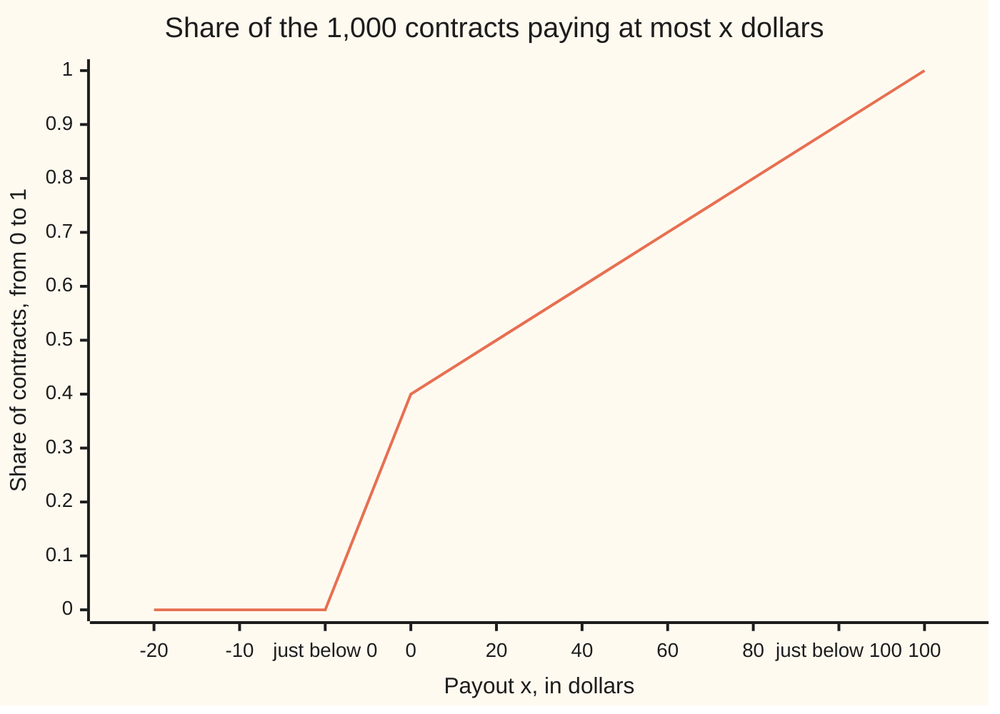

# Stieltjes integrals: integrating against a weight that can jump

[Syllabus](../../../SYLLABUS.md) → [Calculus and analysis](../../../SYLLABUS.md#w06) → [Multiple Integrals](../../../SYLLABUS.md#w06-s08) → Stieltjes integrals

---

## General Overview

An insurer holds 1,000 contracts for the year. 400 pay nothing. 500 pay amounts spread evenly between $0 and $100. 100 hit the policy cap and pay exactly $100. What does one contract pay on average?

Counting answers it: 500 × $50 + 100 × $100 = $35,000 in total, $35 per contract. The interest is in the list's shape. The middle is a smooth spread, which an ordinary integral handles. The ends are lumps: many contracts on one payout, and a lump has no width for an integral to use.

Thomas Stieltjes's fix, from 1894, keeps the thin slices but measures each by how much of the book it holds, read off a running total: the share of contracts paying at most a given amount. It climbs across the spread and jumps at a lump. From here on the running total is the **integrator**, and the share a slice holds is its **weight**.

**A Stieltjes integral adds value times weight, where a slice's weight is how far a nondecreasing running total rises across it; a steady rise gives an ordinary integral and a jump gives a single term.**

**What kind of fact this is:** a definition; that it exists for every continuous value against every nondecreasing integrator is a theorem, proved on this card in Why it works.

### The picture: the running share of the book



The line is the integrator: a leap of 0.40 at $0 (the zero-payers), a steady climb to 0.90, a leap of 0.10 at the cap. The axis is not to scale; each "just below" point sits a hair left of its leap.

---

## The formula

Notation first, in words. The integral of f against G is written with the stretched S and dG where dx used to be: the rises of G, not widths, supply the weights. It is read "the integral of f with respect to G".

Write $G$ for the integrator and $f$ for the value being averaged, here the payout itself, f(x) = x. Cut the interval from a to b at points $a = x_0 < x_1 < \dots < x_n = b$. Slice k runs from $x_{k-1}$ to $x_k$, and its weight is how far G rises across it:

$$\Delta G_k = G(x_k) - G(x_{k-1})$$

Pick any point $\xi_k$ in slice k, its **tag**. A **Stieltjes sum** $S$ adds value at the tag times weight; the integral is where these sums settle as the widest slice shrinks, whatever the tags:

$$\int_a^b f(x)\,dG(x) = \lim_{\text{widest slice} \to 0}\ \sum_{k=1}^{n} f(\xi_k)\,\bigl(G(x_k) - G(x_{k-1})\bigr)$$

**Read it aloud:** weigh each thin slice by how much the integrator climbs across it, multiply by the value there, add, and see where the total settles.

When G is a steady rise plus a few jumps, this becomes a working formula. $G'$ is the rate of G (its derivative) where it climbs smoothly; a jump of size $w_j$ sits at $c_j$:

$$\int_a^b f\,dG = \int_a^b f(x)\,G'(x)\,dx + \sum_j w_j\,f(c_j)$$

**Read it aloud:** the smooth part is an ordinary integral with G's rate as a density; each jump adds its size times the value there.

| Symbol | Plain meaning | In our example | Push it up and the answer… |
| --- | --- | --- | --- |
| $f$ | the value being averaged | the payout x | scales the average |
| $G$ | the integrator: a running total that never falls | share paying at most x | a later rise raises it |
| $x$, $a$, $b$ | the variable; the interval's ends | dollars; −20 and 100 | — |
| $n$, $k$, $x_k$ | slice count, a slice's counter, its right cut | 12 slices of $10 | tighter bracket |
| $\Delta G_k$ | weight of slice k: G's rise across it | 0.40 on the slice ending at $0 | — |
| $\xi_k$, $S$, $L$, $U$ | a tag; its sum; lowest and highest sums | L = 27.50, U = 37.50 at 12 slices | — |
| $G'$ | rate of G where it climbs smoothly | 0.005 per dollar | more contracts in the spread |
| $w_j$, $c_j$, $j$ | size and place of jump j; its counter | 0.40 at $0, 0.10 at $100 | a bigger cap lump raises it |

Units: dollars per contract. The total weight G(b) − G(a) is 1.00, the whole book, so the integral is the average.

### When it holds

- **A continuous value.** Continuity of f suffices. Drop it where G jumps and the sums split: a $1 fee on each contract that pays something jumps at $0, as G does. With 125 slices, left tags give 0.5992 and right tags 1.0000, and finer grids keep the split.
- **An integrator that never falls.** The bracket in Why it works needs weights of zero or more. Integrators that also fall need [Bounded variation](../../10-Measure%20and%20integration/11-Derivatives%20Meet%20the%20Lebesgue%20Integral/01-functions-of-bounded-variation.md).
- **A jump counts only inside the interval.** G(0) already includes the zero-payers, so starting at a = 0 would hide that jump; hence the start at −20.
- **The working formula needs a rate.** G must climb at a continuous rate between finitely many jumps.

---

## Why it works

### Step 0: weight replaces width

If G(x) = x, every weight is a width and the Stieltjes sum is the rectangle sum of [The integral](../04-Integrals/01-riemann-integral.md). That construction only needed weights that are nonnegative and add across neighbouring slices; any running total that never falls supplies them.

### Step 1: nonnegative weights give a bracket

Every weight is zero or more, so on each slice, lowest value times weight ≤ tag value times weight ≤ highest value times weight. Adding traps every Stieltjes sum between a lower sum L and an upper sum U. The payout rises with x, so L uses left ends and U right ends: with 12 slices of $10, L = 27.50 and U = 37.50.

An extra cut splits a slice's weight into pieces that add back to it, and each piece's lowest value is no lower than the slice's: L can only rise, U only fall. As on the Riemann card, every lower sum sits below every upper sum, and because the real numbers have no gaps, the lower sums have a least upper bound, sup L.

### Step 2: the gap closes

Slice by slice, U − L is (highest − lowest value) times weight, so the gap is at most the largest swing of f on one slice times the total weight G(b) − G(a).

For the payout the swing is the slice width and the total weight 1.00, so the gap is the width: 10.000, 1.000, 0.100 at 12, 120, 1200 slices. To land within $0.10, use 1200 slices. For any continuous f the swings shrink together; that is uniform continuity ([Uniform continuity](../01-Limits%20and%20Continuity/08-uniform-continuity-and-lipschitz.md)). So the best lower and upper sums are equal, every tagged sum is squeezed onto them, and the integral exists.

### Step 3: a steady rise becomes an ordinary integral

Where G climbs at a continuous rate G', the fundamental theorem of calculus ([Fundamental theorem of calculus](../04-Integrals/02-fundamental-theorem-of-calculus.md)) makes each weight roughly G' times the width: the sum becomes a rectangle sum for f times G'. The spread holds 0.50 of the book over $100, so G' = 0.005 per dollar, and the smooth part is 0.005 × 100 × 100 / 2 = 25.00 dollars per contract.

### Step 4: a jump becomes one term

A jump of size w at c raises G on one slice only, the one straddling c. It contributes f(tag) × w, the tag within one slice width of c. As slices shrink, continuity of f at c sends the term to w × f(c): here 0.40 × $0 = 0 and 0.10 × $100 = 10.00.

### Step 5: add the parts

Stieltjes sums are additive in the integrator: split G into its steady part and its jumps, and every sum splits the same way. The integral is 25.00 + 0 + 10.00 = 35.00 dollars per contract, as counting gave.

<details>
<summary>Detailed proof</summary>

Let f be continuous on [a, b] and G nondecreasing. Given ε > 0, uniform continuity gives δ > 0 with |f(s) − f(t)| < ε whenever |s − t| < δ. Take a partition with widest slice under δ, and let m_k, M_k be the least and greatest values of f on slice k. Then
U − L = Σ (M_k − m_k) ΔG_k ≤ ε Σ ΔG_k = ε (G(b) − G(a)).
By Step 1 every L is at most every U; let I = sup L. Then I and every tagged sum S lie in [L, U], so |S − I| ≤ ε (G(b) − G(a)) for every partition finer than δ and every choice of tags.

Jump of size w at c, with a < c ≤ b: only the slice with x_{k−1} < c ≤ x_k has a rise, so S = w f(ξ_k) with |ξ_k − c| < δ, and |S − w f(c)| < w ε.

Steady part: if G has a continuous rate G' on [p, q], the mean value theorem gives ΔG_k = G'(η_k) Δx_k with η_k in slice k, so S differs from the rectangle sum of f G' by at most max|f| × (largest swing of G' on a slice) × (q − p), which tends to 0.

</details>

A second road: integration by parts ([Integration by parts](../04-Integrals/04-integration-by-parts.md)) holds for Stieltjes integrals too, and turns the average into the ordinary integral of 1 − G(x) from 0 to 100, the area above the running share: also 35.00.

---

## Worked numbers, by hand

| Step | Arithmetic | Value |
| --- | --- | --- |
| smooth part | 0.005 × 100 × 100 / 2 | 25.00 |
| jump at $0 | 0.40 × $0 | 0 |
| jump at the cap | 0.10 × $100 | 10.00 |
| average payout | 25.00 + 0 + 10.00 | **$35.00** |

Each contract costs $35 on average, $10 of it from the 100 capped contracts that a rate-only reading never sees.

### What breaks if you drop a piece

| Mistake | Comes out at | What went wrong |
| --- | --- | --- |
| Jumps dropped, G' only | $25.00 | The cap lump carries $10 of the average |
| Jumps dropped, divided by the smooth weight 0.50 | $50.00 | The zero-payers vanish from the head count |
| Width instead of weight: x dx from 0 to 100 | 5000.00 | Counts dollars, not contracts |
| A fee that jumps where G jumps | 0.5992 or 1.0000, by tag | No common limit; counting gives 0.6000 |

---

## Code, from first principles, and it actually runs

Nothing is imported. Four roads reach the average: the working formula; lower and upper Stieltjes sums, with the gap checked against width times total weight; the 1,000 contracts listed and averaged; and the area above G. The fee case puts $0 inside a slice and asserts the tags never agree.

### Python

```python
# Stieltjes integrals -- the check behind the card.  Standard library only.
# A book of 1,000 contracts: 400 pay $0, 500 pay amounts spread evenly over
# $0 to $100, and 100 pay the $100 cap.  G(x) is the share paying at most x.
# The average payout is the integral of x against G, reached by four roads.
A, B = -20.0, 100.0

def G(x):                               # the accumulator: right-continuous
    if x < 0: return 0.0
    if x < 100: return 0.4 + 0.005 * x  # lump 0.4 at zero, then a steady rise
    return 1.0                          # lump 0.1 at the cap

def pay(x): return x                    # the integrand: dollars paid

def rs_sum(f, n, tag):                  # Stieltjes sum on n equal slices of [A, B]
    h = (B - A) / n
    return sum(f(A + (k + tag) * h) * (G(A + (k + 1) * h) - G(A + k * h)) for k in range(n))

book = [0.0] * 400 + [(k + 0.5) * 0.2 for k in range(500)] + [100.0] * 100
smooth = 0.005 * 100 ** 2 / 2           # road 1: antiderivative of x times the rate G'
jumps = 0.4 * pay(0) + 0.1 * pay(100)   # road 1: each lump times the payout there
split = smooth + jumps
by_hand = sum(book) / len(book)         # road 3: average the 1,000 contracts one by one
m = 100000                              # road 4: area above G, by a midpoint sum
tail = sum(1 - G((k + 0.5) * 100 / m) for k in range(m)) * 100 / m

print(f"book: {book.count(0.0)} at $0, {sum(1 for p in book if 0 < p < 100)} spread between, {book.count(100.0)} at $100")
print(f"chart, G at -20 -10 0- 0 20 40 60 80 100- 100: " + " ".join(f"{G(x):.2f}" for x in (-20, -10, -1e-9, 0, 20, 40, 60, 80, 100 - 1e-9, 100)))
print(f"lumps: {G(0) - G(-1e-9):.2f} at $0, {G(100) - G(100 - 1e-9):.2f} at $100; rate between them {(G(60) - G(20)) / 40:.3f} per dollar")
print(f"total weight G(b) - G(a) = {G(B) - G(A):.2f}; contracts paying something: {sum(1 for p in book if p > 0)}")
print(f"road 1, split: smooth part {smooth:.2f} + lumps {jumps:.2f} = {split:.2f}")
for n in (12, 120, 1200):               # road 2: lower and upper sums close on it
    lo, hi = rs_sum(pay, n, 0.0), rs_sum(pay, n, 1.0)
    print(f"road 2, n = {n}: slice width {(B - A) / n:.2f}, lower {lo:.3f}, upper {hi:.3f}, gap {hi - lo:.3f}")
    assert lo <= split <= hi and abs((hi - lo) - (B - A) / n * (G(B) - G(A))) < 1e-9
print(f"road 3, contract by contract: {len(book)} contracts, total {sum(book):.2f}, average {by_hand:.2f}")
print(f"road 4, area above G from 0 to 100: {tail:.2f}")
assert abs(by_hand - split) < 1e-9      # the list agrees with the formula
assert abs(tail - split) < 1e-6         # the area agrees with the formula
print(f"mistake 1, lumps dropped: {smooth:.2f}")
print(f"mistake 2, lumps dropped, divided by smooth weight {G(100 - 1e-9) - G(0):.2f}: {smooth / (G(100 - 1e-9) - G(0)):.2f}")
print(f"mistake 3, width instead of weight, integral of x from 0 to 100: {100 ** 2 / 2:.2f}")

def fee(x): return 1.0 if x > 0 else 0.0   # $1 on each contract that pays something
for n in (125, 1250):                   # 0 falls inside a slice, not on a cut
    lo, hi = rs_sum(fee, n, 0.0), rs_sum(fee, n, 1.0)
    print(f"shared jump, n = {n}: left tags {lo:.4f}, right tags {hi:.4f}")
    assert hi - lo > 0.39               # the tags never agree: no integral
print(f"fee by counting contracts: {sum(1 for p in book if p > 0) / len(book):.4f} per contract")
print("ALL CHECKS PASS")
```

**Ran 2026-09-27 on macOS, Python 3.14.6, standard library only. All checks passed. Output, pasted from the run:**

```
book: 400 at $0, 500 spread between, 100 at $100
chart, G at -20 -10 0- 0 20 40 60 80 100- 100: 0.00 0.00 0.00 0.40 0.50 0.60 0.70 0.80 0.90 1.00
lumps: 0.40 at $0, 0.10 at $100; rate between them 0.005 per dollar
total weight G(b) - G(a) = 1.00; contracts paying something: 600
road 1, split: smooth part 25.00 + lumps 10.00 = 35.00
road 2, n = 12: slice width 10.00, lower 27.500, upper 37.500, gap 10.000
road 2, n = 120: slice width 1.00, lower 34.250, upper 35.250, gap 1.000
road 2, n = 1200: slice width 0.10, lower 34.925, upper 35.025, gap 0.100
road 3, contract by contract: 1000 contracts, total 35000.00, average 35.00
road 4, area above G from 0 to 100: 35.00
mistake 1, lumps dropped: 25.00
mistake 2, lumps dropped, divided by smooth weight 0.50: 50.00
mistake 3, width instead of weight, integral of x from 0 to 100: 5000.00
shared jump, n = 125: left tags 0.5992, right tags 1.0000
shared jump, n = 1250: left tags 0.5997, right tags 1.0000
fee by counting contracts: 0.6000 per contract
ALL CHECKS PASS
```

### Rust

Same numbers, same labels, built with `rustc --edition 2021 -O`.

```rust
// Stieltjes integrals -- the same check as the Python, in Rust, std only.
// A book of 1,000 contracts: 400 pay $0, 500 pay amounts spread evenly over
// $0 to $100, and 100 pay the $100 cap.  G(x) is the share paying at most x.
// The average payout is the integral of x against G, reached by four roads.
const A: f64 = -20.0;
const B: f64 = 100.0;

fn g(x: f64) -> f64 {
    // the accumulator: right-continuous, lump 0.4 at zero, lump 0.1 at the cap
    if x < 0.0 { 0.0 } else if x < 100.0 { 0.4 + 0.005 * x } else { 1.0 }
}

fn pay(x: f64) -> f64 { x }

fn fee(x: f64) -> f64 { if x > 0.0 { 1.0 } else { 0.0 } } // $1 if it pays something

fn rs_sum(f: fn(f64) -> f64, n: usize, tag: f64) -> f64 {
    // Stieltjes sum on n equal slices of [A, B], tag 0 = left end, 1 = right end
    let h = (B - A) / n as f64;
    (0..n).map(|k| {
        let (l, r) = (A + k as f64 * h, A + (k + 1) as f64 * h);
        f(A + (k as f64 + tag) * h) * (g(r) - g(l))
    }).sum()
}

fn main() {
    let mut book = vec![0.0f64; 400];
    book.extend((0..500).map(|k| (k as f64 + 0.5) * 0.2));
    book.extend(vec![100.0f64; 100]);
    let paying = book.iter().filter(|&&p| p > 0.0).count();
    let smooth = 0.005 * 100.0f64.powi(2) / 2.0; // road 1: antiderivative of x times G'
    let jumps = 0.4 * pay(0.0) + 0.1 * pay(100.0); // road 1: each lump times its payout
    let split = smooth + jumps;
    let total: f64 = book.iter().sum();
    let by_hand = total / book.len() as f64; // road 3: contract by contract
    let m = 100000;
    let tail: f64 = (0..m).map(|k| 1.0 - g((k as f64 + 0.5) * 100.0 / m as f64)).sum::<f64>() * 100.0 / m as f64;
    let pts = [-20.0, -10.0, -1e-9, 0.0, 20.0, 40.0, 60.0, 80.0, 100.0 - 1e-9, 100.0];
    let row: Vec<String> = pts.iter().map(|&x| format!("{:.2}", g(x))).collect();
    let spread = book.iter().filter(|&&p| p > 0.0 && p < 100.0).count();
    let (zeros, capped) = (book.iter().filter(|&&p| p == 0.0).count(), book.iter().filter(|&&p| p == 100.0).count());
    println!("book: {} at $0, {} spread between, {} at $100", zeros, spread, capped);
    println!("chart, G at -20 -10 0- 0 20 40 60 80 100- 100: {}", row.join(" "));
    println!("lumps: {:.2} at $0, {:.2} at $100; rate between them {:.3} per dollar",
        g(0.0) - g(-1e-9), g(100.0) - g(100.0 - 1e-9), (g(60.0) - g(20.0)) / 40.0);
    println!("total weight G(b) - G(a) = {:.2}; contracts paying something: {}", g(B) - g(A), paying);
    println!("road 1, split: smooth part {:.2} + lumps {:.2} = {:.2}", smooth, jumps, split);
    for n in [12usize, 120, 1200] {
        // road 2: lower and upper sums close on it
        let (lo, hi) = (rs_sum(pay, n, 0.0), rs_sum(pay, n, 1.0));
        let h = (B - A) / n as f64;
        println!("road 2, n = {}: slice width {:.2}, lower {:.3}, upper {:.3}, gap {:.3}", n, h, lo, hi, hi - lo);
        assert!(lo <= split && split <= hi && ((hi - lo) - h * (g(B) - g(A))).abs() < 1e-9);
    }
    println!("road 3, contract by contract: {} contracts, total {:.2}, average {:.2}", book.len(), total, by_hand);
    println!("road 4, area above G from 0 to 100: {:.2}", tail);
    assert!((by_hand - split).abs() < 1e-9); // the list agrees with the formula
    assert!((tail - split).abs() < 1e-6); // the area agrees with the formula
    println!("mistake 1, lumps dropped: {:.2}", smooth);
    let sw = g(100.0 - 1e-9) - g(0.0);
    println!("mistake 2, lumps dropped, divided by smooth weight {:.2}: {:.2}", sw, smooth / sw);
    println!("mistake 3, width instead of weight, integral of x from 0 to 100: {:.2}", 100.0f64.powi(2) / 2.0);
    for n in [125usize, 1250] {
        // 0 falls inside a slice, not on a cut
        let (lo, hi) = (rs_sum(fee, n, 0.0), rs_sum(fee, n, 1.0));
        println!("shared jump, n = {}: left tags {:.4}, right tags {:.4}", n, lo, hi);
        assert!(hi - lo > 0.39); // the tags never agree: no integral
    }
    println!("fee by counting contracts: {:.4} per contract", paying as f64 / book.len() as f64);
    println!("ALL CHECKS PASS");
}
```

**Ran 2026-09-27 on macOS, rustc 1.98.1, no crates. All checks passed. Output, pasted from the run:**

```
book: 400 at $0, 500 spread between, 100 at $100
chart, G at -20 -10 0- 0 20 40 60 80 100- 100: 0.00 0.00 0.00 0.40 0.50 0.60 0.70 0.80 0.90 1.00
lumps: 0.40 at $0, 0.10 at $100; rate between them 0.005 per dollar
total weight G(b) - G(a) = 1.00; contracts paying something: 600
road 1, split: smooth part 25.00 + lumps 10.00 = 35.00
road 2, n = 12: slice width 10.00, lower 27.500, upper 37.500, gap 10.000
road 2, n = 120: slice width 1.00, lower 34.250, upper 35.250, gap 1.000
road 2, n = 1200: slice width 0.10, lower 34.925, upper 35.025, gap 0.100
road 3, contract by contract: 1000 contracts, total 35000.00, average 35.00
road 4, area above G from 0 to 100: 35.00
mistake 1, lumps dropped: 25.00
mistake 2, lumps dropped, divided by smooth weight 0.50: 50.00
mistake 3, width instead of weight, integral of x from 0 to 100: 5000.00
shared jump, n = 125: left tags 0.5992, right tags 1.0000
shared jump, n = 1250: left tags 0.5997, right tags 1.0000
fee by counting contracts: 0.6000 per contract
ALL CHECKS PASS
```

> [!TIP]
> **Try changing**
> - **Start at the lump.** Guess first, then set A to 0. Answer: the 0.40 jump hides inside G(a) and the total weight falls to 0.60; the integral stays 35.00, since that jump paid $0. The fee's assert fails: with the jump outside, both tags close on 0.6000.
> - **A convenient grid.** Guess first, then run the fee on 120 slices. Answer: $0 becomes a cut, both tags see a zero fee on the lump, the sums nearly agree near 0.6000, and the last assert fails. The definition demands every fine grid.

---

## The usual mistake

> [!warning]
> **Replacing dG by G'(x) dx everywhere.** A jump has no rate: G' is zero on either side and undefined at it. The rate discards every contract sitting on one payout: $25.00 instead of $35.00.
>
> - **Averaging over the smooth weight only.** $25.00 divided by 0.50 gives $50.00, dropping the zero-payers from the count too.
> - **Starting the interval on a jump.** A jump at the start is inside G(a) and never registers as a rise.
> - **Trusting one grid.** Cuts exactly at the fee's jump make its sums agree and hide the split on other grids.

---

## Where you meet it in real life

- **Insurance pricing.** Claim lists have a lump at zero, lumps at policy limits and a spread between; the pure premium, the average claim, is this integral.
- **Probability.** A running share like G is a distribution function, and the average is the expected value of [Expectation](../../09-Probability%20and%20statistics/02-Random%20Variables/02-expectation.md), for counts, spreads and mixtures alike.
- **Counting primes.** Sums over primes are integrals against the prime count, which jumps at each prime: Partial summation.

Weight spread over a region instead of a line is [Double integrals](01-double-integrals.md).

> **Say it back**
> A Stieltjes integral weighs each slice by how much a running total rises across it, not by its width. With a running total that never falls and a continuous value, lower and upper sums close on one number. A steady rise becomes an ordinary integral; a jump becomes its size times the value there. For the 1,000 contracts: 25 from the spread, 10 from the cap, $35 each.

---

## What this builds on

- [The integral](../04-Integrals/01-riemann-integral.md): the lower and upper sums, and the gap test, reused here with weights in place of widths.

## Where this goes next

- [Expectation](../../09-Probability%20and%20statistics/02-Random%20Variables/02-expectation.md): the running share as a distribution, this integral as its average.
- [The Lebesgue-Stieltjes integral](../../10-Measure%20and%20integration/11-Derivatives%20Meet%20the%20Lebesgue%20Integral/05-lebesgue-stieltjes-integral.md): the same weights, with values that need not be continuous.
- [The Ito integral](../../11-Stochastic%20processes%20and%20calculus/06-Ito%20Calculus/01-ito-integral.md): an integrator so rough that the tag choice changes the answer for good.

So what: counting prices the fee at once, yet it has no Stieltjes integral; the integral that agrees with counting is [The Lebesgue-Stieltjes integral](../../10-Measure%20and%20integration/11-Derivatives%20Meet%20the%20Lebesgue%20Integral/05-lebesgue-stieltjes-integral.md).

---

## Sources

Verified 2026-09-27: every link below resolves to the page named.

- Stieltjes, T.-J. "Recherches sur les fractions continues." *Annales de la Faculté des sciences de Toulouse*, series 1, vol. 8 (1894), J1–J122. [Numdam record](https://www.numdam.org/item/AFST_1894_1_8_4_J1_0/). Where the integral first appears.
- Sharpley, Robert. "Riemann-Stieltjes Integration: Properties." Analysis II lecture notes, University of South Carolina. [Notes](https://people.math.sc.edu/sharpley/math555/Lectures/RS_Properties.html). Additivity in the integrator, the total-weight bound, the one-term rule for jumps.
- Just, Winfried. "Review Module R11." Advanced Calculus, Ohio University. [Notes](https://people.ohio.edu/just/M4302S21/Modules/ModR11.pdf). The reduction to an ordinary integral when the integrator has a rate.
