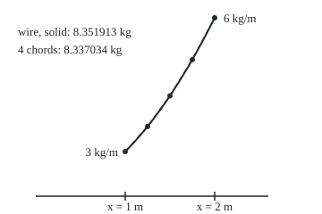

# Line integrals of a function: mass of a wire from its density

Calculus and analysis → Vector Calculus → Weighing along a curve → Line integrals of a function

---

## General Overview

A wire is bent into a curve: from above it follows the parabola y = x^2/2, from x = 1 m to x = 2 m. It is drawn thicker as it goes, so its **density**, the mass of one metre of wire, rises from 3 kg/m at the near end to 6 kg/m at the far end. At a point x metres along the ground it is 3x kg/m. How heavy is the wire?

Density times length fails, because the density changes. Cut the wire into short pieces. Each piece weighs about its density at its middle times its length. Add the pieces. One straight piece, end to end, gives 8.112490 kg. Four pieces give 8.337034 kg. Sixteen give 8.350983 kg. The totals close in on 8.351913 kg, the wire's mass.

That limit is a **line integral of a function**: a function (here density) added along a curve, each bit weighted by the length of wire it sits on. It can be computed from any clock that runs along the wire once, with no pieces at all, and the answer does not depend on the clock or the end it starts from. Such a clock is a **parametrisation** of the curve; its reading t is the **parameter**, and the end it starts from is its **orientation**.

<p align="center"></p>

Drawn to scale at 100 units per metre in both directions; the bottom line is y = 0. Chord points every 0.25 m of x.

**The mass of a wire is the limit of density times piece length as the pieces shrink, and it equals the integral of density times speed along any clock that runs the wire once, in either direction.**

**What kind of fact this is:** a definition (the limit of pieces) and a theorem: that it equals the speed formula for every such clock, proved on this card in Why it works.

---

## The formula

Notation first, in words. The integral sign with a C at its foot means "add along the curve C". The $ds$ after it names what is added over: tiny lengths of wire, measured along the wire, never negative. The Greek letter $\rho$ (rho) stands for density.

$$M = \int_C \rho\, ds = \int_a^b \rho\big(x(t), y(t)\big)\,\sqrt{x'(t)^2 + y'(t)^2}\; dt$$

**Read it aloud:** the mass adds density times length along the wire; with a clock t, that is density at the point reached, times the speed there, added over the clock.

The square root is the clock's **speed**: metres of wire per unit of clock, as on [arc-length](../05-Curves%20and%20Solids/02-arc-length.md). It turns a step of clock into a length of wire.

| Symbol | Plain meaning | In our example | Push it up and the answer… |
| --- | --- | --- | --- |
| $C$ | the curve the wire follows, run once | y = x^2/2, x from 1 to 2 m | a longer wire weighs more |
| $M$ | the wire's mass, kg | 8.351913 kg | — |
| $\rho$ | density at a point: kg per metre of wire | 3x, so 3 to 6 kg/m | mass rises in step |
| $ds$ | a tiny length along the wire, always positive | — | — |
| $t$, $a$, $b$ | a clock and its start and end | x = t, t from 1 to 2 | a faster clock changes speed, not mass |
| $x(t)$, $y(t)$ | where the clock has reached | t and t^2/2 | — |
| $x'(t)$, $y'(t)$ | their rates: metres per unit of clock | 1 and t | more speed, more wire per tick |
| $n$ | number of straight pieces | 4 | more pieces, closer total |

Units: kg/m times metres per unit of clock, added over the clock, leaves kg.

### When it holds

- **The wire has no jumps, and the clock's rates change without jumps.** A corner is fine: split there and add the two parts.
- **Density changes without jumps along the wire.** Then short pieces have nearly one density each, which is what Step 2 uses.
- **The clock runs the wire once.** A clock that goes out and back weighs the wire twice: 16.703826 kg.
- **Density is not negative, if the answer is a mass.** A signed function, such as charge, is added the same way and can total below zero.

---

## Why it works

### Step 0: the definition is pieces, not a formula

Cut the wire into n pieces. Take the density at a point of each piece, multiply by the piece's length, and add. The mass is the number these totals close in on as every piece shrinks. The formula is a way to reach that number; the pieces are what it means.

### Step 1: a piece's length is its speed times its clock time

From [arc-length](../05-Curves%20and%20Solids/02-arc-length.md), the length of wire covered while the clock runs from one tick to the next is the integral of speed over that stretch of clock. So the piece total is a sum of density times an integral of speed.

### Step 2: pieces become one integral

Over a short stretch of clock the density barely changes, since it has no jumps. Replacing "density at the chosen point" by "density at each instant" inside each piece's speed integral changes the total by at most the largest density change inside a piece, times the whole length of the wire. That change shrinks to zero with the pieces. What remains is one integral over the clock of density times speed: the formula.

The tolerance game, on the wire: to land within 0.001 kg, sixteen equal pieces suffice, off by 0.000930 kg. Each fourfold refinement cuts the error about sixteenfold: 0.014879, 0.000930, 0.000058 kg.

<details>
<summary>Detailed proof: the piece totals tend to the formula</summary>

Let $q(t)$ be the density at the point reached at clock time t, and $v(t)$ the speed. Both are continuous on the closed stretch from a to b, so q is uniformly continuous: for every ε > 0 there is a δ > 0 such that clock times less than δ apart give densities less than ε apart. Let L be the wire's length, the integral of v.

Cut the clock at $a = t_0 < t_1 < \dots < t_n = b$, every step shorter than δ, and pick a clock time $t_{i-1} \le \tau_i \le t_i$ in each step. The piece total is $S = \sum q(\tau_i)\,\ell_i$, where $\ell_i = \int_{t_{i-1}}^{t_i} v(t)\,dt$ is the length of piece i. Let I be the integral of q times v. Then
$$\lvert S - I\rvert = \Big\lvert \sum \int_{t_{i-1}}^{t_i} \big(q(\tau_i) - q(t)\big)\,v(t)\,dt \Big\rvert \le \varepsilon \int_a^b v(t)\,dt = \varepsilon L.$$
Since ε was any positive number, S tends to I whichever points are picked. Speed is never negative, so the bound needs no sign; that is also why reversing the clock cannot flip the total.

</details>

### Step 3: a new clock leaves the mass alone

Run the same wire with a different clock that still runs it once: the old clock t is now some function of a new one, u. By the chain rule, each position's rate on the new clock is its old rate times the rate of t per unit of u. So the new speed is the old speed times the size of that rate.

Two effects cancel: a clock twice as fast doubles the speed and halves the clock time. As integrals, this is substitution, which turns the new integral back into the old one.

On the wire, the clock $x = \sqrt{u}$ for u from 1 to 4 gives speed $\sqrt{1 + u}/(2\sqrt{u})$ and density $3\sqrt{u}$. Their product is $\tfrac{3}{2}\sqrt{1+u}$, and its integral is again 8.351913 kg.

### Step 4: running backwards changes nothing

Reverse the orientation, starting at the far end: $x = 3 - s$, for s from 1 to 2. Now the rate of x is −1, but speed is a square root of squares, so it stays positive. The density met is the same, the lengths are the same, and the total is 8.351913 kg.

As substitution, a backwards clock brings two minus signs, one from taking the rate's size and one from limits in the other order, and they cancel.

<details>
<summary>Why this is different for a force</summary>

Work done by a force uses its component along the direction of travel, so reversing the path flips its sign. Density has no direction, so mass cannot flip. The field version is [line-integrals](02-line-integrals.md).

</details>

A second road to the mass needs no clock at all: the piece totals themselves, straight chords times midpoint density, computed in the code up to 256 pieces.

---

## Worked numbers, by hand

Use the clock x = t, so $x' = 1$ and $y' = t$.

| Step | Arithmetic | Value |
| --- | --- | --- |
| density at the point | 3 times x | 3t kg/m |
| speed | sqrt(1^2 + t^2) | sqrt(1 + t^2) m per m of x |
| what is added | density times speed | 3t sqrt(1 + t^2) |
| an antiderivative | (1 + t^2)^(3/2); its rate, by the chain rule, is (3/2)(1 + t^2)^(1/2) × 2t | matches |
| at the far end, t = 2 | 5^1.5 | 11.180340 |
| at the near end, t = 1 | 2^1.5 | 2.828427 |
| mass | 11.180340 − 2.828427 | **8.351913 kg** |

The wire is 1.810092 m long, so its average density is 4.6141 kg/m. That sits above 4.5, the average of 3 and 6, because the far end is steeper: more wire lies where the density is high.

### What breaks if you drop a piece

| Mistake | Comes out at | What went wrong |
| --- | --- | --- |
| Drop the speed: density times dx | 4.500000 kg | Adds over 1 m of ground, not 1.810092 m of wire |
| Signed length when reversed | −8.351913 kg | ds is a length; it has no direction |
| A clock that runs out and back | 16.703826 kg | The once-through condition dropped: each metre counted twice |
| One straight piece, midpoint density | 8.112490 kg | One density, 4.5 kg/m, for a wire averaging 4.6141 kg/m; and a chord is shorter than the curve |

The code prints all four.

---

## Code, from first principles, and it actually runs

Two roads. One: density times speed, integrated by Simpson's rule (a strip sum that fits a parabola over each pair of strips, 200 strips), on three clocks: x = t, x = sqrt(u), and the reversed x = 3 − s. Two: the definition, straight pieces times midpoint density, with the error printed as the pieces shrink. Both are checked against the antiderivative $(1 + t^2)^{3/2}$.

### Python

```python
# Line integral of a function -- the check behind the card.  Standard library
# only; math gives sqrt as a primitive, and every sum below is written out here.
# A wire bent along y = x^2 / 2 from x = 1 to x = 2 m.  Its density is 3x kg/m,
# rising from 3 at the near end to 6 at the far end.  Its mass, two roads.
from math import sqrt

def rho(x, y): return 3 * x                      # density, kg per metre
def y_of(x):   return x * x / 2                  # the wire's shape

def simpson(g, a, b, n=200):                     # Simpson's rule, n even strips
    h = (b - a) / n
    s = g(a) + g(b) + sum((4 if i % 2 else 2) * g(a + i * h) for i in range(1, n))
    return s * h / 3

def line_integral(x, y, dx, dy, a, b):           # density times speed, over the clock
    return simpson(lambda t: rho(x(t), y(t)) * sqrt(dx(t) ** 2 + dy(t) ** 2), a, b)

def pieces(n):                                   # road two: the definition itself
    xs = [1 + i / n for i in range(n + 1)]
    total = 0.0
    for p, q in zip(xs, xs[1:]):
        chord = sqrt((q - p) ** 2 + (y_of(q) - y_of(p)) ** 2)
        m = (p + q) / 2
        total += rho(m, y_of(m)) * chord         # density at the middle, times chord
    return total

exact = 5 ** 1.5 - 2 ** 1.5                      # (1 + x^2)^(3/2) from x = 1 to 2
by_x = line_integral(lambda t: t, lambda t: t * t / 2, lambda t: 1.0, lambda t: t, 1, 2)
by_u = line_integral(lambda u: sqrt(u), lambda u: u / 2,
                     lambda u: 1 / (2 * sqrt(u)), lambda u: 0.5, 1, 4)
back = line_integral(lambda s: 3 - s, lambda s: (3 - s) ** 2 / 2,
                     lambda s: -1.0, lambda s: -(3 - s), 1, 2)
sign = lambda t: -1.0 if t > 0 else 1.0           # out to the far end, then back
twice = line_integral(lambda t: 2 - abs(t), lambda t: (2 - abs(t)) ** 2 / 2,
                      sign, lambda t: (2 - abs(t)) * sign(t), -1, 1)
length = simpson(lambda t: sqrt(1 + t * t), 1, 2)
print("wire y = x^2/2 from x = 1 to 2 m; density 3x: 3.0 kg/m at the near end, 6.0 at the far end")
print(f"closed form 5^1.5 - 2^1.5 = {5 ** 1.5:.6f} - {2 ** 1.5:.6f} = {exact:.6f} kg")
print(f"clock x = t, t from 1 to 2, speed sqrt(1 + t^2): {by_x:.6f} kg")
print(f"clock x = sqrt(u), u from 1 to 4, speed sqrt(1 + u)/(2 sqrt u): {by_u:.6f} kg")
print(f"reversed, x = 3 - s, s from 1 to 2, far end first: {back:.6f} kg")
for n in (1, 4, 16, 64, 256):
    print(f"pieces {n:5d}: density x chord {pieces(n):.6f} kg, off by {pieces(n) - exact:+.6f}")
print(f"wire length (density 1): {length:.6f} m; average density {exact / length:.4f} kg/m")
print(f"mistake, drop the speed (density x dx): {simpson(lambda t: rho(t, y_of(t)), 1, 2):.6f} kg")
print(f"mistake, signed length when reversed: {simpson(lambda t: rho(t, y_of(t)) * sqrt(1 + t * t), 2, 1):.6f} kg")
X = lambda x: 40 + 100 * x
Y = lambda x: 220 - 100 * y_of(x)
print(f"mistake, a clock that runs out and back: {twice:.6f} kg")
print("figure, 100 units per m, curve:", " ".join(f"{X(1 + i / 10):.1f},{Y(1 + i / 10):.1f}" for i in range(11)))
print("figure, chord points:", " ".join(f"{X(1 + i / 4):.1f},{Y(1 + i / 4):.1f}" for i in range(5)))
assert abs(by_x - exact) < 1e-9                  # the formula against the antiderivative
assert abs(by_u - exact) < 1e-9                  # a new clock, the same mass
assert abs(back - exact) < 1e-9                  # the other direction, the same mass
assert abs(pieces(256) - exact) < 1e-5          # the definition closes in on it
print("ALL CHECKS PASS")
```

**Ran 2026-09-27 on macOS, Python 3.14.6, standard library only. All checks passed. Output, pasted from the run:**

```
wire y = x^2/2 from x = 1 to 2 m; density 3x: 3.0 kg/m at the near end, 6.0 at the far end
closed form 5^1.5 - 2^1.5 = 11.180340 - 2.828427 = 8.351913 kg
clock x = t, t from 1 to 2, speed sqrt(1 + t^2): 8.351913 kg
clock x = sqrt(u), u from 1 to 4, speed sqrt(1 + u)/(2 sqrt u): 8.351913 kg
reversed, x = 3 - s, s from 1 to 2, far end first: 8.351913 kg
pieces     1: density x chord 8.112490 kg, off by -0.239422
pieces     4: density x chord 8.337034 kg, off by -0.014879
pieces    16: density x chord 8.350983 kg, off by -0.000930
pieces    64: density x chord 8.351855 kg, off by -0.000058
pieces   256: density x chord 8.351909 kg, off by -0.000004
wire length (density 1): 1.810092 m; average density 4.6141 kg/m
mistake, drop the speed (density x dx): 4.500000 kg
mistake, signed length when reversed: -8.351913 kg
mistake, a clock that runs out and back: 16.703826 kg
figure, 100 units per m, curve: 140.0,170.0 150.0,159.5 160.0,148.0 170.0,135.5 180.0,122.0 190.0,107.5 200.0,92.0 210.0,75.5 220.0,58.0 230.0,39.5 240.0,20.0
figure, chord points: 140.0,170.0 165.0,141.9 190.0,107.5 215.0,66.9 240.0,20.0
ALL CHECKS PASS
```

### Rust

```rust
// Line integral of a function -- the same check as the Python, in Rust.  No
// crates; sqrt is a primitive, and every sum below is written out here.
// A wire bent along y = x^2 / 2 from x = 1 to x = 2 m.  Its density is 3x kg/m,
// rising from 3 at the near end to 6 at the far end.  Its mass, two roads.
fn rho(x: f64, _y: f64) -> f64 { 3.0 * x } // density, kg per metre
fn y_of(x: f64) -> f64 { x * x / 2.0 } // the wire's shape
fn sign(t: f64) -> f64 { if t > 0.0 { -1.0 } else { 1.0 } } // out to the far end, then back

fn simpson(g: &dyn Fn(f64) -> f64, a: f64, b: f64) -> f64 { // Simpson's rule, 200 strips
    let n = 200;
    let h = (b - a) / n as f64;
    let mut s = g(a) + g(b);
    for i in 1..n {
        s += if i % 2 == 1 { 4.0 } else { 2.0 } * g(a + i as f64 * h);
    }
    s * h / 3.0
}

type F = dyn Fn(f64) -> f64;
fn line_integral(x: &F, y: &F, dx: &F, dy: &F, a: f64, b: f64) -> f64 { // density times speed
    simpson(&|t| rho(x(t), y(t)) * (dx(t).powi(2) + dy(t).powi(2)).sqrt(), a, b)
}

fn pieces(n: usize) -> f64 { // road two: the definition itself
    let xs: Vec<f64> = (0..=n).map(|i| 1.0 + i as f64 / n as f64).collect();
    xs.windows(2).map(|w| {
        let (p, q) = (w[0], w[1]);
        let chord = ((q - p).powi(2) + (y_of(q) - y_of(p)).powi(2)).sqrt();
        let m = (p + q) / 2.0;
        rho(m, y_of(m)) * chord // density at the middle, times chord
    }).sum()
}

fn main() {
    let exact = 5f64.powf(1.5) - 2f64.powf(1.5); // (1 + x^2)^(3/2) from x = 1 to 2
    let by_x = line_integral(&|t| t, &|t| t * t / 2.0, &|_| 1.0, &|t| t, 1.0, 2.0);
    let by_u = line_integral(&|u: f64| u.sqrt(), &|u| u / 2.0,
                             &|u: f64| 1.0 / (2.0 * u.sqrt()), &|_| 0.5, 1.0, 4.0);
    let back = line_integral(&|s| 3.0 - s, &|s| (3.0 - s).powi(2) / 2.0,
                             &|_| -1.0, &|s| -(3.0 - s), 1.0, 2.0);
    let twice = line_integral(&|t: f64| 2.0 - t.abs(), &|t: f64| (2.0 - t.abs()).powi(2) / 2.0,
                              &sign, &|t: f64| (2.0 - t.abs()) * sign(t), -1.0, 1.0);
    let length = simpson(&|t| (1.0 + t * t).sqrt(), 1.0, 2.0);
    println!("wire y = x^2/2 from x = 1 to 2 m; density 3x: 3.0 kg/m at the near end, 6.0 at the far end");
    println!("closed form 5^1.5 - 2^1.5 = {:.6} - {:.6} = {:.6} kg", 5f64.powf(1.5), 2f64.powf(1.5), exact);
    println!("clock x = t, t from 1 to 2, speed sqrt(1 + t^2): {:.6} kg", by_x);
    println!("clock x = sqrt(u), u from 1 to 4, speed sqrt(1 + u)/(2 sqrt u): {:.6} kg", by_u);
    println!("reversed, x = 3 - s, s from 1 to 2, far end first: {:.6} kg", back);
    for n in [1, 4, 16, 64, 256] {
        println!("pieces {:5}: density x chord {:.6} kg, off by {:+.6}", n, pieces(n), pieces(n) - exact);
    }
    println!("wire length (density 1): {:.6} m; average density {:.4} kg/m", length, exact / length);
    println!("mistake, drop the speed (density x dx): {:.6} kg", simpson(&|t| rho(t, y_of(t)), 1.0, 2.0));
    println!("mistake, signed length when reversed: {:.6} kg",
             simpson(&|t| rho(t, y_of(t)) * (1.0 + t * t).sqrt(), 2.0, 1.0));
    println!("mistake, a clock that runs out and back: {:.6} kg", twice);
    let pt = |x: f64| format!("{:.1},{:.1}", 40.0 + 100.0 * x, 220.0 - 100.0 * y_of(x));
    let curve: Vec<String> = (0..=10).map(|i| pt(1.0 + i as f64 / 10.0)).collect();
    let chords: Vec<String> = (0..=4).map(|i| pt(1.0 + i as f64 / 4.0)).collect();
    println!("figure, 100 units per m, curve: {}", curve.join(" "));
    println!("figure, chord points: {}", chords.join(" "));
    assert!((by_x - exact).abs() < 1e-9); // the formula against the antiderivative
    assert!((by_u - exact).abs() < 1e-9); // a new clock, the same mass
    assert!((back - exact).abs() < 1e-9); // the other direction, the same mass
    assert!((pieces(256) - exact).abs() < 1e-5); // the definition closes in on it
    println!("ALL CHECKS PASS");
}
```

**Ran 2026-09-27 on macOS, rustc 1.98.1, no crates. All checks passed. Output, pasted from the run:**

```
wire y = x^2/2 from x = 1 to 2 m; density 3x: 3.0 kg/m at the near end, 6.0 at the far end
closed form 5^1.5 - 2^1.5 = 11.180340 - 2.828427 = 8.351913 kg
clock x = t, t from 1 to 2, speed sqrt(1 + t^2): 8.351913 kg
clock x = sqrt(u), u from 1 to 4, speed sqrt(1 + u)/(2 sqrt u): 8.351913 kg
reversed, x = 3 - s, s from 1 to 2, far end first: 8.351913 kg
pieces     1: density x chord 8.112490 kg, off by -0.239422
pieces     4: density x chord 8.337034 kg, off by -0.014879
pieces    16: density x chord 8.350983 kg, off by -0.000930
pieces    64: density x chord 8.351855 kg, off by -0.000058
pieces   256: density x chord 8.351909 kg, off by -0.000004
wire length (density 1): 1.810092 m; average density 4.6141 kg/m
mistake, drop the speed (density x dx): 4.500000 kg
mistake, signed length when reversed: -8.351913 kg
mistake, a clock that runs out and back: 16.703826 kg
figure, 100 units per m, curve: 140.0,170.0 150.0,159.5 160.0,148.0 170.0,135.5 180.0,122.0 190.0,107.5 200.0,92.0 210.0,75.5 220.0,58.0 230.0,39.5 240.0,20.0
figure, chord points: 140.0,170.0 165.0,141.9 190.0,107.5 215.0,66.9 240.0,20.0
ALL CHECKS PASS
```

> [!TIP]
> **Try changing**
> - **Density 3 everywhere.** Guess first: more or less than 8.351913 kg? Set `rho` to return 3. The mass becomes 3 times the wire's length of 1.810092 m, and the asserts fail, since the antiderivative belongs to density 3x.
> - **A clock twice as fast.** Guess first. Use x = 2w for w from 1/2 to 1, with rates 2 and 4w. Speed doubles, clock time halves, and the mass stays 8.351913 kg.
> - **More pieces.** Guess first: 1024 pieces, how far off? About sixteen times closer than 256 pieces: under a millionth of a kilogram.
> - **Break the rule.** Replace the speed by the signed rate of x times sqrt(1 + x^2). The reversed clock then gives −8.351913 kg and the third assert fails.

---

## The usual mistake

> [!warning]
> **Treating ds as dx.** Adding density over the ground the wire covers, 1 m of x, gives 4.500000 kg. The wire is 1.810092 m long; the speed factor is what converts ground into wire.
>
> - **Giving ds a sign.** Integrating from the far end with a signed length gives −8.351913 kg. A wire has no negative mass whichever end is weighed first.
> - **A clock that doubles back.** Out and back gives 16.703826 kg: the formula counts every pass.

---

## Where you meet it in real life

- **Cables and pipes.** A cable whose gauge changes along a route, or a pipe coated more heavily on a bend, is weighed this way before it is lifted.
- **Averages along a route.** Dividing by length gives a length-weighted average: 4.6141 kg/m here. Average pollution along a road is the same integral with pollution in place of density.
- **Surfaces.** The same pieces-times-size idea over a patch of surface gives [surface-integrals-and-flux](05-surface-integrals-and-flux.md).

> **Say it back**
> The mass of a wire is the limit of density times piece length as the pieces shrink. With a clock along the wire, each length is speed times clock time, so the mass is the integral of density times speed. Any clock that runs the wire once gives the same answer, and running backwards cannot flip it, because speed is never negative. The bent wire with density 3x from x = 1 to 2 m weighs 8.351913 kg.

---

## What this builds on

- [arc-length](../05-Curves%20and%20Solids/02-arc-length.md): length as the integral of speed; this card weights each length by a density.

## Where this goes next

- [line-integrals](02-line-integrals.md): adds a force's push along the direction of travel, and there direction matters.

---

## Sources

Verified 2026-09-27: every link below resolves to the publisher's page.

- Strang, Gilbert, Edwin Herman et al. *Calculus Volume 3*, OpenStax. [Section 6.2, Line Integrals](https://openstax.org/books/calculus-volume-3/pages/6-2-line-integrals). Scalar line integrals as limits of pieces, the speed formula, and wire mass.
- Auroux, Denis, Arthur Mattuck and Jeremy Orloff. *18.02SC Multivariable Calculus*, MIT OpenCourseWare, Fall 2010. [Course page](https://ocw.mit.edu/courses/18-02sc-multivariable-calculus-fall-2010/). Line integrals and their independence of parametrisation, with worked sessions.
