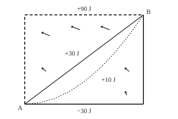

# Line integrals of a field: work done along a path

Calculus and analysis → Vector Calculus → Work along a route → Line integrals of a field

---

## General Overview

A cart crosses a field 40 m wide and 30 m deep, from corner A in the south-west to corner B in the north-east. Wind blows over the field. A hedge shelters the south edge, so the wind's eastward push grows by 0.1 N for every metre north: nothing at the hedge, 3 N along the north edge. A steady 1 N drift pushes south everywhere.

On each short stretch, only the part of the push along the cart's motion helps; a push across it does nothing, a push against it takes energy away. The help is **work**, in joules: newtons along the motion times metres moved.

Straight across, the wind gives 30 J. Along a curve bowing south, 10 J. East along the hedge, then north: −30 J. North, then east along the windy top: 90 J. Same ends, four answers. A **line integral of a field** adds these pieces up, and keeps track of the direction of travel.

<p align="center"></p>

To scale, 6 units per metre; wind arrows run from their dots, 1 m per newton. Solid edges: east, then north. Dashed edges: north, then east. Diagonal: straight. Dotted: the curve.

**A line integral of a field adds, along a directed route, the field's part along the motion times each small step; reversing the route flips the sign, and another route may give another answer.**

**What kind of fact this is:** a definition. Three facts about it are theorems, proved in Why it works: it is the limit of force-times-step sums, it ignores the pace, and it flips sign on reversal.

---

## The formula

Notation first, in words. A **field** $F$ puts a vector at every point: the wind's push, with east part $P$ and north part $Q$. The route $C$ is traced by a position $r(t)$ as a clock $t$ runs from $a$ to $b$; $r'(t)$ is the velocity.

$$W = \int_C F \cdot dr = \int_a^b F(r(t)) \cdot r'(t)\, dt$$

**Read it aloud:** at each clock reading, take the wind where the cart is, dot it with the cart's velocity, and add over the clock.

In parts, the same integral is $\int_C P\,dx + Q\,dy$: east push times eastward steps, plus north push times northward steps. With $T$ the direction of travel (length 1) and $ds$ a small length, $F \cdot dr = (F \cdot T)\, ds$: push along the motion times distance.

| Symbol | Plain meaning | In our example | Push it up and the answer… |
| --- | --- | --- | --- |
| $F$, $P$, $Q$ | the field, and its east and north parts, newtons | $(y/10, -1)$ N | more help where it points along the route |
| $C$ | the route, including its direction | A to B | reversing it flips the sign |
| $r(t)$, $x$, $y$ | the cart's position at clock reading t: metres east and north of A | straight: $(40t, 30t)$ | — |
| $t$, $a$, $b$; $s$, $\varphi$ | the clock and its start and end; a second clock and the rule turning it into the first | 0 to 1; $t = s^2$ | a new clock leaves the answer alone |
| $r'(t)$ | velocity: metres per unit of clock | straight: $(40, 30)$ | — |
| $dr$ | a small step along the route, velocity times a small clock step | — | — |
| $T$, $ds$ | direction of travel, length 1; a small length along the route | straight: $(0.8, 0.6)$, 50 m in all | — |
| $W$ | the work done by the wind, joules | straight: 30 J | — |

Newtons times metres are joules. With the clock in seconds, $F(r(t)) \cdot r'(t)$ is power in watts.

### When it holds

A definition holds wherever it makes sense; the bullets say where.

- **Smooth pieces.** Corners are fine: split there and add. Each L-shaped route is two straight pieces.
- **A field with at most a few jumps along the route.** A field jumping at every scale leaves the sums with no limit.
- **A forward clock.** Any forward pace gives the same work; a backward clock reverses the route and the sign.
- **A finite route.** One spiralling in forever can have sums that never settle.

---

## Why it works

### Step 0: a steady push on a straight step

For a steady push on a straight step, work is the dot product of push and step: the push's part along the step, times the step's length. The rest is adding short steps, over which the wind barely changes.

### Step 1: short steps give a sum, the sum closes in on the integral

Cut the route into short pieces. Dot the wind at each piece's middle with its chord, the straight step from start to end, and add. No derivative appears.

On the curve, 4 pieces give 9.375000 J, short by 0.625000 J; 16 pieces, short by 0.039062 J. To land within 0.01 J, 32 pieces suffice: short by 0.009766 J. With 64, 0.002441 J.

Over a short clock step the chord is almost $r'(t)$ times the step, so the sum is almost a sum of $F(r(t)) \cdot r'(t)$ times clock steps: a Riemann sum ([riemann-integral](../04-Integrals/01-riemann-integral.md)), and it closes in on the integral.

<details>
<summary>Detailed proof: every fine force-times-chord sum tends to the integral</summary>

Let $r$ have a continuous velocity, and $F$ be continuous along the route. Cut the clock at $a = t_0 < t_1 < \dots < t_n = b$, widest step h, and pick any reading τ_i in each step. The sum is $S = \sum F(r(\tau_i)) \cdot (r(t_i) - r(t_{i-1}))$.

By the fundamental theorem of calculus, applied to each coordinate, $r(t_i) - r(t_{i-1}) = \int_{t_{i-1}}^{t_i} r'(t)\,dt$. So
$$S - W = \sum \int_{t_{i-1}}^{t_i} \big(F(r(\tau_i)) - F(r(t))\big) \cdot r'(t)\,dt.$$
$F(r(t))$ is continuous on a closed interval, so uniformly continuous: for every ε > 0 some δ > 0 keeps readings less than δ apart within ε in field. Take h < δ. A dot product is at most the product of lengths, so
$$|S - W| \le \varepsilon \int_a^b \lVert r'(t) \rVert\, dt = \varepsilon L,$$
with L the route's length. As ε shrinks, S tends to W, whatever readings are picked. Corners are handled piece by piece.

</details>

### Step 2: the pace does not matter, the direction does

Push straight from A to B, starting slowly: position $(40s^2, 30s^2)$ as a new clock s runs from 0 to 1. The chain rule multiplies the velocity by $2s$, the rate of $t = s^2$; the substitution rule ([substitution](../04-Integrals/03-substitution.md)) removes exactly that factor, so the work is 30 J again.

In general, a forward clock change $t = \varphi(s)$ leaves the integral unchanged. A backward one, B to A, swaps the limits, which flips the sign: −30 J. Reversing the route reverses every chord, so the Step 1 sums flip sign too. On [scalar-line-integrals](01-scalar-line-integrals.md) each small length counts positive either way; here each step carries a direction.

### Step 3: the curve, by hand

**The curve.** Position $(40t, 30t^2)$, velocity $(40, 60t)$, wind $(3t^2, -1)$. The dot product is $120t^2 - 60t$; its antiderivative $40t^3 - 30t^2$ gives 40 − 30 = **10 J** from 0 to 1.

**The other three.** The straight route and both L-shaped routes are worked in the table below: 30 J, −30 J and 90 J. On the L-shaped routes each leg is a steady push on a straight step, so Step 0 alone does it.

### Step 4: why routes differ, and a closed loop

Every route covers 40 m east and 30 m north, but one doing its eastward travel further north collects more help. The 1 N drift costs every route the same −30 J.

Go out north-then-east (90 J) and back along the hedge route reversed (+30 J). The cart ends where it began, yet the wind did 120 J: 0.1 N per metre times the area, 40 m × 30 m. No accident: the wind's shear, how fast its eastward push changes going north, sets its **curl** ([divergence-and-curl](03-divergence-and-curl.md)), here −0.1 N per metre. [greens-theorem](06-greens-theorem.md) proves that the work round an anticlockwise loop is the curl added over the enclosed area. This loop runs clockwise, so its work is the negative: +120 J.

If the field is the gradient of a function, each step's dot product is that function's rate along the step ([gradient-and-directional-derivatives](../07-Several%20Variables/03-gradient-and-directional-derivatives.md)), so the work is its change from A to B and every loop gets 0 J. This wind is no gradient; [conservative-fields-and-potentials](04-conservative-fields-and-potentials.md) takes that road.

---

## Worked numbers, by hand

The wind at $(x, y)$ is $(y/10, -1)$ N; the cart goes from A $(0, 0)$ to B $(40, 30)$, in metres.

| Step | Arithmetic | Value |
| --- | --- | --- |
| straight route | length sqrt(40^2 + 30^2), direction 40/50 and 30/50 | 50 m, $(0.8, 0.6)$ |
| wind on it at clock t | $(30t/10, -1)$ | $(3t, -1)$ N |
| push along motion per unit of clock | $3t \times 40 + (-1) \times 30$ | 120t − 30 |
| add over the clock, 0 to 1 | 120/2 − 30 | **30 J** |
| north leg, either edge | −1 N × 30 m | −30 J |
| east leg along the top | 3 N × 40 m | 120 J |
| north, then east | −30 + 120 | **90 J** |
| east, then north | 0 + (−30) | **−30 J** |

Straight across, the wind supplies 30 J the pusher would otherwise provide; along the hedge it takes 30 J away.

### What breaks if you drop a piece

| Mistake | Comes out at | What went wrong |
| --- | --- | --- |
| Go B to A but keep the A-to-B velocity | 30 J, not −30 J | The direction lives in the velocity; reversing the route reverses it |
| Use the direction $(0.8, 0.6)$ instead of the velocity $(40, 30)$ | 0.600 J, not 30 J | The clock step is not a metre: 1 unit of clock covers 50 m |
| Add the wind's strength times length | 94.211, not 30 J | Strength ignores direction: the drift works against the cart |
| Same ends, so same work | 30 J for north-then-east, truly 90 J | This wind is no gradient field |

---

## Code, from first principles, and it actually runs

Two roads for all four routes, each checked against the hand values. Road one, the formula: Simpson's rule (a strip sum fitting a parabola over each pair of strips) on $F(r(t)) \cdot r'(t)$. Road two, the definition: mid-piece wind dotted with each chord, 1,024 pieces, no derivative. A second case checks a new clock, the reversal, and the loop against 0.1 N/m times the area.

### Python

```python
# Line integrals of a field -- the check behind the card.  Standard library
# only; math gives sqrt as a primitive, and every sum is written out here.
# Wind pushes a cart with force F(x, y) = (y/10, -1) newtons at the point
# x m east and y m north of corner A.  The cart goes from A to B by four routes.
from math import sqrt

def F(x, y): return (y / 10, -1.0)
def dot(u, v): return u[0] * v[0] + u[1] * v[1]
def line(p, q):                    # a straight piece from p to q, clock t from 0 to 1
    return (lambda t: (p[0] + (q[0] - p[0]) * t, p[1] + (q[1] - p[1]) * t),
            lambda t: (q[0] - p[0], q[1] - p[1]))
A, B, NW, SE = (0, 0), (40, 30), (0, 30), (40, 0)
curve = (lambda t: (40 * t, 30 * t * t), lambda t: (40.0, 60 * t))
routes = {"straight": [line(A, B)], "curve": [curve],
          "east, then north": [line(A, SE), line(SE, B)],
          "north, then east": [line(A, NW), line(NW, B)]}
by_hand = {"straight": 120 / 2 - 30, "curve": 120 / 3 - 60 / 2,
           "east, then north": 0 - 30, "north, then east": -30 + 3 * 40}

def simpson(g, n=100):             # road one: integral of F(r(t)).r'(t) dt, Simpson's rule
    h = 1 / n
    return h / 3 * (g(0) + g(1) + sum((4 if i % 2 else 2) * g(i * h) for i in range(1, n)))
def formula(route): return sum(simpson(lambda t: dot(F(*r(t)), v(t))) for r, v in route)
def chords(route, n):              # road two, the definition: mid-piece force . each chord
    total = 0.0
    for r, _ in route:
        for i in range(n):
            p, q, m = r(i / n), r((i + 1) / n), r((i + 0.5) / n)
            total += dot(F(*m), (q[0] - p[0], q[1] - p[1]))
    return total

print("wind force (y/10, -1) N at (x, y) m; cart from A (0, 0) to B (40, 30)")
print(f"by hand: straight length {sqrt(40 ** 2 + 30 ** 2):.0f} m, direction ({40 / 50:.1f}, {30 / 50:.1f}); "
      f"north leg {-1 * 30:.0f} J; east leg at y = 30: {F(0, 30)[0]:.0f} N x 40 m = {F(0, 30)[0] * 40:.0f} J")
for name, route in routes.items():
    print(f"{name}: formula {formula(route):.6f} J, by hand {by_hand[name]:.6f} J, "
          f"1024 chords {chords(routes[name], 1024):.6f} J")
for n in (4, 16, 32, 64):
    print(f"curve, {n:2d} chords: {chords([curve], n):.6f} J, short by {10 - chords([curve], n):.6f} J")
pace = formula([(lambda s: (40 * s * s, 30 * s * s), lambda s: (80 * s, 60 * s))])
back = formula([line(B, A)])
loop = formula(routes["north, then east"]) + formula([line(B, SE), line(SE, A)])
print(f"straight, slow start (40s^2, 30s^2): {pace:.6f} J; straight, B to A: {back:.6f} J")
print(f"loop, north-then-east out, hedge route back: {loop:.6f} J; 0.1 N/m x 40 m x 30 m = {0.1 * 40 * 30:.6f}")
print(f"mistake 1, B to A with the A-to-B velocity: {simpson(lambda t: dot(F(*line(B, A)[0](t)), (40, 30))):.3f} J, not -30")
print(f"mistake 2, speed factor dropped: {simpson(lambda t: dot(F(40 * t, 30 * t), (0.8, 0.6))):.3f} J, not 30")
print(f"mistake 3, strength |F| times length: {simpson(lambda t: 50 * sqrt((3 * t) ** 2 + 1)):.3f} N m, not 30 J")
print(f"mistake 4, same ends so same work: straight 30 J copied to north-then-east, truly {by_hand['north, then east']:.0f} J")
X, Y = (lambda x: 50 + 6 * x), (lambda y: 210 - 6 * y)
print("figure, 6 units per m, curve:", " ".join(f"({X(40 * t / 8):.1f},{Y(30 * (t / 8) ** 2):.1f})" for t in range(9)))
print("figure, arrows 6 units per N, tail->head:", " ".join(
    f"({X(x):.0f},{Y(y):.0f})->({X(x + y / 10):.1f},{Y(y - 1):.0f})" for x, y in ((6, 12), (6, 24), (16, 26), (26, 26), (34, 4), (34, 12))))
for name in routes:
    assert abs(formula(routes[name]) - by_hand[name]) < 1e-9     # road one against the hand
    assert abs(chords(routes[name], 1024) - by_hand[name]) < 1e-4  # road two, the definition
assert abs(pace - 30) < 1e-9 and abs(back + 30) < 1e-9 and abs(chords([line(B, A)], 1024) + 30) < 1e-9  # new clock: same; reversed: negated, both roads
assert abs(loop - 0.1 * 40 * 30) < 1e-9                         # the loop against wind gain x area
print("ALL CHECKS PASS")
```

**Ran 2026-09-27 on macOS, Python 3.14.6, standard library only. All checks passed. Output, pasted from the run:**

```
wind force (y/10, -1) N at (x, y) m; cart from A (0, 0) to B (40, 30)
by hand: straight length 50 m, direction (0.8, 0.6); north leg -30 J; east leg at y = 30: 3 N x 40 m = 120 J
straight: formula 30.000000 J, by hand 30.000000 J, 1024 chords 30.000000 J
curve: formula 10.000000 J, by hand 10.000000 J, 1024 chords 9.999990 J
east, then north: formula -30.000000 J, by hand -30.000000 J, 1024 chords -30.000000 J
north, then east: formula 90.000000 J, by hand 90.000000 J, 1024 chords 90.000000 J
curve,  4 chords: 9.375000 J, short by 0.625000 J
curve, 16 chords: 9.960938 J, short by 0.039062 J
curve, 32 chords: 9.990234 J, short by 0.009766 J
curve, 64 chords: 9.997559 J, short by 0.002441 J
straight, slow start (40s^2, 30s^2): 30.000000 J; straight, B to A: -30.000000 J
loop, north-then-east out, hedge route back: 120.000000 J; 0.1 N/m x 40 m x 30 m = 120.000000
mistake 1, B to A with the A-to-B velocity: 30.000 J, not -30
mistake 2, speed factor dropped: 0.600 J, not 30
mistake 3, strength |F| times length: 94.211 N m, not 30 J
mistake 4, same ends so same work: straight 30 J copied to north-then-east, truly 90 J
figure, 6 units per m, curve: (50.0,210.0) (80.0,207.2) (110.0,198.8) (140.0,184.7) (170.0,165.0) (200.0,139.7) (230.0,108.8) (260.0,72.2) (290.0,30.0)
figure, arrows 6 units per N, tail->head: (86,138)->(93.2,144) (86,66)->(100.4,72) (146,54)->(161.6,60) (206,54)->(221.6,60) (254,186)->(256.4,192) (254,138)->(261.2,144)
ALL CHECKS PASS
```

### Rust

Same numbers, same labels, built with `rustc --edition 2021 -O`.

```rust
// Line integrals of a field -- the same check as the Python, in Rust.  No
// crates; sqrt is a primitive, and every sum is written out here.  Wind pushes
// a cart with force F(x, y) = (y/10, -1) newtons at the point x m east and
// y m north of corner A.  The cart goes from A to B by four routes.
type P = (f64, f64);
type Piece = (Box<dyn Fn(f64) -> P>, Box<dyn Fn(f64) -> P>); // position, velocity

fn f(p: P) -> P { (p.1 / 10.0, -1.0) }
fn dot(u: P, v: P) -> f64 { u.0 * v.0 + u.1 * v.1 }
fn line(p: P, q: P) -> Piece { // a straight piece from p to q, clock t from 0 to 1
    (Box::new(move |t| (p.0 + (q.0 - p.0) * t, p.1 + (q.1 - p.1) * t)), Box::new(move |_| (q.0 - p.0, q.1 - p.1)))
}
fn curve() -> Piece { (Box::new(|t| (40.0 * t, 30.0 * t * t)), Box::new(|t| (40.0, 60.0 * t))) }
fn simpson(g: &dyn Fn(f64) -> f64) -> f64 { // road one: integral of F(r(t)).r'(t) dt
    let n = 100;
    let h = 1.0 / n as f64;
    let mut s = g(0.0) + g(1.0);
    for i in 1..n { s += if i % 2 == 1 { 4.0 } else { 2.0 } * g(i as f64 * h) }
    s * h / 3.0
}
fn formula(route: &[Piece]) -> f64 { route.iter().map(|(r, v)| simpson(&|t| dot(f(r(t)), v(t)))).sum() }
fn chords(route: &[Piece], n: usize) -> f64 { // road two, the definition: mid-piece force . each chord
    let mut total = 0.0;
    for (r, _) in route {
        for i in 0..n {
            let (p, q) = (r(i as f64 / n as f64), r((i + 1) as f64 / n as f64));
            total += dot(f(r((i as f64 + 0.5) / n as f64)), (q.0 - p.0, q.1 - p.1));
        }
    }
    total
}

fn main() {
    let (a, b, nw, se) = ((0.0, 0.0), (40.0, 30.0), (0.0, 30.0), (40.0, 0.0));
    let routes: Vec<(&str, Vec<Piece>, f64)> = vec![
        ("straight", vec![line(a, b)], 120.0 / 2.0 - 30.0),
        ("curve", vec![curve()], 120.0 / 3.0 - 60.0 / 2.0),
        ("east, then north", vec![line(a, se), line(se, b)], 0.0 - 30.0),
        ("north, then east", vec![line(a, nw), line(nw, b)], -30.0 + 3.0 * 40.0)];
    println!("wind force (y/10, -1) N at (x, y) m; cart from A (0, 0) to B (40, 30)");
    println!("by hand: straight length {:.0} m, direction ({:.1}, {:.1}); north leg {:.0} J; east leg at y = 30: {:.0} N x 40 m = {:.0} J",
             (40.0f64.powi(2) + 30.0f64.powi(2)).sqrt(), 40.0 / 50.0, 30.0 / 50.0, -1.0 * 30.0, f((0.0, 30.0)).0, f((0.0, 30.0)).0 * 40.0);
    for (name, route, hand) in &routes {
        println!("{}: formula {:.6} J, by hand {:.6} J, 1024 chords {:.6} J", name, formula(route), hand, chords(route, 1024));
    }
    for n in [4, 16, 32, 64] {
        let c = chords(&[curve()], n);
        println!("curve, {:2} chords: {:.6} J, short by {:.6} J", n, c, 10.0 - c);
    }
    let pace = formula(&[(Box::new(|s: f64| (40.0 * s * s, 30.0 * s * s)), Box::new(|s: f64| (80.0 * s, 60.0 * s)))]);
    let back = formula(&[line(b, a)]);
    let lp = formula(&routes[3].1) + formula(&[line(b, se), line(se, a)]);
    println!("straight, slow start (40s^2, 30s^2): {:.6} J; straight, B to A: {:.6} J", pace, back);
    println!("loop, north-then-east out, hedge route back: {:.6} J; 0.1 N/m x 40 m x 30 m = {:.6}", lp, 0.1 * 40.0 * 30.0);
    let rb = line(b, a).0;
    println!("mistake 1, B to A with the A-to-B velocity: {:.3} J, not -30", simpson(&|t| dot(f(rb(t)), (40.0, 30.0))));
    println!("mistake 2, speed factor dropped: {:.3} J, not 30", simpson(&|t| dot(f((40.0 * t, 30.0 * t)), (0.8, 0.6))));
    println!("mistake 3, strength |F| times length: {:.3} N m, not 30 J", simpson(&|t| 50.0 * ((3.0 * t).powi(2) + 1.0).sqrt()));
    println!("mistake 4, same ends so same work: straight 30 J copied to north-then-east, truly {:.0} J", routes[3].2);
    let (sx, sy) = (|x: f64| 50.0 + 6.0 * x, |y: f64| 210.0 - 6.0 * y);
    let pts: Vec<String> = (0..9).map(|t| t as f64 / 8.0)
        .map(|t| format!("({:.1},{:.1})", sx(40.0 * t), sy(30.0 * t * t))).collect();
    println!("figure, 6 units per m, curve: {}", pts.join(" "));
    let arr: Vec<String> = [(6.0, 12.0), (6.0, 24.0), (16.0, 26.0), (26.0, 26.0), (34.0, 4.0), (34.0, 12.0)].iter()
        .map(|&(x, y): &(f64, f64)| format!("({:.0},{:.0})->({:.1},{:.0})", sx(x), sy(y), sx(x + y / 10.0), sy(y - 1.0))).collect();
    println!("figure, arrows 6 units per N, tail->head: {}", arr.join(" "));
    for (_, route, hand) in &routes {
        assert!((formula(route) - hand).abs() < 1e-9); // road one against the hand
        assert!((chords(route, 1024) - hand).abs() < 1e-4); // road two, the definition
    }
    assert!((pace - 30.0).abs() < 1e-9 && (back + 30.0).abs() < 1e-9 && (chords(&[line(b, a)], 1024) + 30.0).abs() < 1e-9); // new clock: same; reversed: negated, both roads
    assert!((lp - 0.1 * 40.0 * 30.0).abs() < 1e-9); // the loop against wind gain x area
    println!("ALL CHECKS PASS");
}
```

**Ran 2026-09-27 on macOS, rustc 1.98.1, no crates. All checks passed. Output, pasted from the run:**

```
wind force (y/10, -1) N at (x, y) m; cart from A (0, 0) to B (40, 30)
by hand: straight length 50 m, direction (0.8, 0.6); north leg -30 J; east leg at y = 30: 3 N x 40 m = 120 J
straight: formula 30.000000 J, by hand 30.000000 J, 1024 chords 30.000000 J
curve: formula 10.000000 J, by hand 10.000000 J, 1024 chords 9.999990 J
east, then north: formula -30.000000 J, by hand -30.000000 J, 1024 chords -30.000000 J
north, then east: formula 90.000000 J, by hand 90.000000 J, 1024 chords 90.000000 J
curve,  4 chords: 9.375000 J, short by 0.625000 J
curve, 16 chords: 9.960938 J, short by 0.039062 J
curve, 32 chords: 9.990234 J, short by 0.009766 J
curve, 64 chords: 9.997559 J, short by 0.002441 J
straight, slow start (40s^2, 30s^2): 30.000000 J; straight, B to A: -30.000000 J
loop, north-then-east out, hedge route back: 120.000000 J; 0.1 N/m x 40 m x 30 m = 120.000000
mistake 1, B to A with the A-to-B velocity: 30.000 J, not -30
mistake 2, speed factor dropped: 0.600 J, not 30
mistake 3, strength |F| times length: 94.211 N m, not 30 J
mistake 4, same ends so same work: straight 30 J copied to north-then-east, truly 90 J
figure, 6 units per m, curve: (50.0,210.0) (80.0,207.2) (110.0,198.8) (140.0,184.7) (170.0,165.0) (200.0,139.7) (230.0,108.8) (260.0,72.2) (290.0,30.0)
figure, arrows 6 units per N, tail->head: (86,138)->(93.2,144) (86,66)->(100.4,72) (146,54)->(161.6,60) (206,54)->(221.6,60) (254,186)->(256.4,192) (254,138)->(261.2,144)
ALL CHECKS PASS
```

The two outputs match line for line.

> [!TIP]
> **Try changing**
> Guess first, then run it.
> - **Kill the drift.** In `F`, change `-1.0` to `0.0`. Each route gains 30 J: 60, 40, 0 and 120 J. The first assert stops the run.
> - **Sample at each piece's start.** In `chords`, use `p` for `m`. The straight sum falls about 0.06 J short; the second assert stops it.
> - **Turn the wind round.** Make the east push `-y / 10`. The loop becomes −120 J: it follows the shear's sign.

---

## The usual mistake

> [!warning]
> **Treating work as fixed by the ends.** Straight across gives 30 J; north, then east gives 90 J. Equal ends force equal work only for a gradient field, and this shearing wind is not one.
>
> - **Dropping the direction.** B to A with the A-to-B velocity gives +30 J, not −30 J.
> - **Unit direction for velocity.** 0.600 J, not 30 J: one unit of clock covers 50 m.
> - **Strength for work.** Strength times length gives 94.211, blind to direction.
> - **Whose work.** The 30 J is the wind's. At steady pace with no friction, the pusher does −30 J, holding back.

---

## Where you meet it in real life

- **Mechanics.** Work by a force along a path is this integral: newtons-laws-work-and-energy.
- **Electricity.** The voltage driven round a wire loop is the electric field's line integral round it: magnetism-and-faradays-law.
- **Heat engines.** A gas's work depends on its route through pressure and volume, so an engine cycle can deliver net work: thermodynamic-laws-and-entropy.

> **Say it back**
> A line integral of a field adds the field's part along the motion times each small step. With a clock, it is the field dotted with the velocity, added over the clock. Pace does not change it; reversal flips its sign. Across the windy field, routes from A to B get 30, 10, −30 and 90 J, and a loop gets 120 J, because the wind shears.

---

## What this builds on

- [scalar-line-integrals](01-scalar-line-integrals.md): adding along a route by small lengths, unsigned.
- [gradient-and-directional-derivatives](../07-Several%20Variables/03-gradient-and-directional-derivatives.md): the dot product with a direction, and gradient fields.

## Where this goes next

- [conservative-fields-and-potentials](04-conservative-fields-and-potentials.md): fields whose work depends only on the ends.
- [greens-theorem](06-greens-theorem.md): work round a loop as the curl over the area inside.
- [contour-integrals](../../07-Complex%20analysis/03-Contour%20Integrals%20and%20Cauchy%27s%20Theorem/01-contour-integrals.md): the same sum in the complex plane.
- magnetism-and-faradays-law: the voltage round a loop.
- newtons-laws-work-and-energy: work and the energy it changes.
- continuity-and-bernoulli: a flow added along a streamline.
- thermodynamic-laws-and-entropy: work and heat that depend on the route.

Four routes gave four answers; which fields give one answer on every route, and how to tell without trying routes, is [conservative-fields-and-potentials](04-conservative-fields-and-potentials.md).

---

## Sources

Verified 2026-09-27: every link below resolves to the publisher's page.

- Strang, Gilbert, Edwin Herman et al. *Calculus Volume 3*, OpenStax. [Section 6.2, Line Integrals](https://openstax.org/books/calculus-volume-3/pages/6-2-line-integrals). The definition, the parameter formula, orientation and piecewise routes.
- Strang, Gilbert, Edwin Herman et al. *Calculus Volume 3*, OpenStax. [Section 6.3, Conservative Vector Fields](https://openstax.org/books/calculus-volume-3/pages/6-3-conservative-vector-fields). When the route stops mattering.
- Auroux, Denis, et al. *18.02SC Multivariable Calculus*, MIT OpenCourseWare, 2010. [Course page](https://ocw.mit.edu/courses/18-02sc-multivariable-calculus-fall-2010/). Work along curves, with worked problems and lecture videos.
