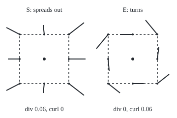

# Divergence and curl: how much a field spreads out and how much it spins

Calculus and analysis → Vector Calculus → Spreading and spinning → Divergence and curl

---

## General Overview

A breeze of about 3 m/s blows east past a weather mast, but not evenly. At spot S, 40 m east, the air speeds up and fans out: a cold gust from above spreads across the ground. At spot E, 50 m north, the air runs slower than just south of it and drifts north on its east side. Leaves dropped at E turn slowly anticlockwise.

Two numbers say what the air does at a spot, its own drift set aside. How fast air spreads out, per unit of area, is the **divergence**: 0.06 per second at S, zero at E. How fast it circulates round the spot, per unit of area, is the **curl**: zero at S, 0.06 per second at E. S is a source; E, an eddy. Both are built from the wind's **partial derivatives**, its rates of change east and north ([partial-derivatives](../07-Several%20Variables/01-partial-derivatives.md)).

### The picture: the wind at S and at E, with each spot's own wind taken away

<p align="center"></p>

To scale: dashed squares 20 m across at 5 units per metre; arrows from the dots at 80 units per m/s, each the wind there minus the wind at the centre. North is up.

**Divergence is a field's outflow from a point per unit of area; curl is its circulation round the point per unit of area, one part per plane; both are sums and differences of partial derivatives.**

**What kind of fact this is:** a definition; that the formulas equal those limits is a theorem, proved on this card in Why it works.

---

## The formula

Notation first, in words. A **vector field** $F$ puts an arrow at every point: here the wind, with east, north and upward parts $P$, $Q$, $R$ in m/s, at the point $x$ m east, $y$ m north and $z$ m up from the mast. Its divergence is written $\operatorname{div} F$, its curl $\operatorname{curl} F$; many books write $\nabla \cdot F$ and $\nabla \times F$, "del dot F" and "del cross F".

$$\operatorname{div} F = \frac{\partial P}{\partial x}+\frac{\partial Q}{\partial y}+\frac{\partial R}{\partial z}$$

**Read it aloud:** add each part's rate of change along its own direction.

$$\operatorname{curl} F = \left(\frac{\partial R}{\partial y}-\frac{\partial Q}{\partial z},\ \frac{\partial P}{\partial z}-\frac{\partial R}{\partial x},\ \frac{\partial Q}{\partial x}-\frac{\partial P}{\partial y}\right)$$

**Read it aloud:** for each axis, the turning in the plane at right angles to it: one cross rate minus the other.

The curl is a vector along the spin axis, by the right-hand rule: fingers with the turning, thumb along the curl. A flat wind, unchanging with height, keeps only the last part, $\partial Q/\partial x - \partial P/\partial y$, pointing up for anticlockwise turning seen from above. The card's wind:

$$P = 3 + 0.0003\,(x^2 - y^2) + x^3/400000, \qquad Q = 0.0006\,xy, \qquad R = 0$$

Each rate is m/s per metre, so divergence and curl are **per second**.

| Symbol | Plain meaning | In our example | Push it up and the answer… |
| --- | --- | --- | --- |
| $F$; $P$, $Q$, $R$ | the wind; its east, north, up parts, m/s | at S: 3.640, 0, 0 | neither number moves for a steady extra breeze |
| $x$, $y$, $z$ | metres east, north, up from the mast | S (40, 0), E (0, 50) | — |
| $\partial P/\partial x$, $\partial Q/\partial y$ | own-direction rates, per second | at S: 0.036, 0.024 | more divergence |
| $\partial Q/\partial x$, $\partial P/\partial y$ | cross rates, per second | at E: 0.030, −0.030 | — |
| $\operatorname{div} F$ | net outflow per unit area (volume, in space) | 0.06 at S | negative means gathering in |
| $\operatorname{curl} F$ | circulation per unit area, along the spin axis | (0, 0, 0.06) at E | faster turning |
| $\ell$, $\Phi$, $\Gamma$ | a small square's side; outflow across its edges; circulation along them | side 10 m: 0.0600625 at S, 0.06 at E, per unit area | — |
| $\omega$ | spin rate of a tiny patch of air, rad/s | 0.03 at E | half the curl |

### When it holds

A definition, meaningful under these conditions.

- **Continuous rates near the spot.** Across a sharp gust front the rates do not exist.
- **Right-handed axes.** Swap east and north and every curl changes sign.
- **Straight axes at right angles.** In polar or spherical coordinates the formulas gain extra terms.

---

## Why it works

### Step 0: close up, only the rates matter

Near a spot, the wind is the spot's own wind plus the four rates times the distances east and north. That own wind carries everything along together, so spreading and turning live in the rates.

### Step 1: outflow across a small square gives the divergence

Draw a square of side $\ell$ round the spot. Air leaves through the east edge at the east wind there, times $\ell$, and enters through the west edge likewise. The pair nets the change of $P$ across the square, times $\ell$: about $(\partial P/\partial x)\,\ell^2$. North and south give $(\partial Q/\partial y)\,\ell^2$. Divide the outflow $\Phi$ by the area:

$$\frac{\Phi}{\ell^2} \to \frac{\partial P}{\partial x} + \frac{\partial Q}{\partial y} \quad \text{as } \ell \to 0.$$

At S, edge sums with no derivatives give 0.061 for a 40 m square, 0.06025 for 20 m, 0.0600625 for 10 m, 0.060015625 for 5 m. The gap, from the $x^3$ term, falls four-fold as the side halves; to land within 0.0001 of 0.06, a 10 m square suffices. In space, a cube adds $\partial R/\partial z$.

### Step 2: circulation round a small square gives the curl

Walk the square anticlockwise, adding each edge's along-edge wind times its length: the **circulation** $\Gamma$ ([line-integrals](02-line-integrals.md)). The east edge, walked north, collects $Q$; the west edge, walked south, gives it back. The pair nets about $(\partial Q/\partial x)\,\ell^2$. The south edge is walked east and the north edge west, netting about $-(\partial P/\partial y)\,\ell^2$. So

$$\frac{\Gamma}{\ell^2} \to \frac{\partial Q}{\partial x} - \frac{\partial P}{\partial y} \quad \text{as } \ell \to 0.$$

At E, 0.030 − (−0.030) = 0.06, and the edge sums give 0.06 at every side, since this wind's curl changes evenly across the square. The other two curl parts are the same walk in the other two planes, anticlockwise seen from each axis's tip: the cross product's cyclic order ([cross-product-and-oriented-area](../../05-Geometry%20and%20trig/05-Vectors%20in%20Space/01-cross-product-and-oriented-area.md)).

<details>
<summary>Detailed proof: the square ratios tend to the formulas</summary>

With continuous rates the wind at offset $(u, v)$ is the spot's wind plus $(a u + b v,\ c u + d v)$, with $a, b, c, d$ the rates $\partial P/\partial x$, $\partial P/\partial y$, $\partial Q/\partial x$, $\partial Q/\partial y$, plus a remainder: for any $\varepsilon > 0$ some $\delta > 0$ keeps it at most $\varepsilon \cdot r$ at offsets of length $r < \delta$.

Take $\ell < \delta$. The constant wind cancels on opposite edges. The linear part gives exactly $(a + d)\ell^2$ of outflow, since east minus west is $\int_{-\ell/2}^{\ell/2} a\ell\,dv$, and $(c - b)\ell^2$ of circulation. Edge points lie within $\ell/\sqrt{2}$ of the spot, so the remainder adds at most $4\ell \cdot \varepsilon\ell/\sqrt{2} < 3\varepsilon\ell^2$. So both ratios lie within $3\varepsilon$ of $a + d$ and $c - b$, for any $\varepsilon > 0$. Cubes run the same way.

</details>

### Step 3: the curl is twice the spin

Lay two short straws on the air at E. The east straw's tip sits where the north wind is stronger, $\partial Q/\partial x$ being 0.030 per second, so it turns anticlockwise at 0.030 rad/s. The north straw's tip sits where the east wind is weaker, $\partial P/\partial y$ being −0.030, so it too turns anticlockwise at 0.030. Their average is the spin $\omega$ of a tiny patch: 0.03 rad/s, a turn in 209.4 s. The curl adds the two instead:

$$\operatorname{curl} F = 2\omega.$$

Rigid turning at $\omega$ gives both straws $\omega$, hence curl $2\omega$. Carried on the wind for 0.01 s in the code, each straw turns at 0.030000 rad/s.

### Step 4: a spin with a level axis

A breeze of 3 m/s at the ground, gaining 1 m/s per 10 m of height, has $P = 3 + z/10$ and nothing else. Its one rate is $\partial P/\partial z$, 0.1 per second, so its curl is (0, 0.1, 0), pointing north: faster air on top rolls it about a level north–south axis at 0.05 rad/s. A square walked in the east–up plane gives 0.1 per unit area.

A cross-check with [line-integrals](02-line-integrals.md): its wind force $(y/10, -1)$ N has curl −0.1 N/m, and the anticlockwise walk round its 40 m by 30 m field collects −120 J, curl times area. Side by side, small squares' inner edges cancel: that is [greens-theorem](06-greens-theorem.md).

---

## Worked numbers, by hand

| Step | Arithmetic | Value |
| --- | --- | --- |
| wind at S, (40, 0) | 3 + 0.0003 × 40^2 + 40^3/400000, and 0 north | 3.640 m/s east |
| own-direction rates at S | 0.0006 × 40 + 3 × 40^2/400000; 0.0006 × 40 | 0.036 and 0.024 |
| divergence at S | 0.036 + 0.024 | **0.06 per second** |
| cross rates at S | 0.0006 × 0; −0.0006 × 0 | curl 0 |
| wind at E, (0, 50) | 3 − 0.0003 × 50^2, and 0 north | 2.250 m/s east |
| cross rates at E | 0.0006 × 50; −0.0006 × 50 | 0.030 and −0.030 |
| curl at E | 0.030 − (−0.030) | **0.06 per second, pointing up** |
| spin at E | half the curl | **0.03 rad/s, a turn in 209.4 s** |

At S a patch of air grows by 0.06 of its area each second, fed from above. At E a leaf turns once every 209.4 s while drifting east at 2.250 m/s.

### What breaks if you drop a piece

| Mistake | Comes out at | What went wrong |
| --- | --- | --- |
| Curl read as the spin rate | 0.06 rad/s, a turn in 104.7 s, truly 209.4 s | Curl adds the straws' rates; spin averages them |
| Cross rates added at E | 0.000, not 0.060 | Opposite edges are walked opposite ways |
| Order swapped, $\partial P/\partial y - \partial Q/\partial x$ | −0.060: clockwise | The order fixes the right-hand direction |

The code prints all three.

---

## Code, from first principles, and it actually runs

Road one: the partial derivatives by hand. Road two, the definition: outflow and circulation round shrinking squares, edges summed by Simpson's rule (a parabola over each pair of strips), divided by area. Straws check the factor two; a second case covers the level axis and the sibling card's wind.

### Python

```python
# Divergence and curl -- the check behind the card.  Standard library only;
# math gives atan2 and pi as primitives, and every sum is written out here.
# Wind (P, Q, R) in m/s at the point x m east, y m north and z m up of a mast.
from math import atan2, pi

def W(x, y, z): return (3 + 0.0003 * (x * x - y * y) + x ** 3 / 400000, 0.0006 * x * y, 0.0)
def G(x, y, z): return (3 + z / 10, 0.0, 0.0)            # second case: a breeze growing with height
def rates(x, y):                                         # road one: the partial derivatives, by hand
    return {"dP/dx": 0.0006 * x + 3 * x * x / 400000, "dQ/dy": 0.0006 * x,
            "dQ/dx": 0.0006 * y, "dP/dy": 0 - 0.0006 * y}
def simpson(g, a, b, n=10):
    h = (b - a) / n
    return h / 3 * (g(a) + g(b) + sum((4 if k % 2 else 2) * g(a + k * h) for k in range(1, n)))
def box(F, c, li, lj, i=0, j=1):                         # road two, no derivatives: round an li x lj box
    def at(u, v):                                        # the field u along axis i and v along axis j from c
        p = list(c); p[i] += u; p[j] += v
        return F(*p)
    a, b = li / 2, lj / 2
    circ = (simpson(lambda u: at(u, -b)[i] - at(u, b)[i], -a, a)       # along the edges, i then j
            + simpson(lambda v: at(a, v)[j] - at(-a, v)[j], -b, b))
    out = (simpson(lambda u: at(u, b)[j] - at(u, -b)[j], -a, a)        # across the edges, outward
           + simpson(lambda v: at(a, v)[i] - at(-a, v)[i], -b, b))
    return circ, out
def turn(F, c, d, dt=0.01, L=1e-4):                     # a straw of length L along d, carried for dt
    root, tip = F(*c), F(c[0] + L * d[0], c[1] + L * d[1], c[2])
    v = (L * d[0] + (tip[0] - root[0]) * dt, L * d[1] + (tip[1] - root[1]) * dt)
    return (atan2(v[1], v[0]) - atan2(d[1], d[0])) / dt

S, E, res = (40.0, 0.0, 0.0), (0.0, 50.0, 0.0), {}
print("wind P = 3 + 0.0003(x^2 - y^2) + x^3/400000, Q = 0.0006xy, R = 0 m/s; S = (40, 0), E = (0, 50) m")
for name, c in (("S", S), ("E", E)):
    r = rates(c[0], c[1]); res[name] = (r["dP/dx"] + r["dQ/dy"], r["dQ/dx"] - r["dP/dy"], r)
    print(f"{name}: wind ({W(*c)[0]:.3f}, {W(*c)[1]:.3f}); " + ", ".join(f"{k} {v:.3f}" for k, v in r.items()))
    print(f"{name}: div {res[name][0]:.6f} per s, curl {res[name][1]:.6f} per s")
(dS, cS, _), (dE, cE, rE) = res["S"], res["E"]
for l in (40, 20, 10, 5):
    oS, cE_l = box(W, S, l, l)[1] / l ** 2, box(W, E, l, l)[0] / l ** 2
    print(f"side {l:2d} m: S outflow/area {oS:.9f}, gap {oS - dS:.9f}; E circulation/area {cE_l:.9f}")
    assert abs(oS - (dS + l * l / 1600000)) < 1e-12      # road two against road one plus the size term
    assert abs(cE_l - cE) < 1e-12                        # circulation per area against the hand curl
east, north = turn(W, E, (1, 0)), turn(W, E, (0, 1))
print(f"E: straws turn east {east:.6f}, north {north:.6f} rad/s; average {(east + north) / 2:.6f}; "
      f"curl/2 {cE / 2:.6f}; one turn in {2 * pi / (cE / 2):.1f} s")
assert abs((east + north) / 2 - cE / 2) < 1e-6           # the straws spin at half the curl
cG, oG = box(G, (0.0, 0.0, 10.0), 2, 2, 2, 0)            # plane z then x: anticlockwise seen from the north
cL = box(lambda x, y, z: (y / 10, -1.0, 0.0), (20.0, 15.0, 0.0), 40, 30)[0]
print(f"breeze 3 + z/10: curl by hand (0, {1 / 10:.1f}, 0); z-x square circulation/area {cG / 4:.6f}, "
      f"outflow {oG:.6f}; roll {cG / 8:.2f} rad/s")
print(f"line-integrals wind (y/10, -1) N: curl by hand {0 - 1 / 10:.1f} N/m; 40 m x 30 m anticlockwise {cL:.3f} J")
assert abs(cG / 4 - 1 / 10) < 1e-12 and abs(cL - (0 - 1 / 10) * 40 * 30) < 1e-9
print(f"mistake 1, curl read as spin: {cE:.2f} rad/s, one turn in {2 * pi / cE:.1f} s, truly {2 * pi / (cE / 2):.1f} s")
print(f"mistake 2, cross rates added at E: {rE['dQ/dx'] + rE['dP/dy']:.3f} per s, not {cE:.3f}")
print(f"mistake 3, order swapped at E: {rE['dP/dy'] - rE['dQ/dx']:.3f} per s, clockwise, not anticlockwise")
for name, c, cx in (("S", S, 90), ("E", E, 270)):
    w0, pts = W(*c), []
    for hx, hy in ((10, 0), (10, 10), (0, 10), (-10, 10), (-10, 0), (-10, -10), (0, -10), (10, -10)):
        w = W(c[0] + hx, c[1] + hy, 0.0)
        pts.append(f"({cx + 5 * hx},{120 - 5 * hy})->({cx + 5 * hx + 80 * (w[0] - w0[0]):.0f},{120 - 5 * hy - 80 * (w[1] - w0[1]):.0f})")
    print(f"figure, {name}, 5 units per m, 80 per m/s:", " ".join(pts))
print("ALL CHECKS PASS")
```

**Ran 2026-09-27 on macOS, Python 3.14.6, standard library only. All checks passed. Output, pasted from the run:**

```
wind P = 3 + 0.0003(x^2 - y^2) + x^3/400000, Q = 0.0006xy, R = 0 m/s; S = (40, 0), E = (0, 50) m
S: wind (3.640, 0.000); dP/dx 0.036, dQ/dy 0.024, dQ/dx 0.000, dP/dy 0.000
S: div 0.060000 per s, curl 0.000000 per s
E: wind (2.250, 0.000); dP/dx 0.000, dQ/dy 0.000, dQ/dx 0.030, dP/dy -0.030
E: div 0.000000 per s, curl 0.060000 per s
side 40 m: S outflow/area 0.061000000, gap 0.001000000; E circulation/area 0.060000000
side 20 m: S outflow/area 0.060250000, gap 0.000250000; E circulation/area 0.060000000
side 10 m: S outflow/area 0.060062500, gap 0.000062500; E circulation/area 0.060000000
side  5 m: S outflow/area 0.060015625, gap 0.000015625; E circulation/area 0.060000000
E: straws turn east 0.030000, north 0.030000 rad/s; average 0.030000; curl/2 0.030000; one turn in 209.4 s
breeze 3 + z/10: curl by hand (0, 0.1, 0); z-x square circulation/area 0.100000, outflow 0.000000; roll 0.05 rad/s
line-integrals wind (y/10, -1) N: curl by hand -0.1 N/m; 40 m x 30 m anticlockwise -120.000 J
mistake 1, curl read as spin: 0.06 rad/s, one turn in 104.7 s, truly 209.4 s
mistake 2, cross rates added at E: 0.000 per s, not 0.060
mistake 3, order swapped at E: -0.060 per s, clockwise, not anticlockwise
figure, S, 5 units per m, 80 per m/s: (140,120)->(174,120) (140,70)->(171,46) (90,70)->(88,51) (40,70)->(13,56) (40,120)->(16,120) (40,170)->(13,184) (90,170)->(88,189) (140,170)->(171,194)
figure, E, 5 units per m, 80 per m/s: (320,120)->(323,96) (320,70)->(296,41) (270,70)->(244,70) (220,70)->(196,99) (220,120)->(222,144) (220,170)->(244,189) (270,170)->(292,170) (320,170)->(344,151)
ALL CHECKS PASS
```

### Rust

Same numbers, same labels, built with `rustc --edition 2021 -O`.

```rust
// Divergence and curl -- the same check as the Python, in Rust.  No crates;
// atan2 and pi are primitives, and every sum is written out here.
// Wind (P, Q, R) in m/s at the point x m east, y m north and z m up of a mast.
use std::f64::consts::PI;
type Field<'a> = &'a dyn Fn(f64, f64, f64) -> [f64; 3];

fn w(x: f64, y: f64, _z: f64) -> [f64; 3] { [3.0 + 0.0003 * (x * x - y * y) + x.powi(3) / 400000.0, 0.0006 * x * y, 0.0] }
fn g(_x: f64, _y: f64, z: f64) -> [f64; 3] { [3.0 + z / 10.0, 0.0, 0.0] } // second case: a breeze growing with height
fn rates(x: f64, y: f64) -> [(&'static str, f64); 4] { // road one: the partial derivatives, by hand
    [("dP/dx", 0.0006 * x + 3.0 * x * x / 400000.0), ("dQ/dy", 0.0006 * x), ("dQ/dx", 0.0006 * y), ("dP/dy", 0.0 - 0.0006 * y)]
}
fn simpson(f: &dyn Fn(f64) -> f64, a: f64, b: f64) -> f64 {
    let n = 10;
    let h = (b - a) / n as f64;
    let mut s = f(a) + f(b);
    for k in 1..n { s += if k % 2 == 1 { 4.0 } else { 2.0 } * f(a + k as f64 * h) }
    h / 3.0 * s
}
fn bx(f: Field, c: [f64; 3], li: f64, lj: f64, i: usize, j: usize) -> (f64, f64) { // road two, no derivatives
    let at = |u: f64, v: f64| { let mut p = c; p[i] += u; p[j] += v; f(p[0], p[1], p[2]) };
    let (a, b) = (li / 2.0, lj / 2.0);
    let circ = simpson(&|u| at(u, -b)[i] - at(u, b)[i], -a, a) + simpson(&|v| at(a, v)[j] - at(-a, v)[j], -b, b);
    let out = simpson(&|u| at(u, b)[j] - at(u, -b)[j], -a, a) + simpson(&|v| at(a, v)[i] - at(-a, v)[i], -b, b);
    (circ, out)
}
fn turn(f: Field, c: [f64; 3], d: (f64, f64)) -> f64 { // a straw of length l along d, carried for dt
    let (dt, l) = (0.01, 1e-4);
    let (root, tip) = (f(c[0], c[1], c[2]), f(c[0] + l * d.0, c[1] + l * d.1, c[2]));
    let v = (l * d.0 + (tip[0] - root[0]) * dt, l * d.1 + (tip[1] - root[1]) * dt);
    (v.1.atan2(v.0) - d.1.atan2(d.0)) / dt
}

fn main() {
    let (s, e) = ([40.0, 0.0, 0.0], [0.0, 50.0, 0.0]);
    println!("wind P = 3 + 0.0003(x^2 - y^2) + x^3/400000, Q = 0.0006xy, R = 0 m/s; S = (40, 0), E = (0, 50) m");
    let mut res = Vec::new();
    for (name, c) in [("S", s), ("E", e)] {
        let r = rates(c[0], c[1]);
        let (div, curl) = (r[0].1 + r[1].1, r[2].1 - r[3].1);
        let wc = w(c[0], c[1], c[2]);
        let parts: Vec<String> = r.iter().map(|(k, v)| format!("{} {:.3}", k, v)).collect();
        println!("{}: wind ({:.3}, {:.3}); {}", name, wc[0], wc[1], parts.join(", "));
        println!("{}: div {:.6} per s, curl {:.6} per s", name, div, curl);
        res.push((div, curl, r));
    }
    let (ds, (ce, re)) = (res[0].0, (res[1].1, res[1].2));
    for l in [40.0_f64, 20.0, 10.0, 5.0] {
        let (os, cel) = (bx(&w, s, l, l, 0, 1).1 / l.powi(2), bx(&w, e, l, l, 0, 1).0 / l.powi(2));
        println!("side {:2} m: S outflow/area {:.9}, gap {:.9}; E circulation/area {:.9}", l, os, os - ds, cel);
        assert!((os - (ds + l * l / 1600000.0)).abs() < 1e-12); // road two against road one plus the size term
        assert!((cel - ce).abs() < 1e-12); // circulation per area against the hand curl
    }
    let (east, north) = (turn(&w, e, (1.0, 0.0)), turn(&w, e, (0.0, 1.0)));
    println!("E: straws turn east {:.6}, north {:.6} rad/s; average {:.6}; curl/2 {:.6}; one turn in {:.1} s",
             east, north, (east + north) / 2.0, ce / 2.0, 2.0 * PI / (ce / 2.0));
    assert!(((east + north) / 2.0 - ce / 2.0).abs() < 1e-6); // the straws spin at half the curl
    let (cg, og) = bx(&g, [0.0, 0.0, 10.0], 2.0, 2.0, 2, 0); // plane z then x: anticlockwise seen from the north
    let cl = bx(&|_x: f64, y: f64, _z: f64| [y / 10.0, -1.0, 0.0], [20.0, 15.0, 0.0], 40.0, 30.0, 0, 1).0;
    println!("breeze 3 + z/10: curl by hand (0, {:.1}, 0); z-x square circulation/area {:.6}, outflow {:.6}; roll {:.2} rad/s",
             1.0 / 10.0, cg / 4.0, og, cg / 8.0);
    println!("line-integrals wind (y/10, -1) N: curl by hand {:.1} N/m; 40 m x 30 m anticlockwise {:.3} J", 0.0 - 1.0 / 10.0, cl);
    assert!((cg / 4.0 - 1.0 / 10.0).abs() < 1e-12 && (cl - (0.0 - 1.0 / 10.0) * 40.0 * 30.0).abs() < 1e-9);
    println!("mistake 1, curl read as spin: {:.2} rad/s, one turn in {:.1} s, truly {:.1} s", ce, 2.0 * PI / ce, 2.0 * PI / (ce / 2.0));
    println!("mistake 2, cross rates added at E: {:.3} per s, not {:.3}", re[2].1 + re[3].1, ce);
    println!("mistake 3, order swapped at E: {:.3} per s, clockwise, not anticlockwise", re[3].1 - re[2].1);
    for (name, c, cx) in [("S", s, 90.0), ("E", e, 270.0)] {
        let w0 = w(c[0], c[1], c[2]);
        let pts: Vec<String> = [(10.0, 0.0), (10.0, 10.0), (0.0, 10.0), (-10.0, 10.0), (-10.0, 0.0), (-10.0, -10.0), (0.0, -10.0), (10.0, -10.0)]
            .iter().map(|&(hx, hy): &(f64, f64)| {
                let wv = w(c[0] + hx, c[1] + hy, 0.0);
                format!("({},{})->({:.0},{:.0})", cx + 5.0 * hx, 120.0 - 5.0 * hy,
                        cx + 5.0 * hx + 80.0 * (wv[0] - w0[0]), 120.0 - 5.0 * hy - 80.0 * (wv[1] - w0[1]))
            }).collect();
        println!("figure, {}, 5 units per m, 80 per m/s: {}", name, pts.join(" "));
    }
    println!("ALL CHECKS PASS");
}
```

**Ran 2026-09-27 on macOS, rustc 1.98.1, no crates. All checks passed. Output, pasted from the run:**

```
wind P = 3 + 0.0003(x^2 - y^2) + x^3/400000, Q = 0.0006xy, R = 0 m/s; S = (40, 0), E = (0, 50) m
S: wind (3.640, 0.000); dP/dx 0.036, dQ/dy 0.024, dQ/dx 0.000, dP/dy 0.000
S: div 0.060000 per s, curl 0.000000 per s
E: wind (2.250, 0.000); dP/dx 0.000, dQ/dy 0.000, dQ/dx 0.030, dP/dy -0.030
E: div 0.000000 per s, curl 0.060000 per s
side 40 m: S outflow/area 0.061000000, gap 0.001000000; E circulation/area 0.060000000
side 20 m: S outflow/area 0.060250000, gap 0.000250000; E circulation/area 0.060000000
side 10 m: S outflow/area 0.060062500, gap 0.000062500; E circulation/area 0.060000000
side  5 m: S outflow/area 0.060015625, gap 0.000015625; E circulation/area 0.060000000
E: straws turn east 0.030000, north 0.030000 rad/s; average 0.030000; curl/2 0.030000; one turn in 209.4 s
breeze 3 + z/10: curl by hand (0, 0.1, 0); z-x square circulation/area 0.100000, outflow 0.000000; roll 0.05 rad/s
line-integrals wind (y/10, -1) N: curl by hand -0.1 N/m; 40 m x 30 m anticlockwise -120.000 J
mistake 1, curl read as spin: 0.06 rad/s, one turn in 104.7 s, truly 209.4 s
mistake 2, cross rates added at E: 0.000 per s, not 0.060
mistake 3, order swapped at E: -0.060 per s, clockwise, not anticlockwise
figure, S, 5 units per m, 80 per m/s: (140,120)->(174,120) (140,70)->(171,46) (90,70)->(88,51) (40,70)->(13,56) (40,120)->(16,120) (40,170)->(13,184) (90,170)->(88,189) (140,170)->(171,194)
figure, E, 5 units per m, 80 per m/s: (320,120)->(323,96) (320,70)->(296,41) (270,70)->(244,70) (220,70)->(196,99) (220,120)->(222,144) (220,170)->(244,189) (270,170)->(292,170) (320,170)->(344,151)
ALL CHECKS PASS
```

The two outputs match line for line.

> [!TIP]
> **Try changing**
> Guess first, then run it.
> - **Add a steady north breeze.** In `W`, make the north part `0.0006 * x * y + 2`. Only the wind lines change.
> - **Drop the cubic from the wind.** In `W`, delete `+ x ** 3 / 400000`. Squares round S give 0.048 against the hand rates' 0.06; the first assert stops the run.
> - **Longer straws.** Set `L=1` in `turn`. The north straw reads about 0.0303: a 1 m straw spans changing rates; the third assert stops the run.

---

## The usual mistake

> [!warning]
> **Curl is not wind going round in circles.** At E the wind blows straight east at 2.250 m/s, yet its curl is 0.06 per second: the turning lives in how the wind changes across space. Conversely, water circling a drain far from its centre has zero curl; [conservative-fields-and-potentials](04-conservative-fields-and-potentials.md) shows what that costs.
>
> - **Strong wind is not a source.** The wind at S is 3.640 m/s, the divergence 0.06 per second: change of speed matters, not speed.
> - **Zero both is not stillness.** A wind of $(0.01x, -0.01y)$ m/s has divergence 0 and curl 0, yet stretches a square east–west and squeezes it north–south. Two numbers cannot hold all four rates.

---

## Where you meet it in real life

- **Weather.** Air spreading at the ground, as at S, is fed from above; air gathering in must rise. Forecasters follow storms by the wind's curl, called vorticity.
- **Fluid flow.** Water cannot be squeezed, so its velocity has zero divergence where nothing is pumped in: continuity-and-bernoulli.
- **Electric charge.** The electric field's divergence is the charge density, up to a constant: electrostatics-gauss-and-potential.

> **Say it back**
> Divergence adds each part's rate along its own direction: outflow per unit area round a shrinking square. Curl subtracts the cross rates: circulation per unit area, along the spin axis. S spreads at 0.06 per second without turning; E turns with curl 0.06 per second without spreading. A patch of air at E spins at half the curl.

---

## What this builds on

- [partial-derivatives](../07-Several%20Variables/01-partial-derivatives.md): the four rates, each taken with the other coordinates held still.
- [cross-product-and-oriented-area](../../05-Geometry%20and%20trig/05-Vectors%20in%20Space/01-cross-product-and-oriented-area.md): the right-hand rule and the cyclic order that set the curl's direction.

## Where this goes next

- [conservative-fields-and-potentials](04-conservative-fields-and-potentials.md): zero curl as the test for a gradient field, and where it fails.
- [surface-integrals-and-flux](05-surface-integrals-and-flux.md): outflow across a curved surface.
- electrostatics-gauss-and-potential: divergence of the electric field as charge.
- continuity-and-bernoulli: zero divergence as conservation of fluid.
- navier-stokes-derivation: both operators in the fluid equations.
- vorticity-and-the-euler-equations: the curl of a flow, followed in time.
- exterior-derivative: gradient, curl and divergence as one operation.

Divergence and curl work one point at a time; what local spreading adds up to over a solid is [divergence-theorem](07-divergence-theorem.md), and local spin over a surface, [stokes-theorem](08-stokes-theorem.md).

---

## Sources

Verified 2026-09-28: every link below resolves to the page named.

- Strang, Gilbert, Edwin Herman, et al. *Calculus Volume 3*, OpenStax, 2016. [Section 6.5, Divergence and Curl](https://openstax.org/books/calculus-volume-3/pages/6-5-divergence-and-curl). The component formulas and the del notation.
- MIT 18.02SC *Multivariable Calculus*, supplementary notes V4.3, "Physical meaning of curl". [PDF](https://www.mit.edu/~hlb/1802/notes-apm-jmo/apm-tex-jmo/MIT18_02SC_MNotes_v4.3.pdf). The curl as twice the angular velocity of a small paddle wheel.
- Schey, H. M. *Div, Grad, Curl, and All That*, 4th ed. W. W. Norton, 2005. [Publisher page](https://wwnorton.com/books/9780393925166). Both operators built from flux and circulation round shrinking loops.
