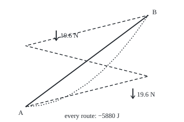
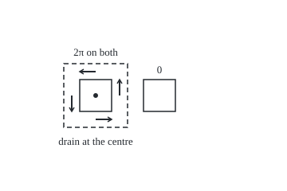

# Conservative fields: when work depends only on the endpoints

[Syllabus](../../../SYLLABUS.md) → [Calculus and analysis](../../../SYLLABUS.md#w06) → [Vector Calculus](../../../SYLLABUS.md#w06-s09) → Conservative fields

---

## General Overview

A walker carries a 2 kg water bottle from a trailhead A to a hut B, 400 m further east and 300 m higher. Gravity pulls the bottle down with 2 kg × 9.8 m/s^2 = 19.6 newtons (N), at every point of the hillside.

Straight up the slope, gravity does −5880 J of work (work: force along the motion times distance, in joules; negative means the walker supplies it). A curving trail: −5880 J. Three switchbacks: −5880 J. Sideways walking costs nothing: the pull is straight down.

On [Line integrals of a field](02-line-integrals.md) a shearing wind gave four routes four answers. A field whose work depends only on the two ends is **conservative**. A function of position whose change gives that work, here −19.6 N times height, is a **potential**.

<p align="center"></p>

To scale, 0.6 units per metre; arrows 1 unit per newton. Solid: straight. Dotted: curving. Dashed: switchbacks.

**A field that is the gradient of a potential does work equal to the potential's change, whatever the route; zero curl detects such fields near each point, and a hole can defeat the test.**

**What kind of fact this is:** a theorem, proved in Why it works, except the global step of the no-holes converse, which follows from [Green's theorem](06-greens-theorem.md).

---

## The formula

Notation first, in words. A field $F$ puts an arrow at every point; $P$ is its east part and $Q$ its upward part. The gradient $\nabla\phi$ of a function $\phi$ is the arrow of its two partial rates, $(\partial\phi/\partial x, \partial\phi/\partial y)$ ([Gradient](../07-Several%20Variables/03-gradient-and-directional-derivatives.md)). A **potential** for $F$ is a function with $\nabla\phi = F$.

$$W = \int_C F \cdot dr = \phi(B) - \phi(A)$$

**Read it aloud:** the work along any route from A to B is the potential at B minus the potential at A.

The test, for a field with continuous partial rates:

$$\text{a potential exists} \;\Rightarrow\; \frac{\partial Q}{\partial x} = \frac{\partial P}{\partial y}$$

**Read it aloud:** the upward part's rate going east equals the east part's rate going up. Their difference is the curl ([Divergence and curl](03-divergence-and-curl.md)), so a conservative field has zero curl; the converse needs a region with no holes.

| Symbol | Plain meaning | In our example | Push it up and the answer… |
| --- | --- | --- | --- |
| $F$, $P$, $Q$ | the field; its east and upward parts, newtons | bottle: $(0, -19.6)$ N | more work on every route |
| $x$, $y$; $r(t)$, $t$ | metres east and up; position at clock reading t | straight: $(400t, 300t)$ | — |
| $C$, $A$, $B$ | the route, its start and its end | A $(0, 0)$, B $(400, 300)$ | reversing C flips the sign |
| $W$ | work done by the field along C, joules | −5880 J | — |
| $\phi$, $U$ | the potential, with $\nabla\phi = F$; potential energy $U = -\phi$ | $\phi = -19.6y$, $U = 19.6y$ | a constant added changes no work |
| $\partial P/\partial y$, $\partial Q/\partial x$ | the cross rates the test compares | both 0 for the bottle | unequal: no potential |
| $m$, $g$, $h$ | mass, surface gravity, height gained | 2 kg, 9.8 m/s^2, 300 m | work −mgh grows with each |
| $k$, $R$, $r$ | pull constant $gR^2$ per kg; planet radius; distance from centre (no clock t) | $R$ = 6,371 km | $\phi = k/r$ grows as r shrinks |

Physics writes $F = -\nabla U$, so work is the drop in potential energy. Both conventions give −5880 J here.

### When it holds

- **An open, connected region and a continuous field.** Open: edges left out; connected: one piece. Split the region and each piece may take its own constant.
- **Routes inside the region.** A route through the whirlpool's drain, below, meets a point with no field.
- **A field steady in time.** A growing magnetic field drives an electric field whose loop work is not zero.
- **For the converse, no holes.** Round a hole, zero curl gives a potential only near each point: the whirlpool gets 2π per lap.

---

## Why it works

### Step 0: a potential is a height map for work

If a function's rise over each small step equals the field's work on that step, adding the steps cancels every middle value; only the ends survive.

### Step 1: the endpoint formula

Along a route $r(t)$, the chain rule ([Chain rule in several variables](../07-Several%20Variables/04-multivariable-chain-rule-and-jacobians.md)) gives the potential's rate along the route:

$$\frac{d}{dt}\,\phi(r(t)) = \nabla\phi(r(t)) \cdot r'(t) = F(r(t)) \cdot r'(t).$$

The right side is the line integral's integrand, so the integral is the potential's change: $\phi(B) - \phi(A)$, by the fundamental theorem of calculus ([Fundamental theorem of calculus](../04-Integrals/02-fundamental-theorem-of-calculus.md)).

For the bottle, $\phi = -19.6y$ has gradient $(0, -19.6)$, so every trail gives −19.6 × 300 = −5880 J.

### Step 2: same ends, same work is the same as zero round every loop

Up one trail and down another is a loop; going down flips the second route's sign. So zero on every loop means every pair of routes agrees, and the reverse.

### Step 3: route-independence builds the potential

Fix a base point. Call the work from there to any point that point's potential; route-independence makes it one number. A short extra step east adds about $P$ times the step, so the eastward rate is $P$; likewise upward, $Q$.

<details>
<summary>Detailed proof: path independence gives a potential</summary>

Let $F$ be continuous on an open connected region D, with route-independent work. Fix p in D and let φ(q) be the work from p to q. For small |s| the segment from q to q + (s, 0) lies in D, so
$$\phi(q + (s, 0)) - \phi(q) = \int_0^s P(q + (u, 0))\,du.$$
P is continuous: for every ε > 0 some δ > 0 keeps |P(q + (u, 0)) − P(q)| < ε when |u| < δ. So for |s| < δ the difference quotient is within ε of P(q), and ∂φ/∂x = P(q). Likewise ∂φ/∂y = Q(q). Two potentials differ by a function with zero gradient, constant on a connected region.

</details>

### Step 4: the test, and why a potential passes it

If $\nabla\phi = F$, then $P = \partial\phi/\partial x$ and $Q = \partial\phi/\partial y$. So $\partial P/\partial y$ and $\partial Q/\partial x$ are the two mixed second rates of φ, which agree when they are continuous ([Partial derivatives](../07-Several%20Variables/01-partial-derivatives.md)). Zero curl is necessary.

Far from the ground gravity weakens. Per kilogram, a planet pulls toward its centre with strength $k/r^2$; $k = gR^2$ makes it 9.8 N at the surface. As a field, $F = -k\,(x, y)/r^3$. By the quotient rule both cross rates are $3kxy/r^5$, 0.107331 at (1, 2) with k = 1: the test passes.

### Step 5: finding the potential

Integrate the east part in x, holding y fixed. The constant of integration may depend on y; call it c(y), and choose it so the upward rate matches $Q$.

For the planet, $\int -kx\,(x^2 + y^2)^{-3/2}\,dx = k\,(x^2+y^2)^{-1/2} + c(y)$. Its upward rate is already $-ky/r^3 = Q$, so c(y) is a constant: $\phi = k/r$. From the surface to twice the radius the work is $k/2R - k/R = -gR/2$, −31.2179 MJ per kg, straight out or by a quarter-circle, a climb and a quarter-circle back; the pull is across the arcs.

For the bottle's 300 m climb, $2(k/(R + 300) - k/R)$ = −5879.72 J against $-mgh$ = −5880 J: the hillside potential is the planet's, seen close up.

<details>
<summary>Detailed proof: zero curl gives a potential on a rectangle</summary>

Let P and Q have continuous partial rates on an open rectangle, with ∂Q/∂x = ∂P/∂y. Pick (a, b) in it and define
$$\phi(x, y) = \int_a^x P(s, b)\,ds + \int_b^y Q(x, s)\,ds.$$
The fundamental theorem gives ∂φ/∂y = Q(x, y). Differentiating under the integral sign, allowed as ∂Q/∂x is continuous,
$$\frac{\partial\phi}{\partial x} = P(x, b) + \int_b^y \frac{\partial Q}{\partial x}(x, s)\,ds = P(x, b) + \int_b^y \frac{\partial P}{\partial y}(x, s)\,ds = P(x, y).$$
Joining these local potentials into one needs no holes; that step is on [Green's theorem](06-greens-theorem.md).

</details>

### Step 6: the hole that breaks the test

Water circling a drain at the origin, strength 1 m^2/s, has velocity $F = (-y, x)/(x^2 + y^2)$ m/s, undefined at the drain. Both cross rates are $(y^2 - x^2)/(x^2+y^2)^2$, 0.12 at (1, 2): zero curl wherever it is defined.

Yet round a square of half-side 1 about the drain, the loop integral (the **circulation**) is 6.283185 m^2/s: 2π. Half-side 2 gives 2π again. A square beside the drain, centred at (4, 0), gives 0.

Near any point, the angle round the drain is a potential. Think of a car park ramp: each stretch climbs smoothly, yet one lap puts the car a floor higher. One lap adds 2π to the angle, so no single potential covers the hole.

<p align="center"></p>

To scale, 20 units per metre; arrows 30 units per m/s, 1.5 m from the drain. Solid: half-side 1 m, round and beside the drain. Dashed: half-side 2 m.

The wind on [Line integrals of a field](02-line-integrals.md) fails the test outright. The whirlpool passes it and fails anyway: the hole decides.

---

## Worked numbers, by hand

| Step | Arithmetic | Value |
| --- | --- | --- |
| gravity on the bottle | 2 kg × 9.8 m/s^2 | 19.6 N, down |
| test | ∂Q/∂x = 0, ∂P/∂y = 0 | passes |
| find the potential | ∫ 0 dx = c(y); c′(y) = −19.6 | $\phi = -19.6y$ |
| work, A to B, any trail | φ(B) − φ(A) = −19.6 × 300 − 0 | **−5880 J** |
| planet potential, per kg | ∫ P dx, c(y) constant | $\phi = k/r$ |
| surface to twice the radius | k/2R − k/R = −9.8 × 6,371,000 / 2 | **−31.2179 MJ** |
| whirlpool, one lap round the drain | the angle gains a full turn | **2π = 6.283185** |

The walker supplies 5880 J on any trail; lifting 1 kg to twice the radius takes 31.2179 MJ.

### What breaks if you drop a piece

| Mistake | Comes out at | What went wrong |
| --- | --- | --- |
| Zero curl, so every loop gives 0 | 0 predicted; the square gives 6.283185 | The test is local; the drain is a hole |
| Integrate P in x and stop | potential 0, work 0 J, not −5880 J | c(y) holds the height term |
| Use potential energy $U$ as the potential | +5880 J, not −5880 J | $F = -\nabla U$: the sign flips |
| Use g h for a climb of h = R | −62.4358 MJ per kg, not −31.2179 MJ | g weakens with distance |

---

## Code, from first principles, and it actually runs

Two roads to every work value: Simpson's rule (a strip sum fitting a parabola over each pair of strips) on $F(r(t)) \cdot r'(t)$ along each route, and the potential difference found by hand. The cross rates are difference quotients checked against the hand formulas. The whirlpool loops are squares, compared against π built by halving an interval until cos crosses zero.

### Python

```python
# Conservative fields -- the check behind the card.  Standard library only;
# math gives sqrt, sin and cos as primitives.  Road one adds F(r(t)).r'(t) by a
# Simpson sum written here; road two is the potential difference found by hand.
from math import sqrt, sin, cos

def simpson(f, n=200):               # integral of f over the clock t, from 0 to 1
    return (f(0) + f(1) + sum((4 if i % 2 else 2) * f(i / n) for i in range(1, n))) / (3 * n)
def work(F, legs):                   # road one: each leg is (position, velocity) on clock t
    return sum(simpson(lambda t: sum(a * b for a, b in zip(F(*r(t)), v(t)))) for r, v in legs)
def line(p, q):
    return (lambda t: (p[0] + (q[0] - p[0]) * t, p[1] + (q[1] - p[1]) * t), lambda t: (q[0] - p[0], q[1] - p[1]))
def arc(rho, a, b): return (lambda t: (rho * cos(a + (b - a) * t), rho * sin(a + (b - a) * t)),
                            lambda t: (-rho * (b - a) * sin(a + (b - a) * t), rho * (b - a) * cos(a + (b - a) * t)))
def sq(cx, s): c = ((cx - s, -s), (cx + s, -s), (cx + s, s), (cx - s, s)); return [line(c[i], c[(i + 1) % 4]) for i in range(4)]
lo, hi = 1.0, 2.0                    # pi built, not imported: cos crosses 0 at pi/2
for _ in range(60): lo, hi = ((lo + hi) / 2, hi) if cos((lo + hi) / 2) > 0 else (lo, (lo + hi) / 2)
PI, z = lo + hi, lambda v: round(v, 6) + 0.0     # z prints a rounding-sized -0 as 0

bottle = lambda x, y: (0.0, -2 * 9.8)            # 2 kg, g = 9.8 m/s^2
A, B = (0, 0), (400, 300)
trails = {"straight": [line(A, B)], "curve (400t, 300t^2)": [(lambda t: (400 * t, 300 * t * t), lambda t: (400, 600 * t))],
          "three switchbacks": [line(A, (400, 100)), line((400, 100), (0, 200)), line((0, 200), B)]}
drop = -2 * 9.8 * B[1] - (-2 * 9.8 * A[1])      # road two: phi = -19.6 y, end minus start
print("bottle, 2 kg: gravity (0, -19.6) N; trailhead A (0, 0) m to hut B (400, 300) m")
for name, legs in trails.items():
    print(f"{name}: Simpson {work(bottle, legs):.6f} J; potential difference {drop:.6f} J")
g, R = 9.8, 6371000.0
k = g * R * R                                    # planet, per kg: F = -k (x, y) / r^3, phi = k / r
planet = lambda x, y: (-k * x / sqrt(x * x + y * y) ** 3, -k * y / sqrt(x * x + y * y) ** 3)
out, far = work(planet, [line((R, 0), (2 * R, 0))]), k / (2 * R) - k / R
detour = work(planet, [arc(R, 0, PI / 2), line((0, R), (0, 2 * R)), arc(2 * R, PI / 2, 0)])
print(f"planet, per kg, R = {R:.0f} m, R to 2R: straight out {out / 1e6:.4f} MJ; arc, out, arc back {detour / 1e6:.4f} MJ; k/2R - k/R {far / 1e6:.4f} MJ")
print(f"planet, 2 kg lifted 300 m: 2 (k/(R + 300) - k/R) = {2 * (k / (R + 300) - k / R):.2f} J; m g h = {-2 * g * 300:.2f} J")
whirl = lambda x, y: (-y / (x * x + y * y), x / (x * x + y * y))
unit = lambda x, y: (-x / sqrt(x * x + y * y) ** 3, -y / sqrt(x * x + y * y) ** 3)
def curl_parts(F, x, y, h=1e-5):                 # difference quotients: dQ/dx and dP/dy
    return (F(x + h, y)[1] - F(x - h, y)[1]) / (2 * h), (F(x, y + h)[0] - F(x, y - h)[0]) / (2 * h)
cp, cw = curl_parts(unit, 1, 2), curl_parts(whirl, 1, 2)
hand_p, hand_w = 3 * 1 * 2 / sqrt(5) ** 5, (2 * 2 - 1 * 1) / 5 ** 2
print(f"curl test at (1, 2), planet with k = 1: dQ/dx {cp[0]:.6f}, dP/dy {cp[1]:.6f}; by hand 3xy/r^5 = {hand_p:.6f}")
print(f"curl test at (1, 2), whirlpool: dQ/dx {cw[0]:.6f}, dP/dy {cw[1]:.6f}; by hand (y^2 - x^2)/r^4 = {hand_w:.6f}")
round1, round2, beside = work(whirl, sq(0, 1)), work(whirl, sq(0, 2)), work(whirl, sq(4, 1))
print(f"whirlpool, square round the drain, half-side 1: {round1:.6f}; half-side 2: {round2:.6f}; 2 pi = {2 * PI:.6f}")
print(f"whirlpool, square beside the drain, centre (4, 0), half-side 1: {z(beside):.6f}")
print(f"mistake 1, zero curl so every loop gives 0: predicts 0, the square gives {round1:.6f}")
print(f"mistake 2, integrate P in x and stop: potential {z(simpson(lambda t: 400 * bottle(400 * t, 0)[0])):.0f}, work 0 J, not {drop:.0f} J")
print(f"mistake 3, potential energy U = 19.6 y used as phi: {2 * 9.8 * 300:.0f} J, not {drop:.0f} J")
print(f"mistake 4, g h per kg for a climb of h = R: {-g * R / 1e6:.4f} MJ, not {far / 1e6:.4f} MJ")
X, Y = (lambda x: 50 + 0.6 * x), (lambda y: 210 - 0.6 * y)
print("figure 1, 0.6 units per m, curve:", " ".join(f"({X(400 * t / 8):.1f},{Y(300 * (t / 8) ** 2):.1f})" for t in range(9)))
print(f"figure 1, switchback corners: ({X(400):.0f},{Y(100):.0f}) ({X(0):.0f},{Y(200):.0f}); arrows 1 unit per N: "
      f"({X(100):.0f},{Y(250):.0f})->({X(100):.0f},{Y(250) + 19.6:.1f}) ({X(350):.0f},{Y(60):.0f})->({X(350):.0f},{Y(60) + 19.6:.1f})")
print("figure 2, drain at (120,120), 20 units per m, arrows 30 units per m/s:", " ".join(
    f"({120 + 20 * x:.0f},{120 - 20 * y:.0f})->({120 + 20 * x + 30 * whirl(x, y)[0]:.0f},{120 - 20 * y - 30 * whirl(x, y)[1]:.0f})"
    for x, y in ((1.5, 0), (0, 1.5), (-1.5, 0), (0, -1.5))))
assert all(abs(work(bottle, legs) - drop) < 1e-6 for legs in trails.values())  # road one against road two
assert abs(out / far - 1) < 1e-9 and abs(detour / far - 1) < 1e-9             # the planet, both routes
assert all(abs(c - hand) < 1e-7 for pair, hand in ((cp, hand_p), (cw, hand_w)) for c in pair)
assert abs(round1 - 2 * PI) < 1e-8 and abs(round2 - 2 * PI) < 1e-8 and abs(beside) < 1e-8
print("ALL CHECKS PASS")
```

**Ran 2026-09-27 on macOS, Python 3.14.6, standard library only. All checks passed. Output, pasted from the run:**

```
bottle, 2 kg: gravity (0, -19.6) N; trailhead A (0, 0) m to hut B (400, 300) m
straight: Simpson -5880.000000 J; potential difference -5880.000000 J
curve (400t, 300t^2): Simpson -5880.000000 J; potential difference -5880.000000 J
three switchbacks: Simpson -5880.000000 J; potential difference -5880.000000 J
planet, per kg, R = 6371000 m, R to 2R: straight out -31.2179 MJ; arc, out, arc back -31.2179 MJ; k/2R - k/R -31.2179 MJ
planet, 2 kg lifted 300 m: 2 (k/(R + 300) - k/R) = -5879.72 J; m g h = -5880.00 J
curl test at (1, 2), planet with k = 1: dQ/dx 0.107331, dP/dy 0.107331; by hand 3xy/r^5 = 0.107331
curl test at (1, 2), whirlpool: dQ/dx 0.120000, dP/dy 0.120000; by hand (y^2 - x^2)/r^4 = 0.120000
whirlpool, square round the drain, half-side 1: 6.283185; half-side 2: 6.283185; 2 pi = 6.283185
whirlpool, square beside the drain, centre (4, 0), half-side 1: 0.000000
mistake 1, zero curl so every loop gives 0: predicts 0, the square gives 6.283185
mistake 2, integrate P in x and stop: potential 0, work 0 J, not -5880 J
mistake 3, potential energy U = 19.6 y used as phi: 5880 J, not -5880 J
mistake 4, g h per kg for a climb of h = R: -62.4358 MJ, not -31.2179 MJ
figure 1, 0.6 units per m, curve: (50.0,210.0) (80.0,207.2) (110.0,198.8) (140.0,184.7) (170.0,165.0) (200.0,139.7) (230.0,108.8) (260.0,72.2) (290.0,30.0)
figure 1, switchback corners: (290,150) (50,90); arrows 1 unit per N: (110,60)->(110,79.6) (260,174)->(260,193.6)
figure 2, drain at (120,120), 20 units per m, arrows 30 units per m/s: (150,120)->(150,100) (120,90)->(100,90) (90,120)->(90,140) (120,150)->(140,150)
ALL CHECKS PASS
```

### Rust

Same numbers, same labels, built with `rustc --edition 2021 -O`.

```rust
// Conservative fields -- the same check as the Python, in Rust.  No crates;
// sqrt, sin and cos are primitives.  Road one adds F(r(t)).r'(t) by a Simpson
// sum written here; road two is the potential difference found by hand.
type P = (f64, f64);
type Leg = (Box<dyn Fn(f64) -> P>, Box<dyn Fn(f64) -> P>); // position, velocity on clock t

fn simpson(f: &dyn Fn(f64) -> f64) -> f64 { // integral of f over the clock t, from 0 to 1
    let n = 200;
    let mut s = f(0.0) + f(1.0);
    for i in 1..n { s += if i % 2 == 1 { 4.0 } else { 2.0 } * f(i as f64 / n as f64) }
    s / (3.0 * n as f64)
}
fn work(f: &dyn Fn(f64, f64) -> P, legs: &[Leg]) -> f64 { // road one
    legs.iter().map(|(r, v)| simpson(&|t| { let (p, w) = (r(t), v(t)); let q = f(p.0, p.1); q.0 * w.0 + q.1 * w.1 })).sum()
}
fn line(p: P, q: P) -> Leg {
    (Box::new(move |t| (p.0 + (q.0 - p.0) * t, p.1 + (q.1 - p.1) * t)), Box::new(move |_| (q.0 - p.0, q.1 - p.1)))
}
fn arc(rho: f64, a: f64, b: f64) -> Leg {
    (Box::new(move |t: f64| (rho * (a + (b - a) * t).cos(), rho * (a + (b - a) * t).sin())),
     Box::new(move |t: f64| (-rho * (b - a) * (a + (b - a) * t).sin(), rho * (b - a) * (a + (b - a) * t).cos())))
}
fn sq(cx: f64, s: f64) -> Vec<Leg> {
    let c = [(cx - s, -s), (cx + s, -s), (cx + s, s), (cx - s, s)];
    (0..4).map(|i| line(c[i], c[(i + 1) % 4])).collect()
}
fn z(v: f64) -> f64 { (v * 1e6).round() / 1e6 + 0.0 } // prints a rounding-sized -0 as 0
fn curl_parts(f: &dyn Fn(f64, f64) -> P, x: f64, y: f64) -> P { // difference quotients: dQ/dx and dP/dy
    let h = 1e-5;
    ((f(x + h, y).1 - f(x - h, y).1) / (2.0 * h), (f(x, y + h).0 - f(x, y - h).0) / (2.0 * h))
}

fn main() {
    let (mut lo, mut hi) = (1.0f64, 2.0f64); // pi built, not imported: cos crosses 0 at pi/2
    for _ in 0..60 { let m = (lo + hi) / 2.0; if m.cos() > 0.0 { lo = m } else { hi = m } }
    let pi = lo + hi;
    let bottle = |_x: f64, _y: f64| (0.0, -2.0 * 9.8); // 2 kg, g = 9.8 m/s^2
    let (a, b) = ((0.0, 0.0), (400.0, 300.0));
    let curve: Leg = (Box::new(|t| (400.0 * t, 300.0 * t * t)), Box::new(|t| (400.0, 600.0 * t)));
    let trails: Vec<(&str, Vec<Leg>)> = vec![("straight", vec![line(a, b)]), ("curve (400t, 300t^2)", vec![curve]),
        ("three switchbacks", vec![line(a, (400.0, 100.0)), line((400.0, 100.0), (0.0, 200.0)), line((0.0, 200.0), b)])];
    let drop = -2.0 * 9.8 * b.1 - (-2.0 * 9.8 * a.1); // road two: phi = -19.6 y, end minus start
    println!("bottle, 2 kg: gravity (0, -19.6) N; trailhead A (0, 0) m to hut B (400, 300) m");
    for (name, legs) in &trails { println!("{}: Simpson {:.6} J; potential difference {:.6} J", name, work(&bottle, legs), drop) }
    let (g, r) = (9.8f64, 6371000.0f64);
    let k = g * r * r; // planet, per kg: F = -k (x, y) / r^3, phi = k / r
    let planet = |x: f64, y: f64| { let d = (x * x + y * y).sqrt().powi(3); (-k * x / d, -k * y / d) };
    let (out, far) = (work(&planet, &[line((r, 0.0), (2.0 * r, 0.0))]), k / (2.0 * r) - k / r);
    let detour = work(&planet, &[arc(r, 0.0, pi / 2.0), line((0.0, r), (0.0, 2.0 * r)), arc(2.0 * r, pi / 2.0, 0.0)]);
    println!("planet, per kg, R = {:.0} m, R to 2R: straight out {:.4} MJ; arc, out, arc back {:.4} MJ; k/2R - k/R {:.4} MJ", r, out / 1e6, detour / 1e6, far / 1e6);
    println!("planet, 2 kg lifted 300 m: 2 (k/(R + 300) - k/R) = {:.2} J; m g h = {:.2} J", 2.0 * (k / (r + 300.0) - k / r), -2.0 * g * 300.0);
    let whirl = |x: f64, y: f64| (-y / (x * x + y * y), x / (x * x + y * y));
    let unit = |x: f64, y: f64| { let d = (x * x + y * y).sqrt().powi(3); (-x / d, -y / d) };
    let (cp, cw) = (curl_parts(&unit, 1.0, 2.0), curl_parts(&whirl, 1.0, 2.0));
    let (hand_p, hand_w) = (3.0 * 1.0 * 2.0 / 5f64.sqrt().powi(5), (2.0 * 2.0 - 1.0 * 1.0) / 25.0);
    println!("curl test at (1, 2), planet with k = 1: dQ/dx {:.6}, dP/dy {:.6}; by hand 3xy/r^5 = {:.6}", cp.0, cp.1, hand_p);
    println!("curl test at (1, 2), whirlpool: dQ/dx {:.6}, dP/dy {:.6}; by hand (y^2 - x^2)/r^4 = {:.6}", cw.0, cw.1, hand_w);
    let (round1, round2, beside) = (work(&whirl, &sq(0.0, 1.0)), work(&whirl, &sq(0.0, 2.0)), work(&whirl, &sq(4.0, 1.0)));
    println!("whirlpool, square round the drain, half-side 1: {:.6}; half-side 2: {:.6}; 2 pi = {:.6}", round1, round2, 2.0 * pi);
    println!("whirlpool, square beside the drain, centre (4, 0), half-side 1: {:.6}", z(beside));
    println!("mistake 1, zero curl so every loop gives 0: predicts 0, the square gives {:.6}", round1);
    println!("mistake 2, integrate P in x and stop: potential {:.0}, work 0 J, not {:.0} J", z(simpson(&|t| 400.0 * bottle(400.0 * t, 0.0).0)), drop);
    println!("mistake 3, potential energy U = 19.6 y used as phi: {:.0} J, not {:.0} J", 2.0 * 9.8 * 300.0, drop);
    println!("mistake 4, g h per kg for a climb of h = R: {:.4} MJ, not {:.4} MJ", -g * r / 1e6, far / 1e6);
    let (sx, sy) = (|x: f64| 50.0 + 0.6 * x, |y: f64| 210.0 - 0.6 * y);
    let pts: Vec<String> = (0..9).map(|t| format!("({:.1},{:.1})", sx(400.0 * t as f64 / 8.0), sy(300.0 * (t as f64 / 8.0).powi(2)))).collect();
    println!("figure 1, 0.6 units per m, curve: {}", pts.join(" "));
    println!("figure 1, switchback corners: ({:.0},{:.0}) ({:.0},{:.0}); arrows 1 unit per N: ({:.0},{:.0})->({:.0},{:.1}) ({:.0},{:.0})->({:.0},{:.1})",
             sx(400.0), sy(100.0), sx(0.0), sy(200.0), sx(100.0), sy(250.0), sx(100.0), sy(250.0) + 19.6, sx(350.0), sy(60.0), sx(350.0), sy(60.0) + 19.6);
    let arrows: Vec<String> = [(1.5, 0.0), (0.0, 1.5), (-1.5, 0.0), (0.0, -1.5)].iter().map(|&(x, y): &(f64, f64)| {
        let w = whirl(x, y);
        format!("({:.0},{:.0})->({:.0},{:.0})", 120.0 + 20.0 * x, 120.0 - 20.0 * y, 120.0 + 20.0 * x + 30.0 * w.0, 120.0 - 20.0 * y - 30.0 * w.1)
    }).collect();
    println!("figure 2, drain at (120,120), 20 units per m, arrows 30 units per m/s: {}", arrows.join(" "));
    assert!(trails.iter().all(|(_, legs)| (work(&bottle, legs) - drop).abs() < 1e-6)); // road one against road two
    assert!((out / far - 1.0).abs() < 1e-9 && (detour / far - 1.0).abs() < 1e-9); // the planet, both routes
    assert!([(cp.0, hand_p), (cp.1, hand_p), (cw.0, hand_w), (cw.1, hand_w)].iter().all(|&(c, h)| (c - h).abs() < 1e-7));
    assert!((round1 - 2.0 * pi).abs() < 1e-8 && (round2 - 2.0 * pi).abs() < 1e-8 && beside.abs() < 1e-8);
    println!("ALL CHECKS PASS");
}
```

**Ran 2026-09-27 on macOS, rustc 1.98.1, no crates. All checks passed. Output, pasted from the run:**

```
bottle, 2 kg: gravity (0, -19.6) N; trailhead A (0, 0) m to hut B (400, 300) m
straight: Simpson -5880.000000 J; potential difference -5880.000000 J
curve (400t, 300t^2): Simpson -5880.000000 J; potential difference -5880.000000 J
three switchbacks: Simpson -5880.000000 J; potential difference -5880.000000 J
planet, per kg, R = 6371000 m, R to 2R: straight out -31.2179 MJ; arc, out, arc back -31.2179 MJ; k/2R - k/R -31.2179 MJ
planet, 2 kg lifted 300 m: 2 (k/(R + 300) - k/R) = -5879.72 J; m g h = -5880.00 J
curl test at (1, 2), planet with k = 1: dQ/dx 0.107331, dP/dy 0.107331; by hand 3xy/r^5 = 0.107331
curl test at (1, 2), whirlpool: dQ/dx 0.120000, dP/dy 0.120000; by hand (y^2 - x^2)/r^4 = 0.120000
whirlpool, square round the drain, half-side 1: 6.283185; half-side 2: 6.283185; 2 pi = 6.283185
whirlpool, square beside the drain, centre (4, 0), half-side 1: 0.000000
mistake 1, zero curl so every loop gives 0: predicts 0, the square gives 6.283185
mistake 2, integrate P in x and stop: potential 0, work 0 J, not -5880 J
mistake 3, potential energy U = 19.6 y used as phi: 5880 J, not -5880 J
mistake 4, g h per kg for a climb of h = R: -62.4358 MJ, not -31.2179 MJ
figure 1, 0.6 units per m, curve: (50.0,210.0) (80.0,207.2) (110.0,198.8) (140.0,184.7) (170.0,165.0) (200.0,139.7) (230.0,108.8) (260.0,72.2) (290.0,30.0)
figure 1, switchback corners: (290,150) (50,90); arrows 1 unit per N: (110,60)->(110,79.6) (260,174)->(260,193.6)
figure 2, drain at (120,120), 20 units per m, arrows 30 units per m/s: (150,120)->(150,100) (120,90)->(100,90) (90,120)->(90,140) (120,150)->(140,150)
ALL CHECKS PASS
```

The two outputs match line for line.

> [!TIP]
> **Try changing**
> Guess first, then run it.
> - **Tilt gravity.** In `bottle`, make the east part `0.5 * y`. The curving trail now disagrees with the others; the first assert stops the run.
> - **Move the beside-square onto the drain.** Change `sq(4, 1)` to `sq(0.5, 1)`. The drain is now inside, the loop gives 2π, and the last assert stops it.
> - **Coarsen the sum.** Change `n=200` to `n=4`. Both planet routes drift from k/2R − k/R; the second assert stops the run.

---

## The usual mistake

> [!warning]
> **Reading zero curl as a guarantee.** The test is local. The whirlpool has zero curl wherever it is defined, yet a loop round its drain gives 6.283185, not 0. The guarantee needs a region with no holes.
>
> - **Stopping after the first integral.** For the bottle it gives 0; all −5880 J hides in c(y).
> - **Potential energy for potential.** $U$ is $-\phi$; used as φ it gives +5880 J.
> - **−mgh at planetary scale.** One Earth radius up: −62.4358 MJ per kg, twice the true −31.2179 MJ.
> - **Two routes agreeing.** That proves nothing about a third; a potential does.

---

## Where you meet it in real life

- **Mechanics.** Gravity and springs are conservative, so energy bookkeeping replaces route integrals: Newton's laws.
- **Electric circuits.** A voltage is a potential difference, whatever path the charge takes: Electric fields.

> **Say it back**
> A field is conservative when its work depends only on the route's ends. That happens exactly when it is a potential's gradient, and then work is the potential's change. A potential forces equal cross rates, so zero curl is necessary. Without holes it is also enough; round a hole it is not, as the whirlpool's 2π per lap shows.

---

## What this builds on

- [Line integrals of a field](02-line-integrals.md): work along a route, its reversal rule, and a field where routes disagree.
- [Divergence and curl](03-divergence-and-curl.md): the curl, the quantity the test sets to zero.

## Where this goes next

- Electric fields: the electric potential, found this way.
- Closed and exact forms: zero curl and having a potential in any dimension, and why they agree without holes.
- De Rham cohomology: counting holes with such fields.

A hole can hide a loop worth 2π; fields that pass the test yet have no potential end up counting holes.

---

## Sources

Verified 2026-09-28: every link below opens the publisher's page for the cited work.

- Strang, Gilbert, Edwin Herman et al. *Calculus Volume 3*, OpenStax. [Section 6.3, Conservative Vector Fields](https://openstax.org/books/calculus-volume-3/pages/6-3-conservative-vector-fields). The endpoint theorem, the test, finding a potential, simply connected regions.
- Ling, Samuel J., Jeff Sanny, William Moebs et al. *University Physics Volume 1*, OpenStax. [Section 13.3, Gravitational Potential Energy and Total Energy](https://openstax.org/books/university-physics-volume-1/pages/13-3-gravitational-potential-energy-and-total-energy). The planet's potential and the close-up −mgh.
- Auroux, Denis, et al. *18.02SC Multivariable Calculus*, MIT OpenCourseWare, 2010. [Course page](https://ocw.mit.edu/courses/18-02sc-multivariable-calculus-fall-2010/). Gradient fields and the test, with worked problems.
