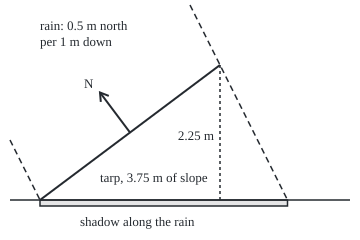

# Surface integrals: area of a curved sheet and flow through it

[Syllabus](../../../SYLLABUS.md) → [Calculus and analysis](../../../SYLLABUS.md#w06) → [Vector Calculus](../../../SYLLABUS.md#w06-s09) → Surface integrals

---

## General Overview

A tarp covers a garden bed 4 m wide and 3 m deep, south to north. Its south edge is pegged to the ground; its north edge is tied 2.25 m up. Rain falls at 10 mm an hour: 10 litres an hour on each square metre of level ground.

The fabric is 3.75 m of slope times 4 m: 15 m^2. Yet the catch is not rain on 15 m^2, 150 litres an hour. In still air the tarp catches what would have fallen on the 12 m^2 beneath it: 120 litres. Rain blown north, into the tarp's face, gives 165 litres; blown south, 75. The fabric never changed.

So a sheet carries two measures. **Surface area** counts how much sheet there is. **Flux**, the word used from here on, counts how much of a flow crosses it, signed by the side it crosses from. The cross product of the sheet's two tangent arrows gives both.

**Lift a ground grid onto the sheet: each cell becomes a parallelogram whose area is the length of a cross product and whose flux is the flow dotted with it; adding the cells gives area and flux.**

**What kind of fact this is:** a definition; that the answers do not depend on which grid is lifted is a theorem, proved on this card in Why it works.

### The picture: the tarp from the east, rain blown north

<p align="center"></p>

To scale, 60 px per metre, north to the right. Dashed: rain through the tarp's two edges. Every drop crossing the tarp lands in the shaded shadow, 4.125 m deep, so the tarp catches what 16.5 m^2 of open ground would. The arrow $N$ stands square to the top face.

---

## The formula

Notation first, in words. $x$, $y$, $z$ are metres east, north and up from the south-west peg. Two grid numbers $u$ and $v$, here the ground position, name a point of the sheet, $r(u, v)$. The taut tarp is $r(u, v) = (u, v, 0.75v)$ over the ground rectangle $D$. The tangent arrow $r_u$ is the partial derivative of $r$ in $u$: how far and which way the point moves per metre of $u$, with $v$ held still. $r_v$ is the same in $v$. Their cross product is the **area vector** $N = r_u \times r_v$. $F$ is the rain's flow: at each point, the arrow of water that passes in one hour, in metres per hour. $\Phi$ (phi) is the flux.

$$\text{Area}(S) = \iint_D \lVert r_u \times r_v \rVert \, du\, dv$$

**Read it aloud:** stretch each ground cell onto the sheet, measure the stretch by the length of the cross product, and add up. Weight each piece by kilograms per m^2 and the sum is the sheet's mass.

$$\Phi = \iint_S F \cdot n \, dS = \iint_D F(r(u,v)) \cdot (r_u \times r_v)\, du\, dv$$

**Read it aloud:** keep only the part of the flow that crosses square-on, weight it by each piece's area, and add up.

Here $dS = \lVert N \rVert\,du\,dv$ is the area of one small piece of sheet and $n = N/\lVert N\rVert$ is the unit normal: length 1, square to the sheet. In the second form, $N$'s length supplies $dS$ and its direction supplies $n$.

| Symbol | Plain meaning | In our example | Push it up and the answer… |
| --- | --- | --- | --- |
| $x$, $y$, $z$; $u$, $v$ | metres east, north, up; grid numbers | $u$ to 4, $v$ to 3 | — |
| $D$ | the grid's region | 4 m by 3 m, 12 m^2 | more area and more flux |
| $r$, $S$ | a point of the sheet; the whole sheet | $(u, v, 0.75v)$ | — |
| $r_u$, $r_v$ | tangent arrows, metres of sheet per metre of grid | (1, 0, 0), (0, 1, 0.75) | steeper sheet, longer arrow |
| $N$, $n$ | area vector; unit normal | (0, −0.75, 1), length 1.25 | 1.25 m^2 of fabric per m^2 of ground |
| $dS$ | area of one small piece | 1.25 times the ground cell | — |
| $F$, $w$ | rain's flow, metres of water per hour; its drift north | (0, $w$, −0.01), $w$ = 0.005 | more catch |
| $\Phi$ | flux, positive up through the top face | −165 L/h blown north | flips sign with the chosen side |

### When it holds

- **$N$ is never zero.** Where the tangent arrows line up or one shrinks to nothing, as at a cone's tip, a cell flattens to a line and has no normal.
- **Each point counted once.** A grid that covers the tarp twice reports twice the fabric.
- **Two sides.** Flux needs one side chosen throughout. A Möbius strip (a band with a half-twist) has one side, so flux through it means nothing; its area still does.
- **Smooth, apart from seams.** The tangent arrows vary continuously except along a few edges, which carry no area.

---

## Why it works

### Step 0: a small grid cell lifts to a small parallelogram

A ground cell $\Delta u$ by $\Delta v$ lifts to a patch whose edges are about $r_u \Delta u$ and $r_v \Delta v$. So the patch is nearly the parallelogram on those two edges.

### Step 1: its area is the length of a cross product

The parallelogram on two arrows has area equal to the length of their cross product ([Cross product](../../05-Geometry%20and%20trig/05-Vectors%20in%20Space/01-cross-product-and-oriented-area.md)), so the patch has area about $\lVert r_u \times r_v \rVert\, \Delta u\, \Delta v$.

For the tarp, $(1, 0, 0) \times (0, 1, 0.75) = (0, -0.75, 1)$, of length $\sqrt{0.75^2 + 1} = 1.25$. So 12 m^2 of ground lifts to 15 m^2 of tarp. Pythagoras agrees: the slope is $\sqrt{3^2 + 2.25^2} = 3.75$ m, times 4 m.

On a curved sheet the parallelogram is only nearly right, and the error fades as the cells shrink. Test it: let the middle sag 0.45 m, edges fixed, $z = 0.75y - 0.05\,x(4 - x)\,y(3 - y)$. The cross-product sum gives 15.370631 m^2. A second road: pin flat triangles to the sheet and measure each from its three sides (Heron's formula). With 10, 40 and 160 cells per side the mesh gives 15.366882, 15.370407, 15.370626 m^2, closing on the first road.

### Step 2: flow through a flat piece fills a slanted box

In one hour, the water crossing a flat piece of area A fills a slanted box: base the piece, slanted edge $F$. Its volume is base times height, and the height is the part of $F$ square to the piece, $F \cdot n$ ([Triple product](../../05-Geometry%20and%20trig/05-Vectors%20in%20Space/03-triple-product-and-volume.md)). Rain sliding along the fabric crosses nothing.

On a lifted cell the area is $\lVert N \rVert \Delta u \Delta v$ and $n = N / \lVert N \rVert$. The lengths cancel, leaving $F \cdot N\, \Delta u \Delta v$. Summed, that is the flux formula.

For the tarp in still air, $F \cdot N$ is −10 mm an hour, so −120 litres an hour over 12 m^2; the minus sign says the water goes down through the top face, against $N$. Blown south, −6.25 and −75.

### Step 3: the shadow gives the same answer

Every drop crossing the tarp lands in its shadow, cast along the rain onto the ground, and every drop landing there crossed the tarp. So the catch is 10 mm an hour times the shadow's area. Blown north, a drop drifts 0.5 m per metre fallen, so the top edge's shadow lands 4.125 m from the south peg: 16.5 m^2, 165 L/h. Blown south, 7.5 m^2 and 75 L/h. No normal, no cross product, same answers.

The sagging tarp has the same edges, so the same shadow and the same flux in every wind. The sag added fabric, not catch.

### Step 4: a different grid gives the same answers

Grid the tarp by metres of slope: $r(u, s) = (u, 0.8s, 0.6s)$ with s from 0 to 3.75. Now $N = (0, -0.6, 0.8)$, of length 1, on a 4 by 3.75 rectangle: still 15 m^2, still −120 L/h. In general a grid change stretches the cells by its Jacobian and $N$ by the same factor, and the two cancel.

<details>
<summary>Detailed proof: area and flux do not depend on the grid</summary>

Let a second grid be $u = u(s, t)$, $v = v(s, t)$, a smooth one-to-one map from a region E onto $D$ with smooth inverse, and $\rho(s, t) = r(u(s,t), v(s,t))$.

By the chain rule, $\rho_s = r_u u_s + r_v v_s$ and $\rho_t = r_u u_t + r_v v_t$. The cross product is linear in each slot, with $r_u \times r_u = 0$ and $r_v \times r_u = -\,r_u \times r_v$, so $\rho_s \times \rho_t = J\,N$, where J, the bracket $u_s v_t - u_t v_s$, is the Jacobian determinant.

Area: the integrand becomes $\lVert N \rVert$ times the size of J; the change-of-variables theorem ([Change of variables](../08-Multiple%20Integrals/03-change-of-variables-and-jacobians.md)) turns its integral over E into $\iint_D \lVert N \rVert\, du\, dv$.

Flux: the new integrand is $F \cdot N$ times J. On a connected region J, continuous and never zero, keeps one sign. Positive, the theorem returns the old flux; negative, the normal has switched sides and the flux flips.

In the slant grid $v = 0.8s$, so J = 0.8 and the new length is 0.8 × 1.25 = 1.

</details>

The curve versions are [Line integrals of a function](01-scalar-line-integrals.md) and [Line integrals of a field](02-line-integrals.md); [Surface area](../05-Curves%20and%20Solids/04-surface-area-of-revolution.md) is this formula with a spin angle as a grid number.

---

## Worked numbers, by hand

| Step | Arithmetic | Value |
| --- | --- | --- |
| tangent arrows | from $(u, v, 0.75v)$ | (1, 0, 0), (0, 1, 0.75) |
| area vector | their cross product | (0, −0.75, 1) |
| stretch | $\sqrt{0.75^2 + 1^2}$ | 1.25 |
| tarp area | 1.25 × 12 m^2 | **15 m^2** |
| rain dotted with area vector, blown north | 0.005 × (−0.75) + (−0.01) × 1 | −13.75 mm/h |
| flux | −13.75 mm/h × 12 m^2 | **−165 L/h** |

Rain driven north puts 165 litres an hour through the tarp, against 120 falling straight.

### What breaks if you drop a piece

| Mistake | Comes out at | What went wrong |
| --- | --- | --- |
| Ground area for tarp area | 12 m^2, not 15 | The stretch 1.25 was left out |
| Rain rate × tarp area, still air | 150 L/h, not 120 | Only the square-on part of the flow crosses |
| Unit normal with ground cells | 96 L/h, not 120 | $n$ has length 1, so the stretch went missing |
| $r_v \times r_u$ for $r_u \times r_v$ | +120 L/h, not −120 | The normal points down: same water, other side |

The code prints all four.

---

## Code, from first principles, and it actually runs

Road one: tangent arrows from difference quotients, then midpoint sums of $\lVert N \rVert$ and $F \cdot N$ on a 200 by 200 grid. Road two forms no cross product: Pythagoras and Heron for area; for flux, the shadow's area by the shoelace formula (half the sum of cross-multiplied corner coordinates). The asserts check the roads meet.

### Python

```python
# Surface integrals -- the check behind the card.  Tarp z = 0.75y over the ground
# rectangle 4 m by 3 m; rain F = (0, w, -0.01) metres of water per hour.  Road one
# adds |N| and F.N over small ground cells.  Road two forms no cross product:
# Pythagoras, a triangle mesh measured by Heron's formula, the shadow along the rain.
from math import sqrt

def cross(a, b): return (a[1]*b[2] - a[2]*b[1], a[2]*b[0] - a[0]*b[2], a[0]*b[1] - a[1]*b[0])
def dot(a, b): return sum(p * q for p, q in zip(a, b))
def flat(x, y): return 0.75 * y                                    # the tarp pulled taut
def sag(x, y): return 0.75 * y - 0.05 * x * (4 - x) * y * (3 - y)  # the same edges, sagging
WINDS = (("still air", 0.0), ("blown north", 0.005), ("blown south", -0.005))

def road_one(z, n=200, h=1e-5):             # midpoint sums; tangents by central differences
    area, flux, cell = 0.0, [0.0] * 3, (4 / n) * (3 / n)
    for i in range(n):
        for j in range(n):
            x, y = (i + 0.5) * 4 / n, (j + 0.5) * 3 / n
            N = cross((1, 0, (z(x + h, y) - z(x - h, y)) / (2 * h)), (0, 1, (z(x, y + h) - z(x, y - h)) / (2 * h)))
            area += sqrt(dot(N, N)) * cell
            for k, (_, w) in enumerate(WINDS): flux[k] += dot((0, w, -0.01), N) * cell
    return area, flux

def heron(p, q, s):                          # triangle area from its three side lengths
    a, b, c = (sqrt(sum((m - k) ** 2 for m, k in zip(P, Q))) for P, Q in ((p, q), (q, s), (s, p)))
    t = (a + b + c) / 2; return sqrt(max(t * (t - a) * (t - b) * (t - c), 0.0))

def road_two(z, n):                          # triangle mesh through points on the sheet
    P = lambda i, j: (4 * i / n, 3 * j / n, z(4 * i / n, 3 * j / n))
    return sum(heron(P(i, j), P(i + 1, j), P(i + 1, j + 1)) + heron(P(i, j), P(i + 1, j + 1), P(i, j + 1))
               for i in range(n) for j in range(n))

def shadow(z, w, m=400):                     # the edge, slid down the rain onto the ground; shoelace area
    edge = [(4 * k / m, 0) for k in range(m)] + [(4, 3 * k / m) for k in range(m)]
    edge += [(4 - 4 * k / m, 3) for k in range(m)] + [(0, 3 - 3 * k / m) for k in range(m)]
    pts = [(x, y + (w / 0.01) * z(x, y)) for x, y in edge]
    return abs(sum(p[0] * q[1] - q[0] * p[1] for p, q in zip(pts, pts[1:] + pts[:1]))) / 2

def vec(v): return "(" + ", ".join(f"{c:.2f}" for c in v) + ")"
N0 = cross((1, 0, 0), (0, 1, 0.75))                 # the taut tarp's area vector, exact
print(f"flat tarp: r_u = (1, 0, 0), r_v = (0, 1, 0.75), N = {vec(N0)}, |N| = {sqrt(dot(N0, N0)):.2f}")
A1, F1 = road_one(flat)
print(f"flat area: cross-product sum {A1:.6f} m^2; Pythagoras 4 x {sqrt(9 + 2.25 ** 2):.2f} = {4 * sqrt(9 + 2.25 ** 2):.6f} m^2")
for (name, w), f in zip(WINDS, F1):
    s = shadow(flat, w)
    print(f"flat, {name}: F.N = {1000 * dot((0, w, -0.01), N0):.2f} mm/h, sum {1000 * f:.3f} L/h; "
          f"shadow {s / 4:.3f} m deep, {s:.4f} m^2 x 10 mm/h = {10 * s:.3f} L/h")
    assert abs(1000 * f + 10 * s) < 1e-6                     # road one meets the shadow
print(f"slant chart: N = {vec(cross((1, 0, 0), (0, 0.8, 0.6)))}, area 4 x 3.75 = {4 * 3.75:.2f} m^2, still air {1000 * 15 * dot((0, 0, -0.01), cross((1, 0, 0), (0, 0.8, 0.6))):.3f} L/h")
(A2, F2), mesh = road_one(sag), [road_two(sag, n) for n in (10, 40, 160)]
print(f"sagging tarp, {0.75 * 1.5 - sag(2, 1.5):.2f} m deep at centre: cross-product sum {A2:.6f} m^2")
print("sagging area, Heron mesh 10, 40, 160 per side: " + ", ".join(f"{a:.6f}" for a in mesh))
print("sagging flux, L/h: " + ", ".join(f"{n} {1000 * f:.3f}" for (n, _), f in zip(WINDS, F2)))
print(f"mistake, ground area for tarp area: {12:.2f} m^2, not {A1:.2f}; rain rate x tarp area: {10 * A1:.3f} L/h, not {-1000 * F1[0]:.3f}")
print(f"mistake, unit normal with ground cells: {1000 * 12 * 0.01 / 1.25:.3f} L/h, not {-1000 * F1[0]:.3f}")
print(f"mistake, r_v x r_u (normal points down): {1000 * dot((0, 0, -0.01), cross((0, 1, 0.75), (1, 0, 0))) * 12:.3f} L/h")
print(f"figure, 60 px per m: tarp (40, 200) to ({40 + 60 * 3:.1f}, {200 - 60 * 2.25:.1f}); shadow ends at {40 + 60 * 3 * 1.375:.1f}; normal ({40 + 60 * 1.5:.1f}, {200 - 60 * 1.125:.1f}) to ({130 - 50 * 0.6:.1f}, {132.5 - 50 * 0.8:.1f})")
assert abs(A1 - 4 * sqrt(9 + 2.25 ** 2)) < 1e-6                 # cross product meets Pythagoras
assert abs(A2 - mesh[-1]) < 1e-3                                 # two roads to the curved area
assert all(abs(1000 * f + 10 * shadow(sag, w)) < 1e-3 for (_, w), f in zip(WINDS, F2))
print("ALL CHECKS PASS")
```

**Ran 2026-09-28 on macOS, Python 3.14.6, standard library only. All checks passed. Output, pasted from the run:**

```
flat tarp: r_u = (1, 0, 0), r_v = (0, 1, 0.75), N = (0.00, -0.75, 1.00), |N| = 1.25
flat area: cross-product sum 15.000000 m^2; Pythagoras 4 x 3.75 = 15.000000 m^2
flat, still air: F.N = -10.00 mm/h, sum -120.000 L/h; shadow 3.000 m deep, 12.0000 m^2 x 10 mm/h = 120.000 L/h
flat, blown north: F.N = -13.75 mm/h, sum -165.000 L/h; shadow 4.125 m deep, 16.5000 m^2 x 10 mm/h = 165.000 L/h
flat, blown south: F.N = -6.25 mm/h, sum -75.000 L/h; shadow 1.875 m deep, 7.5000 m^2 x 10 mm/h = 75.000 L/h
slant chart: N = (0.00, -0.60, 0.80), area 4 x 3.75 = 15.00 m^2, still air -120.000 L/h
sagging tarp, 0.45 m deep at centre: cross-product sum 15.370631 m^2
sagging area, Heron mesh 10, 40, 160 per side: 15.366882, 15.370407, 15.370626
sagging flux, L/h: still air -120.000, blown north -165.000, blown south -75.000
mistake, ground area for tarp area: 12.00 m^2, not 15.00; rain rate x tarp area: 150.000 L/h, not 120.000
mistake, unit normal with ground cells: 96.000 L/h, not 120.000
mistake, r_v x r_u (normal points down): 120.000 L/h
figure, 60 px per m: tarp (40, 200) to (220.0, 65.0); shadow ends at 287.5; normal (130.0, 132.5) to (100.0, 92.5)
ALL CHECKS PASS
```

### Rust

```rust
// Surface integrals -- the check behind the card.  Tarp z = 0.75y over the ground
// rectangle 4 m by 3 m; rain F = (0, w, -0.01) metres of water per hour.  Road one
// adds |N| and F.N over small ground cells.  Road two forms no cross product:
// Pythagoras, a triangle mesh measured by Heron's formula, the shadow along the rain.
type V = [f64; 3];
fn cross(a: V, b: V) -> V { [a[1] * b[2] - a[2] * b[1], a[2] * b[0] - a[0] * b[2], a[0] * b[1] - a[1] * b[0]] }
fn dot(a: V, b: V) -> f64 { a[0] * b[0] + a[1] * b[1] + a[2] * b[2] }
fn flat(_x: f64, y: f64) -> f64 { 0.75 * y } // the tarp pulled taut
fn sag(x: f64, y: f64) -> f64 { 0.75 * y - 0.05 * x * (4.0 - x) * y * (3.0 - y) } // the same edges, sagging
const WINDS: [(&str, f64); 3] = [("still air", 0.0), ("blown north", 0.005), ("blown south", -0.005)];

fn road_one(z: fn(f64, f64) -> f64) -> (f64, [f64; 3]) {
    let (n, h) = (200, 1e-5); // midpoint sums; tangents by central differences
    let (mut area, mut flux, cell) = (0.0, [0.0; 3], (4.0 / n as f64) * (3.0 / n as f64));
    for i in 0..n {
        for j in 0..n {
            let (x, y) = ((i as f64 + 0.5) * 4.0 / n as f64, (j as f64 + 0.5) * 3.0 / n as f64);
            let nn = cross([1.0, 0.0, (z(x + h, y) - z(x - h, y)) / (2.0 * h)], [0.0, 1.0, (z(x, y + h) - z(x, y - h)) / (2.0 * h)]);
            area += dot(nn, nn).sqrt() * cell;
            for (k, (_, w)) in WINDS.iter().enumerate() { flux[k] += dot([0.0, *w, -0.01], nn) * cell; }
        }
    }
    (area, flux)
}
fn dist(p: V, q: V) -> f64 { ((p[0] - q[0]).powi(2) + (p[1] - q[1]).powi(2) + (p[2] - q[2]).powi(2)).sqrt() }
fn heron(p: V, q: V, s: V) -> f64 { // triangle area from its three side lengths
    let (a, b, c) = (dist(p, q), dist(q, s), dist(s, p));
    let t = (a + b + c) / 2.0;
    (t * (t - a) * (t - b) * (t - c)).max(0.0).sqrt()
}
fn road_two(z: fn(f64, f64) -> f64, n: usize) -> f64 { // triangle mesh through points on the sheet
    let p = |i: usize, j: usize| { let (x, y) = (4.0 * i as f64 / n as f64, 3.0 * j as f64 / n as f64); [x, y, z(x, y)] };
    let mut s = 0.0;
    for i in 0..n { for j in 0..n { s += heron(p(i, j), p(i + 1, j), p(i + 1, j + 1)) + heron(p(i, j), p(i + 1, j + 1), p(i, j + 1)); } }
    s
}
fn shadow(z: fn(f64, f64) -> f64, w: f64) -> f64 { // the edge, slid down the rain onto the ground; shoelace area
    let m = 400;
    let mut edge: Vec<(f64, f64)> = Vec::new();
    for k in 0..m { edge.push((4.0 * k as f64 / m as f64, 0.0)); }
    for k in 0..m { edge.push((4.0, 3.0 * k as f64 / m as f64)); }
    for k in 0..m { edge.push((4.0 - 4.0 * k as f64 / m as f64, 3.0)); }
    for k in 0..m { edge.push((0.0, 3.0 - 3.0 * k as f64 / m as f64)); }
    let pts: Vec<(f64, f64)> = edge.iter().map(|&(x, y)| (x, y + (w / 0.01) * z(x, y))).collect();
    let mut s = 0.0;
    for k in 0..pts.len() { let (p, q) = (pts[k], pts[(k + 1) % pts.len()]); s += p.0 * q.1 - q.0 * p.1; }
    s.abs() / 2.0
}
fn vec(v: V) -> String { format!("({:.2}, {:.2}, {:.2})", v[0], v[1], v[2]) }

fn main() {
    let n0 = cross([1.0, 0.0, 0.0], [0.0, 1.0, 0.75]);
    println!("flat tarp: r_u = (1, 0, 0), r_v = (0, 1, 0.75), N = {}, |N| = {:.2}", vec(n0), dot(n0, n0).sqrt());
    let (a1, f1) = road_one(flat);
    let slant = (9.0f64 + 2.25f64.powi(2)).sqrt();
    println!("flat area: cross-product sum {:.6} m^2; Pythagoras 4 x {:.2} = {:.6} m^2", a1, slant, 4.0 * slant);
    for (k, (name, w)) in WINDS.iter().enumerate() {
        let s = shadow(flat, *w);
        println!("flat, {}: F.N = {:.2} mm/h, sum {:.3} L/h; shadow {:.3} m deep, {:.4} m^2 x 10 mm/h = {:.3} L/h",
            name, 1000.0 * dot([0.0, *w, -0.01], n0), 1000.0 * f1[k], s / 4.0, s, 10.0 * s);
        assert!((1000.0 * f1[k] + 10.0 * s).abs() < 1e-6); // road one meets the shadow
    }
    println!("slant chart: N = {}, area 4 x 3.75 = {:.2} m^2, still air {:.3} L/h", vec(cross([1.0, 0.0, 0.0], [0.0, 0.8, 0.6])), 4.0 * 3.75, 1000.0 * 15.0 * dot([0.0, 0.0, -0.01], cross([1.0, 0.0, 0.0], [0.0, 0.8, 0.6])));
    let (a2, f2) = road_one(sag);
    let mesh: Vec<f64> = [10, 40, 160].iter().map(|&n| road_two(sag, n)).collect();
    println!("sagging tarp, {:.2} m deep at centre: cross-product sum {:.6} m^2", 0.75 * 1.5 - sag(2.0, 1.5), a2);
    println!("sagging area, Heron mesh 10, 40, 160 per side: {:.6}, {:.6}, {:.6}", mesh[0], mesh[1], mesh[2]);
    let fl: Vec<String> = WINDS.iter().zip(f2.iter()).map(|((n, _), f)| format!("{} {:.3}", n, 1000.0 * f)).collect();
    println!("sagging flux, L/h: {}", fl.join(", "));
    println!("mistake, ground area for tarp area: {:.2} m^2, not {:.2}; rain rate x tarp area: {:.3} L/h, not {:.3}", 12.0, a1, 10.0 * a1, -1000.0 * f1[0]);
    println!("mistake, unit normal with ground cells: {:.3} L/h, not {:.3}", 1000.0 * 12.0 * 0.01 / 1.25, -1000.0 * f1[0]);
    println!("mistake, r_v x r_u (normal points down): {:.3} L/h", 1000.0 * dot([0.0, 0.0, -0.01], cross([0.0, 1.0, 0.75], [1.0, 0.0, 0.0])) * 12.0);
    println!("figure, 60 px per m: tarp (40, 200) to ({:.1}, {:.1}); shadow ends at {:.1}; normal ({:.1}, {:.1}) to ({:.1}, {:.1})", 40.0 + 60.0 * 3.0, 200.0 - 60.0 * 2.25, 40.0 + 60.0 * 3.0 * 1.375,
        40.0 + 60.0 * 1.5, 200.0 - 60.0 * 1.125, 130.0 - 50.0 * 0.6, 132.5 - 50.0 * 0.8);
    assert!((a1 - 4.0 * slant).abs() < 1e-6); // cross product meets Pythagoras
    assert!((a2 - mesh[2]).abs() < 1e-3); // two roads to the curved area
    for (k, (_, w)) in WINDS.iter().enumerate() { assert!((1000.0 * f2[k] + 10.0 * shadow(sag, *w)).abs() < 1e-3); }
    println!("ALL CHECKS PASS");
}
```

**Ran 2026-09-28 on macOS, rustc 1.98.1, no crates. All checks passed. Output, pasted from the run:**

```
flat tarp: r_u = (1, 0, 0), r_v = (0, 1, 0.75), N = (0.00, -0.75, 1.00), |N| = 1.25
flat area: cross-product sum 15.000000 m^2; Pythagoras 4 x 3.75 = 15.000000 m^2
flat, still air: F.N = -10.00 mm/h, sum -120.000 L/h; shadow 3.000 m deep, 12.0000 m^2 x 10 mm/h = 120.000 L/h
flat, blown north: F.N = -13.75 mm/h, sum -165.000 L/h; shadow 4.125 m deep, 16.5000 m^2 x 10 mm/h = 165.000 L/h
flat, blown south: F.N = -6.25 mm/h, sum -75.000 L/h; shadow 1.875 m deep, 7.5000 m^2 x 10 mm/h = 75.000 L/h
slant chart: N = (0.00, -0.60, 0.80), area 4 x 3.75 = 15.00 m^2, still air -120.000 L/h
sagging tarp, 0.45 m deep at centre: cross-product sum 15.370631 m^2
sagging area, Heron mesh 10, 40, 160 per side: 15.366882, 15.370407, 15.370626
sagging flux, L/h: still air -120.000, blown north -165.000, blown south -75.000
mistake, ground area for tarp area: 12.00 m^2, not 15.00; rain rate x tarp area: 150.000 L/h, not 120.000
mistake, unit normal with ground cells: 96.000 L/h, not 120.000
mistake, r_v x r_u (normal points down): 120.000 L/h
figure, 60 px per m: tarp (40, 200) to (220.0, 65.0); shadow ends at 287.5; normal (130.0, 132.5) to (100.0, 92.5)
ALL CHECKS PASS
```

> [!TIP]
> **Try changing**
> - **Deepen the sag, 0.05 → 0.1.** Guess first: the area grows; every flux stays put, since the edges cast the shadow.
> - **Blow rain south until it falls parallel to the tarp.** Guess first: the shadow flattens and the catch is nothing.
> - **Swap the arguments of `cross` in road one.** Guess first: every flux flips sign and the shadow assert fails.

---

## The usual mistake

> [!warning]
> **Flux as area times flow.** Only the square-on part crosses. The 15 m^2 tarp catches 120 L/h in still air, not 150: the slope that adds fabric turns it away from the rain, and the two cancel.
>
> - **Forgetting the stretch.** Integrating over the ground with no $\lVert N \rVert$ gives 12 m^2 of tarp, not 15.
> - **Mixing the forms.** $F \cdot n$ goes with $dS$; $F \cdot N$ goes with $du\,dv$. Crossing them gives 96 L/h.
> - **Ignoring the side.** Reversing the cross product turns −120 into +120.

---

## Where you meet it in real life

- **Roof drainage.** Gutters are sized from a roof's plan area, its shadow under vertical rain, plus an allowance for wind-driven rain.
- **Solar panels.** Collected sunlight is a flux; tilting toward the sun raises $F \cdot n$ without adding glass.
- **Electric fields.** Gauss's law counts electric flux through a closed surface.
- **Heat and fabric.** Heat through a curved wall is a flux; sailcloth is ordered by area.

> **Say it back**
> Grid the sheet and lift each cell. The cross product of the tangent arrows carries each cell's area as length and its facing as direction. Area adds the lengths; flux adds the flow dotted with the cross product, signed by the chosen side. The taut tarp is 15 m^2 of fabric but catches 120 litres an hour in still air. Any regular grid gives the same answers.

---

## What this builds on

- [Change of variables](../08-Multiple%20Integrals/03-change-of-variables-and-jacobians.md): the determinant that frees the answer from the grid.
- [Divergence and curl](03-divergence-and-curl.md): flow fields, and flux through a tiny box.
- [Cross product](../../05-Geometry%20and%20trig/05-Vectors%20in%20Space/01-cross-product-and-oriented-area.md): a parallelogram's area and facing in one arrow.

## Where this goes next

- [Divergence theorem](07-divergence-theorem.md): flux out of a closed surface from the divergence inside.
- [Stokes' theorem](08-stokes-theorem.md): curl flux through a sheet from circulation round its edge.
- Electric fields: electric flux and enclosed charge.
- Integration on an oriented manifold: the area vector as a form, in any dimension.

The taut and sagging tarps differ in area yet match in flux, because they share an edge; when flux depends only on the edge is what the divergence theorem and Stokes' theorem decide.

---

## Sources

Verified 2026-09-27: every link below resolves to the publisher's page.

- Strang, Gilbert, and Edwin Herman. *Calculus Volume 3*, OpenStax, 2016, section 6.6. [Surface Integrals](https://openstax.org/books/calculus-volume-3/pages/6-6-surface-integrals). Free; area element, orientation, flux.
- MIT OpenCourseWare, 18.02SC *Multivariable Calculus*, Fall 2010, Unit 4. [Triple Integrals and Surface Integrals in 3-Space](https://ocw.mit.edu/courses/18-02sc-multivariable-calculus-fall-2010/pages/4.-triple-integrals-and-surface-integrals-in-3-space/). Lectures and problems on flux.
- Apostol, Tom M. *Calculus, Volume 2*, 2nd ed. Wiley, 1969. [Publisher page](https://www.wiley.com/en-us/Calculus%2C+Volume+2%3A+Multi-Variable+Calculus+and+Linear+Algebra+with+Applications+to+Differential+Equations+and+Probability%2C+2nd+Edition-p-9780471000075). Chapter 12 proves area independent of the parametrisation.
