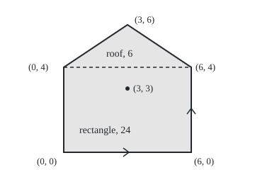

# Green's theorem: circulation round a loop equals curl summed inside

[Syllabus](../../../SYLLABUS.md) → [Calculus and analysis](../../../SYLLABUS.md#w06) → [Vector Calculus](../../../SYLLABUS.md#w06-s09) → Green's theorem

---

## General Overview

A field is fenced at five posts, in metres east and north of the south-west one: (0, 0), (6, 0), (6, 4), (3, 6), (0, 4). It is a house shape, a 6 m by 4 m rectangle under a roof 2 m high. The shoelace formula turns the five posts into 30 square metres, with no grid laid over the grass ([Shoelace formula](../../05-Geometry%20and%20trig/07-Points%2C%20Convexity%20and%20Fractals/01-polygon-area-and-orientation.md)).

Green's theorem explains why corners suffice. For a smooth field of arrows, such as wind, two totals agree: the work the wind does on one walk round the fence, and the wind's swirl added over every square metre inside, its **curl** ([Divergence and curl](03-divergence-and-curl.md)). For a field with curl 1 everywhere, the walk measures area; on straight fences it is the shoelace sum.

**Once round a closed fence, ground on the left, the work a smooth field does equals its curl added over the region inside; with curl 1, the walk measures area.**

**What kind of fact this is:** a theorem, proved on this card in Why it works for rectangles and for regions between two graphs, which covers the house; the general curved case is cited.

### The picture: the fenced field, to scale

<p align="center"></p>

To scale, 30 units per metre, north up. Chevrons show the anticlockwise walk; the dashed line splits the rectangle, 24 square metres, from the roof, 6. The dot at (3, 3) returns in What breaks.

---

## The formula

Notation first, in words. A field $F$ has east part $P$ and north part $Q$ at the point $x$ metres east, $y$ north. $P_y$, short for $\partial P/\partial y$, is how fast $P$ changes per metre north, a partial derivative ([Partial derivatives](../07-Several%20Variables/01-partial-derivatives.md)); $Q_x$ is how fast $Q$ changes per metre east. The region is $R$, its fence $C$. A circle on the integral sign marks a loop.

$$\oint_C P\,dx + Q\,dy \;=\; \iint_R \left(Q_x - P_y\right) dA$$

**Read it aloud:** the work round the fence, walked with the region on the left, equals the curl added over every small patch inside.

A line integral ([Line integrals of a field](02-line-integrals.md)) equals a double integral ([Double integrals](../08-Multiple%20Integrals/01-double-integrals.md)). The flux form counts flow across the fence, with $n$ the outward direction, length 1, and $ds$ a small length of fence:

$$\oint_C F\cdot n\,ds \;=\; \oint_C P\,dy - Q\,dx \;=\; \iint_R \left(P_x + Q_y\right) dA$$

**Read it aloud:** net flow out equals the divergence, the spreading-out per square metre, added inside.

With the field $(-y/2,\ x/2)$, curl 1, the first form measures area:

$$A \;=\; \tfrac12 \oint_C x\,dy - y\,dx \;=\; \tfrac12 \sum_{\text{fences}} \left(x_i\,y_{i+1} - x_{i+1}\,y_i\right)$$

**Read it aloud:** half the loop integral of x dy minus y dx is the area, one shoelace term per fence.

| Symbol | Plain meaning | In our example | Push it up and the answer… |
| --- | --- | --- | --- |
| $F$, $P$, $Q$ | the field, its east and north parts, newtons | wind $(-y^2/20,\ x^2/20)$ | more work round the loop |
| $x$, $y$, $dA$ | metres east and north; a small patch of area | 0 to 6 each way | — |
| $R$, $C$ | the region; its fence, walked with the region on the left | the house; five fences | — |
| $P_y$, $Q_x$ | P's rate per metre north, Q's per metre east | $-y/10$, $x/10$ | — |
| $Q_x - P_y$ | curl: the swirl per square metre | $(x + y)/10$ | more work round the loop |
| $P_x + Q_y$ | divergence: spreading-out per square metre | 1 for $(x/2, y/2)$ | more flow out |
| $n$, $ds$ | outward direction, length 1; a small length of fence | $(1, 0)$ on the east fence | — |
| $A$, $x_i$, $y_i$ | the area; post i's position, in walking order, the first following the last | 30; post 3 is (6, 4) | — |

Curl is newtons per metre; times square metres, it gives joules, like the work on the left.

### When it holds

- **A closed fence that never crosses itself, in finitely many smooth pieces.** Corners are fine; a crossing fence counts some ground negatively.
- **Walked with the region on the left**, anticlockwise for an outer fence. Clockwise, the area is −30 square metres.
- **Continuous partial rates everywhere in the region, fence included.** One bad point breaks it: the vortex in What breaks gives 6.283185 J with curl 0 inside.
- **Every piece of the boundary included.** A region with a pond cut out has two fences: the outer anticlockwise, the pond's clockwise.

---

## Why it works

### Step 0: the fundamental theorem, twice

Adding a rate over an interval gives the change between its ends ([Fundamental theorem of calculus](../04-Integrals/02-fundamental-theorem-of-calculus.md)). On a rectangle, adding $P_y$ northward compares P on the top and bottom fences; adding $Q_x$ eastward compares Q on the right and left. Those four fences are the loop.

### Step 1: the proof on a rectangle

Take the rectangle from $x = a$ to $x = b$ and $y = c$ to $y = d$, walked anticlockwise. The P part sees only east-west motion: the bottom walked east, the top west.

$$\oint P\,dx = \int_a^b P(x, c)\,dx - \int_a^b P(x, d)\,dx = -\int_a^b \big(P(x, d) - P(x, c)\big)\,dx.$$

At each fixed $x$, the fundamental theorem turns the bracket into $P_y$ added from $y = c$ to $y = d$: the P part is minus the double integral of $P_y$. The Q part, right fence north and left fence south, becomes the double integral of $Q_x$ the same way. Adding gives the formula, nothing approximated.

On the 6 m by 4 m rectangle, with wind $P = -y^2/20$, $Q = x^2/20$ newtons, the bottom and left fences give 0 J. The right gives 36/20 N over 4 m, 7.2 J; the top, walked west against −0.8 N, 4.8 J. Inside, $-P_y = y/10$ adds to 4.8 and $Q_x = x/10$ to 7.2: 12 J both ways.

### Step 2: cut and glue

Set the roof triangle on the rectangle. The rectangle walks the dashed fence west for +4.8 J, the triangle east for −4.8 J. They cancel, leaving the outer fence: 12 + 4.6 = 16.6 J. A region glued from pieces that obey the theorem obeys it.

<details>
<summary>Detailed proof: a region between two graphs</summary>

Let the region be the points with $a \le x \le b$ and $g(x) \le y \le h(x)$: a continuous floor never above a continuous roof. Vertical sides have $dx = 0$. The floor, walked east, and the roof, walked west, give
$$\oint_C P\,dx = -\int_a^b \big(P(x, h(x)) - P(x, g(x))\big)\,dx = -\int_a^b \int_{g(x)}^{h(x)} P_y(x, y)\,dy\,dx = -\iint_R P_y\,dA,$$
by the fundamental theorem in $y$, which needs $P_y$ continuous. If the region is also the points between a left edge $x = k(y)$ and a right edge $x = m(y)$, the same argument, with the right edge walked north, gives $\oint_C Q\,dy = \iint_R Q_x\,dA$. The house is both kinds: above y = 4 it runs from $x = 3(y - 4)/2$ to $x = 6 - 3(y - 4)/2$.

Other regions are cut into pieces of both kinds; shared cuts cancel as in Step 2. An arbitrary smooth fence needs a limit argument with ε and δ, carried out in Apostol, Volume 2.

</details>

### Step 3: the flux form is the same theorem, turned a quarter

With the region on the left, outward is to the right. A small step $(dx, dy)$ turned a quarter right is $(dy, -dx)$, so the flow out through it is $P\,dy - Q\,dx$. That is the circulation of a turned field with east part −Q and north part P, whose curl is $P_x + Q_y$: the original divergence.

### Step 4: area, and the shoelace formula

The field $(-y/2,\ x/2)$ has $Q_x = 1/2$, $P_y = -1/2$: curl 1, so its loop integral is the area. From post i to post i + 1, walk $x = x_i + t\,(x_{i+1} - x_i)$, $y = y_i + t\,(y_{i+1} - y_i)$ as a clock t runs from 0 to 1. In $x\,dy - y\,dx$ the terms carrying t cancel, leaving $x_i\,y_{i+1} - x_{i+1}\,y_i$: one fence, one shoelace term. Half of 0 + 24 + 24 + 12 + 0 is 30 square metres. The same integral is the outward flux of $(x/2,\ y/2)$, divergence 1.

A road with no calculus counts whole squares inside the fence: 26 of side 1 m, 29.6 square metres from 10 cm squares, 29.96 from 1 cm squares, within 0.05 of 30.

---

## Worked numbers, by hand

The wind's curl is $Q_x - P_y = x/10 + y/10$.

| Step | Arithmetic | Value |
| --- | --- | --- |
| shoelace terms | 0 − 0, 24 − 0, 36 − 12, 12 − 0, 0 − 0 | 0, 24, 24, 12, 0 |
| area, square metres | half of 60 | **30** |
| work, right fence | 36/20 N over 4 m | 7.2 J |
| work, roof (6, 4) to (3, 6) | step (−3, 2): (76 + 42)/20 | 5.9 J |
| work, roof (3, 6) to (0, 4) | step (−3, −2): (76 − 6)/20 | 3.5 J |
| work, bottom and left | P is 0, then Q is 0 | 0 J |
| work round the fence | 7.2 + 5.9 + 3.5 | **16.6 J** |
| x added inside | area 30 × balance point 3 | 90 |
| y added inside | 24 × 2 + 6 × 14/3 | 76 |
| curl added inside | (90 + 76)/10 | **16.6 J** |

### What breaks if you drop a piece

| Mistake | Comes out at | What went wrong |
| --- | --- | --- |
| Fence walked clockwise | area −30 square metres | region on the right; every term flips |
| Curl taken as $P_y - Q_x$ | −16.6 J | the east part's northward rate is the one subtracted |
| Vortex centred at (3, 3) | 6.283185 J round, curl 0 inside | undefined at (3, 3): smoothness fails |
| The half dropped | 60 square metres | the curl of $(-y,\ x)$ is 2, not 1 |

The vortex swirls round (3, 3):

$$V = \left(\frac{-(y - 3)}{(x - 3)^2 + (y - 3)^2},\ \frac{x - 3}{(x - 3)^2 + (y - 3)^2}\right).$$

Its curl is 0 wherever defined; difference quotients at 120 inside points confirm it. Yet a lap collects 6.283185 J, which is 2π: at (3, 3) the field has no value.

---

## Code, from first principles, and it actually runs

Both programs write their own Simpson's rule. Three roads reach the area: shoelace sum, flux fence by fence, and whole squares counted in integers. Two reach the wind's work: fence by fence, and the hand-worked curl added inside. The vortex meets 2π built by Simpson.

### Python

```python
# Green's theorem -- the check behind the card.  Standard library only; pi is
# built here, not imported.  The plot is a house-shaped field fenced at five
# posts, in metres.  The wind is F = (P, Q) = (-y^2/20, x^2/20), in newtons.
HOUSE = [(0, 0), (6, 0), (6, 4), (3, 6), (0, 4)]
RECT, TRI = [(0, 0), (6, 0), (6, 4), (0, 4)], [(0, 4), (6, 4), (3, 6)]

def simpson(f, a, b, n=200):                  # Simpson's rule, n even
    h = (b - a) / n
    return h / 3 * (f(a) + f(b) + sum((4 if i % 2 else 2) * f(a + i * h) for i in range(1, n)))

def loop(field, posts, out=False):            # each fence: P dx + Q dy, or outward P dy - Q dx
    works = []
    for a, b in zip(posts, posts[1:] + posts[:1]):
        dx, dy = b[0] - a[0], b[1] - a[1]
        def push(t):
            p, q = field(a[0] + t * dx, a[1] + t * dy)
            return p * dy - q * dx if out else p * dx + q * dy
        works.append(simpson(push, 0, 1))
    return works

top = lambda x: 4 + 2 * x / 3 if x <= 3 else 4 + 2 * (6 - x) / 3   # the roof line over the house

def count(m):                                 # squares of side 1/m wholly inside, whole numbers only
    roof = lambda i: 12 * m + 2 * min(i, 6 * m - i)          # 3 m times the roof height at x = i/m
    return sum(1 for i in range(6 * m) for j in range(6 * m) if 3 * (j + 1) <= min(roof(i), roof(i + 1))) / m / m

wind = lambda x, y: (-y * y / 20, x * x / 20)
curl = lambda x, y: x / 10 + y / 10           # Q_x - P_y, worked by hand
vortex = lambda x, y: (-(y - 3) / ((x - 3) ** 2 + (y - 3) ** 2), (x - 3) / ((x - 3) ** 2 + (y - 3) ** 2))
terms = [xa * yb - xb * ya for (xa, ya), (xb, yb) in zip(HOUSE, HOUSE[1:] + HOUSE[:1])]
shoelace, flux_area = sum(terms) / 2, sum(loop(lambda x, y: (x / 2, y / 2), HOUSE, out=True))
grid = [(m, count(m)) for m in (1, 10, 100)]
rect, tri, house = loop(wind, RECT), loop(wind, TRI), loop(wind, HOUSE)
minus_py = simpson(lambda x: simpson(lambda y: y / 10, 0, 4, 2), 0, 6, 2)
q_x = simpson(lambda x: simpson(lambda y: x / 10, 0, 4, 2), 0, 6, 2)
over = lambda f: sum(simpson(lambda x: simpson(lambda y: f(x, y), 0, top(x), 2), a, b, 20) for a, b in ((0, 3), (3, 6)))
inside = over(curl)
spin, two_pi = sum(loop(vortex, HOUSE)), 8 * simpson(lambda x: 1 / (1 + x * x), 0, 1)
k, pts = 1e-5, [(0.25 + i / 2, 0.25 + j / 2) for i in range(12) for j in range(12) if 0.25 + j / 2 < top(0.25 + i / 2)]
dq = max(abs(vortex(x + k, y)[1] - vortex(x - k, y)[1] - vortex(x, y + k)[0] + vortex(x, y - k)[0]) / (2 * k) for x, y in pts)
fl = lambda v: ", ".join(f"{x:.6f}" for x in v)
print("figure, 30 units per metre, origin (90, 215): " + " ".join(f"({90 + 30 * x}, {215 - 30 * y})" for x, y in HOUSE) + f"; vortex centre ({90 + 30 * 3}, {215 - 30 * 3})")
print(f"shoelace terms: {terms}; sum {sum(terms)}; area {shoelace:.6f} m2")
print(f"area as outward flux of (x, y)/2, fence by fence: {flux_area:.6f}")
for m, a in grid:
    print(f"area from squares of side 1/{m} wholly inside: {a:.6f}, short by {shoelace - a:.6f}")
print(f"area walked clockwise: {sum(loop(lambda x, y: (x / 2, y / 2), HOUSE[::-1], out=True)):.6f}")
print(f"rectangle, wind work fence by fence: {fl(rect)}; total {sum(rect):.6f} J")
print(f"rectangle inside: -P_y summed {minus_py:.6f} (bottom + top), Q_x summed {q_x:.6f} (right + left)")
print(f"house, wind work fence by fence: {fl(house)}; total {sum(house):.6f} J")
print(f"house inside: x summed {over(lambda x, y: x):.6f}, y summed {over(lambda x, y: y):.6f}, curl (x + y)/10 summed {inside:.6f} J")
print(f"shared fence y = 4: rectangle {rect[2]:.6f}, triangle {tri[0]:.6f}; {sum(rect):.6f} + {sum(tri):.6f} = {sum(rect) + sum(tri):.6f}")
print(f"mistake, curl taken as P_y - Q_x: {-inside:.6f}; mistake, half dropped: {sum(terms):.6f}")
print(f"vortex round (3, 3): circulation {spin:.6f}; 2 pi built by Simpson {two_pi:.6f}")
print(f"vortex curl by difference quotient at {len(pts)} points: largest size {dq:.6f}")
assert abs(flux_area - shoelace) < 1e-9 and 0 < shoelace - grid[-1][1] < 0.05    # three roads to the area
assert abs(sum(house) - inside) < 1e-9                                           # the theorem, on the house
assert abs(rect[0] + rect[2] - minus_py) < 1e-9 and abs(rect[1] + rect[3] - q_x) < 1e-9
assert abs(spin - two_pi) < 1e-9 and dq < 1e-6                                    # the hole breaks it
print("ALL CHECKS PASS")
```

**Ran 2026-09-27 on macOS, Python 3.14.6, standard library only. All checks passed. Output, pasted from the run:**

```
figure, 30 units per metre, origin (90, 215): (90, 215) (270, 215) (270, 95) (180, 35) (90, 95); vortex centre (180, 125)
shoelace terms: [0, 24, 24, 12, 0]; sum 60; area 30.000000 m2
area as outward flux of (x, y)/2, fence by fence: 30.000000
area from squares of side 1/1 wholly inside: 26.000000, short by 4.000000
area from squares of side 1/10 wholly inside: 29.600000, short by 0.400000
area from squares of side 1/100 wholly inside: 29.960000, short by 0.040000
area walked clockwise: -30.000000
rectangle, wind work fence by fence: 0.000000, 7.200000, 4.800000, 0.000000; total 12.000000 J
rectangle inside: -P_y summed 4.800000 (bottom + top), Q_x summed 7.200000 (right + left)
house, wind work fence by fence: 0.000000, 7.200000, 5.900000, 3.500000, 0.000000; total 16.600000 J
house inside: x summed 90.000000, y summed 76.000000, curl (x + y)/10 summed 16.600000 J
shared fence y = 4: rectangle 4.800000, triangle -4.800000; 12.000000 + 4.600000 = 16.600000
mistake, curl taken as P_y - Q_x: -16.600000; mistake, half dropped: 60.000000
vortex round (3, 3): circulation 6.283185; 2 pi built by Simpson 6.283185
vortex curl by difference quotient at 120 points: largest size 0.000000
ALL CHECKS PASS
```

### Rust

Same rows, same labels, built with `rustc --edition 2021 -O`.

```rust
// Green's theorem -- the same check as the Python, in Rust.  No crates; pi is
// built here, not imported.  The plot is a house-shaped field fenced at five
// posts, in metres.  The wind is F = (P, Q) = (-y^2/20, x^2/20), in newtons.
type Field = fn(f64, f64) -> (f64, f64);
const HOUSE: [(i64, i64); 5] = [(0, 0), (6, 0), (6, 4), (3, 6), (0, 4)];

fn simpson(f: impl Fn(f64) -> f64, a: f64, b: f64, n: usize) -> f64 {    // Simpson's rule, n even
    let h = (b - a) / n as f64;
    let inner: f64 = (1..n).map(|i| (if i % 2 == 1 { 4.0 } else { 2.0 }) * f(a + i as f64 * h)).sum();
    h / 3.0 * (f(a) + f(b) + inner)
}

fn lp(field: Field, posts: &[(f64, f64)], out: bool) -> Vec<f64> {      // P dx + Q dy, or outward P dy - Q dx
    (0..posts.len()).map(|k| {
        let (a, b) = (posts[k], posts[(k + 1) % posts.len()]);
        let (dx, dy) = (b.0 - a.0, b.1 - a.1);
        simpson(|t| { let (p, q) = field(a.0 + t * dx, a.1 + t * dy); if out { p * dy - q * dx } else { p * dx + q * dy } }, 0.0, 1.0, 200)
    }).collect()
}

fn top(x: f64) -> f64 { if x <= 3.0 { 4.0 + 2.0 * x / 3.0 } else { 4.0 + 2.0 * (6.0 - x) / 3.0 } }

fn count(m: i64) -> f64 {                     // squares of side 1/m wholly inside, whole numbers only
    let roof = |i: i64| 12 * m + 2 * i.min(6 * m - i);
    let mut c = 0;
    for i in 0..6 * m { for j in 0..6 * m { if 3 * (j + 1) <= roof(i).min(roof(i + 1)) { c += 1 } } }
    c as f64 / m as f64 / m as f64
}

fn wind(x: f64, y: f64) -> (f64, f64) { (-y * y / 20.0, x * x / 20.0) }
fn curl(x: f64, y: f64) -> f64 { x / 10.0 + y / 10.0 }                  // Q_x - P_y, worked by hand
fn half_pos(x: f64, y: f64) -> (f64, f64) { (x / 2.0, y / 2.0) }
fn vortex(x: f64, y: f64) -> (f64, f64) {
    let r2 = (x - 3.0).powi(2) + (y - 3.0).powi(2);
    (-(y - 3.0) / r2, (x - 3.0) / r2)
}
fn fl(v: &[f64]) -> String { v.iter().map(|x| format!("{:.6}", x + 0.0)).collect::<Vec<_>>().join(", ") }  // + 0.0 prints -0.0 as 0.0
fn sum(v: &[f64]) -> f64 { v.iter().sum() }

fn main() {
    let house: Vec<(f64, f64)> = HOUSE.iter().map(|&(x, y)| (x as f64, y as f64)).collect();
    let rect_p = [(0.0, 0.0), (6.0, 0.0), (6.0, 4.0), (0.0, 4.0)];
    let tri_p = [(0.0, 4.0), (6.0, 4.0), (3.0, 6.0)];
    let terms: Vec<i64> = (0..5).map(|k| { let (a, b) = (HOUSE[k], HOUSE[(k + 1) % 5]); a.0 * b.1 - b.0 * a.1 }).collect();
    let tsum: i64 = terms.iter().sum();
    let shoelace = tsum as f64 / 2.0;
    let flux_area = sum(&lp(half_pos, &house, true));
    let grid: Vec<(i64, f64)> = [1, 10, 100].iter().map(|&m| (m, count(m))).collect();
    let (rect, tri, hs) = (lp(wind, &rect_p, false), lp(wind, &tri_p, false), lp(wind, &house, false));
    let minus_py = simpson(|_x| simpson(|y| y / 10.0, 0.0, 4.0, 2), 0.0, 6.0, 2);
    let q_x = simpson(|x| simpson(|_y| x / 10.0, 0.0, 4.0, 2), 0.0, 6.0, 2);
    let over = |f: &dyn Fn(f64, f64) -> f64| -> f64 { [(0.0, 3.0), (3.0, 6.0)].iter().map(|&(a, b)| simpson(|x| simpson(|y| f(x, y), 0.0, top(x), 2), a, b, 20)).sum() };
    let inside = over(&curl);
    let spin = sum(&lp(vortex, &house, false));
    let two_pi = 8.0 * simpson(|x| 1.0 / (1.0 + x * x), 0.0, 1.0, 200);
    let k = 1e-5;
    let mut pts = Vec::new();
    for i in 0..12 { for j in 0..12 { let (x, y) = (0.25 + i as f64 / 2.0, 0.25 + j as f64 / 2.0); if y < top(x) { pts.push((x, y)) } } }
    let dq = pts.iter().map(|&(x, y)| ((vortex(x + k, y).1 - vortex(x - k, y).1 - vortex(x, y + k).0 + vortex(x, y - k).0) / (2.0 * k)).abs()).fold(0.0, f64::max);
    let fig: Vec<String> = HOUSE.iter().map(|&(x, y)| format!("({}, {})", 90 + 30 * x, 215 - 30 * y)).collect();
    println!("figure, 30 units per metre, origin (90, 215): {}; vortex centre ({}, {})", fig.join(" "), 90 + 30 * 3, 215 - 30 * 3);
    println!("shoelace terms: {:?}; sum {}; area {:.6} m2", terms, tsum, shoelace);
    println!("area as outward flux of (x, y)/2, fence by fence: {:.6}", flux_area);
    for &(m, a) in &grid { println!("area from squares of side 1/{} wholly inside: {:.6}, short by {:.6}", m, a, shoelace - a) }
    let rev: Vec<(f64, f64)> = house.iter().rev().copied().collect();
    println!("area walked clockwise: {:.6}", sum(&lp(half_pos, &rev, true)));
    println!("rectangle, wind work fence by fence: {}; total {:.6} J", fl(&rect), sum(&rect));
    println!("rectangle inside: -P_y summed {:.6} (bottom + top), Q_x summed {:.6} (right + left)", minus_py, q_x);
    println!("house, wind work fence by fence: {}; total {:.6} J", fl(&hs), sum(&hs));
    println!("house inside: x summed {:.6}, y summed {:.6}, curl (x + y)/10 summed {:.6} J", over(&|x, _y| x), over(&|_x, y| y), inside);
    println!("shared fence y = 4: rectangle {:.6}, triangle {:.6}; {:.6} + {:.6} = {:.6}", rect[2], tri[0], sum(&rect), sum(&tri), sum(&rect) + sum(&tri));
    println!("mistake, curl taken as P_y - Q_x: {:.6}; mistake, half dropped: {:.6}", -inside, tsum as f64);
    println!("vortex round (3, 3): circulation {:.6}; 2 pi built by Simpson {:.6}", spin, two_pi);
    println!("vortex curl by difference quotient at {} points: largest size {:.6}", pts.len(), dq);
    assert!((flux_area - shoelace).abs() < 1e-9 && shoelace - grid[2].1 > 0.0 && shoelace - grid[2].1 < 0.05);
    assert!((sum(&hs) - inside).abs() < 1e-9);                            // the theorem, on the house
    assert!((rect[0] + rect[2] - minus_py).abs() < 1e-9 && (rect[1] + rect[3] - q_x).abs() < 1e-9);
    assert!((spin - two_pi).abs() < 1e-9 && dq < 1e-6);                   // the hole breaks it
    println!("ALL CHECKS PASS");
}
```

**Ran 2026-09-27 on macOS, rustc 1.98.1, no crates. All checks passed. Output, pasted from the run:**

```
figure, 30 units per metre, origin (90, 215): (90, 215) (270, 215) (270, 95) (180, 35) (90, 95); vortex centre (180, 125)
shoelace terms: [0, 24, 24, 12, 0]; sum 60; area 30.000000 m2
area as outward flux of (x, y)/2, fence by fence: 30.000000
area from squares of side 1/1 wholly inside: 26.000000, short by 4.000000
area from squares of side 1/10 wholly inside: 29.600000, short by 0.400000
area from squares of side 1/100 wholly inside: 29.960000, short by 0.040000
area walked clockwise: -30.000000
rectangle, wind work fence by fence: 0.000000, 7.200000, 4.800000, 0.000000; total 12.000000 J
rectangle inside: -P_y summed 4.800000 (bottom + top), Q_x summed 7.200000 (right + left)
house, wind work fence by fence: 0.000000, 7.200000, 5.900000, 3.500000, 0.000000; total 16.600000 J
house inside: x summed 90.000000, y summed 76.000000, curl (x + y)/10 summed 16.600000 J
shared fence y = 4: rectangle 4.800000, triangle -4.800000; 12.000000 + 4.600000 = 16.600000
mistake, curl taken as P_y - Q_x: -16.600000; mistake, half dropped: 60.000000
vortex round (3, 3): circulation 6.283185; 2 pi built by Simpson 6.283185
vortex curl by difference quotient at 120 points: largest size 0.000000
ALL CHECKS PASS
```

The two outputs match line for line.

> [!TIP]
> **Try changing**
> Guess first, then run it.
> - **Move the peak.** Set the fourth post to `(3, 8)`: shoelace and flux give 24 + 12 = 36 square metres, the square count keeps the old roof, and the first assert stops the run.
> - **A curl-free wind.** Make the wind `(y / 20, x / 20)`: curl 1/20 − 1/20 = 0, a lap gives 0 J, the hand-written curl disagrees, and the second assert stops the run.
> - **Move the vortex outside.** Replace every 3 in the vortex by 8: the fence no longer circles the centre, a lap gives 0, and the last assert stops the run.

---

## The usual mistake

> [!warning]
> **Checking the field only along the fence.** The theorem needs the field smooth inside too. The vortex is smooth on the fence, with zero curl wherever defined, yet does 2π J per lap: one bad point at (3, 3).
>
> - **Walking the wrong way.** Clockwise, the area comes out −30 square metres and the wind's work −16.6 J.
> - **Dropping the half.** The field $(-y,\ x)$ has curl 2, so its loop gives 60, twice the area.
> - **Forgetting a pond.** A hole's fence, walked clockwise, is part of the boundary too.

---

## Where you meet it in real life

- **Planimeters and mapping software.** A planimeter, a wheeled arm traced round a map outline, reads area by this theorem; mapping software runs the shoelace sum.
- **Testing for a potential.** Zero curl on a region without holes makes every loop integral zero, as on [Conservative fields](04-conservative-fields-and-potentials.md); the vortex shows why holes matter.

> **Say it back**
> Walk once round a closed fence, ground on the left, adding the field's push along each step. The total equals the curl added inside. On a rectangle this is the fundamental theorem twice; other shapes glue from pieces whose shared fences cancel. Turned a quarter, outflow equals divergence inside. With curl 1 the walk measures area: the shoelace formula.

---

## What this builds on

- [Line integrals of a field](02-line-integrals.md): the work of a field along a directed route, and its sign flip on reversal.
- [Double integrals](../08-Multiple%20Integrals/01-double-integrals.md): adding over a region one slice at a time.
- [Shoelace formula](../../05-Geometry%20and%20trig/07-Points%2C%20Convexity%20and%20Fractals/01-polygon-area-and-orientation.md): the shoelace formula and its sign, which this card derives.

## Where this goes next

- [Stokes' theorem](08-stokes-theorem.md): the same statement for a curved surface and its edge.
- [Cauchy's theorem](../../07-Complex%20analysis/03-Contour%20Integrals%20and%20Cauchy%27s%20Theorem/03-cauchys-theorem.md): loop integrals of complex-differentiable functions vanish; Green's theorem gives one proof.
- [Poincare-Bendixson](../../08-Differential%20equations%20and%20dynamics/06-Nonlinear%20Dynamics%20in%20the%20Plane/09-poincare-bendixson-and-bendixsons-criterion.md): the flux form rules out closed orbits where the divergence keeps one sign.
- Green, divergence and curl theorems: Green, Stokes and divergence as one theorem about boundaries.

---

## Sources

Verified 27 Sep 2026: every link below resolves to the publisher's page.

- OpenStax. *Calculus Volume 3*, section 6.4, "Green's Theorem". [OpenStax](https://openstax.org/books/calculus-volume-3/pages/6-4-greens-theorem). Free; both forms, area, regions with holes.
- Apostol, Tom M. *Calculus, Volume 2*, 2nd ed. Wiley. [Publisher page](https://www.wiley.com/en-us/Calculus%2C+Volume+2%2C+2nd+Edition-p-9781119496762). The proof between two graphs, and the general case.
- O'Connor, J. J., and E. F. Robertson. "George Green." MacTutor Archive, University of St Andrews. [Biography](https://mathshistory.st-andrews.ac.uk/Biographies/Green/). A self-taught Nottingham miller; his 1828 essay gave the name.
