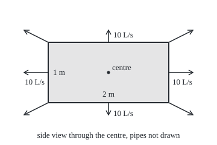

# Divergence theorem: flux out of a closed surface equals divergence summed inside

Calculus and analysis → Vector Calculus → Outflow and supply → Divergence theorem

---

## General Overview

A tank 2 m long, 1 m wide and 1 m tall has walls, floor and lid of fine mesh. It is full of water. Perforated pipes spread evenly through it pump in more: every cubic metre receives 30 litres a second. Water cannot be squeezed, so all of it leaves through the mesh.

Count the leaving water two ways. Meter each of the six faces and add the readings. Or ignore the walls and add what the pipes deliver: 30 litres a second in each of 2 cubic metres. Both give 60 litres a second.

This holds for any smooth flow and any solid with a closed skin. The flow out is the **flux** through the surface ([surface-integrals-and-flux](05-surface-integrals-and-flux.md)). The supply per cubic metre is the **divergence** of the flow ([divergence-and-curl](03-divergence-and-curl.md)). That the two always match is the divergence theorem, also called Gauss's theorem.

**The flux of a smooth field out through a solid's whole closed boundary equals the triple integral of its divergence inside: what leaves through the skin is what is made inside.**

**What kind of fact this is:** a theorem, proved on this card in Why it works for boxes and for solids bounded by graphs, which covers the ball.

### The picture: the tank from the side

<p align="center"></p>

To scale: 100 px per metre of tank, 40 px of arrow per 0.01 m/s of water speed. Arrow tips: right (320, 120), top (180, 50), top-right corner (320, 50); the rest mirror them. Every face passes 10 L/s, including the hidden front and back.

---

## The formula

Notation first, in words. Put the tank's centre at the origin: length runs from −1 to 1 m along x, width and height from −0.5 to 0.5 m along y and z. A solid is named $V$. Its whole skin, nothing left open, is written $\partial V$, read "the boundary of V". On the skin, $\mathbf n$ is the arrow of length one pointing straight out. The flow $\mathbf F$ has components $F_1$, $F_2$, $F_3$: velocities along x, y and z. The dot product $\mathbf F\cdot\mathbf n$ is the part of the flow crossing the skin. $dS$ is a small patch of skin, $dV$ a small piece of volume; a triple integral adds through a volume ([triple-integrals](../08-Multiple%20Integrals/02-triple-integrals.md)).

$$\iint_{\partial V} \mathbf F\cdot\mathbf n\,dS \;=\; \iiint_V \operatorname{div}\mathbf F\,dV, \qquad \operatorname{div}\mathbf F = \frac{\partial F_1}{\partial x} + \frac{\partial F_2}{\partial y} + \frac{\partial F_3}{\partial z}$$

**Read it aloud:** outward flow across the whole skin, added over its area, equals supply per unit volume, added through the inside.

In the tank, water moves at $\mathbf F = k\,(x, y, z)$, straight away from the centre, faster farther out.

| Symbol | Plain meaning | In our example | Push it up and the answer… |
| --- | --- | --- | --- |
| $V$ | the solid region | the tank, 2 m^3 of water | more supply to leave |
| $\partial V$ | its whole closed skin | six mesh faces, 10 m^2 | — |
| $F_1$, $F_2$, $F_3$ | the field's components, in m/s | 0.01x, 0.01y, 0.01z | faster flow, more flux |
| $\mathbf n$ | outward arrow of length one | (1, 0, 0) on the right end | inward flips the sign |
| $dS$, $dV$ | patch of skin, piece of volume | m^2, m^3 | — |
| $\operatorname{div}\mathbf F$ | supply rate per unit volume, per second | 0.03 per second = 30 L/s per m^3 | more outflow |
| $k$ | how fast the speed grows with distance | 0.01 per second | both sides scale with it |
| $R$ | radius of a spherical tank | 1 m, then 2 m | flux grows as its cube |

Units: divergence is m/s per m, "per second"; flux is in m^3/s; 1 m^3 is 1,000 litres.

### When it holds

- **A bounded solid with a closed skin of finitely many smooth pieces**: box, ball, shell. Drop the lid and five faces pass 50 L/s while the pipes supply 60.
- **Outward normals everywhere.** Inward, the same tank reads −60 L/s.
- **Continuous first partial derivatives at every point of the solid and just beyond.** A hose pouring 20 L/s in at the centre gives zero divergence wherever the field is defined, yet 20 L/s leave: the field blows up at the centre.
- **All of the skin.** A hollow shell's inner sphere counts, with outward pointing into the hole.

---

## Why it works

### Step 0: shared walls cancel

Cut the tank into small cells. Water crossing a wall between two cells leaves one and enters the other: a plus and a minus. Add all the cells' outflows and inner walls cancel, leaving the outer skin. A small cell's outflow is about its divergence times its volume, so the total is the triple integral. The steps below make this exact.

### Step 1: one pair of opposite faces is the fundamental theorem of calculus

Take the end faces, x = −1 and x = 1. Only $F_1$ crosses them. The right end's normal is (1, 0, 0), so its flux is the area integral of $F_1$ at x = 1; the left end's is (−1, 0, 0), giving minus the integral at x = −1. For each fixed width and height, the fundamental theorem of calculus turns the difference into an integral along the length:

$$F_1(1, y, z) - F_1(-1, y, z) = \int_{-1}^{1} \frac{\partial F_1}{\partial x}\,dx$$

Integrate over width and height: the end faces' flux equals the triple integral of the divergence's first term.

With numbers, pack the pipes toward both ends: $F_1 = k\,(x^3 + x)$, the rest unchanged. At each end the speed is 0.02 m/s through 1 m^2: 40 L/s from the pair. Inside, the rate of $F_1$ per metre is k(3x^2 + 1); along the length 3x^2 adds to 2 and 1 adds to 2, so 0.04 m^3/s per square metre of cross-section, 40 L/s again.

### Step 2: the other two pairs, then the box

Width faces pair with the rate of $F_2$, height faces with that of $F_3$: 20 L/s each, both ways. The six faces pass 80 L/s; the divergence adds to 80 L/s. The algebra never used the particular field, so the theorem holds on every box, and on boxes glued face to face, since shared faces cancel.

### Step 3: curved skins

A ball is no stack of boxes, but the argument still runs one direction at a time, with graphs for faces, as the folded proof shows.

<details>
<summary>Detailed proof: a solid bounded by graphs</summary>

Take the height part; the other two swap letters. The solid lies over a flat region D, between a floor z = g(x, y) and a ceiling z = h(x, y), both with continuous partial derivatives.

Inside: for each (x, y) in D, the fundamental theorem of calculus gives $\int_g^h \partial F_3/\partial z\,dz = F_3(x, y, h) - F_3(x, y, g)$; integrate that over D.

Skin: parametrise the ceiling by (x, y). Its tangent arrows are (1, 0, h_x) and (0, 1, h_y), with h_x, h_y the partial derivatives of h. Their cross product (−h_x, −h_y, 1) points out, and its length is the area stretch, so the flux of (0, 0, F_3) through the ceiling is the integral over D of $F_3(x, y, h)$. The floor's outward arrow (g_x, g_y, −1) gives minus the integral of $F_3(x, y, g)$. Vertical side walls have no height part in their normal and pass nothing.

The sides match; add the three parts. A ball qualifies in every direction, with the hemispheres as floor and ceiling. Their slopes blow up at the rim, so take D a disc slightly smaller than the equator and let it grow: F is bounded and the uncovered band's area and volume shrink to zero, so both sides converge. Finitely many such pieces glue by Step 0. The general smooth-skinned solid needs a limit argument, in Marsden and Tromba and in Apostol, below.

</details>

### Step 4: the ball, by hand

A spherical tank of radius $R$ = 1 m, pipes spread evenly. Inside: 30 L/s per m^3 times four-thirds of pi cubic metres, 40π L/s. Skin: the outward normal is the position divided by $R$, so the crossing flow is kR = 0.01 m/s everywhere, over 4π m^2: 0.04π m^3/s, again 40π, about 125.664 L/s.

### Step 5: read it as conservation

Divergence is supply per unit volume; flux is loss through the skin; the books balance for every solid. With zero divergence, as in water with no pipes, whatever enters a closed surface leaves it. Where fluid can build up, the amount inside grows at supply minus outflow; written for every small cell, that is the continuity equation.

The flat version, flow across a closed curve against divergence over the region inside, is one form of [greens-theorem](06-greens-theorem.md).

---

## Worked numbers, by hand

| Step | Arithmetic | Value |
| --- | --- | --- |
| divergence, even supply | 3 × 0.01 per second | 30 L/s per m^3 |
| supply inside | 30 × 2 m^3 | 60 L/s |
| right end face | 0.01 m/s × 1 m^2 | 10 L/s |
| top face | 0.005 m/s × 2 m^2 | 10 L/s |
| all six faces | 6 × 10 | **60 L/s** |
| ends supply, divergence | 0.01(3x^2 + 3) at the middle, then at an end | 30, then 60 L/s per m^3 |
| ends supply, the end pair | 2 × 0.02 m/s × 1 m^2 | 40 L/s |
| ends supply, both roads | 40 + 20 + 20, and 8 × 0.01 m^3/s | **80 L/s** |
| spherical tank, 1 m | 30 × four-thirds of pi | **40π ≈ 125.664 L/s** |

### What breaks if you drop a piece

| Mistake | Comes out at | What went wrong |
| --- | --- | --- |
| Normals point inward | −60 L/s | the theorem counts flow out |
| Lid left out of the skin | 50 L/s against 60 inside | an open surface is not a whole boundary |
| Hose of 20 L/s at the centre | divergence 0 inside, yet 20 L/s out | the field is not smooth at the centre |

---

## Code, from first principles, and it actually runs

Two roads to every flux; pi is built from a Simpson sum. Road one meters the skin: Simpson's rule in two directions over each face or the sphere. Road two never touches the skin: difference quotients give the divergence, and a triple Simpson sum adds it through the box or ball. The hand values, 80 L/s and 40π R^3, are checked too.

### Python

```python
# Divergence theorem check, standard library only.  Mesh tank 2 m x 1 m x 1 m centred on the origin,
# water leaves at F = k(x, y, z) m/s.  Road one: flux through the skin.  Road two: divergence inside.
import math

def simpson(f, a, b, n=32):
    h = (b - a) / n
    return h / 3 * sum((1 if j in (0, n) else 4 if j % 2 else 2) * f(a + j * h) for j in range(n + 1))

PI = simpson(lambda t: 4 / (1 + t * t), 0, 1, 200)            # pi, built, not imported
K, HALF, L = 0.01, (1.0, 0.5, 0.5), 1000                       # rate; half-sides (m); L per m^3
even = lambda p: (K * p[0], K * p[1], K * p[2])
ends = lambda p: (K * (p[0] ** 3 + p[0]), K * p[1], K * p[2])  # pipes packed toward both ends
def hose(p):                                                   # 20 L/s poured in at the centre
    r = math.sqrt(p[0] ** 2 + p[1] ** 2 + p[2] ** 2)
    return tuple(0.02 * c / (4 * PI * r ** 3) for c in p)

def div(F, p, h=1e-4):                                         # three difference quotients
    tot = 0.0
    for i in range(3):
        up, dn = list(p), list(p); up[i] += h; dn[i] -= h
        tot += (F(up)[i] - F(dn)[i]) / (2 * h)
    return tot

def face(F, i, s):                                             # outward flux, face x_i = s * half
    j, m = [a for a in range(3) if a != i]
    def pt(u, v):
        p = [0.0] * 3; p[i], p[j], p[m] = s * HALF[i], u, v; return p
    return simpson(lambda u: simpson(lambda v: s * F(pt(u, v))[i], -HALF[m], HALF[m]), -HALF[j], HALF[j])

faces = lambda F: [L * face(F, i, s) for i in range(3) for s in (1, -1)]
inside = lambda F: L * simpson(lambda x: simpson(lambda y: simpson(
    lambda z: div(F, (x, y, z)), -.5, .5, 8), -.5, .5, 8), -1, 1, 8)
def on_sphere(R, ph, th): return (R * math.sin(ph) * math.cos(th), R * math.sin(ph) * math.sin(th), R * math.cos(ph))
def sphere_out(F, R):                    # F . (r_phi x r_theta) = F . R^2 sin(phi) (unit radius)
    g = lambda ph, th: sum(a * b for a, b in zip(F(on_sphere(R, ph, th)), on_sphere(R * R * math.sin(ph), ph, th)))
    return L * simpson(lambda ph: simpson(lambda th: g(ph, th), 0, 2 * PI, 64), 0, PI, 64)
def ball_in(F, R):                       # divergence times the spherical volume factor r^2 sin(phi)
    g = lambda r, ph, th: div(F, on_sphere(r, ph, th)) * r * r * math.sin(ph)
    return L * simpson(lambda r: simpson(lambda ph: simpson(lambda th: g(r, ph, th), 0, 2 * PI, 8), 0, PI, 64), 0, R, 4)

fe, fn, fh = faces(even), faces(ends), faces(hose)
print(f"pi, built by Simpson on 4/(1+t^2): {PI:.12f}")
print(f"even supply, divergence at centre and corner (L/s per m^3): {L * div(even, (0, 0, 0)):.3f} {L * div(even, (1, .5, .5)):.3f}")
print("even supply, face by face (L/s): " + " ".join(f"{n} {v:.3f}" for n, v in zip(["+x", "-x", "+y", "-y", "+z", "-z"], fe)))
print(f"even supply, box: out through faces {sum(fe):.3f} L/s; supply inside {inside(even):.3f} L/s; "
      f"speed at end and top centres {even((1, 0, 0))[0]:.3f} {even((0, 0, .5))[2]:.3f} m/s")
print(f"ends supply, divergence at middle and at an end (L/s per m^3): {L * div(ends, (0, 0, 0)):.3f} {L * div(ends, (1, 0, 0)):.3f}; speed at an end {ends((1, 0, 0))[0]:.3f} m/s")
print(f"ends supply, box: out through faces {sum(fn):.3f} L/s; supply inside {inside(ends):.3f} L/s; face pairs " + " ".join(f"{fn[i] + fn[i + 1]:.3f}" for i in (0, 2, 4)))
for R in (1.0, 2.0):
    print(f"ball R = {R:.0f} m: out through sphere {sphere_out(even, R):.3f} L/s; supply inside {ball_in(even, R):.3f} L/s; 40 pi R^3 = {40 * PI * R ** 3:.3f}")
print(f"break 1, inward normals: {-sum(fe):.3f} L/s")
print(f"break 2, top face left out: {sum(fe) - fe[4]:.3f} L/s against {inside(even):.3f} inside")
print(f"break 3, hose at centre: |divergence| at (0.3, 0.2, -0.1) = {abs(L * div(hose, (.3, .2, -.1))):.3f}; out through faces {sum(fh):.3f} L/s")
tip = lambda p: (180 + 100 * p[0] + 4000 * even(p)[0], 120 - 100 * p[2] - 4000 * even(p)[2])
print("figure, 100 px per m, 4000 px per m/s; arrow tips right %.0f,%.0f top %.0f,%.0f corner %.0f,%.0f" % (*tip((1, 0, 0)), *tip((0, 0, .5)), *tip((1, 0, .5))))
assert abs(sum(fe) - inside(even)) < 1e-6 and abs(sum(fn) - inside(ends)) < 1e-6   # two roads, two fields
assert abs(sum(fn) - 80) < 1e-6                                     # the hand count: 2 x 20 + 4 x 10
assert abs(sphere_out(even, 2) - ball_in(even, 2)) < 1e-3 and abs(ball_in(even, 2) - 320 * PI) < 1e-3  # R = 2
assert abs(sum(fh) - 20) < 1e-3 and abs(div(hose, (.3, .2, -.1))) < 1e-6   # the hose breaks it
print("ALL CHECKS PASS")
```

**Ran 2026-09-28 on macOS, Python 3.14.6, standard library only. All checks passed. Output, pasted from the run:**

```
pi, built by Simpson on 4/(1+t^2): 3.141592653590
even supply, divergence at centre and corner (L/s per m^3): 30.000 30.000
even supply, face by face (L/s): +x 10.000 -x 10.000 +y 10.000 -y 10.000 +z 10.000 -z 10.000
even supply, box: out through faces 60.000 L/s; supply inside 60.000 L/s; speed at end and top centres 0.010 0.005 m/s
ends supply, divergence at middle and at an end (L/s per m^3): 30.000 60.000; speed at an end 0.020 m/s
ends supply, box: out through faces 80.000 L/s; supply inside 80.000 L/s; face pairs 40.000 20.000 20.000
ball R = 1 m: out through sphere 125.664 L/s; supply inside 125.664 L/s; 40 pi R^3 = 125.664
ball R = 2 m: out through sphere 1005.310 L/s; supply inside 1005.310 L/s; 40 pi R^3 = 1005.310
break 1, inward normals: -60.000 L/s
break 2, top face left out: 50.000 L/s against 60.000 inside
break 3, hose at centre: |divergence| at (0.3, 0.2, -0.1) = 0.000; out through faces 20.000 L/s
figure, 100 px per m, 4000 px per m/s; arrow tips right 320,120 top 180,50 corner 320,50
ALL CHECKS PASS
```

### Rust

Same numbers, same labels, built with `rustc --edition 2021 -O`.

```rust
// Divergence theorem check, the Python's twin, std only.  Mesh tank 2 m x 1 m x 1 m centred on the
// origin, water leaves at F = k(x, y, z) m/s.  Road one: flux through the skin.  Road two: divergence inside.
type V3 = [f64; 3];
const K: f64 = 0.01; const L: f64 = 1000.0; // rate per second; litres per cubic metre
const HALF: V3 = [1.0, 0.5, 0.5]; // half-sides of the tank in metres

fn simpson(f: &dyn Fn(f64) -> f64, a: f64, b: f64, n: usize) -> f64 {
    let h = (b - a) / n as f64;
    let w = |j: usize| if j == 0 || j == n { 1.0 } else if j % 2 == 1 { 4.0 } else { 2.0 };
    h / 3.0 * (0..=n).map(|j| w(j) * f(a + j as f64 * h)).sum::<f64>()
}
fn pi() -> f64 { simpson(&|t| 4.0 / (1.0 + t * t), 0.0, 1.0, 200) } // pi, built, not imported
fn even(p: V3) -> V3 { [K * p[0], K * p[1], K * p[2]] }
fn ends(p: V3) -> V3 { [K * (p[0].powi(3) + p[0]), K * p[1], K * p[2]] } // pipes packed toward both ends
fn hose(p: V3) -> V3 { // 20 L/s poured in at the centre
    let r = (p[0] * p[0] + p[1] * p[1] + p[2] * p[2]).sqrt();
    p.map(|c| 0.02 * c / (4.0 * pi() * r.powi(3)))
}
fn div(f: fn(V3) -> V3, p: V3) -> f64 { // three difference quotients
    let h = 1e-4;
    (0..3).map(|i| {
        let (mut up, mut dn) = (p, p);
        up[i] += h; dn[i] -= h;
        (f(up)[i] - f(dn)[i]) / (2.0 * h)
    }).sum()
}
fn face(f: fn(V3) -> V3, i: usize, s: f64) -> f64 { // outward flux, face x_i = s * half
    let o: Vec<usize> = (0..3).filter(|&a| a != i).collect();
    let (j, m) = (o[0], o[1]);
    let pt = |u: f64, v: f64| { let mut p = [0.0; 3]; p[i] = s * HALF[i]; p[j] = u; p[m] = v; p };
    simpson(&|u| simpson(&|v| s * f(pt(u, v))[i], -HALF[m], HALF[m], 32), -HALF[j], HALF[j], 32)
}
fn faces(f: fn(V3) -> V3) -> Vec<f64> {
    (0..3).flat_map(|i| [1.0, -1.0].map(|s| L * face(f, i, s))).collect()
}
fn inside(f: fn(V3) -> V3) -> f64 {
    L * simpson(&|x| simpson(&|y| simpson(&|z| div(f, [x, y, z]), -0.5, 0.5, 8), -0.5, 0.5, 8), -1.0, 1.0, 8)
}
fn on_sphere(r: f64, ph: f64, th: f64) -> V3 { [r * ph.sin() * th.cos(), r * ph.sin() * th.sin(), r * ph.cos()] }
fn sphere_out(f: fn(V3) -> V3, r: f64) -> f64 { // F . (r_phi x r_theta) = F . R^2 sin(phi) (unit radius)
    let g = |ph: f64, th: f64| {
        let (a, b) = (f(on_sphere(r, ph, th)), on_sphere(r * r * ph.sin(), ph, th));
        a[0] * b[0] + a[1] * b[1] + a[2] * b[2]
    };
    L * simpson(&|ph| simpson(&|th| g(ph, th), 0.0, 2.0 * pi(), 64), 0.0, pi(), 64)
}
fn ball_in(f: fn(V3) -> V3, r: f64) -> f64 { // divergence times the spherical volume factor r^2 sin(phi)
    let g = |q: f64, ph: f64, th: f64| div(f, on_sphere(q, ph, th)) * q * q * ph.sin();
    L * simpson(&|q| simpson(&|ph| simpson(&|th| g(q, ph, th), 0.0, 2.0 * pi(), 8), 0.0, pi(), 64), 0.0, r, 4)
}
fn main() {
    let (fe, fn_, fh) = (faces(even), faces(ends), faces(hose));
    let (se, sn, sh) = (fe.iter().sum::<f64>(), fn_.iter().sum::<f64>(), fh.iter().sum::<f64>());
    let per_face: Vec<String> = ["+x", "-x", "+y", "-y", "+z", "-z"].iter().zip(&fe).map(|(n, v)| format!("{} {:.3}", n, v)).collect();
    println!("pi, built by Simpson on 4/(1+t^2): {:.12}", pi());
    println!("even supply, divergence at centre and corner (L/s per m^3): {:.3} {:.3}", L * div(even, [0.0; 3]), L * div(even, [1.0, 0.5, 0.5]));
    println!("even supply, face by face (L/s): {}", per_face.join(" "));
    println!("even supply, box: out through faces {:.3} L/s; supply inside {:.3} L/s; speed at end and top centres {:.3} {:.3} m/s",
             se, inside(even), even([1.0, 0.0, 0.0])[0], even([0.0, 0.0, 0.5])[2]);
    println!("ends supply, divergence at middle and at an end (L/s per m^3): {:.3} {:.3}; speed at an end {:.3} m/s",
             L * div(ends, [0.0; 3]), L * div(ends, [1.0, 0.0, 0.0]), ends([1.0, 0.0, 0.0])[0]);
    println!("ends supply, box: out through faces {:.3} L/s; supply inside {:.3} L/s; face pairs {:.3} {:.3} {:.3}",
             sn, inside(ends), fn_[0] + fn_[1], fn_[2] + fn_[3], fn_[4] + fn_[5]);
    for r in [1.0_f64, 2.0] {
        println!("ball R = {:.0} m: out through sphere {:.3} L/s; supply inside {:.3} L/s; 40 pi R^3 = {:.3}",
                 r, sphere_out(even, r), ball_in(even, r), 40.0 * pi() * r.powi(3));
    }
    println!("break 1, inward normals: {:.3} L/s", -se);
    println!("break 2, top face left out: {:.3} L/s against {:.3} inside", se - fe[4], inside(even));
    let dh = div(hose, [0.3, 0.2, -0.1]);
    println!("break 3, hose at centre: |divergence| at (0.3, 0.2, -0.1) = {:.3}; out through faces {:.3} L/s", (L * dh).abs(), sh);
    let tip = |p: V3| (180.0 + 100.0 * p[0] + 4000.0 * even(p)[0], 120.0 - 100.0 * p[2] - 4000.0 * even(p)[2]);
    let (a, b, c) = (tip([1.0, 0.0, 0.0]), tip([0.0, 0.0, 0.5]), tip([1.0, 0.0, 0.5]));
    println!("figure, 100 px per m, 4000 px per m/s; arrow tips right {:.0},{:.0} top {:.0},{:.0} corner {:.0},{:.0}", a.0, a.1, b.0, b.1, c.0, c.1);
    assert!((se - inside(even)).abs() < 1e-6 && (sn - inside(ends)).abs() < 1e-6); // two roads, two fields
    assert!((sn - 80.0).abs() < 1e-6); // the hand count: 2 x 20 + 4 x 10
    assert!((sphere_out(even, 2.0) - ball_in(even, 2.0)).abs() < 1e-3 && (ball_in(even, 2.0) - 320.0 * pi()).abs() < 1e-3); // R = 2
    assert!((sh - 20.0).abs() < 1e-3 && dh.abs() < 1e-6); // the hose breaks it
    println!("ALL CHECKS PASS");
}
```

**Ran 2026-09-28 on macOS, rustc 1.98.1, no crates. All checks passed. Output, pasted from the run:**

```
pi, built by Simpson on 4/(1+t^2): 3.141592653590
even supply, divergence at centre and corner (L/s per m^3): 30.000 30.000
even supply, face by face (L/s): +x 10.000 -x 10.000 +y 10.000 -y 10.000 +z 10.000 -z 10.000
even supply, box: out through faces 60.000 L/s; supply inside 60.000 L/s; speed at end and top centres 0.010 0.005 m/s
ends supply, divergence at middle and at an end (L/s per m^3): 30.000 60.000; speed at an end 0.020 m/s
ends supply, box: out through faces 80.000 L/s; supply inside 80.000 L/s; face pairs 40.000 20.000 20.000
ball R = 1 m: out through sphere 125.664 L/s; supply inside 125.664 L/s; 40 pi R^3 = 125.664
ball R = 2 m: out through sphere 1005.310 L/s; supply inside 1005.310 L/s; 40 pi R^3 = 1005.310
break 1, inward normals: -60.000 L/s
break 2, top face left out: 50.000 L/s against 60.000 inside
break 3, hose at centre: |divergence| at (0.3, 0.2, -0.1) = 0.000; out through faces 20.000 L/s
figure, 100 px per m, 4000 px per m/s; arrow tips right 320,120 top 180,50 corner 320,50
ALL CHECKS PASS
```

> [!TIP]
> **Try changing**
> - **Double the ball's radius.** Guess first. The flux goes from 125.664 to 1005.310 L/s, eight times: area times skin speed grows as R^3.
> - **Drop the `s *` in `face`.** Guess first. Opposite faces cancel, the skin reads 0, and the first assert fails.
> - **Move the hose: make the first line of `hose` read `p = (p[0] - 0.5, p[1], p[2])`.** Guess first. The faces still pass 20 L/s; the hose is still inside.

---

## The usual mistake

> [!warning]
> **Zero divergence wherever defined does not mean zero flux.** The hose field has divergence 0 everywhere but the centre, where it is undefined, and 20 L/s still leave. One bad point breaks the theorem. The fix: cut a small ball around the hose out of the solid; its surface joins the skin and carries the 20 L/s in.
>
> **Forgetting an inner skin.** A shell's boundary is both spheres; on the inner one, outward points into the hole.

---

## Where you meet it in real life

- **Water budgets.** Hydrologists balance an aquifer by metering its boundary or counting sources inside; the theorem says either count will do.
- **Electricity.** Gauss's law (maxwells-equations) counts the charge inside a closed surface by the electric flux through it. The hose field has the shape of a point charge's field.
- **Heat.** Heat leaving an engine block's surface equals heat made inside minus heat stored; engineers measure whichever side is easier.
- **Fluids.** The continuity equation (navier-stokes-and-the-reynolds-number) is Step 5 for every small cell.

> **Say it back**
> Flow out through a solid's whole closed skin equals divergence added through the inside: the tank's faces pass 60 L/s and its pipes supply 60 L/s. On a box, each pair of opposite faces is the fundamental theorem of calculus. Shared walls cancel, so gluing keeps it, and graphs carry it to the ball. It needs a closed skin, outward normals and a field smooth throughout; a hose at the centre breaks it.

---

## What this builds on

- [surface-integrals-and-flux](05-surface-integrals-and-flux.md): flux through a surface, and the cross product that gives its normal.
- [triple-integrals](../08-Multiple%20Integrals/02-triple-integrals.md): adding a quantity through a volume, one direction at a time.

## Where this goes next

- maxwells-equations: Gauss's law for electric and magnetic flux.
- navier-stokes-and-the-reynolds-number: conservation of mass and momentum, cell by cell.
- energy-methods-and-uniqueness: the theorem moves derivatives onto the boundary to prove a solution is unique.
- fundamental-solution-of-the-laplacian: the hose field, made into the building block for every source.
- classical-vector-calculus-as-stokes: this theorem, Green's and Stokes' as one statement.

The theorem trades a closed skin for the solid inside it; the same trade for a surface with an edge, with curl in place of divergence, is [stokes-theorem](08-stokes-theorem.md).

---

## Sources

Verified 2026-09-28: every link below resolves to the publisher's page.

- OpenStax. *Calculus Volume 3*, section 6.8, "The Divergence Theorem". [Publisher page](https://openstax.org/books/calculus-volume-3/pages/6-8-the-divergence-theorem). Free; the statement, its hypotheses, Gauss's law.
- Marsden, Jerrold E., and Anthony Tromba. *Vector Calculus*, 6th ed. W. H. Freeman. [Publisher page](https://www.macmillanlearning.com/college/us/product/Vector-Calculus/p/1429215089). Gauss's theorem proved for solids bounded by graphs.
- Apostol, Tom M. *Calculus, Volume 2*, 2nd ed. Wiley, 1969. [Publisher page](https://www.wiley.com/en-us/Calculus%2C+Volume+2%3A+Multi+Variable+Calculus+and+Linear+Algebra+with+Applications+to+Differential+Equations+and+Probability%2C+2nd+Edition-p-9780471000075). Surface integrals and the divergence theorem, fully proved.
