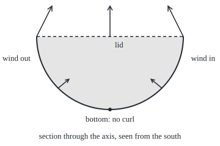

# Stokes' theorem: circulation round the rim equals curl flux through the sheet

[Syllabus](../../../SYLLABUS.md) → [Calculus and analysis](../README.md) → [Vector Calculus](../README.md#s09) → Stokes' theorem

---

## General Overview

A bowl sits in a garden: the lower half of a sphere 2 m in radius, open side up, its rim a level circle. Wind circles over it, anticlockwise seen from above, at 1 m/s along the rim.

Walk once round the rim and add up the wind's push along the path. That total is the **circulation** ([Line integrals of a field](02-line-integrals.md)): 1 m/s times the rim's 4π m, about 12.566 m^2/s.

Now forget the rim. At each point of the bowl, measure how hard the wind spins, its **curl** ([Divergence and curl](03-divergence-and-curl.md)), and keep the part aimed straight through the surface. Added over the bowl, that is a **flux** ([Surface integrals](05-surface-integrals-and-flux.md)). It also comes to 12.566 m^2/s. So does a flat lid across the rim, and so does the bowl when the wind below the rim changes but the wind on it does not.

**A smooth field's circulation round a rim, walked the matching way round, equals the flux of its curl through any surface on that rim.**

**What kind of fact this is:** a theorem, proved on this card in Why it works for surfaces with one smooth chart, and pieced together for the rest.

### The picture: the bowl cut through its axis

<p align="center"></p>

To scale: 60 px per metre, 50 px of arrow per unit of curl. Arrows show the curl of the fading wind (Step 3: the swirl, dying away towards the bottom): (−0.500, 0, 1.000) per second at the east rim, tip (275, 10); (−0.354, 0, 0.293) halfway down, tip (247, 130); 0 at the bottom. Dashed: the lid.

---

## The formula

Notation first, in words. A surface is named $S$; its rim is written $\partial S$, read "the boundary of S". On the surface, $\mathbf n$ is an arrow of length one standing straight off it; choosing its side is choosing an **orientation**. The wind $\mathbf F$ has components $F_1$, $F_2$, $F_3$, its speeds east, north and up. A circle on the integral sign, $\oint$, means "add once round a closed loop"; $d\mathbf r$ is a short step along it.

$$\oint_{\partial S} \mathbf F\cdot d\mathbf r \;=\; \iint_S (\operatorname{curl}\mathbf F)\cdot\mathbf n\,dS$$

$$\operatorname{curl}\mathbf F = \left(\frac{\partial F_3}{\partial y}-\frac{\partial F_2}{\partial z},\;\frac{\partial F_1}{\partial z}-\frac{\partial F_3}{\partial x},\;\frac{\partial F_2}{\partial x}-\frac{\partial F_1}{\partial y}\right)$$

**Read it aloud:** the wind's push added once round the rim equals the spin through the surface, added over every patch of it.

**The matching way round.** Walk the rim with head along $\mathbf n$: the surface stays on the left. Equivalently, fingers of the right hand along the walk, thumb along $\mathbf n$. For the bowl, walked anticlockwise from above, $\mathbf n$ points into the hollow, towards the sphere's centre.

That centre is the origin, x east, y north, z up; the rim is the circle of radius 2 m at height 0. The wind is $\mathbf F = w\,(-y, x, 0)$: it circles the axis, faster farther out.

| Symbol | Plain meaning | In our example | Push it up and the answer… |
| --- | --- | --- | --- |
| $S$, $\partial S$ | the surface, and its rim | the bowl; the rim circle | — (another sheet on the same rim changes nothing) |
| $\mathbf F$, $F_1$, $F_2$, $F_3$ | the wind, and its speeds east, north, up, in m/s | $w(-y, x, 0)$ | double it and both sides double |
| $\operatorname{curl}\mathbf F$ | the spin of the wind at a point, per second | (0, 0, 1) everywhere | more spin, more circulation |
| $\mathbf n$ | unit arrow off the surface, matched to the walk | into the hollow | flipping it flips the sign |
| $\oint$, $dS$, $d\mathbf r$ | add round a loop; a patch of surface; a step along the rim | m^2; m | — |
| $w$ | the swirl rate, in radians per second | 0.5 | both sides grow in proportion |
| $R$ | bowl radius, in m | 2 | both sides grow as its square |
| $u$, $v$ | grid numbers naming a point $r(u, v)$ of the surface | compass angle; angle down from the top | — (any grid gives the same flux) |

Units: curl is m/s per m, so per second; curl times m^2, or wind times m, gives m^2/s.

### When it holds

- **A two-sided surface.** A Möbius band cannot be oriented, so there is nothing to match.
- **The matching way round.** Point $\mathbf n$ out of the underside and the bowl reads −12.566 against the rim's 12.566.
- **The whole rim.** A bowl with a drain hole has two rims; the inner one is walked the other way round.
- **Continuous partial derivatives at every point of the surface.** A wind spinning round a core on the axis (a drain) has zero curl wherever it is defined, yet circulation 12.566 m^2/s. The bowl meets the axis, where that wind is undefined.

---

## Why it works

### Step 0: shared edges cancel

Cut the bowl into small patches and walk each edge the matching way round. An edge shared by two patches is walked once each way, so its push cancels; only the rim survives. Round one small patch, the circulation is about the curl's crossing part times the area: that is what curl measures. So the rim's circulation is the sum of curl times area, the flux.

### Step 1: the flat case is Green's theorem

On the lid, the flat disc of radius $R$ with $\mathbf n$ straight up, only the curl's third component, $\partial F_2/\partial x - \partial F_1/\partial y$, crosses. Circulation round the circle equals that added over the disc: [Green's theorem](06-greens-theorem.md), proved there.

For the swirl the upward curl is w − (−w) = 1 per second everywhere, over πR^2 = 4π m^2: flux 4π, the rim's 12.566.

### Step 2: a curved surface is a flat grid, bent

Name each point of the bowl by grid numbers $u$ and $v$. The rim is then the edge of a flat rectangle of grid numbers. Rewrite the wind's push in grid numbers by the chain rule and apply Green's theorem on the rectangle: what comes out is exactly the curl dotted with the grid's area arrow.

<details>
<summary>Detailed proof: one smooth chart</summary>

Let the surface be $r(u, v)$ over a flat region D where Green's theorem holds, r with continuous second partial derivatives, oriented by r_u × r_v (r_u: the rate of r in u, v held still). The anticlockwise edge of D maps to the matching walk round the rim. By the chain rule, F · dr = a du + b dv with a = F(r) · r_u and b = F(r) · r_v. Green on D gives

$$\oint_{\partial D} a\,du + b\,dv = \iint_D \left(\frac{\partial b}{\partial u} - \frac{\partial a}{\partial v}\right) du\,dv.$$

Differentiating, the terms F(r) · r_vu and F(r) · r_uv cancel, as mixed partials agree. What remains is (J r_u) · r_v − (J r_v) · r_u, J the matrix of F's partial derivatives. With A = r_u, B = r_v, the (y, z) terms give (∂F_3/∂y − ∂F_2/∂z)(A_y B_z − A_z B_y), and the other two pairs match: the sum is curl F · (A × B). So the right side is the curl's flux.

Several charts meeting along edges: add their results; shared edges cancel as in Step 0. The sphere's grid pinches at the pole: cut out a cap of angle ε, whose flux is at most the curl's size times the cap's area, and let ε go to 0.

</details>

### Step 3: the bowl by hand, twice

At height z the bowl's $\mathbf n$ has upward part −z/R. A band of sphere between two heights has area 2πR times the height difference (Archimedes), so each metre of depth carries 4π m^2 of bowl.

For the swirl, curl · n = −z/2, averaging 0.5 over the 2 m of depth: 0.5 × 2 × 4π = 4π.

A second wind: the swirl times 1 + z/R, fading to nothing at the bottom, unchanged on the rim. Its curl varies: (−0.500, 0, 1.000) at the east rim, (−0.354, 0, 0.293) halfway down, 0 at the bottom. Its crossing part at height z is (2 − 2z − 1.5z^2)/4 per second; times 4π m^2 per metre over the 2 m of depth, the terms give π × (4 + 4 − 4) = 4π. Same rim wind, same flux.

### Step 4: swap the surface when it helps

Two surfaces on the same rim give the same flux, both equal to the circulation, so the easier one may be used where the field is smooth on it. The closed-skin cousin is the [Divergence theorem](07-divergence-theorem.md). Zero curl on a region with no holes means zero circulation round every loop: [Conservative fields](04-conservative-fields-and-potentials.md).

---

## Worked numbers, by hand

| Step | Arithmetic | Value |
| --- | --- | --- |
| wind speed at the rim | 0.5 per second × 2 m | 1 m/s |
| rim length | 2π × 2 m | 4π m |
| circulation | 1 m/s × 4π m | **4π ≈ 12.566 m^2/s** |
| curl of the swirl | 2 × 0.5, pointing up | 1 per second |
| lid | 1 × π × 2^2 | 4π |
| bowl, swirl | average 0.5 × 2 m of depth × 4π | 4π |
| bowl, fading wind | (4 + 4 − 4) × π | **4π** |

One walk round the rim fixes the spin through any sheet on it: 12.566 m^2/s.

### What breaks if you drop a piece

| Mistake | Comes out at | What went wrong |
| --- | --- | --- |
| Normal out of the underside, walk unchanged | −12.566 against 12.566 | the orientations no longer match |
| Curl's size times the bowl's area | 1.000 × 25.133 = 25.133 | only the part crossing the sheet counts |
| Flux of the wind itself | 0.000 | the theorem is about the curl, not the field |
| Drain wind, "curl 0, so circulation 0" | rim 12.566, prediction 0 | the field is undefined where the bowl meets the axis |

The code prints all four.

---

## Code, from first principles, and it actually runs

The checks build π by a Simpson sum and take two roads. Road one walks the rim: wind dotted with the rim's velocity, added by Simpson's rule. Road two never touches the rim: curl and area arrow come from difference quotients, and a double Simpson sum adds their dot product over bowl and lid. The hand value 2πwR^2 is a third check; the bowl sum at 2 to 16 strips shows the error closing.

### Python

```python
# Stokes' theorem -- the check behind the card.  Standard library only.  A bowl: the lower half of a
# sphere of radius 2 m, rim at height 0.  Wind circles the rim anticlockwise seen from above.
# Road one: circulation round the rim.  Road two: difference-quotient curl, its flux through the bowl.
import math

def simpson(f, a, b, n=64):
    h = (b - a) / n
    return h / 3 * sum((1 if j in (0, n) else 4 if j % 2 else 2) * f(a + j * h) for j in range(n + 1))

PI = simpson(lambda t: 4 / (1 + t * t), 0, 1, 200)             # pi, built, not imported
R, W = 2.0, 0.5                                                 # bowl radius (m); swirl rate (per second)
swirl = lambda p: (-W * p[1], W * p[0], 0.0)                    # 1 m/s at the rim, same at every depth
fading = lambda p: tuple((1 + p[2] / R) * c for c in swirl(p))    # the same swirl, dying away to the bottom
drain = lambda p: (-2 * p[1] / (p[0] ** 2 + p[1] ** 2), 2 * p[0] / (p[0] ** 2 + p[1] ** 2), 0.0)
dot = lambda a, b: sum(x * y for x, y in zip(a, b))
cross = lambda a, b: (a[1] * b[2] - a[2] * b[1], a[2] * b[0] - a[0] * b[2], a[0] * b[1] - a[1] * b[0])
nudge = lambda p, j, h: [p[k] + h * (k == j) for k in range(3)]
def curl(F, p, h=1e-4):                                         # d[i][j]: rate of F_i along axis j
    d = [[(F(nudge(p, j, h))[i] - F(nudge(p, j, -h))[i]) / (2 * h) for j in range(3)] for i in range(3)]
    return (d[2][1] - d[1][2], d[0][2] - d[2][0], d[1][0] - d[0][1])
def rate(f, t, h=1e-5):                                         # velocity of a moving point
    return [(a - b) / (2 * h) for a, b in zip(f(t + h), f(t - h))]
def rim(F, turn=1):                                             # road one: add F . dr round the rim
    c = lambda t: (R * math.cos(t), turn * R * math.sin(t), 0.0)
    return simpson(lambda t: dot(F(c(t)), rate(c, t)), 0, 2 * PI)
def flux(G, chart, u0, u1, v0, v1, n=128):                      # G . (r_u x r_v), added over the chart
    g = lambda u, v: dot(G(chart(u, v)), cross(rate(lambda s: chart(s, v), u), rate(lambda s: chart(u, s), v)))
    return simpson(lambda u: simpson(lambda v: g(u, v), v0, v1, n), u0, u1, n)
bowl = lambda th, ph: (R * math.sin(ph) * math.cos(th), R * math.sin(ph) * math.sin(th), R * math.cos(ph))
lid = lambda r, th: (r * math.cos(th), r * math.sin(th), 0.0)
bowl_curl = lambda F, n=128: flux(lambda p: curl(F, p), bowl, 0, 2 * PI, PI / 2, PI, n)
lid_curl = lambda F: flux(lambda p: curl(F, p), lid, 0, R, 0, 2 * PI)
v3 = lambda v: "(" + ", ".join(f"{abs(x) if abs(x) < 5e-10 else x:.3f}" for x in v) + ")"
S2 = math.sqrt(2)
hand = 2 * PI * W * R ** 2
print(f"pi, built by Simpson on 4/(1+t^2): {PI:.12f}")
print(f"swirl: speed at the rim {math.sqrt(dot(swirl((2, 0, 0)), swirl((2, 0, 0)))):.3f} m/s; curl at (2, 0, 0) and (1, 0.5, -1): "
      f"{v3(curl(swirl, (2, 0, 0)))} {v3(curl(swirl, (1, .5, -1)))}")
print(f"curl of fading at rim, halfway down, bottom: {v3(curl(fading, (2, 0, 0)))} {v3(curl(fading, (S2, 0, -S2)))} {v3(curl(fading, (0, 0, -2)))}")
for name, F in (("swirl", swirl), ("fading", fading)):
    print(f"{name}: rim circulation {rim(F):.6f}; curl flux, bowl {bowl_curl(F):.6f}; lid {lid_curl(F):.6f}")
print(f"by hand, 2 pi w R^2 = {hand:.9f}")
for n in (2, 4, 8, 16):
    print(f"fading, bowl with {n:2d} Simpson strips a side: {bowl_curl(fading, n):.9f}, error {abs(bowl_curl(fading, n) - hand):.9f}")
out = flux(lambda p: curl(fading, p), lambda ph, th: bowl(th, ph), PI / 2, PI, 0, 2 * PI)
area = flux(lambda p: tuple(-c / R for c in p), bowl, 0, 2 * PI, PI / 2, PI)
print(f"break 1, normal out of the bowl, rim unchanged: {out:.3f} against {rim(fading):.3f}")
size = math.sqrt(dot(curl(swirl, (1, 1, -1)), curl(swirl, (1, 1, -1))))
print(f"break 2, curl size times bowl area: {size:.3f} x {area:.3f} = {size * area:.3f}")
print(f"break 3, flux of the wind itself through the bowl: {abs(flux(swirl, bowl, 0, 2 * PI, PI / 2, PI)):.3f}")
print(f"break 4, drain wind: rim circulation {rim(drain):.3f}; curl at (1, 0.5, -1) {v3(curl(drain, (1, .5, -1)))}")
tip = lambda p, c: f"{180 + 60 * p[0] + 50 * c[0]:.0f},{60 - 60 * p[2] - 50 * c[2]:.0f}"
pts = [(2, 0, 0), (-2, 0, 0), (S2, 0, -S2), (-S2, 0, -S2), (0, 0, 0)]
print("figure, 60 px per m, 50 px per 1/s; curl tips " + " ".join(tip(p, curl(fading, p)) for p in pts))
assert abs(rim(fading) - bowl_curl(fading)) < 1e-6 and abs(rim(swirl) - bowl_curl(swirl)) < 1e-6  # two roads
assert abs(bowl_curl(fading) - hand) < 1e-6                     # the hand count on the curved sheet
assert abs(lid_curl(fading) - rim(fading)) < 1e-6 and rim(fading, -1) < 0   # Green's flat case; turn matters
assert abs(rim(drain) - hand) < 1e-6 and abs(curl(drain, (1, .5, -1))[2]) < 1e-6   # the drain breaks it
print("ALL CHECKS PASS")
```

**Ran 2026-09-27 on macOS, Python 3.14.6, standard library only. All checks passed. Output, pasted from the run:**

```
pi, built by Simpson on 4/(1+t^2): 3.141592653590
swirl: speed at the rim 1.000 m/s; curl at (2, 0, 0) and (1, 0.5, -1): (0.000, 0.000, 1.000) (0.000, 0.000, 1.000)
curl of fading at rim, halfway down, bottom: (-0.500, 0.000, 1.000) (-0.354, 0.000, 0.293) (0.000, 0.000, 0.000)
swirl: rim circulation 12.566371; curl flux, bowl 12.566371; lid 12.566371
fading: rim circulation 12.566371; curl flux, bowl 12.566371; lid 12.566371
by hand, 2 pi w R^2 = 12.566370614
fading, bowl with  2 Simpson strips a side: 11.796764535, error 0.769606079
fading, bowl with  4 Simpson strips a side: 12.555324658, error 0.011045956
fading, bowl with  8 Simpson strips a side: 12.565896574, error 0.000474041
fading, bowl with 16 Simpson strips a side: 12.566343784, error 0.000026831
break 1, normal out of the bowl, rim unchanged: -12.566 against 12.566
break 2, curl size times bowl area: 1.000 x 25.133 = 25.133
break 3, flux of the wind itself through the bowl: 0.000
break 4, drain wind: rim circulation 12.566; curl at (1, 0.5, -1) (0.000, 0.000, 0.000)
figure, 60 px per m, 50 px per 1/s; curl tips 275,10 85,10 247,130 113,130 180,10
ALL CHECKS PASS
```

### Rust

Same numbers, same labels, built with `rustc --edition 2021 -O`.

```rust
// Stokes' theorem -- the same check as the Python, in Rust, std only.  A bowl: the lower half of a
// sphere of radius 2 m, rim at height 0.  Wind circles the rim anticlockwise seen from above.
// Road one: circulation round the rim.  Road two: difference-quotient curl, its flux through the bowl.
type V3 = [f64; 3];
type Field = dyn Fn(V3) -> V3;
const R: f64 = 2.0; const W: f64 = 0.5; // bowl radius (m); swirl rate (per second)

fn simpson(f: &dyn Fn(f64) -> f64, a: f64, b: f64, n: usize) -> f64 {
    let h = (b - a) / n as f64;
    let w = |j: usize| if j == 0 || j == n { 1.0 } else if j % 2 == 1 { 4.0 } else { 2.0 };
    h / 3.0 * (0..=n).map(|j| w(j) * f(a + j as f64 * h)).sum::<f64>()
}
fn pi() -> f64 { simpson(&|t| 4.0 / (1.0 + t * t), 0.0, 1.0, 200) } // pi, built, not imported
fn swirl(p: V3) -> V3 { [-W * p[1], W * p[0], 0.0] } // 1 m/s at the rim, same at every depth
fn fading(p: V3) -> V3 { swirl(p).map(|c| (1.0 + p[2] / R) * c) } // the same swirl, dying away to the bottom
fn drain(p: V3) -> V3 { let q = p[0] * p[0] + p[1] * p[1]; [-2.0 * p[1] / q, 2.0 * p[0] / q, 0.0] }
fn dot(a: V3, b: V3) -> f64 { a[0] * b[0] + a[1] * b[1] + a[2] * b[2] }
fn cross(a: V3, b: V3) -> V3 { [a[1] * b[2] - a[2] * b[1], a[2] * b[0] - a[0] * b[2], a[0] * b[1] - a[1] * b[0]] }
fn curl(f: &Field, p: V3) -> V3 { // d[i][j]: rate of F_i along axis j
    let (h, mut d) = (1e-4, [[0.0; 3]; 3]);
    for j in 0..3 {
        let (mut up, mut dn) = (p, p); up[j] += h; dn[j] -= h;
        let (a, b) = (f(up), f(dn));
        for i in 0..3 { d[i][j] = (a[i] - b[i]) / (2.0 * h) }
    }
    [d[2][1] - d[1][2], d[0][2] - d[2][0], d[1][0] - d[0][1]]
}
fn rate(f: &dyn Fn(f64) -> V3, t: f64) -> V3 { // velocity of a moving point
    let (a, b, h) = (f(t + 1e-5), f(t - 1e-5), 1e-5);
    [(a[0] - b[0]) / (2.0 * h), (a[1] - b[1]) / (2.0 * h), (a[2] - b[2]) / (2.0 * h)]
}
fn rim(f: &Field, turn: f64) -> f64 { // road one: add F . dr round the rim
    let c = |t: f64| [R * t.cos(), turn * R * t.sin(), 0.0];
    simpson(&|t| dot(f(c(t)), rate(&c, t)), 0.0, 2.0 * pi(), 64)
}
fn flux(g: &dyn Fn(V3) -> V3, chart: &dyn Fn(f64, f64) -> V3, u: (f64, f64), v: (f64, f64), n: usize) -> f64 {
    let at = |a: f64, b: f64| dot(g(chart(a, b)), cross(rate(&|s| chart(s, b), a), rate(&|s| chart(a, s), b)));
    simpson(&|a| simpson(&|b| at(a, b), v.0, v.1, n), u.0, u.1, n) // G . (r_u x r_v), added over the chart
}
fn bowl(th: f64, ph: f64) -> V3 { [R * ph.sin() * th.cos(), R * ph.sin() * th.sin(), R * ph.cos()] }
fn lid(r: f64, th: f64) -> V3 { [r * th.cos(), r * th.sin(), 0.0] }
fn bowl_curl(f: &Field, n: usize) -> f64 { flux(&|p| curl(f, p), &bowl, (0.0, 2.0 * pi()), (pi() / 2.0, pi()), n) }
fn lid_curl(f: &Field) -> f64 { flux(&|p| curl(f, p), &lid, (0.0, R), (0.0, 2.0 * pi()), 128) }
fn v3(v: V3) -> String {
    let s: Vec<String> = v.iter().map(|&x| format!("{:.3}", if x.abs() < 5e-10 { x.abs() } else { x })).collect();
    format!("({})", s.join(", "))
}
fn main() {
    let s2 = 2f64.sqrt();
    let hand = 2.0 * pi() * W * R * R;
    println!("pi, built by Simpson on 4/(1+t^2): {:.12}", pi());
    println!("swirl: speed at the rim {:.3} m/s; curl at (2, 0, 0) and (1, 0.5, -1): {} {}", dot(swirl([2.0, 0.0, 0.0]), swirl([2.0, 0.0, 0.0])).sqrt(),
             v3(curl(&swirl, [2.0, 0.0, 0.0])), v3(curl(&swirl, [1.0, 0.5, -1.0])));
    println!("curl of fading at rim, halfway down, bottom: {} {} {}", v3(curl(&fading, [2.0, 0.0, 0.0])),
             v3(curl(&fading, [s2, 0.0, -s2])), v3(curl(&fading, [0.0, 0.0, -2.0])));
    for (name, f) in [("swirl", &swirl as &Field), ("fading", &fading)] {
        println!("{}: rim circulation {:.6}; curl flux, bowl {:.6}; lid {:.6}", name, rim(f, 1.0), bowl_curl(f, 128), lid_curl(f));
    }
    println!("by hand, 2 pi w R^2 = {:.9}", hand);
    for n in [2, 4, 8, 16] {
        let b = bowl_curl(&fading, n);
        println!("fading, bowl with {:2} Simpson strips a side: {:.9}, error {:.9}", n, b, (b - hand).abs());
    }
    let out = flux(&|p| curl(&fading, p), &|ph, th| bowl(th, ph), (pi() / 2.0, pi()), (0.0, 2.0 * pi()), 128);
    let area = flux(&|p| p.map(|c| -c / R), &bowl, (0.0, 2.0 * pi()), (pi() / 2.0, pi()), 128);
    println!("break 1, normal out of the bowl, rim unchanged: {:.3} against {:.3}", out, rim(&fading, 1.0));
    let c = curl(&swirl, [1.0, 1.0, -1.0]);
    let size = dot(c, c).sqrt();
    println!("break 2, curl size times bowl area: {:.3} x {:.3} = {:.3}", size, area, size * area);
    println!("break 3, flux of the wind itself through the bowl: {:.3}", flux(&swirl, &bowl, (0.0, 2.0 * pi()), (pi() / 2.0, pi()), 128).abs());
    println!("break 4, drain wind: rim circulation {:.3}; curl at (1, 0.5, -1) {}", rim(&drain, 1.0), v3(curl(&drain, [1.0, 0.5, -1.0])));
    let tip = |p: V3| { let c = curl(&fading, p); format!("{:.0},{:.0}", 180.0 + 60.0 * p[0] + 50.0 * c[0], 60.0 - 60.0 * p[2] - 50.0 * c[2]) };
    let pts = [[2.0, 0.0, 0.0], [-2.0, 0.0, 0.0], [s2, 0.0, -s2], [-s2, 0.0, -s2], [0.0, 0.0, 0.0]];
    println!("figure, 60 px per m, 50 px per 1/s; curl tips {}", pts.iter().map(|&p| tip(p)).collect::<Vec<_>>().join(" "));
    assert!((rim(&fading, 1.0) - bowl_curl(&fading, 128)).abs() < 1e-6 && (rim(&swirl, 1.0) - bowl_curl(&swirl, 128)).abs() < 1e-6); // two roads
    assert!((bowl_curl(&fading, 128) - hand).abs() < 1e-6); // the hand count on the curved sheet
    assert!((lid_curl(&fading) - rim(&fading, 1.0)).abs() < 1e-6 && rim(&fading, -1.0) < 0.0); // Green's flat case; turn matters
    assert!((rim(&drain, 1.0) - hand).abs() < 1e-6 && curl(&drain, [1.0, 0.5, -1.0])[2].abs() < 1e-6); // the drain breaks it
    println!("ALL CHECKS PASS");
}
```

**Ran 2026-09-27 on macOS, rustc 1.98.1, no crates. All checks passed. Output, pasted from the run:**

```
pi, built by Simpson on 4/(1+t^2): 3.141592653590
swirl: speed at the rim 1.000 m/s; curl at (2, 0, 0) and (1, 0.5, -1): (0.000, 0.000, 1.000) (0.000, 0.000, 1.000)
curl of fading at rim, halfway down, bottom: (-0.500, 0.000, 1.000) (-0.354, 0.000, 0.293) (0.000, 0.000, 0.000)
swirl: rim circulation 12.566371; curl flux, bowl 12.566371; lid 12.566371
fading: rim circulation 12.566371; curl flux, bowl 12.566371; lid 12.566371
by hand, 2 pi w R^2 = 12.566370614
fading, bowl with  2 Simpson strips a side: 11.796764535, error 0.769606079
fading, bowl with  4 Simpson strips a side: 12.555324658, error 0.011045956
fading, bowl with  8 Simpson strips a side: 12.565896574, error 0.000474041
fading, bowl with 16 Simpson strips a side: 12.566343784, error 0.000026831
break 1, normal out of the bowl, rim unchanged: -12.566 against 12.566
break 2, curl size times bowl area: 1.000 x 25.133 = 25.133
break 3, flux of the wind itself through the bowl: 0.000
break 4, drain wind: rim circulation 12.566; curl at (1, 0.5, -1) (0.000, 0.000, 0.000)
figure, 60 px per m, 50 px per 1/s; curl tips 275,10 85,10 247,130 113,130 180,10
ALL CHECKS PASS
```

The two outputs match line for line.

> [!TIP]
> **Try changing**
> - **Double the bowl's radius: set `R` to 4.** Guess first. Every flux grows fourfold; the drain's circulation does not, so the fourth assert stops the run.
> - **Make the fading wind die out faster: replace `1 + p[2] / R` with `(1 + p[2] / R) ** 2`.** Guess first. The curl changes everywhere inside, the rim's wind does not: every flux stays 12.566.
> - **Swap the grid order in `bowl_curl`: pass `lambda ph, th: bowl(th, ph)` with the limits swapped.** Guess first. The area arrow flips: −12.566, and the first assert fails.

---

## The usual mistake

> [!warning]
> **Zero curl wherever the field is defined does not mean zero circulation.** The drain wind's rim collects 12.566 m^2/s. The theorem needs the wind smooth on a whole surface spanning the rim, and every such surface meets the axis, where the drain wind is undefined.
>
> - **Mismatched orientation:** −12.566 against 12.566.
> - **Curl's size in place of its crossing part:** 25.133, double the truth.
> - **Flux of the field in place of its curl:** the swirl runs along the bowl, so 0.000.

---

## Where you meet it in real life

- **Generators and electromagnetism.** A changing magnetic flux through a coil drives current round it. Stokes' theorem turns such loop laws into laws at each point: Magnetic fields, Maxwell's equations.
- **Weather and flight.** Spin in air is **vorticity**, the curl of the velocity; circulation round a loop, such as a ring round a wing, is the vorticity crossing any sheet it bounds.
- **History.** William Thomson stated it in an 1850 letter to George Stokes, who set it on Cambridge's 1854 Smith's Prize examination.

> **Say it back**
> Circulation adds a field's push round a rim; curl flux adds the curl's crossing part over a surface. Walked so the surface stays on the left of a head along the normal, the two are equal. On the bowl both are 4π, and so is the flat lid, which is Green's theorem. The field must be smooth on the whole surface, or a drain wind breaks it.

---

## What this builds on

- [Green's theorem](06-greens-theorem.md): the flat case, where the proof pulls the bowl back to.
- [Surface integrals](05-surface-integrals-and-flux.md): grids, the area arrow, flux through a sheet.

## Where this goes next

- Magnetic fields: a changing flux through a loop, felt as a push round it.
- Maxwell's equations: loop laws turned into curl laws at each point.
- Cohomology and the cup product in outline: counting holes by the loops that bound nothing.
- De Rham cohomology: curl-free fields modulo gradients, as a measure of shape.
- Stokes on manifolds: Green, Stokes, divergence and the fundamental theorem of calculus as one statement.

The drain wind leaves a question open: when a field with zero curl wherever it is defined still circulates, what does that say about the holes in its space?

---

## Sources

Verified 2026-09-27: every link below resolves to the publisher's page.

- Strang, Gilbert, and Edwin Herman. *Calculus Volume 3*, OpenStax, 2016. [Section 6.7, Stokes' theorem](https://openstax.org/books/calculus-volume-3/pages/6-7-stokes-theorem). Free; orientation, worked hemispheres, the proof's scope.
- Katz, Victor J. "The History of Stokes' Theorem." *Mathematics Magazine* 52, no. 3 (1979): 146–156. [DOI 10.1080/0025570X.1979.11976770](https://doi.org/10.1080/0025570X.1979.11976770). Thomson's 1850 letter and the 1854 examination.
- O'Connor, J. J., and E. F. Robertson. "George Gabriel Stokes." MacTutor Archive, University of St Andrews. [Biography](https://mathshistory.st-andrews.ac.uk/Biographies/Stokes/). Stokes's life and work.
