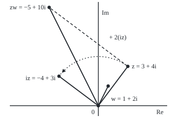

# Complex numbers: one new number i with i squared = -1, and every pair of coordinates becomes a number you can multiply

Complex analysis → Complex Numbers and the Plane → Points that multiply → Complex numbers

---

## General Overview

A delivery drone hovers 3 km east and 4 km north of its depot. Two coordinates fix it: the pair (3, 4). Pairs already add, coordinate by coordinate.

Pairs do not yet multiply. One new number makes them: i, whose square is −1. No number on the ordinary line has that property, since a real number times itself is never negative. So i sits off the line, at the point (0, 1).

The drone's pair is then written 3 + 4i, a single number. Numbers of this form are the **complex numbers**: "complex" means built of two parts, and i is no less real than −1. Multiplying the drone by i moves it to −4 + 3i, the same 5 km out, turned a quarter turn anticlockwise. Multiplying by 1 + 2i sends it to −5 + 10i.

**A complex number is a point of the plane written a + bi; adding is adding coordinates, and multiplying follows from the one rule i × i = −1, which makes multiplying by i a quarter turn.**

**What kind of fact this is:** a definition, the rules for adding and multiplying pairs; that these rules obey the usual laws of arithmetic, and that times i is a quarter turn, are theorems proved in Why it works.

### The picture: the drone, turned and multiplied

<p align="center"></p>

To scale, 20 units per km, depot at 0. The dotted arc, radius 5 km, is the quarter turn to iz; the dashed line adds two copies of iz to z and lands on zw.

---

## The formula

Notation first, in words. A complex number is written $z = a + bi$, with $a$ and $b$ ordinary real numbers. The **real part**, $\mathrm{Re}\,z$, is $a$, the east coordinate; the **imaginary part**, $\mathrm{Im}\,z$, is $b$, the north coordinate. The set of all complex numbers is written $\mathbb{C}$. A second number is $w = c + di$.

$$i^2 = -1, \qquad (a + bi) + (c + di) = (a + c) + (b + d)i$$

$$(a + bi)(c + di) = (ac - bd) + (ad + bc)i$$

**Read it aloud:** i squared is minus one; add part by part; the product's east part is ac minus bd, its north part ad plus bc.

As bare pairs, $i$ is $(0, 1)$. Setting $c = 0$, $d = 1$ gives the case that carries the geometry:

$$i\,(a + bi) = -b + ai$$

**Read it aloud:** times i, the point (a, b) moves to (−b, a), a quarter turn anticlockwise about 0.

| Symbol | Plain meaning | In our example | Push it up and the answer… |
| --- | --- | --- | --- |
| $i$ | the new number, the point (0, 1), with $i^2 = -1$ | 0 + 1i | — |
| $z$ | a complex number: the drone, in km | 3 + 4i | the product moves with it |
| $a$, $b$ | real and imaginary parts, $\mathrm{Re}\,z$ and $\mathrm{Im}\,z$ | 3 and 4 | the point moves east, north |
| $w$ | the multiplier | 1 + 2i | a bigger stretch |
| $c$, $d$ | real and imaginary parts of $w$ | 1 and 2 | more of z, more of iz |
| $\mathbb{C}$ | the set of all complex numbers, the whole plane | — | — |
| $x$ | the unknown in $x^2 + 2x + 5 = 0$ | −1 + 2i | — |

### When it holds

- **A definition, so always:** any two real numbers make a complex number, and any two complex numbers add and multiply.
- **Real numbers sit inside unchanged:** a real number $a$ is the point $a + 0i$ on the east-west line, and two of them multiply as before, (2 + 0i)(−3 + 0i) = −6.
- **No "bigger than":** no ordering of complex numbers respects multiplying, since any square, $i^2$ included, would then be positive. Only distances from 0 compare.
- **Quarter turn needs equal units:** stretch one axis and the turn becomes a skew.

---

## Why it works

### Step 0: a point is already a pair, so only multiplying is missing

The drone's position is the ordered pair (3, 4) ([ordered-pairs-and-cartesian-product](../../01-Foundations/07-Sets/05-ordered-pairs-and-cartesian-product.md)), and pairs already add. The wanted multiplication keeps real numbers as they were and has some number, i, whose square is −1. Keep every ordinary law of arithmetic and the rule is forced.

### Step 1: the rule is forced by i squared = −1

Multiply out term by term, as with any two brackets:

$$(a + bi)(c + di) = ac + adi + bci + bd\,i^2 = (ac - bd) + (ad + bc)i$$

The last term, $bd\,i^2$, becomes $-bd$: the whole of the new rule. For the drone and $w = 1 + 2i$: ac = 3, bd = 8, ad = 6, bc = 4. The product is $(3 - 8) + (6 + 4)i = -5 + 10i$.

No choice was made: the ordinary laws plus $i^2 = -1$ leave only this rule.

### Step 2: times i is a quarter turn

Put $c = 0$ and $d = 1$: $i(a + bi) = -b + ai$. The drone (3, 4) goes to (−4, 3).

The length from 0 is unchanged, $\sqrt{(-b)^2 + a^2} = \sqrt{a^2 + b^2}$: both points are 5 km out. The two arrows meet at a square corner, since their dot product is $a(-b) + b(a) = 0$. Same length, square corner, anticlockwise: a quarter turn.

Turn four times and the drone is home: −4 + 3i, −3 − 4i, 4 − 3i, then 3 + 4i. Two quarter turns make a half turn, which points the arrow backwards: multiplying by −1. That is why $i \times i = -1$.

### Step 3: multiplying by w is turn and add

Since $w = c + di$, the distributive law gives $zw = c\,z + d\,(iz)$: c copies of the drone, plus d copies of the drone turned a quarter. For $w = 1 + 2i$:

$$zw = 1\,(3 + 4i) + 2\,(-4 + 3i) = -5 + 10i$$

This road uses only adding and the quarter turn, never Step 1's rule, and lands on the same point: the dashed line in the picture. Every product turns and stretches; the turn as an angle is [polar-form-and-argument](03-polar-form-and-argument.md).

### Step 4: the usual laws survive

Order does not matter: $wz = zw = -5 + 10i$. Grouping does not matter: $(zw)\,i$ and $z\,(wi)$ both come to −10 − 5i. Multiplying spreads over adding, and every number except 0 has a reciprocal. A number system obeying all of these is a **field**: $\mathbb{C}$ is one, as the real numbers are.

<details>
<summary>Detailed proof: the field laws for pairs</summary>

Write $z = (a, b)$, $w = (c, d)$, $u = (e, f)$, with the product $(a, b)(c, d) = (ac - bd,\ ad + bc)$.

**Order.** $(c, d)(a, b) = (ca - db,\ cb + da)$: the same two numbers.

**Grouping.** Expanded, $(zw)u$ and $z(wu)$ both have east part $ace - bde - adf - bcf$ and north part $acf - bdf + ade + bce$.

**Spreading.** Each part of the product is a sum of (a part of $z$) times (a part of $w$), and real multiplying spreads over adding, so $z(w + u) = zw + zu$.

**Reciprocals.** For $(a, b) \ne (0, 0)$, $a^2 + b^2 > 0$ and $(a, b)\bigl(a/(a^2 + b^2),\ -b/(a^2 + b^2)\bigr) = (1, 0)$.

</details>

### Step 5: equations with no real root now have roots

Take $x^2 + 2x + 5 = 0$. The quadratic formula ([quadratic-formula](../../03-Algebra/02-Polynomials/03-quadratic-formula.md)) needs the square root of the discriminant, $2^2 - 4 \times 5 = -16$, which has none on the real line. In $\mathbb{C}$ it has one, $4i$, since $(4i)^2 = 16\,i^2 = -16$. The roots are $-1 \pm 2i$.

Check −1 + 2i: its square is −3 − 4i, twice it is −2 + 4i, and the three terms sum to 0. Every non-constant polynomial has a complex root: the [fundamental-theorem-of-algebra](../../03-Algebra/10-For%20the%20Curious/01-fundamental-theorem-of-algebra.md). Rafael Bombelli first wrote down rules for adding and multiplying such numbers, in his *Algebra* of 1572.

A second road writes a + bi as the matrix `[[a, -b], [b, a]]`; multiplying matrices then multiplies complex numbers: [complex-vectors-and-matrices](07-complex-vectors-and-matrices.md).

---

## Worked numbers, by hand

| Step | Arithmetic | Value |
| --- | --- | --- |
| add | (3 + 1) + (4 + 2)i | 4 + 6i |
| subtract | (3 − 1) + (4 − 2)i | 2 + 2i |
| the four pieces | ac = 3, bd = 8, ad = 6, bc = 4 | — |
| multiply | (3 − 8) + (6 + 4)i | **−5 + 10i** |
| quarter turn | i(3 + 4i) = −4 + 3i | same 5 km, square corner |
| turn and add | (3 + 4i) + 2(−4 + 3i) | **−5 + 10i** |

The drone lands at −5 + 10i: one copy of where it is, plus two of its quarter turn.

### What breaks if you drop a piece

| Mistake | Comes out at | What went wrong |
| --- | --- | --- |
| Multiplying part by part | 3 + 8i, not −5 + 10i | The cross terms ad and bc were lost |
| $i^2$ taken as +1 | 11 + 10i, not −5 + 10i | bd was added, not subtracted |
| Turned the wrong way, (b, −a) | 4 − 3i, not −4 + 3i | A clockwise turn: times −i |

The code prints all three.

---

## Code, from first principles, and it actually runs

The code builds complex numbers from pairs, importing nothing. The product takes two roads: Step 1's pair rule, and turn-and-add. The quarter turn is checked by geometry: same length, zero dot product. A second case solves $x^2 + 2x + 5 = 0$. The first line prints the picture's coordinates.

### Python

```python
# Complex numbers -- the check behind the card.  Nothing is imported.
# A complex number is a pair (a, b) of reals, written a + bi.  The drone sits at
# z = 3 + 4i km from its depot; the multiplier is w = 1 + 2i.  Two roads to each
# product: the pair rule, and turn-and-add (w = c + di means c copies of z plus
# d copies of z turned a quarter left), which never calls the pair rule.
def add(p, q): return (p[0] + q[0], p[1] + q[1])
def scale(k, p): return (k * p[0], k * p[1])
def mul(p, q):                        # road one: (a + bi)(c + di) = (ac - bd) + (ad + bc)i
    (a, b), (c, d) = p, q
    return (a * c - b * d, a * d + b * c)
def quarter(p): return (-p[1], p[0])  # a quarter turn left: the point (a, b) goes to (-b, a)
def turn_and_add(p, q):               # road two: c copies of p, plus d copies of p turned
    return add(scale(q[0], p), scale(q[1], quarter(p)))
def length(p): return (p[0] * p[0] + p[1] * p[1]) ** 0.5
def dot(p, q): return p[0] * q[0] + p[1] * q[1]
def fmt(p):
    re, im = p[0] + 0.0, p[1] + 0.0
    return f"{re:.6f} {'-' if im < 0 else '+'} {abs(im):.6f}i"

I, z, w = (0.0, 1.0), (3.0, 4.0), (1.0, 2.0)
sc, ox, oy = 20, 200, 215
pix = lambda p: f"({ox + sc * p[0]:.0f}, {oy - sc * p[1]:.0f})"
zw, zw2, iz = mul(z, w), turn_and_add(z, w), mul(I, z)
turns, p = [], z
for _ in range(4):
    p = mul(I, p)
    turns.append(fmt(p))
b, c = 2.0, 5.0                       # second case: x^2 + 2x + 5 = 0, by the quadratic formula
disc = b * b - 4 * c
roots = [(-b / 2, s * (-disc) ** 0.5 / 2) for s in (1, -1)]
plug = [add(add(mul(r, r), scale(b, r)), (c, 0.0)) for r in roots]
left, right = mul(mul(z, w), I), mul(z, mul(w, I))
print(f"figure, scale {sc} px per km, depot {pix((0, 0))}; z {pix(z)}; iz {pix(iz)}; "
      f"w {pix(w)}; zw {pix(zw)}; arc radius {sc * length(z):.0f}")
print(f"i times i = {fmt(mul(I, I))}")
print(f"z + w = {fmt(add(z, w))}; z - w = {fmt(add(z, scale(-1, w)))}")
print(f"pair rule parts: ac = {z[0] * w[0]:.6f}, bd = {z[1] * w[1]:.6f}, ad = {z[0] * w[1]:.6f}, bc = {z[1] * w[0]:.6f}")
print(f"zw by the pair rule = {fmt(zw)}")
print(f"zw by z + 2(iz), turn and add = {fmt(zw2)}")
print(f"wz by the pair rule = {fmt(mul(w, z))}")
print(f"iz by the pair rule = {fmt(iz)}; by the quarter turn = {fmt(quarter(z))}")
print(f"|z| = {length(z):.6f}; |iz| = {length(iz):.6f}; z dot iz = {dot(z, iz):.6f}")
print(f"one to four quarter turns of z: {'; '.join(turns)}")
print(f"on the real axis: (2 + 0i)(-3 + 0i) = {fmt(mul((2.0, 0.0), (-3.0, 0.0)))}")
print(f"(zw)i = {fmt(left)}; z(wi) = {fmt(right)}")
print(f"x^2 + 2x + 5 = 0: discriminant {disc:.6f}; roots {fmt(roots[0])} and {fmt(roots[1])}")
print(f"root squared = {fmt(mul(roots[0], roots[0]))}; 2 times root = {fmt(scale(b, roots[0]))}")
print(f"each root put back in: {fmt(plug[0])} and {fmt(plug[1])}")
print(f"mistake 1, multiplying part by part: {fmt((z[0] * w[0], z[1] * w[1]))}, not {fmt(zw)}")
print(f"mistake 2, i squared taken as +1: {fmt((z[0] * w[0] + z[1] * w[1], z[0] * w[1] + z[1] * w[0]))}, not {fmt(zw)}")
print(f"mistake 3, turned the wrong way, (b, -a): {fmt((z[1], -z[0]))}, not {fmt(iz)}")
assert abs(zw[0] - zw2[0]) < 1e-12 and abs(zw[1] - zw2[1]) < 1e-12      # two roads, one product
assert abs(length(iz) - length(z)) < 1e-12 and abs(dot(z, iz)) < 1e-12   # times i: same length, square corner
assert all(abs(v[0]) < 1e-12 and abs(v[1]) < 1e-12 for v in plug)        # the formula's roots solve it
assert abs(left[0] - right[0]) < 1e-12 and abs(left[1] - right[1]) < 1e-12  # grouping does not matter
print("ALL CHECKS PASS")
```

**Ran 2026-09-27 on macOS, Python 3.14.6, standard library only. All checks passed. Output, pasted from the run:**

```
figure, scale 20 px per km, depot (200, 215); z (260, 135); iz (120, 155); w (220, 175); zw (100, 15); arc radius 100
i times i = -1.000000 + 0.000000i
z + w = 4.000000 + 6.000000i; z - w = 2.000000 + 2.000000i
pair rule parts: ac = 3.000000, bd = 8.000000, ad = 6.000000, bc = 4.000000
zw by the pair rule = -5.000000 + 10.000000i
zw by z + 2(iz), turn and add = -5.000000 + 10.000000i
wz by the pair rule = -5.000000 + 10.000000i
iz by the pair rule = -4.000000 + 3.000000i; by the quarter turn = -4.000000 + 3.000000i
|z| = 5.000000; |iz| = 5.000000; z dot iz = 0.000000
one to four quarter turns of z: -4.000000 + 3.000000i; -3.000000 - 4.000000i; 4.000000 - 3.000000i; 3.000000 + 4.000000i
on the real axis: (2 + 0i)(-3 + 0i) = -6.000000 + 0.000000i
(zw)i = -10.000000 - 5.000000i; z(wi) = -10.000000 - 5.000000i
x^2 + 2x + 5 = 0: discriminant -16.000000; roots -1.000000 + 2.000000i and -1.000000 - 2.000000i
root squared = -3.000000 - 4.000000i; 2 times root = -2.000000 + 4.000000i
each root put back in: 0.000000 + 0.000000i and 0.000000 + 0.000000i
mistake 1, multiplying part by part: 3.000000 + 8.000000i, not -5.000000 + 10.000000i
mistake 2, i squared taken as +1: 11.000000 + 10.000000i, not -5.000000 + 10.000000i
mistake 3, turned the wrong way, (b, -a): 4.000000 - 3.000000i, not -4.000000 + 3.000000i
ALL CHECKS PASS
```

### Rust

Same numbers, same labels, built with `rustc --edition 2021 -O`.

```rust
// Complex numbers -- the same check as the Python, in Rust.  No crates.
// A complex number is a pair (a, b) of reals, written a + bi.  The drone sits at
// z = 3 + 4i km from its depot; the multiplier is w = 1 + 2i.  Two roads to each
// product: the pair rule, and turn-and-add (w = c + di means c copies of z plus
// d copies of z turned a quarter left), which never calls the pair rule.
#[derive(Clone, Copy)]
struct P { re: f64, im: f64 }
fn p(re: f64, im: f64) -> P { P { re, im } }
fn add(x: P, y: P) -> P { p(x.re + y.re, x.im + y.im) }
fn scale(k: f64, x: P) -> P { p(k * x.re, k * x.im) }
fn mul(x: P, y: P) -> P {             // road one: (a + bi)(c + di) = (ac - bd) + (ad + bc)i
    p(x.re * y.re - x.im * y.im, x.re * y.im + x.im * y.re)
}
fn quarter(x: P) -> P { p(-x.im, x.re) }  // a quarter turn left: the point (a, b) goes to (-b, a)
fn turn_and_add(x: P, y: P) -> P {    // road two: c copies of x, plus d copies of x turned
    add(scale(y.re, x), scale(y.im, quarter(x)))
}
fn length(x: P) -> f64 { (x.re * x.re + x.im * x.im).sqrt() }
fn dot(x: P, y: P) -> f64 { x.re * y.re + x.im * y.im }
fn fmt(x: P) -> String {
    let (re, im) = (x.re + 0.0, x.im + 0.0);
    format!("{:.6} {} {:.6}i", re, if im < 0.0 { "-" } else { "+" }, im.abs())
}
fn near(x: P, y: P) -> bool { (x.re - y.re).abs() < 1e-12 && (x.im - y.im).abs() < 1e-12 }

fn main() {
    let (i, z, w) = (p(0.0, 1.0), p(3.0, 4.0), p(1.0, 2.0));
    let (sc, ox, oy) = (20.0, 200.0, 215.0);
    let pix = |x: P| format!("({:.0}, {:.0})", ox + sc * x.re, oy - sc * x.im);
    let (zw, zw2, iz) = (mul(z, w), turn_and_add(z, w), mul(i, z));
    let mut turns: Vec<String> = Vec::new();
    let mut q = z;
    for _ in 0..4 { q = mul(i, q); turns.push(fmt(q)); }
    let (b, c) = (2.0, 5.0);          // second case: x^2 + 2x + 5 = 0, by the quadratic formula
    let disc = b * b - 4.0 * c;
    let roots: Vec<P> = [1.0, -1.0].iter().map(|s| p(-b / 2.0, s * (-disc).sqrt() / 2.0)).collect();
    let plug: Vec<P> = roots.iter().map(|&r| add(add(mul(r, r), scale(b, r)), p(c, 0.0))).collect();
    let (left, right) = (mul(mul(z, w), i), mul(z, mul(w, i)));
    println!("figure, scale {} px per km, depot {}; z {}; iz {}; w {}; zw {}; arc radius {:.0}",
             sc, pix(p(0.0, 0.0)), pix(z), pix(iz), pix(w), pix(zw), sc * length(z));
    println!("i times i = {}", fmt(mul(i, i)));
    println!("z + w = {}; z - w = {}", fmt(add(z, w)), fmt(add(z, scale(-1.0, w))));
    println!("pair rule parts: ac = {:.6}, bd = {:.6}, ad = {:.6}, bc = {:.6}", z.re * w.re, z.im * w.im, z.re * w.im, z.im * w.re);
    println!("zw by the pair rule = {}", fmt(zw));
    println!("zw by z + 2(iz), turn and add = {}", fmt(zw2));
    println!("wz by the pair rule = {}", fmt(mul(w, z)));
    println!("iz by the pair rule = {}; by the quarter turn = {}", fmt(iz), fmt(quarter(z)));
    println!("|z| = {:.6}; |iz| = {:.6}; z dot iz = {:.6}", length(z), length(iz), dot(z, iz));
    println!("one to four quarter turns of z: {}", turns.join("; "));
    println!("on the real axis: (2 + 0i)(-3 + 0i) = {}", fmt(mul(p(2.0, 0.0), p(-3.0, 0.0))));
    println!("(zw)i = {}; z(wi) = {}", fmt(left), fmt(right));
    println!("x^2 + 2x + 5 = 0: discriminant {:.6}; roots {} and {}", disc, fmt(roots[0]), fmt(roots[1]));
    println!("root squared = {}; 2 times root = {}", fmt(mul(roots[0], roots[0])), fmt(scale(b, roots[0])));
    println!("each root put back in: {} and {}", fmt(plug[0]), fmt(plug[1]));
    println!("mistake 1, multiplying part by part: {}, not {}", fmt(p(z.re * w.re, z.im * w.im)), fmt(zw));
    println!("mistake 2, i squared taken as +1: {}, not {}",
             fmt(p(z.re * w.re + z.im * w.im, z.re * w.im + z.im * w.re)), fmt(zw));
    println!("mistake 3, turned the wrong way, (b, -a): {}, not {}", fmt(p(z.im, -z.re)), fmt(iz));
    assert!(near(zw, zw2));                                                  // two roads, one product
    assert!((length(iz) - length(z)).abs() < 1e-12 && dot(z, iz).abs() < 1e-12); // times i: same length, square corner
    assert!(plug.iter().all(|&v| near(v, p(0.0, 0.0))));                     // the formula's roots solve it
    assert!(near(left, right));                                              // grouping does not matter
    println!("ALL CHECKS PASS");
}
```

**Ran 2026-09-27 on macOS, rustc 1.98.1, no crates. All checks passed. Output, pasted from the run:**

```
figure, scale 20 px per km, depot (200, 215); z (260, 135); iz (120, 155); w (220, 175); zw (100, 15); arc radius 100
i times i = -1.000000 + 0.000000i
z + w = 4.000000 + 6.000000i; z - w = 2.000000 + 2.000000i
pair rule parts: ac = 3.000000, bd = 8.000000, ad = 6.000000, bc = 4.000000
zw by the pair rule = -5.000000 + 10.000000i
zw by z + 2(iz), turn and add = -5.000000 + 10.000000i
wz by the pair rule = -5.000000 + 10.000000i
iz by the pair rule = -4.000000 + 3.000000i; by the quarter turn = -4.000000 + 3.000000i
|z| = 5.000000; |iz| = 5.000000; z dot iz = 0.000000
one to four quarter turns of z: -4.000000 + 3.000000i; -3.000000 - 4.000000i; 4.000000 - 3.000000i; 3.000000 + 4.000000i
on the real axis: (2 + 0i)(-3 + 0i) = -6.000000 + 0.000000i
(zw)i = -10.000000 - 5.000000i; z(wi) = -10.000000 - 5.000000i
x^2 + 2x + 5 = 0: discriminant -16.000000; roots -1.000000 + 2.000000i and -1.000000 - 2.000000i
root squared = -3.000000 - 4.000000i; 2 times root = -2.000000 + 4.000000i
each root put back in: 0.000000 + 0.000000i and 0.000000 + 0.000000i
mistake 1, multiplying part by part: 3.000000 + 8.000000i, not -5.000000 + 10.000000i
mistake 2, i squared taken as +1: 11.000000 + 10.000000i, not -5.000000 + 10.000000i
mistake 3, turned the wrong way, (b, -a): 4.000000 - 3.000000i, not -4.000000 + 3.000000i
ALL CHECKS PASS
```

The two outputs match line for line.

> [!TIP]
> **Try changing**
> Guess first, then run it.
> - **Multiply by −1.** Set `w` to `(-1.0, 0.0)` (Rust: `p(-1.0, 0.0)`). Both roads give −3 − 4i: the half turn, two quarter turns.
> - **Break the rule.** Change `a * c - b * d` to `a * c + b * d`. The pair rule gives 11 + 10i, turn-and-add still −5 + 10i; the first assert stops the run.
> - **Turn the other way.** Make `quarter` return `(p[1], -p[0])`. The roads disagree and the first assert stops the run.

---

## The usual mistake

> [!warning]
> **Multiplying the parts separately.** Adding goes part by part, so multiplying that way is tempting: 3 + 8i. But each part of one factor meets both parts of the other, and the north parts make $bd\,i^2 = -bd$. The product is −5 + 10i.
>
> - **Dropping the minus from $i^2$.** Treating $bd\,i^2$ as $+bd$ gives 11 + 10i.
> - **Turning the wrong way.** Times i sends (a, b) to (−b, a), anticlockwise; (b, −a) gives 4 − 3i, which is times −i.
> - **Calling $\mathbb{C}$ "the most complete number system".** It holds every polynomial root, but gave up order to get there. Larger systems exist: the quaternions, which give up the rule that order of multiplying does not matter.
> - **Reading "imaginary" as unreal.** i is the point (0, 1), as concrete as −1.

---

## Where you meet it in real life

- **Electrical engineering.** Alternating currents and voltages are complex numbers, and circuit rules become complex arithmetic. Engineers write j for i.
- **Turning shapes on a screen.** A 2D drawing program turns a point by multiplying by a complex number of length 1, as [eulers-formula](04-eulers-formula.md) makes exact.
- **Signals and sound.** A pure tone is a point turning round a circle; the equally spaced points of [powers-roots-and-roots-of-unity](05-powers-roots-and-roots-of-unity.md) split sound into pitches.

> **Say it back**
> A complex number is a point of the plane, written a + bi, with i the point (0, 1). Adding is adding coordinates. Multiplying follows from ordinary algebra and one rule, i times i is −1. Times i is a quarter turn anticlockwise; two make a half turn, which is why i squared is −1. Multiplying by c + di is c copies of the point plus d copies of its quarter turn.

---

## What this builds on

- [ordered-pairs-and-cartesian-product](../../01-Foundations/07-Sets/05-ordered-pairs-and-cartesian-product.md): a point as an ordered pair.
- [quadratic-formula](../../03-Algebra/02-Polynomials/03-quadratic-formula.md): the formula whose negative discriminant first called for i.
- [fundamental-theorem-of-algebra](../../03-Algebra/10-For%20the%20Curious/01-fundamental-theorem-of-algebra.md): no further numbers are needed for roots.

## Where this goes next

- [conjugate-and-modulus](02-conjugate-and-modulus.md): the mirror image of a point, its distance from 0, and division.
- [complex-eigenvalues-and-spirals](../../08-Differential%20equations%20and%20dynamics/04-Systems%20and%20the%20Matrix%20Exponential/03-complex-eigenvalues-and-spirals.md): complex roots of a system's equation, seen as turning motion.
- complex-manifolds-and-kahler-forms: spaces that look like the complex plane up close.
- rotations-so3-and-quaternions: the quaternions, which do for turns in space what i does for the plane.

---

## Sources

Verified 2026-09-28: every link below opens a page naming the cited work.

- Stein, Elias M., and Rami Shakarchi. *Complex Analysis*. Princeton Lectures in Analysis II. Princeton University Press, 2003. [Publisher page](https://press.princeton.edu/books/hardcover/9780691113852/complex-analysis). Chapter 1: complex numbers as points, and their arithmetic.
- O'Connor, J. J., and E. F. Robertson. "Rafael Bombelli." MacTutor Archive, University of St Andrews. [Biography](https://mathshistory.st-andrews.ac.uk/Biographies/Bombelli/). The 1572 *Algebra*, the first written rules for adding and multiplying complex numbers.
- O'Connor, J. J., and E. F. Robertson. "Caspar Wessel." MacTutor Archive, University of St Andrews. [Biography](https://mathshistory.st-andrews.ac.uk/Biographies/Wessel/). The 1797 paper that first drew complex numbers in the plane.
- O'Connor, J. J., and E. F. Robertson. "William Rowan Hamilton." MacTutor Archive, University of St Andrews. [Biography](https://mathshistory.st-andrews.ac.uk/Biographies/Hamilton/). The 1833 paper defining complex numbers as pairs of reals.
