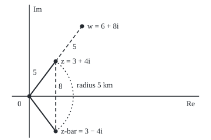

# Conjugate and modulus: flip across the axis, measure the distance, and division falls out

Complex analysis → Complex Numbers and the Plane → Mirror and length → Conjugate and modulus

---

## General Overview

A delivery drone hovers 3 km east and 4 km north of its depot. In the complex plane it is the point 3 + 4i, east along the real axis and north up the imaginary axis, where i is the number whose square is −1 ([complex-numbers](01-complex-numbers.md)). Pythagoras puts it 5 km out, since 3 × 3 + 4 × 4 = 25.

Reflect the drone in the east-west line and it lands at 3 − 4i, also 5 km out. That mirror image is the **conjugate**. Multiply the drone by its mirror: (3 + 4i)(3 − 4i) = 25, a real number, the squared distance.

Its square root is the distance from the depot, the **modulus**. The same product turns division by 3 + 4i into division by 25: (1 + 2i)/(3 + 4i) = (11 + 2i)/25. And the modulus of a difference is a distance: a second drone at 6 + 8i is 5 km from the first.

**The conjugate flips a point across the real axis; a point times its flip is its squared distance from 0, a real number, and that one fact gives length, distance and division.**

**What kind of fact this is:** two definitions; the rules they obey, the triangle inequality among them, are theorems proved in Why it works.

### The picture: the drone, its mirror, the second drone

<p align="center"></p>

To scale, 15 units per km, depot at 0. The drone and its mirror sit on the same 5 km circle; the second drone is 5 km further along the same line; the mirror is 8 km below the drone.

---

## The formula

Notation first, in words. For $z = a + bi$, with real part $a$ and imaginary part $b$, the conjugate is written $z$ with a bar over it, $\bar z$, read "z-bar". The modulus is written between upright bars, $\lvert z\rvert$, like an absolute value, read "mod z".

$$\bar z = a - bi, \qquad \lvert z\rvert = \sqrt{a^2 + b^2} = \sqrt{z\,\bar z}$$

**Read it aloud:** z-bar flips the sign of the imaginary part; mod z, the distance from 0 to z, is the square root of z times z-bar.

Three consequences carry the rest of the card:

$$\frac{p}{z} = \frac{p\,\bar z}{\lvert z\rvert^2}, \qquad \lvert z w\rvert = \lvert z\rvert\,\lvert w\rvert, \qquad \lvert z + w\rvert \le \lvert z\rvert + \lvert w\rvert$$

**Read it aloud:** to divide by z, multiply by z-bar and divide by a real number; the length of a product is the product of the lengths; the length of a sum is at most the sum of the lengths.

The distance between two points is the modulus of their difference, $\lvert w - z\rvert$. The last rule is the **triangle inequality**, after the triangle with corners 0, $z$ and $z + w$.

| Symbol | Plain meaning | In our example | Push it up and the answer… |
| --- | --- | --- | --- |
| $z$ | a complex number: the drone, in km | 3 + 4i | the mirror moves too |
| $a$, $b$ | real and imaginary parts, Re z and Im z | 3 and 4 | a longer arrow |
| $i$ | the number whose square is −1 | 0 + 1i | — |
| $\bar z$ | the conjugate: $z$ reflected in the real axis | 3 − 4i | same size, flipped |
| $\lvert z\rvert$ | the modulus: distance from 0 to $z$ | 5 | a longer arrow |
| $w$ | the second drone | 6 + 8i | a new distance from $z$ |
| $p$ | a beacon, divided by $z$ | 1 + 2i | a bigger quotient |
| $t$ | a direction in radians from east, for the shadow check | best along the drone's own line | the shadow rises, then falls |

### When it holds

- **Any complex number:** both are definitions, valid for every $z$.
- **Division needs a nonzero bottom:** $\lvert z\rvert^2$ is 0 only when $z = 0$, and then no quotient exists.
- **Distance needs equal units on both axes:** otherwise Pythagoras, and so the modulus, stops meaning distance.
- **Inequalities compare moduli only:** complex numbers themselves have no order.

---

## Why it works

### Step 1: z times z-bar is the squared length

Expand, using $i^2 = -1$. The middle terms cancel and the last turns positive:

$$z\,\bar z = (a + bi)(a - bi) = a^2 - abi + abi - b^2 i^2 = a^2 + b^2$$

For the drone, 9 − 12i + 12i + 16 = 25. By Pythagoras, $a^2 + b^2$ is the squared distance from 0 to $(a, b)$ ([absolute-value-and-distance](../../01-Foundations/02-The%20Number%20Line/05-absolute-value-and-distance.md)). So $\lvert z\rvert = \sqrt{z\,\bar z}$, and the modulus is 5 km. The root is the non-negative one ([roots-and-fractional-exponents](../../01-Foundations/03-Powers%2C%20Roots%20and%20Logarithms/03-roots-and-fractional-exponents.md)). For a real number, $b = 0$ and the modulus is the ordinary absolute value.

### Step 2: the mirror respects adding and multiplying

Flipping twice returns the original; the flip of a sum is the sum of flips. With $w = c + di$:

$$\overline{z w} = (ac - bd) - (ad + bc)i = (a - bi)(c - di) = \bar z\,\bar w$$

The mirror of a product is the product of mirrors. And a number plus its flip doubles the real part, $z + \bar z = 2a = 2\,\mathrm{Re}\,z$.

### Step 3: division by z becomes division by a real number

Multiply top and bottom by the same nonzero number, $\bar z$:

$$\frac{1 + 2i}{3 + 4i} = \frac{(1 + 2i)(3 - 4i)}{(3 + 4i)(3 - 4i)} = \frac{3 - 4i + 6i + 8}{25} = \frac{11 + 2i}{25} = 0.44 + 0.08i$$

The bottom is now real. With $p = 1$ this gives the reciprocal, $1/z = \bar z / \lvert z\rvert^2$: for the drone, 0.12 − 0.16i.

A second road skips the conjugate. Ask which $x + iy$ gives $(3 + 4i)(x + iy) = 1 + 2i$. Matching parts gives two real equations, $3x - 4y = 1$ and $4x + 3y = 2$, solved by $x = 11/25$, $y = 2/25$. The 25 reappears as their determinant, 3 × 3 + 4 × 4: the conjugate solves the pair in one move.

### Step 4: lengths multiply

Step 1 on the product, then Step 2:

$$\lvert z w\rvert^2 = (z w)\,\overline{z w} = z\,\bar z\,w\,\bar w = \lvert z\rvert^2\,\lvert w\rvert^2$$

Square roots of non-negative numbers agree, so $\lvert zw\rvert = \lvert z\rvert\,\lvert w\rvert$. With the beacon: (3 + 4i)(1 + 2i) = −5 + 10i has length 11.180340, and 5 × $\sqrt 5$ is the same 11.180340. Multiplying by $w$ stretches every length by $\lvert w\rvert$; the turn is for [polar-form-and-argument](03-polar-form-and-argument.md).

### Step 5: a detour is never shorter

By Step 1:

$$\lvert z + w\rvert^2 = (z + w)(\bar z + \bar w) = \lvert z\rvert^2 + \lvert w\rvert^2 + 2\,\mathrm{Re}(z\,\bar w)$$

The middle terms, $z\bar w$ and $\bar z w$, are mirror images, so by Step 2 they add to twice the real part. A real part never exceeds the length, $a \le \sqrt{a^2 + b^2}$, so $\mathrm{Re}(z\bar w) \le \lvert z\bar w\rvert = \lvert z\rvert\,\lvert w\rvert$, by Step 4 and because the flip keeps length. The right side is then at most $(\lvert z\rvert + \lvert w\rvert)^2$; square roots give the triangle inequality. Drone plus beacon: $\lvert z + p\rvert$ ≈ 7.211103, under 5 + $\sqrt 5$ ≈ 7.236068. The second drone gives equality, $\lvert w\rvert = \lvert z\rvert + \lvert w - z\rvert$, 10 = 5 + 5: depot and drones share one line.

Applied to $z = (z - w) + w$, the same rule gives the **reverse triangle inequality**, $\bigl\lvert \lvert z\rvert - \lvert w\rvert \bigr\rvert \le \lvert z - w\rvert$: two distances from 0 differ by at most the distance between the points.

<details>
<summary>Detailed proof: equality, and the longest shadow</summary>

**When the triangle inequality is an equality.** Equality needs $\mathrm{Re}(z\bar w) = \lvert z\bar w\rvert$, so $z\bar w$ is real and non-negative. For $w \ne 0$, $z/w = z\bar w / \lvert w\rvert^2$ is then a non-negative real number: $z$ is $w$ stretched, pointing the same way.

**The modulus is the longest shadow.** The shadow of $z = a + bi$ on the direction at angle $t$ radians from east, how far $z$ reaches that way, is $a\cos t + b\sin t = \mathrm{Re}(z\,\overline{u})$, with $u = \cos t + i\sin t$ of length 1. By Step 5 it is at most $\lvert z\rvert$, and $u = z / \lvert z\rvert$ reaches it. So $\lvert z\rvert$ is the largest shadow, found by a search over $t$ with no square root.

</details>

---

## Worked numbers, by hand

| Step | Arithmetic | Value |
| --- | --- | --- |
| drone times its flip | (3 + 4i)(3 − 4i) = 9 + 16 | 25 |
| distance from the depot | square root of 25 | **5 km** |
| beacon times the flip | (1 + 2i)(3 − 4i) = 3 − 4i + 6i + 8 | 11 + 2i |
| divide by the real 25 | 11/25 and 2/25 | **0.44 + 0.08i** |
| distance between drones | (6 + 8i) − (3 + 4i) = 3 + 4i | **5 km** |
| mirror to drone | (3 + 4i) − (3 − 4i) = 8i | 8 km |

Multiplying 3 + 4i by 0.44 + 0.08i lands on the beacon at 1 + 2i: that is what the quotient means.

### What breaks if you drop a piece

| Mistake | Comes out at | What went wrong |
| --- | --- | --- |
| No square root | 25 km, not 5 | $z\bar z$ is the squared length |
| Only the top multiplied by $\bar z$ | 11 + 2i, not 0.44 + 0.08i | The fraction grew 25 times |
| Conjugate used as reciprocal | 3 − 4i, not 0.12 − 0.16i | $1/z$ also divides by $\lvert z\rvert^2$ |
| Difference of moduli as distance | 0 km to the mirror, not 8 | Only a lower bound |

The code prints all four.

---

## Code, from first principles, and it actually runs

Two independent roads to each key number. Division runs through the conjugate and through Step 3's two real equations. Every length is $\sqrt{z\bar z}$ and, separately, the longest shadow of the detailed proof: a sweep of 7,200 directions, then a narrowing search. Python uses its built-in complex type; Rust defines a small pair type.

### Python

```python
# Conjugate and modulus -- the check behind the card.  Standard library only.
# Drone z = 3 + 4i km from its depot, second drone w = 6 + 8i, beacon p = 1 + 2i.
# Two roads: the conjugate's algebra, and roads that never use it (a 2-by-2
# linear solve for division, the longest shadow of an arrow for its length).
import math

def fmt(z):
    re, im = z.real + 0.0, z.imag + 0.0
    return f"{re:.6f} {'-' if im < 0 else '+'} {abs(im):.6f}i"

def conj(z): return complex(z.real, -z.imag)           # flip across the real axis
def modulus(z): return math.sqrt((z * conj(z)).real)   # road one: |z| = sqrt(z z-bar)
def divide(p, z): return p * conj(z) / (z * conj(z)).real

def longest_shadow(z):          # road two: max of a cos t + b sin t over directions t
    a, b = z.real, z.imag
    s = lambda t: a * math.cos(t) + b * math.sin(t)
    n = 7200
    t0 = max((-math.pi + 2 * math.pi * k / n for k in range(n)), key=s)
    lo, hi = t0 - 2 * math.pi / n, t0 + 2 * math.pi / n
    for _ in range(200):                                # ternary search near the best
        m1, m2 = lo + (hi - lo) / 3, hi - (hi - lo) / 3
        lo, hi = (m1, hi) if s(m1) < s(m2) else (lo, m2)
    return s((lo + hi) / 2)

def cramer(p, z):               # road two: solve (a + bi)(x + iy) = c + di as two real equations
    a, b, c, d = z.real, z.imag, p.real, p.imag        # a x - b y = c,  b x + a y = d
    det = a * a + b * b
    return complex((c * a + d * b) / det, (a * d - b * c) / det)

z, w, p = 3 + 4j, 6 + 8j, 1 + 2j
sc, ox, oy = 15, 50, 165
pix = lambda q: f"({ox + sc * q.real:.0f}, {oy - sc * q.imag:.0f})"
q1, q2 = divide(p, z), cramer(p, z)
print(f"figure, scale {sc} px per km, depot {pix(0j)}; z {pix(z)}; z-bar {pix(conj(z))}; w {pix(w)}; circle radius {sc * modulus(z):.0f}")
print(f"drone z = {fmt(z)}; conjugate z-bar = {fmt(conj(z))}")
print(f"z times z-bar = {fmt(z * conj(z))}")
print(f"|z| by sqrt(z z-bar) = {modulus(z):.6f}; by longest shadow = {longest_shadow(z):.6f}")
print(f"(1 + 2i)(3 - 4i) = {fmt(p * conj(z))}; divide by {(z * conj(z)).real:.0f}")
print(f"(1 + 2i)/(3 + 4i) by the conjugate = {fmt(q1)}")
print(f"by solving 3x - 4y = 1, 4x + 3y = 2 = {fmt(q2)}")
print(f"multiply back: (3 + 4i)({fmt(q1)}) = {fmt(z * q1)}")
print(f"second drone w = {fmt(w)}: |w - z| = {modulus(w - z):.6f}; by longest shadow = {longest_shadow(w - z):.6f}")
print(f"|w| = {modulus(w):.6f}; |z| + |w - z| = {modulus(z) + modulus(w - z):.6f}")
print(f"beacon p = {fmt(p)}: zp = {fmt(z * p)}; |zp| = {modulus(z * p):.6f}; |z||p| = {modulus(z) * modulus(p):.6f}")
print(f"triangle: |z + p| = {modulus(z + p):.6f} <= |z| + |p| = {modulus(z) + modulus(p):.6f}")
print(f"reverse: ||z| - |p|| = {abs(modulus(z) - modulus(p)):.6f} <= |z - p| = {modulus(z - p):.6f}")
print(f"mirror: |z-bar| = {modulus(conj(z)):.6f}; |z - z-bar| = {modulus(z - conj(z)):.6f}")
print(f"mistake 1, no square root: {(z * conj(z)).real:.6f}, not {modulus(z):.6f}")
print(f"mistake 2, top multiplied only: {fmt(p * conj(z))}, not {fmt(q1)}")
print(f"mistake 3, conjugate taken as reciprocal: {fmt(conj(z))}, not {fmt(divide(1, z))}")
print(f"mistake 4, difference of moduli as distance: {abs(modulus(z) - modulus(conj(z))):.6f}, not {modulus(z - conj(z)):.6f}")
assert abs(q1 - q2) < 1e-12                                     # division, two roads
assert abs(modulus(z) - longest_shadow(z)) < 1e-9               # length, two roads
assert abs(modulus(w - z) - longest_shadow(w - z)) < 1e-9       # distance, two roads
assert abs(modulus(z * p) - modulus(z) * modulus(p)) < 1e-12    # |zp| = |z||p|
print("ALL CHECKS PASS")
```

**Ran 2026-09-28 on macOS, Python 3.14.6, standard library only. All checks passed. Output, pasted from the run:**

```
figure, scale 15 px per km, depot (50, 165); z (95, 105); z-bar (95, 225); w (140, 45); circle radius 75
drone z = 3.000000 + 4.000000i; conjugate z-bar = 3.000000 - 4.000000i
z times z-bar = 25.000000 + 0.000000i
|z| by sqrt(z z-bar) = 5.000000; by longest shadow = 5.000000
(1 + 2i)(3 - 4i) = 11.000000 + 2.000000i; divide by 25
(1 + 2i)/(3 + 4i) by the conjugate = 0.440000 + 0.080000i
by solving 3x - 4y = 1, 4x + 3y = 2 = 0.440000 + 0.080000i
multiply back: (3 + 4i)(0.440000 + 0.080000i) = 1.000000 + 2.000000i
second drone w = 6.000000 + 8.000000i: |w - z| = 5.000000; by longest shadow = 5.000000
|w| = 10.000000; |z| + |w - z| = 10.000000
beacon p = 1.000000 + 2.000000i: zp = -5.000000 + 10.000000i; |zp| = 11.180340; |z||p| = 11.180340
triangle: |z + p| = 7.211103 <= |z| + |p| = 7.236068
reverse: ||z| - |p|| = 2.763932 <= |z - p| = 2.828427
mirror: |z-bar| = 5.000000; |z - z-bar| = 8.000000
mistake 1, no square root: 25.000000, not 5.000000
mistake 2, top multiplied only: 11.000000 + 2.000000i, not 0.440000 + 0.080000i
mistake 3, conjugate taken as reciprocal: 3.000000 - 4.000000i, not 0.120000 - 0.160000i
mistake 4, difference of moduli as distance: 0.000000, not 8.000000
ALL CHECKS PASS
```

### Rust

Same numbers, same labels, built with `rustc --edition 2021 -O`.

```rust
// Conjugate and modulus -- the same check as the Python, in Rust.  No crates.
// Drone z = 3 + 4i km from its depot, second drone w = 6 + 8i, beacon p = 1 + 2i.
// Two roads: the conjugate's algebra, and roads that never use it (a 2-by-2
// linear solve for division, the longest shadow of an arrow for its length).
use std::f64::consts::PI;
use std::ops::{Add, Mul, Sub};

#[derive(Clone, Copy)]
struct C { re: f64, im: f64 }
impl Add for C { type Output = C; fn add(self, o: C) -> C { C { re: self.re + o.re, im: self.im + o.im } } }
impl Sub for C { type Output = C; fn sub(self, o: C) -> C { C { re: self.re - o.re, im: self.im - o.im } } }
impl Mul for C {
    type Output = C;
    fn mul(self, o: C) -> C { C { re: self.re * o.re - self.im * o.im, im: self.re * o.im + self.im * o.re } }
}
fn c(re: f64, im: f64) -> C { C { re, im } }
fn fmt(z: C) -> String {
    let (re, im) = (z.re + 0.0, z.im + 0.0);
    format!("{:.6} {} {:.6}i", re, if im < 0.0 { "-" } else { "+" }, im.abs())
}
fn conj(z: C) -> C { c(z.re, -z.im) }                     // flip across the real axis
fn modulus(z: C) -> f64 { (z * conj(z)).re.sqrt() }       // road one: |z| = sqrt(z z-bar)
fn divide(p: C, z: C) -> C { let t = p * conj(z); let d = (z * conj(z)).re; c(t.re / d, t.im / d) }
fn longest_shadow(z: C) -> f64 {  // road two: max of a cos t + b sin t over directions t
    let s = |t: f64| z.re * t.cos() + z.im * t.sin();
    let n = 7200;
    let mut t0 = -PI;
    for k in 0..n { let t = -PI + 2.0 * PI * k as f64 / n as f64; if s(t) > s(t0) { t0 = t; } }
    let (mut lo, mut hi) = (t0 - 2.0 * PI / n as f64, t0 + 2.0 * PI / n as f64);
    for _ in 0..200 {                                     // ternary search near the best
        let (m1, m2) = (lo + (hi - lo) / 3.0, hi - (hi - lo) / 3.0);
        if s(m1) < s(m2) { lo = m1; } else { hi = m2; }
    }
    s((lo + hi) / 2.0)
}
fn cramer(p: C, z: C) -> C {      // road two: solve (a + bi)(x + iy) = c + di as two real equations
    let (a, b, cc, d) = (z.re, z.im, p.re, p.im);         // a x - b y = c,  b x + a y = d
    let det = a * a + b * b;
    c((cc * a + d * b) / det, (a * d - b * cc) / det)
}
fn main() {
    let (z, w, p) = (c(3.0, 4.0), c(6.0, 8.0), c(1.0, 2.0));
    let (sc, ox, oy) = (15.0, 50.0, 165.0);
    let pix = |q: C| format!("({:.0}, {:.0})", ox + sc * q.re, oy - sc * q.im);
    let (q1, q2) = (divide(p, z), cramer(p, z));
    let zz = (z * conj(z)).re;
    println!("figure, scale {} px per km, depot {}; z {}; z-bar {}; w {}; circle radius {:.0}",
             sc, pix(c(0.0, 0.0)), pix(z), pix(conj(z)), pix(w), sc * modulus(z));
    println!("drone z = {}; conjugate z-bar = {}", fmt(z), fmt(conj(z)));
    println!("z times z-bar = {}", fmt(z * conj(z)));
    println!("|z| by sqrt(z z-bar) = {:.6}; by longest shadow = {:.6}", modulus(z), longest_shadow(z));
    println!("(1 + 2i)(3 - 4i) = {}; divide by {:.0}", fmt(p * conj(z)), zz);
    println!("(1 + 2i)/(3 + 4i) by the conjugate = {}", fmt(q1));
    println!("by solving 3x - 4y = 1, 4x + 3y = 2 = {}", fmt(q2));
    println!("multiply back: (3 + 4i)({}) = {}", fmt(q1), fmt(z * q1));
    println!("second drone w = {}: |w - z| = {:.6}; by longest shadow = {:.6}", fmt(w), modulus(w - z), longest_shadow(w - z));
    println!("|w| = {:.6}; |z| + |w - z| = {:.6}", modulus(w), modulus(z) + modulus(w - z));
    println!("beacon p = {}: zp = {}; |zp| = {:.6}; |z||p| = {:.6}", fmt(p), fmt(z * p), modulus(z * p), modulus(z) * modulus(p));
    println!("triangle: |z + p| = {:.6} <= |z| + |p| = {:.6}", modulus(z + p), modulus(z) + modulus(p));
    println!("reverse: ||z| - |p|| = {:.6} <= |z - p| = {:.6}", (modulus(z) - modulus(p)).abs(), modulus(z - p));
    println!("mirror: |z-bar| = {:.6}; |z - z-bar| = {:.6}", modulus(conj(z)), modulus(z - conj(z)));
    println!("mistake 1, no square root: {:.6}, not {:.6}", zz, modulus(z));
    println!("mistake 2, top multiplied only: {}, not {}", fmt(p * conj(z)), fmt(q1));
    println!("mistake 3, conjugate taken as reciprocal: {}, not {}", fmt(conj(z)), fmt(divide(c(1.0, 0.0), z)));
    println!("mistake 4, difference of moduli as distance: {:.6}, not {:.6}", (modulus(z) - modulus(conj(z))).abs(), modulus(z - conj(z)));
    let dq = q1 - q2;
    assert!(dq.re.abs() < 1e-12 && dq.im.abs() < 1e-12);                 // division, two roads
    assert!((modulus(z) - longest_shadow(z)).abs() < 1e-9);               // length, two roads
    assert!((modulus(w - z) - longest_shadow(w - z)).abs() < 1e-9);       // distance, two roads
    assert!((modulus(z * p) - modulus(z) * modulus(p)).abs() < 1e-12);    // |zp| = |z||p|
    println!("ALL CHECKS PASS");
}
```

**Ran 2026-09-28 on macOS, rustc 1.98.1, no crates. All checks passed. Output, pasted from the run:**

```
figure, scale 15 px per km, depot (50, 165); z (95, 105); z-bar (95, 225); w (140, 45); circle radius 75
drone z = 3.000000 + 4.000000i; conjugate z-bar = 3.000000 - 4.000000i
z times z-bar = 25.000000 + 0.000000i
|z| by sqrt(z z-bar) = 5.000000; by longest shadow = 5.000000
(1 + 2i)(3 - 4i) = 11.000000 + 2.000000i; divide by 25
(1 + 2i)/(3 + 4i) by the conjugate = 0.440000 + 0.080000i
by solving 3x - 4y = 1, 4x + 3y = 2 = 0.440000 + 0.080000i
multiply back: (3 + 4i)(0.440000 + 0.080000i) = 1.000000 + 2.000000i
second drone w = 6.000000 + 8.000000i: |w - z| = 5.000000; by longest shadow = 5.000000
|w| = 10.000000; |z| + |w - z| = 10.000000
beacon p = 1.000000 + 2.000000i: zp = -5.000000 + 10.000000i; |zp| = 11.180340; |z||p| = 11.180340
triangle: |z + p| = 7.211103 <= |z| + |p| = 7.236068
reverse: ||z| - |p|| = 2.763932 <= |z - p| = 2.828427
mirror: |z-bar| = 5.000000; |z - z-bar| = 8.000000
mistake 1, no square root: 25.000000, not 5.000000
mistake 2, top multiplied only: 11.000000 + 2.000000i, not 0.440000 + 0.080000i
mistake 3, conjugate taken as reciprocal: 3.000000 - 4.000000i, not 0.120000 - 0.160000i
mistake 4, difference of moduli as distance: 0.000000, not 8.000000
ALL CHECKS PASS
```

The two outputs match line for line.

> [!TIP]
> **Try changing**
> Guess first, then run it.
> - **Put the beacon on the drone's line.** Set `p` to `1.5 + 2j` (Rust: `c(1.5, 2.0)`). The triangle line reads 7.500000 on both sides: same direction, so equality. The quotient becomes 0.500000 + 0.000000i, a shrink with no turn.
> - **Drop the flip.** Make `conj` return `z` unchanged. $z$ times $z$ is −7 + 24i, not real: Python stops at the square root of −7; Rust prints NaN and the first assert stops it.
> - **Divide by zero.** Set `z` to `0j`. The bottom $z\bar z$ is 0 and Python stops with a division error.

---

## The usual mistake

> [!warning]
> **Treating the modulus as if it added.** Lengths multiply but do not add: $\lvert z + w\rvert$ is at most $\lvert z\rvert + \lvert w\rvert$, equal only when the arrows share a direction. The drone plus the beacon measure 7.211103, not 7.236068.
>
> - **Mirror mistaken for reciprocal.** They agree only when $\lvert z\rvert$ is 1; the drone's are 3 − 4i and 0.12 − 0.16i.
> - **Taking 4i as the imaginary part.** Im z is the real number 4, not 4i; the conjugate flips that number's sign.

---

## Where you meet it in real life

- **Navigation and mapping.** Planar positions stored as complex numbers are compared by $\lvert w - z\rvert$, the drone arithmetic here.
- **Electrical engineering.** An alternating current is written as a complex number whose modulus is its amplitude; dividing a voltage by a complex impedance uses Step 3's conjugate trick.
- **Complex vectors.** The squared length of a list of complex numbers adds $z\bar z$ over the entries, the starting point of [complex-vectors-and-matrices](07-complex-vectors-and-matrices.md).

> **Say it back**
> The conjugate flips a point across the real axis. A point times its flip is its squared distance from 0, a real number; its square root is the modulus. Multiplying top and bottom by the conjugate turns any division into division by a real number. Lengths multiply, but a sum is never longer than its parts. The distance between two points is the modulus of their difference.

---

## What this builds on

- [complex-numbers](01-complex-numbers.md): the point a + bi, the rule $i^2 = -1$, and multiplication of pairs.
- [absolute-value-and-distance](../../01-Foundations/02-The%20Number%20Line/05-absolute-value-and-distance.md): distance on a line as the absolute value of a difference, which the modulus extends to the plane.
- [roots-and-fractional-exponents](../../01-Foundations/03-Powers%2C%20Roots%20and%20Logarithms/03-roots-and-fractional-exponents.md): the non-negative square root that turns 25 into 5.

## Where this goes next

- [polar-form-and-argument](03-polar-form-and-argument.md): the modulus becomes the r of polar form, joined by an angle.
- [complex-vectors-and-matrices](07-complex-vectors-and-matrices.md): the conjugate gives a complex vector its length.

---

## Sources

Verified 2026-09-28: every link below resolves to the publisher's page.

- Orloff, Jeremy. "Topic 1: Complex algebra and the complex plane." MIT 18.04 *Complex Variables with Applications*, MIT OpenCourseWare, 2018. [Course notes](https://ocw.mit.edu/courses/18-04-complex-variables-with-applications-spring-2018/resources/mit18_04s18_topic1/). Conjugate, modulus, division and the triangle inequality.
- Beck, Matthias, Gerald Marchesi, Dennis Pixton and Lucas Sabalka. *A First Course in Complex Analysis*. [Author page and full text](https://matthbeck.github.io/complex.html). Free and complete; the opening chapter treats the algebra and geometry of complex numbers.
- Stein, Elias M., and Rami Shakarchi. *Complex Analysis*. Princeton University Press, 2003. [Publisher page](https://press.princeton.edu/books/hardcover/9780691113852/complex-analysis). Chapter 1, the preliminaries, starts from this material.
