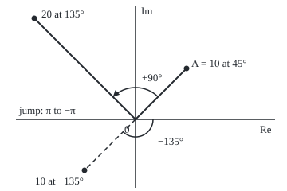

# Polar form: a length and an angle, so multiplying means turn and stretch

[Syllabus](../../../SYLLABUS.md) → [Complex analysis](../../../SYLLABUS.md#w07) → [Complex Numbers and the Plane](../../../SYLLABUS.md#w07-s01) → Polar form

---

## General Overview

A wind of 10 km/h blows toward the north-east. With east along the real axis and north up the imaginary axis, it is the arrow from 0 to 7.071068 + 7.071068i ([Complex numbers](01-complex-numbers.md)). A forecaster says "10 km/h at 45 degrees" instead: a length and a direction.

Both name the same point; the second is the **polar form**. It earns its place in multiplication. The wind times 2i, the number of length 2 pointing straight up, is −14.142136 + 14.142136i: 20 at 135 degrees. The length doubled and the angle grew by 90. Every complex product works so: lengths multiply, angles add.

One catch: adding a full turn leaves a direction unchanged, so each point has many angles. The standard choice lies above −180 degrees and at most 180. A wind toward the south-west, the direction of −1 − i, gets −135 degrees, not 225. Across the negative real axis that choice jumps by a full turn.

**Every nonzero complex number is a length times a direction; multiplying two of them multiplies the lengths and adds the angles, and the angle is fixed only up to whole turns, so one range is chosen and it jumps on the negative real axis.**

**What kind of fact this is:** polar form and the principal argument are definitions, and the range for the argument is a convention; "lengths multiply, angles add" is a theorem, proved on this card in Why it works.

### The picture: the wind, the wind turned and doubled, and a south-west wind

<p align="center"></p>

To scale, 9 units per km/h, 0 where the axes cross. The arc with the triangle is the quarter turn that 2i adds; the dashed arrow is the south-west wind, at −135°, measured clockwise.

---

## The formula

Notation first, in words. The **argument** of $z$, written $\arg z$ and read "arg z", is the angle of the arrow from 0 to $z$, anticlockwise from the positive real axis, in radians. Here it means the **principal argument**: the angle above −π and at most π, the range written (−π, π]. Below, $r$ and $s$ are lengths, and $\theta$ (theta) and $\varphi$ (phi) are angles. 45 degrees is π/4 = 0.785398 radians ([The unit circle](../../05-Geometry%20and%20trig/03-Trigonometry/02-radians-and-the-unit-circle.md)).

$$z = a + bi = r(\cos\theta + i\sin\theta), \qquad a = r\cos\theta,\quad b = r\sin\theta,\quad r = \sqrt{a^2 + b^2}$$

**Read it aloud:** a complex number is its length times the point at its angle on the circle of radius 1.

$$r(\cos\theta + i\sin\theta)\cdot s(\cos\varphi + i\sin\varphi) = rs\,\bigl(\cos(\theta + \varphi) + i\sin(\theta + \varphi)\bigr)$$

**Read it aloud:** to multiply, multiply the lengths and add the angles.

Any angle $\theta + 2\pi k$, with $k$ a whole number, names the same point. The principal argument is the one that lands in (−π, π], so $\arg(zw)$ is $\arg z + \arg w$ plus whichever whole number of turns brings the sum back into range.

| Symbol | Plain meaning | In our example | Push it up and the answer… |
| --- | --- | --- | --- |
| $z$ | a complex number: a point, or the arrow to it | wind A, 7.071068 + 7.071068i | — |
| $a$, $b$ | real and imaginary parts: east and north | 7.071068 and 7.071068 | angle swings toward that axis |
| $r$, $s$ | lengths: each number's modulus | 10 and 2 | product grows in proportion |
| $\theta$, $\varphi$ | angles from the positive real axis, radians | π/4 and π/2 | product turns further |
| $w$ | the multiplier: 2 at 90 degrees | 0 + 2i | — |
| $i$ | the number whose square is −1; length 1 at 90 degrees | 0 + 1i | — |
| $\arg z$ | the principal argument, in (−π, π] | 0.785398 | past π it wraps to near −π |
| $k$ | a whole number of full turns | −1 turns 225° into −135° | same point, new label |

### When it holds

- **Polar form is a definition:** every nonzero $z$ has one, with $r$ the modulus ([Conjugate and modulus](02-conjugate-and-modulus.md)).
- **Zero has no angle:** with $r = 0$ every $\theta$ gives 0, so $\arg 0$ is undefined; code returning 0 for it is making a choice.
- **Arguments add only up to whole turns:** two angles in range can sum past π.

---

## Why it works

### Step 1: from length and angle to a + bi

East-and-north is one address for a point; distance-and-direction is another ([Polar coordinates](../../05-Geometry%20and%20trig/04-Coordinates%20and%20Curves/03-polar-coordinates.md)). To pass between them, drop a line from the arrow's tip to the real axis. The right triangle has hypotenuse $r$ and angle $\theta$ at 0, so the east side is $r\cos\theta$ and the north side $r\sin\theta$. At π/4 cosine and sine are equal, so both parts of the wind are 7.071068 km/h.

### Step 2: from a + bi back to length and angle

The length is Pythagoras: for the wind, 10. The angle needs care. The slope $b/a$ fixes a line through 0, but a line points two ways. The south-west wind, −7.071068 − 7.071068i, has slope 1, like the north-east wind. The signs settle it: both negative puts the arrow lower left, at −135°, or −2.356194 radians.

In code, the rule that reads both signs is atan2, short for "arctangent of two inputs"; it returns the principal argument. One trap: computers store a signed zero, and atan2 gives −π for −1 − 0.0i, so the checks return π on the negative real axis. The drone at 3 + 4i ([Conjugate and modulus](02-conjugate-and-modulus.md)) sits at 0.927295 radians, 53.130102°.

### Step 3: lengths multiply, angles add

Multiply the two polar forms out, using $i^2 = -1$:

$$(\cos\theta + i\sin\theta)(\cos\varphi + i\sin\varphi) = (\cos\theta\cos\varphi - \sin\theta\sin\varphi) + i(\sin\theta\cos\varphi + \cos\theta\sin\varphi)$$

The brackets are the angle-addition identities ([Trig identities](../../05-Geometry%20and%20trig/03-Trigonometry/03-trig-identities.md)): $\cos(\theta + \varphi)$ and $\sin(\theta + \varphi)$. The real lengths $r$ and $s$ multiply out front. That proves the rule.

On the wind: 10 times 2 is 20, and 45° plus 90° is 135°. The pair rule of the complex-numbers card, which uses no angle, reaches the same −14.142136 + 14.142136i.

Division runs the rule backwards: divide lengths, subtract angles. The product divided by 2i is the wind again, 7.071068 + 7.071068i.

### Step 4: angles wrap, so the argument needs a range

Turn the product another 90° by multiplying by $i$. The angles add to 225°, at −14.142136 − 14.142136i. But 225° is 3.926991 radians, past π; one turn less is −2.356194, or −135°, the principal argument. So $\arg(zw) = \arg z + \arg w$ holds only up to a whole turn; here $k = -1$. The same wrap gives −1 − i its principal argument, −2.356194.

### Step 5: the jump cannot be removed

Walk anticlockwise round the unit circle, 45° at a time. The principal argument reads 0, 45, 90, 135, 180, then −135 where 225 was due: a drop of a full turn. Points a thousandth above and below −1 have arguments 3.140593 and −3.140593, which are 6.281185 apart, nearly a full turn of 6.283185. Moving the range only moves the jump to another ray from 0.

<details>
<summary>Detailed proof: the principal argument is unique, and some jump is unavoidable</summary>

**Uniqueness.** Two angles giving the same point on the unit circle differ by $2\pi k$ for a whole number $k$. The window (−π, π] has width 2π and is open at one end, so only $k = 0$ keeps both inside.

**The formula.** For $z = a + bi \ne 0$: if $a > 0$, $\arg z = \arctan(b/a)$; if $a < 0$, add π when $b \ge 0$ and subtract π when $b < 0$; if $a = 0$, it is π/2 or −π/2 by the sign of $b$. Each case lands in the range with cosine and sine of the right signs, so by uniqueness it is the principal argument.

**No continuous choice round a loop.** Suppose $f(\theta)$ were an angle for the point $\cos\theta + i\sin\theta$, varying continuously as $\theta$ runs from 0 to 2π. Then $f(\theta) - \theta$ is continuous and always a whole multiple of 2π. A continuous function cannot pass from one multiple to the next without taking the values between, so it is constant, and $f(2\pi) = f(0) + 2\pi$. But angles 0 and 2π give the same point, so a rule giving each point one angle needs $f(2\pi) = f(0)$. The contradiction shows every single-valued choice jumps somewhere on the loop.

</details>

---

## Worked numbers, by hand

| Step | Arithmetic | Value |
| --- | --- | --- |
| wind in parts | 10 cos 45° and 10 sin 45° | 7.071068 + 7.071068i |
| back to polar | Pythagoras on the parts; both parts positive | 10 at 45°, 0.785398 rad |
| the multiplier | 2 at 90° | 0 + 2i |
| multiply in polar | 10 × 2, and 45° + 90° | **20 at 135°** |
| multiply in pairs | (7.071068 + 7.071068i)(0 + 2i) | **−14.142136 + 14.142136i** |
| turn once more by i | 135° + 90° = 225°, less one turn | −135°, −2.356194 rad |
| arg of −1 − i | slope 1, both parts negative | **−135°, not 225°** |

Doubled and swung a quarter turn anticlockwise, the wind blows at 20 km/h toward the north-west.

### What breaks if you drop a piece

| Mistake | Comes out at | What went wrong |
| --- | --- | --- |
| Angle from arctan(b/a) alone, south-west wind | 45°, not −135° | The slope forgets which way the arrow points |
| Lengths added, not multiplied | 12 at 135°, −8.485281 + 8.485281i | Stretches compound; they do not stack |
| Arg of a product as the plain sum | 225°, not −135° | The sum left the range; subtract a turn |
| 45 fed to cos and sin as radians | 5.253220 + 8.509035i | 45 radians is not 45 degrees |

The code prints all four.

---

## Code, from first principles, and it actually runs

Two independent roads to each key number. The product comes from the pair rule, which uses no angle, and from lengths and angles. The argument comes from atan2 and from a bisection on the cosine alone plus the sign of the imaginary part, with no inverse trigonometry. Python uses its built-in complex type; Rust defines a pair type.

### Python

```python
# Polar form and argument -- the check behind the card.  Standard library only.
# Wind A: 10 km/h toward the north-east.  Turn-and-double w = 2 at 90 degrees.
# Two roads: products by the pair rule and by lengths-and-angles; the argument
# by atan2 and by a bisection on cos that never calls any inverse trig.
import math
def clean(x): return 0.0 if abs(x) < 5e-7 else x
def fmt(z): return f"{clean(z.real):.6f} {'-' if clean(z.imag) < 0 else '+'} {abs(clean(z.imag)):.6f}i"
def deg(t): return f"{clean(t * 180 / math.pi):.6f}"
def polar(r, t): return complex(r * math.cos(t), r * math.sin(t))
def mod(z): return math.sqrt(z.real * z.real + z.imag * z.imag)
def arg(z): return math.pi if z.imag == 0 and z.real < 0 else math.atan2(z.imag, z.real)  # road one; atan2(-0.0, -1) is -pi
def arg_bisect(z):                                              # road two
    c, lo, hi = z.real / mod(z), 0.0, math.pi                   # cos falls on [0, pi]
    for _ in range(200):
        mid = (lo + hi) / 2
        lo, hi = (mid, hi) if math.cos(mid) > c else (lo, mid)
    t = (lo + hi) / 2
    return -t if z.imag < 0 else t
def times(z, w):                                                # the pair rule, (a, b)(c, d)
    return complex(z.real * w.real - z.imag * w.imag, z.real * w.imag + z.imag * w.real)
A, w = polar(10, math.pi / 4), polar(2, math.pi / 2)
P1, P2 = times(A, w), polar(mod(A) * mod(w), arg(A) + arg(w))
SW, D, i = -A, 3 + 4j, 1j
up, down = complex(-1, 0.001), complex(-1, -0.001)
Q = times(P1, i)
sc, ox, oy = 9, 170, 150
px = lambda z: f"({ox + sc * z.real:.0f}, {oy - sc * z.imag:.0f})"
print(f"figure, scale {sc} px per km/h, origin {px(0j)}; A {px(A)}; product {px(P1)}; south-west {px(SW)}")
print(f"wind A, 10 at 45 deg = {fmt(A)}; back: r = {mod(A):.6f}, arg = {arg(A):.6f} rad ({deg(arg(A))} deg)")
print(f"turn-and-double w, 2 at 90 deg = {fmt(w)}")
print(f"A times w by the pair rule = {fmt(P1)}")
print(f"A times w by lengths and angles = {fmt(P2)}")
print(f"product: r = {mod(P1):.6f}, arg = {arg(P1):.6f} rad ({deg(arg(P1))} deg)")
for name, z in (("south-west wind", SW), ("drone", D), ("just above -1", up), ("just below -1", down)):
    print(f"{name} {fmt(z)}: arg by atan2 = {arg(z):.6f} ({deg(arg(z))} deg); by bisection = {arg_bisect(z):.6f}")
print(f"-1 - i: arg = {arg(complex(-1, -1)):.6f}; 225 deg = {5 * math.pi / 4:.6f} rad, outside (-pi, pi]; minus one turn = {5 * math.pi / 4 - 2 * math.pi:.6f}")
print(f"jump across the negative real axis: {arg(up) - arg(down):.6f}; one full turn = {2 * math.pi:.6f}; on it, -1 - 0.0i: atan2 = {math.atan2(-0.0, -1):.6f}, arg = {arg(complex(-1, -0.0)):.6f}")
print("sweep at 0, 45, 90, 135, 180, 225, 270, 315 deg round the circle, principal arg in deg:",
      ", ".join(f"{arg(polar(1, k * math.pi / 4)) * 180 / math.pi:.0f}" for k in range(8)))
print(f"product turned by i: {fmt(Q)}; arg = {deg(arg(Q))} deg; arg sum = {deg(arg(P1) + arg(i))} deg")
print(f"undo the turn, product / w = {fmt(P1 / w)}")
print(f"mistake 1, atan(b/a) for the south-west wind: {deg(math.atan(SW.imag / SW.real))} deg, not {deg(arg(SW))}")
print(f"mistake 2, lengths added: 12 at 135 deg = {fmt(polar(12, 3 * math.pi / 4))}, not {fmt(P1)}")
print(f"mistake 3, arg of product as arg sum: {deg(arg(P1) + arg(i))} deg, not {deg(arg(Q))}")
print(f"mistake 4, 45 fed to cos and sin as radians: {fmt(polar(10, 45))}, not {fmt(A)}")
assert all(abs(arg(z) - arg_bisect(z)) < 1e-9 for z in (A, P1, SW, D, up, down, Q))  # two roads to arg
assert abs(P1 - P2) < 1e-12                                     # two roads to the product
assert abs(arg(Q) - (arg(P1) + arg(i) - 2 * math.pi)) < 1e-12   # arg adds up to one whole turn
assert abs(polar(mod(SW), arg(SW)) - SW) < 1e-12                # round trip back to a + bi
print("ALL CHECKS PASS")
```

**Ran 2026-09-28 on macOS, Python 3.14.6, standard library only. All checks passed. Output, pasted from the run:**

```
figure, scale 9 px per km/h, origin (170, 150); A (234, 86); product (43, 23); south-west (106, 214)
wind A, 10 at 45 deg = 7.071068 + 7.071068i; back: r = 10.000000, arg = 0.785398 rad (45.000000 deg)
turn-and-double w, 2 at 90 deg = 0.000000 + 2.000000i
A times w by the pair rule = -14.142136 + 14.142136i
A times w by lengths and angles = -14.142136 + 14.142136i
product: r = 20.000000, arg = 2.356194 rad (135.000000 deg)
south-west wind -7.071068 - 7.071068i: arg by atan2 = -2.356194 (-135.000000 deg); by bisection = -2.356194
drone 3.000000 + 4.000000i: arg by atan2 = 0.927295 (53.130102 deg); by bisection = 0.927295
just above -1 -1.000000 + 0.001000i: arg by atan2 = 3.140593 (179.942704 deg); by bisection = 3.140593
just below -1 -1.000000 - 0.001000i: arg by atan2 = -3.140593 (-179.942704 deg); by bisection = -3.140593
-1 - i: arg = -2.356194; 225 deg = 3.926991 rad, outside (-pi, pi]; minus one turn = -2.356194
jump across the negative real axis: 6.281185; one full turn = 6.283185; on it, -1 - 0.0i: atan2 = -3.141593, arg = 3.141593
sweep at 0, 45, 90, 135, 180, 225, 270, 315 deg round the circle, principal arg in deg: 0, 45, 90, 135, 180, -135, -90, -45
product turned by i: -14.142136 - 14.142136i; arg = -135.000000 deg; arg sum = 225.000000 deg
undo the turn, product / w = 7.071068 + 7.071068i
mistake 1, atan(b/a) for the south-west wind: 45.000000 deg, not -135.000000
mistake 2, lengths added: 12 at 135 deg = -8.485281 + 8.485281i, not -14.142136 + 14.142136i
mistake 3, arg of product as arg sum: 225.000000 deg, not -135.000000
mistake 4, 45 fed to cos and sin as radians: 5.253220 + 8.509035i, not 7.071068 + 7.071068i
ALL CHECKS PASS
```

### Rust

Same numbers, same labels, built with `rustc --edition 2021 -O`.

```rust
// Polar form and argument -- the same check as the Python, in Rust.  No crates.
// Wind A: 10 km/h toward the north-east.  Turn-and-double w = 2 at 90 degrees.
// Two roads: products by the pair rule and by lengths-and-angles; the argument
// by atan2 and by a bisection on cos that never calls any inverse trig.
use std::f64::consts::PI;
#[derive(Clone, Copy)]
struct C { re: f64, im: f64 }
fn c(re: f64, im: f64) -> C { C { re, im } }
fn clean(x: f64) -> f64 { if x.abs() < 5e-7 { 0.0 } else { x } }
fn fmt(z: C) -> String {
    let (re, im) = (clean(z.re), clean(z.im));
    format!("{:.6} {} {:.6}i", re, if im < 0.0 { "-" } else { "+" }, im.abs())
}
fn deg(t: f64) -> String { format!("{:.6}", clean(t * 180.0 / PI)) }
fn polar(r: f64, t: f64) -> C { c(r * t.cos(), r * t.sin()) }
fn modu(z: C) -> f64 { (z.re * z.re + z.im * z.im).sqrt() }
fn arg(z: C) -> f64 { if z.im == 0.0 && z.re < 0.0 { PI } else { z.im.atan2(z.re) } }  // road one; atan2(-0.0, -1) is -pi
fn arg_bisect(z: C) -> f64 {                                       // road two
    let (cv, mut lo, mut hi) = (z.re / modu(z), 0.0_f64, PI);      // cos falls on [0, pi]
    for _ in 0..200 {
        let mid = (lo + hi) / 2.0;
        if mid.cos() > cv { lo = mid } else { hi = mid }
    }
    let t = (lo + hi) / 2.0;
    if z.im < 0.0 { -t } else { t }
}
fn times(z: C, w: C) -> C { c(z.re * w.re - z.im * w.im, z.re * w.im + z.im * w.re) }  // the pair rule
fn divide(z: C, w: C) -> C { let d = w.re * w.re + w.im * w.im; let t = times(z, c(w.re, -w.im)); c(t.re / d, t.im / d) }
fn dist(z: C, w: C) -> f64 { modu(c(z.re - w.re, z.im - w.im)) }

fn main() {
    let (a, w) = (polar(10.0, PI / 4.0), polar(2.0, PI / 2.0));
    let (p1, p2) = (times(a, w), polar(modu(a) * modu(w), arg(a) + arg(w)));
    let (sw, d, i) = (c(-a.re, -a.im), c(3.0, 4.0), c(0.0, 1.0));
    let (up, down) = (c(-1.0, 0.001), c(-1.0, -0.001));
    let q = times(p1, i);
    let (sc, ox, oy) = (9.0, 170.0, 150.0);
    let px = |z: C| format!("({:.0}, {:.0})", ox + sc * z.re, oy - sc * z.im);
    println!("figure, scale {} px per km/h, origin {}; A {}; product {}; south-west {}", sc, px(c(0.0, 0.0)), px(a), px(p1), px(sw));
    println!("wind A, 10 at 45 deg = {}; back: r = {:.6}, arg = {:.6} rad ({} deg)", fmt(a), modu(a), arg(a), deg(arg(a)));
    println!("turn-and-double w, 2 at 90 deg = {}", fmt(w));
    println!("A times w by the pair rule = {}", fmt(p1));
    println!("A times w by lengths and angles = {}", fmt(p2));
    println!("product: r = {:.6}, arg = {:.6} rad ({} deg)", modu(p1), arg(p1), deg(arg(p1)));
    for (name, z) in [("south-west wind", sw), ("drone", d), ("just above -1", up), ("just below -1", down)] {
        println!("{} {}: arg by atan2 = {:.6} ({} deg); by bisection = {:.6}", name, fmt(z), arg(z), deg(arg(z)), arg_bisect(z));
    }
    println!("-1 - i: arg = {:.6}; 225 deg = {:.6} rad, outside (-pi, pi]; minus one turn = {:.6}", arg(c(-1.0, -1.0)), 5.0 * PI / 4.0, 5.0 * PI / 4.0 - 2.0 * PI);
    println!("jump across the negative real axis: {:.6}; one full turn = {:.6}; on it, -1 - 0.0i: atan2 = {:.6}, arg = {:.6}", arg(up) - arg(down), 2.0 * PI, (-0.0_f64).atan2(-1.0), arg(c(-1.0, -0.0)));
    let sweep: Vec<String> = (0..8).map(|k| format!("{:.0}", arg(polar(1.0, k as f64 * PI / 4.0)) * 180.0 / PI)).collect();
    println!("sweep at 0, 45, 90, 135, 180, 225, 270, 315 deg round the circle, principal arg in deg: {}", sweep.join(", "));
    println!("product turned by i: {}; arg = {} deg; arg sum = {} deg", fmt(q), deg(arg(q)), deg(arg(p1) + arg(i)));
    println!("undo the turn, product / w = {}", fmt(divide(p1, w)));
    println!("mistake 1, atan(b/a) for the south-west wind: {} deg, not {}", deg((sw.im / sw.re).atan()), deg(arg(sw)));
    println!("mistake 2, lengths added: 12 at 135 deg = {}, not {}", fmt(polar(12.0, 3.0 * PI / 4.0)), fmt(p1));
    println!("mistake 3, arg of product as arg sum: {} deg, not {}", deg(arg(p1) + arg(i)), deg(arg(q)));
    println!("mistake 4, 45 fed to cos and sin as radians: {}, not {}", fmt(polar(10.0, 45.0)), fmt(a));
    assert!([a, p1, sw, d, up, down, q].iter().all(|&z| (arg(z) - arg_bisect(z)).abs() < 1e-9));  // two roads to arg
    assert!(dist(p1, p2) < 1e-12);                                 // two roads to the product
    assert!((arg(q) - (arg(p1) + arg(i) - 2.0 * PI)).abs() < 1e-12);  // arg adds up to one whole turn
    assert!(dist(polar(modu(sw), arg(sw)), sw) < 1e-12);           // round trip back to a + bi
    println!("ALL CHECKS PASS");
}
```

**Ran 2026-09-28 on macOS, rustc 1.98.1, no crates. All checks passed. Output, pasted from the run:**

```
figure, scale 9 px per km/h, origin (170, 150); A (234, 86); product (43, 23); south-west (106, 214)
wind A, 10 at 45 deg = 7.071068 + 7.071068i; back: r = 10.000000, arg = 0.785398 rad (45.000000 deg)
turn-and-double w, 2 at 90 deg = 0.000000 + 2.000000i
A times w by the pair rule = -14.142136 + 14.142136i
A times w by lengths and angles = -14.142136 + 14.142136i
product: r = 20.000000, arg = 2.356194 rad (135.000000 deg)
south-west wind -7.071068 - 7.071068i: arg by atan2 = -2.356194 (-135.000000 deg); by bisection = -2.356194
drone 3.000000 + 4.000000i: arg by atan2 = 0.927295 (53.130102 deg); by bisection = 0.927295
just above -1 -1.000000 + 0.001000i: arg by atan2 = 3.140593 (179.942704 deg); by bisection = 3.140593
just below -1 -1.000000 - 0.001000i: arg by atan2 = -3.140593 (-179.942704 deg); by bisection = -3.140593
-1 - i: arg = -2.356194; 225 deg = 3.926991 rad, outside (-pi, pi]; minus one turn = -2.356194
jump across the negative real axis: 6.281185; one full turn = 6.283185; on it, -1 - 0.0i: atan2 = -3.141593, arg = 3.141593
sweep at 0, 45, 90, 135, 180, 225, 270, 315 deg round the circle, principal arg in deg: 0, 45, 90, 135, 180, -135, -90, -45
product turned by i: -14.142136 - 14.142136i; arg = -135.000000 deg; arg sum = 225.000000 deg
undo the turn, product / w = 7.071068 + 7.071068i
mistake 1, atan(b/a) for the south-west wind: 45.000000 deg, not -135.000000
mistake 2, lengths added: 12 at 135 deg = -8.485281 + 8.485281i, not -14.142136 + 14.142136i
mistake 3, arg of product as arg sum: 225.000000 deg, not -135.000000
mistake 4, 45 fed to cos and sin as radians: 5.253220 + 8.509035i, not 7.071068 + 7.071068i
ALL CHECKS PASS
```

The two outputs match line for line.

> [!TIP]
> **Try changing**
> Guess first, then run it.
> - **A half turn.** Set `w` to `polar(1, math.pi)` (Rust: `polar(1.0, PI)`). The product is −7.071068 − 7.071068i, the south-west wind. The next turn by i stays in range, so the third assert, expecting a wrap, stops the run.
> - **Forget the sign.** Make `arg_bisect` return `t` always. The south-west wind reads +135° on that road; the first assert stops it.
> - **Sit on the cut.** Set `D` to `-5 + 0j` (Rust: `c(-5.0, 0.0)`). Both roads print 3.141593: π is in the range, −π is not. The first assert still fails, because the cosine is flat near a half turn and the bisection loses its ninth decimal.

---

## The usual mistake

> [!warning]
> **Reading the angle from b/a alone.** A slope names a line through 0, and a line points two ways. The south-west and north-east winds share slope 1, and arctan returns 45° for both. The signs of the parts choose: the south-west wind is at −135°.
>
> - **Compass bearings for maths angles.** A bearing runs clockwise from north, the argument anticlockwise from east. A forecast's "north-east wind" blows from the north-east: its arrow is at −135°.

---

## Where you meet it in real life

- **Alternating current.** A voltage is an amplitude and a phase, a length and an angle; an impedance scales and shifts it: Phasors.
- **Programming.** Mainstream languages ship atan2, the principal argument up to that signed zero; robot and game headings wrap at its jump.
- **Rotating images.** Turning a picture multiplies every pixel's position by a number of length 1 at the turning angle.
- **Powers and roots.** Each repeated multiplication adds the angle again, which locates every root of a number: [Powers and roots](05-powers-roots-and-roots-of-unity.md).

> **Say it back**
> A nonzero complex number is a length and an angle: a = r cos θ, b = r sin θ. Multiplying multiplies lengths and adds angles, by the angle-addition identities. The angle is fixed only up to whole turns, so the principal argument takes the one in (−π, π], chosen by the signs of both parts: −1 − i is at −135°. It jumps a full turn on the negative real axis, and every single-valued choice jumps somewhere.

---

## What this builds on

- [Conjugate and modulus](02-conjugate-and-modulus.md): the modulus, which becomes the length r.
- [The unit circle](../../05-Geometry%20and%20trig/03-Trigonometry/02-radians-and-the-unit-circle.md): cos and sin as the coordinates of a point on the circle of radius 1, with angles in radians.
- [Trig identities](../../05-Geometry%20and%20trig/03-Trigonometry/03-trig-identities.md): the angle-addition formulas that prove Step 3.
- [Polar coordinates](../../05-Geometry%20and%20trig/04-Coordinates%20and%20Curves/03-polar-coordinates.md): distance and direction as an address for a point.

## Where this goes next

- [Euler's formula](04-eulers-formula.md): writes cos θ + i sin θ as an exponential, so adding angles becomes adding exponents.
- Phasors: amplitude and phase of a current, multiplied by impedances.

---

## Sources

Verified 2026-09-28: every link below resolves to the publisher's page.

- Orloff, Jeremy. "Topic 1: Complex algebra and the complex plane." MIT 18.04 *Complex Variables with Applications*, MIT OpenCourseWare, 2018. [Course notes](https://ocw.mit.edu/courses/18-04-complex-variables-with-applications-spring-2018/resources/mit18_04s18_topic1/). Polar form, the argument, multiplication.
- Beck, Matthias, Gerald Marchesi, Dennis Pixton and Lucas Sabalka. *A First Course in Complex Analysis*. [Author page and full text](https://matthbeck.github.io/complex.html). Free and complete; chapter 1 covers polar form and the principal argument.
- Stein, Elias M., and Rami Shakarchi. *Complex Analysis*. Princeton University Press, 2003. [Publisher page](https://press.princeton.edu/books/hardcover/9780691113852/complex-analysis). Chapter 1 sets out the polar form and the argument.
