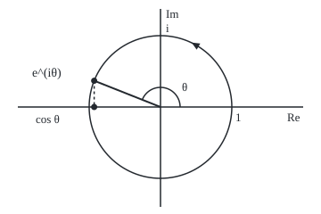
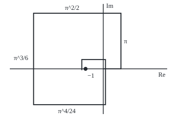

# Euler's formula: e to the i-theta is the point at angle theta on the unit circle, so waves and turns are exponentials

[Syllabus](../../../SYLLABUS.md) → [Complex analysis](../README.md) → [Complex Numbers and the Plane](../README.md#s01) → Euler's formula

---

## General Overview

A tuning fork sounds the note A: the air pressure at the ear rises and falls 440 times a second, a cosine of an angle that gains a full turn, 2π radians, per vibration.

Picture instead an arrow of length 1 pinned at 0 in the plane, spinning anticlockwise 440 turns a second. After 0.001 seconds it has made 0.44 turns and points at angle 2.764602 radians. Drop a line from its tip onto the real axis: the foot sits at −0.929776: the pressure then, as a fraction of its peak. The cosine is the arrow's shadow.

Euler's formula names that arrow: e raised to i times the angle is its tip. Growth at an imaginary rate turns instead of growing. A real part in the exponent stretches the arrow too: e raised to ln 2 plus i times a quarter turn, π/2, is 2i.

**The complex exponential, defined by the same power series as the real one, sends i times an angle to the point at that angle on the circle of radius 1, so a spinning arrow, and the wave that is its shadow, are exponentials.**

**What kind of fact this is:** a theorem, proved on this card in Why it works, once the exponential of a complex number is defined by its series.

### The picture: the A440 arrow one millisecond in

<p align="center"></p>

To scale: 80 units per 1, centre 0 at (180, 120), so the tip sits at (105.62, 90.55) and its shadow at (105.62, 120.00). The triangle on the circle shows the anticlockwise spin.

---

## The formula

Notation first, in words. For a complex number z, "e to the z", written $e^z$, means the sum of the power series below; on real numbers it is the familiar exponential.

$$e^{z} = 1 + z + \frac{z^2}{2!} + \frac{z^3}{3!} + \frac{z^4}{4!} + \cdots$$

**Read it aloud:** e to the z is one, plus z, plus z squared over two factorial, and so on for ever.

$$e^{i\theta} = \cos\theta + i\sin\theta$$

**Read it aloud:** e to the i-theta is the point at angle theta on the circle of radius 1.

$$e^{x+iy} = e^{x}\,(\cos y + i\sin y)$$

**Read it aloud:** the real part of the exponent sets the length; the imaginary part sets the direction.

The tone is $e^{2\pi i f t}$: angle 2π times frequency times time.

| Symbol | Plain meaning | In our example | Push it up and the answer… |
| --- | --- | --- | --- |
| $z$, $w$ | complex numbers in the exponent | z = ln 2 + iπ/2 | see x and y |
| $x$, $y$ | its real and imaginary parts | ln 2 and π/2 | x stretches; y turns |
| $i$ | the number whose square is −1: a quarter turn | the Im axis | — |
| $\theta$, $\pi$ | an angle in radians; π is a half turn | 2.764602 | further round |
| $e$, $e^{i\theta}$ | the base of natural growth; the point at angle θ | −0.929776 + 0.368125i | moves anticlockwise |
| $r$ | the arrow's length, the modulus | 2, for 2i | a bigger circle |
| $f$, $t$ | frequency in turns a second; time in seconds | 440 and 0.001 | further round |
| $n$, $n!$, $N$ | term number; 1 × 2 × … × n; last degree kept, or steps | degree 6 misses by 0.565059 | closer to the limit |

### When it holds

- **Any complex exponent.** The series converges for every z: no exceptions.
- **Angles in radians.** Feed it 180 meaning degrees and it returns −0.598460 − 0.801153i, not −1.
- **Exponents add, for all complex z and w:** $e^{z+w} = e^z e^w$. The rule for a power of a power can fail: e to the 2πi is 1, whose usual square root is 1, yet e to the πi is −1.
- **Going backwards is not unique.** Adding 2πi to the exponent changes nothing, so undoing it needs a choice, made in [The complex logarithm](../02-Holomorphic%20Functions/04-complex-logarithm.md).

---

## Why it works

### Step 0: the series needs only adding and multiplying

The real exponential equals its power series ([Taylor series](../../06-Calculus%20and%20analysis/06-Series/05-taylor-series.md)). Each term needs only multiplying, dividing by a whole number and adding, which complex numbers do ([Complex numbers](01-complex-numbers.md)). So the series defines $e^z$ for complex z, and leaves the real exponential unchanged.

### Step 1: the series converges everywhere

The n-th term has size $|z|^n/n!$, with the modulus of [Conjugate and modulus](02-conjugate-and-modulus.md): each size is the last times |z|/n. Once n passes twice |z|, that factor is below one half, so the sizes shrink faster than halving and add to a finite total: absolute convergence. Such a series gives the same sum however its terms are grouped, which Step 3 needs.

### Step 2: each term turns a quarter

The powers of i run 1, i, −1, −i, then repeat. So at iθ each term is the last turned a quarter anticlockwise and scaled by θ/n. At θ = π the lengths 1, π, π^2/2, π^3/6 grow, then the factorials win.

### The picture: the series at iπ walking to −1

<p align="center"></p>

To scale: 36 units per 1, 0 at (210, 140), −1 at (174, 140). The corners are the sums to degrees 0 to 7, from (246.0, 140.0) to (166.4, 142.7).

### Step 3: regroup into cosine and sine

Write out the series at iθ and use $i^2 = -1$:

$$e^{i\theta} = 1 + i\theta - \frac{\theta^2}{2!} - i\frac{\theta^3}{3!} + \frac{\theta^4}{4!} + i\frac{\theta^5}{5!} - \cdots$$

Even terms carry no i, odd terms carry one, and each kind alternates in sign. Step 1 allows the regrouping:

$$e^{i\theta} = \Big(1 - \frac{\theta^2}{2!} + \frac{\theta^4}{4!} - \cdots\Big) + i\Big(\theta - \frac{\theta^3}{3!} + \frac{\theta^5}{5!} - \cdots\Big)$$

The brackets are the Taylor series of cos θ and sin θ, proved equal to them on [Taylor series](../../06-Calculus%20and%20analysis/06-Series/05-taylor-series.md). That is Euler's formula. Since cos^2 θ + sin^2 θ = 1, the point lies on the unit circle.

### Step 4: exponents add, so a real part stretches

The complex series keeps the real rule $e^{z+w} = e^z e^w$: multiply the two series out, and the binomial theorem turns the terms of total degree n into the degree-n term at z + w.

<details>
<summary>Detailed proof: the addition law</summary>

Write $a_j = z^j/j!$ and $b_k = w^k/k!$. The product of the sums to degree N is the sum of $a_j b_k$ over the square 0 ≤ j, k ≤ N. Inside it, the terms with j + k = n give:

$$\sum_{j=0}^{n} \frac{z^j}{j!}\,\frac{w^{n-j}}{(n-j)!} = \frac{1}{n!}\sum_{j=0}^{n} \binom{n}{j} z^j w^{n-j} = \frac{(z+w)^n}{n!}.$$

So the triangle j + k ≤ N is the series of $e^{z+w}$ to degree N. The rest of the square has j or k above N/2, so its size is at most the tail of $|a_j|$ beyond N/2 times the full sum of $|b_k|$, plus the same swapped. Both tails vanish by Step 1. Letting N grow gives $e^{z}e^{w} = e^{z+w}$.

</details>

So $e^{x+iy} = e^x e^{iy}$: a stretch by e to the x times a unit arrow at angle y. At ln 2 + iπ/2 that is 2 times i, or 2i.

### Step 5: what falls out

- **Polar form.** Any nonzero number of length r at angle θ is $r e^{i\theta}$.
- **Euler's identity.** At θ = π the point is −1, so $e^{i\pi} + 1 = 0$.
- **Never zero.** $e^z e^{-z} = e^0 = 1$, so $e^z \neq 0$.
- **The period 2πi.** A full turn returns the arrow, so $e^{z + 2\pi i} = e^z$ for every z.
- **Multiplying adds angles.** Expanding both sides of "turn by a, then b, is turn by a + b" gives the angle-sum formulas for cos and sin.

A second road: (1 + iθ/N) multiplied in N times turns about θ/N per step and closes on $e^{i\theta}$ as N grows, as in [Compounding more often, and the number e](../../01-Foundations/04-Compound%20Growth%20and%20Discounting/04-compounding-frequency-and-e.md); the code runs it. The route through the derivative of $e^z$ belongs to [The elementary functions](../02-Holomorphic%20Functions/03-exponential-sine-and-cosine-in-the-plane.md).

---

## Worked numbers, by hand

| Step | Arithmetic | Value |
| --- | --- | --- |
| Angle after 0.001 s | 2π × 440 × 0.001 | 2.764602 rad, 0.44 turns |
| Road one: the series | 1 + iθ + (iθ)^2/2! + …, 60 terms | −0.929776 + 0.368125i |
| Road two: the circle | cos θ + i sin θ | −0.929776 + 0.368125i |
| The shadow | the real part | **−0.929776** |
| Half turn | series at iπ | **−1** |
| Stretch, then turn | e^(ln 2) × e^(iπ/2) = 2 × i | **2i** |
| One more full turn | series at ln 2 + iπ/2 + 2πi | 2i again |

One millisecond in, the A440 pressure stands at −0.929776 of its peak, because the arrow has turned 0.44 of the way round.

### What breaks if you drop a piece

| Mistake | Comes out at | What went wrong |
| --- | --- | --- |
| Degrees: cos 180 + i sin 180 | −0.598460 − 0.801153i | The angle must be radians |
| i^2 = +1 in the series at iπ | 11.591953 + 11.548739i | No alternation: growth |
| Series cut at degree 6, at iπ | 0.565059 from −1 | Tail still large; degree 12 leaves 0.000456 |
| e^(i 440 t), no 2π | 70.028175 turns a second | Exponent counts radians, not turns |

The code prints all four.

---

## Code, from first principles, and it actually runs

Both programs build $e^z$ from its own series and take three roads: the series, cosine and sine read off the circle, and compounding. The compounding road closes on −1 at distance 0.613543 for N = 10, 0.004947 for N = 1000 and 0.000049 for N = 100000. The four asserts compare the series with the circle, with 2 times i, with the shrinking compounding gap, and with itself a full turn later.

### Python

```python
# Euler's formula -- the check behind the card.  Standard library only.
# Road one: e^z summed from its own power series, 1 + z + z^2/2! + ...
# Road two: cos and sin, the real functions, read off as a point on the circle.
# Road three: compounding, (1 + z/N)^N for large N, one multiply at a time.
import math

TERMS = 60                                   # enough for |z| < 8 to full precision

def exp_series(z, terms=TERMS):              # each term is the last one times z/n
    total, term = 0j, 1 + 0j
    for n in range(1, terms + 1):
        total += term
        term = term * z / n
    return total

def compound(z, steps):                      # (1 + z/N) multiplied in N times
    w = 1 + 0j
    for _ in range(steps):
        w *= 1 + z / steps
    return w

def show(w):                                 # 'a + bi', six decimals, no -0.000000
    a, b = round(w.real, 6) + 0.0, round(w.imag, 6) + 0.0
    return f"{a:.6f} {'-' if b < 0 else '+'} {abs(b):.6f}i"

theta = 2 * math.pi * 440 * 0.001            # the A440 arrow one millisecond on
road1 = exp_series(1j * theta)
road2 = complex(math.cos(theta), math.sin(theta))
half = exp_series(1j * math.pi)
z = math.log(2) + 1j * math.pi / 2
print(f"A440 at t = 0.001 s: theta = {theta:.6f} rad ({theta / (2 * math.pi):.2f} turns)")
print(f"series, {TERMS} terms:   {show(road1)}")
print(f"cos + i sin:        {show(road2)}")
print(f"shadow on the real axis: {road2.real:.6f}")
print(f"e^(i pi), series: {show(half)}")
print(f"e^(ln 2 + i pi/2), series: {show(exp_series(z))}")
print(f"e^(ln 2 + i pi/2 + 2 pi i), series: {show(exp_series(z + 2j * math.pi))}")
gaps = []
for n in (10, 1000, 100000):
    w = compound(1j * math.pi, n)
    gaps.append(abs(w + 1))
    print(f"compounding, N = {n}: {show(w)}, distance from -1 {gaps[-1]:.6f}")
for deg in (6, 12):
    print(f"series cut after degree {deg} at i pi: distance from -1 {abs(exp_series(1j * math.pi, deg + 1) + 1):.6f}")
print(f"mistake, degrees for radians: cos 180 + i sin 180 = {show(complex(math.cos(180), math.sin(180)))}")
wrong = sum(math.pi ** n / math.factorial(n) * (1j if n % 2 else 1) for n in range(TERMS))
print(f"mistake, i^2 = +1 in the series: {show(wrong)}")
print(f"mistake, e^(i 440 t) without 2 pi: {440 / (2 * math.pi):.6f} turns a second")
tip = (180 + 80 * road2.real, 120 - 80 * road2.imag)
print(f"figure, arrow tip ({tip[0]:.2f}, {tip[1]:.2f}), shadow foot ({tip[0]:.2f}, 120.00)")
walk = [exp_series(1j * math.pi, k) for k in range(1, 9)]
print("figure, partial sums " + " ".join(f"({210 + 36 * s.real:.1f},{140 - 36 * s.imag:.1f})" for s in walk))
assert abs(road1 - road2) < 1e-12 and abs(half - complex(math.cos(math.pi), math.sin(math.pi))) < 1e-12
assert abs(exp_series(z) - 2 * complex(math.cos(math.pi / 2), math.sin(math.pi / 2))) < 1e-12
assert gaps[0] > gaps[1] > gaps[2] and gaps[2] < math.pi ** 2 / 100000
assert abs(exp_series(z + 2j * math.pi) - exp_series(z)) < 1e-12
print("ALL CHECKS PASS")
```

**Ran 2026-09-27 on macOS, Python 3.14.6, standard library only. All checks passed. Output, pasted from the run:**

```
A440 at t = 0.001 s: theta = 2.764602 rad (0.44 turns)
series, 60 terms:   -0.929776 + 0.368125i
cos + i sin:        -0.929776 + 0.368125i
shadow on the real axis: -0.929776
e^(i pi), series: -1.000000 + 0.000000i
e^(ln 2 + i pi/2), series: 0.000000 + 2.000000i
e^(ln 2 + i pi/2 + 2 pi i), series: 0.000000 + 2.000000i
compounding, N = 10: -1.593362 + 0.156064i, distance from -1 0.613543
compounding, N = 1000: -1.004947 + 0.000010i, distance from -1 0.004947
compounding, N = 100000: -1.000049 + 0.000000i, distance from -1 0.000049
series cut after degree 6 at i pi: distance from -1 0.565059
series cut after degree 12 at i pi: distance from -1 0.000456
mistake, degrees for radians: cos 180 + i sin 180 = -0.598460 - 0.801153i
mistake, i^2 = +1 in the series: 11.591953 + 11.548739i
mistake, e^(i 440 t) without 2 pi: 70.028175 turns a second
figure, arrow tip (105.62, 90.55), shadow foot (105.62, 120.00)
figure, partial sums (246.0,140.0) (246.0,26.9) (68.3,26.9) (68.3,212.9) (214.5,212.9) (214.5,121.1) (166.4,121.1) (166.4,142.7)
ALL CHECKS PASS
```

### Rust

Same numbers, same labels, built with `rustc --edition 2021 -O`.

```rust
// Euler's formula -- the same check as the Python, in Rust.  No crates.
// Road one: e^z summed from its own power series, 1 + z + z^2/2! + ...
// Road two: cos and sin, the real functions, read off as a point on the circle.
// Road three: compounding, (1 + z/N)^N for large N, one multiply at a time.
use std::f64::consts::PI;
const TERMS: usize = 60; // enough for |z| < 8 to full precision
#[derive(Clone, Copy)]
struct C { re: f64, im: f64 }
fn c(re: f64, im: f64) -> C { C { re, im } }
fn add(a: C, b: C) -> C { c(a.re + b.re, a.im + b.im) }
fn mul(a: C, b: C) -> C { c(a.re * b.re - a.im * b.im, a.re * b.im + a.im * b.re) }
fn scale(a: C, k: f64) -> C { c(a.re * k, a.im * k) }
fn dist(a: C, b: C) -> f64 { (a.re - b.re).hypot(a.im - b.im) }

fn exp_series(z: C, terms: usize) -> C { // each term is the last one times z/n
    let (mut total, mut term) = (c(0.0, 0.0), c(1.0, 0.0));
    for n in 1..=terms {
        total = add(total, term);
        term = scale(mul(term, z), 1.0 / n as f64);
    }
    total
}
fn compound(z: C, steps: usize) -> C { // (1 + z/N) multiplied in N times
    let step = add(c(1.0, 0.0), scale(z, 1.0 / steps as f64));
    let mut w = c(1.0, 0.0);
    for _ in 0..steps { w = mul(w, step) }
    w
}
fn show(w: C) -> String { // 'a + bi', six decimals, no -0.000000
    let a = format!("{:.6}", w.re);
    let a = if a == "-0.000000" { "0.000000".to_string() } else { a };
    let b = format!("{:.6}", w.im.abs());
    let sign = if w.im < 0.0 && b != "0.000000" { '-' } else { '+' };
    format!("{} {} {}i", a, sign, b)
}

fn main() {
    let theta = 2.0 * PI * 440.0 * 0.001; // the A440 arrow one millisecond on
    let road1 = exp_series(c(0.0, theta), TERMS);
    let road2 = c(theta.cos(), theta.sin());
    let half = exp_series(c(0.0, PI), TERMS);
    let z = c(2f64.ln(), PI / 2.0);
    let zp = add(z, c(0.0, 2.0 * PI));
    println!("A440 at t = 0.001 s: theta = {:.6} rad ({:.2} turns)", theta, theta / (2.0 * PI));
    println!("series, {} terms:   {}", TERMS, show(road1));
    println!("cos + i sin:        {}", show(road2));
    println!("shadow on the real axis: {:.6}", road2.re);
    println!("e^(i pi), series: {}", show(half));
    println!("e^(ln 2 + i pi/2), series: {}", show(exp_series(z, TERMS)));
    println!("e^(ln 2 + i pi/2 + 2 pi i), series: {}", show(exp_series(zp, TERMS)));
    let mut gaps = Vec::new();
    for n in [10usize, 1000, 100000] {
        let w = compound(c(0.0, PI), n);
        gaps.push(dist(w, c(-1.0, 0.0)));
        println!("compounding, N = {}: {}, distance from -1 {:.6}", n, show(w), gaps[gaps.len() - 1]);
    }
    for deg in [6usize, 12] {
        let e = dist(exp_series(c(0.0, PI), deg + 1), c(-1.0, 0.0));
        println!("series cut after degree {} at i pi: distance from -1 {:.6}", deg, e);
    }
    println!("mistake, degrees for radians: cos 180 + i sin 180 = {}", show(c(180f64.cos(), 180f64.sin())));
    let (mut wrong, mut t) = (c(0.0, 0.0), 1.0);
    for n in 0..TERMS {
        wrong = add(wrong, if n % 2 == 1 { c(0.0, t) } else { c(t, 0.0) });
        t = t * PI / (n + 1) as f64;
    }
    println!("mistake, i^2 = +1 in the series: {}", show(wrong));
    println!("mistake, e^(i 440 t) without 2 pi: {:.6} turns a second", 440.0 / (2.0 * PI));
    let tip = (180.0 + 80.0 * road2.re, 120.0 - 80.0 * road2.im);
    println!("figure, arrow tip ({:.2}, {:.2}), shadow foot ({:.2}, 120.00)", tip.0, tip.1, tip.0);
    let walk: Vec<String> = (1..=8).map(|k| exp_series(c(0.0, PI), k))
        .map(|s| format!("({:.1},{:.1})", 210.0 + 36.0 * s.re, 140.0 - 36.0 * s.im)).collect();
    println!("figure, partial sums {}", walk.join(" "));
    assert!(dist(road1, road2) < 1e-12 && dist(half, c(PI.cos(), PI.sin())) < 1e-12);
    assert!(dist(exp_series(z, TERMS), scale(c((PI / 2.0).cos(), (PI / 2.0).sin()), 2.0)) < 1e-12);
    assert!(gaps[0] > gaps[1] && gaps[1] > gaps[2] && gaps[2] < PI * PI / 100000.0);
    assert!(dist(exp_series(zp, TERMS), exp_series(z, TERMS)) < 1e-12);
    println!("ALL CHECKS PASS");
}
```

**Ran 2026-09-27 on macOS, rustc 1.98.1, no crates. All checks passed. Output, pasted from the run:**

```
A440 at t = 0.001 s: theta = 2.764602 rad (0.44 turns)
series, 60 terms:   -0.929776 + 0.368125i
cos + i sin:        -0.929776 + 0.368125i
shadow on the real axis: -0.929776
e^(i pi), series: -1.000000 + 0.000000i
e^(ln 2 + i pi/2), series: 0.000000 + 2.000000i
e^(ln 2 + i pi/2 + 2 pi i), series: 0.000000 + 2.000000i
compounding, N = 10: -1.593362 + 0.156064i, distance from -1 0.613543
compounding, N = 1000: -1.004947 + 0.000010i, distance from -1 0.004947
compounding, N = 100000: -1.000049 + 0.000000i, distance from -1 0.000049
series cut after degree 6 at i pi: distance from -1 0.565059
series cut after degree 12 at i pi: distance from -1 0.000456
mistake, degrees for radians: cos 180 + i sin 180 = -0.598460 - 0.801153i
mistake, i^2 = +1 in the series: 11.591953 + 11.548739i
mistake, e^(i 440 t) without 2 pi: 70.028175 turns a second
figure, arrow tip (105.62, 90.55), shadow foot (105.62, 120.00)
figure, partial sums (246.0,140.0) (246.0,26.9) (68.3,26.9) (68.3,212.9) (214.5,212.9) (214.5,121.1) (166.4,121.1) (166.4,142.7)
ALL CHECKS PASS
```

The two outputs match line for line.

> [!TIP]
> **Try changing**
> Guess first, then run it.
> - **A different time.** In the line that sets `theta`, change `0.001` to `0.0005`: guess the turns and the shadow's sign. The asserts still pass, since both roads move together.
> - **Too few terms.** Set `TERMS` to `10`: the first assert stops it, since ten terms leave a gap near a half turn.
> - **Growth, not turning.** Replace `term * z / n` with `term * abs(z) / n`: the first assert stops it.
> - **Coarse compounding.** Change `100000` to `10` in the loop: the gaps stop shrinking and the third assert stops it.

---

## The usual mistake

> [!warning]
> **Reading $e^{i\theta}$ as e multiplied by itself iθ times.** An imaginary angle is not a count. The meaning comes from the series, whose terms at iθ turn a quarter each instead of growing, so the result has length 1 whatever θ is.
>
> - **Degrees for radians.** "e to the i times 180" gives −0.598460 − 0.801153i, not −1.
> - **Dropping the 2π.** e to the i·440t spins 70.028175 turns a second, not 440.
> - **Forgetting $i^2 = -1$.** The signs stop alternating: iπ gives 11.591953 + 11.548739i.
> - **Treating the exponential as one-to-one.** Exponents 2πi apart give the same value, so a logarithm of 2i is a choice.

---

## Where you meet it in real life

- **Sound synthesis.** A tone is computed as a spinning arrow and played as its shadow.
- **AC circuits.** Voltages swinging at one frequency become fixed arrows, called phasors, and impedance, a part's opposition to current, becomes multiplication: Phasors.
- **Frequency analysis.** Fourier series write a repeating signal as a sum of spinning arrows: [Fourier series](../08-Transforms%20in%20Outline/01-fourier-series-in-complex-form.md).

> **Say it back**
> The complex exponential is the real one's series, which converges everywhere. At i times an angle each term turns a quarter, so the real terms regroup into cosine and the imaginary ones into sine. So $e^{i\theta}$ is the point at angle θ on the unit circle, and a real part in the exponent stretches it. The A440 tone is an arrow spinning 440 turns a second, and the pressure is its shadow. A half turn gives −1; a full turn changes nothing.

---

## What this builds on

- [Polar form](03-polar-form-and-argument.md): length and angle, and the form r(cos θ + i sin θ) that this card shortens.
- [Taylor series](../../06-Calculus%20and%20analysis/06-Series/05-taylor-series.md): the series of the exponential, cosine and sine, and why they equal their functions.
- [Compounding more often, and the number e](../../01-Foundations/04-Compound%20Growth%20and%20Discounting/04-compounding-frequency-and-e.md): the number e as the limit of compounding, the code's third road.

## Where this goes next

- [Powers and roots](05-powers-roots-and-roots-of-unity.md): powers multiply angles.
- [Limits and regions in the plane](06-complex-limits-series-and-regions.md): convergence, made careful.
- [The elementary functions](../02-Holomorphic%20Functions/03-exponential-sine-and-cosine-in-the-plane.md): the derivative of $e^z$.
- [The complex logarithm](../02-Holomorphic%20Functions/04-complex-logarithm.md): undoing it, with a choice.
- [Contour integrals](../03-Contour%20Integrals%20and%20Cauchy%27s%20Theorem/01-contour-integrals.md): circles traced as $e^{i\theta}$.
- [Fourier series](../08-Transforms%20in%20Outline/01-fourier-series-in-complex-form.md): signals as arrows.
- [Complex roots](../../08-Differential%20equations%20and%20dynamics/03-Oscillators%20-%20Second-Order%20Linear%20Equations/03-complex-roots-and-damped-oscillation.md): a decaying swing.
- [The complex form](../../08-Differential%20equations%20and%20dynamics/09-Fourier%20Series/05-complex-fourier-series-and-the-transform-in-outline.md): the transform.
- [Characteristic functions](../../10-Measure%20and%20integration/10-The%20Limit%20Theorems%2C%20Proved/06-characteristic-functions.md): a distribution as an average arrow.
- [Pricing Heston exactly](../../12-Financial%20mathematics/14-Stochastic%20volatility%20-%20Heston%2C%20SABR%20and%20their%20mix/02-heston-pricing-by-characteristic-function.md): that average prices options.
- [Bode plots](../../13-Engineering%20mathematics/02-Linear%20Systems%20and%20Transforms/04-frequency-response-and-bode-plots.md): stretch and turn per frequency.
- Phasors: circuits with fixed arrows.

---

## Sources

Verified 28 Sep 2026: every link below opens a page naming the cited work.

- Euler, Leonhard. *Introductio in analysin infinitorum*, volume 1, 1748. [Euler Archive, E101](https://scholarlycommons.pacific.edu/euler-works/101/). Chapter 8 derives the formula.
- Stein, Elias M., and Rami Shakarchi. *Complex Analysis*. Princeton University Press, 2003. [Publisher page](https://press.princeton.edu/books/hardcover/9780691113852/complex-analysis). Chapter 1: power series and $e^z$.
- Orloff, Jeremy. "Topic 1: Complex algebra and the complex plane." MIT OpenCourseWare 18.04, Spring 2018. [Course notes](https://ocw.mit.edu/courses/18-04-complex-variables-with-applications-spring-2018/resources/mit18_04s18_topic1/). Free notes on Euler's formula and polar form.
