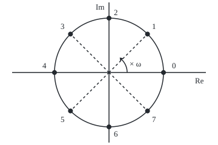
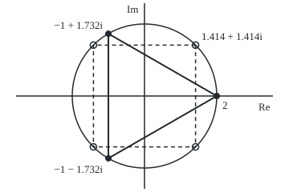

# Powers and roots: de Moivre multiplies the angle, so the n-th roots sit evenly round a circle

[Syllabus](../../../SYLLABUS.md) → [Complex analysis](../../../SYLLABUS.md#w07) → [Complex Numbers and the Plane](../../../SYLLABUS.md#w07-s01) → Powers and roots

---

## General Overview

A game spinner has 8 equal sectors. Put its pivot at 0 on the complex plane, arrow length 1. Where the arrow can rest, mid-sector, are eight points on the circle of radius 1, one every 45 degrees, starting due east at 1.

Multiplying on this plane is "turn and stretch" ([Polar form](03-polar-form-and-argument.md)), so one sector on, a 45-degree turn, is multiplication by the point at 45 degrees, 0.707107 + 0.707107i. Call that click ω, the Greek letter omega. Eight clicks bring the arrow home: ω multiplied by itself 8 times is 1. Each resting point is a number whose 8th power is 1, an **8th root of unity** (unity is the old word for 1). The eight add to zero.

Raising a number to the n-th power multiplies its angle by n and raises its length to the n-th power: **de Moivre's formula**. Undoing it divides the angle by n, but an angle is known only up to whole turns, so there are n answers. The cube roots of 8 are 2 and −1 ± 1.732051i. The equation z^4 = −16 has four roots of length 2, at 45, 135, 225 and 315 degrees.

**A power multiplies the angle and powers the length, so every nonzero number has exactly n n-th roots, equally spaced on one circle, and the n-th roots of 1 add to zero.**

**What kind of fact this is:** a theorem (de Moivre's formula, the count of n roots, the zero sum), proved on this card in Why it works; "root of unity" is a definition.

### The picture: the spinner's eight resting points

<p align="center"></p>

Drawn to scale at 90 units per 1, centre at 0. Point k is ω multiplied by itself k times: 0 is 1, 2 is i, 4 is −1. The small arc is one click, 45 degrees anticlockwise.

---

## The formula

Reminder: polar form writes a nonzero number as $r(\cos\theta + i\sin\theta)$, length (modulus) $r$, angle (argument) $\theta$ in radians ([Polar form](03-polar-form-and-argument.md)). Euler's formula writes that point as $e^{i\theta}$ ([Euler's formula](04-eulers-formula.md)).

$$\bigl(r(\cos\theta + i\sin\theta)\bigr)^n = r^n(\cos n\theta + i\sin n\theta)$$

**Read it aloud:** to raise a number to the n-th power, raise its length to the n-th power and multiply its angle by n.

The n-th roots of a nonzero number $c$, of length $r$ and angle $\theta$, run it backwards:

$$z_k = r^{1/n}\Bigl(\cos\frac{\theta + 2\pi k}{n} + i\sin\frac{\theta + 2\pi k}{n}\Bigr), \qquad k = 0, 1, \dots, n-1$$

**Read it aloud:** take the ordinary n-th root of the length, and share the angle, plus any whole turns, out n ways.

With $c = 1$ the roots are the powers of one click:

$$\omega = \cos\frac{2\pi}{n} + i\sin\frac{2\pi}{n}, \qquad 1 + \omega + \omega^2 + \dots + \omega^{n-1} = 0 \quad (n \ge 2)$$

**Read it aloud:** one click turns an n-th of a circle, and its n powers add to zero.

| Symbol | Plain meaning | In our example | Push it up and the answer… |
| --- | --- | --- | --- |
| $c$ | the number being rooted | 8, −16, 1 | a wider circle of roots |
| $r$ | length of the number powered or rooted | 8; 16 for −16 | — |
| $\theta$ | angle, radians anticlockwise from east | 0 for 8; π (180°) for −16 | each root turns an n-th as much |
| $n$ | the power, or how many roots | 3; 8 sectors | more roots, closer together |
| $k$ | which root, counting from 0 | 0 to 7 on the spinner | one n-th of a turn further on |
| $z_k$ | the k-th root | −1 + 1.732051i, k = 1 for 8 | — |
| $\omega$ | one click: the first n-th root of unity | 0.707107 + 0.707107i | a smaller turn |
| $\rho$, $\varphi$ | length and angle of an unknown root | 2 and 120° | — |

### When it holds

- **n a whole number.** Negative n works too, for z not 0. For a fraction such as 1/3 the formula gives one of three roots; which one is the branch problem of [Branch cuts and complex powers](../02-Holomorphic%20Functions/05-branch-cuts-and-complex-powers.md).
- **c not zero.** Zero has no angle; its only n-th root is 0.
- **Angles up to whole turns.** The principal argument, in (−π, π], only picks which root is k = 0.
- **n at least 2 for the zero sum.** For n = 1 the only root is 1.

---

## Why it works

### Step 0: multiplying adds angles and multiplies lengths

Multiply two numbers in polar form and the addition rules for sine and cosine give lengths multiplied, angles added; Euler writes it $e^{ia}e^{ib} = e^{i(a+b)}$. The rest is this, n times, or undone.

### Step 1: n equal factors multiply the angle by n

n equal factors give length $r^n$ and angle $n\theta$: de Moivre's formula, one extra angle per extra factor.

The number −1 + 1.732051i is −1 + √3 i: length 2, since 1 + 3 = 4, angle 120°. Cubed: length 8, angle 360°, due east. The cube is exactly 8. Bigger powers show the saving: 1 + i has length √2 and angle 45°, so (1 + i)^10 has length 32 and angle 450°, a whole turn plus 90°: 32i, no brackets expanded.

### Step 2: roots are angles shared out, plus whole turns

To solve $z^n = c$, give the unknown length $\rho$ (rho) and angle $\varphi$ (phi). By Step 1, $\rho^n = r$ and $n\varphi$ must point where $\theta$ points. Lengths are positive numbers, so $\rho = r^{1/n}$, one answer. But angles differing by a whole turn point the same way, so $n\varphi = \theta + 2\pi k$ for any whole $k$, and $\varphi = (\theta + 2\pi k)/n$.

Each step in $k$ turns the root by 2π/n. After n steps that is a full circle and the roots repeat. So $k = 0$ to $n - 1$ gives exactly n points, evenly spaced.

For 8: length 2, angles 0°, 120°, 240°. For −16, at 180°: length 2, angles 45°, 135°, 225°, 315°.

The factor theorem ([Roots and factors](../../03-Algebra/02-Polynomials/05-roots-and-the-factor-theorem.md)) checks this without angles: $z^3 - 8 = (z - 2)(z^2 + 2z + 4)$, and the quadratic formula gives $-1 \pm \sqrt{3}\,i$. It also caps a degree-n polynomial at n roots, so these are all.

### The picture: two equations, one circle of radius 2

<p align="center"></p>

Drawn to scale at 45 units per 1, centre at 0. Filled dots, solid triangle: the cube roots of 8. Open dots, dashed square: the roots of z^4 = −16. One circle holds both because 8 = 2^3 and 16 = 2^4.

### Step 3: the roots of unity are the powers of one click

With $c = 1$ the roots sit at angles $2\pi k/n$, and by Step 1 the k-th is ω multiplied by itself k times. Another click can also visit every sector: ω^3 reaches all 8, while ω^2 reaches only 4. A root whose powers reach all n is **primitive**: ω^m is primitive exactly when m and n share no factor above 1.

### Step 4: the roots of unity add to zero

Call the sum S and multiply each term by ω. Every root moves on one click, and ω^(n−1) becomes ω^n = 1: the same terms, reordered. So ωS = S, that is (ω − 1)S = 0, and ω is not 1 for n at least 2, so S = 0. On the spinner: one click leaves the set, and so its sum, unchanged, and the only point a turn fixes is 0. Other root sets are one root times the roots of unity, so they sum to zero too: 2 + (−1 + 1.732051i) + (−1 − 1.732051i) = 0.

<details>
<summary>Detailed proof: all whole powers, and exactly n roots</summary>

**De Moivre for every whole n.** With $u = \cos\theta + i\sin\theta$, the addition rules give $(\cos a + i\sin a)(\cos b + i\sin b) = \cos(a + b) + i\sin(a + b)$, so induction from $u^0 = 1$ gives $u^n = \cos n\theta + i\sin n\theta$. Since $u(\cos\theta - i\sin\theta) = 1$, the inverse is the point at angle $-\theta$, and the same induction covers negative n. Lengths multiply separately ([Conjugate and modulus](02-conjugate-and-modulus.md)), giving $r^n$.

**Every root is on the list.** If $z^n = c \ne 0$, write $z = \rho(\cos\varphi + i\sin\varphi)$. De Moivre gives $\rho^n = r$, so $\rho = r^{1/n}$, and $n\varphi = \theta + 2\pi m$ for some whole m. Dividing m by n with remainder, $m = qn + k$ with $0 \le k \le n - 1$, makes $\varphi$ the angle of $z_k$ plus q whole turns.

**No two coincide.** Two angles on the list differ by more than 0 and less than a full turn.

</details>

A second road uses no angles: Newton's method improves a guess z by subtracting $(z^n - c)/(n z^{n-1})$, the tangent line's correction, and from scattered starts it lands on each root. The code takes it.

---

## Worked numbers, by hand

| Step | Arithmetic | Value |
| --- | --- | --- |
| one click on the spinner | angle 45°, length 1 | 0.707107 + 0.707107i |
| cube −1 + 1.732051i | length 2^3, angle 3 × 120° = 360° | **8** |
| cube roots of 8 | length 2; angles (0 + 360° k)/3 | **2, −1 ± 1.732051i** |
| roots of z^4 = −16 | length 2; angles (180° + 360° k)/4 | **45°, 135°, 225°, 315°** |
| those four | 2 × (0.707107 ± 0.707107i) | ±1.414214 ± 1.414214i |
| sum of the cube roots | 2 − 1 − 1; 1.732051 − 1.732051 | **0** |

### What breaks if you drop a piece

| Mistake | Comes out at | What went wrong |
| --- | --- | --- |
| Only k = 0 kept | 2 alone; 2 roots missed | Whole turns ignored |
| Length divided by 3, not cube-rooted | 2.666667, cubing to 18.962963 | Lengths take ordinary roots |
| −16 read at angle 0 | 2, whose 4th power is 16 | −16 points west, 180° |
| Angle times 4, length kept at 2 | −2, not −16 | The length is powered too |

The code prints all four.

---

## Code, from first principles, and it actually runs

Two roads sharing no arithmetic. Powers: de Moivre against repeated multiplication. Roots: the formula against Newton's method from every whole-number grid point from −3 to 3 except 0, with no angles. The spinner's sum also comes from the geometric-series formula (1 − ω^8)/(1 − ω). Rust defines its own pair type.

### Python

```python
# Powers and roots -- the check behind the card.  Standard library only.
# A spinner with 8 sectors (the 8th roots of unity), the cube roots of 8, the
# fourth roots of -16.  Road one is de Moivre in polar form.  Road two uses no
# angles: repeated multiplication for powers, Newton's method for roots.
import math

def fmt(z):
    re, im = round(z.real, 6) + 0.0, round(z.imag, 6) + 0.0
    return f"{re:.6f} {'-' if im < 0 else '+'} {abs(im):.6f}i"

def power(z, n):                  # road two for powers: multiply n times
    out = 1 + 0j
    for _ in range(n):
        out *= z
    return out
def polar(z): return math.sqrt(z.real ** 2 + z.imag ** 2), math.atan2(z.imag, z.real)
def turn(r, t): return complex(r * math.cos(t), r * math.sin(t))
def de_moivre(z, n): r, t = polar(z); return turn(r ** n, n * t)   # length^n, angle x n
def roots(c, n):                  # road one: n-th root of the length, angle (t + 2 pi k) / n
    r, t = polar(c)
    return [turn(r ** (1 / n), (t + 2 * math.pi * k) / n) for k in range(n)]

def newton(c, n):                 # road two: Newton's method from every grid point but 0
    found = []
    for z in (complex(x, y) for x in range(-3, 4) for y in range(-3, 4) if x or y):
        for _ in range(80):
            z -= (power(z, n) - c) / (n * power(z, n - 1))
        if abs(power(z, n) - c) < 1e-9 and all(abs(z - f) > 1e-6 for f in found):
            found.append(z)
    return found

def gap(a, b): return max(min(abs(x - y) for y in b) for x in a)
def reach(z): return len({fmt(power(z, k)) for k in range(8)})
def show(zs): return ", ".join(fmt(z) for z in zs)

spin, cube, quart = roots(1, 8), roots(8, 3), roots(-16, 4)
w, a, b, g = spin[1], complex(-1, math.sqrt(3)), complex(math.sqrt(2), math.sqrt(2)), 1 + 1j
px = lambda zs, s: " ".join(f"({180 + s * z.real:.1f}, {120 - s * z.imag:.1f})" for z in zs)
print(f"figure, spinner, 90 px per unit, centre (180, 120): {px(spin, 90)}")
print(f"figure, radius 2, 45 px per unit: cube roots of 8 {px(cube, 45)}; fourth roots of -16 {px(quart, 45)}")
print(f"spinner omega = {fmt(w)}; omega^8 by 8 multiplications = {fmt(power(w, 8))}")
print(f"omega^0 to omega^7: {show(power(w, k) for k in range(8))}")
print(f"sum of the 8 sectors = {fmt(sum(spin))}; by (1 - omega^8)/(1 - omega) = {fmt((1 - power(w, 8)) / (1 - w))}")
print(f"powers of omega^3 reach {reach(power(w, 3))} sectors; powers of omega^2 reach {reach(power(w, 2))}")
for z, n in ((a, 3), (b, 4), (g, 10)):
    print(f"({fmt(z)})^{n}: de Moivre = {fmt(de_moivre(z, n))}; multiplied out = {fmt(power(z, n))}")
found = {n: newton(complex(c), n) for c, n in ((8, 3), (-16, 4), (1, 8))}
for c, n, rs in ((8, 3, cube), (-16, 4, quart), (1, 8, spin)):
    print(f"z^{n} = {c}: angles {[round(math.degrees(polar(z)[1]) % 360, 6) for z in rs]} deg; Newton finds "
          f"{len(found[n])}, same points: {'yes' if gap(rs, found[n]) < 1e-9 else 'no'}; sum = {fmt(sum(rs))}")
print(f"cube roots of 8: {show(cube)}; fourth roots of -16: {show(quart)}")
print(f"mistake 1, k = 0 only: 1 cube root of 8, {fmt(cube[0])}; misses {len(cube) - 1}")
print(f"mistake 2, length divided by 3, not cube-rooted: {8 / 3:.6f}, cubed = {(8 / 3) ** 3:.6f}, not 8")
print(f"mistake 3, -16 read at angle 0: {fmt(roots(16, 4)[0])} to the 4th = {fmt(power(roots(16, 4)[0], 4))}, not -16")
print(f"mistake 4, angle x 4 but length kept: {fmt(turn(2, 4 * polar(b)[1]))}, not {fmt(power(b, 4))}")
assert all(abs(power(w, k) - spin[k]) < 1e-12 for k in range(8))       # multiply vs formula
assert all(abs(de_moivre(z, n) - power(z, n)) < 1e-11 for z, n in ((a, 3), (b, 4), (g, 10)))
assert all(len(found[n]) == n and gap(roots(c, n), found[n]) < 1e-9 for c, n in ((8, 3), (-16, 4), (1, 8)))
assert abs(sum(spin)) < 1e-12 and abs(sum(cube)) < 1e-12 and abs(sum(quart)) < 1e-12
print("ALL CHECKS PASS")
```

**Ran 2026-09-27 on macOS, Python 3.14.6, standard library only. All checks passed. Output, pasted from the run:**

```
figure, spinner, 90 px per unit, centre (180, 120): (270.0, 120.0) (243.6, 56.4) (180.0, 30.0) (116.4, 56.4) (90.0, 120.0) (116.4, 183.6) (180.0, 210.0) (243.6, 183.6)
figure, radius 2, 45 px per unit: cube roots of 8 (270.0, 120.0) (135.0, 42.1) (135.0, 197.9); fourth roots of -16 (243.6, 56.4) (116.4, 56.4) (116.4, 183.6) (243.6, 183.6)
spinner omega = 0.707107 + 0.707107i; omega^8 by 8 multiplications = 1.000000 + 0.000000i
omega^0 to omega^7: 1.000000 + 0.000000i, 0.707107 + 0.707107i, 0.000000 + 1.000000i, -0.707107 + 0.707107i, -1.000000 + 0.000000i, -0.707107 - 0.707107i, 0.000000 - 1.000000i, 0.707107 - 0.707107i
sum of the 8 sectors = 0.000000 + 0.000000i; by (1 - omega^8)/(1 - omega) = 0.000000 + 0.000000i
powers of omega^3 reach 8 sectors; powers of omega^2 reach 4
(-1.000000 + 1.732051i)^3: de Moivre = 8.000000 + 0.000000i; multiplied out = 8.000000 + 0.000000i
(1.414214 + 1.414214i)^4: de Moivre = -16.000000 + 0.000000i; multiplied out = -16.000000 + 0.000000i
(1.000000 + 1.000000i)^10: de Moivre = 0.000000 + 32.000000i; multiplied out = 0.000000 + 32.000000i
z^3 = 8: angles [0.0, 120.0, 240.0] deg; Newton finds 3, same points: yes; sum = 0.000000 + 0.000000i
z^4 = -16: angles [45.0, 135.0, 225.0, 315.0] deg; Newton finds 4, same points: yes; sum = 0.000000 + 0.000000i
z^8 = 1: angles [0.0, 45.0, 90.0, 135.0, 180.0, 225.0, 270.0, 315.0] deg; Newton finds 8, same points: yes; sum = 0.000000 + 0.000000i
cube roots of 8: 2.000000 + 0.000000i, -1.000000 + 1.732051i, -1.000000 - 1.732051i; fourth roots of -16: 1.414214 + 1.414214i, -1.414214 + 1.414214i, -1.414214 - 1.414214i, 1.414214 - 1.414214i
mistake 1, k = 0 only: 1 cube root of 8, 2.000000 + 0.000000i; misses 2
mistake 2, length divided by 3, not cube-rooted: 2.666667, cubed = 18.962963, not 8
mistake 3, -16 read at angle 0: 2.000000 + 0.000000i to the 4th = 16.000000 + 0.000000i, not -16
mistake 4, angle x 4 but length kept: -2.000000 + 0.000000i, not -16.000000 + 0.000000i
ALL CHECKS PASS
```

### Rust

Same numbers, same labels, built with `rustc --edition 2021 -O`.

```rust
// Powers and roots -- the same check as the Python, in Rust.  No crates.
// A spinner with 8 sectors (the 8th roots of unity), the cube roots of 8, the
// fourth roots of -16.  Road one is de Moivre in polar form.  Road two uses no
// angles: repeated multiplication for powers, Newton's method for roots.
use std::f64::consts::PI;
use std::ops::{Add, Div, Mul, Sub};

#[derive(Clone, Copy)]
struct C { re: f64, im: f64 }
impl Add for C { type Output = C; fn add(self, o: C) -> C { c(self.re + o.re, self.im + o.im) } }
impl Sub for C { type Output = C; fn sub(self, o: C) -> C { c(self.re - o.re, self.im - o.im) } }
impl Mul for C { type Output = C; fn mul(self, o: C) -> C { c(self.re * o.re - self.im * o.im, self.re * o.im + self.im * o.re) } }
impl Div for C {
    type Output = C;
    fn div(self, o: C) -> C { let d = o.re * o.re + o.im * o.im; c((self.re * o.re + self.im * o.im) / d, (self.im * o.re - self.re * o.im) / d) }
}
fn c(re: f64, im: f64) -> C { C { re, im } }
fn r6(x: f64) -> f64 { (x * 1e6).round() / 1e6 + 0.0 }
fn fmt(z: C) -> String { let (re, im) = (r6(z.re), r6(z.im)); format!("{:.6} {} {:.6}i", re, if im < 0.0 { "-" } else { "+" }, im.abs()) }
fn size(z: C) -> f64 { (z.re * z.re + z.im * z.im).sqrt() }
fn power(z: C, n: usize) -> C { let mut out = c(1.0, 0.0); for _ in 0..n { out = out * z; } out }   // road two
fn polar(z: C) -> (f64, f64) { (size(z), z.im.atan2(z.re)) }
fn turn(r: f64, t: f64) -> C { c(r * t.cos(), r * t.sin()) }
fn de_moivre(z: C, n: usize) -> C { let (r, t) = polar(z); turn(r.powi(n as i32), n as f64 * t) }  // road one
fn roots(cc: C, n: usize) -> Vec<C> {        // road one: n-th root of the length, angle (t + 2 pi k) / n
    let (r, t) = polar(cc);
    (0..n).map(|k| turn(r.powf(1.0 / n as f64), (t + 2.0 * PI * k as f64) / n as f64)).collect()
}
fn newton(cc: C, n: usize) -> Vec<C> {       // road two: Newton's method from every grid point but 0
    let mut found: Vec<C> = Vec::new();
    for x in -3..4 { for y in -3..4 {
        if x == 0 && y == 0 { continue; }
        let mut z = c(x as f64, y as f64);
        for _ in 0..80 { z = z - (power(z, n) - cc) / (c(n as f64, 0.0) * power(z, n - 1)); }
        if size(power(z, n) - cc) < 1e-9 && found.iter().all(|&f| size(z - f) > 1e-6) { found.push(z); }
    } }
    found
}
fn gap(a: &[C], b: &[C]) -> f64 { a.iter().map(|&x| b.iter().map(|&y| size(x - y)).fold(f64::MAX, f64::min)).fold(0.0, f64::max) }
fn reach(z: C) -> usize { let mut s: Vec<String> = (0..8).map(|k| fmt(power(z, k))).collect(); s.sort(); s.dedup(); s.len() }
fn show(zs: &[C]) -> String { zs.iter().map(|&z| fmt(z)).collect::<Vec<_>>().join(", ") }
fn sum(zs: &[C]) -> C { zs.iter().fold(c(0.0, 0.0), |s, &z| s + z) }
fn px(zs: &[C], s: f64) -> String { zs.iter().map(|z| format!("({:.1}, {:.1})", 180.0 + s * z.re, 120.0 - s * z.im)).collect::<Vec<_>>().join(" ") }

fn main() {
    let (spin, cube, quart) = (roots(c(1.0, 0.0), 8), roots(c(8.0, 0.0), 3), roots(c(-16.0, 0.0), 4));
    let (w, a, b, g) = (spin[1], c(-1.0, 3f64.sqrt()), c(2f64.sqrt(), 2f64.sqrt()), c(1.0, 1.0));
    let one = c(1.0, 0.0);
    println!("figure, spinner, 90 px per unit, centre (180, 120): {}", px(&spin, 90.0));
    println!("figure, radius 2, 45 px per unit: cube roots of 8 {}; fourth roots of -16 {}", px(&cube, 45.0), px(&quart, 45.0));
    println!("spinner omega = {}; omega^8 by 8 multiplications = {}", fmt(w), fmt(power(w, 8)));
    println!("omega^0 to omega^7: {}", show(&(0..8).map(|k| power(w, k)).collect::<Vec<_>>()));
    println!("sum of the 8 sectors = {}; by (1 - omega^8)/(1 - omega) = {}", fmt(sum(&spin)), fmt((one - power(w, 8)) / (one - w)));
    println!("powers of omega^3 reach {} sectors; powers of omega^2 reach {}", reach(power(w, 3)), reach(power(w, 2)));
    let pw = [(a, 3), (b, 4), (g, 10)];
    for &(z, n) in &pw { println!("({})^{}: de Moivre = {}; multiplied out = {}", fmt(z), n, fmt(de_moivre(z, n)), fmt(power(z, n))); }
    let cases = [(8.0, 3, &cube), (-16.0, 4, &quart), (1.0, 8, &spin)];
    let found: Vec<Vec<C>> = cases.iter().map(|&(v, n, _)| newton(c(v, 0.0), n)).collect();
    for (i, &(v, n, rs)) in cases.iter().enumerate() {
        let ang: Vec<f64> = rs.iter().map(|&z| r6(polar(z).1.to_degrees().rem_euclid(360.0))).collect();
        println!("z^{} = {}: angles {:?} deg; Newton finds {}, same points: {}; sum = {}", n, v, ang, found[i].len(),
                 if gap(rs, &found[i]) < 1e-9 { "yes" } else { "no" }, fmt(sum(rs)));
    }
    println!("cube roots of 8: {}; fourth roots of -16: {}", show(&cube), show(&quart));
    println!("mistake 1, k = 0 only: 1 cube root of 8, {}; misses {}", fmt(cube[0]), cube.len() - 1);
    println!("mistake 2, length divided by 3, not cube-rooted: {:.6}, cubed = {:.6}, not 8", 8.0 / 3.0, (8.0f64 / 3.0).powi(3));
    let r16 = roots(c(16.0, 0.0), 4)[0];
    println!("mistake 3, -16 read at angle 0: {} to the 4th = {}, not -16", fmt(r16), fmt(power(r16, 4)));
    println!("mistake 4, angle x 4 but length kept: {}, not {}", fmt(turn(2.0, 4.0 * polar(b).1)), fmt(power(b, 4)));
    assert!((0..8).all(|k| size(power(w, k) - spin[k]) < 1e-12));                  // multiply vs formula
    assert!(pw.iter().all(|&(z, n)| size(de_moivre(z, n) - power(z, n)) < 1e-11));
    assert!(cases.iter().enumerate().all(|(i, &(_, n, rs))| found[i].len() == n && gap(rs, &found[i]) < 1e-9));
    assert!(size(sum(&spin)) < 1e-12 && size(sum(&cube)) < 1e-12 && size(sum(&quart)) < 1e-12);
    println!("ALL CHECKS PASS");
}
```

**Ran 2026-09-27 on macOS, rustc 1.98.1, no crates. All checks passed. Output, pasted from the run:**

```
figure, spinner, 90 px per unit, centre (180, 120): (270.0, 120.0) (243.6, 56.4) (180.0, 30.0) (116.4, 56.4) (90.0, 120.0) (116.4, 183.6) (180.0, 210.0) (243.6, 183.6)
figure, radius 2, 45 px per unit: cube roots of 8 (270.0, 120.0) (135.0, 42.1) (135.0, 197.9); fourth roots of -16 (243.6, 56.4) (116.4, 56.4) (116.4, 183.6) (243.6, 183.6)
spinner omega = 0.707107 + 0.707107i; omega^8 by 8 multiplications = 1.000000 + 0.000000i
omega^0 to omega^7: 1.000000 + 0.000000i, 0.707107 + 0.707107i, 0.000000 + 1.000000i, -0.707107 + 0.707107i, -1.000000 + 0.000000i, -0.707107 - 0.707107i, 0.000000 - 1.000000i, 0.707107 - 0.707107i
sum of the 8 sectors = 0.000000 + 0.000000i; by (1 - omega^8)/(1 - omega) = 0.000000 + 0.000000i
powers of omega^3 reach 8 sectors; powers of omega^2 reach 4
(-1.000000 + 1.732051i)^3: de Moivre = 8.000000 + 0.000000i; multiplied out = 8.000000 + 0.000000i
(1.414214 + 1.414214i)^4: de Moivre = -16.000000 + 0.000000i; multiplied out = -16.000000 + 0.000000i
(1.000000 + 1.000000i)^10: de Moivre = 0.000000 + 32.000000i; multiplied out = 0.000000 + 32.000000i
z^3 = 8: angles [0.0, 120.0, 240.0] deg; Newton finds 3, same points: yes; sum = 0.000000 + 0.000000i
z^4 = -16: angles [45.0, 135.0, 225.0, 315.0] deg; Newton finds 4, same points: yes; sum = 0.000000 + 0.000000i
z^8 = 1: angles [0.0, 45.0, 90.0, 135.0, 180.0, 225.0, 270.0, 315.0] deg; Newton finds 8, same points: yes; sum = 0.000000 + 0.000000i
cube roots of 8: 2.000000 + 0.000000i, -1.000000 + 1.732051i, -1.000000 - 1.732051i; fourth roots of -16: 1.414214 + 1.414214i, -1.414214 + 1.414214i, -1.414214 - 1.414214i, 1.414214 - 1.414214i
mistake 1, k = 0 only: 1 cube root of 8, 2.000000 + 0.000000i; misses 2
mistake 2, length divided by 3, not cube-rooted: 2.666667, cubed = 18.962963, not 8
mistake 3, -16 read at angle 0: 2.000000 + 0.000000i to the 4th = 16.000000 + 0.000000i, not -16
mistake 4, angle x 4 but length kept: -2.000000 + 0.000000i, not -16.000000 + 0.000000i
ALL CHECKS PASS
```

The two outputs match line for line.

> [!TIP]
> **Try changing**
> Guess first, then run it.
> - **A different click.** In the reach line, `power(w, 3)` to `power(w, 4)`: a half turn, reaching 2 sectors.
> - **Forget the whole turns.** In `roots`, `2 * math.pi * k` to `math.pi * k`: Newton disagrees and the third assert stops the run.
> - **Starts off the axes only.** In `newton`, `if x or y` to `if x and y`: Newton finds only the 4 diagonal eighth roots, and the third assert stops the run.

---

## The usual mistake

> [!warning]
> **Stopping at one root.** A calculator's cube root of 8 is 2: correct, but one answer of three. The angle of 8 is 0, and equally 360° and 720°; a third of each gives three different points. Every nonzero number has exactly n n-th roots.
>
> - **Dividing the length by n.** The length takes an ordinary root: 2, not 2.666667, whose cube is 18.962963.
> - **A negative number at angle 0.** −16 points west, at 180°; angle 0 gives 2, and 2 to the 4th is 16.
> - **Turning without stretching.** (1.414214 + 1.414214i)^4 is −16, not −2: the length is powered too.

---

## Where you meet it in real life

- **Three-phase electricity.** Three voltages a third of a cycle apart, scaled cube roots of unity, add to zero, so a balanced load sends almost nothing down the shared return wire.
- **Signal processing.** The discrete Fourier transform measures a signal against the roots of unity; their zero sum keeps frequencies apart ([The discrete Fourier transform](../08-Transforms%20in%20Outline/02-discrete-fourier-transform.md)).

> **Say it back**
> Multiplying multiplies lengths and adds angles, so an n-th power multiplies the angle by n. A root divides the angle by n; since an angle carries any number of whole turns, there are n roots, an n-th of a circle apart. The roots of 1 are the powers of one click, and add to zero because one click leaves the set unchanged.

---

## What this builds on

- [Euler's formula](04-eulers-formula.md): the point at angle θ as $e^{i\theta}$, which turns powers into multiplying the angle.
- [Roots and factors](../../03-Algebra/02-Polynomials/05-roots-and-the-factor-theorem.md): at most n roots for a degree-n polynomial, and the angle-free road to the cube roots of 8.

## Where this goes next

- [Complex vectors and matrices](07-complex-vectors-and-matrices.md): roots of unity filling the Fourier matrix.
- [Branch cuts and complex powers](../02-Holomorphic%20Functions/05-branch-cuts-and-complex-powers.md): choosing one root continuously.
- [The discrete Fourier transform](../08-Transforms%20in%20Outline/02-discrete-fourier-transform.md): a signal split along the roots of unity.
- Dirichlet characters: clock arithmetic mapped into roots of unity.
- Gauss sums: sums of roots of unity that do not cancel.
- Cyclotomic fields: number systems built from a primitive root.

---

## Sources

Verified 2026-09-27: every link below resolves to the publisher's page.

- Orloff, Jeremy. "Topic 1: Complex algebra and the complex plane." MIT 18.04 *Complex Variables with Applications*, MIT OpenCourseWare, 2018. [Course notes](https://ocw.mit.edu/courses/18-04-complex-variables-with-applications-spring-2018/resources/mit18_04s18_topic1/). Polar form and powers, with pictures.
- Beck, Matthias, Gerald Marchesi, Dennis Pixton and Lucas Sabalka. *A First Course in Complex Analysis*. [Author page and full text](https://matthbeck.github.io/complex.html). Free; chapter 1 covers polar form and roots.
- O'Connor, J. J., and E. F. Robertson. "Abraham de Moivre." MacTutor History of Mathematics Archive, University of St Andrews. [Biography](https://mathshistory.st-andrews.ac.uk/Biographies/De_Moivre/). De Moivre's life and work.
