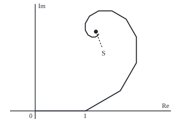
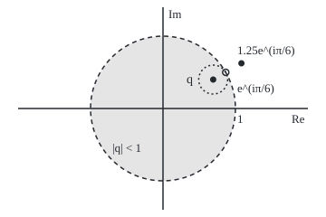

# Limits and regions in the plane: a complex limit is two real limits, plus the words disc, boundary and domain

[Syllabus](../../../SYLLABUS.md) → [Complex analysis](../README.md) → [Complex Numbers and the Plane](../README.md#s01) → Limits and regions in the plane

---

## General Overview

A staircase winds inward, seen from above. The first tread carries a climber 1 metre east; each later tread is 0.8 times as long and turned 30 degrees further anticlockwise. The treads never run out, yet the climber closes in on one spot.

Each tread is an arrow in the plane, so a complex number, and shrink-and-turn is one multiplication. The stops form a **sequence**; the spot they close in on is its **limit**, 1.207660 + 1.572578i: metres east and north of the start.

Two facts find it. Points settle exactly when their east and north parts both settle, so real limits suffice. And turning, shrinking arrows add up by the same geometric-series formula as real numbers, for every ratio inside the unit circle.

**A sequence in the plane converges exactly when its real and imaginary parts both converge, and the geometric series with complex ratio q sums to 1/(1 − q) for every q in the open unit disc, failing on its edge.**

**What kind of fact this is:** a theorem, proved on this card in Why it works; open disc, boundary, domain and bounded are definitions.

### The picture: the staircase from above

<p align="center"></p>

To scale: 100 units per metre, with the start at (70, 220). The sixteen stops run from (70.0, 220.0) to (196.3, 67.0), and the limit S sits at (190.77, 62.74). Each leg is the one before, turned 30 degrees and shrunk to 0.8.

---

## The formula

Notation first, in words. A **sequence** $z_n$ is an endless list of complex numbers, read "z-sub-n". The arrow $z_n \to L$ reads "z-sub-n tends to L": the distance $|z_n - L|$, the modulus from [Conjugate and modulus](02-conjugate-and-modulus.md), shrinks towards 0.

$$z_n \to L \iff \operatorname{Re} z_n \to \operatorname{Re} L \text{ and } \operatorname{Im} z_n \to \operatorname{Im} L$$

**Read it aloud:** the points close in on L exactly when their east parts and their north parts both close in.

The link is a pair of inequalities for any complex number $w$:

$$\max(|\operatorname{Re} w|, |\operatorname{Im} w|) \le |w| \le |\operatorname{Re} w| + |\operatorname{Im} w|$$

**Read it aloud:** an arrow is at least as long as either shadow on the axes, and no longer than both laid end to end.

The staircase's n-th tread is $q^n$, where $q = 0.8\,e^{i\pi/6}$ shrinks to 0.8 and turns by π/6 radians, 30 degrees ([Euler's formula](04-eulers-formula.md)). The stop after $N$ treads is the partial sum $S_N$:

$$S_N = 1 + q + \cdots + q^{N-1} = \frac{1 - q^N}{1 - q}, \qquad S = \sum_{n=0}^{\infty} q^n = \frac{1}{1 - q} \text{ if } |q| < 1$$

**Read it aloud:** for a ratio shorter than 1, the stops close in on one over one-minus-q, and the gap $|S - S_N| = |q|^N/|1 - q|$ shrinks by the factor 0.8 each tread.

A series with terms $a_n$ whose lengths have a finite total **converges absolutely**, and then converges:

$$\sum |a_n| < \infty \implies \sum a_n \text{ converges, and } \Big|\sum a_n\Big| \le \sum |a_n|$$

**Read it aloud:** a path of finite length ends somewhere, no farther out than its length.

| Symbol | Plain meaning | In our example | Push it up and the answer… |
| --- | --- | --- | --- |
| $z_n$, $n$, $L$ | a sequence's n-th member; its limit | the stops; L = 1.207660 + 1.572578i | — |
| $w$, $\lvert w\rvert$ | any complex number; its length | 1 − q, length 0.504341 | — |
| $q$, $\theta$ | the ratio: shrink, then turn by θ | 0.692820 + 0.400000i; θ = 0.523599 | past length 1, no limit |
| $a_n$ | a series' n-th term; here the tread $q^n$ | first tread 1 | — |
| $S_N$, $N$ | the sum of the first N terms | after 5 treads, 1.808020 + 1.820980i | closer to S |
| $S$ | the full sum, the limit of $S_N$ | 1.207660 + 1.572578i | — |
| $D(c, r)$, $c$, $r$ | open disc: points closer than r to c | working ratios: centre 0, radius 1 | a bigger disc |
| $\varepsilon$, $\infty$ | any tolerance; the point at infinity | Detailed proof; Step 5 | — |

The words for regions:

- **Open disc** $D(c, r)$: every point closer than $r$ to $c$, rim left out.
- **Open set**: each point has a small disc round it inside the set.
- **Boundary**: points whose every small disc meets both the set and points outside it; for $D(0, 1)$, the circle $|q| = 1$.
- **Domain** (or region): open and **connected**, meaning any two points join by a path inside.
- **Bounded**: fits inside some disc of finite radius.

### When it holds

- **Both coordinates, not length alone.** With a ratio of length 1 every tread is 1 metre, yet the stops circle forever.
- **Ratio strictly inside the unit circle.** Outside, 1/(1 − q) still prints a number, but no sum exists.
- **Angles in radians.** Reading 30 as radians gives 0.629199 − 0.567346i.
- **The region words are definitions**, with nothing to prove.

---

## Why it works

### Step 0: closeness in the plane is closeness in each coordinate

An arrow is long only if a shadow on an axis is long. Pythagoras, $|w|^2 = (\operatorname{Re} w)^2 + (\operatorname{Im} w)^2$, gives both inequalities.

### Step 1: a complex limit is two real limits

Put $w = z_n - L$. If $|w| \to 0$, the left inequality squeezes both coordinate gaps to 0. If both gaps shrink to 0, so does their sum, and the right inequality squeezes $|w|$ to 0.

On the staircase the east parts are the real series 1 + 0.8 cos(π/6) + 0.8^2 cos(2π/6) + …, and the north parts use sine. Summed separately they give 1.207660 and 1.572578: the limit, with no complex multiplication.

### Step 2: the geometric sum telescopes

Multiply $S_N$ by $q$ and every tread moves up one place; subtracting cancels all but two terms: $S_N - qS_N = 1 - q^N$. Only multiplying and adding were used, so this holds for complex q as for real q.

### Step 3: the leftover term dies inside the disc

The gap $S - S_N$ is $q^N/(1 - q)$, and lengths multiply, so its length is $|q|^N/|1 - q|$: 0.8 to the N over 0.504341, which shrinks to 0.

When $|q| = 1$ the leftover $q^N$ keeps length 1 and walks round the circle. With $q = e^{i\pi/6}$ the stops return to 0 after 12 treads, since that q is a twelfth root of 1 ([Powers and roots](05-powers-roots-and-roots-of-unity.md)). When $|q| > 1$ it grows without bound.

### Step 4: absolute convergence, and why the disc is open

The tread lengths 1, 0.8, 0.8^2, … add to 1/(1 − 0.8) = 5 metres. Each tread's east and north parts are no longer than the tread, so the real comparison test ([Convergence tests](../../06-Calculus%20and%20analysis/06-Series/02-comparison-ratio-and-root-tests.md)) makes both coordinate series converge, and Step 1 finishes. No stop lies beyond 2.566107 metres: the stops form a bounded set.

The working ratios form the open disc $D(0, 1)$. It is open: this q sits 0.2 inside the rim, so every ratio within 0.2 of it works too. It is connected, since a straight segment joins any two of its points inside it, so it is a domain. Its boundary, the unit circle, holds no working ratio.

### The picture: which ratios give a limit

<p align="center"></p>

To scale: 80 units per 1, 0 at (180, 120). The ratio q sits at (235.43, 88.00), its dotted disc of radius 0.2 still inside; $e^{i\pi/6}$ sits on the rim at (249.28, 80.00), and 1.25 times it outside at (266.60, 70.00). The rim is dashed: it is not in the open disc.

### Step 5: the point at infinity

With ratio 1.25 turned 30 degrees the stops are 11934.3 metres out after 40 treads. Such a sequence tends to infinity, $z_n \to \infty$: $|z_n|$ passes every bound, in any direction, and $\infty$ counts as one extra point. Rest a ball on the plane at 0. The straight line from a plane point to the ball's top meets the ball at exactly one other point; send the plane point there. Far points in every direction land near the top, and the top itself is the point at infinity. The ball, so labelled, is the **Riemann sphere**.

<details>
<summary>Detailed proof: limits by tolerance, coordinates, and absolute convergence</summary>

**The definition.** $z_n \to L$ means: for every tolerance $\varepsilon > 0$, all members from some stage on satisfy $|z_n - L| < \varepsilon$.

**Coordinates.** If $z_n \to L$, then from that stage each coordinate gap is at most $|z_n - L| < \varepsilon$. Conversely, past a stage where both coordinate gaps are below $\varepsilon/2$, the right inequality gives $|z_n - L| < \varepsilon$.

**The geometric series.** For $|q| < 1$, from some stage $|q|^N < \varepsilon\,|1 - q|$, so $|S - S_N| < \varepsilon$. For $|q| \ge 1$ no limit exists: consecutive partial sums of a convergent series eventually differ by less than any tolerance, yet here they differ by a term of length at least 1.

**Absolute convergence.** Since $|\operatorname{Re} a_n| \le |a_n|$, comparison makes the real parts' series absolutely convergent, hence convergent; likewise Im; the coordinates result finishes. The triangle inequality bounds each partial sum by its sum of lengths, and the bound survives the limit.

</details>

---

## Worked numbers, by hand

| Step | Arithmetic | Value |
| --- | --- | --- |
| The ratio | 0.8 cos(π/6) + 0.8 sin(π/6) i | 0.692820 + 0.400000i |
| One minus the ratio | 1 − 0.692820 − 0.400000i | 0.307180 − 0.400000i |
| Its length squared | 0.307180^2 + 0.400000^2 | 0.254359 |
| Divide through the conjugate | (0.307180 + 0.400000i) / 0.254359 | **1.207660 + 1.572578i** |
| Straight-line distance | length of the limit | 1.982787 m |
| Path walked | 1/(1 − 0.8) | 5 m |
| Still to go after 20 treads | 0.8^20 / 0.504341 | 0.022860 m |

The climber ends 1.982787 metres from the start after walking 5 metres of treads.

### What breaks if you drop a piece

| Mistake | Comes out at | What went wrong |
| --- | --- | --- |
| Reading 30 as radians, not degrees | 0.629199 − 0.567346i | e^(30i) turns by 30 radians |
| Adding lengths instead of arrows | 5 m, not 1.982787 m | length walked is not displacement |
| Ratio on the rim, $e^{i\pi/6}$ | distance swings between 0 and 3.863703 | treads never shrink: no limit |
| Ratio 1.25 e^(iπ/6), formula anyway | −0.207660 + 1.572578i; the walk is 11934.3 m out | outside the disc no sum exists |

The code prints all four.

---

## Code, from first principles, and it actually runs

Three roads to the limit: walk 200 treads, divide 1 by 1 − q through the conjugate, and sum the east and north parts as two real series. The asserts compare the roads, the measured gaps with $|q|^N/|1 - q|$, the path with 5 metres, and the rim and outside walks with their failure to settle.

### Python

```python
# Limits and regions in the plane -- the check behind the card.  Standard library only.
# The staircase seen from above: first step 1 m east, each next step 0.8 as long, turned 30 degrees.
# Road one: walk it, adding step after step.  Road two: the closed form 1/(1 - q), divided
# through the conjugate.  Road three: the real and imaginary parts as two real series.
import math

R, TH = 0.8, math.pi / 6
q = complex(R * math.cos(TH), R * math.sin(TH))    # the ratio: turn 30 degrees, shrink to 0.8

def walk(ratio, n_steps):                          # position after n_steps steps, and every stop
    pos, step, stops = 0j, 1 + 0j, [0j]
    for _ in range(n_steps):
        pos, step = pos + step, step * ratio
        stops.append(pos)
    return stops

def show(w):                                       # 'a + bi', six decimals, no -0.000000
    a, b = round(w.real, 6) + 0.0, round(w.imag, 6) + 0.0
    return f"{a:.6f} {'-' if b < 0 else '+'} {abs(b):.6f}i"

d = 1 - q
closed = complex(d.real, -d.imag) / (d.real ** 2 + d.imag ** 2)    # 1/d = conj(d)/|d|^2
stops = walk(q, 200)
re_sum = sum(R ** n * math.cos(n * TH) for n in range(200))       # road three: two real series
im_sum = sum(R ** n * math.sin(n * TH) for n in range(200))
print(f"ratio q = {show(q)}, |q| = {abs(q):.6f}, turn {TH:.6f} rad")
print(f"1 - q = {show(d)}, |1 - q|^2 = {d.real ** 2 + d.imag ** 2:.6f}, |1 - q| = {abs(d):.6f}")
gaps, bounds = [], []
for n in (5, 10, 20):
    gaps.append(abs(closed - stops[n]))
    bounds.append(R ** n / abs(d))
    print(f"after {n} steps: {show(stops[n])}, distance to limit {gaps[-1]:.6f}, |q|^N/|1 - q| = {bounds[-1]:.6f}")
print(f"after 200 steps:    {show(stops[200])}")
print(f"closed form 1/(1 - q): {show(closed)}, straight-line distance {abs(closed):.6f} m")
print(f"two real series: Re {re_sum:.6f}, Im {im_sum:.6f}")
lengths = sum(abs(stops[k + 1] - stops[k]) for k in range(200))
print(f"total length walked {lengths:.6f} m = 1/(1 - 0.8) = {1 / (1 - R):.6f}; farthest stop {max(abs(s) for s in stops):.6f} m")
print(f"q sits {1 - abs(q):.6f} inside the unit circle: the disc of that radius round q is inside too")
edge = walk(complex(math.cos(TH), math.sin(TH)), 48)
print(f"boundary, q = e^(i pi/6): after 12 steps {show(edge[12])}; |S| over 48 steps from "
      f"{min(abs(s) for s in edge[1:]):.6f} to {max(abs(s) for s in edge):.6f}, no limit")
far = walk(1.25 * complex(math.cos(TH), math.sin(TH)), 40)
fake = 1 / (1 - 1.25 * complex(math.cos(TH), math.sin(TH)))
print(f"outside, q = 1.25 e^(i pi/6): after 40 steps |S| = {abs(far[40]):.1f} m; 1/(1 - q) says {show(fake)}")
deg = 1 / (1 - complex(R * math.cos(30), R * math.sin(30)))
print(f"mistake, 30 read as radians: 1/(1 - 0.8 e^(30i)) = {show(deg)}")
print("figure, stops " + " ".join(f"({70 + 100 * s.real:.1f},{220 - 100 * s.imag:.1f})" for s in stops[:16]))
print(f"figure, limit ({70 + 100 * closed.real:.2f}, {220 - 100 * closed.imag:.2f}); ratio plane q ({180 + 80 * q.real:.2f}, "
      f"{120 - 80 * q.imag:.2f}), edge ({180 + 80 * math.cos(TH):.2f}, {120 - 80 * math.sin(TH):.2f}), "
      f"outside ({180 + 100 * math.cos(TH):.2f}, {120 - 100 * math.sin(TH):.2f})")
assert abs(stops[200] - closed) < 1e-12                                 # walking agrees with 1/(1 - q)
assert abs(re_sum - closed.real) < 1e-12 and abs(im_sum - closed.imag) < 1e-12   # two real limits
assert all(abs(g - b) < 1e-12 for g, b in zip(gaps, bounds)) and abs(lengths - 1 / (1 - R)) < 1e-9
assert abs(edge[12]) < 1e-12 and max(abs(s) for s in edge) > 3 and abs(far[40]) > 1000
print("ALL CHECKS PASS")
```

**Ran 2026-09-27 on macOS, Python 3.14.6, standard library only. All checks passed. Output, pasted from the run:**

```
ratio q = 0.692820 + 0.400000i, |q| = 0.800000, turn 0.523599 rad
1 - q = 0.307180 - 0.400000i, |1 - q|^2 = 0.254359, |1 - q| = 0.504341
after 5 steps: 1.808020 + 1.820980i, distance to limit 0.649720, |q|^N/|1 - q| = 0.649720
after 10 steps: 0.996592 + 1.600450i, distance to limit 0.212900, |q|^N/|1 - q| = 0.212900
after 20 steps: 1.198920 + 1.593702i, distance to limit 0.022860, |q|^N/|1 - q| = 0.022860
after 200 steps:    1.207660 + 1.572578i
closed form 1/(1 - q): 1.207660 + 1.572578i, straight-line distance 1.982787 m
two real series: Re 1.207660, Im 1.572578
total length walked 5.000000 m = 1/(1 - 0.8) = 5.000000; farthest stop 2.566107 m
q sits 0.200000 inside the unit circle: the disc of that radius round q is inside too
boundary, q = e^(i pi/6): after 12 steps 0.000000 + 0.000000i; |S| over 48 steps from 0.000000 to 3.863703, no limit
outside, q = 1.25 e^(i pi/6): after 40 steps |S| = 11934.3 m; 1/(1 - q) says -0.207660 + 1.572578i
mistake, 30 read as radians: 1/(1 - 0.8 e^(30i)) = 0.629199 - 0.567346i
figure, stops (70.0,220.0) (170.0,220.0) (239.3,180.0) (271.3,124.6) (271.3,73.4) (250.8,37.9) (222.4,21.5) (196.2,21.5) (178.0,32.0) (169.7,46.5) (169.7,60.0) (175.0,69.3) (182.5,73.5) (189.3,73.5) (194.1,70.8) (196.3,67.0)
figure, limit (190.77, 62.74); ratio plane q (235.43, 88.00), edge (249.28, 80.00), outside (266.60, 70.00)
ALL CHECKS PASS
```

### Rust

Same numbers, same labels, built with `rustc --edition 2021 -O`.

```rust
// Limits and regions in the plane -- the same check as the Python, in Rust.  No crates.
// The staircase seen from above: first step 1 m east, each next step 0.8 as long, turned 30 degrees.
// Road one: walk it, adding step after step.  Road two: the closed form 1/(1 - q), divided
// through the conjugate.  Road three: the real and imaginary parts as two real series.
use std::f64::consts::PI;
#[derive(Clone, Copy)]
struct C { re: f64, im: f64 }
fn c(re: f64, im: f64) -> C { C { re, im } }
fn add(a: C, b: C) -> C { c(a.re + b.re, a.im + b.im) }
fn sub(a: C, b: C) -> C { c(a.re - b.re, a.im - b.im) }
fn mul(a: C, b: C) -> C { c(a.re * b.re - a.im * b.im, a.re * b.im + a.im * b.re) }
fn modulus(a: C) -> f64 { a.re.hypot(a.im) }
fn inv(d: C) -> C { let m = d.re * d.re + d.im * d.im; c(d.re / m, -d.im / m) } // conj(d)/|d|^2
fn polar(r: f64, t: f64) -> C { c(r * t.cos(), r * t.sin()) }

fn walk(ratio: C, n_steps: usize) -> Vec<C> { // position after n_steps steps, and every stop
    let (mut pos, mut step, mut stops) = (c(0.0, 0.0), c(1.0, 0.0), vec![c(0.0, 0.0)]);
    for _ in 0..n_steps {
        pos = add(pos, step);
        step = mul(step, ratio);
        stops.push(pos);
    }
    stops
}
fn show(w: C) -> String { // 'a + bi', six decimals, no -0.000000
    let a = format!("{:.6}", w.re);
    let a = if a == "-0.000000" { "0.000000".to_string() } else { a };
    let b = format!("{:.6}", w.im.abs());
    let sign = if w.im < 0.0 && b != "0.000000" { '-' } else { '+' };
    format!("{} {} {}i", a, sign, b)
}
fn biggest(v: &[C]) -> f64 { v.iter().map(|&s| modulus(s)).fold(0.0, f64::max) }

fn main() {
    let (r, th) = (0.8f64, PI / 6.0);
    let q = polar(r, th); // the ratio: turn 30 degrees, shrink to 0.8
    let d = sub(c(1.0, 0.0), q);
    let closed = inv(d);
    let stops = walk(q, 200);
    let re_sum: f64 = (0..200).map(|n| r.powi(n) * (n as f64 * th).cos()).sum(); // road three
    let im_sum: f64 = (0..200).map(|n| r.powi(n) * (n as f64 * th).sin()).sum();
    println!("ratio q = {}, |q| = {:.6}, turn {:.6} rad", show(q), modulus(q), th);
    println!("1 - q = {}, |1 - q|^2 = {:.6}, |1 - q| = {:.6}", show(d), d.re * d.re + d.im * d.im, modulus(d));
    let (mut gaps, mut bounds) = (Vec::new(), Vec::new());
    for n in [5usize, 10, 20] {
        gaps.push(modulus(sub(closed, stops[n])));
        bounds.push(r.powi(n as i32) / modulus(d));
        println!("after {} steps: {}, distance to limit {:.6}, |q|^N/|1 - q| = {:.6}", n, show(stops[n]), gaps[gaps.len() - 1], bounds[bounds.len() - 1]);
    }
    println!("after 200 steps:    {}", show(stops[200]));
    println!("closed form 1/(1 - q): {}, straight-line distance {:.6} m", show(closed), modulus(closed));
    println!("two real series: Re {:.6}, Im {:.6}", re_sum, im_sum);
    let lengths: f64 = (0..200).map(|k| modulus(sub(stops[k + 1], stops[k]))).sum();
    println!("total length walked {:.6} m = 1/(1 - 0.8) = {:.6}; farthest stop {:.6} m", lengths, 1.0 / (1.0 - r), biggest(&stops));
    println!("q sits {:.6} inside the unit circle: the disc of that radius round q is inside too", 1.0 - modulus(q));
    let edge = walk(polar(1.0, th), 48);
    let low = edge[1..].iter().map(|&s| modulus(s)).fold(f64::INFINITY, f64::min);
    println!("boundary, q = e^(i pi/6): after 12 steps {}; |S| over 48 steps from {:.6} to {:.6}, no limit", show(edge[12]), low, biggest(&edge));
    let far = walk(polar(1.25, th), 40);
    let fake = inv(sub(c(1.0, 0.0), polar(1.25, th)));
    println!("outside, q = 1.25 e^(i pi/6): after 40 steps |S| = {:.1} m; 1/(1 - q) says {}", modulus(far[40]), show(fake));
    let deg = inv(sub(c(1.0, 0.0), polar(r, 30.0)));
    println!("mistake, 30 read as radians: 1/(1 - 0.8 e^(30i)) = {}", show(deg));
    let pts: Vec<String> = stops[..16].iter().map(|s| format!("({:.1},{:.1})", 70.0 + 100.0 * s.re, 220.0 - 100.0 * s.im)).collect();
    println!("figure, stops {}", pts.join(" "));
    println!("figure, limit ({:.2}, {:.2}); ratio plane q ({:.2}, {:.2}), edge ({:.2}, {:.2}), outside ({:.2}, {:.2})",
        70.0 + 100.0 * closed.re, 220.0 - 100.0 * closed.im, 180.0 + 80.0 * q.re, 120.0 - 80.0 * q.im,
        180.0 + 80.0 * th.cos(), 120.0 - 80.0 * th.sin(), 180.0 + 100.0 * th.cos(), 120.0 - 100.0 * th.sin());
    assert!(modulus(sub(stops[200], closed)) < 1e-12); // walking agrees with 1/(1 - q)
    assert!((re_sum - closed.re).abs() < 1e-12 && (im_sum - closed.im).abs() < 1e-12); // two real limits
    assert!(gaps.iter().zip(&bounds).all(|(g, b)| (g - b).abs() < 1e-12) && (lengths - 1.0 / (1.0 - r)).abs() < 1e-9);
    assert!(modulus(edge[12]) < 1e-12 && biggest(&edge) > 3.0 && modulus(far[40]) > 1000.0);
    println!("ALL CHECKS PASS");
}
```

**Ran 2026-09-27 on macOS, rustc 1.98.1, no crates. All checks passed. Output, pasted from the run:**

```
ratio q = 0.692820 + 0.400000i, |q| = 0.800000, turn 0.523599 rad
1 - q = 0.307180 - 0.400000i, |1 - q|^2 = 0.254359, |1 - q| = 0.504341
after 5 steps: 1.808020 + 1.820980i, distance to limit 0.649720, |q|^N/|1 - q| = 0.649720
after 10 steps: 0.996592 + 1.600450i, distance to limit 0.212900, |q|^N/|1 - q| = 0.212900
after 20 steps: 1.198920 + 1.593702i, distance to limit 0.022860, |q|^N/|1 - q| = 0.022860
after 200 steps:    1.207660 + 1.572578i
closed form 1/(1 - q): 1.207660 + 1.572578i, straight-line distance 1.982787 m
two real series: Re 1.207660, Im 1.572578
total length walked 5.000000 m = 1/(1 - 0.8) = 5.000000; farthest stop 2.566107 m
q sits 0.200000 inside the unit circle: the disc of that radius round q is inside too
boundary, q = e^(i pi/6): after 12 steps 0.000000 + 0.000000i; |S| over 48 steps from 0.000000 to 3.863703, no limit
outside, q = 1.25 e^(i pi/6): after 40 steps |S| = 11934.3 m; 1/(1 - q) says -0.207660 + 1.572578i
mistake, 30 read as radians: 1/(1 - 0.8 e^(30i)) = 0.629199 - 0.567346i
figure, stops (70.0,220.0) (170.0,220.0) (239.3,180.0) (271.3,124.6) (271.3,73.4) (250.8,37.9) (222.4,21.5) (196.2,21.5) (178.0,32.0) (169.7,46.5) (169.7,60.0) (175.0,69.3) (182.5,73.5) (189.3,73.5) (194.1,70.8) (196.3,67.0)
figure, limit (190.77, 62.74); ratio plane q (235.43, 88.00), edge (249.28, 80.00), outside (266.60, 70.00)
ALL CHECKS PASS
```

The two outputs match line for line.

> [!TIP]
> **Try changing**
> Guess first, then run it.
> - **Gentler shrink.** Set `R` to `0.9`: 200 treads no longer land within 1e-12, and the first assert stops it.
> - **Another turn.** Set `TH` to `math.pi / 4`: the rim walk closes after 8 treads, not 12; the fourth assert stops it.
> - **Outside ratio pulled in.** Change `1.25 *` to `1.0 *` in the `far` walk: the stops circle, and the fourth assert stops it.

---

## The usual mistake

> [!warning]
> **Checking only the lengths.** Lengths can settle while points do not. With ratio $e^{i\pi/6}$ every tread is 1 metre and the distance from the start swings between 0 and 3.863703 forever. Convergence needs the distance to the limit to shrink: both coordinates must settle.
>
> - **Degrees as radians.** 0.8 e^(30i) gives 0.629199 − 0.567346i.
> - **Path length for displacement.** 5 metres walked, 1.982787 metres out: absolute convergence bounds the sum, it does not give it.
> - **1/(1 − q) outside the disc.** It prints −0.207660 + 1.572578i while the walk runs off.
> - **The rim counted as inside.** On $|q| = 1$ the series fails everywhere.

---

## Where you meet it in real life

- **Echoes and digital filters.** A filter feeding back a turned fraction q of its output sums a geometric series of echoes; it is stable exactly when q lies inside the unit disc.
- **Power series.** Each converges on an open disc, the geometric series being the model: [Power series in the plane](../02-Holomorphic%20Functions/02-complex-power-series.md).

> **Say it back**
> A complex sequence converges exactly when its real and imaginary parts both converge. The geometric series with ratio q sums to 1/(1 − q) when q is shorter than 1. A series whose term lengths have a finite total converges, no farther out than that total. The working ratios form the open unit disc, a bounded domain; on its boundary circle the sum fails. A sequence growing without bound tends to the one point at infinity.

---

## What this builds on

- [Euler's formula](04-eulers-formula.md): the ratio 0.8 e^(iπ/6) as shrink-and-turn.
- [Infinite series](../../06-Calculus%20and%20analysis/06-Series/01-series-convergence.md): sums as limits of partial sums.
- [Convergence tests](../../06-Calculus%20and%20analysis/06-Series/02-comparison-ratio-and-root-tests.md): the comparison test behind absolute convergence.

## Where this goes next

- [The complex derivative](../02-Holomorphic%20Functions/01-complex-derivative-and-cauchy-riemann.md): limits from every direction, on a domain.
- [Power series in the plane](../02-Holomorphic%20Functions/02-complex-power-series.md): discs of convergence.
- [Fourier series](../08-Transforms%20in%20Outline/01-fourier-series-in-complex-form.md): series of spinning arrows.
- [The Laplace transform](../08-Transforms%20in%20Outline/05-laplace-transform.md): convergence on a half-plane.

---

## Sources

Verified 27 Sep 2026: every link below resolves to the publisher's page.

- Stein, Elias M., and Rami Shakarchi. *Complex Analysis*. Princeton University Press, 2003. [Publisher page](https://press.princeton.edu/books/hardcover/9780691113852/complex-analysis). Chapter 1: sequences, open sets, regions, bounded sets, absolute convergence.
- Orloff, Jeremy. "Topic 2: Analytic functions." MIT OpenCourseWare 18.04, Spring 2018. [Course notes](https://ocw.mit.edu/courses/18-04-complex-variables-with-applications-spring-2018/resources/mit18_04s18_topic2/). Free notes on limits, regions and the Riemann sphere.
- Orloff, Jeremy. "Topic 7: Taylor and Laurent series." MIT OpenCourseWare 18.04, Spring 2018. [Course notes](https://ocw.mit.edu/courses/18-04-complex-variables-with-applications-spring-2018/resources/mit18_04s18_topic7/). The geometric series and discs of convergence.
