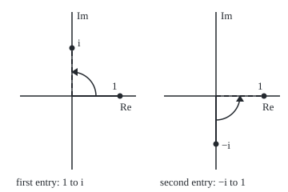

# Complex vectors and matrices: the dot product grows a conjugate, and a rotation's eigenvalues come home

[Syllabus](../../../SYLLABUS.md) → [Complex analysis](../README.md) → [Complex Numbers and the Plane](../README.md#s01) → Complex vectors and matrices

---

## General Overview

A game sprite has a button that turns it a quarter turn anticlockwise. Row by row, that button is the matrix `[[0, -1], [1, 0]]` ([Linear maps](../../03-Algebra/04-Matrices/04-linear-maps-as-matrices.md)). It moves every real arrow, so it has no real eigenvector: no direction it only stretches ([Eigenvalues and eigenvectors](../../03-Algebra/07-Eigenvalues%20and%20Symmetric%20Matrices/02-eigenvalues-and-eigenvectors.md)).

Allow complex entries and two such directions appear. The pair (1, −i) comes back as (i, 1), i times itself; the pair (1, i) comes back as −i times itself. Multiplying by i is a quarter turn of the complex plane: the rotation's eigenvalues are rotations too.

Complex pairs need a new ruler. The pair (1, i) is not zero, yet its old dot product with itself is 1 × 1 + i × i = 0. Conjugate the first copy's entries (a + bi becomes a − bi) and it is 1 × 1 + (−i) × i = 2. That dot product defines **Hermitian** matrices, with real eigenvalues, and **unitary** ones, which keep lengths.

**For complex vectors, conjugate the first vector before the dot product; that gives lengths that cannot vanish, Hermitian matrices with real eigenvalues, and unitary matrices that keep length, like a quarter turn with eigenvalues i and −i.**

**What kind of fact this is:** three definitions (conjugate transpose, Hermitian, unitary); real eigenvalues and kept lengths are theorems proved in Why it works.

### The picture: the quarter turn acts on (1, −i) as multiplication by i

<p align="center"></p>

To scale, 60 units per 1; each panel is a copy of the complex plane. Solid arrows are the entries of (1, −i), dashed ones the entries after the quarter turn: both turned a quarter, so the pair was multiplied by i.

---

## The formula

Notation first, in words. A complex vector is a column of complex numbers. Its **transpose**, $v^T$, is the same entries as a row. Its **conjugate transpose**, $v^*$, read "v-star", is that row with every entry conjugated. For a matrix, $A^T$ swaps rows for columns, and $A^*$ also conjugates every entry.

$$v^* w = \sum_{j=1}^{n} \bar v_j\, w_j, \qquad \lVert v\rVert = \sqrt{v^* v} = \sqrt{\lvert v_1\rvert^2 + \dots + \lvert v_n\rvert^2}$$

**Read it aloud:** conjugate each entry of v, multiply by the matching entry of w, and add; the length of v is the square root of v-star v.

A square matrix $H$ is **Hermitian** when $H^* = H$: flipped across its diagonal and conjugated, it comes back. A square matrix $U$ is **unitary** when $U^* U = I$: its conjugate transpose undoes it. Eigenvalues still mean $A v = \lambda v$ with $v$ not zero.

| Symbol | Plain meaning | In our example | Push it up and the answer… |
| --- | --- | --- | --- |
| $v$, $w$, $x$ | complex columns; $x$ pairs a drone with a beacon | (1, i), (1, −i), (3 + 4i, 1 + 2i) | longer vector |
| $n$, $j$ | how many entries, and which one | n = 2 | more terms added |
| $A$, $B$, $A^*$ | square matrices; a conjugate transpose | — | — |
| $I$ | the identity matrix: changes nothing | `[[1, 0], [0, 1]]` | — |
| $R$ | the sprite's quarter turn | `[[0, -1], [1, 0]]` | a half turn gives −1 twice |
| $H$, $S$ | Hermitian, and a look-alike that is not | `[[2, i], [-i, 2]]`, `[[0, i], [i, 0]]` | — |
| $U$, $Q$ | unitary matrices: they keep lengths | R itself | — |
| $\lambda$, $\mu$, $t$ | eigenvalues; a real trial value | i and −i for R; t from −3 to 3 | — |

### When it holds

- **Definitions hold everywhere;** Hermitian and unitary need square matrices.
- **The first vector is conjugated here.** Many books conjugate the second; lengths and "perpendicular" agree either way.
- **The eigenvector is non-zero.** The zero vector satisfies $A v = \lambda v$ for every $\lambda$.
- **Complex symmetric is not enough.** $S$ equals its plain transpose, yet has eigenvalues i and −i; the real-eigenvalue guarantee comes from Hermitian.

---

## Why it works

### Step 0: conjugating turns each product into a squared distance

Complex squares can cancel: i × i = −1 undoes 1 × 1. A number times its conjugate is its squared distance from 0, never negative ([Conjugate and modulus](02-conjugate-and-modulus.md)). The star builds that into the dot product.

### Step 1: the length is real, and zero only for the zero vector

Each term of $v^* v$ is $\bar v_j v_j = \lvert v_j\rvert^2$. With $v_j = a_j + b_j i$ the sum is $a_1^2 + b_1^2 + \dots + a_n^2 + b_n^2$: the squared length of a real vector with 2n coordinates ([The dot product](../../03-Algebra/06-Dot%20Products%20and%20Best%20Fits/01-dot-product.md)). For v = (1, i) those four coordinates are 1, 0, 0, 1: squared length 2.

Columns are **perpendicular** when $w^* v = 0$: for w = (1, −i) and v = (1, i), 1 × 1 + i × i = 0.

### Step 2: the star moves a matrix across the dot product

Expanding the sums entry by entry gives

$$(A x)^* y = x^* (A^* y)$$

for any columns x and y: the conjugate transpose is the new dot product's partner. Applied twice, it gives $(AB)^* = B^* A^*$.

### Step 3: Hermitian matrices have real eigenvalues

Take $H v = \lambda v$ with v non-zero, so $v^* H v = \lambda\, v^* v$. A single number's star is its conjugate, so by Step 2 the conjugate of $v^* H v$ is $v^* H^* v$, which is $v^* H v$ again: a number equal to its conjugate is real. So $\lambda$ is a real number over the positive real $v^* v$.

### Step 4: unitary matrices keep lengths, and their eigenvalues sit on the unit circle

By Step 2, $(U x)^* (U x) = x^* U^* U x = x^* x$. Pair the shelf's drone at 3 + 4i with a beacon at 1 + 2i: $x^* x$ = 25 + 5 = 30, and $R x$ = (−1 − 2i, 3 + 4i) has squared length 5 + 25 = 30 too.

If $U v = \lambda v$ with v non-zero, lengths give $\lvert\lambda\rvert\,\lVert v\rVert = \lVert v\rVert$, so $\lvert\lambda\rvert = 1$. It lies on the unit circle, not necessarily on the real line.

### Step 5: the quarter turn's eigenvalues come home

$R$ is real, so $R^* = R^T$ = `[[0, 1], [-1, 0]]`, and $R^* R = I$: $R$ is unitary, and by Step 4 its eigenvalues have modulus 1.

An eigenvalue makes the determinant of $R - \lambda I$ zero. Trace 0 and determinant 1 give $\lambda^2 + 1 = 0$, discriminant −4, so $\lambda = \pm i$ ([Powers and roots](05-powers-roots-and-roots-of-unity.md)).

A second road needs no quadratic. Four quarter turns are no turn, $R^4 = I$, so $\lambda^4 = 1$: a fourth root of unity, 1, i, −1 or −i. The top row of $R v = \lambda v$ makes the second entry −λ times the first, so test (1, −λ) for each. Only i and −i pass. For $\lambda = i$ the vector is (1, −i), and $R$(1, −i) = (i, 1) = i(1, −i), as drawn above.

That is the homecoming: the quarter turn keeps two complex directions, and on them it is multiplication by i or −i, itself a quarter turn.

### Step 6: a Hermitian matrix built from the rotation

Since $R^* = -R$, $(-iR)^* = i R^* = -iR$: so $H = 2I - iR$ = `[[2, i], [-i, 2]]` is Hermitian. On an eigenvector of $R$, $H v = 2v - i\lambda v$: same eigenvectors, eigenvalues $2 - i\lambda$: 2 − i × i = 3 and 2 − i × (−i) = 1. Both are real, as Step 3 promised; trace 4 and determinant 3 give the same pair by the quadratic formula.

<details>
<summary>Detailed proof: the star rule, perpendicular eigenvectors, and the complex spectral theorem</summary>

**The star rule.** Entry k of $A x$ is $\sum_j A_{kj} x_j$, so $(A x)^* y = \sum_j \bar x_j \bigl(\sum_k \bar A_{kj}\, y_k\bigr)$. The bracket is entry j of $A^* y$, since row j, column k of $A^*$ is $\bar A_{kj}$. Applying the rule to $A B$ at once, then to each factor, gives $(AB)^* = B^* A^*$.

**Perpendicular eigenvectors.** Let $H v = \lambda v$ and $H w = \mu w$ with $\lambda \ne \mu$, both real by Step 3. Then $\mu\, w^* v = (H w)^* v = w^* H v = \lambda\, w^* v$, so $w^* v = 0$, as for (1, −i) and (1, i).

**The complex spectral theorem, stated.** Every Hermitian matrix is $Q$ times a real diagonal matrix times $Q^*$, with $Q$ unitary: its columns are perpendicular unit eigenvectors. The proof on [The spectral theorem](../../03-Algebra/07-Eigenvalues%20and%20Symmetric%20Matrices/04-spectral-theorem.md) carries over with every transpose starred; the general version is on Adjoints.

</details>

A third road to H's eigenvalues is Step 3's ratio $v^* H v / v^* v$: 3 on (1, −i), 1 on (1, i).

---

## Worked numbers, by hand

| Step | Arithmetic | Value |
| --- | --- | --- |
| plain square of v = (1, i) | 1 × 1 + i × i | 0 |
| conjugated square | 1 × 1 + (−i) × i | **2** |
| eigenvalue equation for R | trace 0, determinant 1: λ^2 + 1 = 0 | λ = i or −i |
| R on w = (1, −i) | (0 × 1 − 1 × (−i), 1 × 1 + 0) | (i, 1) = **i w** |
| H = 2I − iR on the same vectors | 2 − iλ | **3 and 1** |
| drone pair before and after R | 25 + 5 and 5 + 25 | 30 both: length 5.477226 |

The quarter turn keeps the drone pair's length, and on (1, −i) it is multiplication by i.

### What breaks if you drop a piece

| Mistake | Comes out at | What went wrong |
| --- | --- | --- |
| Transpose for the length of v | 0, not 2 | i × i cancels 1 × 1 |
| Transpose to test perpendicular | w^T v = 2, not 0 | H's eigenvectors wrongly look non-perpendicular |
| Symmetric taken as Hermitian | S has eigenvalues i and −i | $S^T = S$ but $S^* \ne S$ |
| Hunting a real eigenvalue of R | det(R − tI) never below 1 | t^2 + 1 has no real root |

---

## Code, from first principles, and it actually runs

R's eigenvalues come by two roads: the quadratic formula with a hand-built complex square root, and a test of the fourth roots of unity. H's come by three: the quadratic, 2 − iλ, and v* H v / v* v. The length of v comes as v* v and as four real squares.

### Python

```python
# Complex vectors and matrices -- the check behind the card.  Standard library only.
# Quarter turn R = [[0, -1], [1, 0]], v = (1, i), w = (1, -i), H = [[2, i], [-i, 2]],
# drone pair x = (3 + 4i, 1 + 2i).  Eigenvalues by the quadratic formula and by test.
import math
def fmt(z):
    re, im = z.real + 0.0, z.imag + 0.0
    return f"{re:.6f} {'-' if im < 0 else '+'} {abs(im):.6f}i"
def star(a): return [[a[j][i].conjugate() for j in range(2)] for i in range(2)]   # conjugate transpose
def mv(a, x): return [a[0][0] * x[0] + a[0][1] * x[1], a[1][0] * x[0] + a[1][1] * x[1]]
def mm(a, b): return [[a[i][0] * b[0][j] + a[i][1] * b[1][j] for j in range(2)] for i in range(2)]
def dot_t(x, y): return x[0] * y[0] + x[1] * y[1]                               # transpose: no flip
def dot_c(x, y): return x[0].conjugate() * y[0] + x[1].conjugate() * y[1]       # x* y
def same(a, b): return max(abs(a[i][j] - b[i][j]) for i in range(2) for j in range(2)) < 1e-12
def pair(x): return f"({fmt(x[0])}, {fmt(x[1])})"
def csqrt(z):                                   # square root of a complex number, from its modulus
    r = abs(z)
    return complex(math.sqrt((r + z.real) / 2), math.copysign(math.sqrt((r - z.real) / 2), z.imag))
def eig(a):                                     # road one: roots of t^2 - trace t + det = 0
    tr, det = a[0][0] + a[1][1], a[0][0] * a[1][1] - a[0][1] * a[1][0]
    s = csqrt(tr * tr - 4 * det)
    return tr, det, tr * tr - 4 * det, [(tr + s) / 2, (tr - s) / 2]

I2 = [[1 + 0j, 0j], [0j, 1 + 0j]]
R, H, S = [[0j, -1 + 0j], [1 + 0j, 0j]], [[2 + 0j, 1j], [-1j, 2 + 0j]], [[0j, 1j], [1j, 0j]]
v, w, x = [1 + 0j, 1j], [1 + 0j, -1j], [3 + 4j, 1 + 2j]
trR, detR, discR, lamR = eig(R)
R4 = mm(mm(R, R), mm(R, R))                     # road two: four quarter turns are no turn, so lam^4 = 1
passes = [l for l in (1, 1j, -1, -1j) if max(abs(p - l * q) for p, q in zip(mv(R, [1, -l]), [1, -l])) < 1e-12]
trH, detH, discH, lamH = eig(H)
viaR = [2 - 1j * l for l in lamR]               # H = 2I - iR, so H's eigenvalues are 2 - i lam
ray = [dot_c(u, mv(H, u)) / dot_c(u, u) for u in (w, v)]
Rw, Rx = mv(R, w), mv(R, x)
sq4 = sum(c * c for z in v for c in (z.real, z.imag))
px = lambda o, z: f"({o + 60 * z.real:.0f}, {120 - 60 * z.imag:.0f})"
print(f"figure, 60 px per unit; left origin (90, 120): w1 {px(90, w[0])}, (Rw)1 {px(90, Rw[0])}; right origin (270, 120): w2 {px(270, w[1])}, (Rw)2 {px(270, Rw[1])}")
print(f"v = (1, i): v^T v = {fmt(dot_t(v, v))}; v* v = {fmt(dot_c(v, v))}; four real squares = {sq4:.6f}")
print(f"R: trace {fmt(trR)}, determinant {fmt(detR)}, discriminant {fmt(discR)}")
print(f"eigenvalues of R, quadratic formula: {fmt(lamR[0])} and {fmt(lamR[1])}")
print(f"R four times = I: {'yes' if same(R4, I2) else 'no'}; fourth roots passing R(1, -lam) = lam(1, -lam): {', '.join(fmt(complex(l)) for l in passes)}")
print(f"R w = {pair(Rw)}; i w = {pair([1j * c for c in w])}")
print(f"R v = {pair(mv(R, v))}; -i v = {pair([-1j * c for c in v])}")
print(f"w* v = {fmt(dot_c(w, v))}; w^T v = {fmt(dot_t(w, v))}")
print(f"H* = H: {'yes' if same(star(H), H) else 'no'}; H = 2I - iR: {'yes' if same(H, [[2 * I2[i][j] - 1j * R[i][j] for j in range(2)] for i in range(2)]) else 'no'}")
print(f"H: trace {fmt(trH)}, determinant {fmt(detH)}, discriminant {fmt(discH)}")
print(f"eigenvalues of H, quadratic formula: {fmt(lamH[0])} and {fmt(lamH[1])}")
print(f"eigenvalues of H as 2 - i lam: {fmt(viaR[0])} and {fmt(viaR[1])}; w* H w / w* w = {fmt(ray[0])}; v* H v / v* v = {fmt(ray[1])}")
print(f"R* R = I: {'yes' if same(mm(star(R), R), I2) else 'no'}; R* = R: {'yes' if same(star(R), R) else 'no'}")
print(f"drone pair x = {pair(x)}: x* x = {dot_c(x, x).real:.6f}, |x| = {math.sqrt(dot_c(x, x).real):.6f}; R x = {pair(Rx)}, |R x| = {math.sqrt(dot_c(Rx, Rx).real):.6f}")
print(f"mistake 1, transpose for the length of v: {fmt(dot_t(v, v))}, not {fmt(dot_c(v, v))}")
print(f"mistake 2, transpose for perpendicular: w^T v = {fmt(dot_t(w, v))}, not {fmt(dot_c(w, v))}")
print(f"mistake 3, S = [[0, i], [i, 0]] with S^T = S: S* = S {'yes' if same(star(S), S) else 'no'}; eigenvalues {fmt(eig(S)[3][0])} and {fmt(eig(S)[3][1])}")
print(f"mistake 4, a real eigenvalue for R: det(R - tI) over t from -3 to 3 never drops below {min(eig([[R[0][0] - t / 1000, R[0][1]], [R[1][0], R[1][1] - t / 1000]])[1].real for t in range(-3000, 3001)):.6f}")
assert sorted(passes, key=lambda z: complex(z).imag) == sorted(lamR, key=lambda z: z.imag)   # two roads to +-i
assert max(abs(a - b) for a, b in zip(lamH + lamH, viaR + ray)) < 1e-12        # three roads to 3 and 1
assert abs(dot_c(v, v) - sq4) < 1e-12                                           # length of v, two roads
assert abs(dot_c(Rx, Rx) - dot_c(x, x)) < 1e-12                                 # R keeps the drone pair's length
print("ALL CHECKS PASS")
```

**Ran 2026-09-27 on macOS, Python 3.14.6, standard library only. All checks passed. Output, pasted from the run:**

```
figure, 60 px per unit; left origin (90, 120): w1 (150, 120), (Rw)1 (90, 60); right origin (270, 120): w2 (270, 180), (Rw)2 (330, 120)
v = (1, i): v^T v = 0.000000 + 0.000000i; v* v = 2.000000 + 0.000000i; four real squares = 2.000000
R: trace 0.000000 + 0.000000i, determinant 1.000000 + 0.000000i, discriminant -4.000000 + 0.000000i
eigenvalues of R, quadratic formula: 0.000000 + 1.000000i and 0.000000 - 1.000000i
R four times = I: yes; fourth roots passing R(1, -lam) = lam(1, -lam): 0.000000 + 1.000000i, 0.000000 - 1.000000i
R w = (0.000000 + 1.000000i, 1.000000 + 0.000000i); i w = (0.000000 + 1.000000i, 1.000000 + 0.000000i)
R v = (0.000000 - 1.000000i, 1.000000 + 0.000000i); -i v = (0.000000 - 1.000000i, 1.000000 + 0.000000i)
w* v = 0.000000 + 0.000000i; w^T v = 2.000000 + 0.000000i
H* = H: yes; H = 2I - iR: yes
H: trace 4.000000 + 0.000000i, determinant 3.000000 + 0.000000i, discriminant 4.000000 + 0.000000i
eigenvalues of H, quadratic formula: 3.000000 + 0.000000i and 1.000000 + 0.000000i
eigenvalues of H as 2 - i lam: 3.000000 + 0.000000i and 1.000000 + 0.000000i; w* H w / w* w = 3.000000 + 0.000000i; v* H v / v* v = 1.000000 + 0.000000i
R* R = I: yes; R* = R: no
drone pair x = (3.000000 + 4.000000i, 1.000000 + 2.000000i): x* x = 30.000000, |x| = 5.477226; R x = (-1.000000 - 2.000000i, 3.000000 + 4.000000i), |R x| = 5.477226
mistake 1, transpose for the length of v: 0.000000 + 0.000000i, not 2.000000 + 0.000000i
mistake 2, transpose for perpendicular: w^T v = 2.000000 + 0.000000i, not 0.000000 + 0.000000i
mistake 3, S = [[0, i], [i, 0]] with S^T = S: S* = S no; eigenvalues 0.000000 + 1.000000i and 0.000000 - 1.000000i
mistake 4, a real eigenvalue for R: det(R - tI) over t from -3 to 3 never drops below 1.000000
ALL CHECKS PASS
```

### Rust

Same numbers, same labels, built with `rustc --edition 2021 -O`.

```rust
// Complex vectors and matrices -- the same check as the Python, in Rust.  No crates.
// Quarter turn R = [[0, -1], [1, 0]], v = (1, i), w = (1, -i), H = [[2, i], [-i, 2]],
// drone pair x = (3 + 4i, 1 + 2i).  Eigenvalues by the quadratic formula and by test.
use std::ops::{Add, Div, Mul, Sub};
#[derive(Clone, Copy, PartialEq)]
struct C { re: f64, im: f64 }
fn c(re: f64, im: f64) -> C { C { re, im } }
impl Add for C { type Output = C; fn add(self, o: C) -> C { c(self.re + o.re, self.im + o.im) } }
impl Sub for C { type Output = C; fn sub(self, o: C) -> C { c(self.re - o.re, self.im - o.im) } }
impl Mul for C { type Output = C; fn mul(self, o: C) -> C { c(self.re * o.re - self.im * o.im, self.re * o.im + self.im * o.re) } }
impl Div for C { type Output = C; fn div(self, o: C) -> C { let d = o.re * o.re + o.im * o.im; let t = self * o.conj(); c(t.re / d, t.im / d) } }
impl C { fn conj(self) -> C { c(self.re, -self.im) } fn abs(self) -> f64 { self.re.hypot(self.im) } }
type M = [[C; 2]; 2];
fn fmt(z: C) -> String { let (re, im) = (z.re + 0.0, z.im + 0.0); format!("{:.6} {} {:.6}i", re, if im < 0.0 { "-" } else { "+" }, im.abs()) }
fn star(a: M) -> M { [[a[0][0].conj(), a[1][0].conj()], [a[0][1].conj(), a[1][1].conj()]] }   // conjugate transpose
fn mv(a: M, x: [C; 2]) -> [C; 2] { [a[0][0] * x[0] + a[0][1] * x[1], a[1][0] * x[0] + a[1][1] * x[1]] }
fn mm(a: M, b: M) -> M { let mut o = a; for i in 0..2 { for j in 0..2 { o[i][j] = a[i][0] * b[0][j] + a[i][1] * b[1][j]; } } o }
fn dot_t(x: [C; 2], y: [C; 2]) -> C { x[0] * y[0] + x[1] * y[1] }                   // transpose: no flip
fn dot_c(x: [C; 2], y: [C; 2]) -> C { x[0].conj() * y[0] + x[1].conj() * y[1] }     // x* y
fn same(a: M, b: M) -> bool { (0..4).all(|k| (a[k / 2][k % 2] - b[k / 2][k % 2]).abs() < 1e-12) }
fn yn(b: bool) -> &'static str { if b { "yes" } else { "no" } }
fn pair(x: [C; 2]) -> String { format!("({}, {})", fmt(x[0]), fmt(x[1])) }
fn csqrt(z: C) -> C { let r = z.abs(); c(((r + z.re) / 2.0).sqrt(), ((r - z.re) / 2.0).sqrt().copysign(z.im)) }
fn eig(a: M) -> (C, C, C, [C; 2]) {              // road one: roots of t^2 - trace t + det = 0
    let (tr, det) = (a[0][0] + a[1][1], a[0][0] * a[1][1] - a[0][1] * a[1][0]);
    let disc = tr * tr - c(4.0, 0.0) * det;
    let (s, h) = (csqrt(disc), c(2.0, 0.0));
    (tr, det, disc, [(tr + s) / h, (tr - s) / h])
}
fn main() {
    let (o, z, i) = (c(1.0, 0.0), c(0.0, 0.0), c(0.0, 1.0));
    let (mi, mo) = (c(0.0, -1.0), c(-1.0, 0.0));
    let i2: M = [[o, z], [z, o]];
    let (r, h, s): (M, M, M) = ([[z, mo], [o, z]], [[c(2.0, 0.0), i], [mi, c(2.0, 0.0)]], [[z, i], [i, z]]);
    let (v, w, x) = ([o, i], [o, mi], [c(3.0, 4.0), c(1.0, 2.0)]);
    let (tr_r, det_r, disc_r, lam_r) = eig(r);
    let r4 = mm(mm(r, r), mm(r, r));             // road two: four quarter turns are no turn, so lam^4 = 1
    let passes: Vec<C> = [o, i, mo, mi].into_iter().filter(|&l| {
        let q = [o, z - l]; let p = mv(r, q);
        (p[0] - l * q[0]).abs().max((p[1] - l * q[1]).abs()) < 1e-12 }).collect();
    let (tr_h, det_h, disc_h, lam_h) = eig(h);
    let via_r: Vec<C> = lam_r.iter().map(|&l| c(2.0, 0.0) - i * l).collect();   // H = 2I - iR
    let ray: Vec<C> = [w, v].iter().map(|&u| dot_c(u, mv(h, u)) / dot_c(u, u)).collect();
    let (rw, rx) = (mv(r, w), mv(r, x));
    let sq4: f64 = v.iter().map(|q| q.re * q.re + q.im * q.im).sum();
    let px = |o: f64, q: C| format!("({:.0}, {:.0})", o + 60.0 * q.re, 120.0 - 60.0 * q.im);
    let h2: M = [[c(2.0, 0.0) - i * r[0][0], z - i * r[0][1]], [z - i * r[1][0], c(2.0, 0.0) - i * r[1][1]]];
    let lam_s = eig(s).3;
    let low = (-3000..=3000).map(|t| { let t = c(t as f64 / 1000.0, 0.0);
        eig([[r[0][0] - t, r[0][1]], [r[1][0], r[1][1] - t]]).1.re }).fold(f64::INFINITY, f64::min);
    println!("figure, 60 px per unit; left origin (90, 120): w1 {}, (Rw)1 {}; right origin (270, 120): w2 {}, (Rw)2 {}", px(90.0, w[0]), px(90.0, rw[0]), px(270.0, w[1]), px(270.0, rw[1]));
    println!("v = (1, i): v^T v = {}; v* v = {}; four real squares = {:.6}", fmt(dot_t(v, v)), fmt(dot_c(v, v)), sq4);
    println!("R: trace {}, determinant {}, discriminant {}", fmt(tr_r), fmt(det_r), fmt(disc_r));
    println!("eigenvalues of R, quadratic formula: {} and {}", fmt(lam_r[0]), fmt(lam_r[1]));
    println!("R four times = I: {}; fourth roots passing R(1, -lam) = lam(1, -lam): {}", yn(same(r4, i2)), passes.iter().map(|&l| fmt(l)).collect::<Vec<_>>().join(", "));
    println!("R w = {}; i w = {}", pair(rw), pair([i * w[0], i * w[1]]));
    println!("R v = {}; -i v = {}", pair(mv(r, v)), pair([mi * v[0], mi * v[1]]));
    println!("w* v = {}; w^T v = {}", fmt(dot_c(w, v)), fmt(dot_t(w, v)));
    println!("H* = H: {}; H = 2I - iR: {}", yn(same(star(h), h)), yn(same(h, h2)));
    println!("H: trace {}, determinant {}, discriminant {}", fmt(tr_h), fmt(det_h), fmt(disc_h));
    println!("eigenvalues of H, quadratic formula: {} and {}", fmt(lam_h[0]), fmt(lam_h[1]));
    println!("eigenvalues of H as 2 - i lam: {} and {}; w* H w / w* w = {}; v* H v / v* v = {}", fmt(via_r[0]), fmt(via_r[1]), fmt(ray[0]), fmt(ray[1]));
    println!("R* R = I: {}; R* = R: {}", yn(same(mm(star(r), r), i2)), yn(same(star(r), r)));
    println!("drone pair x = {}: x* x = {:.6}, |x| = {:.6}; R x = {}, |R x| = {:.6}", pair(x), dot_c(x, x).re, dot_c(x, x).re.sqrt(), pair(rx), dot_c(rx, rx).re.sqrt());
    println!("mistake 1, transpose for the length of v: {}, not {}", fmt(dot_t(v, v)), fmt(dot_c(v, v)));
    println!("mistake 2, transpose for perpendicular: w^T v = {}, not {}", fmt(dot_t(w, v)), fmt(dot_c(w, v)));
    println!("mistake 3, S = [[0, i], [i, 0]] with S^T = S: S* = S {}; eigenvalues {} and {}", yn(same(star(s), s)), fmt(lam_s[0]), fmt(lam_s[1]));
    println!("mistake 4, a real eigenvalue for R: det(R - tI) over t from -3 to 3 never drops below {:.6}", low);
    assert!(passes.len() == 2 && (0..2).all(|k| (passes[k] - lam_r[k]).abs() < 1e-12));   // two roads to +-i
    assert!((0..2).all(|k| (lam_h[k] - via_r[k]).abs() < 1e-12 && (lam_h[k] - ray[k]).abs() < 1e-12));
    assert!((dot_c(v, v).re - sq4).abs() < 1e-12);                                // length of v, two roads
    assert!((dot_c(rx, rx) - dot_c(x, x)).abs() < 1e-12);                          // R keeps the drone pair's length
    println!("ALL CHECKS PASS");
}
```

**Ran 2026-09-27 on macOS, rustc 1.98.1, no crates. All checks passed. Output, pasted from the run:**

```
figure, 60 px per unit; left origin (90, 120): w1 (150, 120), (Rw)1 (90, 60); right origin (270, 120): w2 (270, 180), (Rw)2 (330, 120)
v = (1, i): v^T v = 0.000000 + 0.000000i; v* v = 2.000000 + 0.000000i; four real squares = 2.000000
R: trace 0.000000 + 0.000000i, determinant 1.000000 + 0.000000i, discriminant -4.000000 + 0.000000i
eigenvalues of R, quadratic formula: 0.000000 + 1.000000i and 0.000000 - 1.000000i
R four times = I: yes; fourth roots passing R(1, -lam) = lam(1, -lam): 0.000000 + 1.000000i, 0.000000 - 1.000000i
R w = (0.000000 + 1.000000i, 1.000000 + 0.000000i); i w = (0.000000 + 1.000000i, 1.000000 + 0.000000i)
R v = (0.000000 - 1.000000i, 1.000000 + 0.000000i); -i v = (0.000000 - 1.000000i, 1.000000 + 0.000000i)
w* v = 0.000000 + 0.000000i; w^T v = 2.000000 + 0.000000i
H* = H: yes; H = 2I - iR: yes
H: trace 4.000000 + 0.000000i, determinant 3.000000 + 0.000000i, discriminant 4.000000 + 0.000000i
eigenvalues of H, quadratic formula: 3.000000 + 0.000000i and 1.000000 + 0.000000i
eigenvalues of H as 2 - i lam: 3.000000 + 0.000000i and 1.000000 + 0.000000i; w* H w / w* w = 3.000000 + 0.000000i; v* H v / v* v = 1.000000 + 0.000000i
R* R = I: yes; R* = R: no
drone pair x = (3.000000 + 4.000000i, 1.000000 + 2.000000i): x* x = 30.000000, |x| = 5.477226; R x = (-1.000000 - 2.000000i, 3.000000 + 4.000000i), |R x| = 5.477226
mistake 1, transpose for the length of v: 0.000000 + 0.000000i, not 2.000000 + 0.000000i
mistake 2, transpose for perpendicular: w^T v = 2.000000 + 0.000000i, not 0.000000 + 0.000000i
mistake 3, S = [[0, i], [i, 0]] with S^T = S: S* = S no; eigenvalues 0.000000 + 1.000000i and 0.000000 - 1.000000i
mistake 4, a real eigenvalue for R: det(R - tI) over t from -3 to 3 never drops below 1.000000
ALL CHECKS PASS
```

The two outputs match line for line.

> [!TIP]
> **Try changing**
> Guess first, then run it.
> - **A half turn.** Set `R` to `[[-1 + 0j, 0j], [0j, -1 + 0j]]`. The quadratic gives −1 twice, the test finds −1 once, and the first assert stops the run.
> - **Drop the conjugate.** Make `dot_c` skip `.conjugate()`. Dividing by w^T w = 0 stops Python.
> - **Another drone pair.** Set `x` to `[5 - 1j, 2j]`. Squared length 25 + 1 + 4 = 30 again: both lengths print 5.477226.

---

## The usual mistake

> [!warning]
> **Carrying the real dot product over unchanged.** For real vectors the two transposes agree, so the habit is never tested. For v = (1, i) the plain square is 0: a non-zero vector with no length. Every result on this card rests on the conjugate.
>
> - **Complex symmetric is not Hermitian.** $S$ = `[[0, i], [i, 0]]` equals its transpose, yet its eigenvalues are i and −i.
> - **Unitary eigenvalues need not be real.** R is unitary with eigenvalues ±i; unitary promises modulus 1.

---

## Where you meet it in real life

- **Quantum computing.** A qubit's state is a complex vector of length 1; its gates are unitary, so probabilities keep adding to 1 (Qubits).
- **Measurement in physics.** Measurable quantities are Hermitian matrices, so their readings, the eigenvalues, are real (States as vectors).
- **Signals and audio.** The scaled discrete Fourier transform is unitary, so a signal's energy is unchanged ([The discrete Fourier transform](../08-Transforms%20in%20Outline/02-discrete-fourier-transform.md)).

> **Say it back**
> A complex column is measured by v-star v: conjugate the first copy, multiply and add. Every non-zero vector then has a positive length, where the plain square of (1, i) is 0. A Hermitian matrix equals its conjugate transpose and has real eigenvalues. A unitary matrix is undone by its conjugate transpose and keeps lengths. The sprite's quarter turn is unitary, with eigenvalues i and −i on (1, −i) and (1, i).

---

## What this builds on

- [Conjugate and modulus](02-conjugate-and-modulus.md): z times z-bar is a squared distance.
- [Powers and roots](05-powers-roots-and-roots-of-unity.md): the fourth roots of unity.
- [Eigenvalues and eigenvectors](../../03-Algebra/07-Eigenvalues%20and%20Symmetric%20Matrices/02-eigenvalues-and-eigenvectors.md): the trace-and-determinant quadratic.
- [The spectral theorem](../../03-Algebra/07-Eigenvalues%20and%20Symmetric%20Matrices/04-spectral-theorem.md): the real case Hermitian matrices extend.
- [The dot product](../../03-Algebra/06-Dot%20Products%20and%20Best%20Fits/01-dot-product.md): the dot product the conjugate repairs.

## Where this goes next

- [The discrete Fourier transform](../08-Transforms%20in%20Outline/02-discrete-fourier-transform.md): a unitary matrix of roots of unity.
- States as vectors: Hermitian measurements, unitary time steps.
- Adjoints: the star in infinitely many coordinates.
- C-star algebras: the star turned into an axiom.
- Qubits: unit complex vectors as quantum states.

---

## Sources

Verified 28 Sep 2026: each page below names the cited work.

- Strang, Gilbert. "Lecture 26: Complex matrices; fast Fourier transform." MIT OpenCourseWare 18.06, Spring 2010. [Lecture page](https://ocw.mit.edu/courses/18-06-linear-algebra-spring-2010/resources/lecture-26-complex-matrices-fast-fourier-transform/). The (1, i) length problem.
- Strang, Gilbert. *Introduction to Linear Algebra*, 6th ed. Wellesley-Cambridge Press, 2023. [Book page](https://math.mit.edu/~gs/linearalgebra/ila6/indexila6.html). Complex vectors, Hermitian and unitary matrices.
- Axler, Sheldon. *Linear Algebra Done Right*, 4th ed. Springer, open access. [Book page](https://linear.axler.net/). Adjoints and the complex spectral theorem, proved.
- Horn, Roger A., and Charles R. Johnson. *Matrix Analysis*. Cambridge University Press. [Publisher page](https://www.cambridge.org/core/books/matrix-analysis/9CF2CB491C9E97948B15FAD835EF9A8B). The standard reference for both families.
