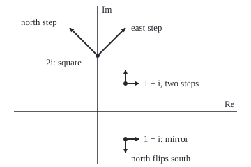

# The complex derivative: one limit from every direction, and the Cauchy-Riemann equations that make it possible

[Syllabus](../../../SYLLABUS.md) → [Complex analysis](../../../SYLLABUS.md#w07) → [Holomorphic Functions](../../../SYLLABUS.md#w07-s02) → The complex derivative

---

## General Overview

A photo-editing filter moves every pixel somewhere new. Lay the photo on the complex plane and a filter sends each point to another. The square filter sends each point to its square: the pixel at 1 + i lands at 2i. The mirror filter flips the photo top to bottom, sending 1 + i to 1 − i. From here on a filter is called a complex function.

Near 1 + i the square filter turns every tiny patch 45 degrees and enlarges it 2.828427 times. Turn-and-stretch is multiplication by one complex number, here 2 + 2i: the square filter's **complex derivative** at 1 + i.

A flip is no turn-and-stretch. A step east stays east, a quotient of 1; a step north turns south, a quotient of −1. So the mirror has no complex derivative.

**A complex derivative exists when the difference quotient settles on one number from every direction; that forces the Cauchy-Riemann equations, and those equations with continuous partial derivatives guarantee it.**

**What kind of fact this is:** a theorem, proved on this card in Why it works; the complex derivative and the word holomorphic are definitions.

### The picture: small steps through two filters

<p align="center"></p>

To scale: 40 units per 1, 0 at (140, 160). Steps of 0.5 leave 1 + i at (180, 120). The square filter's arrows from 2i are 2 + 2i times each step, ending at (180, 40) and (100, 40); the mirror's, from 1 − i, end at (200, 200) and (180, 220).

---

## The formula

A function $f$ takes a complex number $z$ to a complex number. Its **complex derivative** at a point $z_0$, written $f'(z_0)$ and read "f-prime of z-nought", is a limit over a complex step $h$:

$$f'(z_0) = \lim_{h \to 0} \frac{f(z_0 + h) - f(z_0)}{h}$$

**Read it aloud:** change over step, with one answer however h shrinks to 0.

Write $z = x + iy$ and split the output into real part $u$ and imaginary part $v$, each a real function of $x$ and $y$. A subscript names a partial derivative: $u_x$ is the rate $u$ changes as $x$ alone moves ([Partial derivatives](../../06-Calculus%20and%20analysis/07-Several%20Variables/01-partial-derivatives.md)). The **Cauchy-Riemann equations** are

$$u_x = v_y, \qquad u_y = -v_x, \qquad f'(z_0) = u_x + i\,v_x$$

**Read it aloud:** u grows eastward as v grows northward, and grows northward as v shrinks eastward.

Conversely, if the partial derivatives of $u$ and $v$ are continuous near $z_0$ and satisfy the equations at $z_0$, then $f'(z_0)$ exists.

A function is **holomorphic** on an open region, one where every point has a small disc round it still inside, when it has a complex derivative at every point of the region ([Limits and regions in the plane](../01-Complex%20Numbers%20and%20the%20Plane/06-complex-limits-series-and-regions.md)).

| Symbol | Plain meaning | In our example | Push it up and the answer… |
| --- | --- | --- | --- |
| $f$, $z$ | a complex function; the point it acts on | square, mirror, $\lvert z\rvert^2$, $\sqrt{\lvert xy\rvert}$ | — |
| $z_0$ | the point being tested | 1 + i, and 0 | — |
| $h$, $t$, $\theta$, $a$, $b$ | the step: length t, direction θ; h = a + ib | t = 0.1 to 0.001; θ = 0, 45, 90 degrees | the square's quotient drifts by h |
| $x$, $y$, $u$, $v$ | real and imaginary parts of input and output | x = 1, y = 1; u = x^2 − y^2, v = 2xy | — |
| $u_x$, $u_y$, $v_x$, $v_y$ | partial derivatives: each part's rate east and north | 2, −2, 2, 2 at 1 + i | — |
| $f'(z_0)$ | the complex derivative | 2 + 2i: stretch 2.828427, turn 45 degrees | — |
| $\bar z$, $\lvert z\rvert$ | the conjugate, read "z-bar" (the mirror); the length | mirror of 1 + i is 1 − i | — |
| $\varepsilon$, $\delta$ | a tolerance and a step size that meets it | Detailed proof | — |

### When it holds

- **Every direction, not two.** $\sqrt{\lvert xy\rvert}$ agrees east and north at 0, then gives 0.5 − 0.5i along 45 degrees.
- **Continuous partials for the converse.** Without them the equations at a point do not suffice: see Step 5.
- **An open region for holomorphic.** $\lvert z\rvert^2$ has a derivative at 0 alone; a point holds no disc, so it is holomorphic nowhere.
- **The minus sign.** Written $u_y = v_x$, the test rejects the square filter: −2 against 2.

---

## Why it works

### Step 0: a derivative is one multiplier

A real derivative is the number that, times a small step, gives the change ([The derivative](../../06-Calculus%20and%20analysis/02-Derivatives/01-the-derivative.md)). In the plane, multiplying turns and stretches. So a complex derivative asks the function to treat every small step round $z_0$ with one turn-and-stretch, and the quotient must settle on one number from every direction.

### Step 1: the eastward direction gives u_x + i v_x

Take $h = t$, a small real number. The quotient is

$$\frac{u(x+t, y) - u(x, y)}{t} + i\,\frac{v(x+t, y) - v(x, y)}{t} \;\longrightarrow\; u_x + i\,v_x$$

Each piece is a real difference quotient in $x$ alone, so each tends to a partial derivative.

### Step 2: the northward direction gives v_y − i u_y

Take $h = it$, and write $\Delta u$, $\Delta v$ for the changes in u and v as y moves by t. Dividing by i is multiplying by −i, since i × (−i) = 1. So

$$\frac{\Delta u + i\,\Delta v}{it} = -i\,\frac{\Delta u}{t} + \frac{\Delta v}{t} \;\longrightarrow\; v_y - i\,u_y$$

The equations' minus sign comes from this 1/i.

### Step 3: equal answers give two equations

If $f'(z_0)$ exists, both directions give it. Equal complex numbers have equal real parts and equal imaginary parts:

- real parts: $u_x = v_y$;
- imaginary parts: $v_x = -u_y$.

That proves the necessary half, and gives $f'(z_0) = u_x + i\,v_x$ from partials alone.

### Step 4: three filters put to the test

**The square** passes everywhere: $u_x = 2x = v_y$ and $u_y = -2y = -v_x$. Directly, $(z_0 + h)^2 - z_0^2 = 2z_0h + h^2$, so the quotient is $2z_0 + h$, missing $2z_0$ by the step itself.

**The mirror** fails everywhere: $u = x$, $v = -y$, so $u_x = 1$, $v_y = -1$. With $h = t e^{i\theta}$ its quotient is $\bar h / h = e^{-2i\theta}$: 1, −i, −1 at 0, 45, 90 degrees, at every step length.

**The size squared**, $x^2 + y^2$, has $u_x = 2x$, $u_y = 2y$, $v_x = v_y = 0$: the equations hold at 0 alone. There the quotient $\lvert h\rvert^2/h = \bar h$ shrinks to 0.

### Step 5: with continuous partials, the equations suffice

Write $h = a + ib$. With continuous partials, each part is close to its tangent plane for small steps:

$$\Delta u \approx u_x a + u_y b, \qquad \Delta v \approx v_x a + v_y b$$

Swap in $u_y = -v_x$ and $v_y = u_x$: $\Delta u + i\,\Delta v \approx (u_x + i\,v_x)(a + ib)$. The change is one number times the step, so the quotient tends to $u_x + i\,v_x$ from every direction.

Without continuity this fails. $\sqrt{\lvert xy\rvert}$ is 0 on both axes, so its partials at 0 are all 0. On the diagonal $h = s(1 + i)$, s > 0, it equals s, and the quotient is $1/(1 + i) = 0.5 - 0.5i$.

<details>
<summary>Detailed proof: the converse, with tolerances</summary>

Take a tolerance $\varepsilon > 0$ and $\delta > 0$ so all four partials stay within $\varepsilon$ of their values at $z_0$ on the disc of radius $\delta$. For $\lvert h\rvert < \delta$, split the change in u into an eastward move, then a northward one; the mean value theorem makes them $a$ times $u_x$ and $b$ times $u_y$, each taken at a point within $\delta$. So $\Delta u = u_x a + u_y b + E_1$ with $\lvert E_1\rvert \le 2\varepsilon\lvert h\rvert$; likewise $\Delta v = v_x a + v_y b + E_2$.

With the equations at $z_0$, $\Delta u + i\Delta v = (u_x + i v_x)h + E_1 + iE_2$, so
$\lvert (f(z_0 + h) - f(z_0))/h - (u_x + i v_x)\rvert \le 4\varepsilon$.
The tolerance was arbitrary, so the limit is $u_x + i v_x$.

</details>

### Step 6: holomorphic means a derivative on an open region

Every disc round 0 holds points where $\lvert z\rvert^2$ has no derivative. Holomorphic asks for a derivative throughout an open region: the square filter is holomorphic on the whole plane, the mirror and $\lvert z\rvert^2$ on no region.

An alternative route reads the equations as geometry, angles kept, on [Conformal maps](../07-Conformal%20Maps%20and%20Harmonic%20Functions/01-conformal-maps.md).

---

## Worked numbers, by hand

The square filter at 1 + i.

| Step | Arithmetic | Value |
| --- | --- | --- |
| Where the pixel lands | (1 + i)^2 = 1 + 2i + i^2 | 0 + 2i |
| Real and imaginary parts | u = x^2 − y^2, v = 2xy at x = 1, y = 1 | u = 0, v = 2 |
| Eastward rates | u_x = 2x, v_x = 2y | 2, 2 |
| Northward rates | u_y = −2y, v_y = 2x | −2, 2 |
| Cauchy-Riemann | u_x = v_y: 2 = 2; u_y = −v_x: −2 = −2 | both hold |
| The derivative | u_x + i v_x | **2 + 2i** |
| Stretch | √(2^2 + 2^2) | 2.828427 |
| Turn | atan2(2, 2) | 0.785398 rad = 45 degrees |

Near 1 + i the square filter enlarges every small patch 2.828427 times and turns it 45 degrees anticlockwise, without shearing.

### What breaks if you drop a piece

| Mistake | Comes out at | What went wrong |
| --- | --- | --- |
| Testing the mirror eastward only | derivative 1 | northward gives −1, and 45 degrees gives −i |
| Sign slip, $u_y = v_x$ | rejects the square: −2 against 2 | the minus comes from dividing by i |
| $\lvert z\rvert^2$ at 1 + i | 2.001000 east, −2.001000i north, step 0.001 | equations hold at 0 only |
| The equations at one point, no continuity | $\sqrt{\lvert xy\rvert}$ at 0: partials 0, diagonal 0.5 − 0.5i | no continuous partials near 0 |

The code prints all four.

---

## Code, from first principles, and it actually runs

Two roads to the derivative: the difference quotient along 0, 45 and 90 degrees as the step shrinks, and the four partials by central differences assembled into $u_x + i\,v_x$. The asserts check the square's miss equals the step, the partials road meets the closed form 2z0, the mirror's quotient equals $e^{-2i\theta}$, and the two warning cases behave as Steps 4 and 5 say.

### Python

```python
# The complex derivative -- the check behind the card.  Standard library only.
# Road one: the quotient (f(z0 + h) - f(z0)) / h along three directions, the step h shrinking.
# Road two: partial derivatives of u = Re f and v = Im f by central differences, then Cauchy-Riemann.
import math

def show(w):                                          # 'a + bi', six decimals, no -0.000000
    a, b = round(w.real, 6) + 0.0, round(w.imag, 6) + 0.0
    return f"{a:.6f} {'-' if b < 0 else '+'} {abs(b):.6f}i"

def quotient(f, z0, t, theta):                        # step of length t at angle theta
    h = complex(t * math.cos(theta), t * math.sin(theta))
    return (f(z0 + h) - f(z0)) / h

def partials(f, x, y, d=1e-5):                        # u_x, u_y, v_x, v_y by central differences
    fx = (f(complex(x + d, y)) - f(complex(x - d, y))) / (2 * d)
    fy = (f(complex(x, y + d)) - f(complex(x, y - d))) / (2 * d)
    return fx.real, fy.real, fx.imag, fy.imag

def three(f, z0, t):                                  # quotients at 0, 45 and 90 degrees
    return [quotient(f, z0, t, k * math.pi / 4) for k in (0, 1, 2)]

square = lambda z: z * z                              # the square filter
mirror = lambda z: complex(z.real, -z.imag)           # the mirror filter, z-bar
size2 = lambda z: complex(z.real ** 2 + z.imag ** 2, 0.0)          # |z|^2
cross = lambda z: complex(math.sqrt(abs(z.real * z.imag)), 0.0)    # sqrt(|xy|)
z0 = 1 + 1j
print(f"square filter: f(1 + i) = {show(square(z0))}, closed form 2 z0 = {show(2 * z0)}")
gaps = {}
for t in (0.1, 0.01, 0.001):
    qs = three(square, z0, t)
    gaps[t] = max(abs(q - 2 * z0) for q in qs)
    print(f"square |h| = {t}: 0 deg {show(qs[0])}, 45 deg {show(qs[1])}, 90 deg {show(qs[2])}, worst gap {gaps[t]:.6f}")
ux, uy, vx, vy = partials(square, z0.real, z0.imag)
print(f"square partials at (1, 1): u_x {ux:.6f}, v_y {vy:.6f}, u_y {uy:.6f}, -v_x {-vx:.6f}")
d_real, d_imag = complex(ux, vx), complex(vy, -uy)
print(f"square: u_x + i v_x = {show(d_real)}, v_y - i u_y = {show(d_imag)}; stretch {abs(d_real):.6f}, "
      f"turn {math.atan2(vx, ux):.6f} rad = {math.degrees(math.atan2(vx, ux)):.6f} deg")
print(f"wrong sign u_y = v_x on the square: {uy:.6f} against {vx:.6f}, so z^2 would be rejected")
for t in (0.1, 0.001):
    qs = three(mirror, z0, t)
    print(f"mirror |h| = {t}: 0 deg {show(qs[0])}, 45 deg {show(qs[1])}, 90 deg {show(qs[2])}")
mx, my, nx, ny = partials(mirror, z0.real, z0.imag)
print(f"mirror partials: u_x {mx:.6f}, v_y {ny:.6f}, u_y {my:.6f}, -v_x {0.0 - nx:.6f}: u_x = v_y fails")
qa, qb = three(size2, z0, 0.001), three(size2, 0j, 0.001)
sx, sy, tx, ty = partials(size2, z0.real, z0.imag)
print(f"|z|^2 at 1 + i, |h| = 0.001: 0 deg {show(qa[0])}, 90 deg {show(qa[2])}; u_x {sx:.6f}, v_y {ty:.6f}")
print(f"|z|^2 at 0, |h| = 0.001: 0 deg {show(qb[0])}, 45 deg {show(qb[1])}, 90 deg {show(qb[2])}")
qc, pc = three(cross, 0j, 0.001), partials(cross, 0.0, 0.0)
print(f"sqrt(|xy|) at 0: partials {' '.join(f'{p:.6f}' for p in pc)}; quotient 0 deg {show(qc[0])}, 45 deg {show(qc[1])}")
S, O = 40, (140, 160)                                 # figure: 40 units per 1, 0 at (140, 160)
P = lambda w: f"({O[0] + S * w.real:.0f},{O[1] - S * w.imag:.0f})"
print(f"figure, {S} units per 1, 0 at ({O[0]},{O[1]}), step 0.5: z0 " + P(z0) + " steps " + P(z0 + 0.5) + " " + P(z0 + 0.5j) + "; square " + P(square(z0))
      + " arrows " + P(square(z0) + d_real * 0.5) + " " + P(square(z0) + d_real * 0.5j))
print("figure, mirror " + P(mirror(z0)) + " arrows " + P(mirror(z0 + 0.5)) + " " + P(mirror(z0 + 0.5j)))
assert all(abs(gaps[t] - t) < 1e-9 for t in gaps)             # quotient minus 2 z0 is exactly h
assert abs(d_real - 2 * z0) < 1e-6 and abs(d_imag - 2 * z0) < 1e-6   # partials road meets 2 z0
assert all(abs(q - complex(math.cos(k * math.pi / 2), -math.sin(k * math.pi / 2))) < 1e-9
           for k, q in enumerate(three(mirror, z0, 0.001)))   # mirror quotient is e^(-2 i theta)
assert max(map(abs, pc)) < 1e-12 and abs(qc[1] - (0.5 - 0.5j)) < 1e-9 and all(abs(abs(q) - 0.001) < 1e-12 for q in qb)
print("ALL CHECKS PASS")
```

**Ran 2026-09-28 on macOS, Python 3.14.6, standard library only. All checks passed. Output, pasted from the run:**

```
square filter: f(1 + i) = 0.000000 + 2.000000i, closed form 2 z0 = 2.000000 + 2.000000i
square |h| = 0.1: 0 deg 2.100000 + 2.000000i, 45 deg 2.070711 + 2.070711i, 90 deg 2.000000 + 2.100000i, worst gap 0.100000
square |h| = 0.01: 0 deg 2.010000 + 2.000000i, 45 deg 2.007071 + 2.007071i, 90 deg 2.000000 + 2.010000i, worst gap 0.010000
square |h| = 0.001: 0 deg 2.001000 + 2.000000i, 45 deg 2.000707 + 2.000707i, 90 deg 2.000000 + 2.001000i, worst gap 0.001000
square partials at (1, 1): u_x 2.000000, v_y 2.000000, u_y -2.000000, -v_x -2.000000
square: u_x + i v_x = 2.000000 + 2.000000i, v_y - i u_y = 2.000000 + 2.000000i; stretch 2.828427, turn 0.785398 rad = 45.000000 deg
wrong sign u_y = v_x on the square: -2.000000 against 2.000000, so z^2 would be rejected
mirror |h| = 0.1: 0 deg 1.000000 + 0.000000i, 45 deg 0.000000 - 1.000000i, 90 deg -1.000000 + 0.000000i
mirror |h| = 0.001: 0 deg 1.000000 + 0.000000i, 45 deg 0.000000 - 1.000000i, 90 deg -1.000000 + 0.000000i
mirror partials: u_x 1.000000, v_y -1.000000, u_y 0.000000, -v_x 0.000000: u_x = v_y fails
|z|^2 at 1 + i, |h| = 0.001: 0 deg 2.001000 + 0.000000i, 90 deg 0.000000 - 2.001000i; u_x 2.000000, v_y 0.000000
|z|^2 at 0, |h| = 0.001: 0 deg 0.001000 + 0.000000i, 45 deg 0.000707 - 0.000707i, 90 deg 0.000000 - 0.001000i
sqrt(|xy|) at 0: partials 0.000000 0.000000 0.000000 0.000000; quotient 0 deg 0.000000 + 0.000000i, 45 deg 0.500000 - 0.500000i
figure, 40 units per 1, 0 at (140,160), step 0.5: z0 (180,120) steps (200,120) (180,100); square (140,80) arrows (180,40) (100,40)
figure, mirror (180,200) arrows (200,200) (180,220)
ALL CHECKS PASS
```

### Rust

Same numbers, same labels, built with `rustc --edition 2021 -O`.

```rust
// The complex derivative -- the same check as the Python, in Rust.  No crates.
// Road one: the quotient (f(z0 + h) - f(z0)) / h along three directions, the step h shrinking.
// Road two: partial derivatives of u = Re f and v = Im f by central differences, then Cauchy-Riemann.
use std::f64::consts::PI;
#[derive(Clone, Copy)]
struct C { re: f64, im: f64 }
fn c(re: f64, im: f64) -> C { C { re, im } }
fn add(a: C, b: C) -> C { c(a.re + b.re, a.im + b.im) }
fn sub(a: C, b: C) -> C { c(a.re - b.re, a.im - b.im) }
fn mul(a: C, b: C) -> C { c(a.re * b.re - a.im * b.im, a.re * b.im + a.im * b.re) }
fn div(a: C, b: C) -> C { let m = b.re * b.re + b.im * b.im; mul(a, c(b.re / m, -b.im / m)) }
fn md(a: C) -> f64 { a.re.hypot(a.im) }
fn show(w: C) -> String { // 'a + bi', six decimals, no -0.000000
    let a = format!("{:.6}", w.re);
    let a = if a == "-0.000000" { "0.000000".to_string() } else { a };
    let b = format!("{:.6}", w.im.abs());
    let sign = if w.im < 0.0 && b != "0.000000" { '-' } else { '+' };
    format!("{} {} {}i", a, sign, b)
}
fn quotient(f: fn(C) -> C, z0: C, t: f64, th: f64) -> C { // step of length t at angle th
    let h = c(t * th.cos(), t * th.sin());
    div(sub(f(add(z0, h)), f(z0)), h)
}
fn partials(f: fn(C) -> C, x: f64, y: f64) -> [f64; 4] { // u_x, u_y, v_x, v_y
    let d = 1e-5;
    let fx = sub(f(c(x + d, y)), f(c(x - d, y)));
    let fy = sub(f(c(x, y + d)), f(c(x, y - d)));
    [fx.re / (2.0 * d), fy.re / (2.0 * d), fx.im / (2.0 * d), fy.im / (2.0 * d)]
}
fn three(f: fn(C) -> C, z0: C, t: f64) -> Vec<C> { (0..3).map(|k| quotient(f, z0, t, k as f64 * PI / 4.0)).collect() }
fn square(z: C) -> C { mul(z, z) } // the square filter
fn mirror(z: C) -> C { c(z.re, -z.im) } // the mirror filter, z-bar
fn size2(z: C) -> C { c(z.re * z.re + z.im * z.im, 0.0) } // |z|^2
fn cross(z: C) -> C { c((z.re * z.im).abs().sqrt(), 0.0) } // sqrt(|xy|)
fn pt(w: C) -> String { format!("({:.0},{:.0})", 140.0 + 40.0 * w.re, 160.0 - 40.0 * w.im) }

fn main() {
    let z0 = c(1.0, 1.0);
    let two_z0 = mul(c(2.0, 0.0), z0);
    println!("square filter: f(1 + i) = {}, closed form 2 z0 = {}", show(square(z0)), show(two_z0));
    let mut gaps = Vec::new();
    for t in [0.1, 0.01, 0.001] {
        let qs = three(square, z0, t);
        let g = qs.iter().map(|&q| md(sub(q, two_z0))).fold(0.0, f64::max);
        gaps.push((t, g));
        println!("square |h| = {}: 0 deg {}, 45 deg {}, 90 deg {}, worst gap {:.6}", t, show(qs[0]), show(qs[1]), show(qs[2]), g);
    }
    let [ux, uy, vx, vy] = partials(square, z0.re, z0.im);
    println!("square partials at (1, 1): u_x {:.6}, v_y {:.6}, u_y {:.6}, -v_x {:.6}", ux, vy, uy, -vx);
    let (d_real, d_imag) = (c(ux, vx), c(vy, -uy));
    println!("square: u_x + i v_x = {}, v_y - i u_y = {}; stretch {:.6}, turn {:.6} rad = {:.6} deg",
        show(d_real), show(d_imag), md(d_real), vx.atan2(ux), vx.atan2(ux).to_degrees());
    println!("wrong sign u_y = v_x on the square: {:.6} against {:.6}, so z^2 would be rejected", uy, vx);
    for t in [0.1, 0.001] {
        let qs = three(mirror, z0, t);
        println!("mirror |h| = {}: 0 deg {}, 45 deg {}, 90 deg {}", t, show(qs[0]), show(qs[1]), show(qs[2]));
    }
    let [mx, my, nx, ny] = partials(mirror, z0.re, z0.im);
    println!("mirror partials: u_x {:.6}, v_y {:.6}, u_y {:.6}, -v_x {:.6}: u_x = v_y fails", mx, ny, my, 0.0 - nx);
    let (qa, qb) = (three(size2, z0, 0.001), three(size2, c(0.0, 0.0), 0.001));
    let [sx, _, _, ty] = partials(size2, z0.re, z0.im);
    println!("|z|^2 at 1 + i, |h| = 0.001: 0 deg {}, 90 deg {}; u_x {:.6}, v_y {:.6}", show(qa[0]), show(qa[2]), sx, ty);
    println!("|z|^2 at 0, |h| = 0.001: 0 deg {}, 45 deg {}, 90 deg {}", show(qb[0]), show(qb[1]), show(qb[2]));
    let (qc, pc) = (three(cross, c(0.0, 0.0), 0.001), partials(cross, 0.0, 0.0));
    let ps: Vec<String> = pc.iter().map(|p| format!("{:.6}", p)).collect();
    println!("sqrt(|xy|) at 0: partials {}; quotient 0 deg {}, 45 deg {}", ps.join(" "), show(qc[0]), show(qc[1]));
    let sq = square(z0);
    println!("figure, 40 units per 1, 0 at (140,160), step 0.5: z0 {} steps {} {}; square {} arrows {} {}", pt(z0), pt(add(z0, c(0.5, 0.0))), pt(add(z0, c(0.0, 0.5))),
        pt(sq), pt(add(sq, mul(d_real, c(0.5, 0.0)))), pt(add(sq, mul(d_real, c(0.0, 0.5)))));
    println!("figure, mirror {} arrows {} {}", pt(mirror(z0)), pt(mirror(add(z0, c(0.5, 0.0)))), pt(mirror(add(z0, c(0.0, 0.5)))));
    assert!(gaps.iter().all(|&(t, g)| (g - t).abs() < 1e-9)); // quotient minus 2 z0 is exactly h
    assert!(md(sub(d_real, two_z0)) < 1e-6 && md(sub(d_imag, two_z0)) < 1e-6); // partials road meets 2 z0
    let qm = three(mirror, z0, 0.001); // mirror quotient is e^(-2 i theta)
    assert!((0..3).all(|k| md(sub(qm[k], c((k as f64 * PI / 2.0).cos(), -(k as f64 * PI / 2.0).sin()))) < 1e-9));
    assert!(pc.iter().all(|p| p.abs() < 1e-12) && md(sub(qc[1], c(0.5, -0.5))) < 1e-9 && qb.iter().all(|&q| (md(q) - 0.001).abs() < 1e-12));
    println!("ALL CHECKS PASS");
}
```

**Ran 2026-09-28 on macOS, rustc 1.98.1, no crates. All checks passed. Output, pasted from the run:**

```
square filter: f(1 + i) = 0.000000 + 2.000000i, closed form 2 z0 = 2.000000 + 2.000000i
square |h| = 0.1: 0 deg 2.100000 + 2.000000i, 45 deg 2.070711 + 2.070711i, 90 deg 2.000000 + 2.100000i, worst gap 0.100000
square |h| = 0.01: 0 deg 2.010000 + 2.000000i, 45 deg 2.007071 + 2.007071i, 90 deg 2.000000 + 2.010000i, worst gap 0.010000
square |h| = 0.001: 0 deg 2.001000 + 2.000000i, 45 deg 2.000707 + 2.000707i, 90 deg 2.000000 + 2.001000i, worst gap 0.001000
square partials at (1, 1): u_x 2.000000, v_y 2.000000, u_y -2.000000, -v_x -2.000000
square: u_x + i v_x = 2.000000 + 2.000000i, v_y - i u_y = 2.000000 + 2.000000i; stretch 2.828427, turn 0.785398 rad = 45.000000 deg
wrong sign u_y = v_x on the square: -2.000000 against 2.000000, so z^2 would be rejected
mirror |h| = 0.1: 0 deg 1.000000 + 0.000000i, 45 deg 0.000000 - 1.000000i, 90 deg -1.000000 + 0.000000i
mirror |h| = 0.001: 0 deg 1.000000 + 0.000000i, 45 deg 0.000000 - 1.000000i, 90 deg -1.000000 + 0.000000i
mirror partials: u_x 1.000000, v_y -1.000000, u_y 0.000000, -v_x 0.000000: u_x = v_y fails
|z|^2 at 1 + i, |h| = 0.001: 0 deg 2.001000 + 0.000000i, 90 deg 0.000000 - 2.001000i; u_x 2.000000, v_y 0.000000
|z|^2 at 0, |h| = 0.001: 0 deg 0.001000 + 0.000000i, 45 deg 0.000707 - 0.000707i, 90 deg 0.000000 - 0.001000i
sqrt(|xy|) at 0: partials 0.000000 0.000000 0.000000 0.000000; quotient 0 deg 0.000000 + 0.000000i, 45 deg 0.500000 - 0.500000i
figure, 40 units per 1, 0 at (140,160), step 0.5: z0 (180,120) steps (200,120) (180,100); square (140,80) arrows (180,40) (100,40)
figure, mirror (180,200) arrows (200,200) (180,220)
ALL CHECKS PASS
```

The two outputs match line for line.

> [!TIP]
> **Try changing**
> Guess first, then run it.
> - **Another point.** Set `z0 = 2 - 1j`. The miss is still the step and the partials give 4 − 2i: every assert passes.
> - **A cube filter.** Make `square` return `z * z * z`. The miss is no longer the step, and the first assert stops it.
> - **A mirror that does nothing.** Make `mirror` return `z`. Every quotient is 1, and the third assert stops it.

---

## The usual mistake

> [!warning]
> **Checking two directions and calling it a derivative.** The equations are only necessary: $\sqrt{\lvert xy\rvert}$ passes them at 0, then gives 0.5 − 0.5i on the diagonal. They suffice only with continuous partials nearby.
>
> - **Smooth taken for differentiable.** The perfectly smooth mirror gives 1 eastward and −1 northward.
> - **Dropping the minus.** $u_y = v_x$ rejects the square filter, −2 against 2.
> - **One point taken for holomorphic.** $\lvert z\rvert^2$ has a derivative at 0 alone.

---

## Where you meet it in real life

- **Derivatives by machine.** A tiny imaginary step gives a real function's slope to full precision, because its formulas are holomorphic: Complex steps and dual numbers.
- **Map projections.** A holomorphic map with nonzero derivative keeps angles, as the Mercator chart does: [Conformal maps](../07-Conformal%20Maps%20and%20Harmonic%20Functions/01-conformal-maps.md).

> **Say it back**
> The complex derivative is one turn-and-stretch for every small step. Comparing eastward and northward quotients gives u_x = v_y and u_y = −v_x: necessary, and with continuous partials enough. The square filter passes, 2 + 2i at 1 + i; the mirror fails everywhere; |z|^2 passes at 0 alone, so is holomorphic nowhere.

---

## What this builds on

- [Limits and regions in the plane](../01-Complex%20Numbers%20and%20the%20Plane/06-complex-limits-series-and-regions.md): limits in the plane, and open regions.
- [The derivative](../../06-Calculus%20and%20analysis/02-Derivatives/01-the-derivative.md): the difference quotient and its limit.
- [Partial derivatives](../../06-Calculus%20and%20analysis/07-Several%20Variables/01-partial-derivatives.md): the rates u_x, u_y, v_x, v_y, and the tangent-plane approximation.

## Where this goes next

- [Power series in the plane](02-complex-power-series.md): power series are holomorphic inside their disc.
- [The complex logarithm](04-complex-logarithm.md): a function holomorphic only once a cut is made.
- [Contour integrals](../03-Contour%20Integrals%20and%20Cauchy%27s%20Theorem/01-contour-integrals.md): integrating holomorphic functions along paths.
- [Conformal maps](../07-Conformal%20Maps%20and%20Harmonic%20Functions/01-conformal-maps.md): turn-and-stretch at every point, read as geometry.
- Complex steps and dual numbers: the imaginary step as a numerical tool.

The test says which functions are holomorphic, not what they look like; that each is a power series near every point begins on [Power series in the plane](02-complex-power-series.md).

---

## Sources

Verified 28 Sep 2026: every link below resolves to the publisher's page.

- Stein, Elias M., and Rami Shakarchi. *Complex Analysis*. Princeton University Press, 2003. [Publisher page](https://press.princeton.edu/books/hardcover/9780691113852/complex-analysis). Chapter 1: the equations and their converse.
- Orloff, Jeremy. "Topic 2: Analytic functions." MIT OpenCourseWare 18.04, Spring 2018. [Course notes](https://ocw.mit.edu/courses/18-04-complex-variables-with-applications-spring-2018/resources/mit18_04s18_topic2/). Free notes deriving the equations from two directions.
- Beck, Matthias, Gerald Marchesi, Dennis Pixton, and Lucas Sabalka. *A First Course in Complex Analysis*. [Book page and free text](https://matthbeck.github.io/complex.html). Free text on differentiability and holomorphic functions.
