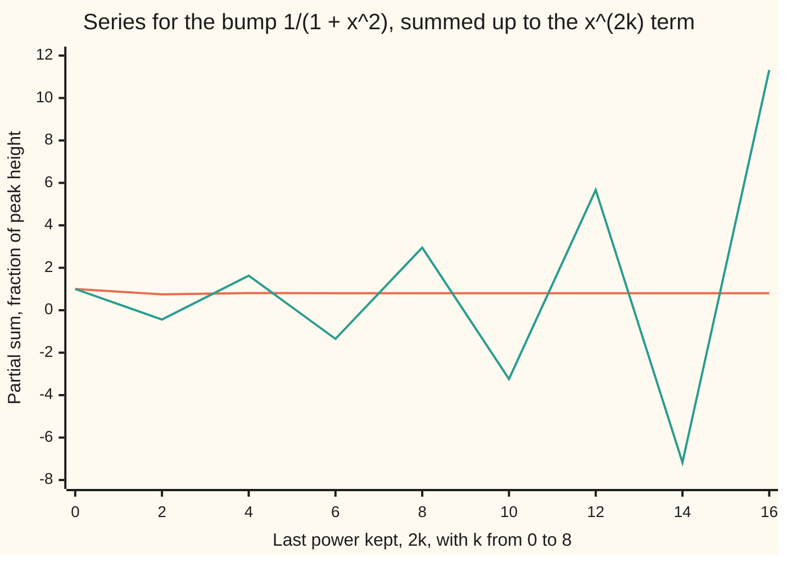
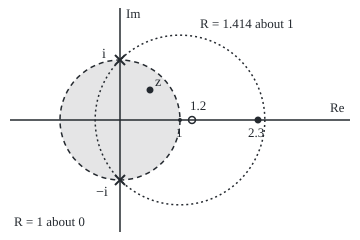

# Power series in the plane: a disc of convergence, and the invisible poles that set its radius

[Syllabus](../../../SYLLABUS.md) → [Complex analysis](../README.md) → [Holomorphic Functions](../README.md#s02) → Power series in the plane

---

## General Overview

A speed bump rises and falls smoothly. At x metres from its centre its height, as a fraction of the peak, is 1/(1 + x^2): 1 at the top, 0.8 at half a metre, 0.5 at one metre.

Its series, a polynomial that never stops, is 1 − x^2 + x^4 − x^6 + … At half a metre each term is −0.25 times the last, and the sum is 0.8. At 1.2 metres each is −1.44 times the last; sixty terms give −1.301 billion, not the true height 0.409836. The series dies at one metre, and the road shows no reason why.

The reason is off the road. Let x be any point z of the complex plane. At z = i the bottom line 1 + z^2 is 0 and the bump blows up; likewise at −i. Both sit exactly 1 from the centre 0, and the series works on the disc of radius 1, nowhere beyond.

**A power series converges on an open disc and fails outside it; inside, it can be differentiated term by term; and its radius reaches from the centre to the nearest point where the function it sums stops being holomorphic, such as a point where it blows up, even off the real line.**

**What kind of fact this is:** a theorem, proved in Why it works for the disc, the termwise slope and the bump's radius; the general rule "radius = distance to the nearest point where the function stops being holomorphic" is proved on [Taylor series in the plane](../04-Taylor%20Series%2C%20Zeros%20and%20Rigidity/01-taylor-series-in-the-plane.md).

### The picture: partial sums on the road



Orange, half a metre out: the sums settle on 0.80, the true height. Teal, 1.2 metres out: they swing ever wider; the true height is 0.409836.

---

## The formula

Notation first, in words. A **power series** about a centre $c$ adds powers of the offset z − c, each times a fixed complex number $a_n$, its **coefficient**. The **radius of convergence** $R$ is the distance from $c$ within which the sum settles. A **pole** is a point where a function runs off to infinity like one over a distance.

$$f(z) = \sum_{n=0}^{\infty} a_n (z - c)^n = a_0 + a_1 (z-c) + a_2 (z-c)^2 + \cdots$$

**Read it aloud:** f of z is the coefficients times the powers of the offset from the centre, added for ever.

The ratio test gives R as the limit of |a_n / a_(n+1)| when that limit exists. The Cauchy–Hadamard formula always gives it, using $\limsup$, the eventual ceiling of a list: the smallest number the list exceeds, by any fixed margin, only finitely often.

$$\frac{1}{R} = \limsup_{n \to \infty} |a_n|^{1/n}$$

**Read it aloud:** the n-th roots of the coefficients' sizes have eventual ceiling one over the radius.

Inside the disc, the slope is the series of slopes, with the same radius:

$$f'(z) = \sum_{n=1}^{\infty} n\, a_n (z - c)^{n-1}, \qquad |z - c| < R$$

**Read it aloud:** to differentiate, bring each power down as a factor and lower it by one.

The bump about 0, with $k$ counting the non-zero terms:

$$\frac{1}{1 + z^2} = \sum_{k=0}^{\infty} (-1)^k z^{2k} = 1 - z^2 + z^4 - \cdots, \qquad |z| < 1$$

| Symbol | Plain meaning | In our example | Push it up and the answer… |
| --- | --- | --- | --- |
| $x$, $z$ | a road point, metres from the centre; a plane point | 0.5; 0.5 + 0.5i | past R: no sum |
| $f$, $f'$ | the bump 1/(1 + z^2); its complex slope | 0.8 − 0.4i; −1.12 + 0.16i | — |
| $c$, $w$ | the centre; the offset z − c | 0, then 1 | moves the disc |
| $a_n$, $n$ | coefficient of the n-th power; the power | 1, 0, −1, 0, 1 | smaller radius |
| $k$, $N$ | counts non-zero terms; terms kept | 60 | nearer the sum |
| $R$ | radius of convergence | 1 about 0; 1.414214 about 1 | reaches farther |
| $i$, $-i$ | the poles, where 1 + z^2 = 0 | distance 1.000000 from 0 | bigger disc |
| $\limsup$, $h$ | eventual ceiling; a small complex step | along 1 and i | — |

### When it holds

- **Strictly inside the disc.** Outside, the terms grow and no sum exists: −1.301 billion after sixty terms at 1.2 metres.
- **The rim is point by point.** On the circle |z − c| = R the theorem is silent. At x = 1 the sums run 1, 0, 1, 0, though the bump is 0.5.
- **Blow-ups count wherever they are.** The distance to the nearest pole is measured in the plane, not along the road.

---

## Why it works

### Step 0: every term is beaten by a geometric series

Suppose at distance s from the centre every term's length $|a_n| s^n$ stays below a fixed number M. At a closer distance r, the n-th term is at most M times (r/s)^n: a geometric series with ratio below 1, which settles ([Limits and regions in the plane](../01-Complex%20Numbers%20and%20the%20Plane/06-complex-limits-series-and-regions.md)). Only the length |z − c| enters, never the direction, so pushing s out as far as it goes gives a disc, of radius $R$. Beyond $R$ the terms do not shrink to 0, so no sum exists.

### Step 1: the ratio test finds R

For the bump about 0, consecutive non-zero terms are $(-1)^k z^{2k}$ and $(-1)^{k+1} z^{2k+2}$. Their ratio has length |z|^2. The real ratio test ([Power series](../../06-Calculus%20and%20analysis/06-Series/04-power-series.md)) says: below 1, the series converges; above 1, it fails. So R = 1.

The ratio of coefficients fails here: every odd coefficient is 0, so a_0/a_1 has no value. The root form never divides: the non-zero coefficients have size 1, so 1/R = 1.

### Step 2: termwise differentiation is legal inside

Multiplying the n-th coefficient by n leaves the radius alone, since the n-th root of n tends to 1. Inside the disc, the difference quotient (f(z + h) − f(z))/h differs from the derivative series by at most a constant times |h|, in whatever direction the small step $h$ points. So the sum has a complex derivative everywhere in its disc: it is **holomorphic** there ([The complex derivative](01-complex-derivative-and-cauchy-riemann.md)).

At z = 0.5 + 0.5i, sixty terms of the derivative series give −1.12 + 0.16i; so do the quotient rule and difference quotients along 1 and along i.

<details>
<summary>Detailed proof: the radius formula and the termwise slope</summary>

**Cauchy–Hadamard.** Let L be the limsup of $|a_n|^{1/n}$. If $|z| < 1/L$, pick q with $L|z| < q < 1$; from some n on, $|a_n|^{1/n}|z| < q$, so $|a_n z^n| < q^n$ and the series converges. If $|z| > 1/L$, then $|a_n|^{1/n}|z| > 1$ infinitely often, so infinitely many terms have length above 1, and no sum exists.

**The slope.** Fix |z| < ρ < R, with ρ another radius, and a step $h$ with $|z + h| \le ρ$. The finite identity $((z+h)^n - z^n)/h - n z^{n-1} = \sum_{j=0}^{n-1} z^{n-1-j}((z+h)^j - z^j)$ bounds each bracket by $j|h|ρ^{j-1}$, so the error in the n-th term is at most $\tfrac{n(n-1)}{2}|h|ρ^{n-2}|a_n|$. Summed over n, this is $C|h|$ with C finite, by the root test on $n^2 |a_n| ρ^n$. For every tolerance ε > 0, a step shorter than ε/C keeps the error below ε, in every direction.

</details>

### Step 3: why the pole at i stops the series on the road

Inside the unit disc the series equals the bump: it is the geometric series with ratio −z^2. Walk up the imaginary axis to t·i with t below 1: the bump there is 1/(1 − t^2), which grows without bound as t nears 1.

A radius above 1 would make the series converge absolutely on the closed unit disc, with its sum there never above the finite total of the |a_n|. That caps the bump near i, which has no cap. So R is exactly 1, on the road too.

### Step 4: move the centre, move the disc

About c = 1 the poles are |1 − i| = 1.414214 away. Write w = z − 1, the offset from the new centre. The bump is 1/(2 + 2w + w^2), so that bottom line times the series must equal 1. Matching powers gives each coefficient from the two before: 0.5, −0.5, 0.25, 0, −0.125, 0.125, … The root form on coefficients near the 600th gives R = 1.415035. So the series reaches 2.3, which is 1.3 from the centre: 600 terms give 0.158983, the bump's height. At 2.5, 1.5 from the centre, they reach 10^14.5.

### The picture: two centres, two discs, the same two poles

<p align="center"></p>

To scale: 60 units per 1, with 0 at (120, 120). The poles are the crosses at (120.0, 60.0) and (120.0, 180.0); z sits at (150.0, 90.0); 1.2 (hollow: outside the first disc) and 2.3 at 192.0 and 258.0 on the real axis. The dotted disc about 1 has radius 84.85. Each disc grows until its rim meets a pole.

---

## Worked numbers, by hand

At z = 0.5 + 0.5i, off the road but inside the disc:

| Step | Arithmetic | Value |
| --- | --- | --- |
| square the point | 0.25 + 2(0.25)i − 0.25 | 0.5i |
| ratio of terms | −z^2 = −0.5i, length 0.5, below 1 | converges |
| first terms | 1, −0.5i, −0.25, 0.125i, 0.0625 | shrinking by half |
| bottom line | 1 + z^2 | 1 + 0.5i |
| divide through the conjugate | (1 − 0.5i)/1.25 | **0.8 − 0.4i** |
| bottom line squared | (1 + 0.5i)^2 = 1 + i − 0.25 | 0.75 + i |
| slope, −2z over that | (−1 − i)(0.75 − i)/1.5625 | **−1.12 + 0.16i** |
| back on the road, x = 0.5 | 1/1.25 and −1/1.5625 | **0.8** and **−0.64** |

Half a metre out, the bump stands at 0.8 of its peak and falls 0.64 of the peak per metre.

### What breaks if you drop a piece

| Mistake | Comes out at | What went wrong |
| --- | --- | --- |
| Radius read off the road: "smooth, so no limit" | sixty terms at 1.2 give −1.301 billion, not 0.409836 | the poles at ±i are off the road |
| Termwise slope without the factor n | −0.400000, not −0.640000 | each power brings itself down |
| Rim counted as inside | sums 1, 0, 1, 0 at x = 1; bump 0.5 | the rim is decided point by point |
| Radius about 1 taken as 1 again | 2.3 declared out of reach; 600 terms give 0.158983 | the pole is 1.414214 from 1 |

The code prints every row.

---

## Code, from first principles, and it actually runs

Road one adds the series term by term: 60 terms about 0, and 600 recurrence coefficients about 1. Road two is the closed form 1/(1 + z^2) with its quotient-rule slope, plus difference quotients along 1 and i. The recurrence is checked against a formula from splitting the bump into its two poles, and the root test's radius against |1 − i|.

### Python

```python
# Power series in the plane -- the check behind the card.  Standard library only.
# The speed bump 1/(1 + x^2) and its series 1 - x^2 + x^4 - ..., about 0 and about 1.
# Road one: add the series term by term.  Road two: the closed form, by complex division.
import math

def bump(z): return 1 / (1 + z * z)
def slope(z): return -2 * z / (1 + z * z) ** 2              # quotient rule on 1/(1 + z^2)
def show(w):                                               # 'a + bi', six decimals, no -0.000000
    a, b = round(w.real, 6) + 0.0, round(w.imag, 6) + 0.0
    return f"{a:.6f} {'-' if b < 0 else '+'} {abs(b):.6f}i"
def series0(z, K):                   # about 0: value and termwise slope from the first K terms
    val, der, p = 0j, 0j, 1 + 0j                           # p runs through (-z^2)^k
    for k in range(K):
        val += p
        if k > 0: der += 2 * k * p / z                     # d/dz of (-1)^k z^(2k)
        p *= -z * z
    return val, der
def sums(x, K): return [series0(x, j + 1)[0].real for j in range(K)]

z, x = 0.5 + 0.5j, 0.5
v, d = series0(z, 60)
vx, dx = series0(x, 60)
h = 1e-5
along = [(bump(z + s * h) - bump(z - s * h)) / (2 * s * h) for s in (1, 1j)]   # difference quotients
print(f"about 0: |next term / term| = |z|^2; poles at +i and -i, both at distance {abs(1j - 0):.6f}")
print(f"x = 0.5: 60 terms {vx.real:.6f}, closed form {bump(x):.6f}; slope termwise {dx.real:.6f}, closed form {slope(x):.6f}")
print(f"z = {show(z)}: |z| = {abs(z):.6f}, z^2 = {show(z * z)}, ratio |z|^2 = {abs(z) ** 2:.6f}")
q = 1 + z * z
print(f"z: 1 + z^2 = {show(q)}, |1 + z^2|^2 = {abs(q) ** 2:.6f}, (1 + z^2)^2 = {show(q * q)}, |(1 + z^2)^2|^2 = {abs(q * q) ** 2:.6f}")
print("z: first terms " + ", ".join(show((-z * z) ** k) for k in range(5)))
print(f"z: 60 terms {show(v)}, closed form {show(bump(z))}")
print(f"z: slope termwise {show(d)}, closed form {show(slope(z))}")
print(f"z: difference quotient along 1 {show(along[0])}, along i {show(along[1])}")
print("partial sums at x = 0.5, k = 0..8: " + ", ".join(f"{s:.2f}" for s in sums(0.5, 9)))
print("partial sums at x = 1.2, k = 0..8: " + ", ".join(f"{s:.2f}" for s in sums(1.2, 9)))
far = series0(1.2, 60)[0].real
print(f"x = 1.2: x^2 = {1.2 * 1.2:.6f}, bump {bump(1.2):.6f}; 60 terms give {far / 1e9:.3f} billion")
print("x = 1, on the rim: partial sums " + ", ".join(f"{s:.0f}" for s in sums(1.0, 6)) + f"; bump {bump(1.0):.6f}")
N = 600
a = [0.5, -0.5]                      # about 1, w = x - 1: (2 + 2w + w^2) f = 1, so a recurrence
for n in range(2, N): a.append(-(2 * a[n - 1] + a[n - 2]) / 2)
b = [(-1) ** n * 2 ** (-(n + 1) / 2) * math.sin((n + 1) * math.pi / 4) for n in range(N)]  # partial fractions
R1 = 1 / max(abs(a[n]) ** (1 / n) for n in range(N - 8, N))    # root test, Cauchy-Hadamard
print("about 1: coefficients " + ", ".join(f"{c + 0.0:.4f}" for c in a[:6]) + f"; root test R = {R1:.6f}; |1 - i| = {abs(1 - 1j):.6f}")
s23 = sum(c * 1.3 ** n for n, c in enumerate(a))
s25 = sum(c * 1.5 ** n for n, c in enumerate(a))
print(f"about 1: x = 2.3, {N} terms {s23:.6f}, bump {bump(2.3):.6f}; x = 2.5, {N} terms reach 10^{math.log10(abs(s25)):.1f}")
print(f"mistake, termwise slope without the factor n: {sum((-1) ** k * x ** (2 * k - 1) for k in range(1, 60)):.6f}, not {slope(x):.6f}")
print(f"figure, scale 60 per unit, 0 at (120, 120): z ({120 + 60 * z.real:.1f}, {120 - 60 * z.imag:.1f}), "
      f"+i (120.0, {120 - 60:.1f}), -i (120.0, {120 + 60:.1f}), 1.2 at {120 + 60 * 1.2:.1f}, centre 1 (180.0, 120.0), radius about 1 {60 * abs(1 - 1j):.2f}, x = 2.3 at {120 + 60 * 2.3:.1f}")
assert abs(v - bump(z)) < 1e-12 and abs(d - slope(z)) < 1e-12           # series against closed form
assert all(abs(q - d) < 1e-8 for q in along)                              # every direction, one slope
assert all(abs(p - q) <= 1e-9 * 2 ** (-(n + 1) / 2) for n, (p, q) in enumerate(zip(a, b))) and abs(s23 - bump(2.3)) < 1e-12
assert abs(R1 - abs(1 - 1j)) < 0.01 and abs(far) > 1e6 and abs(s25) > 1e6   # the poles set the radius
print("ALL CHECKS PASS")
```

**Ran 2026-09-28 on macOS, Python 3.14.6, standard library only. All checks passed. Output, pasted from the run:**

```
about 0: |next term / term| = |z|^2; poles at +i and -i, both at distance 1.000000
x = 0.5: 60 terms 0.800000, closed form 0.800000; slope termwise -0.640000, closed form -0.640000
z = 0.500000 + 0.500000i: |z| = 0.707107, z^2 = 0.000000 + 0.500000i, ratio |z|^2 = 0.500000
z: 1 + z^2 = 1.000000 + 0.500000i, |1 + z^2|^2 = 1.250000, (1 + z^2)^2 = 0.750000 + 1.000000i, |(1 + z^2)^2|^2 = 1.562500
z: first terms 1.000000 + 0.000000i, 0.000000 - 0.500000i, -0.250000 + 0.000000i, 0.000000 + 0.125000i, 0.062500 + 0.000000i
z: 60 terms 0.800000 - 0.400000i, closed form 0.800000 - 0.400000i
z: slope termwise -1.120000 + 0.160000i, closed form -1.120000 + 0.160000i
z: difference quotient along 1 -1.120000 + 0.160000i, along i -1.120000 + 0.160000i
partial sums at x = 0.5, k = 0..8: 1.00, 0.75, 0.81, 0.80, 0.80, 0.80, 0.80, 0.80, 0.80
partial sums at x = 1.2, k = 0..8: 1.00, -0.44, 1.63, -1.35, 2.95, -3.24, 5.67, -7.17, 11.32
x = 1.2: x^2 = 1.440000, bump 0.409836; 60 terms give -1.301 billion
x = 1, on the rim: partial sums 1, 0, 1, 0, 1, 0; bump 0.500000
about 1: coefficients 0.5000, -0.5000, 0.2500, 0.0000, -0.1250, 0.1250; root test R = 1.415035; |1 - i| = 1.414214
about 1: x = 2.3, 600 terms 0.158983, bump 0.158983; x = 2.5, 600 terms reach 10^14.5
mistake, termwise slope without the factor n: -0.400000, not -0.640000
figure, scale 60 per unit, 0 at (120, 120): z (150.0, 90.0), +i (120.0, 60.0), -i (120.0, 180.0), 1.2 at 192.0, centre 1 (180.0, 120.0), radius about 1 84.85, x = 2.3 at 258.0
ALL CHECKS PASS
```

### Rust

Same numbers, same labels, built with `rustc --edition 2021 -O`.

```rust
// Power series in the plane -- the same check as the Python, in Rust.  No crates.
// The speed bump 1/(1 + x^2) and its series 1 - x^2 + x^4 - ..., about 0 and about 1.
// Road one: add the series term by term.  Road two: the closed form, by complex division.
use std::f64::consts::PI;
#[derive(Clone, Copy)]
struct C { re: f64, im: f64 }
fn c(re: f64, im: f64) -> C { C { re, im } }
fn add(a: C, b: C) -> C { c(a.re + b.re, a.im + b.im) }
fn sub(a: C, b: C) -> C { c(a.re - b.re, a.im - b.im) }
fn mul(a: C, b: C) -> C { c(a.re * b.re - a.im * b.im, a.re * b.im + a.im * b.re) }
fn scale(a: C, t: f64) -> C { c(a.re * t, a.im * t) }
fn div(a: C, b: C) -> C { let m = b.re * b.re + b.im * b.im; scale(mul(a, c(b.re, -b.im)), 1.0 / m) }
fn modulus(a: C) -> f64 { a.re.hypot(a.im) }
fn one() -> C { c(1.0, 0.0) }
fn bump(z: C) -> C { div(one(), add(one(), mul(z, z))) }
fn slope(z: C) -> C { let q = add(one(), mul(z, z)); div(scale(z, -2.0), mul(q, q)) } // quotient rule
fn show(w: C) -> String { // 'a + bi', six decimals, no -0.000000
    let a = format!("{:.6}", w.re);
    let a = if a == "-0.000000" { "0.000000".to_string() } else { a };
    let b = format!("{:.6}", w.im.abs());
    format!("{} {} {}i", a, if w.im < 0.0 && b != "0.000000" { '-' } else { '+' }, b)
}
fn series0(z: C, k_max: usize) -> (C, C) { // about 0: value and termwise slope from the first K terms
    let (mut val, mut der, mut p) = (c(0.0, 0.0), c(0.0, 0.0), one()); // p runs through (-z^2)^k
    for k in 0..k_max {
        val = add(val, p);
        if k > 0 { der = add(der, div(scale(p, 2.0 * k as f64), z)) } // d/dz of (-1)^k z^(2k)
        p = mul(p, scale(mul(z, z), -1.0));
    }
    (val, der)
}
fn sums(x: f64, k: usize) -> String { (0..k).map(|j| format!("{:.2}", series0(c(x, 0.0), j + 1).0.re)).collect::<Vec<_>>().join(", ") }

fn main() {
    let (z, x, h) = (c(0.5, 0.5), c(0.5, 0.0), 1e-5);
    let (v, d) = series0(z, 60);
    let (vx, dx) = series0(x, 60);
    let along: Vec<C> = [one(), c(0.0, 1.0)].iter().map(|&s| { let st = scale(s, h);
        div(sub(bump(add(z, st)), bump(sub(z, st))), scale(st, 2.0)) }).collect(); // difference quotients
    println!("about 0: |next term / term| = |z|^2; poles at +i and -i, both at distance {:.6}", modulus(c(0.0, 1.0)));
    println!("x = 0.5: 60 terms {:.6}, closed form {:.6}; slope termwise {:.6}, closed form {:.6}", vx.re, bump(x).re, dx.re, slope(x).re);
    println!("z = {}: |z| = {:.6}, z^2 = {}, ratio |z|^2 = {:.6}", show(z), modulus(z), show(mul(z, z)), modulus(z).powi(2));
    let q = add(one(), mul(z, z));
    println!("z: 1 + z^2 = {}, |1 + z^2|^2 = {:.6}, (1 + z^2)^2 = {}, |(1 + z^2)^2|^2 = {:.6}", show(q), modulus(q).powi(2), show(mul(q, q)), modulus(mul(q, q)).powi(2));
    let mut t = vec![one()];
    for k in 1..5 { let prev = t[k - 1]; t.push(mul(prev, scale(mul(z, z), -1.0))) }
    println!("z: first terms {}", t.iter().map(|&w| show(w)).collect::<Vec<_>>().join(", "));
    println!("z: 60 terms {}, closed form {}", show(v), show(bump(z)));
    println!("z: slope termwise {}, closed form {}", show(d), show(slope(z)));
    println!("z: difference quotient along 1 {}, along i {}", show(along[0]), show(along[1]));
    println!("partial sums at x = 0.5, k = 0..8: {}", sums(0.5, 9));
    println!("partial sums at x = 1.2, k = 0..8: {}", sums(1.2, 9));
    let far = series0(c(1.2, 0.0), 60).0.re;
    println!("x = 1.2: x^2 = {:.6}, bump {:.6}; 60 terms give {:.3} billion", 1.2 * 1.2, bump(c(1.2, 0.0)).re, far / 1e9);
    let rim: Vec<String> = (0..6).map(|j| format!("{:.0}", series0(one(), j + 1).0.re)).collect();
    println!("x = 1, on the rim: partial sums {}; bump {:.6}", rim.join(", "), bump(one()).re);
    let n_max = 600;
    let mut a = vec![0.5f64, -0.5]; // about 1, w = x - 1: (2 + 2w + w^2) f = 1, so a recurrence
    for n in 2..n_max { let next = -(2.0 * a[n - 1] + a[n - 2]) / 2.0; a.push(next) }
    let b: Vec<f64> = (0..n_max).map(|n| (if n % 2 == 0 { 1.0 } else { -1.0 }) * 2f64.powf(-((n + 1) as f64) / 2.0)
        * ((n + 1) as f64 * PI / 4.0).sin()).collect(); // partial fractions
    let r1 = 1.0 / (n_max - 8..n_max).map(|n| a[n].abs().powf(1.0 / n as f64)).fold(0.0, f64::max); // root test
    let coef: Vec<String> = a[..6].iter().map(|&v| format!("{:.4}", v + 0.0)).collect();
    println!("about 1: coefficients {}; root test R = {:.6}; |1 - i| = {:.6}", coef.join(", "), r1, modulus(c(1.0, -1.0)));
    let s23: f64 = a.iter().enumerate().map(|(n, v)| v * 1.3f64.powi(n as i32)).sum();
    let s25: f64 = a.iter().enumerate().map(|(n, v)| v * 1.5f64.powi(n as i32)).sum();
    println!("about 1: x = 2.3, {} terms {:.6}, bump {:.6}; x = 2.5, {} terms reach 10^{:.1}", n_max, s23, bump(c(2.3, 0.0)).re, n_max, s25.abs().log10());
    let wrong: f64 = (1..60).map(|k| (if k % 2 == 0 { 1.0 } else { -1.0 }) * 0.5f64.powi(2 * k - 1)).sum();
    println!("mistake, termwise slope without the factor n: {:.6}, not {:.6}", wrong, slope(x).re);
    println!("figure, scale 60 per unit, 0 at (120, 120): z ({:.1}, {:.1}), +i (120.0, {:.1}), -i (120.0, {:.1}), 1.2 at {:.1}, centre 1 (180.0, 120.0), radius about 1 {:.2}, x = 2.3 at {:.1}",
        120.0 + 60.0 * z.re, 120.0 - 60.0 * z.im, 120.0 - 60.0, 120.0 + 60.0, 120.0 + 60.0 * 1.2, 60.0 * modulus(c(1.0, -1.0)), 120.0 + 60.0 * 2.3);
    assert!(modulus(sub(v, bump(z))) < 1e-12 && modulus(sub(d, slope(z))) < 1e-12); // series against closed form
    assert!(along.iter().all(|&q| modulus(sub(q, d)) < 1e-8)); // every direction, one slope
    assert!((0..n_max).all(|n| (a[n] - b[n]).abs() <= 1e-9 * 2f64.powf(-((n + 1) as f64) / 2.0)) && (s23 - bump(c(2.3, 0.0)).re).abs() < 1e-12);
    assert!((r1 - modulus(c(1.0, -1.0))).abs() < 0.01 && far.abs() > 1e6 && s25.abs() > 1e6); // the poles set the radius
    println!("ALL CHECKS PASS");
}
```

**Ran 2026-09-28 on macOS, rustc 1.98.1, no crates. All checks passed. Output, pasted from the run:**

```
about 0: |next term / term| = |z|^2; poles at +i and -i, both at distance 1.000000
x = 0.5: 60 terms 0.800000, closed form 0.800000; slope termwise -0.640000, closed form -0.640000
z = 0.500000 + 0.500000i: |z| = 0.707107, z^2 = 0.000000 + 0.500000i, ratio |z|^2 = 0.500000
z: 1 + z^2 = 1.000000 + 0.500000i, |1 + z^2|^2 = 1.250000, (1 + z^2)^2 = 0.750000 + 1.000000i, |(1 + z^2)^2|^2 = 1.562500
z: first terms 1.000000 + 0.000000i, 0.000000 - 0.500000i, -0.250000 + 0.000000i, 0.000000 + 0.125000i, 0.062500 + 0.000000i
z: 60 terms 0.800000 - 0.400000i, closed form 0.800000 - 0.400000i
z: slope termwise -1.120000 + 0.160000i, closed form -1.120000 + 0.160000i
z: difference quotient along 1 -1.120000 + 0.160000i, along i -1.120000 + 0.160000i
partial sums at x = 0.5, k = 0..8: 1.00, 0.75, 0.81, 0.80, 0.80, 0.80, 0.80, 0.80, 0.80
partial sums at x = 1.2, k = 0..8: 1.00, -0.44, 1.63, -1.35, 2.95, -3.24, 5.67, -7.17, 11.32
x = 1.2: x^2 = 1.440000, bump 0.409836; 60 terms give -1.301 billion
x = 1, on the rim: partial sums 1, 0, 1, 0, 1, 0; bump 0.500000
about 1: coefficients 0.5000, -0.5000, 0.2500, 0.0000, -0.1250, 0.1250; root test R = 1.415035; |1 - i| = 1.414214
about 1: x = 2.3, 600 terms 0.158983, bump 0.158983; x = 2.5, 600 terms reach 10^14.5
mistake, termwise slope without the factor n: -0.400000, not -0.640000
figure, scale 60 per unit, 0 at (120, 120): z (150.0, 90.0), +i (120.0, 60.0), -i (120.0, 180.0), 1.2 at 192.0, centre 1 (180.0, 120.0), radius about 1 84.85, x = 2.3 at 258.0
ALL CHECKS PASS
```

The two outputs match line for line.

> [!TIP]
> **Try changing**
> Guess first, then run it.
> - **Step outside.** Set `z` to `0.8 + 0.8j`: its length passes 1, the terms grow, and the first assert stops it.
> - **Fewer terms about 1.** Set `N` to `100`: 2.3 is inside the disc, but 100 terms fall short, and the third assert stops it.
> - **Drop the 2.** Change `2 * k * p / z` to `k * p / z`: the slope halves, and the first assert stops it.

---

## The usual mistake

> [!warning]
> **Looking for the obstacle on the real line.** The bump is smooth for every real x, yet its series stops at |x| = 1, because the complex bump blows up at i and −i, one unit from 0. The radius is a distance in the plane.
>
> - **Ratio of coefficients with zeros among them.** a_0/a_1 has no value; use consecutive non-zero terms, or the root form.
> - **One radius for every centre.** About 1 it is 1.414214.

---

## Where you meet it in real life

- **Counting with generating functions.** Coefficients grow or shrink at rate 1/R, set by the nearest pole: about 1 the bump's shrink by a factor near 1/1.414214 per step.
- **The elementary functions.** The exponential, sine and cosine are holomorphic on the whole plane, so their series converge everywhere: [The elementary functions](03-exponential-sine-and-cosine-in-the-plane.md).

> **Say it back**
> A power series settles on an open disc about its centre and fails outside; the rim is decided point by point. The ratio test or the root formula finds the radius. Inside, the series differentiates term by term, so its sum is holomorphic. The radius reaches the nearest point where the function stops being holomorphic. For the bump those points are i and −i, off the road, so the real series stops at one metre.

---

## What this builds on

- [Limits and regions in the plane](../01-Complex%20Numbers%20and%20the%20Plane/06-complex-limits-series-and-regions.md): the complex geometric series and the open disc.
- [The complex derivative](01-complex-derivative-and-cauchy-riemann.md): what it means to have a slope in every direction.
- [Power series](../../06-Calculus%20and%20analysis/06-Series/04-power-series.md): the real radius, the ratio test and the endpoints.

## Where this goes next

- [The elementary functions](03-exponential-sine-and-cosine-in-the-plane.md): series with an infinite radius define e^z, sin z and cos z.
- [Taylor series in the plane](../04-Taylor%20Series%2C%20Zeros%20and%20Rigidity/01-taylor-series-in-the-plane.md): the radius reaches the nearest point where the function stops being holomorphic, in general.

A power series is holomorphic; whether every holomorphic function is a power series is the question this leaves, and [Taylor series in the plane](../04-Taylor%20Series%2C%20Zeros%20and%20Rigidity/01-taylor-series-in-the-plane.md) answers yes.

---

## Sources

Verified 28 Sep 2026: every link below resolves to the publisher's page.

- Stein, Elias M., and Rami Shakarchi. *Complex Analysis*. Princeton University Press, 2003. [Publisher page](https://press.princeton.edu/books/hardcover/9780691113852/complex-analysis). Chapter 1: power series, Hadamard's radius formula, termwise differentiation.
- Orloff, Jeremy. "Topic 7: Taylor and Laurent series." MIT OpenCourseWare 18.04, Spring 2018. [Course notes](https://ocw.mit.edu/courses/18-04-complex-variables-with-applications-spring-2018/resources/mit18_04s18_topic7/). Free notes: Taylor series in the plane and their discs of convergence.
- Lebl, Jiří. *Guide to Cultivating Complex Analysis*. [Book page](https://www.jirka.org/ca/). Free text; sections 2.3 and 2.4: radius of convergence, termwise differentiation.
