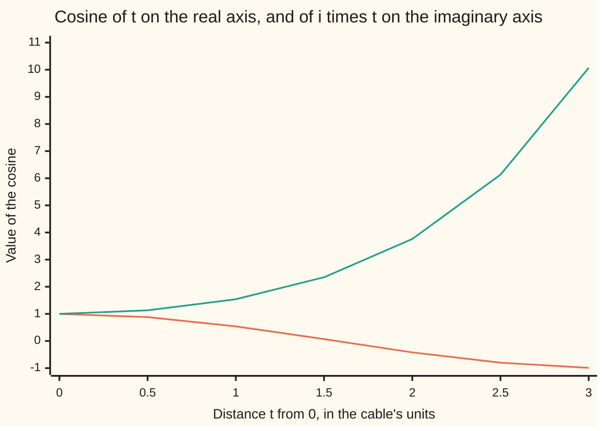

# The elementary functions: exp, sine and cosine for complex inputs, and the hyperbolic twins are the same functions turned a quarter

Complex analysis → Holomorphic Functions → Waves and cables in one function → The elementary functions

---

## General Overview

A suspension bridge's main cable, strung between its towers before the deck goes on, hangs under its own weight. Measured from its lowest point in units set by its tension and weight, at distance x it stands cosh x above a fixed level: 1 at the bottom, 1.543081 one unit out, 10.067662 three units out ([hyperbolic-functions](../../06-Calculus%20and%20analysis/02-Derivatives/07-hyperbolic-functions.md)).

Beside it, a wave: height cos x, never outside −1 to 1; 0.540302 one unit along.

The two curves are one function. Feed cosine a point on the real axis and it draws the wave. Feed it the same distance up the imaginary axis, i times x, and it draws the cable: cos(i) is 1.543081, exactly cosh 1. Sine does the same with a quarter turn in the answer: sin(i) is 1.175201i, i times sinh 1.

Extended to the whole plane, the exponential is still its own rate of change and never reaches 0, but it now repeats, and sine is no longer trapped between −1 and 1.

**Once e to the z is defined by its series, cosine and sine are fixed by two exponentials, and turning their input a quarter turns them into cosh and sinh: the hanging cable is a cosine read up the imaginary axis.**

**What kind of fact this is:** a definition, of sin z and cos z by exponentials, followed by theorems proved on this card in Why it works.

### The picture: the wave and the cable are one cosine



Orange: the wave, cos t, with t on the real axis. Green: the cable, cos(it), the same distance up the imaginary axis; its values are cosh t. Step 3 proves the match.

---

## The formula

Notation first, in words. "e to the z", written $e^z$, is the exponential series summed at the complex number z. The rate of change d/dz is the limit of the slope (f(z + h) − f(z))/h as the complex step h shrinks to 0 from every direction ([complex-derivative-and-cauchy-riemann](01-complex-derivative-and-cauchy-riemann.md)). A function with that rate everywhere in the plane is called **entire**.

$$e^{z} = \sum_{n=0}^{\infty} \frac{z^n}{n!}, \qquad \frac{d}{dz}\,e^{z} = e^{z}$$

**Read it aloud:** e to the z is the sum of z to the n over n factorial, and its rate of change is itself.

$$\cos z = \frac{e^{iz} + e^{-iz}}{2}, \qquad \sin z = \frac{e^{iz} - e^{-iz}}{2i}$$

**Read it aloud:** cosine is the average of e to the iz and e to the minus iz; sine is their half-difference, divided by i.

$$\cos(iy) = \cosh y, \qquad \sin(iy) = i\,\sinh y$$

**Read it aloud:** cosine a distance y up the imaginary axis is the hyperbolic cosine of y; sine there is i times the hyperbolic sine.

Proved below: $|\sin(x+iy)|^2 = \sin^2 x + \sinh^2 y$, so sine is unbounded; $e^z \neq 0$; and $e^{z+2\pi i} = e^z$.

| Symbol | Plain meaning | In our example | Push it up and the answer… |
| --- | --- | --- | --- |
| $z$, $x$, $y$ | a complex input, z = x + iy | z = i: x = 0, y = 1 | y up: sine grows like e^y / 2 |
| $i$ | square −1; multiplying by it turns a quarter | wave's axis to cable's | — |
| $e$, $e^z$ | the base of natural growth; the exponential at z | e^(1 + i) = 1.468694 + 2.287355i | x stretches; y turns |
| $\sin$, $\cos$ | sine and cosine of complex inputs | sin(i) = 1.175201i | unbounded off the real axis |
| $\sinh$, $\cosh$ | half-difference and average of e^y and e^−y | cosh 1 = 1.543081 | both climb |
| $h$ | a small complex step for a slope | size 0.1 down to 0.00001 | smaller: slope nearer e^z |
| $n$, $n!$ | term number; 1 × 2 × … × n | 60 terms in the code | — |
| $\pi$, $\bar z$ | a half turn; z-bar, z mirrored: x − iy | period 2πi | — |

### When it holds

- **Every complex input.** The series converges for every z, so $e^z$, sin z and cos z are entire.
- **Identities from adding exponents carry over.** Angle sums and cos^2 z + sin^2 z = 1 hold for all complex z.
- **Inequalities do not.** |sin x| ≤ 1 is about real x: sin(3i) has size 10.017875. The identity cos^2 z + sin^2 z = 1 survives, but sin(i)^2 = −1.381098 is negative, so cos(i)^2 = 2.381098 exceeds 1.
- **Undoing needs a choice.** The exponential repeats every 2πi; the choice is made on [complex-logarithm](04-complex-logarithm.md).

---

## Why it works

### Step 0: one series carries everything

The exponential series converges on the whole plane ([eulers-formula](../01-Complex%20Numbers%20and%20the%20Plane/04-eulers-formula.md)). A power series can be differentiated term by term inside its disc of convergence ([complex-power-series](02-complex-power-series.md)), here the plane. Everything below follows from this series and the rule that exponents add.

### Step 1: the exponential is its own rate of change

Differentiate the series term by term. The term $z^n/n!$ has rate $n z^{n-1}/n!$, which is $z^{n-1}/(n-1)!$: the term before it. So the differentiated series is the same series shifted by one place, and $\frac{d}{dz}e^z = e^z$.

At z = 1 + i the exponential is 1.468694 + 2.287355i. The slope (e^(z + h) − e^z)/h with steps of size 0.1, 0.001, 0.00001 misses it by 0.140560, 0.001360, 0.000014 stepping along the real axis, and by 0.135876, 0.001359, 0.000014 stepping straight up. Every direction closes on the same number, as a complex derivative demands.

<details>
<summary>Detailed proof: the rate, without term-by-term differentiation</summary>

Exponents add ([eulers-formula](../01-Complex%20Numbers%20and%20the%20Plane/04-eulers-formula.md), Step 4), so

$$\frac{e^{z+h} - e^{z}}{h} - e^{z} = e^{z}\Big(\frac{e^{h} - 1}{h} - 1\Big) = e^{z} \sum_{n=2}^{\infty} \frac{h^{n-1}}{n!}.$$

Each term has size at most $|h|\cdot|h|^{n-2}/(n-2)!$, so the sum has size at most $|h|\,e^{|h|}$. Given a tolerance ε > 0, take δ = min(1, ε / (e |e^z|)). Any step with 0 < |h| < δ puts the slope within |e^z| · |h| · e < ε of e^z. The direction of h never entered, so the limit is $e^z$ from every direction.

</details>

### Step 2: sine and cosine are fixed by two exponentials

For a real angle θ, Euler's formula gives $e^{i\theta} = \cos\theta + i\sin\theta$ and $e^{-i\theta} = \cos\theta - i\sin\theta$. Add and halve: cosine. Subtract and divide by 2i: sine. The right-hand sides make sense for any complex z, so they define cos z and sin z; on the real line they return the old functions.

They match the old series too. In $e^{iz} + e^{-iz}$ the odd powers cancel, leaving $1 - z^2/2! + z^4/4! - \cdots$; the difference keeps the odd powers. The code sums those series separately at z = i and gets the same 1.543081 and 1.175201i.

Each is entire. The rate of $e^{iz}$ is $i e^{iz}$ by the chain rule, so the rate of sin z is cos z and of cos z is −sin z.

### Step 3: turn the input a quarter and you get cosh and sinh

Put z = iy, a point y up the imaginary axis. Then iz = −y and −iz = y, both real.

$$\cos(iy) = \frac{e^{-y} + e^{y}}{2} = \cosh y, \qquad \sin(iy) = \frac{e^{-y} - e^{y}}{2i} = \frac{-2\sinh y}{2i} = i\sinh y,$$

using 1/i = −i. At y = 1: cos(i) = 1.543081, the cable one unit out, and sin(i) = 1.175201i. Read the other way, cosh z = cos(iz) and sinh z = −i sin(iz): the hyperbolic functions are the circular ones with the input turned a quarter.

### Step 4: sine is unbounded

The angle-sum formula for sine comes from adding exponents, so it holds for complex inputs. With Step 3 it gives

$$\sin(x + iy) = \sin x\,\cosh y + i\cos x\,\sinh y.$$

At 1 + 3i both routes give 8.471645 + 5.412681i. Square the two parts, add, and use cosh^2 y = 1 + sinh^2 y:

$$|\sin(x+iy)|^2 = \sin^2 x\,(1 + \sinh^2 y) + \cos^2 x\,\sinh^2 y = \sin^2 x + \sinh^2 y.$$

Sinh y grows like e^y / 2, so the size of sine climbs without end up the imaginary axis: 1.175201 at i, 10.017875 at 3i, 11013.232875 at 10i. The size is 0 only when y = 0 and sin x = 0, so sine gains no zeros off the real line. Liouville's theorem, later in this wing, says a bounded entire function is constant, so unboundedness was forced.

### Step 5: the exponential never vanishes, and it repeats

Exponents add, so $e^z e^{-z} = e^0 = 1$; the code gets 1.000000 + 0.000000i at z = 1 + i. A product equal to 1 has no zero factor, so $e^z \neq 0$.

A full turn returns the arrow: $e^{2\pi i} = 1$, so $e^{z+2\pi i} = e^z$. At 1 + i both are 1.468694 + 2.287355i. Sine and cosine keep their real period 2π; cosh and sinh, turned a quarter, repeat every 2πi.

A second road to the rate: $e^{x+iy} = e^x\cos y + i e^x\sin y$. Its real part u and imaginary part v have partial derivatives $u_x = e^x\cos y = v_y$ and $u_y = -e^x\sin y = -v_x$, continuous everywhere. These are the Cauchy–Riemann equations of [complex-derivative-and-cauchy-riemann](01-complex-derivative-and-cauchy-riemann.md), and the rate $u_x + i v_x$ is $e^z$ again.

---

## Worked numbers, by hand

| Step | Arithmetic | Value |
| --- | --- | --- |
| The wave | cos 1 | 0.540302 |
| The cable | (e + 1/e) / 2 | 1.543081 |
| cos(i) | (e^−1 + e^1) / 2 | **1.543081** |
| sin(i) | (e^−1 − e^1) / (2i) | **1.175201i** |
| sin(1 + 3i) | sin 1 cosh 3 + i cos 1 sinh 3 | 8.471645 + 5.412681i |
| Size of sin(3i) | sinh 3 | 10.017875 |
| e^(1 + i), and a full turn on | e (cos 1 + i sin 1) | 1.468694 + 2.287355i |

### What breaks if you drop a piece

| Mistake | Comes out at | What went wrong |
| --- | --- | --- |
| Size of sin z at most 1 | 10.017875 at 3i | True only for real inputs |
| Sine over 2, not 2i, at i | −1.175201 | The quarter turn is lost |
| e^(z-bar) given a rate | slopes 1.468694 − 2.287355i along the real axis, −1.468694 + 2.287355i straight up | Mirroring has no complex rate |
| Period 2π, not 2πi | e^(z + 2π) is 535.491656 times e^z | A real shift stretches |

The code prints all four.

---

## Code, from first principles, and it actually runs

Both programs build $e^z$ from its own series and take three roads to cosine and sine: two exponentials, their own power series, and cosh and sinh from the real exponential. The asserts check that the roads agree at i and at seven points up the imaginary axis; that $e^{1+i}$ equals e(cos 1 + i sin 1), its slopes close in, and a full turn returns it; and that e^(z-bar) has two different slopes.

### Python

```python
# The elementary functions in the plane -- the check behind the card.  Standard library only.
# Road one: e^z summed from its own series; cos z and sin z built from it by the exponential rules.
# Road two: the separate power series of cos and sin, summed straight at a complex input.
# Road three: the real cosh and sinh, from math.exp, averaged and halved by hand.
import math

def exp_s(z, terms=60):                      # 1 + z + z^2/2! + ..., each term the last times z/n
    total, term = 0j, 1 + 0j
    for n in range(1, terms + 1):
        total, term = total + term, term * z / n
    return total

def cos_e(z): return (exp_s(1j * z) + exp_s(-1j * z)) / 2
def sin_e(z): return (exp_s(1j * z) - exp_s(-1j * z)) / 2j

def trig_s(z, start, terms=40):              # start 0: 1 - z^2/2! + ...; start 1: z - z^3/3! + ...
    total, term = 0j, z ** start + 0j
    for k in range(terms):
        n = start + 2 * k
        total, term = total + term, -term * z * z / ((n + 1) * (n + 2))
    return total

def show(w):                                 # 'a + bi', six decimals, no -0.000000
    a, b = round(w.real, 6) + 0.0, round(w.imag, 6) + 0.0
    return f"{a:.6f} {'-' if b < 0 else '+'} {abs(b):.6f}i"

ch = lambda y: (math.exp(y) + math.exp(-y)) / 2
sh = lambda y: (math.exp(y) - math.exp(-y)) / 2
print(f"wave cos 1 = {math.cos(1):.6f}; cable cosh 1 = {ch(1):.6f}; sinh 1 = {sh(1):.6f}")
print(f"cos(i): exponentials {show(cos_e(1j))}; own series {show(trig_s(1j, 0))}")
print(f"sin(i): exponentials {show(sin_e(1j))}; own series {show(trig_s(1j, 1))}")
w = 1 + 3j
print(f"sin(1 + 3i): exponentials {show(sin_e(w))}; sin 1 cosh 3 + i cos 1 sinh 3 = "
      f"{show(complex(math.sin(1) * ch(3), math.cos(1) * sh(3)))}")
print("size of sin(iy), y = 1, 3, 10: " + ", ".join(f"{abs(sin_e(1j * y)):.6f}" for y in (1, 3, 10)))
z = 1 + 1j
ez = exp_s(z)
print(f"e^z at z = 1 + i: series {show(ez)}; e(cos 1 + i sin 1) = {show(math.e * complex(math.cos(1), math.sin(1)))}")
gaps = {}
for name, u in (("real", 1), ("imaginary", 1j), ("diagonal", (1 + 1j) / math.sqrt(2))):
    gaps[name] = [abs((exp_s(z + s * u) - ez) / (s * u) - ez) for s in (0.1, 0.001, 0.00001)]
    print(f"slope of e^z at 1 + i, step {name}: gap from e^z at size 0.1, 0.001, 0.00001: "
          + ", ".join(f"{g:.6f}" for g in gaps[name]))
print(f"e^z times e^-z: {show(ez * exp_s(-z))}; e^(z + 2 pi i): {show(exp_s(z + 2j * math.pi))}")
bar = lambda v: exp_s(v.conjugate())
qr, qi = [(bar(z + d) - bar(z - d)) / (2 * d) for d in (1e-4, 1e-4j)]   # centred slopes
print(f"mistake, e^(z-bar): slope along real {show(qr)}, along imaginary {show(qi)}")
print(f"mistake, dividing by 2 not 2i at z = i: {show((exp_s(-1) - exp_s(1)) / 2)}")
print(f"mistake, period 2 pi read as real: e^(z + 2 pi) / e^z = {abs(exp_s(z + 2 * math.pi) / ez):.6f}")
ts = [k / 2 for k in range(7)]
print("chart, wave cos t: " + ", ".join(f"{math.cos(t):.2f}" for t in ts))
print("chart, cable cos(it): " + ", ".join(f"{cos_e(1j * t).real:.2f}" for t in ts))
assert abs(cos_e(1j) - trig_s(1j, 0)) < 1e-12 and abs(sin_e(1j) - trig_s(1j, 1)) < 1e-12
assert all(abs(cos_e(1j * t) - ch(t)) < 1e-12 and abs(sin_e(1j * t) - 1j * sh(t)) < 1e-12 for t in ts)
assert abs(ez - math.e * complex(math.cos(1), math.sin(1))) < 1e-12 and all(
    g[0] > g[1] > g[2] and g[2] < 1e-4 for g in gaps.values())
assert abs(exp_s(z + 2j * math.pi) - ez) < 1e-12 and abs(qr + qi) < 1e-4 < abs(qr)
print("ALL CHECKS PASS")
```

**Ran 2026-09-28 on macOS, Python 3.14.6, standard library only. All checks passed. Output, pasted from the run:**

```
wave cos 1 = 0.540302; cable cosh 1 = 1.543081; sinh 1 = 1.175201
cos(i): exponentials 1.543081 + 0.000000i; own series 1.543081 + 0.000000i
sin(i): exponentials 0.000000 + 1.175201i; own series 0.000000 + 1.175201i
sin(1 + 3i): exponentials 8.471645 + 5.412681i; sin 1 cosh 3 + i cos 1 sinh 3 = 8.471645 + 5.412681i
size of sin(iy), y = 1, 3, 10: 1.175201, 10.017875, 11013.232875
e^z at z = 1 + i: series 1.468694 + 2.287355i; e(cos 1 + i sin 1) = 1.468694 + 2.287355i
slope of e^z at 1 + i, step real: gap from e^z at size 0.1, 0.001, 0.00001: 0.140560, 0.001360, 0.000014
slope of e^z at 1 + i, step imaginary: gap from e^z at size 0.1, 0.001, 0.00001: 0.135876, 0.001359, 0.000014
slope of e^z at 1 + i, step diagonal: gap from e^z at size 0.1, 0.001, 0.00001: 0.139156, 0.001359, 0.000014
e^z times e^-z: 1.000000 + 0.000000i; e^(z + 2 pi i): 1.468694 + 2.287355i
mistake, e^(z-bar): slope along real 1.468694 - 2.287355i, along imaginary -1.468694 + 2.287355i
mistake, dividing by 2 not 2i at z = i: -1.175201 + 0.000000i
mistake, period 2 pi read as real: e^(z + 2 pi) / e^z = 535.491656
chart, wave cos t: 1.00, 0.88, 0.54, 0.07, -0.42, -0.80, -0.99
chart, cable cos(it): 1.00, 1.13, 1.54, 2.35, 3.76, 6.13, 10.07
ALL CHECKS PASS
```

### Rust

Same numbers, same labels, built with `rustc --edition 2021 -O`.

```rust
// The elementary functions in the plane -- the same check as the Python, in Rust.  No crates.
// Road one: e^z summed from its own series; cos z and sin z built from it by the exponential rules.
// Road two: the separate power series of cos and sin, summed straight at a complex input.
// Road three: the real cosh and sinh, from exp, averaged and halved by hand.
use std::f64::consts::{E, PI};
#[derive(Clone, Copy)]
struct C { re: f64, im: f64 }
fn c(re: f64, im: f64) -> C { C { re, im } }
fn add(a: C, b: C) -> C { c(a.re + b.re, a.im + b.im) }
fn sub(a: C, b: C) -> C { c(a.re - b.re, a.im - b.im) }
fn mul(a: C, b: C) -> C { c(a.re * b.re - a.im * b.im, a.re * b.im + a.im * b.re) }
fn scale(a: C, k: f64) -> C { c(a.re * k, a.im * k) }
fn div(a: C, b: C) -> C { let d = b.re * b.re + b.im * b.im; scale(mul(a, c(b.re, -b.im)), 1.0 / d) }
fn modu(a: C) -> f64 { a.re.hypot(a.im) }
const I: C = C { re: 0.0, im: 1.0 };

fn exp_s(z: C) -> C { // 1 + z + z^2/2! + ..., each term the last times z/n
    let (mut total, mut term) = (c(0.0, 0.0), c(1.0, 0.0));
    for n in 1..=60 { total = add(total, term); term = scale(mul(term, z), 1.0 / n as f64); }
    total
}
fn cos_e(z: C) -> C { scale(add(exp_s(mul(I, z)), exp_s(scale(mul(I, z), -1.0))), 0.5) }
fn sin_e(z: C) -> C { div(sub(exp_s(mul(I, z)), exp_s(scale(mul(I, z), -1.0))), c(0.0, 2.0)) }
fn trig_s(z: C, start: usize) -> C { // start 0: 1 - z^2/2! + ...; start 1: z - z^3/3! + ...
    let (mut total, mut term) = (c(0.0, 0.0), if start == 0 { c(1.0, 0.0) } else { z });
    for k in 0..40 {
        let n = (start + 2 * k) as f64;
        total = add(total, term);
        term = scale(mul(mul(term, z), z), -1.0 / ((n + 1.0) * (n + 2.0)));
    }
    total
}
fn show(w: C) -> String { // 'a + bi', six decimals, no -0.000000
    let a = format!("{:.6}", w.re);
    let a = if a == "-0.000000" { "0.000000".to_string() } else { a };
    let b = format!("{:.6}", w.im.abs());
    format!("{} {} {}i", a, if w.im < 0.0 && b != "0.000000" { '-' } else { '+' }, b)
}
fn ch(y: f64) -> f64 { (y.exp() + (-y).exp()) / 2.0 }
fn sh(y: f64) -> f64 { (y.exp() - (-y).exp()) / 2.0 }
fn bar(v: C) -> C { exp_s(c(v.re, -v.im)) } // e^(z-bar)

fn main() {
    println!("wave cos 1 = {:.6}; cable cosh 1 = {:.6}; sinh 1 = {:.6}", 1f64.cos(), ch(1.0), sh(1.0));
    println!("cos(i): exponentials {}; own series {}", show(cos_e(I)), show(trig_s(I, 0)));
    println!("sin(i): exponentials {}; own series {}", show(sin_e(I)), show(trig_s(I, 1)));
    println!("sin(1 + 3i): exponentials {}; sin 1 cosh 3 + i cos 1 sinh 3 = {}",
             show(sin_e(c(1.0, 3.0))), show(c(1f64.sin() * ch(3.0), 1f64.cos() * sh(3.0))));
    let sizes: Vec<String> = [1.0, 3.0, 10.0].iter().map(|&y| format!("{:.6}", modu(sin_e(c(0.0, y))))).collect();
    println!("size of sin(iy), y = 1, 3, 10: {}", sizes.join(", "));
    let (z, ez) = (c(1.0, 1.0), exp_s(c(1.0, 1.0)));
    let road = scale(c(1f64.cos(), 1f64.sin()), E);
    println!("e^z at z = 1 + i: series {}; e(cos 1 + i sin 1) = {}", show(ez), show(road));
    let (mut gaps, s2): (Vec<Vec<f64>>, f64) = (Vec::new(), 1.0 / 2f64.sqrt());
    for (name, u) in [("real", c(1.0, 0.0)), ("imaginary", I), ("diagonal", c(s2, s2))] {
        let g: Vec<f64> = [0.1, 0.001, 0.00001].iter()
            .map(|&s| modu(sub(div(sub(exp_s(add(z, scale(u, s))), ez), scale(u, s)), ez))).collect();
        println!("slope of e^z at 1 + i, step {}: gap from e^z at size 0.1, 0.001, 0.00001: {:.6}, {:.6}, {:.6}",
                 name, g[0], g[1], g[2]);
        gaps.push(g);
    }
    let zp = add(z, c(0.0, 2.0 * PI));
    println!("e^z times e^-z: {}; e^(z + 2 pi i): {}", show(mul(ez, exp_s(scale(z, -1.0)))), show(exp_s(zp)));
    let q: Vec<C> = [c(1e-4, 0.0), c(0.0, 1e-4)].iter() // centred slopes
        .map(|&d| div(sub(bar(add(z, d)), bar(sub(z, d))), scale(d, 2.0))).collect();
    println!("mistake, e^(z-bar): slope along real {}, along imaginary {}", show(q[0]), show(q[1]));
    println!("mistake, dividing by 2 not 2i at z = i: {}", show(scale(sub(exp_s(c(-1.0, 0.0)), exp_s(c(1.0, 0.0))), 0.5)));
    println!("mistake, period 2 pi read as real: e^(z + 2 pi) / e^z = {:.6}", modu(div(exp_s(add(z, c(2.0 * PI, 0.0))), ez)));
    let ts: Vec<f64> = (0..7).map(|k| k as f64 / 2.0).collect();
    let wave: Vec<String> = ts.iter().map(|t| format!("{:.2}", t.cos())).collect();
    println!("chart, wave cos t: {}", wave.join(", "));
    let cable: Vec<String> = ts.iter().map(|&t| format!("{:.2}", cos_e(c(0.0, t)).re)).collect();
    println!("chart, cable cos(it): {}", cable.join(", "));
    assert!(modu(sub(cos_e(I), trig_s(I, 0))) < 1e-12 && modu(sub(sin_e(I), trig_s(I, 1))) < 1e-12);
    assert!(ts.iter().all(|&t| modu(sub(cos_e(c(0.0, t)), c(ch(t), 0.0))) < 1e-12
        && modu(sub(sin_e(c(0.0, t)), c(0.0, sh(t)))) < 1e-12));
    assert!(modu(sub(ez, road)) < 1e-12 && gaps.iter().all(|g| g[0] > g[1] && g[1] > g[2] && g[2] < 1e-4));
    assert!(modu(sub(exp_s(zp), ez)) < 1e-12 && modu(add(q[0], q[1])) < 1e-4 && modu(q[0]) > 1e-4);
    println!("ALL CHECKS PASS");
}
```

**Ran 2026-09-28 on macOS, rustc 1.98.1, no crates. All checks passed. Output, pasted from the run:**

```
wave cos 1 = 0.540302; cable cosh 1 = 1.543081; sinh 1 = 1.175201
cos(i): exponentials 1.543081 + 0.000000i; own series 1.543081 + 0.000000i
sin(i): exponentials 0.000000 + 1.175201i; own series 0.000000 + 1.175201i
sin(1 + 3i): exponentials 8.471645 + 5.412681i; sin 1 cosh 3 + i cos 1 sinh 3 = 8.471645 + 5.412681i
size of sin(iy), y = 1, 3, 10: 1.175201, 10.017875, 11013.232875
e^z at z = 1 + i: series 1.468694 + 2.287355i; e(cos 1 + i sin 1) = 1.468694 + 2.287355i
slope of e^z at 1 + i, step real: gap from e^z at size 0.1, 0.001, 0.00001: 0.140560, 0.001360, 0.000014
slope of e^z at 1 + i, step imaginary: gap from e^z at size 0.1, 0.001, 0.00001: 0.135876, 0.001359, 0.000014
slope of e^z at 1 + i, step diagonal: gap from e^z at size 0.1, 0.001, 0.00001: 0.139156, 0.001359, 0.000014
e^z times e^-z: 1.000000 + 0.000000i; e^(z + 2 pi i): 1.468694 + 2.287355i
mistake, e^(z-bar): slope along real 1.468694 - 2.287355i, along imaginary -1.468694 + 2.287355i
mistake, dividing by 2 not 2i at z = i: -1.175201 + 0.000000i
mistake, period 2 pi read as real: e^(z + 2 pi) / e^z = 535.491656
chart, wave cos t: 1.00, 0.88, 0.54, 0.07, -0.42, -0.80, -0.99
chart, cable cos(it): 1.00, 1.13, 1.54, 2.35, 3.76, 6.13, 10.07
ALL CHECKS PASS
```

The two outputs match line for line.

> [!TIP]
> **Try changing**
> Guess first, then run it.
> - **Too few terms.** In `exp_s`, set `terms=60` to `terms=12`: are twelve enough near i? No: the first assert stops it.
> - **Lose the quarter turn.** In `sin_e`, change `/ 2j` to `/ 2`: sin(i) comes out real; the first assert stops it.
> - **Drop the mirror.** In `bar`, replace `v.conjugate()` with `v`: both slopes become e^z; the last assert stops it.

---

## The usual mistake

> [!warning]
> **Reading cos(i) as cos 1.** The input i is one unit straight up, not the number 1. Cos 1 is 0.540302, the wave; cos(i) is 1.543081, the cable.
>
> - **Dropping the i in sine.** It gives −1.175201 at z = i, not 1.175201i.
> - **Every formula in z is differentiable.** e^(z-bar) has a different slope in each direction.

---

## Where you meet it in real life

- **Hanging cables and arches.** Power lines and a bridge's main cable before its deck is hung take the cosh shape; an arch built as an upside-down hanging chain uses the same curve.
- **Vibrating beams.** A diving board, clamped at one end, vibrates at frequencies set by cos(βL) cosh(βL) = −1, with L its length and β a wave number: the beam's motion mixes both.
- **Waves that cannot travel.** Light past total internal reflection has an imaginary wave number, so its cosine becomes real exponentials, and it decays.
- **Transforms.** A damped swing is one complex exponential in time ([laplace-transform](../08-Transforms%20in%20Outline/05-laplace-transform.md)).

> **Say it back**
> The exponential's series, differentiated term by term, returns itself. Cosine and sine are built from e to the iz and e to the minus iz. Up the imaginary axis they become cosh and i sinh: the cable is a cosine read on the other axis. Off the real line sine is unbounded. The exponential is never 0 and repeats every 2πi.

---

## What this builds on

- [eulers-formula](../01-Complex%20Numbers%20and%20the%20Plane/04-eulers-formula.md): e to the z by its series, and the addition law.
- [complex-power-series](02-complex-power-series.md): a power series may be differentiated term by term inside its disc.
- [hyperbolic-functions](../../06-Calculus%20and%20analysis/02-Derivatives/07-hyperbolic-functions.md): cosh and sinh on the real line, and the hanging chain.

## Where this goes next

- [laplace-transform](../08-Transforms%20in%20Outline/05-laplace-transform.md): signals weighted by e to the minus st, s complex.

The exponential repeats every 2πi, so undoing it needs a choice of copy; that choice is [complex-logarithm](04-complex-logarithm.md).

---

## Sources

Verified 28 Sep 2026: every link below opens a page naming the cited work.

- Euler, Leonhard. *Introductio in analysin infinitorum*, volume 1, 1748. [Euler Archive, E101](https://scholarlycommons.pacific.edu/euler-works/101/). Chapter 8 writes cosine and sine as sums of imaginary exponentials.
- Stein, Elias M., and Rami Shakarchi. *Complex Analysis*. Princeton University Press, 2003. [Publisher page](https://press.princeton.edu/books/hardcover/9780691113852/complex-analysis). Chapter 1: power series, term-by-term derivatives, $e^z$, sin z, cos z.
- Orloff, Jeremy. "Topic 2: Analytic functions." MIT OpenCourseWare 18.04, Spring 2018. [Course notes](https://ocw.mit.edu/courses/18-04-complex-variables-with-applications-spring-2018/resources/mit18_04s18_topic2/). Free notes: complex derivatives, entire functions, complex cosh and sinh.
