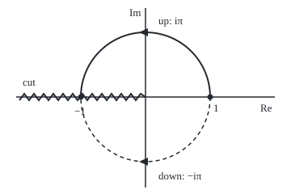
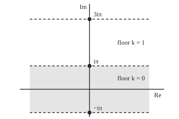

# The complex logarithm: undo e^z, and find infinitely many answers a floor apart

[Syllabus](../../../SYLLABUS.md) → [Complex analysis](../README.md) → [Holomorphic Functions](../README.md#s02) → The complex logarithm

---

## General Overview

A car park has a spiral ramp. One full circuit climbs one floor. On the plan, a ground-floor bay and the bay directly above it are the same spot. The plan says where, not which floor.

The complex exponential works the same way. By [Euler's formula](../01-Complex%20Numbers%20and%20the%20Plane/04-eulers-formula.md), e to the power u + iv is the arrow of length e^u at angle v. Add a full turn, 2π, to the angle and the arrow lands on the same point. So the exponent giving −1 has an answer on every floor: iπ, 3iπ, −iπ, and so on.

From here on a floor is called a **branch**. The house rule picks one, the **principal branch**, written Log with a capital L, which keeps the angle in (−π, π]. Then Log(−1) = iπ. The price is a wall, the **branch cut**, along the negative real axis, where the answer jumps by 2πi. It breaks a familiar law: Log((−1)(−1)) = Log 1 = 0, yet 2 Log(−1) = 2πi.

**Every nonzero z has infinitely many logarithms, ln|z| + i(arg z + 2πk), one per whole number k; the angle in (−π, π] gives Log z, which has derivative 1/z off the negative real axis and adds over products only up to a multiple of 2πi.**

**What kind of fact this is:** a definition, with the principal branch a convention; the derivative 1/z and the 2πi slip are theorems, proved on this card in Why it works.

### The picture: two ways up the ramp to −1

<p align="center"></p>

To scale: 80 units per 1, 0 at (180, 120); 1 at (260.00, 120.00), −1 at (100.00, 120.00), arc tops at (180.00, 40.00) and (180.00, 200.00). The solid arc, anticlockwise, collects iπ; the dashed arc, clockwise, collects −iπ. The zigzag is the cut.

---

## The formula

Notation first, in words. Lower-case $\log z$ is the whole list of logarithms of z, one per floor. $\arg z$ is any angle of z; $\operatorname{Arg} z$, capital A, is the **principal argument**, the one angle in (−π, π]. The real natural log stays $\ln$.

$$\log z = \ln\lvert z\rvert + i\,(\operatorname{Arg} z + 2\pi k), \qquad k = 0, \pm 1, \pm 2, \dots$$

**Read it aloud:** a logarithm of z is the real log of its length, plus i times its angle, plus any whole number of full turns.

$$\operatorname{Log} z = \ln\lvert z\rvert + i\,\operatorname{Arg} z, \qquad \frac{d}{dz}\operatorname{Log} z = \frac{1}{z}$$

**Read it aloud:** the principal logarithm takes the ground floor, and off the cut its slope at z is one over z.

$$\operatorname{Log}(zw) = \operatorname{Log} z + \operatorname{Log} w + 2\pi i N, \qquad N \in \{-1, 0, 1\}$$

**Read it aloud:** the log of a product is the sum of the logs, corrected by at most one full turn.

| Symbol | Plain meaning | In our example | Push it up and the answer… |
| --- | --- | --- | --- |
| $z$, $w$ | points in the plane; two factors | −1 and −1 | — |
| $u$, $v$ | real and imaginary parts of a logarithm | 0 and π | u stretches, v turns |
| $\lvert z\rvert$, $\ln$ | length of z; the real natural log | 1; ln 1 = 0 | real part grows |
| $\arg z$, $\operatorname{Arg} z$ | any angle of z; the one in (−π, π] | π, 3π, −π; π | — |
| $k$, $N$ | the floor; turns the product law loses | −1, 0, 1; −1 | each step adds 2πi |
| $\log z$, $\operatorname{Log} z$ | all the logarithms; the principal one | −iπ, iπ, 3iπ; iπ | — |
| $e$, $i$, $\pi$ | base of natural logs; the quarter turn, i^2 = −1; half a turn | e^(iπ) = −1 | — |
| $h$ | a small step | 0.001 | quotients drift from their limits |

### When it holds

- **z is not 0.** e^w is never 0, so 0 has no logarithm at all.
- **Off the cut, for the derivative.** On the negative real axis Log jumps by 2πi, so it has no slope there: from below at −1 the slope quotient reads 6282.185308.
- **Product law: the angles must stay on the ground floor.** If Arg z + Arg w lies in (−π, π], N = 0; at z = w = −1 they add to 2π and N = −1.

---

## Why it works

### Step 0: the exponential forgets full turns

$e^{w + 2\pi i} = e^w$ for every w. A function sending two inputs to one output has no single undo ([Inverse functions](../../01-Foundations/08-Relations%20and%20Functions/05-inverse-functions.md)). So undoing $e^w$ gives a list, and a single-valued logarithm must pick one member.

### Step 1: solve e^w = z, length and angle separately

Write w = u + iv, with u and v real. Then $e^w = e^u e^{iv}$: length $e^u$, angle v. Two arrows are equal when lengths match and angles differ by whole turns.

- **Length:** $e^u = \lvert z\rvert$. The real exponential takes each positive value once, so u = ln |z| ([Logarithms](../../01-Foundations/03-Powers%2C%20Roots%20and%20Logarithms/05-logarithms.md)).
- **Angle:** v is any angle of z: Arg z + 2πk, one for each whole number k.

At z = −1: u = ln 1 = 0 and v = π + 2πk. The floors k = −1, 0, 1 give −iπ, iπ, 3iπ.

### Step 2: choose the ground floor

Taking k = 0 with the angle in (−π, π] defines Log z. On a positive real x the angle is 0, so Log x = ln x: the complex log extends the real one.

### Step 3: the cut, and why some cut is forced

At −1 + 0.001i the angle is 3.140593; at −1 − 0.001i it is −3.140593. The jump, 6.281185, tends to 2π as the step shrinks. Everywhere else Arg z moves continuously.

Some jump is forced. A continuous angle followed once round 0 gains 2π, so no rule is continuous on any loop round 0. So some line from 0 out to infinity must be removed; the house rule removes the negative real axis.

The ramp shows it. Drive from 1, adding up each small step divided by the current position, as ln x adds up dt/t on the real line. Round the upper half-circle to −1 the total is iπ; round the lower half, −iπ; one and a half turns anticlockwise, 3iπ. Same endpoint, different floors. That total is the integral of 1/z along the path, made careful in [Antiderivatives](../03-Contour%20Integrals%20and%20Cauchy%27s%20Theorem/02-antiderivatives-and-path-independence.md).

### The picture: the floors seen from the side

<p align="center"></p>

To scale: 15 units per 1, 0 at (180, 180). The dots at (180.00, 227.12), (180.00, 132.88) and (180.00, 38.63) are −iπ, iπ and 3iπ, all sent to −1 by the exponential. The shaded strip is the ground floor, Log's values.

### Step 4: the slope of Log is 1/z

Off the cut, Log is continuous and $e^{\operatorname{Log} z} = z$. With a = Log z and b = Log(z + h), the slope quotient is

$$\frac{\operatorname{Log}(z+h) - \operatorname{Log} z}{h} = \frac{b - a}{e^b - e^a}.$$

As h shrinks, b tends to a by continuity, and the right side tends to one over the slope of $e^w$ at a. That slope is $e^a$ ([The elementary functions](03-exponential-sine-and-cosine-in-the-plane.md)), and $e^a = z$. So the slope is 1/z from every direction: Log is **holomorphic** (it has a complex derivative at every point) on the plane with the cut removed.

At z = i, Log i = 1.570796i, and the slope quotients with a real step and an imaginary step both give −i, which is 1/i.

<details>
<summary>Detailed proof: the Cauchy-Riemann check</summary>

Off the cut write z = x + iy. Log has real part U = (1/2) ln(x^2 + y^2) and imaginary part V, the principal angle, a smooth function with tan V = y/x (or cot V = x/y where x = 0).

Differentiating: $U_x = x/\lvert z\rvert^2$, $U_y = y/\lvert z\rvert^2$, $V_x = -y/\lvert z\rvert^2$, $V_y = x/\lvert z\rvert^2$.

So $U_x = V_y$ and $U_y = -V_x$: the Cauchy-Riemann equations of [The complex derivative](01-complex-derivative-and-cauchy-riemann.md) hold, with all four partial derivatives continuous. The derivative is $U_x + iV_x = (x - iy)/\lvert z\rvert^2$, which is 1/z.

</details>

### Step 5: the product law slips by whole turns

Since $e^{a+b} = e^a e^b$, any logarithm of z plus any logarithm of w is a logarithm of zw. Only the floor goes wrong. Arg z + Arg w lies in (−2π, 2π]; if it leaves (−π, π], Log(zw) pulls it back one full turn, so N is −1 or 1.

At z = w = −1 the angles add to 2π. Log 1 = 0, but 2 Log(−1) = 2πi: N = −1. On the ramp, driving once round collects 6.283185i, one floor.

A second road to Log: it is the one antiderivative of 1/z on the cut plane that is 0 at z = 1. The code's ramp sum builds it that way; driven past the cut, it climbs to other floors.

---

## Worked numbers, by hand

| Step | Arithmetic | Value |
| --- | --- | --- |
| Length of −1 | ln 1 | 0 |
| Angles of −1 | π + 2πk, for k = −1, 0, 1 | −3.141593, 3.141593, 9.424778 |
| The three floors | 0 + i × angle | −iπ, iπ, 3iπ |
| Ground floor | angle in (−π, π] | **Log(−1) = iπ = 3.141593i** |
| Product first | (−1)(−1) = 1, and Log 1 | 0 |
| Logs first | 2 × iπ | 6.283185i |
| The slip | 0 − 6.283185i | **−2πi, one floor** |

### What breaks if you drop a piece

| Mistake | Comes out at | What went wrong |
| --- | --- | --- |
| Angle by atan(y/x) at −1 + 0.001i | −0.001000i, not 3.140593i | atan cannot tell z from −z; atan2 reads both signs |
| Log(zw) = Log z + Log w at z = w = −1 | 6.283185i, not 0 | The angles summed past π |
| Slope of Log at −1, from below, step 0.001 | 6282.185308 | Log jumps 6.281185 across the cut |

Both checks print all three.

---

## Code, from first principles, and it actually runs

Two roads to the logarithms of −1. Road one is the formula, with atan2 for the angle. Road two drives the ramp from 1, adding each small step over the mean position, and never calls atan2; its error at half a turn falls from 0.026096 with 10 steps to 0.000258 with 100 and 0.000003 with 1000. Four asserts compare the two roads, each floor's exponential with −1, the slopes at i with 1/i, and the slip with one circuit.

### Python

```python
# The complex logarithm -- the check behind the card.  Standard library only.
# Road one: the formula, ln|z| + i(atan2(y, x) + 2 pi k), one value per floor k.
# Road two: drive the ramp.  From 1, add up each small step divided by the
# position there: a sum of small relative changes that never calls atan2.
import math

def log_floor(z, k=0):                        # ln|z| + i(Arg z + 2 pi k); k = 0 is Log
    return complex(math.log(math.hypot(z.real, z.imag)), math.atan2(z.imag, z.real) + 2 * math.pi * k)

def exp(w):                                   # e^w = e^u (cos v + i sin v)
    return math.exp(w.real) * complex(math.cos(w.imag), math.sin(w.imag))

def drive(turn, steps=100000):                # from 1 round the unit circle by 'turn' radians
    total, prev = 0j, 1 + 0j
    for n in range(1, steps + 1):
        here = exp(1j * turn * n / steps)
        total += (here - prev) / ((here + prev) / 2)    # step over mean position
        prev = here
    return total

def show(w):                                  # 'a + bi', six decimals, no -0.000000
    a, b = round(w.real, 6) + 0.0, round(w.imag, 6) + 0.0
    return f"{a:.6f} {'-' if b < 0 else '+'} {abs(b):.6f}i"

pi, h = math.pi, 0.001
for k in (-1, 0, 1):
    w = log_floor(-1 + 0j, k)
    print(f"floor k = {k:2d}: log(-1) = {show(w)}, e^log = {show(exp(w))}")
ramps = {"half turn down (0 to -pi)": -pi, "half turn up (0 to pi)": pi,
         "one and a half turns up (0 to 3 pi)": 3 * pi, "one full turn (0 to 2 pi)": 2 * pi}
sums = {name: drive(t) for name, t in ramps.items()}
for name, s in sums.items():
    print(f"ramp, {name}: {show(s)}")
errs = [abs(drive(pi, n) - 1j * pi) for n in (10, 100, 1000)]
print("ramp error, half turn up, 10 / 100 / 1000 steps: " + " / ".join(f"{e:.6f}" for e in errs))
L = log_floor(-1 + 0j)
print(f"Log(-1) = {show(L)}; Log((-1)(-1)) = Log 1 = {show(log_floor(1 + 0j))}; 2 Log(-1) = {show(2 * L)}")
above, below = log_floor(complex(-1, h)), log_floor(complex(-1, -h))
print(f"just above the cut, Log(-1 + 0.001i) = {show(above)}")
print(f"just below the cut, Log(-1 - 0.001i) = {show(below)}; jump {abs(above - below):.6f}")
d_re = (log_floor(1j + h) - log_floor(1j - h)) / (2 * h)
d_im = (log_floor(1j + 1j * h) - log_floor(1j - 1j * h)) / (2j * h)
print(f"Log i = {show(log_floor(1j))}; slope at i, real step {show(d_re)}, imaginary step {show(d_im)}; 1/i = {show(1 / 1j)}")
wrong = complex(math.log(math.hypot(-1, h)), math.atan(h / -1))
print(f"mistake, atan(y/x) for the angle at -1 + 0.001i: {show(wrong)}")
print(f"mistake, slope of Log at -1 from below, step -0.001i: {show((below - L) / (-1j * h))}")
px = lambda z: f"({180 + 80 * z.real:.2f}, {120 - 80 * z.imag:.2f})"    # 80 units per 1, 0 at (180, 120)
print(f"figure, z-plane: 1 at {px(exp(0j))}, -1 at {px(exp(L))}, arc tops {px(exp(1j * pi / 2))} and {px(exp(-1j * pi / 2))}")
print("figure, w-plane: dots at x = 180.00, y = " + ", ".join(f"{180 - 15 * log_floor(-1 + 0j, k).imag:.2f}" for k in (-1, 0, 1)))
assert all(abs(drive(pi * (2 * k + 1)) - log_floor(-1 + 0j, k)) < 1e-7 for k in (-1, 0, 1))
assert all(abs(exp(log_floor(-1 + 0j, k)) + 1) < 1e-12 for k in (-1, 0, 1))
assert abs(d_re - 1 / 1j) < 1e-6 and abs(d_im - 1 / 1j) < 1e-6
assert abs((2 * L - log_floor(1 + 0j)) - sums["one full turn (0 to 2 pi)"]) < 1e-7
print("ALL CHECKS PASS")
```

**Ran 2026-09-28 on macOS, Python 3.14.6, standard library only. All checks passed. Output, pasted from the run:**

```
floor k = -1: log(-1) = 0.000000 - 3.141593i, e^log = -1.000000 + 0.000000i
floor k =  0: log(-1) = 0.000000 + 3.141593i, e^log = -1.000000 + 0.000000i
floor k =  1: log(-1) = 0.000000 + 9.424778i, e^log = -1.000000 + 0.000000i
ramp, half turn down (0 to -pi): 0.000000 - 3.141593i
ramp, half turn up (0 to pi): 0.000000 + 3.141593i
ramp, one and a half turns up (0 to 3 pi): 0.000000 + 9.424778i
ramp, one full turn (0 to 2 pi): 0.000000 + 6.283185i
ramp error, half turn up, 10 / 100 / 1000 steps: 0.026096 / 0.000258 / 0.000003
Log(-1) = 0.000000 + 3.141593i; Log((-1)(-1)) = Log 1 = 0.000000 + 0.000000i; 2 Log(-1) = 0.000000 + 6.283185i
just above the cut, Log(-1 + 0.001i) = 0.000000 + 3.140593i
just below the cut, Log(-1 - 0.001i) = 0.000000 - 3.140593i; jump 6.281185
Log i = 0.000000 + 1.570796i; slope at i, real step 0.000000 - 1.000000i, imaginary step 0.000000 - 1.000000i; 1/i = 0.000000 - 1.000000i
mistake, atan(y/x) for the angle at -1 + 0.001i: 0.000000 - 0.001000i
mistake, slope of Log at -1 from below, step -0.001i: 6282.185308 + 0.000500i
figure, z-plane: 1 at (260.00, 120.00), -1 at (100.00, 120.00), arc tops (180.00, 40.00) and (180.00, 200.00)
figure, w-plane: dots at x = 180.00, y = 227.12, 132.88, 38.63
ALL CHECKS PASS
```

### Rust

Same numbers, same labels, built with `rustc --edition 2021 -O`.

```rust
// The complex logarithm -- the same check as the Python, in Rust.  No crates.
// Road one: the formula, ln|z| + i(atan2(y, x) + 2 pi k), one value per floor k.
// Road two: drive the ramp.  From 1, add up each small step divided by the
// position there: a sum of small relative changes that never calls atan2.
use std::f64::consts::PI;
#[derive(Clone, Copy)]
struct C { re: f64, im: f64 }
fn c(re: f64, im: f64) -> C { C { re, im } }
fn add(a: C, b: C) -> C { c(a.re + b.re, a.im + b.im) }
fn sub(a: C, b: C) -> C { c(a.re - b.re, a.im - b.im) }
fn scale(a: C, k: f64) -> C { c(a.re * k, a.im * k) }
fn div(a: C, b: C) -> C {
    let d = b.re * b.re + b.im * b.im;
    c((a.re * b.re + a.im * b.im) / d, (a.im * b.re - a.re * b.im) / d)
}
fn abs(a: C) -> f64 { a.re.hypot(a.im) }
fn log_floor(z: C, k: i32) -> C { // ln|z| + i(Arg z + 2 pi k); k = 0 is Log
    c(abs(z).ln(), z.im.atan2(z.re) + 2.0 * PI * k as f64)
}
fn exp(w: C) -> C { scale(c(w.im.cos(), w.im.sin()), w.re.exp()) } // e^u (cos v + i sin v)
fn drive(turn: f64, steps: usize) -> C { // from 1 round the unit circle by 'turn' radians
    let (mut total, mut prev) = (c(0.0, 0.0), c(1.0, 0.0));
    for n in 1..=steps {
        let here = exp(c(0.0, turn * n as f64 / steps as f64));
        total = add(total, div(sub(here, prev), scale(add(here, prev), 0.5))); // step over mean position
        prev = here;
    }
    total
}
fn show(w: C) -> String { // 'a + bi', six decimals, no -0.000000
    let a = format!("{:.6}", w.re);
    let a = if a == "-0.000000" { "0.000000".to_string() } else { a };
    let b = format!("{:.6}", w.im.abs());
    let sign = if w.im < 0.0 && b != "0.000000" { '-' } else { '+' };
    format!("{} {} {}i", a, sign, b)
}
fn px(z: C) -> String { format!("({:.2}, {:.2})", 180.0 + 80.0 * z.re, 120.0 - 80.0 * z.im) } // 80 units per 1

fn main() {
    let (h, m1, one, i) = (0.001, c(-1.0, 0.0), c(1.0, 0.0), c(0.0, 1.0));
    for k in [-1, 0, 1] {
        let w = log_floor(m1, k);
        println!("floor k = {:2}: log(-1) = {}, e^log = {}", k, show(w), show(exp(w)));
    }
    let ramps = [("half turn down (0 to -pi)", -PI), ("half turn up (0 to pi)", PI),
        ("one and a half turns up (0 to 3 pi)", 3.0 * PI), ("one full turn (0 to 2 pi)", 2.0 * PI)];
    let sums: Vec<C> = ramps.iter().map(|r| drive(r.1, 100000)).collect();
    for (r, s) in ramps.iter().zip(&sums) { println!("ramp, {}: {}", r.0, show(*s)); }
    let errs: Vec<String> = [10usize, 100, 1000].iter().map(|&n| format!("{:.6}", abs(sub(drive(PI, n), c(0.0, PI))))).collect();
    println!("ramp error, half turn up, 10 / 100 / 1000 steps: {}", errs.join(" / "));
    let l = log_floor(m1, 0);
    println!("Log(-1) = {}; Log((-1)(-1)) = Log 1 = {}; 2 Log(-1) = {}", show(l), show(log_floor(one, 0)), show(scale(l, 2.0)));
    let (above, below) = (log_floor(c(-1.0, h), 0), log_floor(c(-1.0, -h), 0));
    println!("just above the cut, Log(-1 + 0.001i) = {}", show(above));
    println!("just below the cut, Log(-1 - 0.001i) = {}; jump {:.6}", show(below), abs(sub(above, below)));
    let d_re = div(sub(log_floor(c(h, 1.0), 0), log_floor(c(-h, 1.0), 0)), c(2.0 * h, 0.0));
    let d_im = div(sub(log_floor(c(0.0, 1.0 + h), 0), log_floor(c(0.0, 1.0 - h), 0)), c(0.0, 2.0 * h));
    let inv_i = div(one, i);
    println!("Log i = {}; slope at i, real step {}, imaginary step {}; 1/i = {}", show(log_floor(i, 0)), show(d_re), show(d_im), show(inv_i));
    let wrong = c((-1.0f64).hypot(h).ln(), (h / -1.0).atan());
    println!("mistake, atan(y/x) for the angle at -1 + 0.001i: {}", show(wrong));
    println!("mistake, slope of Log at -1 from below, step -0.001i: {}", show(div(sub(below, l), c(0.0, -h))));
    println!("figure, z-plane: 1 at {}, -1 at {}, arc tops {} and {}", px(exp(c(0.0, 0.0))), px(exp(l)), px(exp(c(0.0, PI / 2.0))), px(exp(c(0.0, -PI / 2.0))));
    let ys: Vec<String> = [-1, 0, 1].iter().map(|&k| format!("{:.2}", 180.0 - 15.0 * log_floor(m1, k).im)).collect();
    println!("figure, w-plane: dots at x = 180.00, y = {}", ys.join(", "));
    assert!([-1, 0, 1].iter().all(|&k| abs(sub(drive(PI * (2 * k + 1) as f64, 100000), log_floor(m1, k))) < 1e-7));
    assert!([-1, 0, 1].iter().all(|&k| abs(add(exp(log_floor(m1, k)), one)) < 1e-12));
    assert!(abs(sub(d_re, inv_i)) < 1e-6 && abs(sub(d_im, inv_i)) < 1e-6);
    assert!(abs(sub(sub(scale(l, 2.0), log_floor(one, 0)), sums[3])) < 1e-7);
    println!("ALL CHECKS PASS");
}
```

**Ran 2026-09-28 on macOS, rustc 1.98.1, no crates. All checks passed. Output, pasted from the run:**

```
floor k = -1: log(-1) = 0.000000 - 3.141593i, e^log = -1.000000 + 0.000000i
floor k =  0: log(-1) = 0.000000 + 3.141593i, e^log = -1.000000 + 0.000000i
floor k =  1: log(-1) = 0.000000 + 9.424778i, e^log = -1.000000 + 0.000000i
ramp, half turn down (0 to -pi): 0.000000 - 3.141593i
ramp, half turn up (0 to pi): 0.000000 + 3.141593i
ramp, one and a half turns up (0 to 3 pi): 0.000000 + 9.424778i
ramp, one full turn (0 to 2 pi): 0.000000 + 6.283185i
ramp error, half turn up, 10 / 100 / 1000 steps: 0.026096 / 0.000258 / 0.000003
Log(-1) = 0.000000 + 3.141593i; Log((-1)(-1)) = Log 1 = 0.000000 + 0.000000i; 2 Log(-1) = 0.000000 + 6.283185i
just above the cut, Log(-1 + 0.001i) = 0.000000 + 3.140593i
just below the cut, Log(-1 - 0.001i) = 0.000000 - 3.140593i; jump 6.281185
Log i = 0.000000 + 1.570796i; slope at i, real step 0.000000 - 1.000000i, imaginary step 0.000000 - 1.000000i; 1/i = 0.000000 - 1.000000i
mistake, atan(y/x) for the angle at -1 + 0.001i: 0.000000 - 0.001000i
mistake, slope of Log at -1 from below, step -0.001i: 6282.185308 + 0.000500i
figure, z-plane: 1 at (260.00, 120.00), -1 at (100.00, 120.00), arc tops (180.00, 40.00) and (180.00, 200.00)
figure, w-plane: dots at x = 180.00, y = 227.12, 132.88, 38.63
ALL CHECKS PASS
```

The two outputs match line for line.

> [!TIP]
> **Try changing**
> Guess first, then run it.
> - **A coarser ramp.** In `drive`, set `steps=100`. The first assert stops it: the ramp misses 3iπ by more than the tolerance.
> - **A wrong angle.** Replace `math.atan2(z.imag, z.real)` with `math.atan(z.imag / z.real)`. The run halts before the asserts: at i, where x = 0, y/x divides by zero. Short of that, atan puts −1 at angle 0.
> - **A wrong floor spacing.** Replace `2 * math.pi * k` with `math.pi * k`. The first assert stops it: the floor below reads 0 while the ramp collects −iπ.

---

## The usual mistake

> [!warning]
> **Carrying the real log's laws over unchanged.** Log(zw) = Log z + Log w and Log(e^w) = w hold on the real line because the real exponential never repeats. The complex one repeats every 2πi, so both hold only up to whole turns: Log(e^(3iπ)) is iπ, not 3iπ.
>
> - **atan(y/x) for the angle.** It reads −1 + 0.001i as −0.001000i, not 3.140593i.
> - **Log(z^2) = 2 Log z.** At z = −1 it gives 6.283185i; the truth is 0.
> - **A logarithm of 0.** None exists: e^w is never 0.

---

## Where you meet it in real life

- **Phase unwrapping.** Radar, MRI and audio read a signal's angle as the principal argument, which jumps by 2π; unwrapping picks the floor continuously, as the ramp sum does.
- **Complex powers.** z^a is defined as e^(a log z), so every power inherits the floors and the cut: [Branch cuts and complex powers](05-branch-cuts-and-complex-powers.md).
- **Products into sums.** Infinite products become sums of logs, with the 2πi slip kept in check: [Infinite products](../09-Special%20Functions%20and%20the%20Zeta%20Function/01-infinite-products.md).

> **Say it back**
> The exponential forgets full turns, so every nonzero z has infinitely many logarithms: ln of its length plus i times any of its angles. The angle in (−π, π] gives Log z, and Log(−1) = iπ. The price is a cut along the negative real axis, where Log jumps by 2πi. Off the cut, Log has derivative 1/z. Products slip by whole turns: Log 1 = 0, yet 2 Log(−1) = 2πi.

---

## What this builds on

- [Euler's formula](../01-Complex%20Numbers%20and%20the%20Plane/04-eulers-formula.md): e^(u+iv) as length e^u at angle v.
- [The complex derivative](01-complex-derivative-and-cauchy-riemann.md): holomorphic, and the equations the Detailed proof checks.
- [Logarithms](../../01-Foundations/03-Powers%2C%20Roots%20and%20Logarithms/05-logarithms.md): the real natural log in the real part.
- [Inverse functions](../../01-Foundations/08-Relations%20and%20Functions/05-inverse-functions.md): why a function that repeats has no single undo.

## Where this goes next

- [Branch cuts and complex powers](05-branch-cuts-and-complex-powers.md): powers and roots built on the log, and cuts in general.
- [Antiderivatives](../03-Contour%20Integrals%20and%20Cauchy%27s%20Theorem/02-antiderivatives-and-path-independence.md): the ramp sum as the integral of 1/z.
- [Conformal maps](../07-Conformal%20Maps%20and%20Harmonic%20Functions/01-conformal-maps.md): Log unrolls the plane into a strip.
- [Infinite products](../09-Special%20Functions%20and%20the%20Zeta%20Function/01-infinite-products.md): products turned into sums of logs.
- [The zeta function](../09-Special%20Functions%20and%20the%20Zeta%20Function/05-zeta-function-and-euler-product.md): the log of the zeta function as a sum over primes.

The log now has one value per point, bought with a cut; how many values i^i has, and where its cut goes, is the open question.

---

## Sources

Verified 28 Sep 2026: every link below resolves to the publisher's page.

- Olver, F. W. J., et al., eds. *NIST Digital Library of Mathematical Functions*, §4.2 and §4.8. [DLMF 4.2](https://dlmf.nist.gov/4.2) and [DLMF 4.8](https://dlmf.nist.gov/4.8). The principal branch, its cut, and when the product law holds exactly.
- Orloff, Jeremy. "Topic 2: Analytic functions." MIT OpenCourseWare 18.04, Spring 2018. [Course notes](https://ocw.mit.edu/courses/18-04-complex-variables-with-applications-spring-2018/resources/mit18_04s18_topic2/). Branches of log and their derivative.
- Stein, Elias M., and Rami Shakarchi. *Complex Analysis*. Princeton University Press, 2003. [Publisher page](https://press.princeton.edu/books/hardcover/9780691113852/complex-analysis). Chapter 3 builds the logarithm on a region with no holes.
