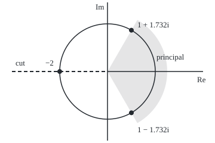
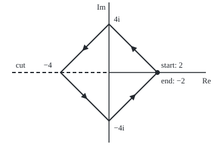

# Branch cuts and complex powers: z to the a is e to the a log z, it depends on the branch, and software picks one for you

Complex analysis → Holomorphic Functions → Many-valued powers → Branch cuts and complex powers

---

## General Overview

Type (−8)^(1/3) into a scientific calculator in complex mode. It answers 1 + 1.732i, not −2, and so does Python 3. Nothing is broken: −8 has three cube roots, and the machine must return one.

A power with a fractional or complex exponent is defined through the logarithm. A nonzero complex number has infinitely many logarithms, one per whole turn added to its angle. Each consistent choice gives a **branch** of the power. The standard **principal branch** keeps the angle between −π and π, at the price of a **branch cut**: a ray, here the negative real axis, where the value jumps.

Walk z once round 0 and follow its square root without lifting the pen: it returns as minus itself. A program that recomputes the principal value at each step jumps instead, mid-calculation.

**A complex power z^a is e^(a log z); each choice of logarithm is a branch, the principal branch keeps the angle in (−π, π], and crossing its cut upward multiplies the value by e^(2πia).**

**What kind of fact this is:** a definition (the power) and a convention (the principal branch and its cut); the count of values and the size of the jump are proved on this card in Why it works.

### The picture: the three cube roots of −8, and the one the calculator picks

<p align="center"></p>

Drawn to scale at 40 units per 1, 0 at the centre. The dots are the cube roots of −8, on the circle of radius 2. The shaded wedge, angles from −π/3 to π/3, is where every principal cube root lands. The dashed ray is the cut.

---

## The formula

Reminder: a logarithm $\log z$ of a nonzero z is any number whose exponential is z: real part ln|z|, imaginary part an angle of z, known up to whole turns ([complex-logarithm](04-complex-logarithm.md)). The principal logarithm $\operatorname{Log} z$ uses the principal argument $\operatorname{Arg} z$, the angle in (−π, π].

$$z^a = e^{a \log z} = e^{a(\ln|z| + i\operatorname{Arg} z + 2\pi i k)}, \qquad k = 0, \pm 1, \pm 2, \dots$$

**Read it aloud:** z to the a is e to the a times a logarithm of z; each whole number k of extra turns is a branch, and k = 0 is the principal value.

Branches differ by the factor $e^{2\pi i a k}$. Across the cut the principal value jumps by one such factor:

$$\frac{\text{principal value just above the cut}}{\text{principal value just below the cut}} = e^{2\pi i a}$$

**Read it aloud:** stepping up across the negative real axis multiplies the principal power by e to the 2 pi i a.

| Symbol | Plain meaning | In our example | Push it up and the answer… |
| --- | --- | --- | --- |
| $z$ | the number raised to a power | −8; i; 4 | — |
| $a$ | the exponent, any complex number | 1/3; i; 1/2 | — |
| $\log z$, $\operatorname{Log} z$ | any logarithm; the principal one | ln 8 + iπ for −8 | — |
| $\operatorname{Arg} z$ | the principal argument, in (−π, π] | π for −8 | the power turns further |
| $k$ | extra whole turns in the logarithm | 0 principal; 1 gives −2 | the next branch |
| $p$, $q$ | a fractional exponent's top and bottom, lowest terms | 1 and 3 | more values |
| $e^{2\pi i a}$ | the jump at the cut; one loop's factor | −0.5 + 0.866025i | — |
| $u$ | one step's small change, z_new/z_old − 1 | at most 0.0005 on the diamond walk | more series terms |

### When it holds

- **z not 0.** Zero has no logarithm. 0 is the **branch point**: the point a loop must circle to change the value.
- **The principal value is a convention.** Angles in [0, 2π) give another function, equal in the upper half-plane, different below.
- **Off the cut the principal power is holomorphic** (it has a complex derivative at each point: [complex-derivative-and-cauchy-riemann](01-complex-derivative-and-cauchy-riemann.md)), with derivative a z^a / z. On the cut it is not even continuous.
- **Laws of exponents lose their guarantee.** (zw)^a = z^a w^a can fail by a factor $e^{2\pi i a k}$.

---

## Why it works

### Step 0: a power has to be built from the logarithm

For positive x, x^a = e^(a ln x), as 8^(1/3) = e^(ln 8 / 3) = 2. Nothing else can say what i^i means, so that rule becomes the definition, and questions about powers become questions about logarithms.

### Step 1: many logarithms give many powers

The exponential repeats every 2πi ([exponential-sine-and-cosine-in-the-plane](03-exponential-sine-and-cosine-in-the-plane.md)), so the logarithms of z are Log z + 2πik, and

$$e^{a(\operatorname{Log} z + 2\pi i k)} = e^{a \operatorname{Log} z} \cdot e^{2\pi i a k}$$

For i^i: Log i = iπ/2, so i · Log i = −π/2 and the principal value is e^(−π/2) = 0.207880, a real number. The other values are e^(−π/2 − 2πk): e^(−5π/2) = 0.000388 for k = 1, e^(3π/2) = 111.317778 for k = −1. All real.

### Step 2: count the values

Branch k repeats the principal value when $e^{2\pi i a k} = 1$, that is, when ak is a whole number. Whole a: one value. a = p/q in lowest terms: the factors repeat every q steps of k, so q values: the q-th roots of z^p ([powers-roots-and-roots-of-unity](../01-Complex%20Numbers%20and%20the%20Plane/05-powers-roots-and-roots-of-unity.md)). Any other a: infinitely many, as i^i shows.

For (−8)^(1/3): Log(−8) = ln 8 + iπ, and a third of it is ln 2 + iπ/3. The principal value is 2(cos π/3 + i sin π/3) = 1 + 1.732051i. k = 1 adds a turn: 2(cos π + i sin π) = −2. k = −1 gives 1 − 1.732051i. The real cube root is a branch, not the principal one.

### Step 3: the cut is where the principal angle jumps

Approaching −8 from above, the angle climbs to π; from below, it falls to −π. Arg z jumps by 2π across the negative real axis and nowhere else, so the principal power jumps by $e^{2\pi i a}$ there. At −8 the cube root reads 1 + 1.732051i above and 1 − 1.732051i below: ratio −0.5 + 0.866025i. For the square root the factor is −1: a sign flip.

The cut must run from 0 to infinity, so that every loop round 0 crosses it. Which ray is a choice; the negative real axis spares the positive reals.

### Step 4: follow a value instead of recomputing it

Walk a path in small steps. Each step multiplies z by 1 + u, with u small, so it multiplies the power by $(1 + u)^a$. For small u that is the binomial series 1 + au + a(a − 1)u^2/2 + …, which needs no logarithm and no choice ([complex-power-series](02-complex-power-series.md)). The product is the value **followed continuously**; it depends on the path only through how often it circled 0.

Walk the diamond 4 → 4i → −4 → −4i → 4 from √4 = 2. The followed square root runs 2 → 1.414214 + 1.414214i → 2i → −1.414214 + 1.414214i → −2. The principal value agrees until the walk crosses the cut, then reads 1.414214 − 1.414214i at −4i and 2 at the end.

<details>
<summary>Detailed proof: the followed value is e^(a × the angle turned)</summary>

Cut the path at z_0, z_1, …, z_N so each ratio z_(j+1)/z_j lies within distance 1 of 1. There the binomial series equals e^(a Log(1 + u)): both are 1 at u = 0 and satisfy f′ = a f/(1 + u). So the product is e^(a S), S the sum of Log(z_(j+1)/z_j). The real parts add to ln|z_N/z_0|. Each imaginary part is one step's small turn, with no hidden whole turn, so they add to θ, the total angle turned. The followed value is z_0^a · e^(a(ln|z_N/z_0| + iθ)). One anticlockwise loop has θ = 2π and multiplies by e^(2πia); a closed path not circling 0 has θ = 0.

</details>

<details>
<summary>Two floors: the Riemann surface of the square root</summary>

Stack two copies of the plane, each cut along the negative real axis, and glue each floor's upper cut edge to the other floor's lower edge. Put √z on floor one, −√z on floor two. One walk round 0 climbs a floor; a second climbs back. On this surface the square root is one continuous function, and the cut is only the seam. z^(1/3) needs three floors, z^i infinitely many: riemann-surfaces-and-the-weierstrass-p-function.

</details>

### The picture: one walk round 0 turns the square root into minus itself

<p align="center"></p>

Drawn to scale at 20 units per 1, 0 at the centre, walked anticlockwise. At the dashed cut the principal value jumps; the followed value does not.

---

## Worked numbers, by hand

| Step | Arithmetic | Value |
| --- | --- | --- |
| i^i, principal | e^(−π/2) | **0.207880** |
| a third of Log(−8) | (ln 8 + iπ)/3 | ln 2 + iπ/3 |
| (−8)^(1/3), principal | 2(cos π/3 + i sin π/3) | **1 + 1.732051i** |
| k = 1 | 2(cos π + i sin π) | −2 |
| jump at the cut, a = 1/3 | cos 2π/3 + i sin 2π/3 | −0.5 + 0.866025i |
| √z after one loop from 2 | 2 · e^(πi) | **−2** |

The calculator's answer takes a third of −8's principal angle; school algebra's −2 is the next branch round.

### What breaks if you drop a piece

| Mistake | Comes out at | What went wrong |
| --- | --- | --- |
| Expecting the real cube root | −2 | That is branch k = 1 |
| √(−1) · √(−1) = √1 | −1 against 1 | The angles add to 2π, outside (−π, π]: a factor −1 is lost |
| Recomputing principal √z along the walk | 2 at the end, not −2 | The cut was crossed and the value jumped |
| Taking i's angle as 5π/2 or −3π/2 | 0.000388 or 111.317778 | Other branches of i^i |

The code prints all four.

---

## Code, from first principles, and it actually runs

Road one is the principal formula, Log z from ln|z| and atan2. Road two takes no logarithm: it walks straight legs in 4,000 steps each, multiplying in the binomial series, so the path picks the branch. Newton's method on w^3 + 8 = 0, with w an unknown cube root, finds the three cube roots with no angle at all. The four asserts pit these roads against each other.

### Python

```python
# Branch cuts and complex powers.  Road one: the principal value e^(a Log z), Log z
# from ln|z| and atan2.  Road two takes no logarithm: it walks straight legs from a
# known value, multiplying in (1 + u)^a from the binomial series at each small step.
from math import log, exp, cos, sin, atan2, hypot, pi

def principal(z, a):                         # z^a = e^(a Log z), Arg in (-pi, pi]
    L = a * complex(log(hypot(z.real, z.imag)), atan2(z.imag, z.real))
    return exp(L.real) * complex(cos(L.imag), sin(L.imag))
def binom(u, a):                             # (1 + u)^a = sum of C(a, n) u^n, u small
    total, term, n = 0j, 1 + 0j, 0
    while abs(term) > 1e-18:
        total, term, n = total + term, term * (a - n) * u / (n + 1), n + 1
    return total
def walk(corners, a, w=1 + 0j, steps=4000):  # follow z^a continuously, corner to corner
    z, seen = corners[0], [w]
    for p, q in zip(corners, corners[1:]):
        for k in range(1, steps + 1):
            nz = p + (q - p) * k / steps
            w, z = w * binom(nz / z - 1, a), nz
        seen.append(w)
    return seen
def c(z):                                    # 'a + bi' to six decimals, no -0.000000
    re, im = round(z.real, 6) + 0.0, round(z.imag, 6) + 0.0
    return f"{re:.6f} {'-' if im < 0 else '+'} {abs(im):.6f}i"

I, THIRD = 1j, 1 / 3
ii, ii_walk = principal(I, I), walk([1, I], I)[-1]
ii_loop = walk([1, I, -1, -I, 1, I], I)[-1]  # once round the origin, then on to i
ii_back = walk([1, -I, -1, I], I)[-1]        # clockwise to i: angle -3pi/2
print("i^i, principal e^(i Log i)    ", c(ii), f"= e^(-pi/2) = {exp(-pi / 2):.6f}")
print("i^i, walked from 1 to i       ", c(ii_walk))
print("i^i, extra loop; clockwise    ", c(ii_loop), ";", c(ii_back))
print(f"e^(-5pi/2), e^(3pi/2)          {exp(-5 * pi / 2):.6f}, {exp(3 * pi / 2):.6f}")
cr, cr_walk = principal(-8 + 0j, THIRD), walk([1, 1 + 8j, -8 + 8j, -8], THIRD)[-1]
roots = []
for w in (1 + 2j, -3 + 0j, 1 - 2j):          # Newton on w^3 + 8 = 0: no angle used
    roots.append([w := w - (w ** 3 + 8) / (3 * w * w) for _ in range(60)][-1])
best = max(roots, key=lambda w: (round(w.real, 9), w.imag))  # rightmost, then upper
print("(-8)^(1/3), principal         ", c(cr))
print("(-8)^(1/3), walked above 0    ", c(cr_walk))
print("cube roots of -8, Newton      ", ", ".join(c(w) for w in roots))
above, below = principal(complex(-8, 1e-12), THIRD), principal(complex(-8, -1e-12), THIRD)
loop = walk([1, I, -1, -I, 1], THIRD)[-1]
print("(-8)^(1/3) just above, below  ", c(above), ",", c(below))
print("jump above/below; loop factor ", c(above / below), ";", c(loop))
corners = [4, 4 * I, -4, -4 * I, 4]
seen = walk(corners, 0.5, w=2 + 0j)
print("sqrt round 4, 4i, -4, -4i, 4:  principal   |   followed")
for z, w in zip(corners, seen):
    print(f"  z = {c(complex(z)):>22}  {c(principal(complex(z), 0.5)):>22}  {c(w):>22}")
s = principal(-1 + 0j, 0.5)
print("sqrt(-1) sqrt(-1), sqrt(1)    ", c(s * s), ",", c(principal(1 + 0j, 0.5)))
print("figure, 20 per 1, diamond", " ".join(f"{180 + 20 * z.real:.1f},{120 - 20 * z.imag:.1f}" for z in map(complex, corners[:4])))
print("figure, 40 per 1, cube roots", " ".join(f"{180 + 40 * w.real:.1f},{120 - 40 * w.imag:.1f}" for w in roots),
      f"wedge {180 + 100 * cos(pi / 3):.1f},{120 - 100 * sin(pi / 3):.1f}")
assert abs(ii - ii_walk) < 1e-9 and abs(ii_back - exp(3 * pi / 2)) < 1e-6
assert abs(cr - best) < 1e-9 and abs(cr - cr_walk) < 1e-9
assert abs(above / below - loop) < 1e-9     # the jump at the cut is one loop's factor
assert abs(seen[-1] + principal(4 + 0j, 0.5)) < 1e-9  # once round: sqrt z becomes -sqrt z
print("ALL CHECKS PASS")
```

**Ran 2026-09-28 on macOS, Python 3.14.6, standard library only. All checks passed. Output, pasted from the run:**

```
i^i, principal e^(i Log i)     0.207880 + 0.000000i = e^(-pi/2) = 0.207880
i^i, walked from 1 to i        0.207880 + 0.000000i
i^i, extra loop; clockwise     0.000388 + 0.000000i ; 111.317778 + 0.000000i
e^(-5pi/2), e^(3pi/2)          0.000388, 111.317778
(-8)^(1/3), principal          1.000000 + 1.732051i
(-8)^(1/3), walked above 0     1.000000 + 1.732051i
cube roots of -8, Newton       1.000000 + 1.732051i, -2.000000 + 0.000000i, 1.000000 - 1.732051i
(-8)^(1/3) just above, below   1.000000 + 1.732051i , 1.000000 - 1.732051i
jump above/below; loop factor  -0.500000 + 0.866025i ; -0.500000 + 0.866025i
sqrt round 4, 4i, -4, -4i, 4:  principal   |   followed
  z =   4.000000 + 0.000000i    2.000000 + 0.000000i    2.000000 + 0.000000i
  z =   0.000000 + 4.000000i    1.414214 + 1.414214i    1.414214 + 1.414214i
  z =  -4.000000 + 0.000000i    0.000000 + 2.000000i    0.000000 + 2.000000i
  z =   0.000000 - 4.000000i    1.414214 - 1.414214i   -1.414214 + 1.414214i
  z =   4.000000 + 0.000000i    2.000000 + 0.000000i   -2.000000 + 0.000000i
sqrt(-1) sqrt(-1), sqrt(1)     -1.000000 + 0.000000i , 1.000000 + 0.000000i
figure, 20 per 1, diamond 260.0,120.0 180.0,40.0 100.0,120.0 180.0,200.0
figure, 40 per 1, cube roots 220.0,50.7 100.0,120.0 220.0,189.3 wedge 230.0,33.4
ALL CHECKS PASS
```

### Rust

Same rows, same labels, built with `rustc --edition 2021 -O`, with its own small complex type.

```rust
// Branch cuts and complex powers -- the same check as the Python, in Rust, std
// only.  Road one is the principal value e^(a Log z), Log z from ln|z| and
// atan2.  Road two takes no logarithm: it walks straight legs from a known value
// and multiplies in (1 + u)^a from the binomial series at every small step.
use std::f64::consts::PI;
use std::ops::{Add, Div, Mul, Sub};
#[derive(Clone, Copy)]
struct C { re: f64, im: f64 }
fn c(re: f64, im: f64) -> C { C { re, im } }
impl Add for C { type Output = C; fn add(self, o: C) -> C { c(self.re + o.re, self.im + o.im) } }
impl Sub for C { type Output = C; fn sub(self, o: C) -> C { c(self.re - o.re, self.im - o.im) } }
impl Mul for C { type Output = C; fn mul(self, o: C) -> C { c(self.re * o.re - self.im * o.im, self.re * o.im + self.im * o.re) } }
impl Div for C { type Output = C; fn div(self, o: C) -> C { let d = o.re * o.re + o.im * o.im;
    c((self.re * o.re + self.im * o.im) / d, (self.im * o.re - self.re * o.im) / d) } }
fn abs(z: C) -> f64 { z.re.hypot(z.im) }
fn principal(z: C, a: C) -> C {                     // z^a = e^(a Log z), Arg in (-pi, pi]
    let l = a * c(abs(z).ln(), z.im.atan2(z.re));
    c(l.re.exp() * l.im.cos(), l.re.exp() * l.im.sin())
}
fn binom(u: C, a: C) -> C {                         // (1 + u)^a = sum of C(a, n) u^n
    let (mut total, mut term, mut n) = (c(0.0, 0.0), c(1.0, 0.0), 0.0);
    while abs(term) > 1e-18 {
        (total, term, n) = (total + term, term * (a - c(n, 0.0)) * u / c(n + 1.0, 0.0), n + 1.0);
    }
    total
}
fn walk(corners: &[C], a: C, mut w: C) -> Vec<C> {  // follow z^a continuously
    let (mut z, mut seen, steps) = (corners[0], vec![w], 4000);
    for leg in corners.windows(2) {
        for k in 1..=steps {
            let nz = leg[0] + (leg[1] - leg[0]) * c(k as f64 / steps as f64, 0.0);
            (w, z) = (w * binom(nz / z - c(1.0, 0.0), a), nz);
        }
        seen.push(w);
    }
    seen
}
fn f(z: C) -> String {                              // 'a + bi' to six decimals, no -0
    let (re, im) = ((z.re * 1e6).round() / 1e6 + 0.0, (z.im * 1e6).round() / 1e6 + 0.0);
    format!("{:.6} {} {:.6}i", re, if im < 0.0 { "-" } else { "+" }, im.abs())
}
fn main() {
    let (one, i, third, half) = (c(1.0, 0.0), c(0.0, 1.0), c(1.0 / 3.0, 0.0), c(0.5, 0.0));
    let (ii, ii_walk) = (principal(i, i), *walk(&[one, i], i, one).last().unwrap());
    let ii_loop = *walk(&[one, i, c(-1.0, 0.0), c(0.0, -1.0), one, i], i, one).last().unwrap();
    let ii_back = *walk(&[one, c(0.0, -1.0), c(-1.0, 0.0), i], i, one).last().unwrap();
    println!("i^i, principal e^(i Log i)     {} = e^(-pi/2) = {:.6}", f(ii), (-PI / 2.0).exp());
    println!("i^i, walked from 1 to i        {}", f(ii_walk));
    println!("i^i, extra loop; clockwise     {} ; {}", f(ii_loop), f(ii_back));
    println!("e^(-5pi/2), e^(3pi/2)          {:.6}, {:.6}", (-5.0 * PI / 2.0).exp(), (3.0 * PI / 2.0).exp());
    let cr = principal(c(-8.0, 0.0), third);
    let cr_walk = *walk(&[one, c(1.0, 8.0), c(-8.0, 8.0), c(-8.0, 0.0)], third, one).last().unwrap();
    let roots: Vec<C> = [c(1.0, 2.0), c(-3.0, 0.0), c(1.0, -2.0)].iter()   // Newton on w^3 + 8 = 0
        .map(|&s| (0..60).fold(s, |w, _| w - (w * w * w + c(8.0, 0.0)) / (c(3.0, 0.0) * w * w))).collect();
    let best = *roots.iter().max_by(|p, q| ((p.re * 1e9).round(), p.im).partial_cmp(&((q.re * 1e9).round(), q.im)).unwrap()).unwrap();
    println!("(-8)^(1/3), principal          {}", f(cr));
    println!("(-8)^(1/3), walked above 0     {}", f(cr_walk));
    println!("cube roots of -8, Newton       {}", roots.iter().map(|w| f(*w)).collect::<Vec<_>>().join(", "));
    let (above, below) = (principal(c(-8.0, 1e-12), third), principal(c(-8.0, -1e-12), third));
    let lp = *walk(&[one, i, c(-1.0, 0.0), c(0.0, -1.0), one], third, one).last().unwrap();
    println!("(-8)^(1/3) just above, below   {} , {}", f(above), f(below));
    println!("jump above/below; loop factor  {} ; {}", f(above / below), f(lp));
    let corners = [c(4.0, 0.0), c(0.0, 4.0), c(-4.0, 0.0), c(0.0, -4.0), c(4.0, 0.0)];
    let seen = walk(&corners, half, c(2.0, 0.0));
    println!("sqrt round 4, 4i, -4, -4i, 4:  principal   |   followed");
    for (z, w) in corners.iter().zip(seen.iter()) {
        println!("  z = {:>22}  {:>22}  {:>22}", f(*z), f(principal(*z, half)), f(*w));
    }
    let s = principal(c(-1.0, 0.0), half);
    println!("sqrt(-1) sqrt(-1), sqrt(1)     {} , {}", f(s * s), f(principal(one, half)));
    let fig = |zs: &[C], k: f64| zs.iter().map(|z| format!("{:.1},{:.1}", 180.0 + k * z.re, 120.0 - k * z.im)).collect::<Vec<_>>().join(" ");
    println!("figure, 20 per 1, diamond {}", fig(&corners[..4], 20.0));
    println!("figure, 40 per 1, cube roots {} wedge {:.1},{:.1}", fig(&roots, 40.0),
             180.0 + 100.0 * (PI / 3.0).cos(), 120.0 - 100.0 * (PI / 3.0).sin());
    assert!(abs(ii - ii_walk) < 1e-9 && abs(ii_back - c((3.0 * PI / 2.0).exp(), 0.0)) < 1e-6);
    assert!(abs(cr - best) < 1e-9 && abs(cr - cr_walk) < 1e-9);
    assert!(abs(above / below - lp) < 1e-9);        // the jump at the cut is one loop's factor
    assert!(abs(seen[4] + principal(c(4.0, 0.0), half)) < 1e-9);  // once round: -sqrt z
    println!("ALL CHECKS PASS");
}
```

**Ran 2026-09-28 on macOS, rustc 1.98.1, no crates. All checks passed. Output, pasted from the run:**

```
i^i, principal e^(i Log i)     0.207880 + 0.000000i = e^(-pi/2) = 0.207880
i^i, walked from 1 to i        0.207880 + 0.000000i
i^i, extra loop; clockwise     0.000388 + 0.000000i ; 111.317778 + 0.000000i
e^(-5pi/2), e^(3pi/2)          0.000388, 111.317778
(-8)^(1/3), principal          1.000000 + 1.732051i
(-8)^(1/3), walked above 0     1.000000 + 1.732051i
cube roots of -8, Newton       1.000000 + 1.732051i, -2.000000 + 0.000000i, 1.000000 - 1.732051i
(-8)^(1/3) just above, below   1.000000 + 1.732051i , 1.000000 - 1.732051i
jump above/below; loop factor  -0.500000 + 0.866025i ; -0.500000 + 0.866025i
sqrt round 4, 4i, -4, -4i, 4:  principal   |   followed
  z =   4.000000 + 0.000000i    2.000000 + 0.000000i    2.000000 + 0.000000i
  z =   0.000000 + 4.000000i    1.414214 + 1.414214i    1.414214 + 1.414214i
  z =  -4.000000 + 0.000000i    0.000000 + 2.000000i    0.000000 + 2.000000i
  z =   0.000000 - 4.000000i    1.414214 - 1.414214i   -1.414214 + 1.414214i
  z =   4.000000 + 0.000000i    2.000000 + 0.000000i   -2.000000 + 0.000000i
sqrt(-1) sqrt(-1), sqrt(1)     -1.000000 + 0.000000i , 1.000000 + 0.000000i
figure, 20 per 1, diamond 260.0,120.0 180.0,40.0 100.0,120.0 180.0,200.0
figure, 40 per 1, cube roots 220.0,50.7 100.0,120.0 220.0,189.3 wedge 230.0,33.4
ALL CHECKS PASS
```

The two outputs match line for line.

> [!TIP]
> **Try changing**
> Guess first, then run it.
> - **Move the cut.** In `principal`, write `atan2(z.imag, z.real) % (2 * pi)`. The cut moves to the positive real axis, −8 no longer jumps, and the third assert stops it.
> - **Walk twice round.** Repeat `4 * I, -4, -4 * I, 4` in `corners`. The followed root ends at 2 and the last assert stops it.
> - **Walk to −8 underneath.** Use the path `[1, 1 - 8j, -8 - 8j, -8]`. It ends at 1 − 1.732051i and the second assert stops it.

---

## The usual mistake

> [!warning]
> **Treating z^a as one number.** Outside whole exponents it is a family, one value per branch, and a formula or program returns one by convention. −2 and 1 + 1.732051i are both "the cube root of −8".
>
> - **Laws of exponents applied blindly:** √(−1) · √(−1) = −1, but √1 = 1.
> - **Recomputing through a cut:** a tracked phase jumps; following it continuously does not.
> - **Thinking i^i is complex:** every value, 0.207880 among them, is real.

---

## Where you meet it in real life

- **Calculators and programming languages.** Python's `(-8) ** (1/3)` returns 1 + 1.732i. Its `cmath` module documents each cut and lets the sign of a zero imaginary part pick the side.
- **Option pricing.** Heston's volatility model takes a complex logarithm of an expression that winds round 0. Written one way, the principal log crosses its cut and the price is wrong: the little Heston trap, treated in wing 12.
- **Phase unwrapping.** Radar and signal processing add back whole turns where measured angles jump by nearly 2π: Step 4 on data.

> **Say it back**
> z^a means e^(a log z), and z has one logarithm per whole turn. So z^a has one value for whole a, q values for a = p/q, and infinitely many otherwise. The principal branch keeps the angle in (−π, π]; that is why a calculator gives 1 + 1.732i for (−8)^(1/3). Its cut on the negative real axis is where the value jumps by e^(2πia). Followed continuously, one loop round 0 turns √z into −√z.

---

## What this builds on

- [complex-logarithm](04-complex-logarithm.md): the logarithms Log z + 2πik.
- [powers-roots-and-roots-of-unity](../01-Complex%20Numbers%20and%20the%20Plane/05-powers-roots-and-roots-of-unity.md): the q roots a fractional power chooses among.
- [roots-and-fractional-exponents](../../01-Foundations/03-Powers%2C%20Roots%20and%20Logarithms/03-roots-and-fractional-exponents.md): x^(p/q) for positive x, which every branch must match.

## Where this goes next

- [keyhole-contours](../06-Real%20Integrals%20and%20Counting%20Zeros/05-keyhole-contours.md): a contour hugging both sides of a cut.
- [standard-maps-and-composing-them](../07-Conformal%20Maps%20and%20Harmonic%20Functions/03-standard-maps-and-composing-them.md): √z and z^a as maps that open and close wedges.
- riemann-surfaces-and-the-weierstrass-p-function: the many-floored surface on which a many-valued function is single-valued.

The jump e^(2πia) looks like a defect; a contour run along both sides of the cut turns it into a tool for real integrals.

---

## Sources

Verified 2026-09-28: every link below resolves to the publisher's page.

- Olver, F. W. J., et al., eds. *NIST Digital Library of Mathematical Functions*, §4.2. [DLMF §4.2](https://dlmf.nist.gov/4.2). The principal logarithm, its cut, and powers.
- Stein, Elias M., and Rami Shakarchi. *Complex Analysis*. Princeton University Press, 2003. [Publisher page](https://press.princeton.edu/books/hardcover/9780691113852/complex-analysis). Chapter 3: branches of the logarithm, and powers from them.
- Python Software Foundation. "cmath: Mathematical functions for complex numbers." [Python documentation](https://docs.python.org/3/library/cmath.html). One library's branch cuts, stated.
