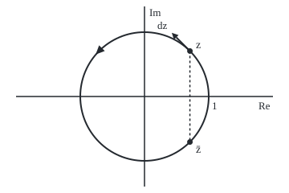

# Contour integrals: add up f(z) dz along a path, and the loop round the origin that gives 2 pi i

Complex analysis → Contour Integrals and Cauchy's Theorem → Summing along a path → Contour integrals

---

## General Overview

A circular running track, 400 metres a lap, has radius 63.661977 metres. Centre it at 0 in the plane and measure in units of that radius: the track is the circle of radius 1, the start line at 1. A runner who has turned through t radians stands at e^(it) ([eulers-formula](../01-Complex%20Numbers%20and%20the%20Plane/04-eulers-formula.md)).

Each stride is a small arrow from one footfall to the next, itself a complex number. Pick a function f, a rule giving a complex number at each point. At each footfall multiply the stride by f there, which turns and stretches it, and add the turned strides round the lap. The total is the **contour integral** of f along the track, the term used from here on; the path is the **contour**.

Round one lap, the conjugate, z mirrored in the real axis, gives 2πi, which is 6.283185i. The function z gives 0. One over z gives 2πi again. A fourth, e^z divided by z^2, is bounded before it is computed: size at most 2πe, 17.079468; true size 6.283185.

**A contour integral adds, stride by stride along a directed path, the value of f times the complex step taken; one lap of the unit circle, 1/z times each stride points straight up, so they add to 2πi.**

**What kind of fact this is:** a definition, with two theorems proved on this card in Why it works: the 2πi lap, and the bound of size by largest value times length.

### The picture: one stride on the track

<p align="center"></p>

To scale: 80 units per 1, centre 0 at (180, 120). The runner at angle π/4 is at (236.57, 63.43), the conjugate at (236.57, 176.57). The stride, drawn 0.4 times iz, ends at (213.94, 40.80), a quarter turn from z. The triangle at (123.43, 63.43) shows the anticlockwise lap.

---

## The formula

Notation first, in words. A path C is traced by a point z(t) as a real t runs from a to b, direction included. Its integral is a tall S with C beneath; on a closed loop the S carries a small circle, the loop integral sign, read "integral round C".

$$\int_C f(z)\,dz = \int_a^b f\big(z(t)\big)\,z'(t)\,dt$$

**Read it aloud:** integrate, over t, f at the moving point times the point's velocity.

As a sum of strides, with footfalls $z_k$ and $N$ strides:

$$\int_C f(z)\,dz = \lim_{N\to\infty} \sum_{k=0}^{N-1} f(z_k)\,(z_{k+1}-z_k)$$

**Read it aloud:** f at each footfall times the stride to the next, added up, as the strides shrink.

The track's two facts:

$$\oint_{|z|=1} z^n\,dz = \begin{cases} 2\pi i & n=-1\\ 0 & \text{every other whole number } n\end{cases} \qquad\qquad \left|\int_C f(z)\,dz\right| \le M L$$

**Read it aloud:** round the unit circle a whole power of z gives 2πi only for 1/z; along any path the integral's size is at most f's largest size there times the length: the ML bound.

| Symbol | Plain meaning | In our example | Push it up and the answer… |
| --- | --- | --- | --- |
| $C$, $\oint$ | the directed path; the loop sign | one anticlockwise lap | two laps double it |
| $t$, $a$, $b$ | the parameter, from a to b | angle, 0 to 2π | more track |
| $z(t)$, $dz$ | the point at t; a stride, $z'(t)\,dt$ | e^(it); i e^(it) dt | — |
| $f$, $\bar z$ | the function; the conjugate, "z-bar" | z̄, z, 1/z, e^z/z^2 | doubling f doubles it |
| $z_k$, $N$, $k$ | footfalls; strides; their count | N = 8, 64, 512 | closer to the integral |
| $n$, $R$ | a whole power; the radius | −1; 63.661977 m | — |
| $M$, $L$ | largest size of f on C; length | e; 2π | a looser bound |
| $i$, $\pi$, $e$ | square root of −1; half turn; 2.718282 | 2πi = 6.283185i | — |

### When it holds

- **Finitely many smooth pieces.** Corners are allowed; the pieces' integrals add. A path of infinite length has no L, and the bound says nothing.
- **f continuous on the path.** Then the stride sums settle to one number. A path through 0 gives 1/z no integral.
- **Direction counts.** Clockwise, dz/z gives −2πi.
- **M bounds f everywhere on the path.** Read at z = −1 only, e^z/z^2 has size 0.367879, and 0.367879 × 6.283185 = 2.311455, below the true 6.283185.
- **No holomorphy needed.** The conjugate has no complex derivative anywhere, yet its integral is defined.

---

## Why it works

### Step 0: a stride is velocity times a small time

From t to t + Δt the runner moves z(t + Δt) − z(t), close to $z'(t)\,\Delta t$ for small Δt. So each term f(footfall) × stride is close to f(z(t)) z'(t) Δt, and the sum of strides is a Riemann sum for an ordinary integral over t. Writing f = u + iv and dz = dx + i dy, its real and imaginary parts are (u dx − v dy) and (v dx + u dy): two real line integrals ([line-integrals](../../06-Calculus%20and%20analysis/09-Vector%20Calculus/02-line-integrals.md)). By the chain rule, a change of speed changes z'(t) and dt in opposite ways, so the integral belongs to the path, not the stopwatch.

### Step 1: the track's velocity is a quarter turn of its position

On the track z(t) = e^(it) = cos t + i sin t, so z'(t) = −sin t + i cos t, which is i e^(it). Multiplying by i is a quarter turn: each stride is dz = iz dt, of length dt, pointing along the track.

### Step 2: whole powers round the track

Put z = e^(it) and dz = i e^(it) dt into $z^n$:

$$\oint_{|z|=1} z^n\,dz = \int_0^{2\pi} e^{int}\, i e^{it}\,dt = i\int_0^{2\pi} e^{i(n+1)t}\,dt$$

If n = −1 the integrand is 1, and the answer is 2πi. Otherwise it is cos((n + 1)t) + i sin((n + 1)t), whole waves with as much area above the axis as below: 0. For z itself, n = 1.

For 1/z the picture is plain: the stride iz dt times 1/z is i dt, every stride turned straight up. Nothing cancels.

### Step 3: the conjugate on the track is 1/z

On the track the modulus |z|, the distance from 0, is 1, and z times its conjugate is |z|^2 = 1, so z̄ = 1/z at every footfall and its lap gives 2πi too. Off the track the two differ: on the track in metres, radius R, the conjugate's lap is $2\pi i R^2$ = 25464.790895i, while 1/z still gives 2πi.

<details>
<summary>Why the conjugate measures area</summary>

z̄ dz = (x − iy)(dx + i dy) = (x dx + y dy) + i(x dy − y dx). Round a loop the first part adds to 0, being half the change in x^2 + y^2; the second is twice the enclosed area, by Green's theorem. So the lap gives 2i × π. The 8-stride sum below has imaginary part 5.656854, twice the area of the octagon its footfalls make.

</details>

### Step 4: reverse, join, repeat

Running backwards replaces t by 2π − t, flipping the velocity and the integral: dz/z clockwise gives −2πi. Joined paths add, their strides being two lists: the upper half, 1 to −1, gives πi, the lower half πi, together 2πi. Two laps give 12.566371i.

### Step 5: the ML bound

The size of a sum is at most the sum of the sizes. Each term is at most M × |stride|, and the stride lengths add to L. So the integral's size is at most M L.

On the track, e^z/z^2 has size e^(cos t), largest at z = 1, where it is e. The bound is 2πe = 17.079468. The exact value comes from the series e^z/z^2 = 1/z^2 + 1/z + 1/2! + z/3! + …, which converges uniformly on the track, so it may be integrated term by term; by Step 2 only 1/z survives, with coefficient 1/1!. The lap gives 2πi, size 6.283185. For z̄, M = 1 and the bound 2π is met exactly: ML can be sharp. Its real use: showing a piece of a path contributes little when no exact value is known.

<details>
<summary>Detailed proof</summary>

**The sum becomes the integral.** On a smooth piece z' is uniformly continuous. By the mean value theorem on x(t) and y(t), each stride differs from z'(t_k) Δt by a tolerance times Δt, the tolerance shrinking with Δt. Summed, the error is at most max|f| × tolerance × (b − a), which tends to 0. What remains is a Riemann sum of the continuous f(z(t)) z'(t), which tends to its integral.

**The ML inequality.** Let g(t) = f(z(t)) z'(t) and I its integral. If I ≠ 0, write I = |I| e^(iφ). Then |I| = e^(−iφ) I, the integral of e^(−iφ) g(t); being real, it equals the integral of the real part, which is at most |g(t)|. And |g(t)| ≤ M |z'(t)|, whose integral, speed times time, is L.

</details>

When f has an antiderivative, a function F whose complex derivative is f, the integral along any path is F(end) − F(start) and every loop gives 0: [antiderivatives-and-path-independence](02-antiderivatives-and-path-independence.md). The nonzero laps show z̄ and 1/z have no such F round the track.

---

## Worked numbers, by hand

| Step | Arithmetic | Value |
| --- | --- | --- |
| Track radius | 400 ÷ 2π | 63.661977 m |
| Conjugate times stride | z̄ = 1/z on the track, so z̄ · iz dt = i dt | i dt |
| Round the lap | i × 2π | **2πi = 6.283185i** |
| z times stride | i e^(2it) dt: two whole turns | **0** |
| ML bound for e^z/z^2 | M = e at z = 1, L = 2π | **17.079468** |
| True value | only the 1/z term: 2πi × 1/1! | 6.283185i, size 6.283185 |

### What breaks if you drop a piece

| Mistake | Comes out at | What went wrong |
| --- | --- | --- |
| dt in place of dz, for z̄ | 0.000000 + 0.000000i | The strides' directions were dropped |
| Running the lap clockwise | −6.283185i | Direction is part of the path |
| M read at z = −1 only | 2.311455, below the true 6.283185 | M must bound f on the whole path |
| 8 strides taken as exact | −2.343146 + 5.656854i, off by 2.425412 | A sum only approximates; 512 are off by 0.038553 |

The code prints all four.

---

## Code, from first principles, and it actually runs

Two roads. Road one is the value worked by hand. Road two is the definition: stride sums over 8, 64 and 512 strides, error shrinking like 2π^2/N, and a trapezoid sum of f(z(t)) z'(t) over 512 steps of t. The four asserts test the laps against the hand values, the stride error against 2π^2/512, and M against e.

### Python

```python
# Contour integrals -- the check behind the card.  Standard library only.
# The track is the circle z(t) = r e^(it), t from 0 to 2 pi, run anticlockwise.
# Road one: the values worked by hand on the card (z^n dz gives 2 pi i only at n = -1).
# Road two: the sum of f(z_k) times each stride z_(k+1) - z_k, the definition itself,
# and a trapezoid sum of f(z(t)) z'(t) dt over the parameter t, with z'(t) = i z(t).
import math

def point(t, r=1.0):
    return complex(r * math.cos(t), r * math.sin(t))

def strides(f, n):                            # sum of f(z_k) (z_(k+1) - z_k), one lap
    zs = [point(2 * math.pi * k / n) for k in range(n + 1)]
    return sum(f(zs[k]) * (zs[k + 1] - zs[k]) for k in range(n))

def trap(f, t0=0.0, t1=2 * math.pi, r=1.0, n=512):   # trapezoid on f(z(t)) z'(t)
    h = (t1 - t0) / n
    g = [f(point(t0 + k * h, r)) * 1j * point(t0 + k * h, r) for k in range(n + 1)]
    return h * (sum(g) - (g[0] + g[-1]) / 2)

def show(w):                                  # 'a + bi', six decimals, no -0.000000
    a, b = round(w.real, 6) + 0.0, round(w.imag, 6) + 0.0
    return f"{a:.6f} {'-' if b < 0 else '+'} {abs(b):.6f}i"

bar, ident, inv = lambda z: z.conjugate(), lambda z: z, lambda z: 1 / z
h = lambda z: math.e ** z.real * point(z.imag) / z ** 2          # e^z / z^2
hand = 2j * math.pi                                              # road one, by hand
series = sum(hand / math.factorial(n) for n in range(12) if n - 2 == -1)
R = 400 / (2 * math.pi)                                          # a 400 m lap, in metres
bar1, z1, inv1, h1 = trap(bar), trap(ident), trap(inv), trap(h)
cw, twice = trap(inv, 2 * math.pi, 0.0), trap(inv, 0.0, 4 * math.pi, n=1024)
upper, lower = trap(inv, 0.0, math.pi), trap(inv, math.pi, 2 * math.pi)
L = sum(abs(point(2 * math.pi * (k + 1) / 65536) - point(2 * math.pi * k / 65536)) for k in range(65536))
M = max(abs(h(point(2 * math.pi * k / 3600))) for k in range(3600))
print(f"a 400 m lap has radius {R:.6f} m; in units of the radius, length L = {L:.6f}")
print(f"z-bar dz, one lap: trapezoid {show(bar1)}; by hand 2 pi i = {show(hand)}")
print(f"z dz, one lap: trapezoid {show(z1)}; by hand 0")
print(f"dz/z, one lap: trapezoid {show(inv1)}; by hand 2 pi i")
print(f"dz/z, clockwise {show(cw)}; two laps {show(twice)}")
print(f"dz/z, upper half 1 to -1 {show(upper)}; lower half -1 to 1 {show(lower)}; joined {show(upper + lower)}")
errs = []
for n in (8, 64, 512):
    s = strides(bar, n)
    errs.append(abs(s - hand))
    print(f"z-bar dz by {n} strides: {show(s)}, off by {errs[-1]:.6f}")
print(f"in metres: z-bar dz = {show(trap(bar, r=R))} (2 pi R^2 = {2 * math.pi * R * R:.6f}); dz/z = {show(trap(inv, r=R))}")
print(f"e^z dz/z^2, one lap: trapezoid {show(h1)}; by the series {show(series)}; size {abs(h1):.6f}")
print(f"ML bound: M = {M:.6f} (at z = 1), L = {L:.6f}, M x L = {M * L:.6f} >= {abs(h1):.6f}")
print(f"mistake, dt for dz on z-bar: {show(sum(bar(point(2 * math.pi * k / 512)) for k in range(512)) * 2 * math.pi / 512)}")
print(f"mistake, M read at z = -1 only: {abs(h(-1 + 0j)):.6f} x {L:.6f} = {abs(h(-1 + 0j)) * L:.6f} < {abs(h1):.6f}")
fz, fs, fd = point(math.pi / 4), point(math.pi / 4) * (1 + 0.4j), point(3 * math.pi / 4)
print(f"figure, z ({180 + 80 * fz.real:.2f}, {120 - 80 * fz.imag:.2f}), z-bar ({180 + 80 * fz.real:.2f}, "
      f"{120 + 80 * fz.imag:.2f}), stride tip ({180 + 80 * fs.real:.2f}, {120 - 80 * fs.imag:.2f}), "
      f"arrowhead at ({180 + 80 * fd.real:.2f}, {120 - 80 * fd.imag:.2f})")
assert abs(bar1 - hand) < 1e-12 and abs(z1) < 1e-12 and abs(inv1 - hand) < 1e-12
assert errs[0] > errs[1] > errs[2] and abs(errs[2] - 2 * math.pi ** 2 / 512) < 1e-4
assert abs(h1 - series) < 1e-12 and abs(M - math.e) < 1e-9 and abs(h1) <= M * L
assert abs(cw + inv1) < 1e-12 and abs(upper + lower - hand) < 1e-12 and abs(twice - 2 * hand) < 1e-12
print("ALL CHECKS PASS")
```

**Ran 2026-09-28 on macOS, Python 3.14.6, standard library only. All checks passed. Output, pasted from the run:**

```
a 400 m lap has radius 63.661977 m; in units of the radius, length L = 6.283185
z-bar dz, one lap: trapezoid 0.000000 + 6.283185i; by hand 2 pi i = 0.000000 + 6.283185i
z dz, one lap: trapezoid 0.000000 + 0.000000i; by hand 0
dz/z, one lap: trapezoid 0.000000 + 6.283185i; by hand 2 pi i
dz/z, clockwise 0.000000 - 6.283185i; two laps 0.000000 + 12.566371i
dz/z, upper half 1 to -1 0.000000 + 3.141593i; lower half -1 to 1 0.000000 + 3.141593i; joined 0.000000 + 6.283185i
z-bar dz by 8 strides: -2.343146 + 5.656854i, off by 2.425412
z-bar dz by 64 strides: -0.308177 + 6.273097i, off by 0.308343
z-bar dz by 512 strides: -0.038553 + 6.283028i, off by 0.038553
in metres: z-bar dz = 0.000000 + 25464.790895i (2 pi R^2 = 25464.790895); dz/z = 0.000000 + 6.283185i
e^z dz/z^2, one lap: trapezoid 0.000000 + 6.283185i; by the series 0.000000 + 6.283185i; size 6.283185
ML bound: M = 2.718282 (at z = 1), L = 6.283185, M x L = 17.079468 >= 6.283185
mistake, dt for dz on z-bar: 0.000000 + 0.000000i
mistake, M read at z = -1 only: 0.367879 x 6.283185 = 2.311455 < 6.283185
figure, z (236.57, 63.43), z-bar (236.57, 176.57), stride tip (213.94, 40.80), arrowhead at (123.43, 63.43)
ALL CHECKS PASS
```

### Rust

Same numbers, same labels, built with `rustc --edition 2021 -O`.

```rust
// Contour integrals -- the same check as the Python, in Rust.  No crates.
// The track is the circle z(t) = r e^(it), t from 0 to 2 pi, run anticlockwise.
// Road one: the values worked by hand on the card (z^n dz gives 2 pi i only at n = -1).
// Road two: the sum of f(z_k) times each stride z_(k+1) - z_k, the definition itself,
// and a trapezoid sum of f(z(t)) z'(t) dt over the parameter t, with z'(t) = i z(t).
use std::f64::consts::{E, PI};
#[derive(Clone, Copy)]
struct C { re: f64, im: f64 }
fn c(re: f64, im: f64) -> C { C { re, im } }
fn add(a: C, b: C) -> C { c(a.re + b.re, a.im + b.im) }
fn sub(a: C, b: C) -> C { c(a.re - b.re, a.im - b.im) }
fn mul(a: C, b: C) -> C { c(a.re * b.re - a.im * b.im, a.re * b.im + a.im * b.re) }
fn scale(a: C, k: f64) -> C { c(a.re * k, a.im * k) }
fn inv(a: C) -> C { let d = a.re * a.re + a.im * a.im; c(a.re / d, -a.im / d) }
fn abs(a: C) -> f64 { a.re.hypot(a.im) }
fn point(t: f64, r: f64) -> C { c(r * t.cos(), r * t.sin()) }
fn bar(z: C) -> C { c(z.re, -z.im) }
fn ident(z: C) -> C { z }
fn h(z: C) -> C { scale(mul(point(z.im, 1.0), inv(mul(z, z))), z.re.exp()) } // e^z / z^2

fn strides(f: fn(C) -> C, n: usize) -> C { // sum of f(z_k) (z_(k+1) - z_k), one lap
    let zs: Vec<C> = (0..=n).map(|k| point(2.0 * PI * k as f64 / n as f64, 1.0)).collect();
    (0..n).fold(c(0.0, 0.0), |s, k| add(s, mul(f(zs[k]), sub(zs[k + 1], zs[k]))))
}
fn trap(f: fn(C) -> C, t0: f64, t1: f64, r: f64, n: usize) -> C { // trapezoid on f(z(t)) z'(t)
    let hh = (t1 - t0) / n as f64;
    let g: Vec<C> = (0..=n).map(|k| { let z = point(t0 + k as f64 * hh, r); mul(f(z), mul(c(0.0, 1.0), z)) }).collect();
    let s = g.iter().fold(c(0.0, 0.0), |s, &x| add(s, x));
    scale(sub(s, scale(add(g[0], g[n]), 0.5)), hh)
}
fn show(w: C) -> String { // 'a + bi', six decimals, no -0.000000
    let a = format!("{:.6}", w.re);
    let a = if a == "-0.000000" { "0.000000".to_string() } else { a };
    let b = format!("{:.6}", w.im.abs());
    let sign = if w.im < 0.0 && b != "0.000000" { '-' } else { '+' };
    format!("{} {} {}i", a, sign, b)
}

fn main() {
    let tp = 2.0 * PI;
    let hand = c(0.0, tp); // road one, by hand
    let fact = |n: u32| (1..=n).fold(1.0, |p, k| p * k as f64);
    let series = (0..12u32).filter(|&n| n as i32 - 2 == -1).fold(c(0.0, 0.0), |s, n| add(s, scale(hand, 1.0 / fact(n))));
    let r = 400.0 / tp; // a 400 m lap, in metres
    let (bar1, z1, inv1, h1) = (trap(bar, 0.0, tp, 1.0, 512), trap(ident, 0.0, tp, 1.0, 512), trap(inv, 0.0, tp, 1.0, 512), trap(h, 0.0, tp, 1.0, 512));
    let (cw, twice) = (trap(inv, tp, 0.0, 1.0, 512), trap(inv, 0.0, 2.0 * tp, 1.0, 1024));
    let (upper, lower) = (trap(inv, 0.0, PI, 1.0, 512), trap(inv, PI, tp, 1.0, 512));
    let l: f64 = (0..65536).map(|k| abs(sub(point(tp * (k + 1) as f64 / 65536.0, 1.0), point(tp * k as f64 / 65536.0, 1.0)))).sum();
    let m = (0..3600).map(|k| abs(h(point(tp * k as f64 / 3600.0, 1.0)))).fold(0.0, f64::max);
    println!("a 400 m lap has radius {:.6} m; in units of the radius, length L = {:.6}", r, l);
    println!("z-bar dz, one lap: trapezoid {}; by hand 2 pi i = {}", show(bar1), show(hand));
    println!("z dz, one lap: trapezoid {}; by hand 0", show(z1));
    println!("dz/z, one lap: trapezoid {}; by hand 2 pi i", show(inv1));
    println!("dz/z, clockwise {}; two laps {}", show(cw), show(twice));
    println!("dz/z, upper half 1 to -1 {}; lower half -1 to 1 {}; joined {}", show(upper), show(lower), show(add(upper, lower)));
    let mut errs = Vec::new();
    for n in [8usize, 64, 512] {
        let s = strides(bar, n);
        errs.push(abs(sub(s, hand)));
        println!("z-bar dz by {} strides: {}, off by {:.6}", n, show(s), errs[errs.len() - 1]);
    }
    println!("in metres: z-bar dz = {} (2 pi R^2 = {:.6}); dz/z = {}", show(trap(bar, 0.0, tp, r, 512)), tp * r * r, show(trap(inv, 0.0, tp, r, 512)));
    println!("e^z dz/z^2, one lap: trapezoid {}; by the series {}; size {:.6}", show(h1), show(series), abs(h1));
    println!("ML bound: M = {:.6} (at z = 1), L = {:.6}, M x L = {:.6} >= {:.6}", m, l, m * l, abs(h1));
    let dt = (0..512).fold(c(0.0, 0.0), |s, k| add(s, bar(point(tp * k as f64 / 512.0, 1.0))));
    println!("mistake, dt for dz on z-bar: {}", show(scale(dt, tp / 512.0)));
    let one = abs(h(c(-1.0, 0.0)));
    println!("mistake, M read at z = -1 only: {:.6} x {:.6} = {:.6} < {:.6}", one, l, one * l, abs(h1));
    let (fz, fs, fd) = (point(PI / 4.0, 1.0), mul(point(PI / 4.0, 1.0), c(1.0, 0.4)), point(3.0 * PI / 4.0, 1.0));
    println!("figure, z ({:.2}, {:.2}), z-bar ({:.2}, {:.2}), stride tip ({:.2}, {:.2}), arrowhead at ({:.2}, {:.2})",
             180.0 + 80.0 * fz.re, 120.0 - 80.0 * fz.im, 180.0 + 80.0 * fz.re, 120.0 + 80.0 * fz.im,
             180.0 + 80.0 * fs.re, 120.0 - 80.0 * fs.im, 180.0 + 80.0 * fd.re, 120.0 - 80.0 * fd.im);
    assert!(abs(sub(bar1, hand)) < 1e-12 && abs(z1) < 1e-12 && abs(sub(inv1, hand)) < 1e-12);
    assert!(errs[0] > errs[1] && errs[1] > errs[2] && (errs[2] - 2.0 * PI * PI / 512.0).abs() < 1e-4);
    assert!(abs(sub(h1, series)) < 1e-12 && (m - E).abs() < 1e-9 && abs(h1) <= m * l);
    assert!(abs(add(cw, inv1)) < 1e-12 && abs(sub(add(upper, lower), hand)) < 1e-12 && abs(sub(twice, scale(hand, 2.0))) < 1e-12);
    println!("ALL CHECKS PASS");
}
```

**Ran 2026-09-28 on macOS, rustc 1.98.1, no crates. All checks passed. Output, pasted from the run:**

```
a 400 m lap has radius 63.661977 m; in units of the radius, length L = 6.283185
z-bar dz, one lap: trapezoid 0.000000 + 6.283185i; by hand 2 pi i = 0.000000 + 6.283185i
z dz, one lap: trapezoid 0.000000 + 0.000000i; by hand 0
dz/z, one lap: trapezoid 0.000000 + 6.283185i; by hand 2 pi i
dz/z, clockwise 0.000000 - 6.283185i; two laps 0.000000 + 12.566371i
dz/z, upper half 1 to -1 0.000000 + 3.141593i; lower half -1 to 1 0.000000 + 3.141593i; joined 0.000000 + 6.283185i
z-bar dz by 8 strides: -2.343146 + 5.656854i, off by 2.425412
z-bar dz by 64 strides: -0.308177 + 6.273097i, off by 0.308343
z-bar dz by 512 strides: -0.038553 + 6.283028i, off by 0.038553
in metres: z-bar dz = 0.000000 + 25464.790895i (2 pi R^2 = 25464.790895); dz/z = 0.000000 + 6.283185i
e^z dz/z^2, one lap: trapezoid 0.000000 + 6.283185i; by the series 0.000000 + 6.283185i; size 6.283185
ML bound: M = 2.718282 (at z = 1), L = 6.283185, M x L = 17.079468 >= 6.283185
mistake, dt for dz on z-bar: 0.000000 + 0.000000i
mistake, M read at z = -1 only: 0.367879 x 6.283185 = 2.311455 < 6.283185
figure, z (236.57, 63.43), z-bar (236.57, 176.57), stride tip (213.94, 40.80), arrowhead at (123.43, 63.43)
ALL CHECKS PASS
```

The two outputs match line for line.

> [!TIP]
> **Try changing**
> Guess first, then run it.
> - **A bigger track.** Change `400` to `1000` where `R` is set. Which metre value moves? The conjugate's lap becomes 159154.943092i; dz/z stays 6.283185i.
> - **One more power below.** In `h`, change `z ** 2` to `z ** 3`. The 1/z coefficient becomes 1/2!, the lap 3.141593i, and the third assert stops it.
> - **Drop the velocity.** In `trap`, delete ` * 1j * point(t0 + k * h, r)`, so dt replaces dz. The conjugate's lap falls to 0; the first assert stops it.

---

## The usual mistake

> [!warning]
> **Treating dz as a length.** A stride has a direction as well as a size, and f multiplies both. Summing f times dt, or times the stride's length, throws the direction away: the conjugate's lap then gives 0, not 2πi.
>
> - **Expecting every loop to give 0.** z̄ and 1/z give 2πi. Which functions always give 0 is [cauchys-theorem](03-cauchys-theorem.md).

---

## Where you meet it in real life

- **Lift on a wing.** For a flat flow with velocity u + iv, the real part of the loop integral of (u − iv) dz round a wing is the circulation, which sets lift.
- **Feedback stability.** Engineers count how often a curve winds round a point, the loop integral of dz/(z − p) over 2πi: [deforming-contours-and-winding-numbers](04-deforming-contours-and-winding-numbers.md).
- **Counting primes.** A contour integral of a function built from the primes counts them: perrons-formula.

> **Say it back**
> A contour integral adds f times each directed stride along a path. Parametrising turns it into an ordinary integral of f(z(t)) z'(t). Round the unit circle 1/z turns every stride straight up, so the lap gives 2πi; so does the conjugate, equal to 1/z there; z gives 0. Reversing flips the sign, and joined paths add. The size is at most f's largest size on the path times the length.

---

## What this builds on

- [eulers-formula](../01-Complex%20Numbers%20and%20the%20Plane/04-eulers-formula.md): e^(it), the track's parametrisation.
- [complex-derivative-and-cauchy-riemann](../02-Holomorphic%20Functions/01-complex-derivative-and-cauchy-riemann.md): holomorphic, having a complex derivative throughout a region; z is, z̄ is not.
- [line-integrals](../../06-Calculus%20and%20analysis/09-Vector%20Calculus/02-line-integrals.md): the real integrals inside, and Green's theorem.

## Where this goes next

- [antiderivatives-and-path-independence](02-antiderivatives-and-path-independence.md): when an integral depends only on the path's two ends.
- perrons-formula: a contour integral that counts primes.

Round the track z gave 0 while z̄ and 1/z gave 2πi; why some functions give 0 on every loop is where the shelf goes from here.

---

## Sources

Verified 28 Sep 2026: every link below opens a page naming the cited work.

- Orloff, Jeremy. "Topic 3: Line integrals and Cauchy's theorem." MIT OpenCourseWare 18.04, Spring 2018. [Course notes](https://ocw.mit.edu/courses/18-04-complex-variables-with-applications-spring-2018/resources/mit18_04s18_topic3/). Parametrised complex line integrals.
- Stein, Elias M., and Rami Shakarchi. *Complex Analysis*. Princeton University Press, 2003. [Publisher page](https://press.princeton.edu/books/hardcover/9780691113852/complex-analysis). Chapter 1, section 3: integration along curves.
- Lebl, Jiří. *Guide to Cultivating Complex Analysis*. [Book page](https://www.jirka.org/ca/). Free; section 3.1 proves the length estimate.
