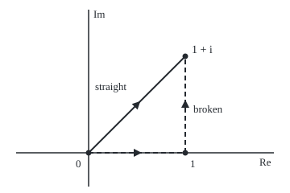
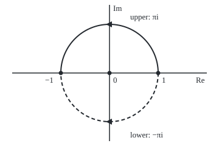

# Antiderivatives: when f = F' the path does not matter, and the one function that has none

[Syllabus](../../../SYLLABUS.md) → [Complex analysis](../README.md) → [Contour Integrals and Cauchy's Theorem](../README.md#s03) → Antiderivatives

---

## General Overview

A hiker climbs from a car park to a summit. The ridge path and the valley path differ in every step, yet both gain the same height. An altimeter needs only the two ends.

A complex integral along a path ([Contour integrals](01-contour-integrals.md)) adds up f(z) times each small step dz. Sometimes a second function F, whose complex derivative is f, plays the altimeter: the whole sum is F at the finish minus F at the start. Integrate z^2 from 0 to 1 + i straight across, or along the real axis to 1 and then up: both give (−2 + 2i)/3, because z^3/3 has derivative z^2.

Now climb a spiral ramp round a pillar: one lap ends one floor above the start. The complex logarithm, log z, the natural altimeter for 1/z, is such a ramp: one lap round 0 raises it by 2πi. So a loop of 1/z round 0 gives 2πi, not 0. From here on, the altimeter is called an **antiderivative**.

**If F′ = f on an open set holding the path, the integral of f along it is F(end) − F(start), whatever route inside that set joins them; 1/z has no antiderivative on any region that circles 0, and among the powers of z it is the only one without.**

**What kind of fact this is:** a theorem, proved on this card in Why it works; which regions guarantee an antiderivative is proved on [Cauchy's theorem](03-cauchys-theorem.md).

### The picture: two routes from 0 to 1 + i

<p align="center"></p>

To scale: 120 units per 1, with 0 at (110, 190), 1 at (230, 190) and 1 + i at (230, 70). Straight route solid, broken route dashed.

---

## The formula

Notation first, in words. A path is written γ (gamma): a point γ(t) that moves as a clock t runs from 0 to 1, with velocity γ′(t). The integral of f along γ is written $\int_\gamma f(z)\,dz$; a loop integral carries a circle on the sign, $\oint$.

$$\int_\gamma f(z)\,dz = \int_0^1 f(\gamma(t))\,\gamma'(t)\,dt = F(b) - F(a) \qquad \text{when } F' = f \text{ on an open set containing } \gamma$$

**Read it aloud:** if F has derivative f on an open set holding the path, the integral of f along it is F at the finish minus F at the start.

$$\oint_{|z| = 1} \frac{dz}{z} = 2\pi i$$

**Read it aloud:** once anticlockwise round the unit circle, 1/z adds up to 2πi, not 0.

| Symbol | Plain meaning | In our example | Push it up and the answer… |
| --- | --- | --- | --- |
| $f$ | the function added up along the path | z^2 | — |
| $F$ | an antiderivative: its complex derivative is f | z^3/3 | adding a constant changes nothing |
| $\gamma$, $t$ | the path, and its clock running 0 to 1; γ′ is its velocity | γ(t) = (1 + i)t, velocity 1 + i | a new route, same answer when F exists |
| $a$, $b$ | where the path starts and finishes | 0 and 1 + i | moves the answer by F's change |
| $\oint$ | an integral round a closed loop, anticlockwise | the unit circle | — |
| $\log z$, $\operatorname{Log} z$ | ln\|z\| + i times an angle of z; Log takes the angle in (−π, π] | log 1 = 0, Log(−1) = πi | one lap round 0 adds 2πi |
| $\bar z$ | z-bar, the mirror of z in the real axis | 1 + i becomes 1 − i | — |
| $i$, $\pi$, $N$ | i^2 = −1; a half turn in radians; steps in the numerical sum | N = 10 to 10000 | error falls as 1/N^2 |

### When it holds

- **F′ = f on an open set containing the whole path.** Drop that and the ends stop deciding: the loop of 1/z round 0 is 2πi, not 0.
- **f continuous, the path made of finitely many smooth pieces.** Corners are allowed.
- **The converse needs every loop.** On a connected open region, every loop integral 0 gives an antiderivative; one zero loop proves nothing.
- **Log only where it cannot be lapped.** Off the negative real axis the principal Log works; a path that ends on or crosses that line can get πi where the truth is −πi.

---

## Why it works

### Step 0: the integrand is the rate at which F changes

The hiker's height changes, per second, by slope times speed. Along the path, F(γ(t)) is an ordinary function of the clock t, with complex values. Its rate of change is F′(γ(t)) times γ′(t), and when F′ = f that product is exactly what the integral adds up. So the integral is the total change of F.

### Step 1: the chain rule holds along a path

A complex derivative means F(w + h) ≈ F(w) + F′(w) h from any direction. In one short tick the path moves about γ′(t) times the tick; put that in for h, and F changes by about F′(γ(t)) γ′(t) times the tick.

<details>
<summary>Detailed proof: the chain rule along a path</summary>

Fix t with γ differentiable at t, and let s be a small real tick. Write $\Delta = \gamma(t+s) - \gamma(t)$, so $\Delta/s \to \gamma'(t)$ and $|\Delta| \le M|s|$ for some M once s is small. Differentiability of F at $w = \gamma(t)$ gives $F(w + \Delta) - F(w) = F'(w)\,\Delta + R(\Delta)$ with $|R(h)|/|h| \to 0$ as $h \to 0$, and R(0) = 0. Then

$$\frac{F(\gamma(t+s)) - F(\gamma(t))}{s} = F'(w)\,\frac{\Delta}{s} + \frac{R(\Delta)}{s}.$$

The first term tends to $F'(w)\gamma'(t)$. For the second: given ε > 0, pick δ with $|R(h)| \le \varepsilon |h|$ when $|h| < \delta$; for small s, $|R(\Delta)/s| \le \varepsilon M$, so it tends to 0. On each smooth piece the real fundamental theorem then applies to the real and imaginary parts; summing pieces, interior corners cancel.

</details>

### Step 2: apply the real fundamental theorem twice

A complex-valued function of t is two real ones, its real and imaginary parts. The fundamental theorem of calculus ([Fundamental theorem of calculus](../../06-Calculus%20and%20analysis/04-Integrals/02-fundamental-theorem-of-calculus.md)) turns each integral of a rate into a change:

$$\int_0^1 f(\gamma(t))\,\gamma'(t)\,dt = F(\gamma(1)) - F(\gamma(0)) = F(b) - F(a).$$

Only the ends are left.

### Step 3: two consequences

- **Path independence.** Any two paths from a to b give the same integral, since both give F(b) − F(a).
- **Loops give zero.** A closed path ends where it starts, so the integral is F(a) − F(a) = 0. The triangle 0 → 2 → 1 + i → 0 gives 0 for z^2.

### Step 4: the converse, every loop zero gives an antiderivative

Fix a base point p in a connected open region, and let F(z) be the integral of f from p to z. If every loop gives 0, two paths from p to z agree: one forward and the other backward make a loop. Near z, the extra piece to z + h is a short segment on which f is almost f(z), so F(z + h) − F(z) is almost f(z) h: F′ = f.

<details>
<summary>Detailed proof: the constructed F has derivative f</summary>

The region is open, so a disc around z lies inside it; take h small enough that z + h is in that disc. Extend a path from p to z by the segment $z + sh$, s from 0 to 1. Then

$$F(z+h) - F(z) = \int_0^1 f(z + sh)\,h\,ds, \qquad \left|\frac{F(z+h) - F(z)}{h} - f(z)\right| \le \max_{0 \le s \le 1} |f(z + sh) - f(z)|.$$

Continuity of f at z makes the right side tend to 0 as h → 0, from every direction. So $F'(z) = f(z)$. Connectedness is what lets one base point reach every z by a path of segments.

</details>

So, for a continuous f on a connected open region, three statements are equivalent: an antiderivative exists; integrals depend only on the ends; every loop integral is 0.

### Step 5: the one power with no antiderivative

For every integer n except −1, positive, negative or zero, z^n has antiderivative z^(n+1)/(n+1), so its loops give 0. At n = −1 that recipe divides by zero. Direct computation on γ(t) = e^(2πit), velocity 2πi e^(2πit), gives f(γ)γ′ = 2πi at every instant, so the loop integral is 2πi. By Step 3, no antiderivative of 1/z exists on any region containing that circle.

A local one exists: log z = ln|z| + i times the angle of z ([The complex logarithm](../02-Holomorphic%20Functions/04-complex-logarithm.md)) has derivative 1/z. Carried once round 0, the angle grows by 2π: the ramp does not close up, and that climb is the 2πi. Cut the plane along the negative real axis and no lap is possible; there the principal Log works.

### The picture: two halves of the unit circle

<p align="center"></p>

To scale: 80 units per 1, centre 0 at (180, 120), 1 at (260, 120), −1 at (100, 120). Upper half solid, lower dashed.

---

## Worked numbers, by hand

| Step | Arithmetic | Value |
| --- | --- | --- |
| Cube the finish | (1 + i)^2 = 2i, then 2i(1 + i) = −2 + 2i | −2 + 2i |
| Straight route, by F | ((1 + i)^3 − 0^3)/3 | **(−2 + 2i)/3** |
| First leg, 0 to 1 | 1^3/3 − 0 | 1/3 |
| Second leg, 1 to 1 + i | ((−2 + 2i) − 1)/3 | −1 + 2i/3 |
| Broken route, sum | 1/3 − 1 + 2i/3 | **(−2 + 2i)/3** |
| Decimal | both routes | −0.666667 + 0.666667i |
| 1/z once round the circle | 2πi at every instant, clock 0 to 1 | **2πi = 6.283185i** |

### What breaks if you drop a piece

| Mistake | Comes out at | What went wrong |
| --- | --- | --- |
| z-bar, which has no antiderivative | straight 1, broken 1 + i | no F with F′ = z-bar, so the route matters |
| Assume 1/z has an antiderivative round 0 | 6.283185i, not 0 | log z comes back 2πi higher |
| Principal Log on the lower half, 1 to −1 | 3.141593i, not −3.141593i | the path meets the cut; Log jumps by 2πi there |

The code prints all three.

---

## Code, from first principles, and it actually runs

Road one reads z^3/3 at the ends. Road two walks the path: a trapezoid sum of f(γ(t)) γ′(t) in N steps of the clock, its error falling a hundredfold per tenfold N. For 1/z a third road carries log z along the path, adding the small angle turned at each step. The asserts set each road against another.

### Python

```python
# Antiderivatives and path independence -- the check behind the card.  Standard library only.
# Road one: an antiderivative F with F' = f, read at the two ends of the path.
# Road two: the path itself, a trapezoid sum of f(z(t)) z'(t) over t from 0 to 1.
# For 1/z, road two meets log z carried step by step along the path.
import math

def integral(f, path, speed, n):              # trapezoid rule in the parameter t
    g = [f(path(k / n)) * speed(k / n) for k in range(n + 1)]
    return (sum(g) - (g[0] + g[-1]) / 2) / n

def segment(a, b):                             # straight from a to b; its velocity is b - a
    return (lambda t: a + (b - a) * t), (lambda t: b - a)

def arc(sweep):                                # unit circle from 1, turning through sweep radians
    point = lambda t: complex(math.cos(sweep * t), math.sin(sweep * t))
    return point, (lambda t: 1j * sweep * point(t))

def along(f, legs, n=2000): return sum(integral(f, *leg, n) for leg in legs)

def carried_log(path, n=1000):                 # ln|z| plus the angle swept, one small step at a time
    turn = sum(math.atan2((path((k + 1) / n) / path(k / n)).imag,
                          (path((k + 1) / n) / path(k / n)).real) for k in range(n))
    return complex(math.log(abs(path(1))) - math.log(abs(path(0))), turn)

def show(w):                                   # 'a + bi', six decimals, no -0.000000
    a, b = round(w.real, 6) + 0.0, round(w.imag, 6) + 0.0
    return f"{a:.6f} {'-' if b < 0 else '+'} {abs(b):.6f}i"

end = 1 + 1j
square, inverse, bar = (lambda z: z * z), (lambda z: 1 / z), (lambda z: z.conjugate())
F = end * end * end / 3
straight, broken = [segment(0, end)], [segment(0, 1), segment(1, end)]
errs = [abs(along(square, straight, n) - F) for n in (10, 100, 1000)]
s, b = along(square, straight), along(square, broken)
print(f"z^2 from 0 to 1 + i, antiderivative z^3/3 at the ends: {show(F)}")
print("straight path, trapezoid error at N = 10, 100, 1000: " + ", ".join(f"{e:.9f}" for e in errs))
print(f"straight path, N = 2000: {show(s)}")
print(f"broken path 0 -> 1 -> 1 + i, N = 2000: {show(b)}")
print(f"broken path legs, by the antiderivative: {show(1 / 3 + 0j)} and {show((end * end * end - 1) / 3)}")
tri = along(square, [segment(0, 2), segment(2, end), segment(end, 0)], 10000)
print(f"regatta triangle 0 -> 2 -> 1 + i -> 0, z^2, N = 10000 per leg: {show(tri)}")
loops = {n: along(lambda z: z ** n, [arc(2 * math.pi)], 64) for n in (-3, -2, -1, 0, 1, 2)}
others = max(abs(loops[n]) for n in loops if n != -1)
lap, low = carried_log(arc(2 * math.pi)[0]), carried_log(arc(-math.pi)[0])
up, down = along(inverse, [arc(math.pi)]), along(inverse, [arc(-math.pi)])
print(f"loop of 1/z round the unit circle, N = 64: {show(loops[-1])}")
print(f"largest loop of z^n for n = -3, -2, 0, 1, 2: {others:.6f}")
print(f"log z carried once round the unit circle: {show(lap)}")
print(f"1/z from 1 to -1: upper half {show(up)}, lower half {show(down)}")
print(f"log z carried along the lower half: {show(low)}")
print(f"mistake, principal Log(-1) - Log(1) on the lower half: {show(complex(0, math.atan2(0.0, -1.0)))}")
cs, cb = along(bar, straight), along(bar, broken)
print(f"mistake, z-bar: straight {show(cs)}, broken {show(cb)}")
print(f"figure, 0 at (110, 190), 1 at ({110 + 120 * 1}, 190), 1 + i at ({110 + 120 * 1}, {190 - 120 * 1})")
print(f"figure, circle centre (180, 120), radius 80, 1 at ({180 + 80}, 120), -1 at ({180 - 80}, 120)")
assert abs(s - F) < 1e-6 and abs(b - F) < 1e-6 and 99 < errs[0] / errs[1] < 101
assert abs(loops[-1] - lap) < 1e-9 and abs(loops[-1] - 2j * math.pi) < 1e-9
assert others < 1e-9 and abs(tri) < 1e-6 and abs(cb - cs - 1j) < 1e-9
assert abs(down - low) < 1e-9 and abs(up - down - 2j * math.pi) < 1e-9
print("ALL CHECKS PASS")
```

**Ran 2026-09-28 on macOS, Python 3.14.6, standard library only. All checks passed. Output, pasted from the run:**

```
z^2 from 0 to 1 + i, antiderivative z^3/3 at the ends: -0.666667 + 0.666667i
straight path, trapezoid error at N = 10, 100, 1000: 0.004714045, 0.000047140, 0.000000471
straight path, N = 2000: -0.666667 + 0.666667i
broken path 0 -> 1 -> 1 + i, N = 2000: -0.666667 + 0.666667i
broken path legs, by the antiderivative: 0.333333 + 0.000000i and -1.000000 + 0.666667i
regatta triangle 0 -> 2 -> 1 + i -> 0, z^2, N = 10000 per leg: 0.000000 + 0.000000i
loop of 1/z round the unit circle, N = 64: 0.000000 + 6.283185i
largest loop of z^n for n = -3, -2, 0, 1, 2: 0.000000
log z carried once round the unit circle: 0.000000 + 6.283185i
1/z from 1 to -1: upper half 0.000000 + 3.141593i, lower half 0.000000 - 3.141593i
log z carried along the lower half: 0.000000 - 3.141593i
mistake, principal Log(-1) - Log(1) on the lower half: 0.000000 + 3.141593i
mistake, z-bar: straight 1.000000 + 0.000000i, broken 1.000000 + 1.000000i
figure, 0 at (110, 190), 1 at (230, 190), 1 + i at (230, 70)
figure, circle centre (180, 120), radius 80, 1 at (260, 120), -1 at (100, 120)
ALL CHECKS PASS
```

### Rust

Same numbers, same labels, built with `rustc --edition 2021 -O`.

```rust
// Antiderivatives and path independence -- the same check as the Python, in Rust.  No crates.
// Road one: an antiderivative F with F' = f, read at the two ends of the path.
// Road two: the path itself, a trapezoid sum of f(z(t)) z'(t) over t from 0 to 1.
// For 1/z, road two meets log z carried step by step along the path.
use std::f64::consts::PI;
#[derive(Clone, Copy)]
struct C { re: f64, im: f64 }
fn c(re: f64, im: f64) -> C { C { re, im } }
fn add(a: C, b: C) -> C { c(a.re + b.re, a.im + b.im) }
fn sub(a: C, b: C) -> C { c(a.re - b.re, a.im - b.im) }
fn mul(a: C, b: C) -> C { c(a.re * b.re - a.im * b.im, a.re * b.im + a.im * b.re) }
fn scale(a: C, k: f64) -> C { c(a.re * k, a.im * k) }
fn inv(a: C) -> C { let d = a.re * a.re + a.im * a.im; c(a.re / d, -a.im / d) }
fn modulus(a: C) -> f64 { a.re.hypot(a.im) }
fn power(z: C, n: i32) -> C { // z multiplied in n times, or 1/z that many times
    let (base, mut out) = (if n < 0 { inv(z) } else { z }, c(1.0, 0.0));
    for _ in 0..n.abs() { out = mul(out, base) }
    out
}
type Leg = Box<dyn Fn(f64) -> (C, C)>; // t -> (point, velocity)
fn segment(a: C, b: C) -> Leg { Box::new(move |t| (add(a, scale(sub(b, a), t)), sub(b, a))) }
fn arc(sweep: f64) -> Leg { // unit circle from 1, turning through sweep radians
    Box::new(move |t| { let p = c((sweep * t).cos(), (sweep * t).sin()); (p, mul(c(0.0, sweep), p)) })
}
fn integral(f: &dyn Fn(C) -> C, leg: &Leg, n: usize) -> C { // trapezoid rule in the parameter t
    let g = |k: usize| { let (p, v) = leg(k as f64 / n as f64); mul(f(p), v) };
    let mut total = scale(add(g(0), g(n)), 0.5);
    for k in 1..n { total = add(total, g(k)) }
    scale(total, 1.0 / n as f64)
}
fn along(f: &dyn Fn(C) -> C, legs: &[Leg], n: usize) -> C {
    legs.iter().fold(c(0.0, 0.0), |acc, leg| add(acc, integral(f, leg, n)))
}
fn carried_log(leg: &Leg, n: usize) -> C { // ln|z| plus the angle swept, one small step at a time
    let p = |k: usize| leg(k as f64 / n as f64).0;
    let turn: f64 = (0..n).map(|k| { let r = mul(p(k + 1), inv(p(k))); r.im.atan2(r.re) }).sum();
    c(modulus(p(n)).ln() - modulus(p(0)).ln(), turn)
}
fn show(w: C) -> String { // 'a + bi', six decimals, no -0.000000
    let a = format!("{:.6}", w.re);
    let a = if a == "-0.000000" { "0.000000".to_string() } else { a };
    let b = format!("{:.6}", w.im.abs());
    format!("{} {} {}i", a, if w.im < 0.0 && b != "0.000000" { '-' } else { '+' }, b)
}
fn main() {
    let (zero, one, end) = (c(0.0, 0.0), c(1.0, 0.0), c(1.0, 1.0));
    let (square, inverse, bar) = (|z: C| mul(z, z), |z: C| inv(z), |z: C| c(z.re, -z.im));
    let f_end = scale(mul(mul(end, end), end), 1.0 / 3.0);
    let straight = [segment(zero, end)];
    let broken = [segment(zero, one), segment(one, end)];
    let errs: Vec<f64> = [10, 100, 1000].iter().map(|&n| modulus(sub(along(&square, &straight, n), f_end))).collect();
    let (s, b) = (along(&square, &straight, 2000), along(&square, &broken, 2000));
    println!("z^2 from 0 to 1 + i, antiderivative z^3/3 at the ends: {}", show(f_end));
    println!("straight path, trapezoid error at N = 10, 100, 1000: {:.9}, {:.9}, {:.9}", errs[0], errs[1], errs[2]);
    println!("straight path, N = 2000: {}", show(s));
    println!("broken path 0 -> 1 -> 1 + i, N = 2000: {}", show(b));
    println!("broken path legs, by the antiderivative: {} and {}", show(c(1.0 / 3.0, 0.0)), show(scale(sub(mul(mul(end, end), end), one), 1.0 / 3.0)));
    let tri = along(&square, &[segment(zero, c(2.0, 0.0)), segment(c(2.0, 0.0), end), segment(end, zero)], 10000);
    println!("regatta triangle 0 -> 2 -> 1 + i -> 0, z^2, N = 10000 per leg: {}", show(tri));
    let loops: Vec<(i32, C)> = (-3..=2).map(|n| (n, along(&move |z: C| power(z, n), &[arc(2.0 * PI)], 64))).collect();
    let others = loops.iter().filter(|(n, _)| *n != -1).map(|(_, w)| modulus(*w)).fold(0.0, f64::max);
    let (lap, low) = (carried_log(&arc(2.0 * PI), 1000), carried_log(&arc(-PI), 1000));
    let (up, down) = (along(&inverse, &[arc(PI)], 2000), along(&inverse, &[arc(-PI)], 2000));
    let loop_inv = loops[2].1;
    println!("loop of 1/z round the unit circle, N = 64: {}", show(loop_inv));
    println!("largest loop of z^n for n = -3, -2, 0, 1, 2: {:.6}", others);
    println!("log z carried once round the unit circle: {}", show(lap));
    println!("1/z from 1 to -1: upper half {}, lower half {}", show(up), show(down));
    println!("log z carried along the lower half: {}", show(low));
    println!("mistake, principal Log(-1) - Log(1) on the lower half: {}", show(c(0.0, 0f64.atan2(-1.0))));
    let (cs, cb) = (along(&bar, &straight, 2000), along(&bar, &broken, 2000));
    println!("mistake, z-bar: straight {}, broken {}", show(cs), show(cb));
    println!("figure, 0 at (110, 190), 1 at ({}, 190), 1 + i at ({}, {})", 110 + 120 * 1, 110 + 120 * 1, 190 - 120 * 1);
    println!("figure, circle centre (180, 120), radius 80, 1 at ({}, 120), -1 at ({}, 120)", 180 + 80, 180 - 80);
    assert!(modulus(sub(s, f_end)) < 1e-6 && modulus(sub(b, f_end)) < 1e-6 && errs[0] / errs[1] > 99.0 && errs[0] / errs[1] < 101.0);
    assert!(modulus(sub(loop_inv, lap)) < 1e-9 && modulus(sub(loop_inv, c(0.0, 2.0 * PI))) < 1e-9);
    assert!(others < 1e-9 && modulus(tri) < 1e-6 && modulus(sub(sub(cb, cs), c(0.0, 1.0))) < 1e-9);
    assert!(modulus(sub(down, low)) < 1e-9 && modulus(sub(sub(up, down), c(0.0, 2.0 * PI))) < 1e-9);
    println!("ALL CHECKS PASS");
}
```

**Ran 2026-09-28 on macOS, rustc 1.98.1, no crates. All checks passed. Output, pasted from the run:**

```
z^2 from 0 to 1 + i, antiderivative z^3/3 at the ends: -0.666667 + 0.666667i
straight path, trapezoid error at N = 10, 100, 1000: 0.004714045, 0.000047140, 0.000000471
straight path, N = 2000: -0.666667 + 0.666667i
broken path 0 -> 1 -> 1 + i, N = 2000: -0.666667 + 0.666667i
broken path legs, by the antiderivative: 0.333333 + 0.000000i and -1.000000 + 0.666667i
regatta triangle 0 -> 2 -> 1 + i -> 0, z^2, N = 10000 per leg: 0.000000 + 0.000000i
loop of 1/z round the unit circle, N = 64: 0.000000 + 6.283185i
largest loop of z^n for n = -3, -2, 0, 1, 2: 0.000000
log z carried once round the unit circle: 0.000000 + 6.283185i
1/z from 1 to -1: upper half 0.000000 + 3.141593i, lower half 0.000000 - 3.141593i
log z carried along the lower half: 0.000000 - 3.141593i
mistake, principal Log(-1) - Log(1) on the lower half: 0.000000 + 3.141593i
mistake, z-bar: straight 1.000000 + 0.000000i, broken 1.000000 + 1.000000i
figure, 0 at (110, 190), 1 at (230, 190), 1 + i at (230, 70)
figure, circle centre (180, 120), radius 80, 1 at (260, 120), -1 at (100, 120)
ALL CHECKS PASS
```

The two outputs match line for line.

> [!TIP]
> **Try changing**
> Guess first, then run it.
> - **A curved route.** Add the parabola γ(t) = t + it^2, velocity 1 + 2it. Answer: the same (−2 + 2i)/3.
> - **Drop the i from the velocity.** In `arc`, use `sweep * point(t)`. Answer: the loop of 1/z lands on the real axis and the second assert stops the run.

---

## The usual mistake

> [!warning]
> **"1/z is holomorphic away from 0, so its loops give 0."** The antiderivative must exist on one region holding the whole loop, and log z, lapped round 0, does not return to itself. The loop gives 2πi = 6.283185i.
>
> - **One zero loop taken as proof.** A loop missing the origin gives 0 for 1/z too.
> - **The principal Log across its cut.** From 1 to −1 below the axis the truth is −πi; Log(−1) − Log(1) says πi.
> - **Treating z-bar like z.** Straight gives 1, broken gives 1 + i.

---

## Where you meet it in real life

- **Evaluating contour integrals.** A known antiderivative replaces the sum along the path by one subtraction.
- **Potentials in physics.** A field with a potential does work that depends only on the ends; complex potentials for flow and electrostatics are antiderivatives ([Harmonic functions](../07-Conformal%20Maps%20and%20Harmonic%20Functions/04-harmonic-functions-and-conjugates.md)).
- **Phase unwrapping.** Signal processing tracks a complex signal's angle step by step, like the carried logarithm.
- **Counting laps.** The 2πi left by 1/z becomes a counter of how many times a loop winds round a point, on [Deforming a loop](04-deforming-contours-and-winding-numbers.md).

> **Say it back**
> An antiderivative of f is a function F with F′ = f. Where one exists, the integral of f is the change in F: only the ends matter, and loops give 0. If every loop gives 0, integrating from a fixed point builds one. z^2 from 0 to 1 + i gives (−2 + 2i)/3 by any route. 1/z is the one power with none round 0: log z climbs 2πi per lap.

---

## What this builds on

- [Contour integrals](01-contour-integrals.md): the integral along a parametrised path.
- [The complex logarithm](../02-Holomorphic%20Functions/04-complex-logarithm.md): log z, its principal branch Log, and the cut along the negative real axis.
- [Fundamental theorem of calculus](../../06-Calculus%20and%20analysis/04-Integrals/02-fundamental-theorem-of-calculus.md): an integral of a rate is the change, used once for each of the real and imaginary parts.

## Where this goes next

- [Cauchy's theorem](03-cauchys-theorem.md): on a region without holes, every holomorphic function has an antiderivative.
- [Harmonic functions](../07-Conformal%20Maps%20and%20Harmonic%20Functions/04-harmonic-functions-and-conjugates.md): the real part of an antiderivative is a potential, and building its partner is the same path integral.

---

## Sources

Verified 28 Sep 2026: every link below resolves to the publisher's page.

- Stein, Elias M., and Rami Shakarchi. *Complex Analysis*. Princeton University Press, 2003. [Publisher page](https://press.princeton.edu/books/hardcover/9780691113852/complex-analysis). Chapter 1: a function with a primitive integrates to zero round closed curves; 1/z as the counterexample.
- Lebl, Jiří. *Guide to Cultivating Complex Analysis*. [Author's page and full text](https://www.jirka.org/ca/). Free; the fundamental theorem for contour integrals, with its hypotheses.
- Tao, Terence. "246A, Notes 2: complex integration." [Lecture notes](https://terrytao.wordpress.com/2016/09/27/246a-notes-2-complex-integration/). Builds a primitive from path independence, as in Step 4.
