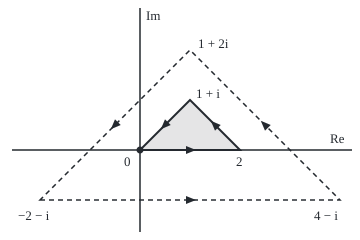

# Cauchy's theorem: a holomorphic function integrates to zero round any loop with no hole inside

[Syllabus](../../../SYLLABUS.md) → [Complex analysis](../README.md) → [Contour Integrals and Cauchy's Theorem](../README.md#s03) → Cauchy's theorem

---

## General Overview

A regatta is sailed anticlockwise round three buoys, in kilometres east and north of the start: 0, then 2, then 1 + i, then home. The course is a triangle of area 1 square kilometre.

Multiply a function's value by each small step of the boat and add: that sum is the contour integral ([Contour integrals](01-contour-integrals.md)). For z^2 the three legs give 2.666667, −3.333333 + 0.666667i and 0.666667 − 0.666667i. They add to 0. For e^z the legs differ and the total is 0 again.

Now take 1/z, which has no value at 0, the start buoy. Move the course one kilometre east and the total is 0. Triple it, with corners −2 − i, 4 − i, 1 + 2i, and the total is 2πi, about 6.283185i. Both boats pass only points where 1/z is defined; what changed is the water inside, which now holds 0.

**If a function has a complex derivative at every point of a region with no holes, its integral round every closed loop in that region is 0, so it has an antiderivative there.**

**What kind of fact this is:** a theorem, proved in Why it works when the derivative is continuous; Goursat's stronger version is stated there and proved in a folded callout.

### The picture: the course and the tripled course

<p align="center"></p>

To scale: 50 units per kilometre, 0 at (140, 150). Shaded course: (140, 150), (240, 150), (190, 100); dashed tripled course: (40, 200), (340, 200), (190, 50).

---

## The formula

Reminder: $\oint_\gamma f(z)\,dz$ is the contour integral once anticlockwise round the loop γ; holomorphic means having a complex derivative at every point ([The complex derivative](../02-Holomorphic%20Functions/01-complex-derivative-and-cauchy-riemann.md)). A region is **simply connected** when it is open (each point has a small disc round it inside the region), joined up, and every loop shrinks to a point without leaving it: it has no holes. A disc qualifies; the plane without 0 does not.

$$\oint_\gamma f(z)\,dz = 0$$

**Read it aloud:** round any closed loop in a region with no holes, a function holomorphic throughout it integrates to zero.

The proof's engine, Green's theorem in complex form:

$$\oint_\gamma f(z)\,dz = i \iint_D \left(f_x + i\,f_y\right) dA$$

**Read it aloud:** the loop integral is i times the area integral of f's eastward slope plus i times its northward slope.

The consequence, an antiderivative:

$$F(z) = \int_{z_0}^{z} f(w)\,dw, \qquad F'(z) = f(z)$$

**Read it aloud:** integrating f from a base point to z, by any path, gives a function whose derivative is f.

| Symbol | Plain meaning | In our example | Push it up and the answer… |
| --- | --- | --- | --- |
| $z$, $x$, $y$ | a point x + iy: x km east, y north | buoys 0, 2, 1 + i | — |
| $f$, $u$, $v$ | the function; its real and imaginary parts | z^2: u = x^2 − y^2, v = 2xy | still 0, if holomorphic |
| $f'$, $f_x$, $f_y$ | complex derivative; f's slopes east and north | for z^2: 2z, 2z, 2iz | — |
| $u_x$, $u_y$, $v_x$, $v_y$ | the four real slopes of u and v | 2x, −2y, 2y, 2x | — |
| $\gamma$, $dz$ | the closed loop; one small step along it | the course | reversed: sign flips |
| $D$, $dA$ | the region the loop encloses; a small patch of its area | the course's water, area 1 | bigger, same 0 |
| $F$, $z_0$, $w$ | antiderivative; base point; point moving along the path | e^z − 1, base 0 | — |
| $\bar{z}$ | the conjugate, read "z-bar": x − iy | not holomorphic: 2i round the course | 2i times the area |

### When it holds

- **Holomorphic inside, not only on the loop.** 1/z is smooth all along the tripled course, yet gives 2πi, because 0 sits inside.
- **No holes.** On the plane with 0 removed, 1/z is holomorphic everywhere, and the loop round 0 still gives 2πi.
- **A complex derivative, not mere smoothness.** z-bar has smooth parts but no complex derivative, and gives 2i round the course.
- **A closed loop.** An open path gives F(end) − F(start): 0.468694 + 2.287355i for e^z from 0 to 1 + i.

---

## Why it works

### Step 0: two line integrals become two vanishing area integrals

A complex loop integral is two real line integrals. Green's theorem turns each into an area integral ([Green's theorem](../../06-Calculus%20and%20analysis/09-Vector%20Calculus/06-greens-theorem.md)), and the Cauchy-Riemann equations make both integrands zero.

### Step 1: split into real and imaginary parts

Write f = u + iv and dz = dx + i dy, and multiply out:

$$f\,dz = (u\,dx - v\,dy) + i\,(v\,dx + u\,dy)$$

Each bracket is a real line integral of the kind Green's theorem handles: the loop integral of P dx + Q dy equals the area integral of Q_x − P_y, for real functions P and Q.

### Step 2: apply Green twice

Real part: P = u, Q = −v, so the area integrand is −v_x − u_y. Imaginary part: P = v, Q = u, so it is u_x − v_y. Together:

$$\oint_\gamma f\,dz = \iint_D \left(-v_x - u_y\right) dA + i \iint_D \left(u_x - v_y\right) dA$$

Green's theorem needs the four slopes to be continuous, so this proof does too.

### Step 3: Cauchy-Riemann kills both integrands

A complex derivative is the same from every direction. Eastward, $f_x = f'$; a northward step h moves z by ih, so $f_y = i f'$. In parts, these are the Cauchy-Riemann equations $u_x = v_y$ and $u_y = -v_x$, so both integrands in Step 2 vanish. On z^2: u_x = 2x = v_y and u_y = −2y = −v_x.

Compactly, the two integrands are the parts of i(f_x + i f_y), and $f_x + i f_y = f' + i \cdot i f' = 0$: the code's second road.

For z-bar, f_x = 1 and f_y = −i, so f_x + i f_y = 2. The loop integral is 2i times the area: 2i round the course.

### Step 4: Goursat removes the continuity condition

Édouard Goursat showed the derivative need only exist. **Goursat's theorem:** if f is holomorphic on an open set containing a closed filled triangle T, then the integral of f round the edge of T is 0. No continuity of f' is assumed.

The proof skips Green. Joining midpoints cuts the triangle into four, and one carries at least a quarter of the total. Repeating closes on a point near which f is nearly c + kz for constants c and k, whose loop integral is 0; the leftover shrinks faster than the quarter-shares.

<details>
<summary>Detailed proof: Goursat's subdivision</summary>

Let I be the size of the edge integral of T, with perimeter p and diameter d (longest distance across). The four midpoint triangles' edge integrals add to the original, so one, T1, has size at least I/4. Repeating gives nested triangles Tn with edge integral at least $I/4^n$, perimeter $p/2^n$, diameter $d/2^n$.

They share a point z* in T, where $f(z) = f(z^*) + f'(z^*)(z - z^*) + \psi(z)(z - z^*)$ with ψ(z) → 0: given ε > 0 there is δ > 0 with $|\psi(z)| < \varepsilon$ whenever $|z - z^*| < \delta$. The first two terms have an antiderivative, so integrate to 0. Once $d/2^n < \delta$, the third is at most ε times $d/2^n$ on the edge of Tn, so $I/4^n \le \varepsilon\,dp/4^n$. Thus $I \le \varepsilon\,dp$ for every ε > 0, and I = 0.

</details>

### Step 5: from triangles to every loop

A closed polygon that does not cross itself, in a simply connected region, cuts into triangles whose inner edges cancel; smooth loops are limits of polygons. The proof for every loop is on [Deforming a loop](04-deforming-contours-and-winding-numbers.md).

### Step 6: an antiderivative on every region with no holes

Let F(z) be the integral from a base point $z_0$ to z along any path in the region. Two paths to z, one reversed, make a loop, so they agree. F(z + h) − F(z) is the integral along a short segment, h f(z) plus something smaller than h, so F' = f, as in [Antiderivatives](02-antiderivatives-and-path-independence.md).

On the course, e^z from 0 to 1 + i gives 0.468694 + 2.287355i straight and via buoy 2: e^(1+i) − 1.

<details>
<summary>A holomorphic logarithm for a function that is never zero</summary>

If f is holomorphic and never 0 on a simply connected region, f'/f is holomorphic, so it has an antiderivative L, shifted so that $e^{L(z_0)} = f(z_0)$. The derivative of $f e^{-L}$ is $f' e^{-L} - f L' e^{-L} = 0$, so $f e^{-L}$ stays 1 and $f = e^{L}$. For f(z) = z on the plane cut along a ray from 0, this is a branch of [The complex logarithm](../02-Holomorphic%20Functions/04-complex-logarithm.md); with only 0 removed it fails, since 1/z round the tripled course gives 2πi.

</details>

---

## Worked numbers, by hand

| Step | Arithmetic | Value |
| --- | --- | --- |
| z^2, leg 0 → 2 | antiderivative z^3/3: (8 − 0)/3 | 2.666667 |
| z^2, leg 2 → 1 + i | (1 + i)^3 = −2 + 2i, so (−2 + 2i − 8)/3 | −3.333333 + 0.666667i |
| z^2, leg 1 + i → 0 | (0 − (−2 + 2i))/3 | 0.666667 − 0.666667i |
| z^2, round the course | the three legs | **0** |
| e^z, the three legs | e^2 − 1, then e^(1+i) − e^2, then 1 − e^(1+i) | 6.389056; −5.920362 + 2.287355i; −0.468694 − 2.287355i |
| e^z, round the course | each value of e^z at a buoy enters once with +, once with − | **0** |
| 1/z, course moved east | 0 outside 1, 3, 2 + i | **0** |
| 1/z, course tripled | 0 inside −2 − i, 4 − i, 1 + 2i | **6.283185i**, which is 2πi |

A holomorphic function comes home to 0 round any course with no hole inside; 2πi is the signature of the missing point at 0.

### What breaks if you drop a piece

| Mistake | Comes out at | What went wrong |
| --- | --- | --- |
| Checking 1/z only along the tripled course | 6.283185i, not 0 | 0 is inside: a hole |
| z-bar, smooth but not holomorphic | 2i, by both roads | f_x + i f_y = 2 |
| z-bar from 0 to 1 + i, two routes | 1 straight, 1 + 2i via 2 | No antiderivative |

The code prints all three.

---

## Code, from first principles, and it actually runs

Road one is a trapezoid sum along each leg, checked against the antiderivative. Road two never touches the course: i times the area integral of f_x + i f_y, slopes by finite differences, over a mesh of small triangles. With 10, 100 and 1000 steps a leg, the e^z total sits 0.030298, 0.000303 and 0.000003 from 0. Four asserts: legs and both roads, the shrinking error, 1/z against 0 and 2πi, z-bar against 2i times the shoelace area.

### Python

```python
# Cauchy's theorem -- the check behind the card.  Standard library only.
# Road one: the loop integral as a trapezoid sum along each straight leg.
# Road two: Green's theorem, i times the area integral of f_x + i f_y over the
# triangle, with the partial derivatives taken by finite differences.
import math

def show(w):                                 # 'a + bi', six decimals, no -0.000000
    a, b = round(w.real, 6) + 0.0, round(w.imag, 6) + 0.0
    return f"{a:.6f} {'-' if b < 0 else '+'} {abs(b):.6f}i"

def leg(f, a, b, n=20000):                   # trapezoid sum of f(z) dz from a to b
    d = (b - a) / n
    return d * (sum(f(a + k * d) for k in range(1, n)) + (f(a) + f(b)) / 2)

def loop(f, pts, n=20000):
    return [leg(f, pts[k], pts[(k + 1) % 3], n) for k in range(3)]

def green(f, pts, m=300, h=1e-4):            # i * (f_x + i f_y) dA over m^2 small triangles
    a, u, v = pts[0], (pts[1] - pts[0]) / m, (pts[2] - pts[0]) / m
    cell, total = abs((u.conjugate() * v).imag) / 2, 0j
    cents = [(j + 1 / 3, k + 1 / 3) for j in range(m) for k in range(m - j)]
    cents += [(j + 2 / 3, k + 2 / 3) for j in range(m) for k in range(m - j - 1)]
    for j, k in cents:
        g = a + j * u + k * v
        total += ((f(g + h) - f(g - h)) + 1j * (f(g + 1j * h) - f(g - 1j * h))) / (2 * h) * cell
    return 1j * total

course = [0j, 2 + 0j, 1 + 1j]
area = sum((course[k].conjugate() * course[(k + 1) % 3]).imag for k in range(3)) / 2
print(f"course 0 -> 2 -> 1+i, area by shoelace: {area:.6f}")
expz = lambda z: math.exp(z.real) * complex(math.cos(z.imag), math.sin(z.imag))
e1i = complex(math.e * math.cos(1), math.e * math.sin(1))
exact = {"z^2": [8 / 3, (-10 + 2j) / 3, (2 - 2j) / 3], "e^z": [math.e ** 2 - 1, e1i - math.e ** 2, 1 - e1i]}
for name, f in (("z^2", lambda z: z * z), ("e^z", expz)):
    legs, r2 = loop(f, course), green(f, course)
    print(f"{name} legs, sums:           " + " | ".join(show(w) for w in legs))
    print(f"{name} legs, antiderivative: " + " | ".join(show(w) for w in exact[name]))
    print(f"{name} loop: road one {show(sum(legs))}, road two {show(r2)}")
    assert all(abs(p - q) < 1e-6 for p, q in zip(legs, exact[name])) and abs(sum(legs) - r2) < 1e-6
sizes = [abs(sum(loop(expz, course, n))) for n in (10, 100, 1000)]
print("e^z loop, trapezoid with 10, 100, 1000 steps a leg: " + ", ".join(f"{s:.6f}" for s in sizes))
assert sizes[0] > 50 * sizes[1] > 2500 * sizes[2]
via2 = leg(expz, 0j, 2 + 0j) + leg(expz, 2 + 0j, 1 + 1j)
print(f"e^z from 0 to 1+i: straight {show(leg(expz, 0j, 1 + 1j))}, via 2 {show(via2)}, e^(1+i) - 1 = {show(e1i - 1)}")
moved = sum(loop(lambda z: 1 / z, [p + 1 for p in course]))
big = [3 * p - 2 - 1j for p in course]
ring = sum(loop(lambda z: 1 / z, big))
print(f"1/z, course moved to 1 -> 3 -> 2+i: {show(moved)}")
print(f"1/z, course tripled to -2-i -> 4-i -> 1+2i: {show(ring)}, 2 pi i = {show(2j * math.pi)}")
assert abs(moved) < 1e-6 and abs(ring - 2j * math.pi) < 1e-6
bar = lambda z: z.conjugate()
zb, gb = sum(loop(bar, course)), green(bar, course)
print(f"mistake, z-bar round the course: road one {show(zb)}, road two {show(gb)}, 2i x area = {show(2j * area)}")
print(f"mistake, z-bar from 0 to 1+i: straight {show(leg(bar, 0j, 1 + 1j))}, via 2 {show(leg(bar, 0j, 2 + 0j) + leg(bar, 2 + 0j, 1 + 1j))}")
assert abs(zb - 2j * area) < 1e-6 and abs(gb - 2j * area) < 1e-6
print(f"mistake, 1/z round the tripled course clockwise: {show(sum(loop(lambda z: 1 / z, big[::-1])))}")
svg = lambda p: f"({140 + 50 * p.real:.0f}, {150 - 50 * p.imag:.0f})"
print("figure, course " + " ".join(svg(p) for p in course) + ", tripled " + " ".join(svg(p) for p in big))
print("ALL CHECKS PASS")
```

**Ran 2026-09-28 on macOS, Python 3.14.6, standard library only. All checks passed. Output, pasted from the run:**

```
course 0 -> 2 -> 1+i, area by shoelace: 1.000000
z^2 legs, sums:           2.666667 + 0.000000i | -3.333333 + 0.666667i | 0.666667 - 0.666667i
z^2 legs, antiderivative: 2.666667 + 0.000000i | -3.333333 + 0.666667i | 0.666667 - 0.666667i
z^2 loop: road one 0.000000 + 0.000000i, road two 0.000000 + 0.000000i
e^z legs, sums:           6.389056 + 0.000000i | -5.920362 + 2.287355i | -0.468694 - 2.287355i
e^z legs, antiderivative: 6.389056 + 0.000000i | -5.920362 + 2.287355i | -0.468694 - 2.287355i
e^z loop: road one 0.000000 + 0.000000i, road two 0.000000 + 0.000000i
e^z loop, trapezoid with 10, 100, 1000 steps a leg: 0.030298, 0.000303, 0.000003
e^z from 0 to 1+i: straight 0.468694 + 2.287355i, via 2 0.468694 + 2.287355i, e^(1+i) - 1 = 0.468694 + 2.287355i
1/z, course moved to 1 -> 3 -> 2+i: 0.000000 + 0.000000i
1/z, course tripled to -2-i -> 4-i -> 1+2i: 0.000000 + 6.283185i, 2 pi i = 0.000000 + 6.283185i
mistake, z-bar round the course: road one 0.000000 + 2.000000i, road two 0.000000 + 2.000000i, 2i x area = 0.000000 + 2.000000i
mistake, z-bar from 0 to 1+i: straight 1.000000 + 0.000000i, via 2 1.000000 + 2.000000i
mistake, 1/z round the tripled course clockwise: 0.000000 - 6.283185i
figure, course (140, 150) (240, 150) (190, 100), tripled (40, 200) (340, 200) (190, 50)
ALL CHECKS PASS
```

### Rust

Same numbers, same labels, built with `rustc --edition 2021 -O`.

```rust
// Cauchy's theorem -- the same check as the Python, in Rust.  No crates.
// Road one: the loop integral as a trapezoid sum along each straight leg.
// Road two: Green's theorem, i times the area integral of f_x + i f_y over the
// triangle, with the partial derivatives taken by finite differences.
use std::f64::consts::{E, PI};
use std::ops::{Add, Mul, Sub};
#[derive(Clone, Copy)] struct C { re: f64, im: f64 }
fn c(re: f64, im: f64) -> C { C { re, im } }
impl Add for C { type Output = C; fn add(self, o: C) -> C { c(self.re + o.re, self.im + o.im) } }
impl Sub for C { type Output = C; fn sub(self, o: C) -> C { c(self.re - o.re, self.im - o.im) } }
impl Mul for C { type Output = C; fn mul(self, o: C) -> C { c(self.re * o.re - self.im * o.im, self.re * o.im + self.im * o.re) } }
fn sc(a: C, k: f64) -> C { c(a.re * k, a.im * k) }
fn abs(a: C) -> f64 { a.re.hypot(a.im) }
fn show(w: C) -> String { // 'a + bi', six decimals, no -0.000000
    let a = format!("{:.6}", w.re).replace("-0.000000", "0.000000");
    let b = format!("{:.6}", w.im.abs());
    format!("{} {} {}i", a, if w.im < 0.0 && b != "0.000000" { '-' } else { '+' }, b)
}
fn leg(f: &dyn Fn(C) -> C, a: C, b: C, n: usize) -> C { // trapezoid sum of f(z) dz from a to b
    let d = sc(b - a, 1.0 / n as f64);
    let mut s = sc(f(a) + f(b), 0.5);
    for k in 1..n { s = s + f(a + sc(d, k as f64)) }
    d * s
}
fn lp(f: &dyn Fn(C) -> C, p: &[C], n: usize) -> Vec<C> { (0..3).map(|k| leg(f, p[k], p[(k + 1) % 3], n)).collect() }
fn sum(v: &[C]) -> C { v.iter().fold(c(0.0, 0.0), |s, &w| s + w) }
fn green(f: &dyn Fn(C) -> C, p: &[C]) -> C { // i * (f_x + i f_y) dA over m^2 small triangles
    let (m, h) = (300usize, 1e-4);
    let (u, v) = (sc(p[1] - p[0], 1.0 / m as f64), sc(p[2] - p[0], 1.0 / m as f64));
    let (cell, mut t) = ((u.re * v.im - u.im * v.re).abs() / 2.0, c(0.0, 0.0));
    let mut cents = Vec::new();
    for j in 0..m { for k in 0..m - j { cents.push((j as f64 + 1.0 / 3.0, k as f64 + 1.0 / 3.0)) } }
    for j in 0..m { for k in 0..m - j - 1 { cents.push((j as f64 + 2.0 / 3.0, k as f64 + 2.0 / 3.0)) } }
    for (j, k) in cents {
        let g = p[0] + sc(u, j) + sc(v, k);
        let (fx, fy) = (f(g + c(h, 0.0)) - f(g - c(h, 0.0)), f(g + c(0.0, h)) - f(g - c(0.0, h)));
        t = t + sc(fx + c(0.0, 1.0) * fy, cell / (2.0 * h));
    }
    c(0.0, 1.0) * t
}
fn main() {
    let course = [c(0.0, 0.0), c(2.0, 0.0), c(1.0, 1.0)];
    let area = (0..3).map(|k| { let (a, b) = (course[k], course[(k + 1) % 3]); a.re * b.im - a.im * b.re }).sum::<f64>() / 2.0;
    println!("course 0 -> 2 -> 1+i, area by shoelace: {:.6}", area);
    let (expz, sq) = (|z: C| sc(c(z.im.cos(), z.im.sin()), z.re.exp()), |z: C| z * z);
    let e1i = c(E * 1f64.cos(), E * 1f64.sin());
    let ex1 = [c(8.0 / 3.0, 0.0), c(-10.0 / 3.0, 2.0 / 3.0), c(2.0 / 3.0, -2.0 / 3.0)];
    let ex2 = [c(E * E - 1.0, 0.0), e1i - c(E * E, 0.0), c(1.0, 0.0) - e1i];
    let cases: [(&str, &dyn Fn(C) -> C, [C; 3]); 2] = [("z^2", &sq, ex1), ("e^z", &expz, ex2)];
    for (name, f, ex) in cases {
        let (legs, r2) = (lp(f, &course, 20000), green(f, &course));
        println!("{} legs, sums:           {}", name, legs.iter().map(|&w| show(w)).collect::<Vec<_>>().join(" | "));
        println!("{} legs, antiderivative: {}", name, ex.iter().map(|&w| show(w)).collect::<Vec<_>>().join(" | "));
        println!("{} loop: road one {}, road two {}", name, show(sum(&legs)), show(r2));
        assert!(legs.iter().zip(ex.iter()).all(|(&p, &q)| abs(p - q) < 1e-6) && abs(sum(&legs) - r2) < 1e-6);
    }
    let sizes: Vec<f64> = [10usize, 100, 1000].iter().map(|&n| abs(sum(&lp(&expz, &course, n)))).collect();
    println!("e^z loop, trapezoid with 10, 100, 1000 steps a leg: {}", sizes.iter().map(|s| format!("{:.6}", s)).collect::<Vec<_>>().join(", "));
    assert!(sizes[0] > 50.0 * sizes[1] && 50.0 * sizes[1] > 2500.0 * sizes[2]);
    let (o, two, top) = (course[0], course[1], course[2]);
    let via2 = leg(&expz, o, two, 20000) + leg(&expz, two, top, 20000);
    println!("e^z from 0 to 1+i: straight {}, via 2 {}, e^(1+i) - 1 = {}", show(leg(&expz, o, top, 20000)), show(via2), show(e1i - c(1.0, 0.0)));
    let inv = |z: C| sc(c(z.re, -z.im), 1.0 / (z.re * z.re + z.im * z.im));
    let moved: Vec<C> = course.iter().map(|&p| p + c(1.0, 0.0)).collect();
    let big: Vec<C> = course.iter().map(|&p| sc(p, 3.0) - c(2.0, 1.0)).collect();
    let (mv, ring) = (sum(&lp(&inv, &moved, 20000)), sum(&lp(&inv, &big, 20000)));
    println!("1/z, course moved to 1 -> 3 -> 2+i: {}", show(mv));
    println!("1/z, course tripled to -2-i -> 4-i -> 1+2i: {}, 2 pi i = {}", show(ring), show(c(0.0, 2.0 * PI)));
    assert!(abs(mv) < 1e-6 && abs(ring - c(0.0, 2.0 * PI)) < 1e-6);
    let bar = |z: C| c(z.re, -z.im);
    let (zb, gb) = (sum(&lp(&bar, &course, 20000)), green(&bar, &course));
    println!("mistake, z-bar round the course: road one {}, road two {}, 2i x area = {}", show(zb), show(gb), show(c(0.0, 2.0 * area)));
    println!("mistake, z-bar from 0 to 1+i: straight {}, via 2 {}", show(leg(&bar, o, top, 20000)), show(leg(&bar, o, two, 20000) + leg(&bar, two, top, 20000)));
    assert!(abs(zb - c(0.0, 2.0 * area)) < 1e-6 && abs(gb - c(0.0, 2.0 * area)) < 1e-6);
    let rev: Vec<C> = big.iter().rev().copied().collect();
    println!("mistake, 1/z round the tripled course clockwise: {}", show(sum(&lp(&inv, &rev, 20000))));
    let svg = |p: &C| format!("({:.0}, {:.0})", 140.0 + 50.0 * p.re, 150.0 - 50.0 * p.im);
    println!("figure, course {}, tripled {}", course.iter().map(svg).collect::<Vec<_>>().join(" "), big.iter().map(svg).collect::<Vec<_>>().join(" "));
    println!("ALL CHECKS PASS");
}
```

**Ran 2026-09-28 on macOS, rustc 1.98.1, no crates. All checks passed. Output, pasted from the run:**

```
course 0 -> 2 -> 1+i, area by shoelace: 1.000000
z^2 legs, sums:           2.666667 + 0.000000i | -3.333333 + 0.666667i | 0.666667 - 0.666667i
z^2 legs, antiderivative: 2.666667 + 0.000000i | -3.333333 + 0.666667i | 0.666667 - 0.666667i
z^2 loop: road one 0.000000 + 0.000000i, road two 0.000000 + 0.000000i
e^z legs, sums:           6.389056 + 0.000000i | -5.920362 + 2.287355i | -0.468694 - 2.287355i
e^z legs, antiderivative: 6.389056 + 0.000000i | -5.920362 + 2.287355i | -0.468694 - 2.287355i
e^z loop: road one 0.000000 + 0.000000i, road two 0.000000 + 0.000000i
e^z loop, trapezoid with 10, 100, 1000 steps a leg: 0.030298, 0.000303, 0.000003
e^z from 0 to 1+i: straight 0.468694 + 2.287355i, via 2 0.468694 + 2.287355i, e^(1+i) - 1 = 0.468694 + 2.287355i
1/z, course moved to 1 -> 3 -> 2+i: 0.000000 + 0.000000i
1/z, course tripled to -2-i -> 4-i -> 1+2i: 0.000000 + 6.283185i, 2 pi i = 0.000000 + 6.283185i
mistake, z-bar round the course: road one 0.000000 + 2.000000i, road two 0.000000 + 2.000000i, 2i x area = 0.000000 + 2.000000i
mistake, z-bar from 0 to 1+i: straight 1.000000 + 0.000000i, via 2 1.000000 + 2.000000i
mistake, 1/z round the tripled course clockwise: 0.000000 - 6.283185i
figure, course (140, 150) (240, 150) (190, 100), tripled (40, 200) (340, 200) (190, 50)
ALL CHECKS PASS
```

> [!TIP]
> **Try changing**
> - **Sail the tripled course clockwise.** Guess first. The total is −6.283185i.
> - **Shift the tripled course west.** Guess first. Change `- 2 - 1j` to `- 3 - 1j`: 0 stays inside, so still 2πi.
> - **Cut to 10 steps a leg.** Guess first. The e^z loop reads 0.030298: a numerical error, not the theorem failing.

---

## The usual mistake

> [!warning]
> **Checking the function on the loop instead of inside it.** 1/z has a derivative at every point of the tripled course, and the total is still 2πi. One missing point inside is enough.
>
> - **Smooth read as holomorphic.** z-bar fails Cauchy-Riemann and gives 2i round the course.
> - **Forgetting direction.** Clockwise flips the sign: −6.283185i for 1/z round the tripled course.

---

## Where you meet it in real life

- **Evaluating real integrals.** Contour methods close a real line into a loop; pieces enclosing no singularity give 0, and the rest is counted by [The residue theorem](../05-Laurent%20Series%2C%20Singularities%20and%20Residues/05-the-residue-theorem.md).
- **Two-dimensional flow.** In steady ideal flow the conjugate velocity is holomorphic away from sources and vortices; its loop integral is circulation plus i times net outflow, so both vanish round a loop enclosing neither.
- **Inverse transforms.** Sliding an inverse transform's vertical line across a strip with no singularities leaves it unchanged: this theorem on the rectangle between the lines ([Where a transform lives](../08-Transforms%20in%20Outline/06-strips-of-convergence-and-shifting-the-line.md)).

> **Say it back**
> A complex loop integral is two real line integrals. Green turns them into area integrals, and Cauchy-Riemann makes both integrands zero. Goursat gets the same zero without a continuous derivative. So in a region with no holes, a holomorphic function integrates to 0 round every loop and has an antiderivative. A hole, like 0 for 1/z, can leave 2πi.

---

## What this builds on

- [Antiderivatives](02-antiderivatives-and-path-independence.md): zero loop integrals and path independence are the same fact.
- [Green's theorem](../../06-Calculus%20and%20analysis/09-Vector%20Calculus/06-greens-theorem.md): turning a loop integral into an area integral.
- [The complex derivative](../02-Holomorphic%20Functions/01-complex-derivative-and-cauchy-riemann.md): the equations that make the area integrands vanish.
- [Contour integrals](01-contour-integrals.md): the integral along a parametrised path.

## Where this goes next

- [Deforming a loop](04-deforming-contours-and-winding-numbers.md): sliding loops, and counting turns round a hole.
- [Where a transform lives](../08-Transforms%20in%20Outline/06-strips-of-convergence-and-shifting-the-line.md): moving a transform's line of integration.
- [Cauchy's integral formula](05-cauchys-integral-formula.md): a loop round one hole recovers the function's value there.

---

## Sources

Verified 2026-09-28: every link below opens the named book's page.

- Lebl, Jiří. *Guide to Cultivating Complex Analysis*. [Book page and free PDF](https://www.jirka.org/ca/). Goursat's theorem for a closed filled triangle, as stated here.
- Stein, Elias M., and Rami Shakarchi. *Complex Analysis*. Princeton University Press, 2003. [Publisher page](https://press.princeton.edu/books/hardcover/9780691113852/complex-analysis). Chapter 2: Goursat by subdivision, local antiderivatives, Cauchy's theorem.
- Beck, Matthias, Gerald Marchesi, Dennis Pixton, and Lucas Sabalka. *A First Course in Complex Analysis*. [Book page and free PDF](https://matthbeck.github.io/complex.html). A free open textbook; its integration chapter covers Cauchy's theorem.
