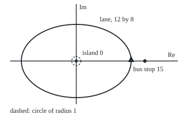
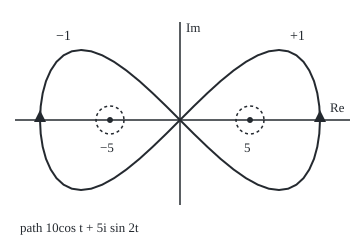

# Deforming a loop: slide it anywhere without crossing a singularity, and count how many times it winds

[Syllabus](../../../SYLLABUS.md) → [Complex analysis](../README.md) → [Contour Integrals and Cauchy's Theorem](../README.md#s03) → Deforming a loop

---

## General Overview

A car drives an oval roundabout: the lane runs 12 metres east and west of the island, 8 metres north and south. Put the plane on the map, east along the real axis, north up the imaginary axis, the island at 0. One lap anticlockwise, the usual direction, counts 1. Two laps count 2. A lap the wrong way counts −1. A bus stop 15 metres east, outside the lane, is circled 0 times.

That count has a formula: integrate 1/(z − a) round the loop, where a is the point circled, and divide by 2πi. The result, always a whole number, is called the **winding number** from here on.

It rests on [Cauchy's theorem](03-cauchys-theorem.md): a loop round a region with no hole gives 0. So a loop can be slid, stretched and shrunk freely, provided it never crosses a **singularity**, a point where the function has no value: here the island. The oval then gives the same integral as a small circle round the island.

A double roundabout has islands at 5 and −5. A figure-eight lap winds +1 round the east island and −1 round the west: its integral is one small circle per island, counted with sign.

**A loop may be slid anywhere without crossing a singularity and its integral does not change; so an integral round a loop is the sum, over the holes it circles, of a small circle's integral times the winding number, the whole number of times the loop goes round that hole.**

**What kind of fact this is:** a theorem, proved on this card in Why it works for the functions used here and in general on the residue-theorem card; the winding number is a definition, and that it is whole is proved here.

### The picture: the oval lane, the island and the bus stop

<p align="center"></p>

To scale, 9 pixels per metre. The triangle at 12 + 0i shows the car heading north: anticlockwise. The dashed circle gives the same integral of dz/z as the lane.

---

## The formula

Notation first, in words. The loop integral sign $\oint$ means a contour integral once round a closed path ([Contour integrals](01-contour-integrals.md)). This card introduces the **winding number** $n(\gamma, a)$, read "n of gamma and a": the net anticlockwise laps the loop $\gamma$ (gamma) makes round the point $a$.

$$n(\gamma, a) = \frac{1}{2\pi i}\oint_\gamma \frac{dz}{z - a}$$

**Read it aloud:** integrate one over the arrow from the island to the car, once round, and divide by 2πi; the result counts laps.

Now let $f$ be holomorphic (it has a complex derivative) everywhere in the plane except at $m$ holes $a_1, \dots, a_m$, none on the loop, and let $C_k$ be a small anticlockwise circle round $a_k$ alone.

$$\oint_\gamma f(z)\,dz = \sum_{k=1}^{m} n(\gamma, a_k)\oint_{C_k} f(z)\,dz$$

**Read it aloud:** the loop's integral is each hole's small-circle integral times the loop's laps round that hole, added up.

For a building block $c_k/(z - a_k)$, with $c_k$ a fixed number called its strength, the small circle gives $2\pi i\,c_k$. The double roundabout's function is

$$f(z) = \frac{4z + 10}{z^2 - 25} = \frac{3}{z - 5} + \frac{1}{z + 5},$$

so its holes are 5 and −5, with strengths 3 and 1.

| Symbol | Plain meaning | In our example | Push it up and the answer… |
| --- | --- | --- | --- |
| $\gamma$, $\oint$ | a loop, the car's route; the integral once round it | the oval lane | more laps, bigger count |
| $z$ | a point on the loop: the car's position | 12 + 0i at the start | — |
| $a$ | the point circled | the island, 0 | past the lane, count 0 |
| $n(\gamma, a)$ | winding number: net anticlockwise laps round $a$ | 1, 2, −1; figure-eight +1 and −1 | integral grows by 2πi per lap |
| $f$ | a function holomorphic except at its holes | (4z + 10)/(z^2 − 25) | — |
| $a_k$, $c_k$, $m$ | the holes, their strengths, how many | 5 and −5; 3 and 1; 2 | bigger strength, bigger share |
| $C_k$, $r$ | small anticlockwise circle round one hole; its radius | radius 1 | no change |
| $t$, $i$ | the path's clock, in radians; the number with $i^2 = -1$ | 0 to 2π per lap | — |

### When it holds

- **No hole on the loop.** Through the island, $1/z$ has no value: the integral is undefined.
- **The loop is closed.** Stopped halfway, the arrow from the island has turned half a turn: only a loop ending where it began gives a whole number.
- **Sliding never crosses a hole.** Shift the lane 20 metres east so the island falls outside, and the integral of dz/z jumps from 6.283185i to 0.

---

## Why it works

### Step 0: the region between two loops decides

A loop surrounding only points where $f$ is holomorphic gives 0, so two loops differing only across such a region give the same integral.

### Step 1: one lap of a small circle gives 2πi

Walk a circle of radius $r$ round the island: $z = r(\cos t + i\sin t)$ as $t$ runs from 0 to 2π. Then $dz/dt = r(-\sin t + i\cos t) = i z$. So $dz/z = i\,dt$, and one lap gives $\int_0^{2\pi} i\,dt = 2\pi i$, whatever $r$ is.

With the island at $a_k$ and strength $c_k$ the same steps give $2\pi i\,c_k$: at 5 with strength 3, 18.849556i.

### Step 2: the oval can shrink to the small circle

Cut the ring between the oval and the radius-1 circle along the real axis, east and west of the island. It falls into an upper and a lower piece, neither containing the island, so Cauchy's theorem gives 0 round each. Add the two boundaries: the cuts are travelled once each way and cancel. What remains is the oval anticlockwise plus the small circle clockwise, summing to 0. So the oval equals the small circle, $2\pi i$. The checks find 6.283185i for the oval and for circles of radius 1 and 0.1.

<details>
<summary>Detailed proof: why Cauchy's theorem applies to each piece</summary>

The upper piece, edges included, avoids the ray running straight down from 0. The plane minus that ray is star-shaped about $i$: the segment from $i$ to any point off the ray stays off it. On a star-shaped region a holomorphic function has an antiderivative ([Antiderivatives](02-antiderivatives-and-path-independence.md)), so every closed path there gives 0; $1/z$ is holomorphic off 0. The lower piece avoids the upward ray and gives 0 the same way. Nothing here used the oval's shape: any two loops joined by cuts into hole-free pieces give equal integrals.

</details>

### Step 3: the winding number is a whole number

Write $z - a$, the arrow from the island to the car, in polar form. Then $dz/(z - a)$ has a real part, the change in the logarithm of the arrow's length, and an imaginary part, the change in its angle. Back at the start the length is unchanged, so the real part totals 0. The angle has turned through whole turns, $2\pi$ each. Divide by $2\pi i$ and a whole number remains.

That is the checks' second road. They follow the arrow in 100000 small steps, add each step's turn, read off by atan2 (the angle of a point, in (−π, π]), and divide by 2π: 1.000000, 2.000000 and −1.000000 for the three laps, matching the integral.

<details>
<summary>Detailed proof: the integral is 2πi times a whole number</summary>

Let $\gamma(t)$, $0 \le t \le T$, be a closed path avoiding $a$. Define $h(t) = \int_0^t \gamma'(s)/(\gamma(s) - a)\,ds$. The function $(\gamma(t) - a)\,e^{-h(t)}$ has derivative $\gamma' e^{-h} - (\gamma - a)\,h' e^{-h} = 0$, so it is constant. Since $\gamma(T) = \gamma(0)$, this forces $e^{-h(T)} = 1$. The exponential is 1 exactly at whole multiples of $2\pi i$ ([Euler's formula](../01-Complex%20Numbers%20and%20the%20Plane/04-eulers-formula.md)), and $h(T)$ is the loop integral. Moving $a$ without touching the loop changes $h(T)$ continuously, so the whole number stays fixed, and it is 0 for $a$ far away.

</details>

### Step 4: several holes, each with its own small circle

The double roundabout's $f$ splits into $3/(z - 5)$ and $1/(z + 5)$. By the winding number's definition, the pieces give $3 \cdot 2\pi i \cdot n(\gamma, 5)$ and $1 \cdot 2\pi i \cdot n(\gamma, -5)$ round the figure-eight. The small circle round 5 sees only the first piece, since the second is holomorphic on a disc containing that circle. So:

$$\oint_\gamma f\,dz = (+1)(2\pi i \cdot 3) + (-1)(2\pi i \cdot 1) = 4\pi i.$$

For a general $f$, subtract near each hole the part that blows up there ([Laurent series](../05-Laurent%20Series%2C%20Singularities%20and%20Residues/01-laurent-series.md)); the remainder gives 0, and so do the powers beyond the first. The full statement is [The residue theorem](../05-Laurent%20Series%2C%20Singularities%20and%20Residues/05-the-residue-theorem.md). Topology counts the same laps by deforming loops alone, with no integral: The circle's fundamental group is the integers.

### The picture: the figure-eight round two islands

<p align="center"></p>

To scale, 14 pixels per metre; t runs from 0 to 2π. Both triangles point north: anticlockwise round 5, clockwise round −5. Dashed circles have radius 1.

---

## Worked numbers, by hand

| Step | Arithmetic | Value |
| --- | --- | --- |
| small circle round the island | $dz/z = i\,dt$, one lap is 2π of $t$ | 2πi = 6.283185i |
| the oval lane, once | same as the circle, by Step 2 | **n = 1** |
| two laps; the wrong way | 2 × 2πi and −2πi, divided by 2πi | **2 and −1** |
| bus stop at 15 | shrink the lane to a point away from 15 | **0** |
| strengths of $f$ | drop the factor z − 5, put z = 5: 30/10; drop z + 5, put z = −5: −10/−10 | 3 and 1 |
| small circles | 2πi × 3 and 2πi × 1 | 18.849556i and 6.283185i |
| figure-eight | (+1)(18.849556i) + (−1)(6.283185i) | **12.566371i = 4πi** |
| the oval lane round both | (+1)(18.849556i) + (+1)(6.283185i) | **25.132741i = 8πi** |

The figure-eight gives half the big loop's value: it subtracts the weaker hole instead of adding it.

### What breaks if you drop a piece

| Mistake | Comes out at | What went wrong |
| --- | --- | --- |
| Lane slid 20 m east, past the island | 0 for dz/z, not 6.283185i | The slide crossed the singularity |
| Figure-eight direction ignored | 25.132741i, not 12.566371i | The west island's circle must count −1 |
| Two laps counted as "inside, so once" | 6.283185i, not 12.566371i | Winding counts laps |

The code prints all three.

---

## Code, from first principles, and it actually runs

Two independent roads. Road one is a trapezoid sum of $f(z)\,dz$ along short chords of each path; its error falls about a hundredfold per tenfold more steps. Road two never integrates: it adds up the arrow's turns with atan2. The small circles and counted windings rebuild the figure-eight's integral.

### Python

```python
# Deforming a loop and winding numbers -- the check behind the card.  Standard
# library only.  Metres.  An oval roundabout lane, 12 by 8, round an island at 0;
# a double roundabout with islands at 5 and -5, driven as a figure-eight.
# Road one: a trapezoid sum of f(z) dz along the path.  Road two: add up, step
# by step with atan2, how far the arrow from the island to the car turns.
import math
TAU, N = 2 * math.pi, 100000
def clean(x): return 0.0 if abs(x) < 5e-7 else x
def fmt(z): return f"{clean(z.real):.6f} {'-' if clean(z.imag) < 0 else '+'} {abs(clean(z.imag)):.6f}i"
def path(curve, t0, t1, n): return [curve(t0 + (t1 - t0) * k / n) for k in range(n + 1)]
def integral(f, zs): return sum((f(u) + f(v)) / 2 * (v - u) for u, v in zip(zs, zs[1:]))
def turns(zs, a):
    steps = ((w - a) / (v - a) for v, w in zip(zs, zs[1:]))
    return sum(math.atan2(s.imag, s.real) for s in steps) / TAU
def pole(a): return lambda z: 1 / (z - a)
def oval(t, shift=0): return complex(12 * math.cos(t) + shift, 8 * math.sin(t))
def eight(t): return complex(10 * math.cos(t), 5 * math.sin(2 * t))
def ring(c, r): return lambda t: c + complex(r * math.cos(t), r * math.sin(t))
def f(z): return (4 * z + 10) / (z * z - 25)          # = 3/(z - 5) + 1/(z + 5)
def fig(z, sc, ox, oy): return f"({ox + sc * z.real:.0f}, {oy - sc * z.imag:.0f})"
print(f"figure, lane: scale 9 px per m, island {fig(0j, 9, 150, 120)}, lane east {fig(oval(0), 9, 150, 120)}, "
      f"lane north {fig(oval(TAU / 4), 9, 150, 120)}, bus stop {fig(15 + 0j, 9, 150, 120)}")
print(f"figure, eight: scale 14 px per m, islands {fig(5 + 0j, 14, 180, 120)} and {fig(-5 + 0j, 14, 180, 120)}, "
      f"ends {fig(eight(0), 14, 180, 120)} and {fig(eight(math.pi), 14, 180, 120)}, lobe top {fig(eight(math.pi / 4), 14, 180, 120)}")
laps = [("one lap", path(oval, 0, TAU, N), 1), ("two laps", path(oval, 0, 2 * TAU, 2 * N), 2),
        ("wrong way", path(oval, TAU, 0, N), -1)]
for name, zs, hand in laps:
    n1, n2 = integral(pole(0), zs) / (TAU * 1j), turns(zs, 0)
    print(f"{name} round island 0: integral / 2 pi i = {fmt(n1)}; turns counted = {clean(n2):.6f}")
    assert abs(n1 - n2) < 1e-6 and round(n2) == hand                   # two roads agree, and match the hand count
lane, bus = laps[0][1], 15 + 0j
print(f"bus stop at 15, outside the lane: integral / 2 pi i = {fmt(integral(pole(bus), lane) / (TAU * 1j))}; turns counted = {clean(turns(lane, bus)):.6f}")
small = [integral(pole(0), path(ring(0, r), 0, TAU, N)) for r in (1, 0.1)]
big = integral(pole(0), lane)
print(f"integral of dz/z: oval lane {fmt(big)}; circle radius 1 {fmt(small[0])}; radius 0.1 {fmt(small[1])}; 2 pi = {TAU:.6f}")
assert abs(big - small[0]) < 1e-5 and abs(small[0] - small[1]) < 1e-5  # deformation: three loops, one value
e8 = path(eight, 0, TAU, N)
w5, wm5 = turns(e8, 5), turns(e8, -5)
print(f"figure-eight winding about 5: integral / 2 pi i = {fmt(integral(pole(5), e8) / (TAU * 1j))}; turns counted = {w5:.6f}")
print(f"figure-eight winding about -5: integral / 2 pi i = {fmt(integral(pole(-5), e8) / (TAU * 1j))}; turns counted = {wm5:.6f}")
h5, hm5 = (integral(f, path(ring(c, 1), 0, TAU, N)) for c in (5, -5))
holes = round(w5) * h5 + round(wm5) * hm5
print(f"small circles round the holes of f: at 5 {fmt(h5)}; at -5 {fmt(hm5)}; winding-weighted sum {fmt(holes)}")
errs = [abs(integral(f, path(eight, 0, TAU, n)) - holes) for n in (100, 1000, 10000)]
print(f"cancellation, 1/(z - 5) + 1/(z + 5) round the figure-eight: {fmt(integral(lambda z: 1 / (z - 5) + 1 / (z + 5), e8))}")
print(f"f round the figure-eight directly, {N} steps: {fmt(integral(f, path(eight, 0, TAU, N)))}; error at 100, 1000, 10000 steps: "
      + ", ".join(f"{e:.2e}" for e in errs))
assert (round(w5), round(wm5)) == (1, -1) and abs(holes - 2 * TAU * 1j) < 1e-5 \
    and errs[2] < 1e-5 and errs[0] > errs[1] > errs[2]  # windings +1, -1; 4 pi i by hand; direct sum agrees, error shrinking
both = integral(f, lane)
print(f"f round the oval lane, both holes inside: {fmt(both)}; 2 pi i (3 + 1) = {fmt(TAU * 4j)}")
assert abs(both - (h5 + hm5)) < 1e-5 and abs(both - TAU * 4j) < 1e-5   # big loop = both circles = 2 pi i (3 + 1)
print(f"mistake 1, lane slid 20 m east past the island: integral of dz/z = {fmt(integral(pole(0), path(lambda t: oval(t, 20), 0, TAU, N)))}, not {fmt(big)}")
print(f"mistake 2, figure-eight with direction ignored: {fmt(h5 + hm5)}, not {fmt(holes)}")
print(f"mistake 3, two laps counted as 'inside, so once': {fmt(TAU * 1j)}, not {fmt(integral(pole(0), laps[1][1]))}")
print("ALL CHECKS PASS")
```

**Ran 2026-09-28 on macOS, Python 3.14.6, standard library only. All checks passed. Output, pasted from the run:**

```
figure, lane: scale 9 px per m, island (150, 120), lane east (258, 120), lane north (150, 48), bus stop (285, 120)
figure, eight: scale 14 px per m, islands (250, 120) and (110, 120), ends (320, 120) and (40, 120), lobe top (279, 50)
one lap round island 0: integral / 2 pi i = 1.000000 + 0.000000i; turns counted = 1.000000
two laps round island 0: integral / 2 pi i = 2.000000 + 0.000000i; turns counted = 2.000000
wrong way round island 0: integral / 2 pi i = -1.000000 + 0.000000i; turns counted = -1.000000
bus stop at 15, outside the lane: integral / 2 pi i = 0.000000 + 0.000000i; turns counted = 0.000000
integral of dz/z: oval lane 0.000000 + 6.283185i; circle radius 1 0.000000 + 6.283185i; radius 0.1 0.000000 + 6.283185i; 2 pi = 6.283185
figure-eight winding about 5: integral / 2 pi i = 1.000000 + 0.000000i; turns counted = 1.000000
figure-eight winding about -5: integral / 2 pi i = -1.000000 + 0.000000i; turns counted = -1.000000
small circles round the holes of f: at 5 0.000000 + 18.849556i; at -5 0.000000 + 6.283185i; winding-weighted sum 0.000000 + 12.566371i
cancellation, 1/(z - 5) + 1/(z + 5) round the figure-eight: 0.000000 + 0.000000i
f round the figure-eight directly, 100000 steps: 0.000000 + 12.566371i; error at 100, 1000, 10000 steps: 2.26e-02, 2.26e-04, 2.25e-06
f round the oval lane, both holes inside: 0.000000 + 25.132741i; 2 pi i (3 + 1) = 0.000000 + 25.132741i
mistake 1, lane slid 20 m east past the island: integral of dz/z = 0.000000 + 0.000000i, not 0.000000 + 6.283185i
mistake 2, figure-eight with direction ignored: 0.000000 + 25.132741i, not 0.000000 + 12.566371i
mistake 3, two laps counted as 'inside, so once': 0.000000 + 6.283185i, not 0.000000 + 12.566371i
ALL CHECKS PASS
```

### Rust

Same numbers, same labels, built with `rustc --edition 2021 -O`; a small helper matches Python's exponent format.

```rust
// Deforming a loop and winding numbers -- the same check as the Python, in Rust.
// No crates.  Metres.  An oval lane, 12 by 8, round an island at 0; a double
// roundabout with islands at 5 and -5, driven as a figure-eight.  Road one: a
// trapezoid sum of f(z) dz along the path.  Road two: add up the arrow's turns.
use std::f64::consts::PI;
use std::ops::{Add, Div, Mul, Sub};
#[derive(Clone, Copy)]
struct C { re: f64, im: f64 }
fn c(re: f64, im: f64) -> C { C { re, im } }
impl Add for C { type Output = C; fn add(self, o: C) -> C { c(self.re + o.re, self.im + o.im) } }
impl Sub for C { type Output = C; fn sub(self, o: C) -> C { c(self.re - o.re, self.im - o.im) } }
impl Mul for C { type Output = C; fn mul(self, o: C) -> C { c(self.re * o.re - self.im * o.im, self.re * o.im + self.im * o.re) } }
impl Div for C { type Output = C; fn div(self, o: C) -> C { let d = o.re * o.re + o.im * o.im;
    c((self.re * o.re + self.im * o.im) / d, (self.im * o.re - self.re * o.im) / d) } }
fn r(x: f64) -> C { c(x, 0.0) }
fn abs(z: C) -> f64 { (z.re * z.re + z.im * z.im).sqrt() }
fn clean(x: f64) -> f64 { if x.abs() < 5e-7 { 0.0 } else { x } }
fn fmt(z: C) -> String {
    format!("{:.6} {} {:.6}i", clean(z.re), if clean(z.im) < 0.0 { "-" } else { "+" }, clean(z.im).abs())
}
fn path(g: &dyn Fn(f64) -> C, t0: f64, t1: f64, n: usize) -> Vec<C> { (0..=n).map(|k| g(t0 + (t1 - t0) * k as f64 / n as f64)).collect() }
fn integral(f: &dyn Fn(C) -> C, zs: &[C]) -> C {
    zs.windows(2).fold(r(0.0), |s, w| s + (f(w[0]) + f(w[1])) * r(0.5) * (w[1] - w[0]))
}
fn turns(zs: &[C], a: C) -> f64 { zs.windows(2).map(|w| { let s = (w[1] - a) / (w[0] - a); s.im.atan2(s.re) }).sum::<f64>() / (2.0 * PI) }
fn pole(a: C) -> impl Fn(C) -> C { move |z| r(1.0) / (z - a) }
fn oval(t: f64, shift: f64) -> C { c(12.0 * t.cos() + shift, 8.0 * t.sin()) }
fn eight(t: f64) -> C { c(10.0 * t.cos(), 5.0 * (2.0 * t).sin()) }
fn ring(z0: C, rad: f64) -> impl Fn(f64) -> C { move |t| z0 + c(rad * t.cos(), rad * t.sin()) }
fn f(z: C) -> C { (r(4.0) * z + r(10.0)) / (z * z - r(25.0)) }  // = 3/(z - 5) + 1/(z + 5)
fn fig(z: C, sc: f64, ox: f64, oy: f64) -> String { format!("({:.0}, {:.0})", ox + sc * z.re, oy - sc * z.im) }

fn main() {
    let (tau, n, i2p) = (2.0 * PI, 100000usize, c(0.0, 2.0 * PI));
    let lane_f = |t: f64| oval(t, 0.0);
    println!("figure, lane: scale 9 px per m, island {}, lane east {}, lane north {}, bus stop {}", fig(r(0.0), 9.0, 150.0, 120.0),
        fig(oval(0.0, 0.0), 9.0, 150.0, 120.0), fig(oval(tau / 4.0, 0.0), 9.0, 150.0, 120.0), fig(r(15.0), 9.0, 150.0, 120.0));
    println!("figure, eight: scale 14 px per m, islands {} and {}, ends {} and {}, lobe top {}", fig(r(5.0), 14.0, 180.0, 120.0),
        fig(r(-5.0), 14.0, 180.0, 120.0), fig(eight(0.0), 14.0, 180.0, 120.0), fig(eight(PI), 14.0, 180.0, 120.0), fig(eight(PI / 4.0), 14.0, 180.0, 120.0));
    let laps = [("one lap", path(&lane_f, 0.0, tau, n), 1.0), ("two laps", path(&lane_f, 0.0, 2.0 * tau, 2 * n), 2.0),
        ("wrong way", path(&lane_f, tau, 0.0, n), -1.0)];
    for (name, zs, hand) in laps.iter() {
        let (n1, n2) = (integral(&pole(r(0.0)), zs) / i2p, turns(zs, r(0.0)));
        println!("{} round island 0: integral / 2 pi i = {}; turns counted = {:.6}", name, fmt(n1), clean(n2));
        assert!(abs(n1 - r(n2)) < 1e-6 && n2.round() == *hand);          // two roads agree, and match the hand count
    }
    let (lane, bus) = (&laps[0].1, r(15.0));
    println!("bus stop at 15, outside the lane: integral / 2 pi i = {}; turns counted = {:.6}", fmt(integral(&pole(bus), lane) / i2p), clean(turns(lane, bus)));
    let small: Vec<C> = [1.0, 0.1].iter().map(|&rad| integral(&pole(r(0.0)), &path(&ring(r(0.0), rad), 0.0, tau, n))).collect();
    let big = integral(&pole(r(0.0)), lane);
    println!("integral of dz/z: oval lane {}; circle radius 1 {}; radius 0.1 {}; 2 pi = {:.6}", fmt(big), fmt(small[0]), fmt(small[1]), tau);
    assert!(abs(big - small[0]) < 1e-5 && abs(small[0] - small[1]) < 1e-5); // deformation: three loops, one value
    let e8 = path(&eight, 0.0, tau, n);
    let (w5, wm5) = (turns(&e8, r(5.0)), turns(&e8, r(-5.0)));
    println!("figure-eight winding about 5: integral / 2 pi i = {}; turns counted = {:.6}", fmt(integral(&pole(r(5.0)), &e8) / i2p), w5);
    println!("figure-eight winding about -5: integral / 2 pi i = {}; turns counted = {:.6}", fmt(integral(&pole(r(-5.0)), &e8) / i2p), wm5);
    let h5 = integral(&f, &path(&ring(r(5.0), 1.0), 0.0, tau, n));
    let hm5 = integral(&f, &path(&ring(r(-5.0), 1.0), 0.0, tau, n));
    let holes = r(w5.round()) * h5 + r(wm5.round()) * hm5;
    println!("small circles round the holes of f: at 5 {}; at -5 {}; winding-weighted sum {}", fmt(h5), fmt(hm5), fmt(holes));
    let errs: Vec<f64> = [100, 1000, 10000].iter().map(|&m| abs(integral(&f, &path(&eight, 0.0, tau, m)) - holes)).collect();
    let es: Vec<String> = errs.iter().map(|e| sci(*e)).collect();
    println!("cancellation, 1/(z - 5) + 1/(z + 5) round the figure-eight: {}", fmt(integral(&|z: C| r(1.0) / (z - r(5.0)) + r(1.0) / (z + r(5.0)), &e8)));
    println!("f round the figure-eight directly, {} steps: {}; error at 100, 1000, 10000 steps: {}", n, fmt(integral(&f, &e8)), es.join(", "));
    assert!(w5.round() == 1.0 && wm5.round() == -1.0 && abs(holes - i2p * r(2.0)) < 1e-5
        && errs[2] < 1e-5 && errs[0] > errs[1] && errs[1] > errs[2]); // windings +1, -1; 4 pi i by hand; direct sum agrees, error shrinking
    let both = integral(&f, lane);
    println!("f round the oval lane, both holes inside: {}; 2 pi i (3 + 1) = {}", fmt(both), fmt(i2p * r(4.0)));
    assert!(abs(both - (h5 + hm5)) < 1e-5 && abs(both - i2p * r(4.0)) < 1e-5); // big loop = both circles = 2 pi i (3 + 1)
    let shifted = path(&|t| oval(t, 20.0), 0.0, tau, n);
    println!("mistake 1, lane slid 20 m east past the island: integral of dz/z = {}, not {}", fmt(integral(&pole(r(0.0)), &shifted)), fmt(big));
    println!("mistake 2, figure-eight with direction ignored: {}, not {}", fmt(h5 + hm5), fmt(holes));
    println!("mistake 3, two laps counted as 'inside, so once': {}, not {}", fmt(i2p), fmt(integral(&pole(r(0.0)), &laps[1].1)));
    println!("ALL CHECKS PASS");
}
fn sci(x: f64) -> String { let e = x.log10().floor() as i32; format!("{:.2}e{}{:02}", x / 10f64.powi(e), if e < 0 { "-" } else { "+" }, e.abs()) }
```

**Ran 2026-09-28 on macOS, rustc 1.98.1, no crates. All checks passed. Output, pasted from the run:**

```
figure, lane: scale 9 px per m, island (150, 120), lane east (258, 120), lane north (150, 48), bus stop (285, 120)
figure, eight: scale 14 px per m, islands (250, 120) and (110, 120), ends (320, 120) and (40, 120), lobe top (279, 50)
one lap round island 0: integral / 2 pi i = 1.000000 + 0.000000i; turns counted = 1.000000
two laps round island 0: integral / 2 pi i = 2.000000 + 0.000000i; turns counted = 2.000000
wrong way round island 0: integral / 2 pi i = -1.000000 + 0.000000i; turns counted = -1.000000
bus stop at 15, outside the lane: integral / 2 pi i = 0.000000 + 0.000000i; turns counted = 0.000000
integral of dz/z: oval lane 0.000000 + 6.283185i; circle radius 1 0.000000 + 6.283185i; radius 0.1 0.000000 + 6.283185i; 2 pi = 6.283185
figure-eight winding about 5: integral / 2 pi i = 1.000000 + 0.000000i; turns counted = 1.000000
figure-eight winding about -5: integral / 2 pi i = -1.000000 + 0.000000i; turns counted = -1.000000
small circles round the holes of f: at 5 0.000000 + 18.849556i; at -5 0.000000 + 6.283185i; winding-weighted sum 0.000000 + 12.566371i
cancellation, 1/(z - 5) + 1/(z + 5) round the figure-eight: 0.000000 + 0.000000i
f round the figure-eight directly, 100000 steps: 0.000000 + 12.566371i; error at 100, 1000, 10000 steps: 2.26e-02, 2.26e-04, 2.25e-06
f round the oval lane, both holes inside: 0.000000 + 25.132741i; 2 pi i (3 + 1) = 0.000000 + 25.132741i
mistake 1, lane slid 20 m east past the island: integral of dz/z = 0.000000 + 0.000000i, not 0.000000 + 6.283185i
mistake 2, figure-eight with direction ignored: 0.000000 + 25.132741i, not 0.000000 + 12.566371i
mistake 3, two laps counted as 'inside, so once': 0.000000 + 6.283185i, not 0.000000 + 12.566371i
ALL CHECKS PASS
```

> [!TIP]
> **Try changing**
> - **Three laps.** Guess first. In the two-laps entry, change `2 * TAU, 2 * N), 2)` to `3 * TAU, 3 * N), 3)`: both roads read 3.000000.
> - **Bus stop inside.** Guess first. Move the bus stop from 15 to 11, inside the lane: both roads read 1.000000.
> - **Swap the strengths.** Guess first. Change `4 * z + 10` to `4 * z - 10`: the strengths become 1 and 3, the figure-eight reads −12.566371i, and the assert expecting 4πi fails.

---

## The usual mistake

> [!warning]
> **Reading a zero integral as "no holes inside".** Round the figure-eight, $1/(z - 5) + 1/(z + 5)$ gives 0 although the loop circles both holes: the two opposite windings cancel. Only a loop whose inside is all holomorphic is guaranteed 0.
>
> - **Direction dropped.** Counting every hole as +1 turns the figure-eight's 12.566371i into 25.132741i.
> - **"Inside" as yes-or-no.** Two laps give 12.566371i, not 6.283185i.
> - **Sliding across a hole.** Shifting the lane 20 metres east takes dz/z from 6.283185i to 0.

---

## Where you meet it in real life

- **Filling shapes on screen.** Vector graphics, SVG included, can fill by the "nonzero rule": a pixel is painted when the outline's winding number round it is not 0.
- **Feedback stability.** Counting how often a plotted loop winds round −1 decides whether an amplifier or autopilot is stable: [Nyquist and margins](../../13-Engineering%20mathematics/03-Feedback%20Control/06-nyquist-criterion-and-stability-margins.md).
- **Counting roots.** Winding a polynomial's value round 0 as its input circles a loop counts the roots inside ([The residue theorem](../05-Laurent%20Series%2C%20Singularities%20and%20Residues/05-the-residue-theorem.md)).

> **Say it back**
> A loop's integral is unchanged when the loop slides without crossing a hole. So any loop trades for small circles round its holes, each giving 2πi times the hole's strength. The winding number, the integral of dz/(z − a) over 2πi, counts net anticlockwise laps round a and is always whole. Each circle times its winding number, added up, is the loop's integral.

---

## What this builds on

- [Cauchy's theorem](03-cauchys-theorem.md): a loop round a hole-free region gives 0, the one fact every step here applies.

## Where this goes next

- [Cauchy's integral formula](05-cauchys-integral-formula.md): a small circle reads off $f$ at its centre.
- [Laurent series](../05-Laurent%20Series%2C%20Singularities%20and%20Residues/01-laurent-series.md): the part that blows up at a hole.
- [The residue theorem](../05-Laurent%20Series%2C%20Singularities%20and%20Residues/05-the-residue-theorem.md): the several-hole sum in general.
- [Nyquist and margins](../../13-Engineering%20mathematics/03-Feedback%20Control/06-nyquist-criterion-and-stability-margins.md): winding round −1 as a stability test.
- Jordan curve theorem: a loop that never crosses itself winds ±1 inside, 0 outside.
- The circle's fundamental group is the integers: winding without integrals.
- Turning and winding numbers: the turns of a curve's own direction.

A small circle round a hole gives 2πi times its strength; what the circle gives for $f(z)/(z - a)$, with $f$ holomorphic, is [Cauchy's integral formula](05-cauchys-integral-formula.md).

---

## Sources

Verified 2026-09-28: every link below resolves to the publisher's page.

- Stein, Elias M., and Rami Shakarchi. *Complex Analysis*. Princeton University Press, 2003. [Publisher page](https://press.princeton.edu/books/hardcover/9780691113852/complex-analysis). Cauchy's theorem for cut regions and deformed loops.
- Beck, Matthias, Gerald Marchesi, Dennis Pixton, and Lucas Sabalka. *A First Course in Complex Analysis*. [Book page and free full text](https://matthbeck.github.io/complex.html). Free; the winding number as an integral, and deformation of loops.
