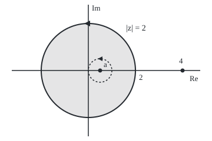

# Cauchy's integral formula: the values on a loop fix every value inside

[Syllabus](../../../SYLLABUS.md) → [Complex analysis](../README.md) → [Contour Integrals and Cauchy's Theorem](../README.md#s03) → Cauchy's integral formula

---

## General Overview

Picture a round pizza stone of radius 2, centred at 0 in the complex plane. Every point of the stone is a complex number, and the function e^z hands each point a value. Record the values only on the rim, where the distance from 0 is 2. Nothing inside is written down.

From the rim alone, the value at the centre comes back: 1, which is e^0. The value at the point 0.5 comes back too: 1.648721, which is e^0.5. Ask for a point off the stone, such as 4, and the same recipe returns 0. The recipe is one loop integral: a sum, taken all the way round the rim, of each rim value divided by the arrow from the chosen point to that rim point.

From here on the rim is called the loop, and the function must be holomorphic: it has a complex derivative at every point on and inside the loop. For such a function the inside has no freedom. The rim decides it.

**For a function with a complex derivative on and inside a loop, the value at any inside point equals one loop integral of the rim values, and on a circle round that point the value is the plain average of the rim.**

**What kind of fact this is:** a theorem, proved on this card in Why it works.

### The picture: the pizza stone's rim, one point inside, one outside

<p align="center"></p>

To scale: 40 units per 1, centre 0 at (150, 120), so the rim has radius 80, the point a = 0.5 sits at (170, 120) and the outside point 4 at (310, 120). The dashed circle, radius 0.5 round a, is the shrunk loop of Why it works. The triangles mark the anticlockwise direction.

---

## The formula

Notation first, in words. The loop integral sign $\oint_C$ means: walk once round the loop C, anticlockwise, adding up the function times each small step dz along the way ([Contour integrals](01-contour-integrals.md)).

$$f(a) = \frac{1}{2\pi i}\oint_C \frac{f(z)}{z-a}\,dz$$

**Read it aloud:** the value of f at the inside point a is one over two-pi-i times the loop integral of f of z over z minus a.

On a circle of radius r centred at a itself, write each rim point as $z = a + re^{i\theta}$, with θ the angle ([Euler's formula](../01-Complex%20Numbers%20and%20the%20Plane/04-eulers-formula.md)). The formula becomes:

$$f(a) = \frac{1}{2\pi}\int_0^{2\pi} f(a + re^{i\theta})\,d\theta$$

**Read it aloud:** the value at the centre is the average of the values round the rim.

| Symbol | Plain meaning | In our example | Push it up and the answer… |
| --- | --- | --- | --- |
| $f$ | the function, holomorphic on and inside the loop | e^z | — |
| $a$ | the inside point whose value is wanted | 0, then 0.5 | e^a grows; past 2 it leaves the loop and the integral drops to 0 |
| $z$ | a point walking round the loop | a point with \|z\| = 2 | — |
| $C$, $\oint_C$ | the loop, and the integral once round it anticlockwise | the rim \|z\| = 2 | a second lap doubles it |
| $i$, $\pi$ | the square root of −1; a half turn in radians | 2πi = one full turn's worth | — |
| $r$, $\theta$ | radius and angle of a circle round a | radii 1.5, 0.5 and 0.1 | no change: every radius gives 1.648721 |
| $n$ | points in the trapezoid sum (equal steps) round the loop | 64 | error falls fast: 6.7e-3 at 8, 3.6e-9 at 16 |
| $\bar z$ | z-bar, the conjugate: z reflected in the real axis | the function that breaks the formula | — |

### When it holds

- **f holomorphic on and inside the loop.** Drop it and the formula fails: z-bar has no complex derivative, and the loop returns 0 at the point 0.5, not 0.5.
- **a strictly inside.** Outside, the recipe returns 0: at 4 it gives 0, not e^4 = 54.598150. On the loop itself the integral does not exist, since z − a hits 0.
- **One anticlockwise lap.** Run clockwise and the sign flips, −1.648721. For a loop that winds round a several times, the answer is the winding number times f(a) ([Deforming a loop](04-deforming-contours-and-winding-numbers.md)).
- **The average form needs a circle centred at a.** On any other loop only the integral form holds.

---

## Why it works

### Step 0: only one point is bad

The integrand f(z)/(z − a) is holomorphic everywhere on and inside the loop except at z = a, where the denominator is 0. Cauchy's theorem ([Cauchy's theorem](03-cauchys-theorem.md)) gives 0 round any loop with no bad point on or inside it. So the whole integral is decided by what happens near a.

### Step 1: shrink the loop onto a small circle

A loop may be deformed without crossing a bad point, and the integral stays the same ([Deforming a loop](04-deforming-contours-and-winding-numbers.md)). So the rim |z| = 2 can be replaced by the dashed circle of radius r round a, for any r small enough to stay inside.

### Step 2: on that circle, the r cancels

On the small circle, $z = a + re^{i\theta}$. Then z − a is $re^{i\theta}$, and a small step is $dz = ire^{i\theta}\,d\theta$. Divide:

$$\frac{f(z)}{z-a}\,dz = \frac{f(a + re^{i\theta})}{re^{i\theta}}\; ire^{i\theta}\,d\theta = i\,f(a + re^{i\theta})\,d\theta$$

So the loop integral is i times the integral of f over the angle, from 0 to 2π. That is 2πi times the average of f on the small circle. Dividing by 2πi leaves the plain average.

### Step 3: every radius gives the same average, so it is f(a)

By Step 1, the loop integral does not depend on r. So the average of f on the circle of radius r round a is one fixed number for every small r. As r shrinks, every point of the circle closes in on a, and f, which has a derivative and so is continuous, closes in on f(a). A fixed number that closes in on f(a) is f(a). The code shows it: round 0.5, the averages at radii 1.5, 0.5 and 0.1 all print 1.648721.

<details>
<summary>Detailed proof: the average tends to f(a)</summary>

Let $M(r)$ be the largest value of $|f(a + re^{i\theta}) - f(a)|$ over the angle. Continuity of f at a means: for every tolerance ε > 0 there is a δ > 0 with $|f(z) - f(a)| < ε$ whenever $|z - a| < δ$. So $M(r) < ε$ once r < δ.

The average minus f(a) is $\frac{1}{2\pi}\int_0^{2\pi} \big(f(a + re^{i\theta}) - f(a)\big)\,d\theta$, whose size is at most $M(r)$. So the average is within ε of f(a) for every r < δ. But the average does not depend on r (Step 1). A number within every ε of f(a) equals f(a). Multiply back by 2πi:

$$\oint_C \frac{f(z)}{z-a}\,dz = 2\pi i\, f(a).$$

</details>

### Step 4: the circle round the centre reads the centre

For a = 0 the rim is already a circle centred at a. So e^0 = 1 is the average of e^z round the rim; 64 rim values average to 1.000000.

### Step 5: a point outside gives 0

Outside, the integrand has no bad point inside, and Cauchy's theorem gives 0.

### Step 6: any integral with one simple pole inside

A simple pole is a point where the integrand blows up like 1/(z − a). Any integrand of the form g(z)/(z − a), with g holomorphic inside and a inside, is Cauchy's formula read backwards:

$$\oint_C \frac{g(z)}{z-a}\,dz = 2\pi i\, g(a)$$

Take e^z/(z(z − 3)) round the rim. The point 3 lies outside, so write it as g(z)/(z − 0) with g(z) = e^z/(z − 3), holomorphic inside. The answer is 2πi × e^0/(0 − 3) = −2.094395i. The loop sum with 128 points prints the same.

A second road to the formula: the function (f(z) − f(a))/(z − a) is holomorphic inside except at a, where it stays bounded, close to f′(a). Its loop integral is still 0: shrink the loop round a, and a bounded integrand on an ever shorter circle gives an ever smaller integral. What is left is f(a) times the loop integral of 1/(z − a), which is 2πi. The shelf's house example is this with f = 1: 1/z round a course enclosing the origin gives 2πi.

---

## Worked numbers, by hand

| Step | Arithmetic | Value |
| --- | --- | --- |
| centre, road one | e^0 | 1.000000 |
| centre, road two | average of e^z at 64 rim points | 1.000000 |
| a = 0.5, road one | e^0.5 | 1.648721 |
| a = 0.5, road two | (1/2πi) × loop sum of e^z/(z − 0.5), 64 points | **1.648721** |
| shrunk loops round 0.5 | averages at radii 1.5, 0.5, 0.1 | 1.648721 each |
| one simple pole | 2πi × e^0/(0 − 3) | −2.094395i |
| outside, a = 4 | the integrand has no bad point inside | **0** |

Sixty-four readings on the rim fix the value at 0.5 to six decimals. Points nearer the rim need more readings.

### What breaks if you drop a piece

| Mistake | Comes out at | What went wrong |
| --- | --- | --- |
| a = 4, off the stone | 0, not e^4 = 54.598150 | No bad point inside: Cauchy's theorem gives 0 |
| z-bar in place of e^z, at a = 0.5 | 0, not 0.500000 | z-bar has no complex derivative |
| Loop run clockwise | −1.648721 | The lap counts −1, not +1 |
| Dividing by 2π, not 2πi | 1.648721i | Off by a quarter turn |

The z-bar row can be done by hand. On the rim, z-bar equals 4/z, since z times z-bar is |z| squared, 4. The integrand becomes 4/(z(z − 0.5)), which splits as 8/(z − 0.5) − 8/z. Each piece circles its pole once, giving 8 × 2πi each, and they cancel.

---

## Code, from first principles, and it actually runs

Both programs build e^z from the real exp, cos and sin. Road one is the closed form e^a. Road two is the loop integral as their own trapezoid sum: n equally spaced points round the circle, each value times its step. Plain averages on shrunk circles check Step 3.

### Python

```python
# Cauchy's integral formula -- the check behind the card.  Standard library
# only; complex numbers are Python's built-in type.  f(z) = e^z on the pizza
# stone's rim |z| = 2, run anticlockwise.  Road one: e^a from exp, cos, sin.
# Road two: the loop integral itself, a trapezoid sum round the circle.
import math

def f(z):                                  # e^z = e^x (cos y + i sin y)
    return math.exp(z.real) * complex(math.cos(z.imag), math.sin(z.imag))

def loop(g, c, r, n, turn=1):              # trapezoid sum of g(z) dz round |z - c| = r
    total = 0
    for k in range(n):
        w = complex(math.cos(2 * math.pi * k / n), turn * math.sin(2 * math.pi * k / n))
        total += g(c + r * w) * (turn * 1j * r * w) * (2 * math.pi / n)
    return total

def cif(g, a, n=64, turn=1, div=2j * math.pi):   # (1/2 pi i) x loop of g(z)/(z - a) on |z| = 2
    return loop(lambda z: g(z) / (z - a), 0, 2, n, turn) / div

def average(g, c, r, n=64):                # plain average of g at n points on |z - c| = r
    return sum(g(c + r * complex(math.cos(2 * math.pi * k / n), math.sin(2 * math.pi * k / n)))
               for k in range(n)) / n

def show(v):                               # a + bi, six decimals, rounding noise shown as 0
    re, im = (0.0 if abs(x) < 5e-7 else x for x in (v.real, v.imag))
    return f"{re:.6f} {'-' if im < 0 else '+'} {abs(im):.6f}i"

def sci(x):                                # 1.2e-5 style, the same in both languages
    e = math.floor(math.log10(x)); m = round(x / 10 ** e, 1)
    return f"{m / 10:.1f}e{e + 1}" if m >= 10 else f"{m:.1f}e{e}"

print("figure, 40 units per 1: centre (150, 120), rim radius 80, a = 0.5 at (170, 120), a = 4 at (310, 120), small loop radius 20")
for a in (0, 0.5):
    print(f"a = {a}: e^a = {math.exp(a):.6f}; loop sum, 64 points = {show(cif(f, a))}")
for n in (4, 8, 16):
    print(f"a = 0.5, {n} points: error {sci(abs(cif(f, 0.5, n) - math.exp(0.5)))}")
print(f"rim average round 0, radius 2 = {show(average(f, 0, 2))}")
for r in (1.5, 0.5, 0.1):
    print(f"average round 0.5, radius {r} = {show(average(f, 0.5, r))}")
pole = loop(lambda z: f(z) / (z * (z - 3)), 0, 2, 128)
print(f"loop of e^z / (z (z - 3)): by formula 2 pi i x e^0 / (0 - 3) = {show(2j * math.pi / -3)}; loop sum, 128 points = {show(pole)}")
print(f"mistake 1, a = 4 outside the rim: loop gives {show(cif(f, 4))}, not e^4 = {math.exp(4):.6f}")
zbar = cif(lambda z: z.conjugate(), 0.5)
print(f"mistake 2, z-bar in place of e^z at a = 0.5: loop gives {show(zbar)}, not 0.500000")
print(f"mistake 3, loop run clockwise: {show(cif(f, 0.5, turn=-1))}")
print(f"mistake 4, dividing by 2 pi instead of 2 pi i: {show(cif(f, 0.5, div=2 * math.pi))}")
assert abs(cif(f, 0.5) - math.exp(0.5)) < 1e-12 and abs(cif(f, 0) - 1) < 1e-12   # two roads meet
assert all(abs(average(f, 0.5, r) - math.exp(0.5)) < 1e-12 for r in (1.5, 0.5, 0.1))
assert abs(pole - 2j * math.pi / -3) < 1e-12                                       # one simple pole
assert abs(cif(f, 4)) < 1e-12 and abs(zbar) < 1e-12                               # outside, and no holomorphy
print("ALL CHECKS PASS")
```

**Ran 2026-09-28 on macOS, Python 3.14.6, standard library only. All checks passed. Output, pasted from the run:**

```
figure, 40 units per 1: centre (150, 120), rim radius 80, a = 0.5 at (170, 120), a = 4 at (310, 120), small loop radius 20
a = 0: e^a = 1.000000; loop sum, 64 points = 1.000000 + 0.000000i
a = 0.5: e^a = 1.648721; loop sum, 64 points = 1.648721 + 0.000000i
a = 0.5, 4 points: error 7.5e-1
a = 0.5, 8 points: error 6.7e-3
a = 0.5, 16 points: error 3.6e-9
rim average round 0, radius 2 = 1.000000 + 0.000000i
average round 0.5, radius 1.5 = 1.648721 + 0.000000i
average round 0.5, radius 0.5 = 1.648721 + 0.000000i
average round 0.5, radius 0.1 = 1.648721 + 0.000000i
loop of e^z / (z (z - 3)): by formula 2 pi i x e^0 / (0 - 3) = 0.000000 - 2.094395i; loop sum, 128 points = 0.000000 - 2.094395i
mistake 1, a = 4 outside the rim: loop gives 0.000000 + 0.000000i, not e^4 = 54.598150
mistake 2, z-bar in place of e^z at a = 0.5: loop gives 0.000000 + 0.000000i, not 0.500000
mistake 3, loop run clockwise: -1.648721 + 0.000000i
mistake 4, dividing by 2 pi instead of 2 pi i: 0.000000 + 1.648721i
ALL CHECKS PASS
```

### Rust

Same numbers, same labels, built with `rustc --edition 2021 -O`.

```rust
// Cauchy's integral formula -- the same check as the Python, in Rust.  No
// crates; a small (re, im) struct does the complex arithmetic.  f(z) = e^z on
// the pizza stone's rim |z| = 2, run anticlockwise.  Road one: e^a from exp,
// cos, sin.  Road two: the loop integral itself, a trapezoid sum round the circle.
use std::f64::consts::PI;
use std::ops::{Add, Div, Mul, Sub};

#[derive(Clone, Copy)]
struct C { re: f64, im: f64 }
fn c(re: f64, im: f64) -> C { C { re, im } }
impl Add for C { type Output = C; fn add(self, o: C) -> C { c(self.re + o.re, self.im + o.im) } }
impl Sub for C { type Output = C; fn sub(self, o: C) -> C { c(self.re - o.re, self.im - o.im) } }
impl Mul for C { type Output = C; fn mul(self, o: C) -> C { c(self.re * o.re - self.im * o.im, self.re * o.im + self.im * o.re) } }
impl Div for C { type Output = C; fn div(self, o: C) -> C {
    let d = o.re * o.re + o.im * o.im;
    c((self.re * o.re + self.im * o.im) / d, (self.im * o.re - self.re * o.im) / d) } }
fn abs(z: C) -> f64 { z.re.hypot(z.im) }

fn f(z: C) -> C { c(z.re.exp() * z.im.cos(), z.re.exp() * z.im.sin()) }   // e^z = e^x (cos y + i sin y)

fn lp(g: &dyn Fn(C) -> C, ctr: C, r: f64, n: usize, turn: f64) -> C {   // trapezoid sum of g(z) dz
    let mut total = c(0.0, 0.0);
    for k in 0..n {
        let t = 2.0 * PI * k as f64 / n as f64;
        let w = c(t.cos(), turn * t.sin());
        total = total + g(ctr + c(r, 0.0) * w) * (c(0.0, turn * r) * w) * c(2.0 * PI / n as f64, 0.0);
    }
    total
}

fn cif(g: &dyn Fn(C) -> C, a: f64, n: usize, turn: f64, div: C) -> C {  // (1/2 pi i) x loop of g/(z - a)
    lp(&|z: C| g(z) / (z - c(a, 0.0)), c(0.0, 0.0), 2.0, n, turn) / div
}

fn average(g: &dyn Fn(C) -> C, ctr: f64, r: f64, n: usize) -> C {     // plain average on |z - ctr| = r
    let mut s = c(0.0, 0.0);
    for k in 0..n { let t = 2.0 * PI * k as f64 / n as f64; s = s + g(c(ctr + r * t.cos(), r * t.sin())) }
    s / c(n as f64, 0.0)
}

fn show(v: C) -> String {                                               // a + bi, six decimals
    let (re, im) = (if v.re.abs() < 5e-7 { 0.0 } else { v.re }, if v.im.abs() < 5e-7 { 0.0 } else { v.im });
    format!("{:.6} {} {:.6}i", re, if im < 0.0 { "-" } else { "+" }, im.abs())
}

fn sci(x: f64) -> String {                                              // 1.2e-5 style
    let e = x.log10().floor() as i32;
    let m = (x / 10f64.powi(e) * 10.0).round() / 10.0;
    if m >= 10.0 { format!("{:.1}e{}", m / 10.0, e + 1) } else { format!("{:.1}e{}", m, e) }
}

fn main() {
    let (one, tpi) = (c(1.0, 0.0), c(0.0, 2.0 * PI));
    println!("figure, 40 units per 1: centre (150, 120), rim radius 80, a = 0.5 at (170, 120), a = 4 at (310, 120), small loop radius 20");
    for a in [0.0f64, 0.5] {
        println!("a = {}: e^a = {:.6}; loop sum, 64 points = {}", a, a.exp(), show(cif(&f, a, 64, 1.0, tpi)));
    }
    for n in [4, 8, 16] {
        println!("a = 0.5, {} points: error {}", n, sci(abs(cif(&f, 0.5, n, 1.0, tpi) - c(0.5f64.exp(), 0.0))));
    }
    println!("rim average round 0, radius 2 = {}", show(average(&f, 0.0, 2.0, 64)));
    for r in [1.5, 0.5, 0.1] { println!("average round 0.5, radius {} = {}", r, show(average(&f, 0.5, r, 64))) }
    let exact = tpi / c(-3.0, 0.0);
    let pole = lp(&|z: C| f(z) / (z * (z - c(3.0, 0.0))), c(0.0, 0.0), 2.0, 128, 1.0);
    println!("loop of e^z / (z (z - 3)): by formula 2 pi i x e^0 / (0 - 3) = {}; loop sum, 128 points = {}", show(exact), show(pole));
    let outside = cif(&f, 4.0, 64, 1.0, tpi);
    println!("mistake 1, a = 4 outside the rim: loop gives {}, not e^4 = {:.6}", show(outside), 4f64.exp());
    let zbar = cif(&|z: C| c(z.re, -z.im), 0.5, 64, 1.0, tpi);
    println!("mistake 2, z-bar in place of e^z at a = 0.5: loop gives {}, not 0.500000", show(zbar));
    println!("mistake 3, loop run clockwise: {}", show(cif(&f, 0.5, 64, -1.0, tpi)));
    println!("mistake 4, dividing by 2 pi instead of 2 pi i: {}", show(cif(&f, 0.5, 64, 1.0, c(2.0 * PI, 0.0))));
    assert!(abs(cif(&f, 0.5, 64, 1.0, tpi) - c(0.5f64.exp(), 0.0)) < 1e-12 && abs(cif(&f, 0.0, 64, 1.0, tpi) - one) < 1e-12);
    assert!([1.5, 0.5, 0.1].iter().all(|&r| abs(average(&f, 0.5, r, 64) - c(0.5f64.exp(), 0.0)) < 1e-12));
    assert!(abs(pole - exact) < 1e-12);                                  // one simple pole
    assert!(abs(outside) < 1e-12 && abs(zbar) < 1e-12);                  // outside, and no holomorphy
    println!("ALL CHECKS PASS");
}
```

**Ran 2026-09-28 on macOS, rustc 1.98.1, no crates. All checks passed. Output, pasted from the run:**

```
figure, 40 units per 1: centre (150, 120), rim radius 80, a = 0.5 at (170, 120), a = 4 at (310, 120), small loop radius 20
a = 0: e^a = 1.000000; loop sum, 64 points = 1.000000 + 0.000000i
a = 0.5: e^a = 1.648721; loop sum, 64 points = 1.648721 + 0.000000i
a = 0.5, 4 points: error 7.5e-1
a = 0.5, 8 points: error 6.7e-3
a = 0.5, 16 points: error 3.6e-9
rim average round 0, radius 2 = 1.000000 + 0.000000i
average round 0.5, radius 1.5 = 1.648721 + 0.000000i
average round 0.5, radius 0.5 = 1.648721 + 0.000000i
average round 0.5, radius 0.1 = 1.648721 + 0.000000i
loop of e^z / (z (z - 3)): by formula 2 pi i x e^0 / (0 - 3) = 0.000000 - 2.094395i; loop sum, 128 points = 0.000000 - 2.094395i
mistake 1, a = 4 outside the rim: loop gives 0.000000 + 0.000000i, not e^4 = 54.598150
mistake 2, z-bar in place of e^z at a = 0.5: loop gives 0.000000 + 0.000000i, not 0.500000
mistake 3, loop run clockwise: -1.648721 + 0.000000i
mistake 4, dividing by 2 pi instead of 2 pi i: 0.000000 + 1.648721i
ALL CHECKS PASS
```

The two outputs match line for line.

> [!TIP]
> **Try changing**
> Guess first, then run it.
> - **Walk the outside point in.** Change the `4` in mistake 1 and its assert to `1`: the point is now inside, the loop returns e^1 instead of 0, and the fourth assert stops it.
> - **Both poles inside.** In the pole line, change `(z - 3)` to `(z - 1)`: the loop now circles two bad points, the sum picks up a second term the single-pole formula misses, and the third assert stops it.
> - **Fewer points.** Change the default `n=64` to `n=8`: the error line predicts about 6.7e-3, and the first assert stops it.

---

## The usual mistake

> [!warning]
> **Treating the formula as a way to compute an integral of any function.** It recovers f(a) only when f has a complex derivative on and inside the loop. A smooth-looking function that fails that test, such as z-bar, gives 0 at the point 0.5 instead of 0.5. The formula is a fact about holomorphic functions, not about integrals in general.
>
> - **Forgetting where a sits.** At 4, outside, the loop gives 0, not 54.598150.
> - **Dropping the i.** Dividing by 2π returns 1.648721i, the right size turned a quarter.
> - **Counting a pole outside the loop.** In e^z/(z(z − 3)) only 0 is inside; the 3 contributes nothing.

---

## Where you meet it in real life

- **Numerical computing.** A function known to be holomorphic can be evaluated from samples on a circle. The trapezoid sum used here converges exponentially fast for such integrands, the reason 16 points already reach 3.6e-9 ([Derivatives from the boundary](06-derivatives-from-the-boundary.md) extends it to derivatives).
- **Steady heat and electrostatics.** The real part of a holomorphic function describes a steady temperature or a voltage with no sources inside. The centre's value is the rim's average ([Mean value and maximum principle](../07-Conformal%20Maps%20and%20Harmonic%20Functions/05-mean-value-and-maximum-principle-for-harmonic-functions.md)).
- **Evaluating real integrals.** Many integrals along the real line are turned into loop integrals with one pole inside, then read off in one line as in Step 6.

> **Say it back**
> Divide a holomorphic f by z − a and integrate round the loop. Shrunk onto a small circle round a, the integral is 2πi times the average of f there. That average cannot change as the circle shrinks, so it is f(a). A point outside gives 0; z-bar breaks it.

---

## What this builds on

- [Deforming a loop](04-deforming-contours-and-winding-numbers.md): shrinking the rim onto a small circle without changing the integral, and the winding number for loops that lap more than once.

## Where this goes next

- [Derivatives from the boundary](06-derivatives-from-the-boundary.md): differentiate under the integral and every derivative of f comes from the rim too.
- [The maximum modulus principle](../04-Taylor%20Series%2C%20Zeros%20and%20Rigidity/05-maximum-modulus-principle.md): the centre is an average, so it cannot be a strict peak of |f|.
- [Mean value and maximum principle](../07-Conformal%20Maps%20and%20Harmonic%20Functions/05-mean-value-and-maximum-principle-for-harmonic-functions.md): the rim average for steady temperatures and voltages.

The rim fixes f(a); whether it also fixes f′(a), f″(a) and every higher derivative, so that one complex derivative forces infinitely many, is the question [Derivatives from the boundary](06-derivatives-from-the-boundary.md) answers.

---

## Sources

Verified 28 Sep 2026: every link below opens a page naming the cited work.

- Stein, Elias M., and Rami Shakarchi. *Complex Analysis*. Princeton University Press, 2003. [Publisher page](https://press.princeton.edu/books/hardcover/9780691113852/complex-analysis). Chapter 2 proves the formula by shrinking a keyhole contour.
- Orloff, Jeremy. "Topic 4: Cauchy's integral formula." MIT OpenCourseWare 18.04, Spring 2018. [Course notes](https://ocw.mit.edu/courses/18-04-complex-variables-with-applications-spring-2018/resources/mit18_04s18_topic4/). Free notes with worked one-pole integrals.
- Trefethen, Lloyd N., and J. A. C. Weideman. "The exponentially convergent trapezoidal rule." *SIAM Review* 56(3), 2014. [DOI](https://doi.org/10.1137/130932132). Why the loop sum in the code converges so fast.
