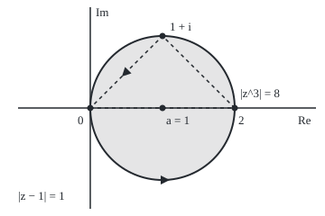
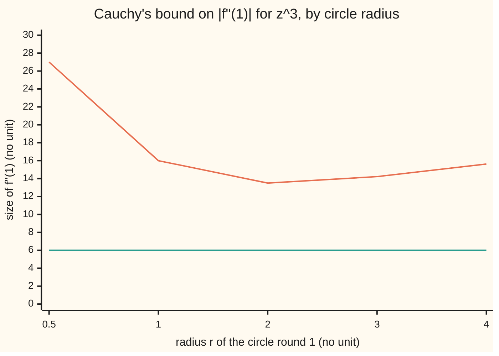

# Derivatives from the boundary: differentiate under the integral, so holomorphic once means holomorphic forever, with a size limit on every derivative

Complex analysis → Contour Integrals and Cauchy's Theorem → Every derivative from the rim → Derivatives from the boundary

---

## General Overview

A trampoline's sheet is fixed by its rim. Clamp the frame, and the height at the centre is decided, and so are the slope there and the way the slope bends.

Holomorphic functions (those with a complex derivative at every point of a region) behave alike. Take f(z) = z^3 and the circle of radius 1 round the point 1. The values of z^3 on that circle alone give the value at 1, which is 1, and the derivatives there: 3, 6, 6, then 0. Each is one loop integral of the rim values. From here on the rim is called the loop.

The same integrals give a ceiling. On this loop the size of z^3 never passes 8, reached at 2. That alone caps the second derivative at 1 at 2 × 8 = 16; the true 6 sits under it.

**The n-th derivative of a holomorphic f at a is n!/(2πi) times one loop integral of f divided by (z − a)^(n+1); so one complex derivative brings all the others, each capped by n! M / r^n on a circle of radius r where |f| stays below M.**

**What kind of fact this is:** a theorem, proved on this card in Why it works, with Cauchy's estimate as a corollary and Morera's theorem as its converse.

### The picture: the loop round 1, and the regatta triangle inside it

<p align="center"></p>

To scale: 80 units per 1, with 0 at (100, 120), so the loop round a = 1 has radius 80. The size of z^3 on it peaks at 2, where it is 8. The dashed triangle is the shelf's regatta course, used in Step 6. Filled triangles mark the direction of travel.

---

## The formula

Notation first, in words. $f^{(n)}$ means f differentiated n times: $f^{(0)}$ is f, $f^{(2)}$ is f″. The factorial n! is 1 × 2 × … × n, with 0! = 1. The loop integral sign $\oint_C$ means: walk once round the loop C anticlockwise, adding the function times each small step dz ([contour-integrals](01-contour-integrals.md)).

$$f^{(n)}(a) = \frac{n!}{2\pi i}\oint_C \frac{f(z)}{(z-a)^{n+1}}\,dz$$

**Read it aloud:** the n-th derivative of f at a is n factorial over two-pi-i, times the loop integral of f of z over z minus a to the power n plus one.

With n = 0 this is Cauchy's integral formula ([cauchys-integral-formula](05-cauchys-integral-formula.md)). Two consequences follow.

**Cauchy's estimate.** If C is the circle of radius r round a and $|f(z)| \le M$ on it, then

$$|f^{(n)}(a)| \le \frac{n!\,M}{r^n}$$

**Morera's theorem.** If f is continuous on a disc and its loop integral round every triangle inside the disc is 0, then f is holomorphic there: Cauchy's theorem run backwards.

| Symbol | Plain meaning | In our example | Push it up and the answer… |
| --- | --- | --- | --- |
| $f$ | the function, holomorphic on and inside the loop | z^3 | — |
| $a$ | the inside point where derivatives are wanted | 1 | f″(a) = 6a grows |
| $z$ | a point walking round the loop | a point with \|z − 1\| = 1 | — |
| $n$, $f^{(n)}$ | how many times f is differentiated; the result | n = 2, f″(1) = 6 | from n = 4 on, z^3 gives 0 |
| $n!$ | 1 × 2 × … × n | 2! = 2 | bounds 8, 8, 16, 48, 192 |
| $C$, $\oint_C$ | the loop, and the integral once round it anticlockwise | the circle \|z − 1\| = 1 | a second lap doubles it |
| $r$, $M$ | the circle's radius; the largest \|f\| on it | r = 1, M = 8 | 27 at r = 0.5, 13.5 at r = 2 |
| $i$, $\pi$ | the square root of −1; a half turn in radians | 2πi = one full turn's worth | — |

### When it holds

- **f holomorphic on and inside the loop.** For 1/z on the circle of radius 1.5 round 1, which circles 0 too, the loop gives 0, not f″(1) = 2.
- **a strictly inside, one anticlockwise lap.** Outside gives 0; clockwise flips the sign.
- **The estimate needs a circle centred at a, with M measured on it.** M taken at the centre, 1, gives a "bound" of 2, below the true 6.
- **Morera needs continuity and every triangle.** One nonzero triangle proves f is holomorphic on no disc containing it.

---

## Why it works

### Step 0: a appears only in the denominator

In Cauchy's integral formula, $f(a) = \frac{1}{2\pi i}\oint_C \frac{f(z)}{z-a}\,dz$, the rim values f(z) do not involve a. Moving a changes only the factor 1/(z − a), so differentiating f(a) means differentiating that factor inside the integral.

### Step 1: differentiate 1/(z − a) with respect to a

By the power rule, with z held fixed, 1/(z − a) becomes 1/(z − a)^2, then 2/(z − a)^3, then 6/(z − a)^4. Each step brings the power down as a factor and raises it by one, so after n steps the factors make n! and the result is n!/(z − a)^(n+1). Put inside the integral, this is the formula.

### Step 2: swapping derivative and integral is allowed

The loop stays a fixed distance from a, so 1/(z − a) and its derivatives in a stay bounded on it, and the integral's difference quotient tends to the integral of the derivative.

<details>
<summary>Detailed proof: the case n = 1</summary>

Let d > 0 be the distance from a to C, and |h| < d/2. By Cauchy's integral formula at a and a + h,

$$\frac{f(a+h) - f(a)}{h} = \frac{1}{2\pi i}\oint_C \frac{f(z)}{(z-a-h)(z-a)}\,dz,$$

since $\frac{1}{z-a-h} - \frac{1}{z-a} = \frac{h}{(z-a-h)(z-a)}$. Subtract the claimed limit $\frac{1}{2\pi i}\oint_C \frac{f(z)}{(z-a)^2}\,dz$: the integrands differ by $\frac{h\,f(z)}{(z-a-h)(z-a)^2}$. On C, $|z-a| \ge d$ and $|z-a-h| \ge d/2$. With M the largest |f| on C and L the loop's length, the difference is at most $\frac{L}{2\pi}\cdot\frac{2|h|M}{d^3}$ in size. For a tolerance ε > 0, any $|h| < \delta = \min(d/2,\ \pi\varepsilon d^3/(LM))$ keeps it below ε. So the difference quotient tends to the integral. One power higher each time gives every n.

</details>

### Step 3: holomorphic once means holomorphic forever

Step 2 writes f′ as a loop integral of the same shape, one power higher. That can be differentiated in a again, so f′ is holomorphic; so is f″, and on without end.

Real calculus has no such rule. On the real line, x|x| has slope 2|x|, which has no derivative at 0: its difference quotients there are 2 from the right and −2 from the left.

### Step 4: the second derivative of z^3 by hand

Put w = z − 1, so w runs once round 0 at radius 1. The integrand for n = 2 is

$$\frac{(1+w)^3}{w^3} = w^{-3} + 3w^{-2} + 3w^{-1} + 1.$$

Once round 0, every whole power of w integrates to 0 except $w^{-1}$, which gives 2πi ([contour-integrals](01-contour-integrals.md)). So the loop integral is 3 × 2πi, and f″(1) = (2!/2πi) × 3 × 2πi = 6. The power rule agrees: f″(z) = 6z.

### Step 5: Cauchy's estimate, from the size of an integral

A loop integral sums pieces, each a value times a step dz, so its size is at most the loop's length times the integrand's largest size. On the circle of radius r round a, the length is 2πr and $|f(z)/(z-a)^{n+1}| \le M/r^{n+1}$. So

$$|f^{(n)}(a)| \le \frac{n!}{2\pi}\cdot 2\pi r\cdot\frac{M}{r^{n+1}} = \frac{n!\,M}{r^n}.$$

For z^3 at 1 with r = 1, M = |2|^3 = 8, and the bound on |f″(1)| is 16. z^3 is holomorphic on the whole plane, so any radius is allowed. On the circle of radius r round 1 the largest |z^3| is (1 + r)^3, so the bound is 2(1 + r)^3/r^2; its derivative in r vanishes at r = 2, giving 13.5. None reaches 6: the estimate covers every function of that size on that circle.



Upper line: the bound 2(1 + r)^3/r^2, lowest at r = 2. Flat lower line: the true |f″(1)| = 6.

### Step 6: Morera's theorem, the converse

Suppose f is continuous on a disc and its integral round every triangle there is 0. Fix the disc's centre c and let F(z) be the integral of f along the straight segment from c to z. The triangle condition and the continuity of f make F's difference quotients tend to f, so F′ = f and F is holomorphic ([antiderivatives-and-path-independence](02-antiderivatives-and-path-independence.md)). By Step 3, F′ is holomorphic too. That is f.

Round the regatta triangle 0 → 2 → 1 + i, z^3 gives 0 ([cauchys-theorem](03-cauchys-theorem.md)). The conjugate z-bar (z reflected in the real axis) gives 2i: twice the triangle's area, 1, times i. A holomorphic function gives 0 round every triangle, so z-bar is holomorphic on no disc containing the course.

A second road to all the derivatives at once: expand 1/(z − a) as a geometric series inside the integral, and the Taylor coefficients come out as $f^{(n)}(a)/n!$ ([taylor-series-in-the-plane](../04-Taylor%20Series%2C%20Zeros%20and%20Rigidity/01-taylor-series-in-the-plane.md)).

---

## Worked numbers, by hand

| Step | Arithmetic | Value |
| --- | --- | --- |
| road one, power rule | z^3, 3z^2, 6z, 6, 0 at z = 1 | 1, 3, 6, 6, 0 |
| road two, the loop | (2!/2πi) × 3 × 2πi, from the w^(−1) term | **6** |
| largest size on the loop | \|2\|^3 at the point 2 | 8 |
| Cauchy's bound, r = 1 | 2! × 8 / 1^2 | **16** |
| best radius | minimise 2(1 + r)^3/r^2: r = 2 | 13.5 |
| regatta triangle, z^3 | Cauchy's theorem | 0 |
| regatta triangle, z-bar | 2i × area 1 | **2i** |

### What breaks if you drop a piece

| Mistake | Comes out at | What went wrong |
| --- | --- | --- |
| f = 1/z on \|z − 1\| = 1.5, which circles 0 | 0, not f″(1) = 2 | f is not holomorphic inside: the point 0 adds −2 |
| n! left off | 3, not 6 | Only 1/(2πi) remains of n!/(2πi) |
| M read at the centre, \|f(1)\| = 1 | bound 2, below the true 6 | M must be the largest size on the circle |
| z-bar round the regatta triangle | 2i, not 0 | z-bar has no complex derivative; Morera's test fails |

By hand: the loop splits into loops round 1 and round 0 ([deforming-contours-and-winding-numbers](04-deforming-contours-and-winding-numbers.md)); the one round 0 gives 2! × 1/(0 − 1)^3 = −2.

---

## Code, from first principles, and it actually runs

Road one is the power rule on the coefficients of z^3. Road two is n!/(2πi) times the programs' own trapezoid sum round the circle. Triangle integrals use Simpson's rule per edge; the area comes from the shoelace formula. M is the largest |z^3| over 360 rim points, measured again for each radius. With 2 points the loop sum for f″(1) is 8: at the two sample points ±1, $w^{-3}$ equals $w^{-1}$, so it is counted as one more $w^{-1}$. From 3 points on it is exact. A second case, e^z at 0, shows the error shrinking.

### Python

```python
# Derivatives from the boundary.  Standard library; built-in complex.  f(z) = z^3,
# a = 1, rim |z - 1| = 1 anticlockwise.  Road one: the power rule on coefficients.
# Road two: n!/(2 pi i) times the loop integral, a trapezoid sum round the rim.
import math

def loop(g, c, r, n=64):                  # trapezoid sum of g(z) dz round |z - c| = r
    total = 0
    for k in range(n):
        w = complex(math.cos(2 * math.pi * k / n), math.sin(2 * math.pi * k / n))
        total += g(c + r * w) * (1j * r * w) * (2 * math.pi / n)
    return total

fact = lambda n: 1 if n == 0 else n * fact(n - 1)   # n! = 1 x 2 x ... x n

def rim(g, a, n, r=1.0, pts=64):          # n!/(2 pi i) x loop of g(z)/(z - a)^(n+1)
    return fact(n) / (2j * math.pi) * loop(lambda z: g(z) / (z - a) ** (n + 1), a, r, pts)

def power_rule(coeffs, n, a):             # differentiate c0 + c1 z + ... n times, then evaluate
    for _ in range(n):
        coeffs = [k * coeffs[k] for k in range(1, len(coeffs))]
    return sum(c * a ** k for k, c in enumerate(coeffs))

def edge_sum(g, p, q, m=10):              # Simpson's rule for g(z) dz along the segment p -> q
    h = (q - p) / m
    return sum((1 if j in (0, m) else 4 if j % 2 else 2) * g(p + j * h) for j in range(m + 1)) * h / 3

def show(v):                              # a + bi, six decimals, rounding noise shown as 0
    re, im = (0.0 if abs(x) < 5e-7 else x for x in (v.real, v.imag))
    return f"{re:.6f} {'-' if im < 0 else '+'} {abs(im):.6f}i"

def sci(x):                               # 1.2e-5 style, the same in both languages
    e = math.floor(math.log10(x)); m = round(x / 10 ** e, 1)
    return f"{m / 10:.1f}e{e + 1}" if m >= 10 else f"{m:.1f}e{e}"

f, cube = (lambda z: z ** 3), [0, 0, 0, 1]
peak = lambda r: max(abs(f(1 + r * complex(math.cos(k * math.pi / 180), math.sin(k * math.pi / 180)))) for k in range(360))
M = peak(1)                               # largest |z^3| over 360 rim points: 8, at z = 2
print("figure, 80 units per 1: 0 at (100, 120), a = 1 at (180, 120), rim radius 80, 2 at (260, 120), 1 + i at (180, 40)")
for n in range(5):
    print(f"n = {n}: power rule {power_rule(cube, n, 1)}; rim, 64 points = {show(rim(f, 1, n))}; bound {n}! x 8 / 1^{n} = {fact(n) * M:g}")
print("f''(1) from the rim with 2, 3, 4 points: " + ", ".join(show(rim(f, 1, 2, pts=p)) for p in (2, 3, 4)))
exp = lambda z: math.exp(z.real) * complex(math.cos(z.imag), math.sin(z.imag))   # e^z from exp, cos, sin
print("second case, e^z at 0, f''(0) = 1, error with 4, 8, 12 points: " + ", ".join(sci(abs(rim(exp, 0, 2, pts=p) - 1)) for p in (4, 8, 12)))
print("bound on |f''(1)| from radius r, 2 (1 + r)^3 / r^2: " + ", ".join(f"r = {r:g}: {2 * peak(r) / r ** 2:.6f}" for r in (0.5, 1, 2, 3, 4)))
grid = min((2 * peak(r / 100) / (r / 100) ** 2, r / 100) for r in range(10, 501))     # M measured per radius
tri = (0, 2, 1 + 1j)
around = lambda g: sum(edge_sum(g, tri[k], tri[(k + 1) % 3]) for k in range(3))
area = 0.5 * sum(tri[k].real * tri[(k + 1) % 3].imag - tri[(k + 1) % 3].real * tri[k].imag for k in range(3))
print(f"regatta triangle 0 -> 2 -> 1 + i: loop of z^3 = {show(around(f))}; loop of z-bar = {show(around(lambda z: z.conjugate()))}; shoelace area {area:g}")
bad = rim(lambda z: 1 / z, 1, 2, r=1.5, pts=128)
print(f"mistake 1, f = 1/z on |z - 1| = 1.5, which circles 0: rim gives {show(bad)}, not f''(1) = 2 / 1^3 = {2 / 1 ** 3:g}")
print(f"mistake 2, n! left off: rim gives {show(rim(f, 1, 2) / 2)}, not 6")
print(f"mistake 3, M read at the centre, |f(1)| = 1: bound 2! x 1 / 1^2 = {fact(2) * abs(f(1)):g}, below the true 6")
print(f"real contrast, x|x| has slope 2|x|; its difference quotients at 0, right and left: "
      f"{(2 * abs(1e-3) - 0) / 1e-3:.6f} and {(2 * abs(-1e-3) - 0) / -1e-3:.6f}")
assert all(abs(rim(f, 1, n, r) - power_rule(cube, n, 1)) < 1e-12 for n in range(5) for r in (0.5, 1))  # two roads
assert M == 8 and all(abs(power_rule(cube, n, 1)) <= fact(n) * M for n in range(5)) and abs(grid[0] - 13.5) < 1e-12 and grid[1] == 2
assert abs(around(f)) < 1e-12 and abs(around(lambda z: z.conjugate()) - 2j * area) < 1e-12   # Morera's test, and z-bar
assert abs(bad - (2 / 1 ** 3 + fact(2) / (0 - 1) ** 3)) < 1e-12                        # the pole at 0 adds 2! x 1/(0 - 1)^3
print("ALL CHECKS PASS")
```

**Ran 2026-09-28 on macOS, Python 3.14.6, standard library only. All checks passed. Output, pasted from the run:**

```
figure, 80 units per 1: 0 at (100, 120), a = 1 at (180, 120), rim radius 80, 2 at (260, 120), 1 + i at (180, 40)
n = 0: power rule 1; rim, 64 points = 1.000000 + 0.000000i; bound 0! x 8 / 1^0 = 8
n = 1: power rule 3; rim, 64 points = 3.000000 + 0.000000i; bound 1! x 8 / 1^1 = 8
n = 2: power rule 6; rim, 64 points = 6.000000 + 0.000000i; bound 2! x 8 / 1^2 = 16
n = 3: power rule 6; rim, 64 points = 6.000000 + 0.000000i; bound 3! x 8 / 1^3 = 48
n = 4: power rule 0; rim, 64 points = 0.000000 + 0.000000i; bound 4! x 8 / 1^4 = 192
f''(1) from the rim with 2, 3, 4 points: 8.000000 + 0.000000i, 6.000000 + 0.000000i, 6.000000 + 0.000000i
second case, e^z at 0, f''(0) = 1, error with 4, 8, 12 points: 2.8e-3, 5.5e-7, 2.3e-11
bound on |f''(1)| from radius r, 2 (1 + r)^3 / r^2: r = 0.5: 27.000000, r = 1: 16.000000, r = 2: 13.500000, r = 3: 14.222222, r = 4: 15.625000
regatta triangle 0 -> 2 -> 1 + i: loop of z^3 = 0.000000 + 0.000000i; loop of z-bar = 0.000000 + 2.000000i; shoelace area 1
mistake 1, f = 1/z on |z - 1| = 1.5, which circles 0: rim gives 0.000000 + 0.000000i, not f''(1) = 2 / 1^3 = 2
mistake 2, n! left off: rim gives 3.000000 + 0.000000i, not 6
mistake 3, M read at the centre, |f(1)| = 1: bound 2! x 1 / 1^2 = 2, below the true 6
real contrast, x|x| has slope 2|x|; its difference quotients at 0, right and left: 2.000000 and -2.000000
ALL CHECKS PASS
```

### Rust

Same numbers, same labels, built with `rustc --edition 2021 -O`.

```rust
// Derivatives from the boundary -- the same check as the Python, in Rust.  No
// crates; a small (re, im) struct does the complex arithmetic.  f(z) = z^3,
// a = 1, the rim |z - 1| = 1 run anticlockwise.  Road one: the power rule on the
// coefficients.  Road two: n!/(2 pi i) times the loop integral, a trapezoid sum.
use std::f64::consts::PI;
use std::ops::{Add, Div, Mul, Sub};
#[derive(Clone, Copy)] struct C { re: f64, im: f64 }
fn c(re: f64, im: f64) -> C { C { re, im } }
impl Add for C { type Output = C; fn add(self, o: C) -> C { c(self.re + o.re, self.im + o.im) } }
impl Sub for C { type Output = C; fn sub(self, o: C) -> C { c(self.re - o.re, self.im - o.im) } }
impl Mul for C { type Output = C; fn mul(self, o: C) -> C { c(self.re * o.re - self.im * o.im, self.re * o.im + self.im * o.re) } }
impl Div for C { type Output = C; fn div(self, o: C) -> C {
    let d = o.re * o.re + o.im * o.im;
    c((self.re * o.re + self.im * o.im) / d, (self.im * o.re - self.re * o.im) / d) } }
fn abs(z: C) -> f64 { z.re.hypot(z.im) }
fn r(x: f64) -> C { c(x, 0.0) }
fn pw(z: C, k: usize) -> C { (0..k).fold(r(1.0), |p, _| p * z) }
fn fact(n: usize) -> f64 { (1..=n).fold(1.0, |p, k| p * k as f64) }     // n! = 1 x 2 x ... x n

fn lp(g: &dyn Fn(C) -> C, ctr: C, rad: f64, n: usize) -> C {           // trapezoid sum of g(z) dz
    let mut total = r(0.0);
    for k in 0..n {
        let t = 2.0 * PI * k as f64 / n as f64;
        let w = c(t.cos(), t.sin());
        total = total + g(ctr + r(rad) * w) * (c(0.0, rad) * w) * r(2.0 * PI / n as f64);
    } total }
fn rim(g: &dyn Fn(C) -> C, a: f64, n: usize, rad: f64, pts: usize) -> C {  // n!/(2 pi i) x loop of g/(z - a)^(n+1)
    r(fact(n)) / c(0.0, 2.0 * PI) * lp(&|z: C| g(z) / pw(z - r(a), n + 1), r(a), rad, pts) }
fn power_rule(coeffs: &[f64], n: usize, a: f64) -> f64 {               // differentiate n times, then evaluate
    let mut cs = coeffs.to_vec();
    for _ in 0..n { cs = (1..cs.len()).map(|k| k as f64 * cs[k]).collect() }
    cs.iter().enumerate().fold(0.0, |s, (k, x)| s + x * a.powi(k as i32))
}
fn edge_sum(g: &dyn Fn(C) -> C, p: C, q: C, m: usize) -> C {           // Simpson's rule along p -> q
    let h = (q - p) / r(m as f64);
    let s = (0..=m).fold(r(0.0), |s, j| s + r(if j == 0 || j == m { 1.0 } else if j % 2 == 1 { 4.0 } else { 2.0 }) * g(p + r(j as f64) * h));
    s * h / r(3.0)
}
fn show(v: C) -> String {                                              // a + bi, six decimals
    let (re, im) = (if v.re.abs() < 5e-7 { 0.0 } else { v.re }, if v.im.abs() < 5e-7 { 0.0 } else { v.im });
    format!("{:.6} {} {:.6}i", re, if im < 0.0 { "-" } else { "+" }, im.abs())
}
fn sci(x: f64) -> String {                                             // 1.2e-5 style
    let e = x.log10().floor() as i32;
    let m = (x / 10f64.powi(e) * 10.0).round() / 10.0;
    if m >= 10.0 { format!("{:.1}e{}", m / 10.0, e + 1) } else { format!("{:.1}e{}", m, e) }
}
fn main() {
    let (f, cube) = (|z: C| z * z * z, [0.0, 0.0, 0.0, 1.0]);
    let peak = |rad: f64| (0..360).map(|k| { let t = k as f64 * PI / 180.0; abs(f(c(1.0 + rad * t.cos(), rad * t.sin()))) }).fold(0.0, f64::max);
    let big_m = peak(1.0);  // largest |z^3| over 360 rim points: 8, at z = 2
    println!("figure, 80 units per 1: 0 at (100, 120), a = 1 at (180, 120), rim radius 80, 2 at (260, 120), 1 + i at (180, 40)");
    for n in 0..5 {
        println!("n = {}: power rule {}; rim, 64 points = {}; bound {}! x 8 / 1^{} = {}", n, power_rule(&cube, n, 1.0), show(rim(&f, 1.0, n, 1.0, 64)), n, n, fact(n) * big_m);
    }
    let few: Vec<String> = [2, 3, 4].iter().map(|&p| show(rim(&f, 1.0, 2, 1.0, p))).collect();
    println!("f''(1) from the rim with 2, 3, 4 points: {}", few.join(", "));
    let exp = |z: C| c(z.re.exp() * z.im.cos(), z.re.exp() * z.im.sin());   // e^z from exp, cos, sin
    let errs: Vec<String> = [4, 8, 12].iter().map(|&p| sci(abs(rim(&exp, 0.0, 2, 1.0, p) - r(1.0)))).collect();
    println!("second case, e^z at 0, f''(0) = 1, error with 4, 8, 12 points: {}", errs.join(", "));
    let bnd: Vec<String> = [0.5f64, 1.0, 2.0, 3.0, 4.0].iter().map(|&x| format!("r = {}: {:.6}", x, 2.0 * peak(x) / (x * x))).collect();
    println!("bound on |f''(1)| from radius r, 2 (1 + r)^3 / r^2: {}", bnd.join(", "));
    let grid = (10..=500).map(|k| { let x = k as f64 / 100.0; (2.0 * peak(x) / (x * x), x) }).fold((f64::MAX, 0.0), |b, t| if t.0 < b.0 { t } else { b });
    let tri = [r(0.0), r(2.0), c(1.0, 1.0)];
    let around = |g: &dyn Fn(C) -> C| (0..3).fold(r(0.0), |s, k| s + edge_sum(g, tri[k], tri[(k + 1) % 3], 10));
    let area = 0.5 * (0..3).map(|k| tri[k].re * tri[(k + 1) % 3].im - tri[(k + 1) % 3].re * tri[k].im).sum::<f64>();
    let (lz3, lbar) = (around(&f), around(&|z: C| c(z.re, -z.im)));
    println!("regatta triangle 0 -> 2 -> 1 + i: loop of z^3 = {}; loop of z-bar = {}; shoelace area {}", show(lz3), show(lbar), area);
    let bad = rim(&|z: C| r(1.0) / z, 1.0, 2, 1.5, 128);
    println!("mistake 1, f = 1/z on |z - 1| = 1.5, which circles 0: rim gives {}, not f''(1) = 2 / 1^3 = {}", show(bad), 2.0 / 1f64.powi(3));
    println!("mistake 2, n! left off: rim gives {}, not 6", show(rim(&f, 1.0, 2, 1.0, 64) / r(2.0)));
    println!("mistake 3, M read at the centre, |f(1)| = 1: bound 2! x 1 / 1^2 = {}, below the true 6", fact(2) * abs(f(r(1.0))));
    println!("real contrast, x|x| has slope 2|x|; its difference quotients at 0, right and left: {:.6} and {:.6}",
             (2.0 * 1e-3f64.abs() - 0.0) / 1e-3, (2.0 * (-1e-3f64).abs() - 0.0) / -1e-3);
    assert!((0..5).all(|n| [0.5, 1.0].iter().all(|&rd| abs(rim(&f, 1.0, n, rd, 64) - r(power_rule(&cube, n, 1.0))) < 1e-12)));  // two roads
    assert!(big_m == 8.0 && (0..5).all(|n| power_rule(&cube, n, 1.0).abs() <= fact(n) * big_m) && (grid.0 - 13.5).abs() < 1e-12 && grid.1 == 2.0);
    assert!(abs(lz3) < 1e-12 && abs(lbar - c(0.0, 2.0 * area)) < 1e-12);  // Morera's test, and z-bar
    assert!(abs(bad - r(2.0 / 1f64.powi(3) + fact(2) / (-1f64).powi(3))) < 1e-12);  // the pole at 0 adds 2! x 1/(0 - 1)^3
    println!("ALL CHECKS PASS");
}
```

**Ran 2026-09-28 on macOS, rustc 1.98.1, no crates. All checks passed. Output, pasted from the run:**

```
figure, 80 units per 1: 0 at (100, 120), a = 1 at (180, 120), rim radius 80, 2 at (260, 120), 1 + i at (180, 40)
n = 0: power rule 1; rim, 64 points = 1.000000 + 0.000000i; bound 0! x 8 / 1^0 = 8
n = 1: power rule 3; rim, 64 points = 3.000000 + 0.000000i; bound 1! x 8 / 1^1 = 8
n = 2: power rule 6; rim, 64 points = 6.000000 + 0.000000i; bound 2! x 8 / 1^2 = 16
n = 3: power rule 6; rim, 64 points = 6.000000 + 0.000000i; bound 3! x 8 / 1^3 = 48
n = 4: power rule 0; rim, 64 points = 0.000000 + 0.000000i; bound 4! x 8 / 1^4 = 192
f''(1) from the rim with 2, 3, 4 points: 8.000000 + 0.000000i, 6.000000 + 0.000000i, 6.000000 + 0.000000i
second case, e^z at 0, f''(0) = 1, error with 4, 8, 12 points: 2.8e-3, 5.5e-7, 2.3e-11
bound on |f''(1)| from radius r, 2 (1 + r)^3 / r^2: r = 0.5: 27.000000, r = 1: 16.000000, r = 2: 13.500000, r = 3: 14.222222, r = 4: 15.625000
regatta triangle 0 -> 2 -> 1 + i: loop of z^3 = 0.000000 + 0.000000i; loop of z-bar = 0.000000 + 2.000000i; shoelace area 1
mistake 1, f = 1/z on |z - 1| = 1.5, which circles 0: rim gives 0.000000 + 0.000000i, not f''(1) = 2 / 1^3 = 2
mistake 2, n! left off: rim gives 3.000000 + 0.000000i, not 6
mistake 3, M read at the centre, |f(1)| = 1: bound 2! x 1 / 1^2 = 2, below the true 6
real contrast, x|x| has slope 2|x|; its difference quotients at 0, right and left: 2.000000 and -2.000000
ALL CHECKS PASS
```

The two outputs match line for line.

> [!TIP]
> **Try changing**
> Guess first, then run it.
> - **Shrink the ceiling.** Replace `M = peak(1)` with `M = 2.9`. Which derivative breaks the bound first? f′(1) = 3, and the second assert stops it.
> - **Pull the bad loop in.** Change `r=1.5` in mistake 1 to `r=0.9`: 0 is no longer circled, the loop prints about 2, and the fourth assert stops it.
> - **Too few points.** Change the default `pts=64` in `rim` to `pts=2`: f″(1) comes out 8 and the first assert stops it.

---

## The usual mistake

> [!warning]
> **Reading the bound as the value.** Cauchy's estimate caps |f″(1)| at 16 on the circle of radius 1, and at 13.5 on the best circle. The true value is 6. The bound serves every function of size at most M on the circle, so one function rarely reaches it. A second slip is the power: the n-th derivative needs (z − a)^(n+1), one more than n.

---

## Where you meet it in real life

- **Numerical derivatives.** Summing samples on a circle gives derivatives without subtracting nearly equal numbers, the step that ruins ordinary difference quotients. For e^z at 0, 12 points give f″(0) to within 2.3e-11.
- **Proving limits holomorphic.** Triangle integrals pass to a uniform limit, so by Morera the limit of holomorphic functions is holomorphic ([uniform-limits-of-holomorphic-functions](../04-Taylor%20Series%2C%20Zeros%20and%20Rigidity/02-uniform-limits-of-holomorphic-functions.md)).

> **Say it back**
> In Cauchy's integral formula a sits only in 1/(z − a). Differentiating that n times gives n!/(z − a)^(n+1), so every derivative is a loop integral, and each is again holomorphic. The integral's size gives the cap n! M / r^n. Morera: zero round every triangle means holomorphic.

---

## What this builds on

- [cauchys-integral-formula](05-cauchys-integral-formula.md): f(a) as a loop integral, the case n = 0 that this card differentiates.

## Where this goes next

- [liouville-and-the-fundamental-theorem-of-algebra](07-liouville-and-the-fundamental-theorem-of-algebra.md): the estimate |f′(a)| ≤ M/r on ever larger circles forces a bounded function holomorphic on the whole plane to be constant.
- [taylor-series-in-the-plane](../04-Taylor%20Series%2C%20Zeros%20and%20Rigidity/01-taylor-series-in-the-plane.md): all the derivatives assembled into a power series that equals f.
- [harmonic-functions-and-conjugates](../07-Conformal%20Maps%20and%20Harmonic%20Functions/04-harmonic-functions-and-conjugates.md): the real part of f has second derivatives because f″ exists, which is what lets it be harmonic.

---

## Sources

Verified 28 Sep 2026: every link below opens a page naming the cited work.

- Stein, Elias M., and Rami Shakarchi. *Complex Analysis*. Princeton University Press, 2003. [Publisher page](https://press.princeton.edu/books/hardcover/9780691113852/complex-analysis). Chapter 2: the derivative formula, Cauchy's inequalities, Morera.
- Orloff, Jeremy. "Topic 4: Cauchy's integral formula." MIT OpenCourseWare 18.04, Spring 2018. [Course notes](https://ocw.mit.edu/courses/18-04-complex-variables-with-applications-spring-2018/resources/mit18_04s18_topic4/). Free notes: the derivative formula, its proof, Cauchy's inequality.
- Trefethen, Lloyd N., and J. A. C. Weideman. "The exponentially convergent trapezoidal rule." *SIAM Review* 56(3), 2014. [DOI](https://doi.org/10.1137/130932132). Why the code's loop sums converge so fast.
