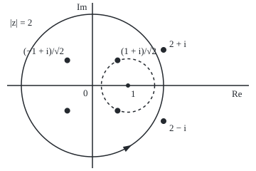
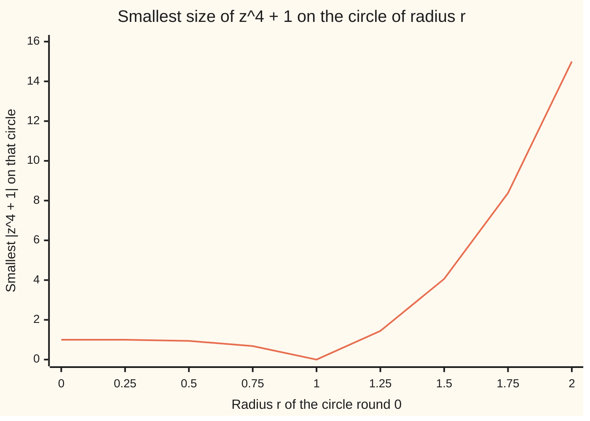

# Liouville's theorem: a bounded function holomorphic everywhere is constant, and so every polynomial has a root

[Syllabus](../../../SYLLABUS.md) → [Complex analysis](../../../SYLLABUS.md#w07) → [Contour Integrals and Cauchy's Theorem](../../../SYLLABUS.md#w07-s03) → Liouville's theorem

---

## General Overview

A football kicked straight up at 20 metres a second never reaches 25 metres. Asking when it does gives 5t^2 - 20t + 25 = 0, with roots 2 + i and 2 - i ([The fundamental theorem of algebra](../../03-Algebra/10-For%20the%20Curious/01-fundamental-theorem-of-algebra.md)). That card stated that every polynomial of degree 1 or more has a complex root, and left the proof for here.

A sharper case: on the real line z^4 + 1 never drops below 1, so it has no real root. In the plane it has four, at (±1 ± i)/√2: the points at distance 1 from 0, half-way between the axes.

The proof goes through a fact about functions. Call a function **entire** when it is holomorphic (has a complex derivative) at every point of the plane. If an entire function's size never passes a fixed ceiling, it cannot change at all. Were a polynomial rootless, 1 divided by it would be entire and, being tiny far out, bounded. So it would be constant. It is not.

**A bounded entire function is constant (Liouville's theorem); applied to 1 divided by a polynomial, it forces a root, and peeling roots one at a time splits degree n into n brackets.**

**What kind of fact this is:** a theorem, proved on this card in Why it works, with the fundamental theorem of algebra as its corollary.

### The picture: where the roots sit

<p align="center"></p>

To scale, 50 units per 1. Four dots at distance 1 are the roots of z^4 + 1; two at right, the football's. On and outside the solid circle, radius 2, |z^4 + 1| is at least 15. The dashed circle, radius 0.75 round 1, nearly touches the root 0.765367 away.

---

## The formula

$f'(a)$ is the complex derivative of $f$ at the point $a$; the loop sign ∮ is the contour integral once round a circle, anticlockwise ([Contour integrals](01-contour-integrals.md)); $M(r)$ is the largest $|f(z)|$ on the circle of radius $r$ round $a$. Cauchy's estimate, from [Derivatives from the boundary](06-derivatives-from-the-boundary.md):

$$|f'(a)| \le \frac{M(r)}{r}$$

**Read it aloud:** the slope at the centre is at most the largest size on the circle over the radius.

Liouville's theorem: if $f$ is entire and $|f(z)| \le M$ for every $z$, then

$$f'(a) = 0 \text{ for every } a, \quad \text{so } f \text{ is constant.}$$

**Read it aloud:** entire and never above one fixed size means no slope anywhere, so no change.

The fundamental theorem of algebra: a polynomial $p$ of degree $n \ge 1$, leading coefficient $a_n$, has roots $z_1$ to $z_n$, repeats allowed, with

$$p(z) = a_n (z - z_1)(z - z_2)\cdots(z - z_n)$$

**Read it aloud:** leading coefficient times one bracket per root.

| Symbol | Plain meaning | In our example | Push it up and the answer… |
| --- | --- | --- | --- |
| $f$ | the function, holomorphic inside the circle | 1/(z^4 + 1) | — |
| $a$ | the centre, where the slope is taken | 1 | — |
| $f'(a)$ | the complex derivative at $a$ | -1, by two roads | — |
| $r$ | the circle's radius | 0.25, 0.5, 0.75 | bound shrinks if $M(r)$ holds still |
| $M(r)$, $M$ | largest size on the circle; a ceiling for the plane | M(r)/r = 3.038576 at r = 0.25 | bound loosens |
| $p$ | a polynomial | z^4 + 1; 5z^2 - 20z + 25 | — |
| $n$, $a_n$ | degree and leading coefficient | 4 and 1; 2 and 5 | one more root; roots stay only if all of $p$ scales |
| $z_1$ to $z_n$ | the roots, repeats counted | (±1 ± i)/√2; 2 ± i | — |

### When it holds

- **Holomorphic everywhere, not just on a disc.** 1/(z^4 + 1) is holomorphic and bounded on the disc of radius 0.75 round 1, and not constant.
- **Bounded.** f(z) = z is entire, but its M(r)/r stays 1.000000 on every circle, so its slope stays 1.
- **Complex inputs.** 1/(x^4 + 1) is smooth, at most 1.000000 on the real line, and not constant: no real-line Liouville.
- **Degree at least 1.** A nonzero constant has no root, and 1 over it is bounded, entire and constant: no contradiction.

---

## Why it works

### Step 0: a big field with a low fence leaves no room to climb

Picture a path that must stay under a fence of fixed height. The wider the field, the gentler the path must be at its centre. Cauchy's estimate makes this exact: the fence is $M(r)$, the width $r$, the steepness $|f'(a)|$. An entire function gets fields of every width; a bounded one never gets a taller fence. Its slope is squeezed to 0.

### Step 1: the slope at a point is controlled by a circle round it

From [Derivatives from the boundary](06-derivatives-from-the-boundary.md), the slope is a loop integral:

$$f'(a) = \frac{1}{2\pi i}\oint \frac{f(z)}{(z - a)^2}\,dz$$

The circle has length 2πr. On it, |z - a| is r, so the integrand's size is at most M(r)/r^2. Length times largest size, divided by the 2π in front, gives M(r)/r.

Take p(z) = z^4 + 1, f = 1/p, a = 1. Here p(1) = 2 and p'(1) = 4, and the reciprocal rule (1/p)' = -p'/p^2 gives f'(1) = -4/2^2 = -1.000000. The loop integral, summed over equally spaced points of the circle of radius 0.25, gives -0.999889388 with 8 points, -1.000000014 with 16, -1.000000000 with 32. The bound M(r)/r there is 3.038576, above 1 as promised.

### Step 2: a bounded entire function has no slope, so it is constant

If $f$ is entire, the circle round $a$ may have any radius; if $|f(z)| \le M$ everywhere, then $|f'(a)| \le M/r$ for every $r$. That tends to 0, so $f'(a) = 0$ at every $a$. Between two points, $f$ changes by the integral of its slope along the segment joining them ([Antiderivatives](02-antiderivatives-and-path-independence.md)), which is 0.

1/(z^4 + 1) escapes. Round 1 its M(r)/r falls from 3.038576 at r = 0.25 to 2.306999 at r = 0.5, then jumps to 21.883435 at r = 0.75: the root 0.765367 away, where 1/p blows up, stops the circle growing.

### Step 3: with no root, 1/p would be bounded

Suppose, for contradiction ([Proof by contradiction](../../01-Foundations/06-Proof/03-proof-by-contradiction.md)), that p(z) = z^4 + 1 had no root. Then 1/p would be entire, since division fails only at zero, and bounded:

- **Far out.** The triangle inequality gives |z^4 + 1| ≥ |z|^4 - 1, which is 15 on |z| = 2 and more beyond; sampling finds 15.000000. So 1/p is at most 1/15 there.
- **Inside.** On the closed disc of radius 2, 1/p would be continuous, and a continuous function on a closed, bounded region reaches a largest size.

The chart walks p circle by circle: the smallest size falls from 1.00 to 0.00 on the unit circle, where the roots sit, then climbs to 15.00.



The line is the smallest |z^4 + 1| over 360 points of each circle, equal to |r^4 - 1| to 1e-9.

### Step 4: Liouville then flattens 1/p, and that is impossible

Bounded and entire, 1/p would be constant by Step 2, slope 0 everywhere. Step 1 found its slope at 1 is -1. So z^4 + 1 has a root. Nothing used the 4: for any degree $n \ge 1$ the top term $a_n z^n$ outgrows the rest far out, and 1/p constant would make $p$ constant.

<details>
<summary>Detailed proof</summary>

**Liouville.** Let $f$ be entire with $|f(z)| \le M$ everywhere. Fix $a$ and any $\varepsilon > 0$; take $r > M/\varepsilon$. Then $|f'(a)| \le M/r < \varepsilon$, so $f'(a) = 0$. For any w, $f(w) - f(a)$ is the integral of $f'$ along the segment from $a$ to w: 0.

**Growth.** Let $p(z) = a_n z^n + \dots + a_0$, $n \ge 1$, S the sum of $|a_0|$ to $|a_{n-1}|$, and R the larger of 1 and $2S/|a_n|$. For $|z| \ge R$: $|p(z)| \ge |a_n||z|^n - S|z|^{n-1} \ge \tfrac12 |a_n||z|^n$. For z^4 + 1, R = 2, the circle in the picture.

**Corollary.** If $p$ has no root, $1/p$ is entire, at most $2/|a_n|$ for $|z| \ge R$, and continuous, hence bounded, on the closed disc $|z| \le R$. Liouville makes $1/p$, so $p$, constant; the growth bound forbids it.

**All n roots.** A root $z_1$ gives $p(z) = (z - z_1)$ times a polynomial of degree $n - 1$ (the factor theorem). Repeat; after $n$ steps the leftover is $a_n$.

</details>

### Step 5: peel one bracket at a time

One root gives one bracket and leaves a polynomial one degree lower ([The fundamental theorem of algebra](../../03-Algebra/10-For%20the%20Curious/01-fundamental-theorem-of-algebra.md)); Step 4 applies again until n brackets are off. The roots of z^4 + 1 come in mirror pairs across the real axis, and a pair z_1 and its conjugate z̄_1 ("z-one-bar") multiply to z^2 - 2 Re(z_1) z + |z_1|^2. So z^4 + 1 = (z^2 - 1.414214z + 1)(z^2 + 1.414214z + 1), and each quadratic splits into two brackets.

A second route: as z runs round a large circle, p(z) winds n times round 0; round a tiny one, not at all when p(0) ≠ 0; and the winding number ([Deforming a loop](04-deforming-contours-and-winding-numbers.md)) changes only by passing through 0.

---

## Worked numbers, by hand

z^4 + 1, then the football.

| Step | Arithmetic | Value |
| --- | --- | --- |
| p and its slope at 1 | 1^4 + 1; 4 × 1^3 | 2 and 4 |
| slope of 1/p at 1 | -4 / 2^2 | **-1** |
| size of p on \|z\| = 2 | at least 2^4 - 1 | **15** |
| roots | z^4 = -1: size 1, angle π/4 plus quarter turns | ±0.707107 ± 0.707107i |
| mirror pairs multiplied | z^2 ∓ 2 × 0.707107 z + 1 | z^2 ∓ 1.414214z + 1 |
| the football | 5(z^2 - 4z + 5) = 5((z - 2)^2 + 1) | **2 + i and 2 - i** |

### What breaks if you drop a piece

| Mistake | Comes out at | What went wrong |
| --- | --- | --- |
| Real inputs only | 1/(x^4 + 1) at most 1.000000, not constant | At 0.7 + 0.7i the size is 25.252525 |
| Bounded dropped: f(z) = z | M(r)/r = 1.000000 at r = 1, 10, 100 | The ceiling grows with the circle |
| Circle round 1 with roots inside | -0.146447, not -1.000000 | 1/p is not holomorphic inside |

The code prints all three.

---

## Code, from first principles, and it actually runs

Roots by two roads sharing no formula: the formulas, and Newton's method from 0.4 + 0.9i with each root divided out before the next hunt (Step 5 as an algorithm). A third road multiplies the brackets back. The slope of 1/p at 1 comes from the reciprocal rule and from Cauchy's integral summed round a circle; |z^4 + 1| is sampled on circles against |r^4 - 1|.

### Python

```python
# Liouville and the fundamental theorem of algebra -- the check behind the card.
# Standard library only.  Roots are found twice: by formula, and by Newton's
# method with peeling, which never uses a formula; the brackets are multiplied
# back.  Then Cauchy's estimate and the growth of |p| are measured directly.
import math
FOOT, QUART = [25, -20, 5], [1, 0, 0, 0, 1]        # coefficients, constant first
def ev(c, z):                                       # Horner: the polynomial at z
    out = 0
    for a in reversed(c): out = out * z + a
    return out
def peel(c):                                        # road two: Newton, then divide out
    c, roots = [complex(a) for a in c], []
    while len(c) > 1:
        dc, z = [k * c[k] for k in range(1, len(c))], complex(0.4, 0.9)
        for _ in range(100): z -= ev(c, z) / ev(dc, z)
        q = [c[-1]]                                 # synthetic division by (z - root)
        for a in reversed(c[1:-1]): q.append(a + z * q[-1])
        c, roots = list(reversed(q)), roots + [z]
    return roots
def expand(lead, roots):                            # road three: lead*(z - r1)(z - r2)...
    c = [complex(lead)]
    for r in roots: c = [(c[k - 1] if k else 0) - r * (c[k] if k < len(c) else 0) for k in range(len(c) + 1)]
    return c
def show(z): return f"{z.real:.6f} {'-' if z.imag < 0 else '+'} {abs(z.imag):.6f}i"
def circle(r, n): return [complex(r * math.cos(2 * math.pi * k / n), r * math.sin(2 * math.pi * k / n)) for k in range(n)]
def cauchy_d(f, a, r, n):                           # f'(a) = (1/2 pi i) loop f(z)/(z - a)^2 dz
    return sum(f(a + w) / (w * w) * (1j * w) for w in circle(r, n)) * (2 * math.pi / n) / (2j * math.pi)
d = math.sqrt(4 * 5 * 25 - 20 ** 2)                 # the football, by the quadratic formula
formula = {"football": [complex(2, d / 10), complex(2, -d / 10)],
           "z^4 + 1": [complex(math.cos((2 * k + 1) * math.pi / 4), math.sin((2 * k + 1) * math.pi / 4)) for k in range(4)]}
gap, z1 = 0, formula["z^4 + 1"][0]
for (name, c), lead in zip([("football", FOOT), ("z^4 + 1", QUART)], [5, 1]):
    a, b = (sorted(s, key=lambda z: (-round(z.imag, 6), round(z.real, 6))) for s in (formula[name], peel(c)))
    back = max(abs(x - y) for x, y in zip(expand(lead, b), c))
    gap = max([gap, back] + [abs(x - y) for x, y in zip(a, b)])
    print(f"{name}, roots by formula: " + ", ".join(show(z) for z in a))
    print(f"{name}, roots by Newton and peeling: " + ", ".join(show(z) for z in b))
print(f"z^4 + 1 = (z^2 - {2 * z1.real:.6f}z + {abs(z1) ** 2:.6f})(z^2 + {2 * z1.real:.6f}z + {abs(z1) ** 2:.6f}); every gap between roads below 1e-12: {'yes' if gap < 1e-12 else 'no'}")
xs = [k / 100 for k in range(-300, 301)]
print(f"real line, x from -3 to 3: lowest x^4 + 1 = {min(x ** 4 + 1 for x in xs):.6f}, lowest 5x^2 - 20x + 25 = {min(ev(FOOT, x) for x in xs):.6f}")
ring = [min(abs(ev(QUART, z)) for z in circle(r / 4, 360)) for r in range(9)]
print(f"chart, lowest |z^4 + 1| on |z| = r, r = 0 to 2 by 0.25: " + ", ".join(f"{v:.2f}" for v in ring))
print(f"on |z| = 2: lowest |z^4 + 1| sampled {ring[8]:.6f}, bound |z|^4 - 1 = {2 ** 4 - 1:.6f}")
f = lambda z: 1 / ev(QUART, z)
exact = -4 / ev(QUART, 1) ** 2                      # (1/p)' = -p'/p^2, with p'(1) = 4
print(f"p(1) = {ev(QUART, 1)}, p'(1) = 4, so (1/p)'(1) = -p'(1)/p(1)^2 = {exact:.6f}")
est = [cauchy_d(f, 1, 0.25, n).real for n in (8, 16, 32)]
print(f"(1/p)'(1) by Cauchy's integral on radius 0.25, 8, 16, 32 points: " + ", ".join(f"{v:.9f}" for v in est))
bound = [max(abs(f(1 + w)) for w in circle(r, 3600)) / r for r in (0.25, 0.5, 0.75)]
print(f"Cauchy bound M(r)/r at a = 1, r = 0.25, 0.5, 0.75: " + ", ".join(f"{v:.6f}" for v in bound) + f"; nearest root {abs(1 - z1):.6f} away")
pts = [(130 + 50 * z.real, 120 - 50 * z.imag) for z in formula["z^4 + 1"] + formula["football"]]
print("figure, 50 units per 1, origin (130, 120): roots at " + " ".join(f"({x:.2f}, {y:.2f})" for x, y in pts))
print(f"mistake 1, real inputs only: 1/(x^4 + 1) is at most {1 / min(x ** 4 + 1 for x in xs):.6f}, but at 0.7 + 0.7i its size is {abs(f(complex(0.7, 0.7))):.6f}")
print(f"mistake 2, unbounded f(z) = z: M(r)/r at r = 1, 10, 100 is " + ", ".join(f"{max(abs(w) for w in circle(r, 360)) / r:.6f}" for r in (1, 10, 100)))
print(f"mistake 3, Cauchy's integral on radius 1 round a = 1, two roots inside: {cauchy_d(f, 1, 1, 4096).real:.6f}, not {exact:.6f}")
assert gap < 1e-12                                                    # formula = Newton = brackets
assert abs(est[2] - exact) < 1e-12 and abs(est[0] - exact) > 1e-6     # the loop recovers the slope
assert all(abs(v - abs((r / 4) ** 4 - 1)) < 1e-9 for r, v in enumerate(ring))
assert all(b >= abs(exact) for b in bound)                            # Cauchy's estimate holds
print("ALL CHECKS PASS")
```

**Ran 2026-09-28 on macOS, Python 3.14.6, standard library only. All checks passed. Output, pasted from the run:**

```
football, roots by formula: 2.000000 + 1.000000i, 2.000000 - 1.000000i
football, roots by Newton and peeling: 2.000000 + 1.000000i, 2.000000 - 1.000000i
z^4 + 1, roots by formula: -0.707107 + 0.707107i, 0.707107 + 0.707107i, -0.707107 - 0.707107i, 0.707107 - 0.707107i
z^4 + 1, roots by Newton and peeling: -0.707107 + 0.707107i, 0.707107 + 0.707107i, -0.707107 - 0.707107i, 0.707107 - 0.707107i
z^4 + 1 = (z^2 - 1.414214z + 1.000000)(z^2 + 1.414214z + 1.000000); every gap between roads below 1e-12: yes
real line, x from -3 to 3: lowest x^4 + 1 = 1.000000, lowest 5x^2 - 20x + 25 = 5.000000
chart, lowest |z^4 + 1| on |z| = r, r = 0 to 2 by 0.25: 1.00, 1.00, 0.94, 0.68, 0.00, 1.44, 4.06, 8.38, 15.00
on |z| = 2: lowest |z^4 + 1| sampled 15.000000, bound |z|^4 - 1 = 15.000000
p(1) = 2, p'(1) = 4, so (1/p)'(1) = -p'(1)/p(1)^2 = -1.000000
(1/p)'(1) by Cauchy's integral on radius 0.25, 8, 16, 32 points: -0.999889388, -1.000000014, -1.000000000
Cauchy bound M(r)/r at a = 1, r = 0.25, 0.5, 0.75: 3.038576, 2.306999, 21.883435; nearest root 0.765367 away
figure, 50 units per 1, origin (130, 120): roots at (165.36, 84.64) (94.64, 84.64) (94.64, 155.36) (165.36, 155.36) (230.00, 70.00) (230.00, 170.00)
mistake 1, real inputs only: 1/(x^4 + 1) is at most 1.000000, but at 0.7 + 0.7i its size is 25.252525
mistake 2, unbounded f(z) = z: M(r)/r at r = 1, 10, 100 is 1.000000, 1.000000, 1.000000
mistake 3, Cauchy's integral on radius 1 round a = 1, two roots inside: -0.146447, not -1.000000
ALL CHECKS PASS
```

### Rust

Same numbers, same labels, built with `rustc --edition 2021 -O`.

```rust
// Liouville and the fundamental theorem of algebra -- the same check as the
// Python, in Rust.  No crates; a complex number is the pair (re, im) with the
// four operations written out.  Roots twice (formula; Newton with peeling),
// brackets multiplied back, then Cauchy's estimate and the growth of |p|.
use std::f64::consts::PI;
use std::ops::{Add, Div, Mul, Sub};
#[derive(Clone, Copy)] struct C(f64, f64);
impl Add for C { type Output = C; fn add(self, o: C) -> C { C(self.0 + o.0, self.1 + o.1) } }
impl Sub for C { type Output = C; fn sub(self, o: C) -> C { C(self.0 - o.0, self.1 - o.1) } }
impl Mul for C { type Output = C; fn mul(self, o: C) -> C { C(self.0 * o.0 - self.1 * o.1, self.0 * o.1 + self.1 * o.0) } }
impl Div for C { type Output = C; fn div(self, o: C) -> C { let d = o.0 * o.0 + o.1 * o.1; C((self.0 * o.0 + self.1 * o.1) / d, (self.1 * o.0 - self.0 * o.1) / d) } }
fn r(x: f64) -> C { C(x, 0.0) }
fn abs(z: C) -> f64 { z.0.hypot(z.1) }
fn ev(c: &[C], z: C) -> C { c.iter().rev().fold(r(0.0), |out, &a| out * z + a) }  // Horner
fn peel(c0: &[C]) -> Vec<C> {                       // road two: Newton, then divide out
    let (mut c, mut roots) = (c0.to_vec(), vec![]);
    while c.len() > 1 {
        let dc: Vec<C> = (1..c.len()).map(|k| r(k as f64) * c[k]).collect();
        let mut z = C(0.4, 0.9);
        for _ in 0..100 { z = z - ev(&c, z) / ev(&dc, z); }
        let mut q = vec![c[c.len() - 1]];           // synthetic division by (z - root)
        for &a in c[1..c.len() - 1].iter().rev() { let t = a + z * q[q.len() - 1]; q.push(t); }
        q.reverse(); c = q; roots.push(z);
    }
    roots
}
fn expand(lead: f64, roots: &[C]) -> Vec<C> {       // road three: lead*(z - r1)(z - r2)...
    let mut c = vec![r(lead)];
    for &x in roots { c = (0..=c.len()).map(|k| (if k > 0 { c[k - 1] } else { r(0.0) }) - x * (if k < c.len() { c[k] } else { r(0.0) })).collect(); }
    c
}
fn show(z: C) -> String { format!("{:.6} {} {:.6}i", z.0, if z.1 < 0.0 { "-" } else { "+" }, z.1.abs()) }
fn circle(rad: f64, n: usize) -> Vec<C> { (0..n).map(|k| C(rad * (2.0 * PI * k as f64 / n as f64).cos(), rad * (2.0 * PI * k as f64 / n as f64).sin())).collect() }
fn cauchy_d(f: &dyn Fn(C) -> C, a: C, rad: f64, n: usize) -> C {   // f'(a) = (1/2 pi i) loop f(z)/(z - a)^2 dz
    let s = circle(rad, n).iter().fold(r(0.0), |s, &w| s + f(a + w) / (w * w) * (C(0.0, 1.0) * w));
    s * r(2.0 * PI / n as f64) / C(0.0, 2.0 * PI)
}
fn join(v: &[String]) -> String { v.join(", ") }
fn main() {
    let foot: Vec<C> = [25.0, -20.0, 5.0].iter().map(|&a| r(a)).collect();
    let quart: Vec<C> = [1.0, 0.0, 0.0, 0.0, 1.0].iter().map(|&a| r(a)).collect();
    let d = (4.0 * 5.0 * 25.0 - 20.0f64.powi(2)).sqrt();   // the football, by the quadratic formula
    let q4: Vec<C> = (0..4).map(|k| C(((2 * k + 1) as f64 * PI / 4.0).cos(), ((2 * k + 1) as f64 * PI / 4.0).sin())).collect();
    let cases = [("football", &foot, 5.0, vec![C(2.0, d / 10.0), C(2.0, -d / 10.0)]), ("z^4 + 1", &quart, 1.0, q4.clone())];
    let (mut gap, z1) = (0.0f64, q4[0]);
    let key = |z: &C| ((-z.1 * 1e6).round() as i64, (z.0 * 1e6).round() as i64);
    for (name, c, lead, form) in cases.iter() {
        let (mut a, mut b) = (form.clone(), peel(c));
        a.sort_by_key(|z| key(z)); b.sort_by_key(|z| key(z));
        for (x, y) in expand(*lead, &b).iter().zip(c.iter()) { gap = gap.max(abs(*x - *y)); }
        for (x, y) in a.iter().zip(b.iter()) { gap = gap.max(abs(*x - *y)); }
        println!("{}, roots by formula: {}", name, join(&a.iter().map(|&z| show(z)).collect::<Vec<_>>()));
        println!("{}, roots by Newton and peeling: {}", name, join(&b.iter().map(|&z| show(z)).collect::<Vec<_>>()));
    }
    println!("z^4 + 1 = (z^2 - {:.6}z + {:.6})(z^2 + {:.6}z + {:.6}); every gap between roads below 1e-12: {}", 2.0 * z1.0, abs(z1).powi(2), 2.0 * z1.0, abs(z1).powi(2), if gap < 1e-12 { "yes" } else { "no" });
    let xs: Vec<f64> = (-300..=300).map(|k| k as f64 / 100.0).collect();
    let low4 = xs.iter().map(|&x| x.powi(4) + 1.0).fold(f64::MAX, f64::min);
    println!("real line, x from -3 to 3: lowest x^4 + 1 = {:.6}, lowest 5x^2 - 20x + 25 = {:.6}", low4, xs.iter().map(|&x| ev(&foot, r(x)).0).fold(f64::MAX, f64::min));
    let ring: Vec<f64> = (0..9).map(|k| circle(k as f64 / 4.0, 360).iter().map(|&z| abs(ev(&quart, z))).fold(f64::MAX, f64::min)).collect();
    println!("chart, lowest |z^4 + 1| on |z| = r, r = 0 to 2 by 0.25: {}", join(&ring.iter().map(|v| format!("{:.2}", v)).collect::<Vec<_>>()));
    println!("on |z| = 2: lowest |z^4 + 1| sampled {:.6}, bound |z|^4 - 1 = {:.6}", ring[8], 2.0f64.powi(4) - 1.0);
    let f = |z: C| r(1.0) / ev(&quart, z);
    let exact = -4.0 / ev(&quart, r(1.0)).0.powi(2);    // (1/p)' = -p'/p^2, with p'(1) = 4
    println!("p(1) = {:.0}, p'(1) = 4, so (1/p)'(1) = -p'(1)/p(1)^2 = {:.6}", ev(&quart, r(1.0)).0, exact);
    let est: Vec<f64> = [8, 16, 32].iter().map(|&n| cauchy_d(&f, r(1.0), 0.25, n).0).collect();
    println!("(1/p)'(1) by Cauchy's integral on radius 0.25, 8, 16, 32 points: {}", join(&est.iter().map(|v| format!("{:.9}", v)).collect::<Vec<_>>()));
    let bound: Vec<f64> = [0.25, 0.5, 0.75].iter().map(|&rad| circle(rad, 3600).iter().map(|&w| abs(f(r(1.0) + w))).fold(0.0, f64::max) / rad).collect();
    println!("Cauchy bound M(r)/r at a = 1, r = 0.25, 0.5, 0.75: {}; nearest root {:.6} away", join(&bound.iter().map(|v| format!("{:.6}", v)).collect::<Vec<_>>()), abs(r(1.0) - z1));
    let pts: Vec<String> = q4.iter().chain(cases[0].3.iter()).map(|z| format!("({:.2}, {:.2})", 130.0 + 50.0 * z.0, 120.0 - 50.0 * z.1)).collect();
    println!("figure, 50 units per 1, origin (130, 120): roots at {}", pts.join(" "));
    println!("mistake 1, real inputs only: 1/(x^4 + 1) is at most {:.6}, but at 0.7 + 0.7i its size is {:.6}", 1.0 / low4, abs(f(C(0.7, 0.7))));
    let lin: Vec<String> = [1.0, 10.0, 100.0].iter().map(|&rad| format!("{:.6}", circle(rad, 360).iter().map(|&w| abs(w)).fold(0.0, f64::max) / rad)).collect();
    println!("mistake 2, unbounded f(z) = z: M(r)/r at r = 1, 10, 100 is {}", join(&lin));
    println!("mistake 3, Cauchy's integral on radius 1 round a = 1, two roots inside: {:.6}, not {:.6}", cauchy_d(&f, r(1.0), 1.0, 4096).0, exact);
    assert!(gap < 1e-12);                                                  // formula = Newton = brackets
    assert!((est[2] - exact).abs() < 1e-12 && (est[0] - exact).abs() > 1e-6);   // the loop recovers the slope
    assert!(ring.iter().enumerate().all(|(k, v)| (v - ((k as f64 / 4.0).powi(4) - 1.0).abs()).abs() < 1e-9));
    assert!(bound.iter().all(|&b| b >= exact.abs()));                     // Cauchy's estimate holds
    println!("ALL CHECKS PASS");
}
```

**Ran 2026-09-28 on macOS, rustc 1.98.1, no crates. All checks passed. Output, pasted from the run:**

```
football, roots by formula: 2.000000 + 1.000000i, 2.000000 - 1.000000i
football, roots by Newton and peeling: 2.000000 + 1.000000i, 2.000000 - 1.000000i
z^4 + 1, roots by formula: -0.707107 + 0.707107i, 0.707107 + 0.707107i, -0.707107 - 0.707107i, 0.707107 - 0.707107i
z^4 + 1, roots by Newton and peeling: -0.707107 + 0.707107i, 0.707107 + 0.707107i, -0.707107 - 0.707107i, 0.707107 - 0.707107i
z^4 + 1 = (z^2 - 1.414214z + 1.000000)(z^2 + 1.414214z + 1.000000); every gap between roads below 1e-12: yes
real line, x from -3 to 3: lowest x^4 + 1 = 1.000000, lowest 5x^2 - 20x + 25 = 5.000000
chart, lowest |z^4 + 1| on |z| = r, r = 0 to 2 by 0.25: 1.00, 1.00, 0.94, 0.68, 0.00, 1.44, 4.06, 8.38, 15.00
on |z| = 2: lowest |z^4 + 1| sampled 15.000000, bound |z|^4 - 1 = 15.000000
p(1) = 2, p'(1) = 4, so (1/p)'(1) = -p'(1)/p(1)^2 = -1.000000
(1/p)'(1) by Cauchy's integral on radius 0.25, 8, 16, 32 points: -0.999889388, -1.000000014, -1.000000000
Cauchy bound M(r)/r at a = 1, r = 0.25, 0.5, 0.75: 3.038576, 2.306999, 21.883435; nearest root 0.765367 away
figure, 50 units per 1, origin (130, 120): roots at (165.36, 84.64) (94.64, 84.64) (94.64, 155.36) (165.36, 155.36) (230.00, 70.00) (230.00, 170.00)
mistake 1, real inputs only: 1/(x^4 + 1) is at most 1.000000, but at 0.7 + 0.7i its size is 25.252525
mistake 2, unbounded f(z) = z: M(r)/r at r = 1, 10, 100 is 1.000000, 1.000000, 1.000000
mistake 3, Cauchy's integral on radius 1 round a = 1, two roots inside: -0.146447, not -1.000000
ALL CHECKS PASS
```

The two outputs match line for line.

> [!TIP]
> **Try changing**
> Guess first, then run it.
> - **Start Newton on the real line.** Set the start to `complex(0.4, 0)`. Every step stays real, no complex root is reached, and the first assert stops the run.
> - **Widen the small circle.** Radius 0.5 instead of 0.25 in the slope estimate: nearer the root, 32 points give -1.000001034, and the second assert stops it.
> - **Shrink the too-big circle.** In mistake 3, radius 0.7 instead of 1: no root inside, and the loop returns -1.000000.

---

## The usual mistake

> [!warning]
> **Reading Liouville as "bounded holomorphic functions are constant".** The whole plane is the point. On a disc they abound: 1/(z^4 + 1) round 1 is bounded, with slope -1. Only circles of every radius squeeze the slope to 0.
>
> - **Treating Newton's method as the proof.** From a real start on a real polynomial it never leaves the line. Existence comes from Liouville.

---

## Where you meet it in real life

- **Eigenvalues.** Every square complex matrix has an eigenvalue, a root of its characteristic polynomial ([Eigenvalues and eigenvectors](../../03-Algebra/07-Eigenvalues%20and%20Symmetric%20Matrices/02-eigenvalues-and-eigenvectors.md)).
- **Partial fractions.** Integrating 1/(x^4 + 1) splits it over x^2 ∓ 1.414214x + 1, the mirror pairs of Step 5.
- **Root-finding software.** Solvers peel roots one at a time, as the code does; the theorem guarantees each hunt has a quarry.

> **Say it back**
> The slope at a point is at most the largest size on a circle round it, over the radius. A bounded entire function can use every radius, so its slope is 0 and it is constant. A rootless polynomial would make 1/p bounded and entire, hence constant, which it is not. Peeling roots gives n brackets: z^4 + 1 four, the football 5(z - 2 - i)(z - 2 + i).

---

## What this builds on

- [Derivatives from the boundary](06-derivatives-from-the-boundary.md): the slope as a loop integral, and Cauchy's estimate.
- [The fundamental theorem of algebra](../../03-Algebra/10-For%20the%20Curious/01-fundamental-theorem-of-algebra.md): the statement, the football, and the peeling.
- [Proof by contradiction](../../01-Foundations/06-Proof/03-proof-by-contradiction.md): assume no root, reach an impossibility.

## Where this goes next

- Homology of spheres, and degree: the winding-count proof, with no derivatives.
- [The argument principle](../06-Real%20Integrals%20and%20Counting%20Zeros/06-the-argument-principle.md): counts the roots inside a loop without finding them.
- [Rouche's theorem](../06-Real%20Integrals%20and%20Counting%20Zeros/07-rouches-theorem.md): the fundamental theorem again, in two lines.
- Splitting fields: a number system where every polynomial splits is **algebraically closed**.

---

## Sources

Verified 2026-09-28: every link below resolves to the publisher's page.

- Beck, Matthias, Gerald Marchesi, Dennis Pixton and Lucas Sabalka. *A First Course in Complex Analysis*. Open textbook. [Book page, with free PDF](https://matthbeck.github.io/complex.html). Cauchy's estimates, Liouville, then the fundamental theorem of algebra.
- Stein, Elias M., and Rami Shakarchi. *Complex Analysis*. Princeton University Press, 2003. [Publisher page](https://press.princeton.edu/books/hardcover/9780691113852/complex-analysis). Chapter 2: Liouville, and the fundamental theorem as a corollary.
- O'Connor, J. J., and E. F. Robertson. "The fundamental theorem of algebra." MacTutor Archive, University of St Andrews. [History topic](https://mathshistory.st-andrews.ac.uk/HistTopics/Fund_theorem_of_algebra/). Why early proofs assumed the roots they sought, and how Gauss closed the gap.
