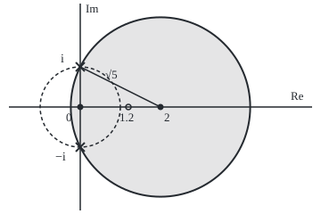

# Taylor series in the plane: a holomorphic function equals its power series out to the nearest singularity

Complex analysis → Taylor Series, Zeros and Rigidity → Holomorphic means analytic → Taylor series in the plane

---

## General Overview

Take one over one-plus-x-squared on the real line. At x = 1.2 it equals 0.409836. It is smooth everywhere and never blows up. Its Taylor series at 0 is 1 − x^2 + x^4 − x^6 + …, and at x = 1.2 that series fails: stopping after x^8 gives 2.947433, after x^18 −15.302295. Nothing on the real line explains why.

The explanation sits off the line. With complex inputs, one-plus-z-squared is zero at z = i and z = −i, one unit north and south of 0, and the function blows up there. Such a point, where the size grows without bound, is a **pole**. A series centred at a point behaves like a radar dish: its reach is the distance to the nearest obstacle. From 0 the obstacles ±i are 1 away, so the reach is 1, and 1.2 lies outside it. Move the dish to 2 and the obstacles are √5 = 2.236068 away; 1.2 is now well inside, and the series centred at 2 gives 0.409836 to six decimals.

From here on the reach is called the **radius of convergence**, and an obstacle is a **singularity**: a point where the function stops being holomorphic, that is, stops having a complex derivative, and no choice of value there repairs it. A function is **analytic** when, near each point, it equals a convergent power series.

**A function with a complex derivative throughout a disc equals its Taylor series on the whole disc, so its power series about a point reaches out to the nearest singularity: holomorphic and analytic are the same property.**

**What kind of fact this is:** a theorem, proved on this card in Why it works from Cauchy's integral formula.

### The picture: two dishes, two reaches

<p align="center"></p>

To scale: 45 units per unit, 0 at (90, 120). The dashed circle about 0 has radius 45.00; the shaded disc about 2, centred at (180.0, 120.0), has radius 100.62. Both rims pass through the poles, the crosses at (90.0, 75.0) and (90.0, 165.0). The ring at (144.0, 120.0) is z = 1.2.

---

## The formula

Notation first, in words. The loop integral sign ∮ is a contour integral once round a closed path, anticlockwise, as on [derivatives-from-the-boundary](../03-Contour%20Integrals%20and%20Cauchy%27s%20Theorem/06-derivatives-from-the-boundary.md). $f^{(n)}(a)$ is the n-th complex derivative of $f$ at $a$.

$$f(z) = \sum_{n=0}^{\infty} c_n (z - a)^n \quad\text{for } |z - a| < R, \qquad c_n = \frac{f^{(n)}(a)}{n!} = \frac{1}{2\pi i}\oint_{|w - a| = r} \frac{f(w)}{(w - a)^{n+1}}\,dw$$

**Read it aloud:** near the centre a, the function is a sum of powers of the step z − a; the n-th coefficient comes from the n-th derivative, or from an average round a circle about a; the sum is exact everywhere closer to a than the nearest singularity.

The radius $R$ is the distance from $a$ to the nearest singularity. For $f(z) = 1/(1 + z^2)$ and real $a$ it is $|a - i| = \sqrt{a^2 + 1}$: 1 about 0, √5 = 2.236068 about 2.

| Symbol | Plain meaning | In our example | Push it up and the answer… |
| --- | --- | --- | --- |
| $f$ | the function being expanded | 1/(1 + z^2) | — |
| $a$ | the centre: where the dish stands | 0, then 2 | the reach changes with the distance to ±i |
| $c_n$, $n$ | the n-th coefficient; the power it multiplies | about 2: c0 = 0.200000, c1 = −0.160000 | sizes shrink roughly by a factor 1/R per step |
| $R$ | radius of convergence | 1 about 0; 2.236068 about 2 | a larger disc |
| $r$, $w$ | the integral's circle radius; a point on it | r = 1 about 2, r = 0.5 about 0 | any r below R gives the same c_n |
| $q$ | the ratio \|z − a\|/r | 0.8/√5 = 0.357771 at z = 1.2, r pushed to R | slower convergence; at 1, none |
| $N$ | how many terms are kept | 5, 10, 20, 60 | smaller error |
| $M$ | the largest \|f\| on the circle | error bound only | a larger error bound |

The error after $N$ terms is at most $M q^N/(1 - q)$. At z = 1.2 about 2 the true errors after 5, 10 and 20 terms are 0.0004813136, 0.0000179175 and 0.0000000004: on average each term cuts the error by a factor near 0.357771.

### When it holds

- **Holomorphic on the whole open disc.** One bad point inside and the disc is too big: about 0, the point 1.2 is past ±i's distance and the series diverges.
- **A complex derivative, not a real one.** z-bar, the conjugate, has smooth real and imaginary parts but no complex derivative; its coefficient integrals all return 0.
- **Strictly inside.** On the rim the series may fail; at z = i it must, since f is infinite there. Past a pole no power series reaches, so there the radius is exactly the distance.

---

## Why it works

### Step 0: one geometric series does all the work

Cauchy's integral formula writes $f(z)$ as a weighted average of $f(w)$ over a circle, with weight $1/(w - z)$. One over a difference expands as a geometric series, and the average becomes a power series in z − a.

### Step 1: write the value as a circle average

Take a circle of radius $r$ about $a$, with $r$ below $R$. For any $z$ strictly inside,

$$f(z) = \frac{1}{2\pi i}\oint_{|w - a| = r} \frac{f(w)}{w - z}\,dw.$$

This is Cauchy's integral formula, proved on [derivatives-from-the-boundary](../03-Contour%20Integrals%20and%20Cauchy%27s%20Theorem/06-derivatives-from-the-boundary.md).

### Step 2: expand the weight

Write $w - z = (w - a) - (z - a)$ and pull out $w - a$:

$$\frac{1}{w - z} = \frac{1}{w - a}\cdot\frac{1}{1 - \frac{z - a}{w - a}} = \sum_{n=0}^{\infty} \frac{(z - a)^n}{(w - a)^{n+1}}.$$

The ratio $(z - a)/(w - a)$ has length $q = |z - a|/r$, below 1, the same for every $w$ on the circle.

### Step 3: swap sum and integral

With one rate all round the circle, integrating term by term is allowed (the folded proof shows it). The n-th term gives $(z - a)^n$ times the integral defining $c_n$, so $f(z) = \sum c_n (z - a)^n$. Cauchy's formula for derivatives makes the same integral $f^{(n)}(a)/n!$.

### Step 4: the reach is the nearest singularity

Steps 1 to 3 needed only a holomorphic closed disc of radius $r$. Every $r$ below the distance to the nearest singularity works, so the series converges on that whole open disc. It cannot pass a pole: a power series is bounded on closed discs inside its radius, while $f$ grows without bound near ±i.

### Step 5: holomorphic equals analytic

Steps 1 to 4 show holomorphic implies analytic. The reverse was shown on [complex-power-series](../02-Holomorphic%20Functions/02-complex-power-series.md). So one complex derivative brings infinitely many.

<details>
<summary>Detailed proof: the error bound and the term-by-term swap</summary>

Let $M$ be the largest value of $|f(w)|$ on the circle $|w - a| = r$, and $q = |z - a|/r < 1$. After $N$ terms of the geometric series in Step 2 the tail is $\frac{(z - a)^N}{(w - a)^N}\cdot\frac{1}{w - z}$, whose size is at most $q^N / (r(1 - q))$ for every $w$ on the circle, since $|w - z| \ge r - |z - a| = r(1 - q)$.

The difference between $f(z)$ and the N-term sum is $\frac{1}{2\pi i}$ times the integral of $f(w)$ times that tail. The circle has length $2\pi r$, so the difference is at most $\frac{1}{2\pi}\cdot 2\pi r \cdot M \cdot \frac{q^N}{r(1 - q)} = \frac{M q^N}{1 - q}$.

Given any tolerance $\varepsilon > 0$, choose $N$ with $M q^N/(1 - q) < \varepsilon$, possible since $q < 1$. Every later partial sum is within $\varepsilon$ of $f(z)$, so the series converges to $f(z)$.

For the upper limit on the radius: if the series converged on a disc larger than $R$, it would be continuous, hence bounded, on a closed disc with radius between the two, which contains a pole. Inside radius $R$ the series equals $f$, and $|f|$ exceeds every bound near the pole. So no radius beyond $R$ is possible for $1/(1 + z^2)$.

</details>

A second road to the coefficients needs no integral: multiply out $(1 + z^2) f(z) = 1$ in powers of z − a and match them, as below.

---

## Worked numbers, by hand

About $a = 2$, $1 + z^2 = 5 + 4(z - 2) + (z - 2)^2$. Matching powers in $(1 + z^2)f(z) = 1$ gives the recursion $5c_n + 4c_{n-1} + c_{n-2} = 0$ for $n \ge 1$, with $5c_0 = 1$.

| Step | Arithmetic | Value |
| --- | --- | --- |
| c0 | 1 ÷ 5 | 0.200000 |
| c1 | −(4 × 0.2) ÷ 5; also f′(2) = −4/25 | −0.160000 |
| c2 | −(4 × −0.16 + 0.2) ÷ 5 | 0.088000 |
| c3 | −(4 × 0.088 − 0.16) ÷ 5 | −0.038400 |
| c4 | −(4 × −0.0384 + 0.088) ÷ 5 | 0.013120 |
| step to z = 1.2 | 1.2 − 2 | −0.8 |
| terms c_n × (−0.8)^n, n = 0 to 4 | 0.2, 0.128, 0.05632, 0.019661, 0.005374 | sum 0.409355 |
| true value | 1 ÷ (1 + 1.44) | **0.409836** |

Five terms land within 0.0004813136 of the truth; sixty agree to six decimals: derivatives at 2 recover the value at 1.2.

The second case, about $a = 0$: the recursion gives 1, 0, −1, 0, 1, 0, −1, the series 1 − z^2 + z^4 − …, and at z = 0.5 sixty terms give 0.800000, equal to 1 ÷ 1.25.

### What breaks if you drop a piece

| Mistake | Comes out at | What went wrong |
| --- | --- | --- |
| Expand z-bar, the conjugate, about 0 | every coefficient c0 to c6 is 0.000000; series gives 0.000000 at 0.5, z-bar gives 0.500000 | no complex derivative, so no Taylor series |
| Use the series about 0 at z = 1.2 | powers 0 to 9 give 2.947433, 0 to 19 give −15.302295; f = 0.409836 | 1.2 is past the reach of 1 |
| Use the series about 2 at z = −1 | 10 terms −8.204106, 20 terms 203.970171; f = 0.500000 | −1 is 3 from 2, past √5 |

---

## Code, from first principles, and it actually runs

Two roads reach the coefficients: Cauchy's integral as a 256-point trapezoid sum round a circle, and the recursion from $(1 + z^2)f = 1$, with no integral. Two roads reach the radius: the distance to the poles, and the coefficients' decay, $1/|c_n|^{1/n}$ at its smallest for n from 180 to 200; that estimate, 2.245144, creeps down to 2.236068 as n grows.

### Python

```python
# Taylor series in the plane -- the check behind the card.  Standard library
# only.  f(z) = 1/(1 + z^2) is expanded about a = 0 and about a = 2.  The
# coefficients come by two roads: Cauchy's integral as a trapezoid sum round a
# circle, and the recursion read off (1 + z^2) f(z) = 1.  The radius comes by
# two roads: the distance to the poles +i and -i, and the coefficients' decay.
import math

def f(z):
    return 1 / (1 + z * z)

def cauchy(g, a, r, n, m=256):           # road one: mean of g(a + r w) / (r w)^n round the circle
    s = 0
    for k in range(m):
        w = complex(math.cos(2 * math.pi * k / m), math.sin(2 * math.pi * k / m))
        s += g(a + r * w) / (r * w) ** n
    return s / m

def recursion(a, count):                 # road two: (1 + a^2) c_n + 2a c_(n-1) + c_(n-2) = 1 if n = 0
    c = []
    for n in range(count):
        p1 = c[n - 1] if n >= 1 else 0.0
        p2 = c[n - 2] if n >= 2 else 0.0
        c.append(((1.0 if n == 0 else 0.0) - 2 * a * p1 - p2) / (1 + a * a))
    return c

def partial(c, h, count):                # the first `count` terms of the series at z = a + h
    return sum(c[n] * h ** n for n in range(count))

show = lambda xs: "[" + ", ".join(f"{x:.6f}" for x in xs) + "]"

c0, c2 = recursion(0.0, 201), recursion(2.0, 201)
gap0 = max(abs(cauchy(f, 0.0, 0.5, n) - c0[n]) for n in range(7))
gap2 = max(abs(cauchy(f, 2.0, 1.0, n) - c2[n]) for n in range(7))
dist0, dist2 = abs(0 - 1j), abs(2 - 1j)                 # nearest pole, +i or -i
decay = lambda c: 1 / max(abs(c[n]) ** (1 / n) for n in range(180, 201) if c[n] != 0)
rad0, rad2 = decay(c0), decay(c2)
errs = [abs(partial(c2, -0.8, N) - f(1.2)) for N in (5, 10, 20)]
barc = [cauchy(lambda z: z.conjugate(), 0.0, 0.5, n) for n in range(7)]      # z-bar
bar = max(abs(b) for b in barc)
print(f"about 0, c0..c6 by recursion: {show(c0[:7])}")
print(f"about 0, contour sum within 1e-12 of every one: {'yes' if gap0 < 1e-12 else 'no'}")
print(f"about 2, c0..c6 by recursion: {show(c2[:7])}")
print(f"about 2, contour sum within 1e-12 of every one: {'yes' if gap2 < 1e-12 else 'no'}")
print(f"radius about 0: distance to the pole {dist0:.6f}, from the coefficients {rad0:.6f}")
print(f"radius about 2: distance to the pole {dist2:.6f}, from the coefficients {rad2:.6f}")
print(f"about 2 at z = 1.2: terms 0..4 {show([c2[n] * (-0.8) ** n for n in range(5)])}, sum {partial(c2, -0.8, 5):.6f}")
print(f"about 2 at z = 1.2: f = {f(1.2):.6f}, 60 terms = {partial(c2, -0.8, 60):.6f}")
print(f"about 2 at z = 1.2: errors after 5, 10, 20 terms {', '.join(f'{e:.10f}' for e in errs)}; ratio q = {0.8 / dist2:.6f}")
print(f"about 0 at z = 0.5: f = {f(0.5):.6f}, 60 terms = {partial(c0, 0.5, 60):.6f}")
print(f"break 1, z-bar about 0: largest of c0..c6 = {bar:.6f}, series at 0.5 gives {abs(partial(barc, 0.5, 7)):.6f}, z-bar gives {abs((0.5 + 0j).conjugate()):.6f}")
print(f"break 2, about 0 at z = 1.2: powers 0..9 {partial(c0, 1.2, 10):.6f}, powers 0..19 {partial(c0, 1.2, 20):.6f}, f = {f(1.2):.6f}")
print(f"break 3, about 2 at z = -1: 10 terms {partial(c2, -3.0, 10):.6f}, 20 terms {partial(c2, -3.0, 20):.6f}, f = {f(-1.0):.6f}")
s = 45                                                    # figure: 45 units per unit, 0 at (90, 120)
print(f"figure, 0 ({90:.1f}, {120:.1f}); 2 ({90 + 2 * s:.1f}, {120:.1f}); +i ({90:.1f}, {120 - s:.1f}); "
      f"-i ({90:.1f}, {120 + s:.1f}); 1.2 ({90 + 1.2 * s:.1f}, {120:.1f}); radii {s * dist0:.2f}, {s * dist2:.2f}")
assert gap0 < 1e-12 and gap2 < 1e-12                      # two roads to the coefficients
assert abs(partial(c2, -0.8, 60) - 1 / 2.44) < 1e-12 and abs(partial(c0, 0.5, 60) - 0.8) < 1e-12
assert abs(rad0 - dist0) < 0.01 and abs(rad2 - dist2) < 0.01     # two roads to the radius
assert abs(bar) < 1e-12 and abs(partial(c0, 1.2, 20)) > 10        # the breaks really break
print("ALL CHECKS PASS")
```

**Ran 2026-09-28 on macOS, Python 3.14.6, standard library only. All checks passed. Output, pasted from the run:**

```
about 0, c0..c6 by recursion: [1.000000, 0.000000, -1.000000, 0.000000, 1.000000, 0.000000, -1.000000]
about 0, contour sum within 1e-12 of every one: yes
about 2, c0..c6 by recursion: [0.200000, -0.160000, 0.088000, -0.038400, 0.013120, -0.002816, -0.000371]
about 2, contour sum within 1e-12 of every one: yes
radius about 0: distance to the pole 1.000000, from the coefficients 1.000000
radius about 2: distance to the pole 2.236068, from the coefficients 2.245144
about 2 at z = 1.2: terms 0..4 [0.200000, 0.128000, 0.056320, 0.019661, 0.005374], sum 0.409355
about 2 at z = 1.2: f = 0.409836, 60 terms = 0.409836
about 2 at z = 1.2: errors after 5, 10, 20 terms 0.0004813136, 0.0000179175, 0.0000000004; ratio q = 0.357771
about 0 at z = 0.5: f = 0.800000, 60 terms = 0.800000
break 1, z-bar about 0: largest of c0..c6 = 0.000000, series at 0.5 gives 0.000000, z-bar gives 0.500000
break 2, about 0 at z = 1.2: powers 0..9 2.947433, powers 0..19 -15.302295, f = 0.409836
break 3, about 2 at z = -1: 10 terms -8.204106, 20 terms 203.970171, f = 0.500000
figure, 0 (90.0, 120.0); 2 (180.0, 120.0); +i (90.0, 75.0); -i (90.0, 165.0); 1.2 (144.0, 120.0); radii 45.00, 100.62
ALL CHECKS PASS
```

### Rust

Same numbers, same labels, built with `rustc --edition 2021 -O`.

```rust
// Taylor series in the plane -- the same check as the Python, in Rust.  No
// crates.  f(z) = 1/(1 + z^2) is expanded about a = 0 and about a = 2.  The
// coefficients come by two roads: Cauchy's integral as a trapezoid sum round a
// circle, and the recursion read off (1 + z^2) f(z) = 1.  The radius comes by
// two roads: the distance to the poles +i and -i, and the coefficients' decay.
use std::f64::consts::PI;

#[derive(Clone, Copy)]
struct C { re: f64, im: f64 }
impl C {
    fn add(self, o: C) -> C { C { re: self.re + o.re, im: self.im + o.im } }
    fn sub(self, o: C) -> C { C { re: self.re - o.re, im: self.im - o.im } }
    fn mul(self, o: C) -> C { C { re: self.re * o.re - self.im * o.im, im: self.re * o.im + self.im * o.re } }
    fn div(self, o: C) -> C { let d = o.re * o.re + o.im * o.im; C { re: (self.re * o.re + self.im * o.im) / d, im: (self.im * o.re - self.re * o.im) / d } }
    fn abs(self) -> f64 { self.re.hypot(self.im) }
}
fn re(x: f64) -> C { C { re: x, im: 0.0 } }
fn f(z: C) -> C { re(1.0).div(re(1.0).add(z.mul(z))) }
fn bar(z: C) -> C { C { re: z.re, im: -z.im } }

fn cauchy(g: fn(C) -> C, a: f64, r: f64, n: usize) -> C {   // road one: mean of g(a + r w) / (r w)^n
    let (m, mut s) = (256, re(0.0));
    for k in 0..m {
        let t = 2.0 * PI * k as f64 / m as f64;
        let rw = C { re: r * t.cos(), im: r * t.sin() };
        let mut p = re(1.0);
        for _ in 0..n { p = p.mul(rw) }
        s = s.add(g(re(a).add(rw)).div(p));
    }
    C { re: s.re / m as f64, im: s.im / m as f64 }
}
fn recursion(a: f64, count: usize) -> Vec<f64> {      // road two: (1 + a^2) c_n + 2a c_(n-1) + c_(n-2) = 1 if n = 0
    let mut c: Vec<f64> = Vec::new();
    for n in 0..count {
        let p1 = if n >= 1 { c[n - 1] } else { 0.0 };
        let p2 = if n >= 2 { c[n - 2] } else { 0.0 };
        c.push((if n == 0 { 1.0 } else { 0.0 } - 2.0 * a * p1 - p2) / (1.0 + a * a));
    }
    c
}
fn partial(c: &[f64], h: f64, count: usize) -> f64 { (0..count).map(|n| c[n] * h.powi(n as i32)).sum() }
fn show(xs: &[f64]) -> String { format!("[{}]", xs.iter().map(|x| format!("{:.6}", x)).collect::<Vec<_>>().join(", ")) }
fn decay(c: &[f64]) -> f64 { 1.0 / (180..201).filter(|&n| c[n] != 0.0).map(|n| c[n].abs().powf(1.0 / n as f64)).fold(0.0, f64::max) }
fn yn(b: bool) -> &'static str { if b { "yes" } else { "no" } }
fn fr(x: f64) -> f64 { f(re(x)).re }

fn main() {
    let (c0, c2) = (recursion(0.0, 201), recursion(2.0, 201));
    let gap0 = (0..7).map(|n| cauchy(f, 0.0, 0.5, n).sub(re(c0[n])).abs()).fold(0.0, f64::max);
    let gap2 = (0..7).map(|n| cauchy(f, 2.0, 1.0, n).sub(re(c2[n])).abs()).fold(0.0, f64::max);
    let (dist0, dist2) = (C { re: 0.0, im: -1.0 }.abs(), C { re: 2.0, im: -1.0 }.abs());
    let (rad0, rad2) = (decay(&c0), decay(&c2));
    let errs: Vec<String> = [5, 10, 20].iter().map(|&n| format!("{:.10}", (partial(&c2, -0.8, n) - fr(1.2)).abs())).collect();
    let barc: Vec<C> = (0..7).map(|n| cauchy(bar, 0.0, 0.5, n)).collect();   // z-bar
    let zbar = barc.iter().map(|b| b.abs()).fold(0.0, f64::max);
    let bar_sum = (0..7).fold(re(0.0), |s, n| s.add(barc[n].mul(re(0.5f64.powi(n as i32))))).abs();
    println!("about 0, c0..c6 by recursion: {}", show(&c0[..7]));
    println!("about 0, contour sum within 1e-12 of every one: {}", yn(gap0 < 1e-12));
    println!("about 2, c0..c6 by recursion: {}", show(&c2[..7]));
    println!("about 2, contour sum within 1e-12 of every one: {}", yn(gap2 < 1e-12));
    println!("radius about 0: distance to the pole {:.6}, from the coefficients {:.6}", dist0, rad0);
    println!("radius about 2: distance to the pole {:.6}, from the coefficients {:.6}", dist2, rad2);
    let t: Vec<f64> = (0..5).map(|n| c2[n] * (-0.8f64).powi(n as i32)).collect();
    println!("about 2 at z = 1.2: terms 0..4 {}, sum {:.6}", show(&t), partial(&c2, -0.8, 5));
    println!("about 2 at z = 1.2: f = {:.6}, 60 terms = {:.6}", fr(1.2), partial(&c2, -0.8, 60));
    println!("about 2 at z = 1.2: errors after 5, 10, 20 terms {}; ratio q = {:.6}", errs.join(", "), 0.8 / dist2);
    println!("about 0 at z = 0.5: f = {:.6}, 60 terms = {:.6}", fr(0.5), partial(&c0, 0.5, 60));
    println!("break 1, z-bar about 0: largest of c0..c6 = {:.6}, series at 0.5 gives {:.6}, z-bar gives {:.6}", zbar, bar_sum, bar(re(0.5)).abs());
    println!("break 2, about 0 at z = 1.2: powers 0..9 {:.6}, powers 0..19 {:.6}, f = {:.6}", partial(&c0, 1.2, 10), partial(&c0, 1.2, 20), fr(1.2));
    println!("break 3, about 2 at z = -1: 10 terms {:.6}, 20 terms {:.6}, f = {:.6}", partial(&c2, -3.0, 10), partial(&c2, -3.0, 20), fr(-1.0));
    let s = 45.0;                                          // figure: 45 units per unit, 0 at (90, 120)
    println!("figure, 0 ({:.1}, {:.1}); 2 ({:.1}, {:.1}); +i ({:.1}, {:.1}); -i ({:.1}, {:.1}); 1.2 ({:.1}, {:.1}); radii {:.2}, {:.2}",
             90.0, 120.0, 90.0 + 2.0 * s, 120.0, 90.0, 120.0 - s, 90.0, 120.0 + s, 90.0 + 1.2 * s, 120.0, s * dist0, s * dist2);
    assert!(gap0 < 1e-12 && gap2 < 1e-12);                                   // two roads to the coefficients
    assert!((partial(&c2, -0.8, 60) - 1.0 / 2.44).abs() < 1e-12 && (partial(&c0, 0.5, 60) - 0.8).abs() < 1e-12);
    assert!((rad0 - dist0).abs() < 0.01 && (rad2 - dist2).abs() < 0.01);     // two roads to the radius
    assert!(zbar < 1e-12 && partial(&c0, 1.2, 20).abs() > 10.0);             // the breaks really break
    println!("ALL CHECKS PASS");
}
```

**Ran 2026-09-28 on macOS, rustc 1.98.1, no crates. All checks passed. Output, pasted from the run:**

```
about 0, c0..c6 by recursion: [1.000000, 0.000000, -1.000000, 0.000000, 1.000000, 0.000000, -1.000000]
about 0, contour sum within 1e-12 of every one: yes
about 2, c0..c6 by recursion: [0.200000, -0.160000, 0.088000, -0.038400, 0.013120, -0.002816, -0.000371]
about 2, contour sum within 1e-12 of every one: yes
radius about 0: distance to the pole 1.000000, from the coefficients 1.000000
radius about 2: distance to the pole 2.236068, from the coefficients 2.245144
about 2 at z = 1.2: terms 0..4 [0.200000, 0.128000, 0.056320, 0.019661, 0.005374], sum 0.409355
about 2 at z = 1.2: f = 0.409836, 60 terms = 0.409836
about 2 at z = 1.2: errors after 5, 10, 20 terms 0.0004813136, 0.0000179175, 0.0000000004; ratio q = 0.357771
about 0 at z = 0.5: f = 0.800000, 60 terms = 0.800000
break 1, z-bar about 0: largest of c0..c6 = 0.000000, series at 0.5 gives 0.000000, z-bar gives 0.500000
break 2, about 0 at z = 1.2: powers 0..9 2.947433, powers 0..19 -15.302295, f = 0.409836
break 3, about 2 at z = -1: 10 terms -8.204106, 20 terms 203.970171, f = 0.500000
figure, 0 (90.0, 120.0); 2 (180.0, 120.0); +i (90.0, 75.0); -i (90.0, 165.0); 1.2 (144.0, 120.0); radii 45.00, 100.62
ALL CHECKS PASS
```

The two outputs match line for line.

> [!TIP]
> **Try changing**
> Guess first, then run it.
> - **Fewer points round the circle.** Change `m=256` to `m=8`. Both contour lines print `no` and the first assert stops the run: a coarse sum mixes each coefficient with the one eight places higher.
> - **Circle too big.** Change the contour radius about 2 from `1.0` to `2.5`, past √5. The circle now encloses ±i, the contour sum stops matching the recursion, and the first assert stops the run.
> - **Short window.** Change `range(180, 201)` to `range(1, 8)`. The decay estimate is far from √5 and the third assert stops it: the radius is a statement about the tail.

---

## The usual mistake

> [!warning]
> **Looking for the obstacle on the real line.** 1/(1 + x^2) has no bad point there, yet its series about 0 fails at 1.2: through x^8 it gives 2.947433, through x^18 −15.302295. The obstacles are ±i, which a real graph cannot show.
>
> - **Measuring the reach along the axis.** From 2 the poles are not 2 or 1 away but √(2^2 + 1^2) = 2.236068.
> - **Treating real smoothness as enough.** The real bump e^(−1/x^2), set to 0 at 0, has every real derivative 0 there, so its Taylor series is 0 while the function is not. It has no complex derivative at 0.
> - **Stretching the circle past a pole.** The coefficient integral holds only for r below R.

---

## Where you meet it in real life

- **Why a real series stops.** The series for arctan x, whose derivative is 1/(1 + x^2), stops at |x| = 1 for the same reason: the poles ±i.
- **Rigidity.** A holomorphic function's values near one point fix it wherever it continues: [zeros-and-the-identity-theorem](03-zeros-and-the-identity-theorem.md) and [analytic-continuation](04-analytic-continuation.md).

> **Say it back**
> Cauchy's formula writes a holomorphic function's value as a circle average. Expanding one over w − z as a geometric series turns it into a power series. The series is exact on every disc the function fills, and a pole stops it. For 1/(1 + z^2) the poles ±i give reach 1 about 0 and √5 about 2. Holomorphic and analytic are one property.

---

## What this builds on

- [derivatives-from-the-boundary](../03-Contour%20Integrals%20and%20Cauchy%27s%20Theorem/06-derivatives-from-the-boundary.md): Cauchy's integral formula and its derivative form, the start of Step 1.
- [complex-power-series](../02-Holomorphic%20Functions/02-complex-power-series.md): discs of convergence, and why a power series is holomorphic inside its own.
- [taylor-series](../../06-Calculus%20and%20analysis/06-Series/05-taylor-series.md): the real Taylor series, whose radius this card explains.

## Where this goes next

- [uniform-limits-of-holomorphic-functions](02-uniform-limits-of-holomorphic-functions.md): limits of holomorphic functions stay holomorphic, by the same circle average.
- [zeros-and-the-identity-theorem](03-zeros-and-the-identity-theorem.md): a power series' zeros are isolated, so a function is pinned by a small piece.
- [laurent-series](../05-Laurent%20Series%2C%20Singularities%20and%20Residues/01-laurent-series.md): past the pole, on a ring, a series needs negative powers.

---

## Sources

Verified 2026-09-28: each link below opens a page naming the cited book.

- Stein, Elias M., and Rami Shakarchi. *Complex Analysis*. Princeton University Press, 2003. [Publisher page](https://press.princeton.edu/books/hardcover/9780691113852/complex-analysis). Chapter 2 derives the power series from Cauchy's formula, as in Steps 1 to 3.
- Beck, Matthias, Gerald Marchesi, Dennis Pixton, and Lucas Sabalka. *A First Course in Complex Analysis*. [Authors' page and full text](https://matthbeck.github.io/complex.html). Free; its chapter on Taylor and Laurent series proves the expansion on a disc.
