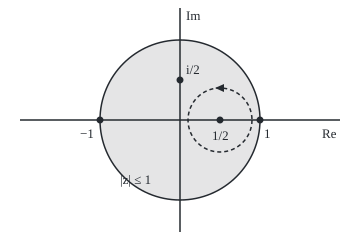

# Limits of holomorphic functions: if the approximations converge evenly, the limit is holomorphic and its derivatives follow

[Syllabus](../../../SYLLABUS.md) → [Complex analysis](../README.md) → [Taylor Series, Zeros and Rigidity](../README.md#s04) → Limits of holomorphic functions

---

## General Overview

Build a tower one floor at a time. Floor n is z to the n, divided by n squared: z, then z^2/4, then z^3/9. Here z is any point of the closed unit disc: distance 1 or less from 0, rim included. Each floor is a polynomial, so it has a complex derivative everywhere.

At z = 1 the tower stands 1 + 1/4 + 1/9 + … = π^2/6 = 1.644934 high. At z = −1 the signs alternate and it stands at −π^2/12 = −0.822467. Floor n never measures more than 1/n^2 on the disc, and those ceilings have a finite total, so after N floors the rest is under 1/N at every point at once. That is the Weierstrass M-test, and "at every point at once" is uniform convergence.

On the real line an even limit of smooth curves can have a corner. In the plane it cannot: inside the disc the tower's complex derivative is the stack of the floors' derivatives, 1.386294 = 2 ln 2 at z = 1/2. From here the tower is called $f$, and its first N floors added up $S_N$.

**When holomorphic functions converge uniformly on every closed disc inside an open region, the limit is holomorphic there, and its derivatives are the limits of their derivatives.**

**What kind of fact this is:** a theorem (Weierstrass's convergence theorem), proved on this card in Why it works; the M-test is proved on [Uniform convergence](../../06-Calculus%20and%20analysis/06-Series/07-uniform-convergence.md).

### The picture: the disc, and the circle that reads the slope

<p align="center"></p>

To scale: 80 units per 1, 0 at (180, 120). The points 1 and −1 sit at (260, 120) and (100, 120), i/2 at (180, 80), and 1/2 at (220, 120) inside its dashed circle of radius 0.4, 32 units, run anticlockwise.

---

## The formula

Notation first, in words. $\max$ over a set means the largest value there. A **closed disc inside** an open region is a disc, rim included, that sits wholly in the region.

$$\max_{|z| \le 1} \big|f(z) - S_N(z)\big| \;\le\; \sum_{n > N} M_n \;<\; \frac{1}{N}, \qquad M_n = \frac{1}{n^2}$$

**Read it aloud:** the worst gap anywhere on the disc between the tower and its first N floors is at most the sum of the remaining ceilings, which is under one over N.

$$f'(z_0) \;=\; \frac{1}{2\pi i}\oint_{|\zeta - z_0| = \rho} \frac{f(\zeta)}{(\zeta - z_0)^2}\,d\zeta \;=\; \lim_{N\to\infty} S_N'(z_0) \;=\; \sum_{n=1}^{\infty} \frac{z_0^{\,n-1}}{n}$$

**Read it aloud:** the slope of the tower at a point inside is an average of its values round a small circle, and it equals the stack of the floors' slopes.

The two are linked by the **Cauchy estimate**: the error in the slope at $z_0$ is at most the worst error in value round the circle, divided by $\rho$.

| Symbol | Plain meaning | In our example | Push it up and the answer… |
| --- | --- | --- | --- |
| $z$, $n$, $N$ | a point of the disc; a floor's number; how many floors are kept | z = 1/2; N = 10 | past the rim, floors blow up |
| $f$, $S_N$ | the finished tower; its first N floors added up | f(1) = 1.644934 | more floors, a smaller gap everywhere |
| $M_n$ | the ceiling: floor n's largest size on the disc | 1/n^2 | a ceiling like 1/n no longer adds up |
| $U$, $K$ | an open region; a closed, bounded piece of it | the open unit disc | — |
| $z_0$, $\rho$, $\zeta$ | the point; the circle's radius round it; a point on that circle | 1/2; 0.4 | a sharper estimate, until the circle leaves the disc |
| $f'$, $S_N'$ | complex derivatives (slopes) of the tower and of its first N floors | f'(1/2) = 1.386294 | — |
| $s$, $\sigma$ | zeta's complex input; a real number above 1 | s = 2 + 3i; σ = 2 | larger σ, smaller ceilings |
| $c$, $R$, $r$, $E_N$, $k$, $h$, $b$, $G$ | Detailed proof only: centre, radius, smaller radius; worst gap on the rim; derivative order; a small step; values on a circle and their Cauchy integral | — | — |

### When it holds

- **Holomorphic approximations on an open region $U$.** A real interval is not enough: sin(nx)/n shrinks evenly on the line, yet its slope at 0 stays 1.
- **Uniform on every closed disc inside $U$, not point by point.** Evenness lets the limit pass through the integral in Step 2.
- **The conclusion is for the open region only.** The tower is continuous on the closed disc, but its slope series at the rim point 1 never settles.
- **Uniform on the whole region is not required.** Each closed disc inside is enough.

---

## Why it works

### Step 0: Cauchy's formula turns values into slopes

A holomorphic function's value at a point is an average of its values round a circle about it, and so is its derivative, with a squared distance underneath ([Cauchy's integral formula](../03-Contour%20Integrals%20and%20Cauchy%27s%20Theorem/05-cauchys-integral-formula.md), [Derivatives from the boundary](../03-Contour%20Integrals%20and%20Cauchy%27s%20Theorem/06-derivatives-from-the-boundary.md)). Close values on the circle give close averages. On the real line nothing ties a slope to an average of values, so corners survive.

### Step 1: the ceilings make the tower converge evenly

On the closed disc $|z| \le 1$, so $|z^n/n^2| \le 1/n^2$. Each 1/n^2 is below 1/((n − 1)n) = 1/(n − 1) − 1/n, and those differences telescope: everything past floor N totals less than 1/N. By the M-test the partial sums converge uniformly on the closed disc. After 10 floors the worst gap is 0.095166 against the promise 0.1. It sits at z = 1, since every coefficient is positive.

### Step 2: the limit keeps Cauchy's formula

Cauchy's formula holds for each polynomial $S_N$ on the circle of radius 0.4 round 1/2: at a point z inside, $S_N(z)$ is the loop integral of $S_N(\zeta)/(\zeta - z)$, divided by $2\pi i$. Swap in $f$: the integrand moves by at most the worst gap divided by z's distance to the circle, along a circle of length $2\pi\rho$, so the integrals differ by at most the worst gap times $\rho$ over that distance (length times maximum, [Contour integrals](../03-Contour%20Integrals%20and%20Cauchy%27s%20Theorem/01-contour-integrals.md)). The gap goes to 0, so $f$ inside the circle is Cauchy's integral of its own values.

### Step 3: a Cauchy integral is holomorphic

Differentiating under the integral sign works for any continuous values on the circle, holomorphic or not, and $f$ is continuous as a uniform limit of continuous functions. So $f$ has a complex derivative inside the circle, and every point of the open disc has such a circle round it.

### Step 4: the slopes follow, with a bound

The derivative formula applied to $f - S_N$ gives the Cauchy estimate. With $\rho$ = 0.4 and a gap below 1/10, the slope of 10 floors at 1/2 is within 0.25 of the truth; the actual error is 0.000165. The bound shrinks with N, so $S_N'$, the stack of floor slopes $z^{n-1}/n$, tends to $f'$.

Multiplied by z, the stack is z + z^2/2 + z^3/3 + …, which is −log(1 − z) ([The complex logarithm](../02-Holomorphic%20Functions/04-complex-logarithm.md)). So $f'(z) = -\log(1 - z)/z$: at 1/2 that is 2 ln 2 = 1.386294, and at i/2 it is 0.927295 + 0.223144i.

### Step 5: the rim is left out

At z = 1 the floor slopes are 1, 1/2, 1/3, …: the harmonic series, 7.485471 after 1000 floors and unbounded. No circle round 1 fits inside the disc, so Step 2 cannot start.

### Step 6: why the zeta function will be holomorphic

The zeta function, zeta(s), is the sum of $n^{-s}$ over n = 1, 2, 3, …. Each floor $n^{-s} = e^{-s\ln n}$ is holomorphic in $s$, with size $n^{-\text{Re}\,s}$: at s = 2 + 3i, floor 5 is 0.004627 + 0.039732i, of size 0.040000 = 1/5^2. Any closed disc inside Re s > 1 sits in a half-plane Re s ≥ σ with σ > 1, whose ceilings $n^{-\sigma}$ add up; so zeta is holomorphic there.

<details>
<summary>Detailed proof</summary>

**Setting.** Each $S_N$ is holomorphic on the open region $U$, and $\max_K |f - S_N| \to 0$ for every closed bounded $K$ inside $U$.

**Continuity.** A uniform limit of continuous functions is continuous ([Uniform convergence](../../06-Calculus%20and%20analysis/06-Series/07-uniform-convergence.md)).

**Cauchy's formula in the limit.** Fix a closed disc $|\zeta - c| \le R$ in $U$ and $|z - c| \le r < R$. For each $N$, $S_N(z) = \frac{1}{2\pi i}\oint \frac{S_N(\zeta)}{\zeta - z}d\zeta$. The same integral with $f$ differs by at most $R\,E_N/(R - r)$, where $E_N = \max_{|\zeta - c| = R}|f - S_N|$. Letting $N \to \infty$ gives the formula for $f$.

**Holomorphy.** For continuous $b$ on the circle, $G(z) = \frac{1}{2\pi i}\oint \frac{b(\zeta)}{\zeta - z}d\zeta$ has difference quotients $\frac{1}{2\pi i}\oint \frac{b(\zeta)\,d\zeta}{(\zeta - z - h)(\zeta - z)}$, whose integrands converge uniformly as $h \to 0$. So $G$ has a complex derivative, and $f = G$ with $b = f$.

**Derivatives.** The $k$-th derivative formula applied to $f - S_N$ gives $\max_{|z - c| \le r} |f^{(k)} - S_N^{(k)}| \le \frac{k!\,R}{(R - r)^{k+1}} E_N \to 0$. Finitely many such discs cover $K$.

</details>

A second road to Step 3 is Morera's theorem: a continuous function with zero integral round every small triangle is holomorphic. The Cauchy route also gives the derivative bound.

---

## Worked numbers, by hand

| Step | Arithmetic | Value |
| --- | --- | --- |
| Worst gap after 10 floors | under the ceilings' tail, 1/10 | 0.095166 |
| Tower at the rim point 1 | 1 + 1/4 + 1/9 + … | π^2/6 = 1.644934 |
| Tower at −1 | −1.644934 + 2 × 1.644934/4, even floors counted back | **−0.822467** |
| Floor slopes at 1/2 | 1 + 1/4 + 1/12 + 1/32 + … | 1.386294 |
| Closed form | −log(1 − 1/2)/(1/2) = 2 ln 2 | **1.386294** |
| Slope error after 10 floors | bound (1/10)/0.4; actual | 0.25; 0.000165 |

The even floors carry a quarter of the tower, since 1/(2k)^2 = (1/4)(1/k^2). Near 1/2 the tower moves 1.386294 times as far as z.

### What breaks if you drop a piece

| Mistake | Comes out at | What went wrong |
| --- | --- | --- |
| Floor slopes summed at the rim point 1 | 2.928968, 5.187378, 7.485471 after 10, 100, 1000 floors | slopes are promised only inside |
| sin(nz)/n, even only on the real line | slope at 0 stays 1; size at i/4 is 1.705620 (n = 16), 69422.738441 (n = 64) | no control on a disc |
| f(−1) taken as −f(1) | −1.644934, not −0.822467 | alternating signs cancel half the tower |

The code prints all three.

---

## Code, from first principles, and it actually runs

The rim values come from stacked floors plus a tail correction, against π^2/6 and −π^2/12. The slope at 1/2 comes three ways: floors differentiated, a trapezoid sum of Cauchy's formula round the circle of radius 0.4, and −log(1 − z)/z with the log built from ln|z| and atan2. The asserts compare the roads and test both bounds.

### Python

```python
# Limits of holomorphic functions -- the check behind the card.  Standard library only.
# The tower: f(z) = sum of z^n/n^2 over n = 1, 2, 3, ... on the closed unit disc; floor n never
# exceeds M_n = 1/n^2.  Values on the rim: stacked floors against pi^2/6 and -pi^2/12.  Slope inside:
# floors differentiated one by one, against Cauchy's formula on a circle, against -log(1 - z)/z.
import math

def S(z, N):                                   # the first N floors
    return sum(z ** n / n ** 2 for n in range(1, N + 1))
def dS(z, N):                                  # the same floors, each differentiated
    return sum(z ** (n - 1) / n for n in range(1, N + 1))
def show(w):                                   # 'a + bi', six decimals, no -0.000000
    a, b = round(w.real, 6) + 0.0, round(w.imag, 6) + 0.0
    return f"{a:.6f} {'-' if b < 0 else '+'} {abs(b):.6f}i"
def log(w):                                    # principal log from ln|w| and atan2
    return complex(math.log(abs(w)), math.atan2(w.imag, w.real))

N = 1000                                       # rim values: stack 1000 floors, add the tail's size
f1 = S(1, N) + 1 / N - 1 / (2 * N ** 2) + 1 / (6 * N ** 3)
fm1 = (S(-1, 100000) + S(-1, 100001)) / 2      # alternating floors: average two neighbours
print(f"f(1): floors {f1:.6f}, pi^2/6 {math.pi ** 2 / 6:.6f}")
print(f"f(-1): floors {fm1:.6f}, -pi^2/12 {-math.pi ** 2 / 12:.6f}; mistake -f(1) = {-f1:.6f}")
for n in (10, 100, 1000):                      # worst gap on the closed disc sits at z = 1
    print(f"N = {n}: worst gap after N floors {math.pi ** 2 / 6 - S(1, n):.6f}, M-test bound 1/N {1 / n:.6f}")
z0, rho = 0.5, 0.4                             # the slope at 1/2, Cauchy circle of radius 0.4 round it
termwise, closed = dS(z0, 80), -math.log(1 - z0) / z0
print(f"f'(1/2): floors differentiated {termwise:.6f}, -log(1 - z)/z = 2 ln 2 = {closed:.6f}")
for m in (8, 32, 128):                         # trapezoid sum of Cauchy's formula, m points on the circle
    pts = [rho * complex(math.cos(2 * math.pi * k / m), math.sin(2 * math.pi * k / m)) for k in range(m)]
    cauchy = sum(S(z0 + p, 400) / p for p in pts) / m
    print(f"Cauchy's formula, {m} points: {show(cauchy)}, error {abs(cauchy - closed):.9f}")
err10, est10 = abs(dS(z0, 10) - termwise), (1 / 10) / rho
print(f"slope error after 10 floors {err10:.6f}, Cauchy estimate (1/10)/0.4 = {est10:.6f}")
w = 0.5j
tw_i, cl_i = dS(w, 80), -log(1 - w) / w
print(f"f'(i/2): floors differentiated {show(tw_i)}, -log(1 - z)/z {show(cl_i)}")
print("rim slope at z = 1, harmonic sums: " + ", ".join(f"N = {n}: {dS(1, n):.6f}" for n in (10, 100, 1000)))
for n in (16, 64):                             # sin(nx)/n: tiny on the real line, huge at i/4
    sh = (math.exp(n / 4) - math.exp(-n / 4)) / 2 / n
    print(f"sin(nz)/n, n = {n}: real-line size <= {1 / n:.6f}, slope at 0 = 1, size at i/4 = {sh:.6f}")
s = complex(2, 3)                              # the zeta link: |n^-s| = n^-(Re s)
t = math.exp(-s.real * math.log(5)) * complex(math.cos(-s.imag * math.log(5)), math.sin(-s.imag * math.log(5)))
print(f"zeta link: 5^-(2+3i) = {show(t)}, size {abs(t):.6f} = 1/5^2")
print(f"figure, centre (180, 120), 80 per unit: z = 1 at ({180 + 80 * 1}, 120), z = -1 at ({180 - 80 * 1}, 120), "
      f"z0 at ({180 + 80 * z0:.0f}, 120), Cauchy radius {80 * rho:.0f}, i/2 at (180, {120 - 80 * 0.5:.0f})")
assert abs(f1 - math.pi ** 2 / 6) < 1e-12 and abs(fm1 + math.pi ** 2 / 12) < 1e-9   # floors meet pi
assert all(math.pi ** 2 / 6 - S(1, n) <= 1 / n for n in (10, 100, 1000))            # M-test bound holds
assert abs(cauchy - termwise) < 1e-10 and abs(termwise - closed) < 1e-12 and err10 <= est10
assert abs(tw_i - cl_i) < 1e-12 and dS(1, 1000) > 7                                 # i/2 case; rim slope runs off
print("ALL CHECKS PASS")
```

**Ran 2026-09-28 on macOS, Python 3.14.6, standard library only. All checks passed. Output, pasted from the run:**

```
f(1): floors 1.644934, pi^2/6 1.644934
f(-1): floors -0.822467, -pi^2/12 -0.822467; mistake -f(1) = -1.644934
N = 10: worst gap after N floors 0.095166, M-test bound 1/N 0.100000
N = 100: worst gap after N floors 0.009950, M-test bound 1/N 0.010000
N = 1000: worst gap after N floors 0.001000, M-test bound 1/N 0.001000
f'(1/2): floors differentiated 1.386294, -log(1 - z)/z = 2 ln 2 = 1.386294
Cauchy's formula, 8 points: 1.388589 + 0.000000i, error 0.002294430
Cauchy's formula, 32 points: 1.386295 + 0.000000i, error 0.000000739
Cauchy's formula, 128 points: 1.386294 + 0.000000i, error 0.000000000
slope error after 10 floors 0.000165, Cauchy estimate (1/10)/0.4 = 0.250000
f'(i/2): floors differentiated 0.927295 + 0.223144i, -log(1 - z)/z 0.927295 + 0.223144i
rim slope at z = 1, harmonic sums: N = 10: 2.928968, N = 100: 5.187378, N = 1000: 7.485471
sin(nz)/n, n = 16: real-line size <= 0.062500, slope at 0 = 1, size at i/4 = 1.705620
sin(nz)/n, n = 64: real-line size <= 0.015625, slope at 0 = 1, size at i/4 = 69422.738441
zeta link: 5^-(2+3i) = 0.004627 + 0.039732i, size 0.040000 = 1/5^2
figure, centre (180, 120), 80 per unit: z = 1 at (260, 120), z = -1 at (100, 120), z0 at (220, 120), Cauchy radius 32, i/2 at (180, 80)
ALL CHECKS PASS
```

### Rust

Same numbers, same labels, built with `rustc --edition 2021 -O`.

```rust
// Limits of holomorphic functions -- the same check as the Python, in Rust.  No crates.
// The tower: f(z) = sum of z^n/n^2 over n = 1, 2, 3, ... on the closed unit disc; floor n never
// exceeds M_n = 1/n^2.  Values on the rim: stacked floors against pi^2/6 and -pi^2/12.  Slope inside:
// floors differentiated one by one, against Cauchy's formula on a circle, against -log(1 - z)/z.
use std::f64::consts::PI;
#[derive(Clone, Copy)]
struct C { re: f64, im: f64 }
fn c(re: f64, im: f64) -> C { C { re, im } }
fn add(a: C, b: C) -> C { c(a.re + b.re, a.im + b.im) }
fn sub(a: C, b: C) -> C { c(a.re - b.re, a.im - b.im) }
fn mul(a: C, b: C) -> C { c(a.re * b.re - a.im * b.im, a.re * b.im + a.im * b.re) }
fn div(a: C, b: C) -> C { let m = b.re * b.re + b.im * b.im; c((a.re * b.re + a.im * b.im) / m, (a.im * b.re - a.re * b.im) / m) }
fn md(a: C) -> f64 { a.re.hypot(a.im) }
fn log(w: C) -> C { c(md(w).ln(), w.im.atan2(w.re)) } // principal log from ln|w| and atan2
fn floors(z: C, n: usize, slope: bool) -> C { // the first n floors, or each floor differentiated
    let (mut p, mut s) = (c(1.0, 0.0), c(0.0, 0.0));
    for k in 1..=n {
        let kf = k as f64;
        if slope { s = add(s, c(p.re / kf, p.im / kf)); p = mul(p, z); } else { p = mul(p, z); s = add(s, c(p.re / (kf * kf), p.im / (kf * kf))); }
    }
    s
}
fn sr(x: f64, n: usize) -> f64 { floors(c(x, 0.0), n, false).re }
fn show(w: C) -> String { // 'a + bi', six decimals, no -0.000000
    let a = format!("{:.6}", w.re);
    let a = if a == "-0.000000" { "0.000000".to_string() } else { a };
    let b = format!("{:.6}", w.im.abs());
    let sign = if w.im < 0.0 && b != "0.000000" { '-' } else { '+' };
    format!("{} {} {}i", a, sign, b)
}
fn main() {
    let n = 1000.0f64; // rim values: stack 1000 floors, add the tail's size
    let f1 = sr(1.0, 1000) + 1.0 / n - 1.0 / (2.0 * n * n) + 1.0 / (6.0 * n * n * n);
    let fm1 = (sr(-1.0, 100000) + sr(-1.0, 100001)) / 2.0; // alternating floors: average two neighbours
    println!("f(1): floors {:.6}, pi^2/6 {:.6}", f1, PI * PI / 6.0);
    println!("f(-1): floors {:.6}, -pi^2/12 {:.6}; mistake -f(1) = {:.6}", fm1, -PI * PI / 12.0, -f1);
    for k in [10usize, 100, 1000] { // worst gap on the closed disc sits at z = 1
        println!("N = {}: worst gap after N floors {:.6}, M-test bound 1/N {:.6}", k, PI * PI / 6.0 - sr(1.0, k), 1.0 / k as f64);
    }
    let (z0, rho) = (0.5f64, 0.4f64); // the slope at 1/2, Cauchy circle of radius 0.4 round it
    let termwise = floors(c(z0, 0.0), 80, true).re;
    let closed = -(1.0 - z0).ln() / z0;
    println!("f'(1/2): floors differentiated {:.6}, -log(1 - z)/z = 2 ln 2 = {:.6}", termwise, closed);
    let mut cauchy = c(0.0, 0.0);
    for m in [8usize, 32, 128] { // trapezoid sum of Cauchy's formula, m points on the circle
        cauchy = c(0.0, 0.0);
        for k in 0..m {
            let t = 2.0 * PI * k as f64 / m as f64;
            let p = c(rho * t.cos(), rho * t.sin());
            cauchy = add(cauchy, div(floors(add(c(z0, 0.0), p), 400, false), p));
        }
        cauchy = c(cauchy.re / m as f64, cauchy.im / m as f64);
        println!("Cauchy's formula, {} points: {}, error {:.9}", m, show(cauchy), md(sub(cauchy, c(closed, 0.0))));
    }
    let (err10, est10) = ((floors(c(z0, 0.0), 10, true).re - termwise).abs(), (1.0 / 10.0) / rho);
    println!("slope error after 10 floors {:.6}, Cauchy estimate (1/10)/0.4 = {:.6}", err10, est10);
    let w = c(0.0, 0.5);
    let (tw_i, cl_i) = (floors(w, 80, true), div(c(-log(sub(c(1.0, 0.0), w)).re, -log(sub(c(1.0, 0.0), w)).im), w));
    println!("f'(i/2): floors differentiated {}, -log(1 - z)/z {}", show(tw_i), show(cl_i));
    let h: Vec<String> = [10usize, 100, 1000].iter().map(|&k| format!("N = {}: {:.6}", k, floors(c(1.0, 0.0), k, true).re)).collect();
    println!("rim slope at z = 1, harmonic sums: {}", h.join(", "));
    for k in [16.0f64, 64.0] { // sin(nx)/n: tiny on the real line, huge at i/4
        let sh = ((k / 4.0).exp() - (-k / 4.0).exp()) / 2.0 / k;
        println!("sin(nz)/n, n = {}: real-line size <= {:.6}, slope at 0 = 1, size at i/4 = {:.6}", k as i32, 1.0 / k, sh);
    }
    let (sre, sim, l5) = (2.0f64, 3.0f64, 5.0f64.ln()); // the zeta link: |n^-s| = n^-(Re s)
    let t = c((-sre * l5).exp() * (-sim * l5).cos(), (-sre * l5).exp() * (-sim * l5).sin());
    println!("zeta link: 5^-(2+3i) = {}, size {:.6} = 1/5^2", show(t), md(t));
    println!("figure, centre (180, 120), 80 per unit: z = 1 at ({:.0}, 120), z = -1 at ({:.0}, 120), z0 at ({:.0}, 120), Cauchy radius {:.0}, i/2 at (180, {:.0})",
        180.0 + 80.0 * 1.0, 180.0 - 80.0 * 1.0, 180.0 + 80.0 * z0, 80.0 * rho, 120.0 - 80.0 * 0.5);
    assert!((f1 - PI * PI / 6.0).abs() < 1e-12 && (fm1 + PI * PI / 12.0).abs() < 1e-9); // floors meet pi
    assert!([10usize, 100, 1000].iter().all(|&k| PI * PI / 6.0 - sr(1.0, k) <= 1.0 / k as f64)); // M-test bound holds
    assert!((cauchy.re - termwise).abs() < 1e-10 && (termwise - closed).abs() < 1e-12 && err10 <= est10);
    assert!(md(sub(tw_i, cl_i)) < 1e-12 && floors(c(1.0, 0.0), 1000, true).re > 7.0); // i/2 case; rim slope runs off
    println!("ALL CHECKS PASS");
}
```

**Ran 2026-09-28 on macOS, rustc 1.98.1, no crates. All checks passed. Output, pasted from the run:**

```
f(1): floors 1.644934, pi^2/6 1.644934
f(-1): floors -0.822467, -pi^2/12 -0.822467; mistake -f(1) = -1.644934
N = 10: worst gap after N floors 0.095166, M-test bound 1/N 0.100000
N = 100: worst gap after N floors 0.009950, M-test bound 1/N 0.010000
N = 1000: worst gap after N floors 0.001000, M-test bound 1/N 0.001000
f'(1/2): floors differentiated 1.386294, -log(1 - z)/z = 2 ln 2 = 1.386294
Cauchy's formula, 8 points: 1.388589 + 0.000000i, error 0.002294430
Cauchy's formula, 32 points: 1.386295 + 0.000000i, error 0.000000739
Cauchy's formula, 128 points: 1.386294 + 0.000000i, error 0.000000000
slope error after 10 floors 0.000165, Cauchy estimate (1/10)/0.4 = 0.250000
f'(i/2): floors differentiated 0.927295 + 0.223144i, -log(1 - z)/z 0.927295 + 0.223144i
rim slope at z = 1, harmonic sums: N = 10: 2.928968, N = 100: 5.187378, N = 1000: 7.485471
sin(nz)/n, n = 16: real-line size <= 0.062500, slope at 0 = 1, size at i/4 = 1.705620
sin(nz)/n, n = 64: real-line size <= 0.015625, slope at 0 = 1, size at i/4 = 69422.738441
zeta link: 5^-(2+3i) = 0.004627 + 0.039732i, size 0.040000 = 1/5^2
figure, centre (180, 120), 80 per unit: z = 1 at (260, 120), z = -1 at (100, 120), z0 at (220, 120), Cauchy radius 32, i/2 at (180, 80)
ALL CHECKS PASS
```

The two outputs match line for line.

> [!TIP]
> **Try changing**
> Guess first, then run it.
> - **A bigger circle.** Set `rho` to `0.6`: the circle reaches 1.1, past the rim, the Cauchy sum runs into the hundreds of billions, and the third assert stops it.
> - **Steeper floors.** Change `n ** 2` in `S` to `n ** 3`: the tower at 1 is no longer π^2/6, and the first assert stops it.
> - **Fewer points.** Change `(8, 32, 128)` to `(8, 16, 32)`: the error at 32 points, 0.000000739, fails the third assert.

---

## The usual mistake

> [!warning]
> **Carrying the real-line picture into the plane.** On the real line sin(nx)/n shrinks evenly while its slope at 0 stays 1. The complex theorem asks more: uniform control on discs, where Cauchy's formula ties slopes to values. At i/4, sin(nz)/n reaches 69422.738441 by n = 64.
>
> - **Reading the rim as inside.** The tower is 1.644934 at z = 1, but its slope series there passes 7.485471 and keeps going.
> - **Treating the Cauchy estimate as the error.** It promised 0.25; the error was 0.000165.

---

## Where you meet it in real life

- **Special functions.** Zeta, gamma and infinite products are defined as limits; this theorem shows each is holomorphic ([The zeta function](../09-Special%20Functions%20and%20the%20Zeta%20Function/05-zeta-function-and-euler-product.md)).
- **Power series.** Term-by-term differentiation inside the disc ([Power series in the plane](../02-Holomorphic%20Functions/02-complex-power-series.md)) is the case whose floors are powers of z.
- **Numerical software.** The Cauchy estimate bounds a truncated series' derivative error from its value error.

> **Say it back**
> Holomorphic floors capped by numbers with a finite total converge evenly, by the M-test. Cauchy's formula writes values and slopes as averages round a circle, and averages respect even limits. So the limit is holomorphic inside, and its slope is the stack of the floors' slopes. On the rim, where no circle fits, the slope can fail. The same argument makes zeta holomorphic on Re s > 1.

---

## What this builds on

- [Taylor series in the plane](01-taylor-series-in-the-plane.md): holomorphic functions as power series, via Cauchy's formula.
- [Uniform convergence](../../06-Calculus%20and%20analysis/06-Series/07-uniform-convergence.md): one cutoff for every input, and the M-test's proof.

## Where this goes next

- [Infinite products](../09-Special%20Functions%20and%20the%20Zeta%20Function/01-infinite-products.md): products of holomorphic factors, shown holomorphic by taking logs and this theorem.
- [The gamma function](../09-Special%20Functions%20and%20the%20Zeta%20Function/02-gamma-function.md): an integral as a uniform limit of holomorphic pieces.
- [The zeta function](../09-Special%20Functions%20and%20the%20Zeta%20Function/05-zeta-function-and-euler-product.md): the sum of n^(−s), holomorphic on Re s > 1 by Step 6.

The tower is known on the disc and the zeta sum on Re s > 1; whether a function known on a small set is fixed everywhere is [Zeros and the identity theorem](03-zeros-and-the-identity-theorem.md).

---

## Sources

Verified 28 Sep 2026: every link below resolves to the publisher's page.

- Stein, Elias M., and Rami Shakarchi. *Complex Analysis*. Princeton University Press, 2003. [Publisher page](https://press.princeton.edu/books/hardcover/9780691113852/complex-analysis). Chapter 2: holomorphic limits via Cauchy's formula, and the Cauchy estimates.
- Lebl, Jiří. *Guide to Cultivating Complex Analysis*. [Author's page and free text](https://www.jirka.org/ca/). Locally uniform limits of holomorphic functions and the convergence of their derivatives.
