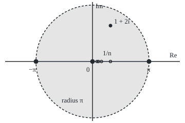

# Zeros and the identity theorem: zeros come singly, so a function known on a tiny stretch is known everywhere

Complex analysis → Taylor Series, Zeros and Rigidity → Where a function vanishes → Zeros and the identity theorem

---

## General Overview

A locksmith copying a key needs only a short stretch of it: match a few millimetres and every notch is forced. Holomorphic functions (with a complex derivative at every point of a region) behave like that key.

The sine function, sin z, is zero at 0, then next at π, 3.141593 along the real line. The cubic z^2(z − 1) is zero at 0 and at 1, and near 0 it hugs zero harder: at 0.1 it is −0.009, where sine is about 0.1. How many times a zero repeats is its **order**: 1 for sine at 0, 2 for the cubic.

Each zero of a holomorphic function that is not zero everywhere has a small disc round it holding no other zero. So two holomorphic functions agreeing at points that pile up inside their region agree everywhere in it. So sin^2 z + cos^2 z = 1, true on the real line, stays true at 1 + 2i. From here on the locksmith drops out; the real terms are **isolated zero** and **identity theorem**.

**Near a zero, a holomorphic function is a whole power of (z − a) times a factor not zero there; so its zeros stand apart, and two holomorphic functions agreeing on points that pile up inside a connected region agree on all of it.**

**What kind of fact this is:** a theorem, proved on this card in Why it works; the order of a zero is a definition.

### The picture: sine's zeros stand apart, the points 1/n crowd in

<p align="center"></p>

To scale: 35 units per unit, origin at (180, 120). Sine's zeros sit at x = 70.04, 180.00 and 289.96; the shaded open disc of radius π holds only the one at 0, with ±π on its edge. The hollow points 1/n, n = 1 to 4, at x = 215.00, 197.50, 191.67 and 188.75, crowd towards 0. The point 1 + 2i is at (215.00, 50.00).

---

## The formula

Notation first, in words. The letter $a$ names a zero, a point with f(a) = 0. The Taylor coefficients $c_k$ are the numbers in f(z) = c_0 + c_1(z − a) + c_2(z − a)^2 + …, with c_k = f^(k)(a)/k!, the k-th derivative at a over k factorial ([taylor-series-in-the-plane](01-taylor-series-in-the-plane.md)). A **domain** $D$ is open and connected: any two of its points join by a path inside it.

$$f(z) = (z - a)^m\, g(z), \qquad g(a) = c_m \neq 0$$

**Read it aloud:** near a zero, f is (z − a) multiplied in m times, then a leftover g not zero at a; the order m is the place of the first non-zero Taylor coefficient, so also of the first non-zero derivative at a.

$$f_1(z_n) = f_2(z_n) \text{ for all } n,\quad z_n \in D,\quad z_n \neq a,\quad z_n \to a \in D \;\Longrightarrow\; f_1 = f_2 \text{ on all of } D$$

**Read it aloud:** two holomorphic functions that agree along points closing in on a point inside a domain are the same function on the whole domain.

| Symbol | Plain meaning | In our example | Push it up and the answer… |
| --- | --- | --- | --- |
| $f$ | a holomorphic function, not zero everywhere | sin z; z^2(z − 1) | — |
| $a$ | a zero of f | 0 | — |
| $c_k$, $k$ | the k-th Taylor coefficient at a | sine: c_1 = 1, c_3 = −0.166667 | — |
| $m$ | the order | 1 for sine, 2 for the cubic | f hugs 0 harder |
| $g$ | the leftover, not zero at a | sine: g(0) = 1; cubic: z − 1 | — |
| $D$ | the domain | the whole plane | — |
| $z_n$, $n$ | points of agreement | 1/n, closing in on 0 | — |
| $f_1$, $f_2$, $h$ | two functions; h = f_1 − f_2 | sin^2 z + cos^2 z and 1 | — |

### When it holds

- **Holomorphic, not merely smooth.** The real bump e^(−1/x^2) for x > 0, and 0 for x ≤ 0, is zero on a half-line yet 0.018316 at 0.5.
- **A connected domain.** A function that is 0 on one disc and 1 on a separate disc agrees with 0 on a whole disc.
- **The pile-up point inside D.** The zeros of sin(1/z), at 1/(kπ), crowd onto 0, outside its domain; yet sin(1/0.2) = −0.958924.
- **Piling up, not just many.** sin z and 0 agree at points 3.141593 apart, which pile up nowhere.

---

## Why it works

### Step 0: near each point, the function is its own Taylor series

A holomorphic function equals its Taylor series on every disc round a inside D ([taylor-series-in-the-plane](01-taylor-series-in-the-plane.md)). So every question here becomes: is some coefficient at a not zero?

### Step 1: a zero of finite order factors out

If f is not zero everywhere near a, let c_m be its first non-zero coefficient. Every later term carries at least m factors of (z − a):

$$f(z) = (z-a)^m \big(c_m + c_{m+1}(z-a) + c_{m+2}(z-a)^2 + \cdots\big) = (z-a)^m g(z)$$

The bracket is a power series on the same disc, so g is holomorphic there, with g(a) = c_m. Sine's coefficients at 0 are 0, 1, 0, −0.166667: m = 1. At small real r = 0.1, 0.01, 0.001, sin(r)/r reads 0.998334, 0.999983, 1.000000, closing in on g(0) = 1. The cubic's are 0, 0, −1, 1: m = 2, and z^2(z − 1)/z^2 reads −0.900000, −0.990000, −0.999000.

### Step 2: zeros stand apart

The leftover g is continuous and g(a) is not zero, so g stays away from zero on some small disc round a. There (z − a)^m is zero only at a, so f is too: the zero is **isolated**.

For the cubic, g(z) = z − 1 has no zero within distance 1 of 0; the next zero is at 1. For sine, Newton's method (repeated tangent-line guesses) from 3 finds the next zero at 3.141593. Isolated does not mean few.

### Step 3: agreement on a pile-up kills every coefficient

The difference h = f_1 − f_2 is holomorphic and zero at every z_n, and by continuity at a too. If some coefficient of h at a were not zero, Step 2 would give a disc round a holding no other zero. But the z_n enter every disc round a. So every coefficient of h at a is zero, and h is zero on the whole Taylor disc round a.

### Step 4: connectedness carries the zero across the domain

Join a to any point b of D by a path inside D. The path stays a fixed distance from the edge of D, so every point on it has a Taylor disc at least that wide; walk it in shorter hops. Each new stop lies in a disc where h is zero, so Step 3 applies there too. Finitely many hops reach b, so h(b) = 0 and f_1 = f_2 on all of D. Taking f_2 = 0 closes a gap in Step 1: a holomorphic f that is zero on one disc is zero on all of D, so if f is not zero everywhere, every zero has a finite order.

<details>
<summary>Detailed proof</summary>

**Step 2 with tolerances.** Take ε = |c_m|/2. Continuity of g gives δ > 0 with |g(z) − c_m| < ε when |z − a| < δ. There |g(z)| > |c_m|/2 > 0, so |f(z)| = |z − a|^m |g(z)| > 0 for 0 < |z − a| < δ.

**Step 4 without paths.** Let U be the points w of D where every Taylor coefficient of h is zero; a is in U by Step 3. U is open: h is zero on a disc round each of its points. The rest of D is open: if h^(k)(w) ≠ 0, continuity keeps it non-zero on a small disc. A connected open set does not split into two disjoint non-empty open pieces, so U = D.

</details>

### Step 5: the identity sin^2 + cos^2 = 1 goes complex

Let h(z) = sin^2 z + cos^2 z − 1. Sums and products of power series are power series, so h is holomorphic on the whole plane, which is connected. It is zero at every real number, including every 1/n, and 1/n closes in on 0. By Steps 3 and 4, h is zero everywhere. At 1 + 2i the two squares are 6.182117 + 12.407326i and −5.182117 − 12.407326i, and they add to 1, though sine there, 3.165779 + 1.959601i, lies far outside the unit circle: the identity is algebra between power series, not the unit circle.

A direct road for this one identity: sin^2 z + cos^2 z = e^(iz) e^(−iz) = 1, from [eulers-formula](../01-Complex%20Numbers%20and%20the%20Plane/04-eulers-formula.md).

---

## Worked numbers, by hand

| Step | Arithmetic | Value |
| --- | --- | --- |
| sine's coefficients at 0 | z − z^3/6 + … | 0, 1, 0, −0.166667 |
| order of sine's zero | first coefficient not zero | **1** |
| the cubic expanded | z^2(z − 1) = −z^2 + z^3 | 0, 0, −1, 1 |
| order of the cubic's zero | first coefficient not zero | **2** |
| leftovers near 0 | sin(0.1)/0.1; (0.01 × −0.9)/0.01 | 0.998334; −0.900000 |
| sine and cosine at 1 + 2i | their series | 3.165779 + 1.959601i; 2.032723 − 3.051898i |
| their squares | multiply each out | 6.182117 + 12.407326i; −5.182117 − 12.407326i |
| the sum | imaginary parts cancel | **1.000000 + 0.000000i** |

Off the real line, where neither square is even real, the sum is still exactly 1.

### What breaks if you drop a piece

| Mistake | Comes out at | What went wrong |
| --- | --- | --- |
| Pile-up outside D: sin(1/z) | zeros 0.318310, 0.159155, 0.106103, 0.079577; −0.958924 at 0.2 | 0 is not in the domain |
| Two separate discs | 0 on one, 1.000000 at 3 | Nothing crosses the gap |
| Real bump e^(−1/x^2) | 0.018316 at 0.5; 54.598150 at 0.5i | Smooth is not holomorphic |
| Many agreements, no pile-up | sin z = 0 every 3.141593 | Zeros can be isolated yet infinite |

The code prints all four.

---

## Code, from first principles, and it actually runs

Two roads to each fact. The Taylor coefficients, and so the orders, come from formulas and from the Cauchy coefficient integral as a trapezoid sum round |z| = 0.5. Sine and cosine at 1 + 2i come from their series and from real exp, cos and sin. A third check gets n! times each Taylor coefficient of sin^2 z + cos^2 z in whole numbers: 1, then ten zeros.

### Python

```python
# Zeros and the identity theorem -- the check behind the card.  Standard library only.
# Road one: Taylor coefficients by formula, sin and cos at 1 + 2i by their own series.
# Road two: coefficients by a trapezoid sum round |z| = 0.5, sin and cos from exponentials.
# The identity's own Taylor series is then summed exactly, in whole numbers.
import math

def show(x):                                        # six decimals, no -0.000000
    return f"{round(x, 6) + 0.0:.6f}"
def showc(w):                                       # 'a + bi', six decimals
    a, b = round(w.real, 6) + 0.0, round(w.imag, 6) + 0.0
    return f"{a:.6f} {'-' if b < 0 else '+'} {abs(b):.6f}i"
def cexp(w):                                        # e^w from real exp, cos, sin
    return math.exp(w.real) * complex(math.cos(w.imag), math.sin(w.imag))
def sin_exp(z): return (cexp(1j * z) - cexp(-1j * z)) / 2j
def cos_exp(z): return (cexp(1j * z) + cexp(-1j * z)) / 2
def p(z): return z * z * (z - 1)
def series(z, start):                               # sin (start 1) or cos (start 0), term by term
    term, total = z ** start / math.factorial(start), 0j
    for k in range(start, 60, 2):
        total += term
        term *= -z * z / ((k + 1) * (k + 2))
    return total
def contour(f, n, r=0.5, steps=256):                # c_k = (1/(2 pi i)) loop f(z) / z^(k+1) dz
    pts = [r * cexp(2j * math.pi * j / steps) for j in range(steps)]
    return [sum(f(z) / z ** k for z in pts).real / steps for k in range(n)]
def order(c): return next(k for k, x in enumerate(c) if abs(x) > 1e-9)

sin_c = [0 if k % 2 == 0 else (-1) ** (k // 2) / math.factorial(k) for k in range(6)]
sq, lin = [0, 0, 1], [-1, 1]                        # z^2 and z - 1 as coefficient lists
p_c = [sum(sq[i] * lin[k - i] for i in range(3) if 0 <= k - i < 2) for k in range(6)]   # multiplied out
sin_k, p_k = contour(sin_exp, 6), contour(p, 6)
print("sin z, c0..c3 by formula: " + ", ".join(show(x) for x in sin_c[:4]) + "; by contour: " + ", ".join(show(x) for x in sin_k[:4]))
print("z^2(z - 1), c0..c3 by formula: " + ", ".join(show(x) for x in p_c[:4]) + "; by contour: " + ", ".join(show(x) for x in p_k[:4]))
print(f"order at 0: sin {order(sin_c)} and {order(sin_k)}, z^2(z - 1) {order(p_c)} and {order(p_k)}")
print("sin(r)/r at r = 0.1, 0.01, 0.001: " + ", ".join(show(math.sin(r) / r) for r in (0.1, 0.01, 0.001)))
print("p(r)/r^2 at r = 0.1, 0.01, 0.001: " + ", ".join(show(p(r) / r ** 2) for r in (0.1, 0.01, 0.001)))
x = 3.0
for _ in range(6): x -= math.sin(x) / math.cos(x)   # Newton's method from 3
print(f"next zero of sin along the real line, Newton from 3: {show(x)}; pi = {show(math.pi)}")
z = 1 + 2j
s1, c1, s2, c2 = series(z, 1), series(z, 0), sin_exp(z), cos_exp(z)
print(f"sin(1 + 2i) by series {showc(s1)}, by exponentials {showc(s2)}")
print(f"cos(1 + 2i) by series {showc(c1)}, by exponentials {showc(c2)}")
print(f"sin^2 = {showc(s1 * s1)}, cos^2 = {showc(c1 * c1)}, sum = {showc(s1 * s1 + c1 * c1)}")
sg, cg = [0, 1, 0, -1], [1, 0, -1, 0]               # derivatives of sin and cos at 0, cycling
exact = [sum(math.comb(n, k) * (sg[k % 4] * sg[(n - k) % 4] + cg[k % 4] * cg[(n - k) % 4])
             for k in range(n + 1)) for n in range(11)]
print(f"n! x coefficient of z^n in sin^2 + cos^2, n = 0..10: {exact}")
print("drop 'inside D': zeros of sin(1/z) at 1/(k pi), k = 1..4: " + ", ".join(show(1 / (k * math.pi)) for k in range(1, 5)) + f"; sin(1/0.2) = {show(math.sin(5))}")
print(f"drop 'connected': 0 on the disc |z| < 1, 1 on |z - 3| < 1; value at 3: {show(1.0)}")
print(f"drop 'holomorphic': e^(-1/x^2) at x = 0.5 is {show(math.exp(-4))}; at z = 0.5i it is {show(cexp(-1 / (0.5j) ** 2).real)}")
print("figure, 35 per unit, origin (180, 120): zeros at x = " + ", ".join(f"{180 + 35 * t:.2f}" for t in (-math.pi, 0, math.pi))
      + "; points 1/n at x = " + ", ".join(f"{180 + 35 / n:.2f}" for n in range(1, 5)) + f"; 1 + 2i at ({180 + 35:.2f}, {120 - 70:.2f})")
assert all(abs(x - y) < 1e-9 for x, y in zip(sin_c + p_c, sin_k + p_k))      # two roads, same coefficients
assert order(sin_k) == 1 and order(p_k) == 2 and abs(s1 - s2) < 1e-12 and abs(c1 - c2) < 1e-12   # orders; series = exp
assert abs(s1 * s1 + c1 * c1 - 1) < 1e-12                                      # the identity off the line
assert exact == [1] + [0] * 10                                                 # its series is exactly 1
print("ALL CHECKS PASS")
```

**Ran 2026-09-28 on macOS, Python 3.14.6, standard library only. All checks passed. Output, pasted from the run:**

```
sin z, c0..c3 by formula: 0.000000, 1.000000, 0.000000, -0.166667; by contour: 0.000000, 1.000000, 0.000000, -0.166667
z^2(z - 1), c0..c3 by formula: 0.000000, 0.000000, -1.000000, 1.000000; by contour: 0.000000, 0.000000, -1.000000, 1.000000
order at 0: sin 1 and 1, z^2(z - 1) 2 and 2
sin(r)/r at r = 0.1, 0.01, 0.001: 0.998334, 0.999983, 1.000000
p(r)/r^2 at r = 0.1, 0.01, 0.001: -0.900000, -0.990000, -0.999000
next zero of sin along the real line, Newton from 3: 3.141593; pi = 3.141593
sin(1 + 2i) by series 3.165779 + 1.959601i, by exponentials 3.165779 + 1.959601i
cos(1 + 2i) by series 2.032723 - 3.051898i, by exponentials 2.032723 - 3.051898i
sin^2 = 6.182117 + 12.407326i, cos^2 = -5.182117 - 12.407326i, sum = 1.000000 + 0.000000i
n! x coefficient of z^n in sin^2 + cos^2, n = 0..10: [1, 0, 0, 0, 0, 0, 0, 0, 0, 0, 0]
drop 'inside D': zeros of sin(1/z) at 1/(k pi), k = 1..4: 0.318310, 0.159155, 0.106103, 0.079577; sin(1/0.2) = -0.958924
drop 'connected': 0 on the disc |z| < 1, 1 on |z - 3| < 1; value at 3: 1.000000
drop 'holomorphic': e^(-1/x^2) at x = 0.5 is 0.018316; at z = 0.5i it is 54.598150
figure, 35 per unit, origin (180, 120): zeros at x = 70.04, 180.00, 289.96; points 1/n at x = 215.00, 197.50, 191.67, 188.75; 1 + 2i at (215.00, 50.00)
ALL CHECKS PASS
```

### Rust

Same numbers, same labels, built with `rustc --edition 2021 -O`.

```rust
// Zeros and the identity theorem -- the same check as the Python, in Rust.  No crates.
// Road one: Taylor coefficients by formula, sin and cos at 1 + 2i by their own series.
// Road two: coefficients by a trapezoid sum round |z| = 0.5, sin and cos from exponentials.
use std::f64::consts::PI;
#[derive(Clone, Copy)] struct C { re: f64, im: f64 }
fn c(re: f64, im: f64) -> C { C { re, im } }
fn add(a: C, b: C) -> C { c(a.re + b.re, a.im + b.im) }
fn sub(a: C, b: C) -> C { c(a.re - b.re, a.im - b.im) }
fn mul(a: C, b: C) -> C { c(a.re * b.re - a.im * b.im, a.re * b.im + a.im * b.re) }
fn div(a: C, b: C) -> C { let d = b.re * b.re + b.im * b.im; mul(a, c(b.re / d, -b.im / d)) }
fn modulus(a: C) -> f64 { (a.re * a.re + a.im * a.im).sqrt() }
fn cexp(w: C) -> C { let m = w.re.exp(); c(m * w.im.cos(), m * w.im.sin()) }
fn sin_exp(z: C) -> C { div(sub(cexp(mul(c(0.0, 1.0), z)), cexp(mul(c(0.0, -1.0), z))), c(0.0, 2.0)) }
fn cos_exp(z: C) -> C { div(add(cexp(mul(c(0.0, 1.0), z)), cexp(mul(c(0.0, -1.0), z))), c(2.0, 0.0)) }
fn p(z: C) -> C { mul(mul(z, z), sub(z, c(1.0, 0.0))) }
fn r6(x: f64) -> f64 { (x * 1e6).round() / 1e6 + 0.0 }
fn show(x: f64) -> String { format!("{:.6}", r6(x)) }
fn showc(w: C) -> String {                          // 'a + bi', six decimals
    let (a, b) = (r6(w.re), r6(w.im)); format!("{:.6} {} {:.6}i", a, if b < 0.0 { "-" } else { "+" }, b.abs()) }
fn fact(n: u64) -> f64 { (1..=n).map(|k| k as f64).product() }
fn series(z: C, start: u64) -> C {                  // sin (start 1) or cos (start 0), term by term
    let mut term = if start == 1 { z } else { c(1.0, 0.0) };
    let (mut total, mut k) = (c(0.0, 0.0), start);
    while k < 60 {
        total = add(total, term);
        term = div(mul(c(-1.0, 0.0), mul(term, mul(z, z))), c(((k + 1) * (k + 2)) as f64, 0.0));
        k += 2;
    }
    total
}
fn contour(f: fn(C) -> C, n: usize) -> Vec<f64> {   // c_k = (1/(2 pi i)) loop f(z) / z^(k+1) dz
    let steps = 256;
    let pts: Vec<C> = (0..steps).map(|j| cexp(c(0.5f64.ln(), 2.0 * PI * j as f64 / steps as f64))).collect();
    (0..n).map(|k| pts.iter().map(|&z| {
        let mut zk = c(1.0, 0.0);
        for _ in 0..k { zk = mul(zk, z) }
        div(f(z), zk).re
    }).sum::<f64>() / steps as f64).collect()
}
fn order(cs: &[f64]) -> usize { cs.iter().position(|x| x.abs() > 1e-9).unwrap() }
fn binom(n: i64, k: i64) -> i64 { (0..k).fold(1, |acc, j| acc * (n - j) / (j + 1)) }
fn join(v: &[f64]) -> String { v.iter().map(|&x| show(x)).collect::<Vec<_>>().join(", ") }
fn main() {
    let sin_c: Vec<f64> = (0..6).map(|k| if k % 2 == 0 { 0.0 } else { (if k % 4 == 1 { 1.0 } else { -1.0 }) / fact(k) }).collect();
    let (sq, lin) = ([0.0, 0.0, 1.0], [-1.0, 1.0]);             // z^2 and z - 1, multiplied out below
    let p_c: Vec<f64> = (0..6).map(|k: usize| (0..3).filter(|&i| i <= k && k - i < 2).map(|i| sq[i] * lin[k - i]).sum()).collect();
    let (sin_k, p_k) = (contour(sin_exp, 6), contour(p, 6));
    println!("sin z, c0..c3 by formula: {}; by contour: {}", join(&sin_c[..4]), join(&sin_k[..4]));
    println!("z^2(z - 1), c0..c3 by formula: {}; by contour: {}", join(&p_c[..4]), join(&p_k[..4]));
    println!("order at 0: sin {} and {}, z^2(z - 1) {} and {}", order(&sin_c), order(&sin_k), order(&p_c), order(&p_k));
    println!("sin(r)/r at r = 0.1, 0.01, 0.001: {}", join(&[0.1f64, 0.01, 0.001].map(|r| r.sin() / r)));
    println!("p(r)/r^2 at r = 0.1, 0.01, 0.001: {}", join(&[0.1f64, 0.01, 0.001].map(|r| r * r * (r - 1.0) / (r * r))));
    let mut x = 3.0f64;
    for _ in 0..6 { x -= x.sin() / x.cos() }                     // Newton's method from 3
    println!("next zero of sin along the real line, Newton from 3: {}; pi = {}", show(x), show(PI));
    let z = c(1.0, 2.0);
    let (s1, c1, s2, c2) = (series(z, 1), series(z, 0), sin_exp(z), cos_exp(z));
    println!("sin(1 + 2i) by series {}, by exponentials {}", showc(s1), showc(s2));
    println!("cos(1 + 2i) by series {}, by exponentials {}", showc(c1), showc(c2));
    let sum = add(mul(s1, s1), mul(c1, c1));
    println!("sin^2 = {}, cos^2 = {}, sum = {}", showc(mul(s1, s1)), showc(mul(c1, c1)), showc(sum));
    let (sg, cg) = ([0i64, 1, 0, -1], [1i64, 0, -1, 0]);        // derivatives of sin and cos at 0, cycling
    let exact: Vec<i64> = (0..11i64).map(|n| (0..=n).map(|k| binom(n, k)
        * (sg[(k % 4) as usize] * sg[((n - k) % 4) as usize] + cg[(k % 4) as usize] * cg[((n - k) % 4) as usize])).sum()).collect();
    println!("n! x coefficient of z^n in sin^2 + cos^2, n = 0..10: {:?}", exact);
    let zs: Vec<f64> = (1..5).map(|k| 1.0 / (k as f64 * PI)).collect();
    println!("drop 'inside D': zeros of sin(1/z) at 1/(k pi), k = 1..4: {}; sin(1/0.2) = {}", join(&zs), show(5f64.sin()));
    println!("drop 'connected': 0 on the disc |z| < 1, 1 on |z - 3| < 1; value at 3: {}", show(1.0));
    let bump = cexp(div(c(-1.0, 0.0), mul(c(0.0, 0.5), c(0.0, 0.5)))).re;
    println!("drop 'holomorphic': e^(-1/x^2) at x = 0.5 is {}; at z = 0.5i it is {}", show((-4f64).exp()), show(bump));
    let xs: Vec<String> = [-PI, 0.0, PI].iter().map(|t| format!("{:.2}", 180.0 + 35.0 * t)).collect();
    let ns: Vec<String> = (1..5).map(|n| format!("{:.2}", 180.0 + 35.0 / n as f64)).collect();
    println!("figure, 35 per unit, origin (180, 120): zeros at x = {}; points 1/n at x = {}; 1 + 2i at ({:.2}, {:.2})",
             xs.join(", "), ns.join(", "), 180.0 + 35.0, 120.0 - 70.0);
    assert!(sin_c.iter().chain(&p_c).zip(sin_k.iter().chain(&p_k)).all(|(x, y)| (x - y).abs() < 1e-9));   // two roads
    assert!(order(&sin_k) == 1 && order(&p_k) == 2 && modulus(sub(s1, s2)) < 1e-12 && modulus(sub(c1, c2)) < 1e-12);
    assert!(modulus(sub(sum, c(1.0, 0.0))) < 1e-12);                             // the identity off the line
    assert!(exact == [1].iter().chain([0i64; 10].iter()).copied().collect::<Vec<i64>>());   // exactly 1
    println!("ALL CHECKS PASS");
}
```

**Ran 2026-09-28 on macOS, rustc 1.98.1, no crates. All checks passed. Output, pasted from the run:**

```
sin z, c0..c3 by formula: 0.000000, 1.000000, 0.000000, -0.166667; by contour: 0.000000, 1.000000, 0.000000, -0.166667
z^2(z - 1), c0..c3 by formula: 0.000000, 0.000000, -1.000000, 1.000000; by contour: 0.000000, 0.000000, -1.000000, 1.000000
order at 0: sin 1 and 1, z^2(z - 1) 2 and 2
sin(r)/r at r = 0.1, 0.01, 0.001: 0.998334, 0.999983, 1.000000
p(r)/r^2 at r = 0.1, 0.01, 0.001: -0.900000, -0.990000, -0.999000
next zero of sin along the real line, Newton from 3: 3.141593; pi = 3.141593
sin(1 + 2i) by series 3.165779 + 1.959601i, by exponentials 3.165779 + 1.959601i
cos(1 + 2i) by series 2.032723 - 3.051898i, by exponentials 2.032723 - 3.051898i
sin^2 = 6.182117 + 12.407326i, cos^2 = -5.182117 - 12.407326i, sum = 1.000000 + 0.000000i
n! x coefficient of z^n in sin^2 + cos^2, n = 0..10: [1, 0, 0, 0, 0, 0, 0, 0, 0, 0, 0]
drop 'inside D': zeros of sin(1/z) at 1/(k pi), k = 1..4: 0.318310, 0.159155, 0.106103, 0.079577; sin(1/0.2) = -0.958924
drop 'connected': 0 on the disc |z| < 1, 1 on |z - 3| < 1; value at 3: 1.000000
drop 'holomorphic': e^(-1/x^2) at x = 0.5 is 0.018316; at z = 0.5i it is 54.598150
figure, 35 per unit, origin (180, 120): zeros at x = 70.04, 180.00, 289.96; points 1/n at x = 215.00, 197.50, 191.67, 188.75; 1 + 2i at (215.00, 50.00)
ALL CHECKS PASS
```

The two outputs match line for line.

> [!TIP]
> **Try changing**
> Guess first, then run the Python.
> - **A wider contour.** Set `r=4.0` in `contour`. The coefficients print unchanged: sine's series converges everywhere.
> - **Another point.** Set `z = 3 - 0.5j`. sin^2 is −0.240810 + 0.164185i, cos^2 is 1.240810 − 0.164185i, the sum 1.000000 + 0.000000i.
> - **A higher-order zero.** Change `p` to `z ** 3 * (z - 1)`, leaving `p_c`. The contour road reports order 3, the formula 2, and the first assert stops the run.

---

## The usual mistake

> [!warning]
> **Reading "agree at infinitely many points" as enough.** sin z and the zero function agree at 0, ±π, ±2π, … and differ elsewhere. The points must pile up on a point inside the domain; a spacing of 3.141593 never does.
>
> - **Reading the order off the highest power.** z^2(z − 1) has order 2 at 0, not 3: the order is the place of the first non-zero coefficient.

---

## Where you meet it in real life

- **Extending formulas.** Real identities such as sin 2z = 2 sin z cos z hold for complex z with no new proof.
- **Special functions.** Gamma and zeta, the special functions of shelf 09, are defined on part of the plane, then extended; the identity theorem makes the extension unique ([analytic-continuation](04-analytic-continuation.md)).
- **Counting roots.** Isolated zeros with whole-number orders can be counted inside a loop ([the-argument-principle](../06-Real%20Integrals%20and%20Counting%20Zeros/06-the-argument-principle.md)).
- **Signal processing.** A signal built from a finite band of frequencies is holomorphic in complex time, so it cannot fall silent for an interval without being silent always.

> **Say it back**
> Near a zero, a holomorphic function is (z − a) to a whole power m, the order, times a factor not zero there. So every zero stands alone in a small disc. If two holomorphic functions agree on points piling up inside a connected domain, their difference has a zero that is not alone, so it vanishes on a disc, and hopping along paths spreads that everywhere. So sin^2 z + cos^2 z = 1 holds at 1 + 2i.

---

## What this builds on

- [taylor-series-in-the-plane](01-taylor-series-in-the-plane.md): a holomorphic function equals its Taylor series on every disc inside its domain, with coefficients from the Cauchy integral.

## Where this goes next

- [analytic-continuation](04-analytic-continuation.md): uniqueness used to push a function past the disc where its series converges.
- [maximum-modulus-principle](05-maximum-modulus-principle.md): a second rigidity, no peak of the modulus inside the domain.
- [the-argument-principle](../06-Real%20Integrals%20and%20Counting%20Zeros/06-the-argument-principle.md): a contour integral that counts zeros with their orders.

A small piece now fixes the function, but only inside the domain it came with; whether the piece can be carried further, and whether the route matters, is what analytic-continuation settles.

---

## Sources

Verified 2026-09-28: every link below resolves to a page naming the cited work.

- Stein, Elias M., and Rami Shakarchi. *Complex Analysis*. Princeton University Press, 2003. [Publisher page](https://press.princeton.edu/books/hardcover/9780691113852/complex-analysis). Chapter 2, section 4, proves the uniqueness theorem; Chapter 3 opens with the order of a zero.
- Beck, Matthias, Gerald Marchesi, Dennis Pixton, and Lucas Sabalka. *A First Course in Complex Analysis*. [Author page and free text](https://matthbeck.github.io/complex.html). Free; zeros, multiplicity and the identity principle.
- Orloff, Jeremy. *18.04 Complex Variables with Applications*, MIT OpenCourseWare, 2018. [Lecture notes](https://ocw.mit.edu/courses/18-04-complex-variables-with-applications-spring-2018/pages/lecture-notes/). Topic 7 covers the order of a zero and proves zeros are isolated.
