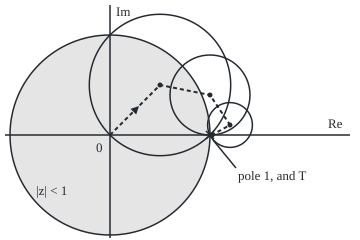

# Analytic continuation: push a function past the edge of its formula, and the extension is the only one possible

[Syllabus](../../../SYLLABUS.md) → [Complex analysis](../README.md) → [Taylor Series, Zeros and Rigidity](../README.md#s04) → Analytic continuation

---

## General Overview

A perpetuity pays $1 at the end of every year, for ever. At annual rate r a dollar due in a year is worth z = 1/(1 + r) today, the **discount factor**. At 5%, z = 1/1.05 and the payments z + z^2 + … add to $20, which is 1 divided by the rate ([Discounting](../../01-Foundations/04-Compound%20Growth%20and%20Discounting/06-discounting-and-present-value.md)).

From 18 September 2019 until 27 July 2022 the European Central Bank paid −0.5% on deposits. Then z is above 1, and the payments never settle: 100 add to about $130, 1,000 to about $29,857. Yet 1 divided by the rate still gives −200.

The sum describes a function only where it settles; the formula 1/r describes the same function almost everywhere. Carrying a function past the region where its first description works is **analytic continuation**, the term used from here on. There is no choice in it: the continued values are forced.

**A function given by a series on a small region has at most one holomorphic extension to a larger connected region, so 1/r is the only continuation of the perpetuity price to negative rates; the value −200 is not a sum of payments.**

**What kind of fact this is:** a theorem, proved in Why it works from the identity theorem; the continued value is then a definition.

### The picture: walking from the unit disc round the pole

<p align="center"></p>

To scale: 100 units per 1, 0 at (110, 135). Centres 0, 0.5 + 0.5i, 1 + 0.4i, 1.2 + 0.1i and 1.02; the pole at (210.0, 135.0); T = 1.005025, the discount factor at −0.5%, at (210.5, 135.0). Shaded: where the sum settles.

---

## The formula

Notation first, in words. The discount factor is $z = 1/(1+r)$, with $r$ the annual rate; below, $z$ may be any complex number. The sign Σ means "add up" over the terms its limits name. **Holomorphic** means having a complex derivative at every point of a region.

$$P = \sum_{n=1}^{\infty} z^n = \frac{z}{1-z} = \frac{1}{r} \qquad \text{when } |z| < 1$$

**Read it aloud:** the perpetuity adds every year's discount factor; inside the unit disc that is z over one minus z, one over the rate.

Underneath is the geometric series, one payment longer:

$$f(z) = \sum_{n=0}^{\infty} z^n = \frac{1}{1-z}, \qquad P = f(z) - 1$$

The sum works only for $|z| < 1$; the right-hand side works everywhere except the point 1. The theorem makes it the only continuation:

$$f,\ g \text{ holomorphic on a connected open } U,\ \ f = g \text{ on a set piling up at a point of } U \implies f = g \text{ on all of } U$$

**Read it aloud:** two holomorphic functions on one connected region that agree on a small patch agree everywhere on it.

| Symbol | Plain meaning | In our example | Push it up and the answer… |
| --- | --- | --- | --- |
| $r$ | the annual interest rate | 5%, then −0.5% | price 1/r falls |
| $z$ | the discount factor 1/(1 + r) | 0.952381; 1.005025 | past 1, no sum |
| $n$, $N$, $k$ | a year; payments counted; a term's index | 100 payments | — |
| $P$ | the perpetuity's price | $20; continued, −200 | — |
| $f$, $g$ | holomorphic functions; $f$ is 1/(1 − z), $g$ a rival | f(0.5 + 0.5i) = 1 + i | — |
| $U$ | a connected open region | the plane without the point 1 | more room for the theorem |
| $c$, $v$ | a disc's centre; the value v = f(c) carried there | c = 1.02, v = −50 | radius 1/\|v\| shrinks |
| $t$ | the strength of a smoothing weight | 0.01 | constant moves off −1/12 |

### When it holds

- **Holomorphic, not merely smooth.** A smooth function of x and y can equal 1/(1 − z) on the unit disc and anything outside it. On the real line alone, the gap at r = 0 cuts negative rates off, so any formula would do there.
- **A connected region.** On a region in two pieces, one piece says nothing about the other.
- **Agreement piling up inside the region.** The rival 1/r + sin(π/r) matches 1/r at every rate 1/n (100%, 50%, …, 5%), but those pile up at 0, the pole. At −0.75% it gives −132.467308, not −133.333333.
- **Uniqueness, not existence.** Nothing extends 1/(1 − z) across 1, where it grows without bound.

---

## Why it works

### Step 0: a holomorphic function is rigid

A holomorphic function equals its Taylor series on any disc inside its region ([Taylor series in the plane](01-taylor-series-in-the-plane.md)). Values on a small patch fix the derivatives, the derivatives fix the disc, and overlapping discs cross a connected region.

### Step 1: the sum and the formula agree on the unit disc

Multiply the first N terms by z and subtract: all but two cancel, so 1 + z + … + z^(N−1) = (1 − z^N)/(1 − z). Inside the unit disc z^N shrinks to 0. At 5%, z = 0.952381 and 3,000 payments add to 20.000000, which is 1/r.

### Step 2: the formula is a continuation

The function 1/(1 − z) has derivative 1/(1 − z)^2 everywhere except 1. The plane without that point, $U$, is open and connected: a path can step round the gap. So $f$ is holomorphic on $U$ and agrees with the sum on the unit disc: a continuation.

### Step 3: it is the only one

Let $g$ be any holomorphic function on $U$ that agrees with the sum on the unit disc. Then $f - g$ is holomorphic on $U$ and zero on the disc. A holomorphic function whose zeros pile up inside a connected region is zero on all of it ([Zeros and the identity theorem](03-zeros-and-the-identity-theorem.md)), so $g = f$. Positive rates alone suffice: their z fill the segment from 0 to 1.

<details>
<summary>Detailed proof</summary>

Let h = f − g, and A the points of $U$ where h and all its derivatives vanish. A is open: there h's Taylor series is 0. Its complement is open: a non-zero derivative stays non-zero nearby. A connected set cannot split into two disjoint non-empty open pieces, and A holds the unit disc, so A is all of $U$. If h vanished only on points piling up at q, a first non-zero Taylor coefficient at q would make q an isolated zero; so every coefficient is 0 and q is in A.

</details>

### Step 4: walking forward along a chain of discs

Usually no ready-made formula exists, and the continuation is built by walking. The sum's termwise derivative, 1 + 2z + 3z^2 + …, is also the sum times itself, so f′ = f^2 on the unit disc, and by Step 3 wherever $f$ goes. Differentiating again, f″ = 2f f′ = 2f^3; in general the k-th derivative is k! times the (k+1)-th power of f. So at a centre $c$ with value $v$ the Taylor coefficients are v, v^2, v^3, …:

$$f(z) = \sum_{k=0}^{\infty} v^{k+1} (z - c)^k, \qquad |z - c| < 1/|v|$$

One number fixes the local series, which settles on a disc of radius 1/|v|. The walk carries it: sum the current series at the next centre to get the next v. From v = 1 at 0 it hands on 1 + i at 0.5 + 0.5i, 2.5i at 1 + 0.4i, −4 + 2i at 1.2 + 0.1i, and −50 at 1.02. That disc, radius 0.020000, holds T with ratio 0.748744 and gives f(T) = −199, so P = −200, without ever using 1/(1 − z). Every step's ratio, distance over radius, stays below 1. Any route round 1 lands on the same value, because 1/(1 − z) is one function on $U$; for the logarithm, one lap round 0 adds 2πi, so in general a walk's result can depend on its route.

### Step 5: what −200 is, and is not

The first N payments at −0.5% add to exactly (1 − z^N)/r = −200 + 200 z^N: 130.158073 after 100 years, 29857.250441 after 1,000. The continued value is the constant part, once the growing 200 z^N is set aside. It is also the only finite P solving P = z(1 + P), "today's price is next year's payment and price, discounted". The sum itself exceeds every number.

### Step 6: the same reading of −1/12

The zeta function ζ(s) is the sum 1 + 1/2^s + 1/3^s + …, which settles only for s greater than 1 (for complex s, real part greater than 1). It continues uniquely to every s except 1, with value −1/12 at s = −1. There the sum would be 1 + 2 + 3 + …, which reaches 5050 by 100 terms and keeps growing. So "1 + 2 + 3 + … = −1/12" names ζ's continued value, as −200 names 1/r. Smoothing shows Step 5's split: weight the n-th term by e^(−nt) for small $t$; the total is a growing 1/t^2, plus −1/12, plus vanishing terms. At t = 0.01 the total minus 1/t^2 is −0.083333.

Another route, Schwarz reflection, mirrors a function real on part of the real axis across it.

---

## Worked numbers, by hand

| Step | Arithmetic | Value |
| --- | --- | --- |
| discount factor at −0.5% | 1 ÷ 0.995 | 1.005025 |
| 100 payments at −0.5% | −200 + 200 × 1.005025^100 | 130.158073 |
| v at 0.5 + 0.5i | 1 ÷ (0.5 − 0.5i) | 1 + i |
| v at 1 + 0.4i | 1 ÷ (−0.4i) | 2.5i |
| v at 1.2 + 0.1i | 1 ÷ (−0.2 − 0.1i) | −4 + 2i |
| v at 1.02 | 1 ÷ (−0.02) | −50 |
| f at T | 0.995 ÷ (0.995 − 1) | −199 |
| continued price | −199 − 1 | **−200** |

By hand each v is 1/(1 − c); the code sums each disc's series instead.

### What breaks if you drop a piece

| Mistake | Comes out at | What went wrong |
| --- | --- | --- |
| Summing payments at −0.5% | 29857.250441 by year 1,000, climbing | z = 1.005025 is outside the unit disc |
| Counting a payment today | 21 at 5%, not 20 | 1/(1 − z) starts at n = 0 |
| Trusting agreement at rates 1/n | rival: −132.467308 at −0.75%, not −133.333333 | it piles up only at the pole |
| Reading 1 + 2 + 3 + … = −1/12 as a sum | 5050 by 100 terms, growing | −1/12 is ζ continued to −1 |

The code prints all four.

---

## Code, from first principles, and it actually runs

Two roads to every price. Road one adds payments, or walks the chain carrying v and summing 600 terms per disc, never evaluating 1/(1 − z). Road two is 1/r. Four asserts: payments against 1/r and (1 − z^N)/r, the walk against 1/r, the smoothed constant against −1/12, the rival against 1/r.

### Python

```python
# Analytic continuation -- the check behind the card.  Standard library only.
# A perpetuity pays $1 a year for ever; z = 1/(1 + r) discounts a year at rate r.
# Road one adds the payments, or walks a chain of discs carrying one number, the
# value v; road two is the closed form 1/r.  The walk never uses 1/(1 - z).
import math

def disc_series(c, v, z, terms=600):   # the series at centre c, coefficients v^(k+1)
    total, term = 0j, v
    for _ in range(terms):
        total, term = total + term, term * v * (z - c)
    return total

def paid(r, n_years):                  # road one: add up n_years discounted payments
    return sum((1 + r) ** -n for n in range(1, n_years + 1))

def show(w):                           # 'a + bi', six decimals, no -0.000000
    a, b = round(w.real, 6) + 0.0, round(w.imag, 6) + 0.0
    return f"{a:.6f} {'-' if b < 0 else '+'} {abs(b):.6f}i"

print(f"r = 5%: z = {1 / 1.05:.6f}; 3000 payments add to {paid(0.05, 3000):.6f}; 1/r = {1 / 0.05:.6f}")
r = -0.005
z = 1 / (1 + r)
print(f"r = -0.5%: z = {z:.6f}, outside the unit disc; 1/r = {1 / r:.6f}")
for n in (100, 1000):
    print(f"  {n} payments add to {paid(r, n):.6f}; -200 + 200 z^{n} = {-200 + 200 * z ** n:.6f}")
centres, v = [0j, 0.5 + 0.5j, 1 + 0.4j, 1.2 + 0.1j, 1.02 + 0j], 1 + 0j
for a, b in zip(centres, centres[1:]):
    new_v = disc_series(a, v, b)
    print(f"  disc at {show(a)}, radius 1/|v| = {1 / abs(v):.6f}, step ratio "
          f"{abs(v * (b - a)):.6f}, hands on v = {show(new_v)}")
    v = new_v
f_T = disc_series(centres[-1], v, z)
last = f_T - 1
print(f"chain of discs: f(T) = {show(f_T)}, so P = f(T) - 1 = {show(last)}; last disc radius "
      f"{1 / abs(v):.6f}, ratio {abs(v * (z - centres[-1])):.6f}")
rival = lambda r: 1 / r + math.sin(math.pi / r)          # agrees with 1/r at r = 1/n only
print(f"rival 1/r + sin(pi/r): at 5% {rival(0.05):.6f}, at 50% {rival(0.5):.6f}; "
      f"at -0.75% {rival(-0.0075):.6f} against 1/r = {1 / -0.0075:.6f}")
print(f"mistake, payment now counted too: 1/(1 - z) at 5% = {1 / (1 - 1 / 1.05):.6f}, not 20")
t = 0.01
smooth = sum(n * math.exp(-n * t) for n in range(1, 6000))
print(f"1 + 2 + ... + 100 = {sum(range(101))}; sum of n e^(-nt) at t = {t}, minus 1/t^2 = "
      f"{smooth - 1 / t ** 2:.6f}; -1/12 = {-1 / 12:.6f}")
print("figure, discs " + " ".join(f"({110 + 100 * c.real:.1f},{135 - 100 * c.imag:.1f},r{100 * abs(1 - c):.1f})"
      for c in centres) + f"; pole (210.0,135.0); T ({110 + 100 * z:.1f},135.0)")
assert abs(paid(0.05, 3000) - 20) < 1e-9 and abs(paid(r, 1000) / ((1 - z ** 1000) / r) - 1) < 1e-12
assert abs(last - 1 / r) < 1e-8                                  # the walk lands on 1/r
assert abs(smooth - 1 / t ** 2 + 1 / 12) < 1e-5                  # the smoothed constant
assert abs(rival(0.05) - 20) < 1e-9 and abs(rival(-0.0075) - 1 / -0.0075) > 0.5
print("ALL CHECKS PASS")
```

**Ran 2026-09-28 on macOS, Python 3.14.6, standard library only. All checks passed. Output, pasted from the run:**

```
r = 5%: z = 0.952381; 3000 payments add to 20.000000; 1/r = 20.000000
r = -0.5%: z = 1.005025, outside the unit disc; 1/r = -200.000000
  100 payments add to 130.158073; -200 + 200 z^100 = 130.158073
  1000 payments add to 29857.250441; -200 + 200 z^1000 = 29857.250441
  disc at 0.000000 + 0.000000i, radius 1/|v| = 1.000000, step ratio 0.707107, hands on v = 1.000000 + 1.000000i
  disc at 0.500000 + 0.500000i, radius 1/|v| = 0.707107, step ratio 0.721110, hands on v = 0.000000 + 2.500000i
  disc at 1.000000 + 0.400000i, radius 1/|v| = 0.400000, step ratio 0.901388, hands on v = -4.000000 + 2.000000i
  disc at 1.200000 + 0.100000i, radius 1/|v| = 0.223607, step ratio 0.920869, hands on v = -50.000000 + 0.000000i
chain of discs: f(T) = -199.000000 + 0.000000i, so P = f(T) - 1 = -200.000000 + 0.000000i; last disc radius 0.020000, ratio 0.748744
rival 1/r + sin(pi/r): at 5% 20.000000, at 50% 2.000000; at -0.75% -132.467308 against 1/r = -133.333333
mistake, payment now counted too: 1/(1 - z) at 5% = 21.000000, not 20
1 + 2 + ... + 100 = 5050; sum of n e^(-nt) at t = 0.01, minus 1/t^2 = -0.083333; -1/12 = -0.083333
figure, discs (110.0,135.0,r100.0) (160.0,85.0,r70.7) (210.0,95.0,r40.0) (230.0,125.0,r22.4) (212.0,135.0,r2.0); pole (210.0,135.0); T (210.5,135.0)
ALL CHECKS PASS
```

### Rust

Same numbers, same labels, built with `rustc --edition 2021 -O`.

```rust
// Analytic continuation -- the same check as the Python, in Rust.  No crates.
// A perpetuity pays $1 a year for ever; z = 1/(1 + r) discounts a year at rate r.
// Road one adds the payments, or walks a chain of discs carrying one number, the
// value v; road two is the closed form 1/r.  The walk never uses 1/(1 - z).
use std::f64::consts::PI;
#[derive(Clone, Copy)]
struct C { re: f64, im: f64 }
fn c(re: f64, im: f64) -> C { C { re, im } }
fn add(a: C, b: C) -> C { c(a.re + b.re, a.im + b.im) }
fn sub(a: C, b: C) -> C { c(a.re - b.re, a.im - b.im) }
fn mul(a: C, b: C) -> C { c(a.re * b.re - a.im * b.im, a.re * b.im + a.im * b.re) }
fn modulus(a: C) -> f64 { a.re.hypot(a.im) }

fn disc_series(cen: C, v: C, z: C) -> C { // the series at centre cen, coefficients v^(k+1)
    let (mut total, mut term) = (c(0.0, 0.0), v);
    for _ in 0..600 { total = add(total, term); term = mul(mul(term, v), sub(z, cen)); }
    total
}
fn paid(r: f64, n_years: i32) -> f64 { (1..=n_years).map(|n| (1.0 + r).powi(-n)).sum() } // road one
fn show(w: C) -> String { // 'a + bi', six decimals, no -0.000000
    let a = format!("{:.6}", w.re);
    let a = if a == "-0.000000" { "0.000000".to_string() } else { a };
    let b = format!("{:.6}", w.im.abs());
    let sign = if w.im < 0.0 && b != "0.000000" { '-' } else { '+' };
    format!("{} {} {}i", a, sign, b)
}
fn rival(r: f64) -> f64 { 1.0 / r + (PI / r).sin() } // agrees with 1/r at r = 1/n only

fn main() {
    println!("r = 5%: z = {:.6}; 3000 payments add to {:.6}; 1/r = {:.6}", 1.0 / 1.05, paid(0.05, 3000), 1.0 / 0.05);
    let r = -0.005;
    let z = 1.0 / (1.0 + r);
    println!("r = -0.5%: z = {:.6}, outside the unit disc; 1/r = {:.6}", z, 1.0 / r);
    for n in [100, 1000] {
        println!("  {} payments add to {:.6}; -200 + 200 z^{} = {:.6}", n, paid(r, n), n, -200.0 + 200.0 * z.powi(n));
    }
    let centres = [c(0.0, 0.0), c(0.5, 0.5), c(1.0, 0.4), c(1.2, 0.1), c(1.02, 0.0)];
    let mut v = c(1.0, 0.0);
    for w in centres.windows(2) {
        let new_v = disc_series(w[0], v, w[1]);
        println!("  disc at {}, radius 1/|v| = {:.6}, step ratio {:.6}, hands on v = {}",
            show(w[0]), 1.0 / modulus(v), modulus(mul(v, sub(w[1], w[0]))), show(new_v));
        v = new_v;
    }
    let f_t = disc_series(centres[4], v, c(z, 0.0));
    let last = sub(f_t, c(1.0, 0.0));
    println!("chain of discs: f(T) = {}, so P = f(T) - 1 = {}; last disc radius {:.6}, ratio {:.6}",
        show(f_t), show(last), 1.0 / modulus(v), modulus(mul(v, sub(c(z, 0.0), centres[4]))));
    println!("rival 1/r + sin(pi/r): at 5% {:.6}, at 50% {:.6}; at -0.75% {:.6} against 1/r = {:.6}",
        rival(0.05), rival(0.5), rival(-0.0075), 1.0 / -0.0075);
    println!("mistake, payment now counted too: 1/(1 - z) at 5% = {:.6}, not 20", 1.0 / (1.0 - 1.0 / 1.05));
    let t = 0.01;
    let smooth: f64 = (1..6000).map(|n| n as f64 * (-(n as f64) * t).exp()).sum();
    println!("1 + 2 + ... + 100 = {}; sum of n e^(-nt) at t = {}, minus 1/t^2 = {:.6}; -1/12 = {:.6}",
        (0..=100).sum::<i32>(), t, smooth - 1.0 / (t * t), -1.0 / 12.0);
    let figs: Vec<String> = centres.iter().map(|q| format!("({:.1},{:.1},r{:.1})",
        110.0 + 100.0 * q.re, 135.0 - 100.0 * q.im, 100.0 * modulus(sub(c(1.0, 0.0), *q)))).collect();
    println!("figure, discs {}; pole (210.0,135.0); T ({:.1},135.0)", figs.join(" "), 110.0 + 100.0 * z);
    assert!((paid(0.05, 3000) - 20.0).abs() < 1e-9 && (paid(r, 1000) / ((1.0 - z.powi(1000)) / r) - 1.0).abs() < 1e-12);
    assert!(modulus(sub(last, c(1.0 / r, 0.0))) < 1e-8); // the walk lands on 1/r
    assert!((smooth - 1.0 / (t * t) + 1.0 / 12.0).abs() < 1e-5); // the smoothed constant
    assert!((rival(0.05) - 20.0).abs() < 1e-9 && (rival(-0.0075) - 1.0 / -0.0075).abs() > 0.5);
    println!("ALL CHECKS PASS");
}
```

**Ran 2026-09-28 on macOS, rustc 1.98.1, no crates. All checks passed. Output, pasted from the run:**

```
r = 5%: z = 0.952381; 3000 payments add to 20.000000; 1/r = 20.000000
r = -0.5%: z = 1.005025, outside the unit disc; 1/r = -200.000000
  100 payments add to 130.158073; -200 + 200 z^100 = 130.158073
  1000 payments add to 29857.250441; -200 + 200 z^1000 = 29857.250441
  disc at 0.000000 + 0.000000i, radius 1/|v| = 1.000000, step ratio 0.707107, hands on v = 1.000000 + 1.000000i
  disc at 0.500000 + 0.500000i, radius 1/|v| = 0.707107, step ratio 0.721110, hands on v = 0.000000 + 2.500000i
  disc at 1.000000 + 0.400000i, radius 1/|v| = 0.400000, step ratio 0.901388, hands on v = -4.000000 + 2.000000i
  disc at 1.200000 + 0.100000i, radius 1/|v| = 0.223607, step ratio 0.920869, hands on v = -50.000000 + 0.000000i
chain of discs: f(T) = -199.000000 + 0.000000i, so P = f(T) - 1 = -200.000000 + 0.000000i; last disc radius 0.020000, ratio 0.748744
rival 1/r + sin(pi/r): at 5% 20.000000, at 50% 2.000000; at -0.75% -132.467308 against 1/r = -133.333333
mistake, payment now counted too: 1/(1 - z) at 5% = 21.000000, not 20
1 + 2 + ... + 100 = 5050; sum of n e^(-nt) at t = 0.01, minus 1/t^2 = -0.083333; -1/12 = -0.083333
figure, discs (110.0,135.0,r100.0) (160.0,85.0,r70.7) (210.0,95.0,r40.0) (230.0,125.0,r22.4) (212.0,135.0,r2.0); pole (210.0,135.0); T (210.5,135.0)
ALL CHECKS PASS
```

The two outputs match line for line.

> [!TIP]
> **Try changing**
> Guess first, then run it.
> - **Deeper.** Set `r` to `-0.0075`: the walk lands on −133.333333; every assert passes.
> - **Stop too close to the pole.** Change the last centre `1.02` to `1.002`: its disc shrinks tenfold, T falls outside, and the second assert stops it.
> - **Coarser smoothing.** Set `t` to `0.1`: the constant drifts off −1/12 by about t^2/240 and the third assert stops it.

---

## The usual mistake

> [!warning]
> **Reading the continued value as the sum.** At −0.5% the payments add to more than any number, not −$200. −200 is the value there of the function the sum describes on positive rates; −1/12 is the same kind of thing.
>
> - **Taking uniqueness for existence.** Nothing continues 1/(1 − z) through the point 1, the rate 0.

---

## Where you meet it in real life

- **Annuities at negative rates.** N years of payments are worth (1 − z^N)/r, a finite sum valid at any rate but 0.
- **Special functions.** The factorial, as an integral, continues uniquely: [The gamma function](../09-Special%20Functions%20and%20the%20Zeta%20Function/02-gamma-function.md).
- **Prime numbers.** Zeros of the continued zeta function, beyond the edge of its sum, govern how evenly primes are spread: Zeta of a complex variable.

> **Say it back**
> A series may describe a function only on a disc. A holomorphic function is fixed on a connected region by any patch, so it extends in at most one way. The perpetuity sum settles for positive rates; 1/r, or a chain of discs, continues it to −200 at −0.5%. That is a value, not a sum, and so is −1/12.

---

## What this builds on

- [Zeros and the identity theorem](03-zeros-and-the-identity-theorem.md): the engine of Step 3.
- [Discounting](../../01-Foundations/04-Compound%20Growth%20and%20Discounting/06-discounting-and-present-value.md): the discount factor.

## Where this goes next

- [The gamma function](../09-Special%20Functions%20and%20the%20Zeta%20Function/02-gamma-function.md): the factorial continued.
- [Continuing zeta](../09-Special%20Functions%20and%20the%20Zeta%20Function/08-continuing-zeta-and-the-functional-equation.md): zeta continued, and −1/12 computed.
- Zeta of a complex variable: continued zeta at work on primes.
- [The maximum modulus principle](05-maximum-modulus-principle.md): size peaks on the rim, from the same rigidity.

Uniqueness forces a continuation once it exists; which formula carries zeta past s = 1 is the question [Continuing zeta](../09-Special%20Functions%20and%20the%20Zeta%20Function/08-continuing-zeta-and-the-functional-equation.md) answers.

---

## Sources

Verified 2026-09-28: every link below resolves to the publisher's page.

- Stein, Elias M., and Rami Shakarchi. *Complex Analysis*. Princeton University Press, 2003. [Publisher page](https://press.princeton.edu/books/hardcover/9780691113852/complex-analysis). Identity theorem; zeta continued in chapter 6.
- Lebl, Jiří. *Guide to Cultivating Complex Analysis*. [Book page and free text](https://www.jirka.org/ca/). Continuation along chains of discs.
- Tao, Terence. "The Euler-Maclaurin formula, Bernoulli numbers, the zeta function, and real-variable analytic continuation", 2010. [Article](https://terrytao.wordpress.com/2010/04/10/the-euler-maclaurin-formula-bernoulli-numbers-the-zeta-function-and-real-variable-analytic-continuation/). Smoothed sums with constant −1/12.
- European Central Bank. "Official interest rates". [Rate history](https://www.ecb.europa.eu/stats/policy_and_exchange_rates/key_ecb_interest_rates/html/index.en.html). Deposit rate −0.50%, 2019 to 2022.
