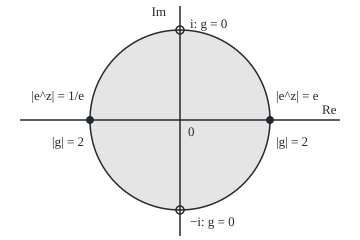
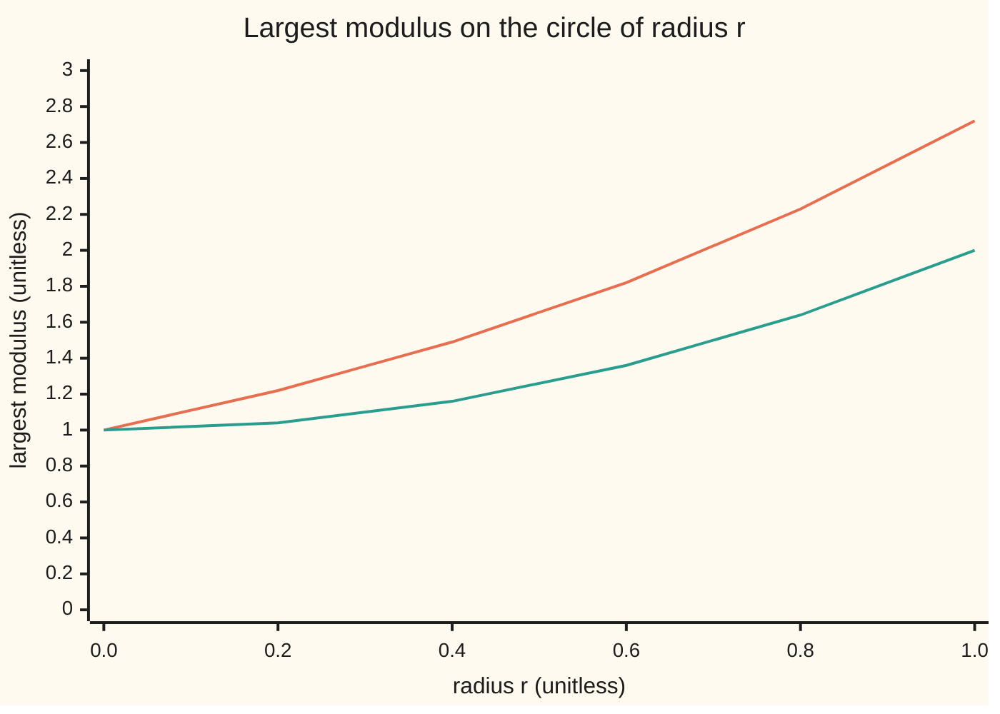

# The maximum modulus principle: |f| has no interior peak, so its largest value sits on the boundary

[Syllabus](../../../SYLLABUS.md) → [Complex analysis](../../../SYLLABUS.md#w07) → [Taylor Series, Zeros and Rigidity](../../../SYLLABUS.md#w07-s04) → The maximum modulus principle

---

## General Overview

Photograph a scene through a lens and look for the brightest pixel. In one kind of image it is always on the frame. Those images are holomorphic functions: functions with a complex derivative at every point of a region. Brightness is the modulus, the distance of the output from 0, written |f(z)|. From here on the words are function and modulus.

Take e^z on the closed unit disc, the points at distance at most 1 from 0. With z = x + iy its modulus is e^x, so it peaks where x is largest: at the rim point 1, with value e, about 2.718282. The function z^2 + 1 peaks at the rim points 1 and −1, with value 2.

Neither is luck. A holomorphic function's value at a point is the average of its values round any small circle about it, and an average cannot stick out above everything it averages.

**On a bounded region, a holomorphic function that is continuous up to the edge and not constant takes its largest modulus only on the boundary; if it has no zeros, its smallest modulus is there too.**

**What kind of fact this is:** a theorem, proved on this card in Why it works; the Schwarz lemma follows from it in a folded callout.

### The picture: where the extremes sit on the unit disc

<p align="center"></p>

To scale, 90 units per unit length. Here g(z) = z^2 + 1. Filled dots mark extremes, open dots the zeros of g; all sit on the rim.

---

## The formula

Notation first, in words. A **region** D is an open set in the plane, in one piece; its **boundary** $\partial D$ is its edge; D with its edge is its **closure**. "Max" is the largest value over a set.

$$\max_{z \text{ in closure of } D} \lvert f(z)\rvert = \max_{z \text{ on } \partial D} \lvert f(z)\rvert = M$$

**Read it aloud:** the largest modulus of f over the region and its edge equals the largest over the edge alone, called M.

The engine is the mean-value form of Cauchy's formula. Take any circle of radius r about a that lies, with its inside, in D; the point $a + re^{it}$ walks once round it as t runs from 0 to $2\pi$:

$$f(a) = \frac{1}{2\pi}\int_0^{2\pi} f\!\left(a + r e^{it}\right)dt$$

**Read it aloud:** the value at the centre is the average of the values round the circle.

| Symbol | Plain meaning | In our example | Push it up and the answer… |
| --- | --- | --- | --- |
| $f$, $g$ | holomorphic functions under study | e^z and z^2 + 1 | — |
| $z$, $a$, $\zeta$ | a point; a circle's centre; the point walking the circle | a = 0 | — |
| $r$, $t$, $\rho$ | a circle's radius; the angle round it; the radius of the peak's disc | r = 1 | larger r, larger largest modulus |
| $D$, $\partial D$ | the region and its edge | the open unit disc | larger region, M never smaller |
| $M$ | the largest modulus on the edge | e, and 2 | — |
| $h$, $m$, $\alpha$ | in the proof: f turned to be real at a; that value; the turn | m = 1, $\alpha$ = 1 | — |
| $s$ | a disc map fixing 0 (Schwarz) | (e^z − 1)/(e − 1) | — |

### When it holds

- **Holomorphic inside D.** The hill 1 − |z|^2, with no complex derivative away from 0, peaks at the centre.
- **D in one piece.** A function equal to 1 on one disc and 2 on a separate one has interior maxima yet is not constant.
- **D bounded, f continuous up to the edge.** On the half-plane of real part at least 0, |e^z| is 1 on the edge but e at z = 1.
- **For the minimum, no zeros.** On the disc of radius 2, z^2 + 1 is 0 at i, inside; its edge minimum is 3.

---

## Why it works

### Step 1: the centre value is the circle average

Cauchy's integral formula ([Cauchy's integral formula](../03-Contour%20Integrals%20and%20Cauchy%27s%20Theorem/05-cauchys-integral-formula.md)), round a circle about a:

$$f(a) = \frac{1}{2\pi i}\oint \frac{f(\zeta)}{\zeta - a}\,d\zeta.$$

Walk the circle as $\zeta = a + re^{it}$. Then $d\zeta = ire^{it}\,dt$ and $\zeta - a = re^{it}$; both cancel, leaving the mean-value form.

For e^z at a = 0 and r = 1 the average is 1 = e^0. The trapezoid sum with 4 points misses by 0.041691470, with 8 points by 0.000024802, with 16 by less than 0.000000001.

### Step 2: the modulus at the centre is at most the average modulus

By the triangle inequality summed round the circle, the modulus of an average is at most the average modulus, which is at most the largest:

$$\lvert f(a)\rvert \le \frac{1}{2\pi}\int_0^{2\pi} \lvert f(a + re^{it})\rvert\,dt \le \max_{t} \lvert f(a + re^{it})\rvert.$$

For e^z round the unit circle: 1 ≤ 1.266066 ≤ 2.718282. The middle number, the average of e^cos t, also comes from the series $\sum 1/(4^k (k!)^2)$.

### Step 3: a peak, even a flat one, makes f constant near it

Suppose |f| ≤ |f(a)| on some disc about a. Then both inequalities of Step 2 are ties on every small circle: every value there has the peak modulus and points the same way, so f equals f(a) near a. Nothing assumed the peak strict, so a flat top is caught too.

<details>
<summary>Detailed proof: a local maximum forces local constancy</summary>

Suppose $\lvert f(z)\rvert \le m = \lvert f(a)\rvert$ for all z within distance $\rho$ of a. If m = 0, f is 0 on that disc.

If m > 0, turn f: let $h = \alpha f$ with $\alpha = \overline{f(a)}/m$, a number of modulus 1. Then $h(a) = m$, a positive real number, and $\lvert h\rvert \le m$ on the disc. For each $r < \rho$, the mean-value form for h, real parts taken, gives

$$\frac{1}{2\pi}\int_0^{2\pi} \left[m - \mathrm{Re}\,h(a + re^{it})\right]dt = 0.$$

The bracket is continuous and never negative, since a real part never exceeds the modulus, which never exceeds m. With integral 0 it is 0 everywhere: a positive value at one angle would stay positive on a small arc and make the integral positive. So $\mathrm{Re}\,h = m$ at every point of the circle. Then $m^2 + (\mathrm{Im}\,h)^2 = \lvert h\rvert^2 \le m^2$ forces $\mathrm{Im}\,h = 0$, so $h = m$ on the circle. This holds for every $r < \rho$, so $h = m$ and $f = f(a)$ on the whole disc.

</details>

### Step 4: constant near one point means constant everywhere

f − f(a) is holomorphic and zero on a whole disc, so its zeros are not isolated; by [Zeros and the identity theorem](03-zeros-and-the-identity-theorem.md) it is zero on all of D, since D is in one piece. This is the local form of the principle: **a holomorphic function whose modulus has a local maximum inside a region is constant there.**

### Step 5: on a bounded region the maximum sits on the edge

If D is bounded and f continuous on the closure, |f| is continuous on a closed, bounded set, so it reaches a largest value somewhere. Inside D, Step 4 makes f constant, so the edge ties it; otherwise that point is on the edge.

For e^z the edge values are e^cos t, largest at t = 0: e at z = 1. For z^2 + 1 the triangle inequality gives |z^2 + 1| ≤ |z|^2 + 1 ≤ 2, a tie only where |z| = 1 and z^2 = 1: at 1 and −1.

### Step 6: the minimum version needs no zeros

If f has no zeros on the closure, 1/f is holomorphic inside and continuous up to the edge, so by Step 5 its largest modulus, 1 over the smallest of |f|, sits on the edge. For e^z, 1/e^z = e^−z peaks at z = −1 with value e, so |e^z| is smallest at −1, with value 1/e = 0.367879.

<details>
<summary>A consequence: the Schwarz lemma</summary>

**Statement.** Let s be holomorphic on the open unit disc, with |s(z)| < 1 and s(0) = 0. Then |s(z)| ≤ |z| everywhere and |s'(0)| ≤ 1. Equality at one point other than 0, or |s'(0)| = 1, makes s a rotation, s(z) = cz with |c| = 1.

**Proof.** s(z)/z fills its hole at 0 with s'(0), since the Taylor series of s starts s'(0)z ([Taylor series in the plane](01-taylor-series-in-the-plane.md)). On the circle of radius r < 1 its modulus is below 1/r, so by Step 5 it is below 1/r inside. Let r rise to 1: |s(z)/z| ≤ 1. Equality inside is an interior maximum, so Step 4 makes the quotient constant.

**Example.** $s(z) = (e^z - 1)/(e - 1)$ maps the disc into itself, as the series of e^z − 1 shows. Its s'(0) = 1/(e − 1) = 0.581977, and |s(0.5)| = 0.377541 ≤ 0.5.

</details>

A second road: the **open mapping theorem** (a non-constant holomorphic function sends a small disc about a onto a set containing a whole disc about f(a)) puts a value of larger modulus near any candidate peak; Stein and Shakarchi prove it.

---

## Worked numbers, by hand

| Step | Arithmetic | Value |
| --- | --- | --- |
| modulus of e^z | e^x (cos y + i sin y) has length e^x | e^x |
| largest real part on the disc | x ≤ 1, only at z = 1 | **e = 2.718282** |
| smallest real part on the disc | x ≥ −1, only at z = −1 | **1/e = 0.367879** |
| bound for z^2 + 1 | \|z\|^2 + 1 ≤ 1 + 1 | 2 |
| where the bound is reached | \|z\| = 1 and z^2 = 1 | **2 at z = 1 and −1** |

Nothing inside the disc reaches e. On circles of growing radius the largest modulus only rises:



Orange: e^z, largest e^r on each circle. Green: z^2 + 1, largest r^2 + 1.

### What breaks if you drop a piece

| Mistake | Comes out at | What went wrong |
| --- | --- | --- |
| Not holomorphic: 1 − \|z\|^2 | 1 at the centre, 0 on the edge | No mean-value property |
| Zeros allowed: z^2 + 1 on \|z\| ≤ 2 | 0 inside at i; 3 on the edge | 1/f is not holomorphic there |
| Unbounded: e^z on real part ≥ 0 | 1 on the edge, e at z = 1 inside | No largest value to place |
| Average modulus read as \|f(0)\| | 1.266066, not 1 | The mean-value form averages values, not moduli |

The code prints all four.

---

## Code, from first principles, and it actually runs

Two roads to every extreme: the closed forms (|e^z| = e^x, the triangle inequality for z^2 + 1), and a search of 51 circles of 720 points filling the disc. Trapezoid sums check the mean-value form against f(0); a series checks the average modulus.

### Python

```python
# The maximum modulus principle -- the check behind the card.  Standard library only.
# f(z) = e^z and g(z) = z^2 + 1 on the closed unit disc |z| <= 1.  Road one: closed
# forms (|e^z| = e^x, the triangle inequality, a series).  Road two: a polar grid
# searched point by point, and circle averages by the trapezoid rule.
import math

def cis(t): return complex(math.cos(t), math.sin(t))
def f(z): return math.exp(z.real) * cis(z.imag)          # e^z = e^x (cos y + i sin y)
def g(z): return z * z + 1
def s(z): return (f(z) - 1) / (math.e - 1)                 # a disc map fixing 0, for Schwarz

def ring(h, r, n=720):                   # (|h|, z) at n points round the circle |z| = r
    return [(abs(h(z)), z) for z in (r * cis(2 * math.pi * j / n) for j in range(n))]

def disc(h, R=1.0, nr=50):               # the same on 51 circles filling |z| <= R
    return [p for k in range(nr + 1) for p in ring(h, R * k / nr)]

def mean(h, n, r=1.0):                   # trapezoid average of h round |z| = r
    return sum(h(r * cis(2 * math.pi * j / n)) for j in range(n)) / n

def fmt(z):                              # 'a + bi', six decimals, no minus sign on a zero
    re, im = (0.0 if abs(v) < 5e-7 else v for v in (z.real, z.imag))
    return f"{re:.6f} {'-' if im < 0 else '+'} {abs(im):.6f}i"
top = lambda ps: max(ps, key=lambda p: p[0])
low = lambda ps: min(ps, key=lambda p: p[0])

mf, zf = top(disc(f))
mg, zg = top(disc(g))
nf, znf = low(disc(f))
series = sum(1 / (4 ** k * math.factorial(k) ** 2) for k in range(30))   # mean of e^cos t
avg_abs = mean(lambda z: abs(f(z)), 64).real
print("figure, scale 90 px per unit, 0 at (180, 120); 1 at (270, 120); -1 at (90, 120); i at (180, 30); -i at (180, 210); circle radius 90")
print(f"e^z: closed form e^1 = {math.e:.6f} at 1; grid max {mf:.6f} at {fmt(zf)}")
print(f"z^2 + 1: bound |z|^2 + 1 = 2.000000; grid max {mg:.6f} at {fmt(zg)}; |g(-1)| = {abs(g(-1)):.6f}")
print("chart, r:", " ".join(f"{k / 5:.1f}" for k in range(6)))
print("chart, largest |e^z| on |z| = r:", " ".join(f"{top(ring(f, k / 5))[0]:.2f}" for k in range(6)))
print("chart, largest |z^2 + 1| on |z| = r:", " ".join(f"{top(ring(g, k / 5))[0]:.2f}" for k in range(6)))
print("mean of e^z round |z| = 1, error with 4, 8, 16 points:", " ".join(f"{abs(mean(f, n) - 1):.9f}" for n in (4, 8, 16)))
print(f"f(0) = {fmt(f(0j))}; mean of f round |z| = 1 (64 points) = {fmt(mean(f, 64))}")
print(f"mean of |e^z| round |z| = 1: trapezoid {avg_abs:.6f}; series {series:.6f}; |f(0)| = {abs(f(0j)):.6f}")
print(f"minimum of |e^z|: closed form e^-1 = {math.exp(-1):.6f} at -1; grid min {nf:.6f} at {fmt(znf)}")
d0 = mean(lambda z: s(z) / z, 64, 0.5)
print(f"Schwarz, s(z) = (e^z - 1)/(e - 1): s'(0) as mean of s(z)/z = {d0.real:.6f}; 1/(e - 1) = {1 / (math.e - 1):.6f}")
print(f"Schwarz: |s(0.5)| = {abs(s(0.5 + 0j)):.6f} <= 0.5; |s(-0.5)| = {abs(s(-0.5 + 0j)):.6f} <= 0.5")
print(f"break 1, not holomorphic, 1 - |z|^2: centre {1 - abs(0j) ** 2:.6f}, edge {1 - abs(cis(1.0)) ** 2:.6f}")
m2, z2 = low(disc(g, 2.0))
print(f"break 2, zeros inside, z^2 + 1 on |z| <= 2: inside min {m2:.6f} at {fmt(z2)}; edge min {low(ring(g, 2.0))[0]:.6f}")
print(f"break 3, unbounded, Re z >= 0: |e^(2i)| = {abs(f(2j)):.6f} on the edge; |e^1| = {abs(f(1 + 0j)):.6f} inside")
print(f"break 4, mean of |f| taken for |f(0)|: {avg_abs:.6f}, not {abs(f(0j)):.6f}")
assert abs(mf - math.e) < 1e-12 and abs(zf - 1) < 1e-12        # grid peak = closed form, at z = 1
assert abs(mg - 2.0) < 1e-12 and abs(zg * zg - 1) < 1e-12        # grid peak = triangle bound, at 1 or -1
assert abs(avg_abs - series) < 1e-12 and abs(mean(f, 64) - f(0j)) < 1e-12   # mean of |f|; mean of f = f(0)
assert abs(nf - math.exp(-1)) < 1e-12 and abs(znf + 1) < 1e-12   # minimum version, at z = -1
print("ALL CHECKS PASS")
```

**Ran 2026-09-28 on macOS, Python 3.14.6, standard library only. All checks passed. Output, pasted from the run:**

```
figure, scale 90 px per unit, 0 at (180, 120); 1 at (270, 120); -1 at (90, 120); i at (180, 30); -i at (180, 210); circle radius 90
e^z: closed form e^1 = 2.718282 at 1; grid max 2.718282 at 1.000000 + 0.000000i
z^2 + 1: bound |z|^2 + 1 = 2.000000; grid max 2.000000 at 1.000000 + 0.000000i; |g(-1)| = 2.000000
chart, r: 0.0 0.2 0.4 0.6 0.8 1.0
chart, largest |e^z| on |z| = r: 1.00 1.22 1.49 1.82 2.23 2.72
chart, largest |z^2 + 1| on |z| = r: 1.00 1.04 1.16 1.36 1.64 2.00
mean of e^z round |z| = 1, error with 4, 8, 16 points: 0.041691470 0.000024802 0.000000000
f(0) = 1.000000 + 0.000000i; mean of f round |z| = 1 (64 points) = 1.000000 + 0.000000i
mean of |e^z| round |z| = 1: trapezoid 1.266066; series 1.266066; |f(0)| = 1.000000
minimum of |e^z|: closed form e^-1 = 0.367879 at -1; grid min 0.367879 at -1.000000 + 0.000000i
Schwarz, s(z) = (e^z - 1)/(e - 1): s'(0) as mean of s(z)/z = 0.581977; 1/(e - 1) = 0.581977
Schwarz: |s(0.5)| = 0.377541 <= 0.5; |s(-0.5)| = 0.228990 <= 0.5
break 1, not holomorphic, 1 - |z|^2: centre 1.000000, edge 0.000000
break 2, zeros inside, z^2 + 1 on |z| <= 2: inside min 0.000000 at 0.000000 + 1.000000i; edge min 3.000000
break 3, unbounded, Re z >= 0: |e^(2i)| = 1.000000 on the edge; |e^1| = 2.718282 inside
break 4, mean of |f| taken for |f(0)|: 1.266066, not 1.000000
ALL CHECKS PASS
```

### Rust

Same numbers, same labels, built with `rustc --edition 2021 -O`.

```rust
// The maximum modulus principle -- the same check as the Python, in Rust.  No crates.
// f(z) = e^z and g(z) = z^2 + 1 on the closed unit disc |z| <= 1.  Road one: closed
// forms (|e^z| = e^x, the triangle inequality, a series).  Road two: a polar grid
// searched point by point, and circle averages by the trapezoid rule.
use std::f64::consts::{E, PI};

#[derive(Clone, Copy)]
struct C { re: f64, im: f64 }
fn c(re: f64, im: f64) -> C { C { re, im } }
fn add(a: C, b: C) -> C { c(a.re + b.re, a.im + b.im) }
fn mul(a: C, b: C) -> C { c(a.re * b.re - a.im * b.im, a.re * b.im + a.im * b.re) }
fn div(a: C, b: C) -> C { let d = b.re * b.re + b.im * b.im; let t = mul(a, c(b.re, -b.im)); c(t.re / d, t.im / d) }
fn sc(a: C, k: f64) -> C { c(a.re * k, a.im * k) }
fn md(a: C) -> f64 { a.re.hypot(a.im) }
fn cis(t: f64) -> C { c(t.cos(), t.sin()) }
fn f(z: C) -> C { sc(cis(z.im), z.re.exp()) }              // e^z = e^x (cos y + i sin y)
fn g(z: C) -> C { add(mul(z, z), c(1.0, 0.0)) }
fn s(z: C) -> C { sc(add(f(z), c(-1.0, 0.0)), 1.0 / (E - 1.0)) }   // a disc map fixing 0, for Schwarz
fn ring(h: fn(C) -> C, r: f64) -> Vec<(f64, C)> {       // (|h|, z) at 720 points round |z| = r
    (0..720).map(|j| { let z = sc(cis(2.0 * PI * j as f64 / 720.0), r); (md(h(z)), z) }).collect()
}
fn disc(h: fn(C) -> C, rr: f64) -> Vec<(f64, C)> {      // the same on 51 circles filling |z| <= R
    (0..=50).flat_map(|k| ring(h, rr * k as f64 / 50.0)).collect()
}
fn mean(h: &dyn Fn(C) -> C, n: usize, r: f64) -> C {     // trapezoid average of h round |z| = r
    let mut t = c(0.0, 0.0);
    for j in 0..n { t = add(t, h(sc(cis(2.0 * PI * j as f64 / n as f64), r))); }
    sc(t, 1.0 / n as f64)
}
fn fmt(z: C) -> String {                                  // 'a + bi', six decimals, no minus sign on a zero
    let (re, im) = (if z.re.abs() < 5e-7 { 0.0 } else { z.re }, if z.im.abs() < 5e-7 { 0.0 } else { z.im });
    format!("{:.6} {} {:.6}i", re, if im < 0.0 { "-" } else { "+" }, im.abs())
}
fn top(ps: &[(f64, C)]) -> (f64, C) { let mut b = ps[0]; for &p in ps { if p.0 > b.0 { b = p; } } b }
fn low(ps: &[(f64, C)]) -> (f64, C) { let mut b = ps[0]; for &p in ps { if p.0 < b.0 { b = p; } } b }
fn row(h: fn(C) -> C) -> String { (0..6).map(|k| format!("{:.2}", top(&ring(h, k as f64 / 5.0)).0)).collect::<Vec<_>>().join(" ") }
fn main() {
    let (mf, zf) = top(&disc(f, 1.0));
    let (mg, zg) = top(&disc(g, 1.0));
    let (nf, znf) = low(&disc(f, 1.0));
    let (mut series, mut fact) = (0.0, 1.0);                // mean of e^cos t
    for k in 0..30 { if k > 0 { fact *= k as f64; } series += 1.0 / (4f64.powi(k) * fact * fact); }
    let avg_abs = mean(&|z| c(md(f(z)), 0.0), 64, 1.0).re;
    let z0 = c(0.0, 0.0);
    println!("figure, scale 90 px per unit, 0 at (180, 120); 1 at (270, 120); -1 at (90, 120); i at (180, 30); -i at (180, 210); circle radius 90");
    println!("e^z: closed form e^1 = {:.6} at 1; grid max {:.6} at {}", E, mf, fmt(zf));
    println!("z^2 + 1: bound |z|^2 + 1 = 2.000000; grid max {:.6} at {}; |g(-1)| = {:.6}", mg, fmt(zg), md(g(c(-1.0, 0.0))));
    println!("chart, r: {}", (0..6).map(|k| format!("{:.1}", k as f64 / 5.0)).collect::<Vec<_>>().join(" "));
    println!("chart, largest |e^z| on |z| = r: {}", row(f));
    println!("chart, largest |z^2 + 1| on |z| = r: {}", row(g));
    println!("mean of e^z round |z| = 1, error with 4, 8, 16 points: {}",
             [4, 8, 16].iter().map(|&n| format!("{:.9}", md(add(mean(&f, n, 1.0), c(-1.0, 0.0))))).collect::<Vec<_>>().join(" "));
    println!("f(0) = {}; mean of f round |z| = 1 (64 points) = {}", fmt(f(z0)), fmt(mean(&f, 64, 1.0)));
    println!("mean of |e^z| round |z| = 1: trapezoid {:.6}; series {:.6}; |f(0)| = {:.6}", avg_abs, series, md(f(z0)));
    println!("minimum of |e^z|: closed form e^-1 = {:.6} at -1; grid min {:.6} at {}", (-1.0f64).exp(), nf, fmt(znf));
    let d0 = mean(&|z| div(s(z), z), 64, 0.5);
    println!("Schwarz, s(z) = (e^z - 1)/(e - 1): s'(0) as mean of s(z)/z = {:.6}; 1/(e - 1) = {:.6}", d0.re, 1.0 / (E - 1.0));
    println!("Schwarz: |s(0.5)| = {:.6} <= 0.5; |s(-0.5)| = {:.6} <= 0.5", md(s(c(0.5, 0.0))), md(s(c(-0.5, 0.0))));
    println!("break 1, not holomorphic, 1 - |z|^2: centre {:.6}, edge {:.6}", 1.0 - md(z0).powi(2), 1.0 - md(cis(1.0)).powi(2));
    let (m2, z2) = low(&disc(g, 2.0));
    println!("break 2, zeros inside, z^2 + 1 on |z| <= 2: inside min {:.6} at {}; edge min {:.6}", m2, fmt(z2), low(&ring(g, 2.0)).0);
    println!("break 3, unbounded, Re z >= 0: |e^(2i)| = {:.6} on the edge; |e^1| = {:.6} inside", md(f(c(0.0, 2.0))), md(f(c(1.0, 0.0))));
    println!("break 4, mean of |f| taken for |f(0)|: {:.6}, not {:.6}", avg_abs, md(f(z0)));
    assert!((mf - E).abs() < 1e-12 && md(add(zf, c(-1.0, 0.0))) < 1e-12);    // grid peak = closed form, at z = 1
    assert!((mg - 2.0).abs() < 1e-12 && md(add(mul(zg, zg), c(-1.0, 0.0))) < 1e-12); // grid peak = triangle bound, at 1 or -1
    assert!((avg_abs - series).abs() < 1e-12 && md(add(mean(&f, 64, 1.0), sc(f(z0), -1.0))) < 1e-12); // mean of |f|; mean of f = f(0)
    assert!((nf - (-1.0f64).exp()).abs() < 1e-12 && md(add(znf, c(1.0, 0.0))) < 1e-12); // minimum version, at z = -1
    println!("ALL CHECKS PASS");
}
```

**Ran 2026-09-28 on macOS, rustc 1.98.1, no crates. All checks passed. Output, pasted from the run:**

```
figure, scale 90 px per unit, 0 at (180, 120); 1 at (270, 120); -1 at (90, 120); i at (180, 30); -i at (180, 210); circle radius 90
e^z: closed form e^1 = 2.718282 at 1; grid max 2.718282 at 1.000000 + 0.000000i
z^2 + 1: bound |z|^2 + 1 = 2.000000; grid max 2.000000 at 1.000000 + 0.000000i; |g(-1)| = 2.000000
chart, r: 0.0 0.2 0.4 0.6 0.8 1.0
chart, largest |e^z| on |z| = r: 1.00 1.22 1.49 1.82 2.23 2.72
chart, largest |z^2 + 1| on |z| = r: 1.00 1.04 1.16 1.36 1.64 2.00
mean of e^z round |z| = 1, error with 4, 8, 16 points: 0.041691470 0.000024802 0.000000000
f(0) = 1.000000 + 0.000000i; mean of f round |z| = 1 (64 points) = 1.000000 + 0.000000i
mean of |e^z| round |z| = 1: trapezoid 1.266066; series 1.266066; |f(0)| = 1.000000
minimum of |e^z|: closed form e^-1 = 0.367879 at -1; grid min 0.367879 at -1.000000 + 0.000000i
Schwarz, s(z) = (e^z - 1)/(e - 1): s'(0) as mean of s(z)/z = 0.581977; 1/(e - 1) = 0.581977
Schwarz: |s(0.5)| = 0.377541 <= 0.5; |s(-0.5)| = 0.228990 <= 0.5
break 1, not holomorphic, 1 - |z|^2: centre 1.000000, edge 0.000000
break 2, zeros inside, z^2 + 1 on |z| <= 2: inside min 0.000000 at 0.000000 + 1.000000i; edge min 3.000000
break 3, unbounded, Re z >= 0: |e^(2i)| = 1.000000 on the edge; |e^1| = 2.718282 inside
break 4, mean of |f| taken for |f(0)|: 1.266066, not 1.000000
ALL CHECKS PASS
```

The two outputs match line for line.

> [!TIP]
> **Try changing**
> Guess first, then run it.
> - **Coarsen the search.** Set `nr=50` to `nr=10` in `disc`. The peak still reads 2.718282 at 1, since the rim is always searched.
> - **Drop holomorphy.** Make f return `complex(1 - abs(z) ** 2)`. The search finds 1.000000 at the centre, and the first assert stops the run.
> - **Widen the Schwarz circle.** Change 0.5 in the s'(0) average to 0.9. It still reads 0.581977: s(z)/z is holomorphic, so every circle averages to its centre value.

---

## The usual mistake

> [!warning]
> **Reading "no interior peak" as "no interior extreme".** The minimum can sit inside when f has zeros: z^2 + 1 on the disc of radius 2 is 0 at i, while its edge minimum is 3.
>
> - **Averaging moduli.** The mean of |e^z| round the unit circle is 1.266066, not 1.
> - **Treating a flat top as allowed.** A non-strict local maximum also forces constancy (Step 3).

---

## Where you meet it in real life

- **Error bounds.** The error of a polynomial approximation to a holomorphic function is itself holomorphic, so its worst case over a disc is on the rim.
- **Uniqueness from the boundary.** Two holomorphic functions, continuous up to a bounded region's edge and equal there, differ by a function with largest modulus 0, so agree inside; compare [Analytic continuation](04-analytic-continuation.md).

> **Say it back**
> A holomorphic function's value at a point is the average of its values round any small circle about it. So its modulus there cannot beat every modulus on the circle, and a tie forces the function to be constant nearby, then everywhere. On a bounded region the largest modulus sits on the edge: e for e^z on the unit disc, at z = 1. With no zeros the smallest does too: 1/e at z = −1.

---

## What this builds on

- [Cauchy's integral formula](../03-Contour%20Integrals%20and%20Cauchy%27s%20Theorem/05-cauchys-integral-formula.md): the centre value as a contour integral, which becomes the circle average.
- [Zeros and the identity theorem](03-zeros-and-the-identity-theorem.md): zero on a disc means zero everywhere, which spreads local constancy.

## Where this goes next

- Interpolation: the principle on a strip becomes the three-lines bound that proves Riesz–Thorin.

On an unbounded region the plain statement fails, as e^z on the half-plane showed; how two edges and a limit on growth restore control is the three-lines bound on that card.

---

## Sources

Verified 28 Sep 2026: every link below resolves to the publisher's page.

- Orloff, Jeremy. "Topic 4: Cauchy's integral formula." MIT 18.04 *Complex Variables with Applications*, MIT OpenCourseWare, 2018. [Course notes](https://ocw.mit.edu/courses/18-04-complex-variables-with-applications-spring-2018/resources/mit18_04s18_topic4/). Mean value property and maximum modulus.
- Lebl, Jiří. *Guide to Cultivating Complex Analysis: Working the Complex Field*. [Author page and full text](https://www.jirka.org/ca/). Free full text; maximum modulus principle in section 3.3, Schwarz's lemma in section 3.5.
- Stein, Elias M., and Rami Shakarchi. *Complex Analysis*. Princeton University Press, 2003. [Publisher page](https://press.princeton.edu/books/hardcover/9780691113852/complex-analysis). Chapter 3: open mapping and maximum modulus.
