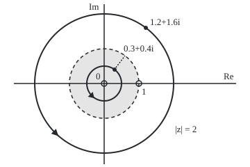

# Laurent series: allow negative powers, and a function with a hole expands in a ring

Complex analysis → Laurent Series, Singularities and Residues → Series round a hole → Laurent series

---

## General Overview

The function f(z) = 1/(z(z − 1)) is defined everywhere in the plane except z = 0 and z = 1, where its denominator is zero; call these its bad points, or **singularities**. At z = 0.5 it gives −4; at z = 2, 0.5.

A Taylor series about 0 ([taylor-series-in-the-plane](../04-Taylor%20Series%2C%20Zeros%20and%20Rigidity/01-taylor-series-in-the-plane.md)) needs a value at its centre, and there is none. The fix is to allow negative powers too: 1/z, 1/z^2, 1/z^3.

Picture a flat doughnut round the centre: the region between two circles. A series with negative powers converges on such a ring. This function has two rings round 0, split by the circle through its other bad point, 1. Inside, where 0 < |z| < 1, it equals −1/z − 1 − z − z^2 − …. Outside, where |z| > 1, it equals 1/z^2 + 1/z^3 + …. From here on the ring is an **annulus**, and such a series a **Laurent series**, after Pierre Alphonse Laurent, whose memoir Cauchy reported on in May 1843.

A second example, e^z/z^3 = 1/z^3 + 1/z^2 + (1/2)/z + 1/6 + …, has one ring: every z but 0. Its 1/z coefficient, 1/2, will matter most.

**A function holomorphic on a ring round a centre equals exactly one series in positive and negative powers of the distance from that centre; change the ring and the series can change.**

**What kind of fact this is:** a theorem, proved in Why it works, the full argument folded; finding the series by geometric series is a method.

### The picture: two rings round one centre

<p align="center"></p>

To scale: 50 units per 1, with 0 at (150, 120) and the hole 1 at (200, 120). Shaded: the inner ring; beyond the dashed unit circle: the outer ring. The loops, radius 0.5 and 2, carry the test points at (165, 100) and (210, 40).

---

## The formula

Notation first, in words. A sum from −∞ to ∞ means two sums, over the powers 0, 1, 2, … and over −1, −2, …, each converging on its own. The loop sign $\oint$ is the contour integral round a closed path, anticlockwise ([deforming-contours-and-winding-numbers](../03-Contour%20Integrals%20and%20Cauchy%27s%20Theorem/04-deforming-contours-and-winding-numbers.md)).

If $f$ is holomorphic (has a complex derivative) at every point of the ring $r < |z - a| < R$, then on that ring

$$f(z)=\sum_{n=-\infty}^{\infty}c_n(z-a)^n=\cdots+\frac{c_{-2}}{(z-a)^2}+\frac{c_{-1}}{z-a}+c_0+c_1(z-a)+\cdots$$

**Read it aloud:** on the ring, the function is a sum of whole-number powers of z minus the centre, negative ones included.

The coefficients, for any circle radius between r and R:

$$c_n=\frac{1}{2\pi i}\oint_{|\zeta-a|=\rho}\frac{f(\zeta)}{(\zeta-a)^{n+1}}\,d\zeta,\qquad r<\rho<R$$

**Read it aloud:** for the n-th coefficient, divide by one power more, go once round any circle in the ring, and divide by 2πi.

Walking the circle as $\zeta = a + \rho e^{it}$ turns this into an average: $c_n$ is the mean of $f(\zeta)(\zeta - a)^{-n}$ round the circle, which the code takes at $m$ equally spaced points. The negative-power terms together are the **principal part**.

| Symbol | Plain meaning | In our example | Push it up and the answer… |
| --- | --- | --- | --- |
| $f$, $z$ | the function; a point in the plane | 1/(z(z − 1)); also e^z/z^3 | — |
| $a$ | the centre of the rings | 0 | the rings move with it |
| $r$, $R$ | inner and outer radius of the ring | 0 and 1 inside; 1 and ∞ outside | a new ring can mean new coefficients |
| $c_n$, $n$ | coefficient of the n-th power; n any whole number | inside −1 from n = −1 up; outside 1 from n = −2 down | — |
| $\rho$ | radius of the reading circle | 0.5, 0.75 inside; 1.5, 2 outside | same answer until it crosses a hole |
| $\zeta$, $t$ | a point walking the circle; its angle in radians | ζ = 0.5e^{it} | — |
| $m$ | points in the average | 128; with 4, error 0.066667 | error shrinks like 0.5^m |
| $\oint$, $i$ | loop integral, anticlockwise; i^2 = −1 | loop of 1/z is 2πi | — |

### When it holds

- **Holomorphic on the whole ring.** The ring from radius 0.5 to 1.5 contains the hole at 1; no series about 0 fits it, since the inner one diverges past 1 and the outer one inside it.
- **Open ring.** On |z| = 1 neither series converges, since its terms keep size 1, though f has values there except at 1.
- **One ring at a time.** About the same centre, c_{-1} is −1 inside and 0 outside.

---

## Why it works

### Step 0: one geometric series for small things, another for large ones

The geometric series 1/(1 − w) = 1 + w + w^2 + … converges when |w| < 1. For small z, write a fraction in powers of z; for large z, in powers of 1/z. A ring has a hole to avoid and an edge to stay inside, so it needs both.

### Step 1: the example by algebra

Split the fraction ([rational-functions-and-partial-fractions](03-rational-functions-and-partial-fractions.md)): 1/(z(z − 1)) = 1/(z − 1) − 1/z; at z = 2, 1 − 0.5 = 0.5. Only 1/(z − 1) needs expanding.

Inside, |z| < 1, use ratio z: 1/(z − 1) = −1/(1 − z) = −1 − z − z^2 − …. So f = −1/z − 1 − z − z^2 − …, and every coefficient from $c_{-1}$ up is −1.

Outside, |z| > 1, use ratio 1/z: 1/(z − 1) = (1/z) · 1/(1 − 1/z) = 1/z + 1/z^2 + 1/z^3 + …. Adding −1/z cancels the first term. So f = 1/z^2 + 1/z^3 + …, and $c_{-1} = 0$.

### Step 2: the exponential example by shifting

The series $e^z = 1 + z + z^2/2! + z^3/3! + \cdots$ converges for every z ([taylor-series-in-the-plane](../04-Taylor%20Series%2C%20Zeros%20and%20Rigidity/01-taylor-series-in-the-plane.md)). Dividing by z^3 lowers every power by 3. The coefficient of z^n becomes 1/(n + 3)! for n ≥ −3. The 1/z term comes from z^2/2!, so $c_{-1} = 1/2$. The only hole is 0, so the ring is 0 < |z| < ∞.

### Step 3: every holomorphic function on a ring has such a series

Cauchy's integral formula, used on the ring, writes f(z) as an integral round an outer circle minus one round an inner circle. On the outer circle the loop point ζ is farther out than z, so 1/(ζ − z) expands in powers of z. On the inner circle ζ is nearer the centre, so it expands in powers of 1/z. That is Step 0 inside an integral.

<details>
<summary>Detailed proof</summary>

Take $a = 0$ and z with ρ1 < |z| < ρ2, both radii inside the ring. Cut a small disc round z from the region between the circles. The function $f(\zeta)/(\zeta - z)$ is holomorphic on what remains, so by the deformation theorem the outer loop integral equals the inner one plus the small loop's, and shrinking the small loop gives $2\pi i f(z)$. So
$$f(z)=\frac{1}{2\pi i}\oint_{|\zeta|=\rho_2}\frac{f(\zeta)}{\zeta-z}\,d\zeta-\frac{1}{2\pi i}\oint_{|\zeta|=\rho_1}\frac{f(\zeta)}{\zeta-z}\,d\zeta.$$
On the outer circle $1/(\zeta-z)=\sum_{n\ge0}z^n/\zeta^{n+1}$, ratio |z|/ρ2 < 1. On the inner circle $-1/(\zeta-z)=\sum_{k\ge0}\zeta^k/z^{k+1}$, ratio ρ1/|z| < 1. Each ratio has a fixed size below 1 on its circle and f is bounded there, so each series converges uniformly and integrates term by term. The two integrals give the non-negative and the negative powers, with the coefficients above. The coefficient integral is the same on every circle in the ring (Step 4), so one series serves the whole ring.

</details>

### Step 4: one loop integral sees one power, so the series is unique

On the circle z = ρe^(it), the loop integral of z^k is the integral of iρ^(k+1)e^(i(k+1)t) over one turn. That is 0 for every whole number k except −1, where the integrand is the constant i and the answer is 2πi, or 6.283185i.

Suppose f equals some series in positive and negative powers on the ring. Divide by z^(k+1) and integrate term by term round a circle in the ring; each half converges uniformly on that circle, which allows it. Every term dies except the power k, leaving 2πi times the coefficient of z^k. So each coefficient is the loop integral in the formula, fixed by f and the ring, and every method gives the same numbers.

By [deforming-contours-and-winding-numbers](../03-Contour%20Integrals%20and%20Cauchy%27s%20Theorem/04-deforming-contours-and-winding-numbers.md), the loop integral stays put as the circle moves within the ring: radii 0.5 and 0.75 give $c_{-1} = -1$, radii 1.5 and 2 give 0. Crossing the hole at 1 changes it.

### Step 5: reading the annulus

The widest rings round a centre are bounded by circles through the bad points. In the example, each geometric ratio reaches size 1 exactly there. For 1/(z(z − 1)) about 0 the bad points lie at distances 0 and 1: rings 0 < |z| < 1 and 1 < |z| < ∞.

The code's second road is this formula, as an average round a circle. Faster rules for $c_{-1}$ alone are in [residues](04-residues.md).

---

## Worked numbers, by hand

| Step | Arithmetic | Value |
| --- | --- | --- |
| inner series at 0.5, five terms | −2 − 1 − 1/2 − 1/4 − 1/8 | −3.875 |
| size of its gap | tail −z^4/(1 − z) = −(1/16)/(1/2) = −0.125 | 0.125 |
| outer series at 2, five terms | 1/4 + 1/8 + 1/16 + 1/32 + 1/64 | 0.484375 |
| size of its gap | tail 2^(−7)/(1 − 1/2) | 0.015625 |
| inner $c_{-1}$ | coefficient of 1/z in −1/z − 1 − z − … | **−1** |
| outer $c_{-1}$ | the 1/z terms cancel | **0** |
| $c_{-1}$ of e^z/z^3 | the z^2 term of e^z, 1/2! | **1/2** |

### What breaks if you drop a piece

| Mistake | Comes out at | What went wrong |
| --- | --- | --- |
| Inner series used at z = 2 | −15.5, not 0.5 | its ratio z has size 2 |
| Outer series used at z = 0.5 | 124, not −4 | its ratio 1/z has size 2 |
| $c_{-1}$ of e^z/z^3 read as 1/3! | 0.166667, not 0.5 | z^2/2!, not z^3/3!, lands on 1/z |
| $c_{-1}$ read on radius 2 for the inner ring | 0, not −1 | the circle crossed the hole at 1 |

The code prints all four.

---

## Code, from first principles, and it actually runs

Two roads to every coefficient: the algebra of Steps 1 and 2, written as rules, and the average round a circle, a trapezoid sum of 128 points on four radii that never sees the algebra. It also checks each five-term sum plus its geometric tail against f, and the averaging error against 0.5^m/(1 − 0.5^m).

### Python

```python
# Laurent series -- the check behind the card.  Standard library only.
# f(z) = 1/(z(z - 1)) has one expansion in the ring 0 < |z| < 1 and another in
# |z| > 1.  Road one: geometric-series algebra.  Road two: a trapezoid sum round
# a circle of radius rho, c_n = the average of f(z) z^(-n) over m equal steps.
from math import cos, sin, exp, pi

def f(z): return 1 / (z * (z - 1))
def g(z): return complex(exp(z.real) * cos(z.imag), exp(z.real) * sin(z.imag)) / z**3
def inner(n): return -1.0 if n >= -1 else 0.0          # -1/z - 1 - z - z^2 - ...
def outer(n): return 1.0 if n <= -2 else 0.0           # 1/z^2 + 1/z^3 + ...
def exp_coef(n):                                        # e^z/z^3: 1/(n + 3)! for n >= -3
    out = 1.0 if n >= -3 else 0.0
    for k in range(2, n + 4): out /= k
    return out
def contour(h, n, rho, m=128):                         # (1/2 pi i) loop of h(z)/z^(n+1) dz
    total = 0j
    for j in range(m):
        z = rho * complex(cos(2 * pi * j / m), sin(2 * pi * j / m))
        total += h(z) * z ** (-n)
    return total / m
def partial(ring, z, lo, hi): return sum(ring(n) * z**n for n in range(lo, hi + 1))
def c(w):
    re, im = round(w.real, 6) + 0.0, round(w.imag, 6) + 0.0
    return f"{re:.6f} {'-' if im < 0 else '+'} {abs(im):.6f}i"

tails = []
for name, ring, lo, hi, z in (("inner", inner, -1, 3, 0.5 + 0j), ("inner", inner, -1, 3, 0.3 + 0.4j),
                              ("outer", outer, -6, -2, 2 + 0j), ("outer", outer, -6, -2, 1.2 + 1.6j)):
    s = partial(ring, z, lo, hi)
    tail = -z**4 / (1 - z) if name == "inner" else z**-7 / (1 - 1 / z)   # geometric remainder
    tails.append(abs(f(z) - s - tail))
    print(f"{name} ring, z = {c(z)}: five terms {c(s)}, exact {c(f(z))}, gap {abs(f(z) - s):.6f}")
coef_gap = []
for name, ring, rho in (("inner", inner, 0.5), ("inner", inner, 0.75), ("outer", outer, 1.5), ("outer", outer, 2.0)):
    got = [contour(f, n, rho) for n in (-2, -1, 0)]
    coef_gap += [abs(w - ring(n)) for w, n in zip(got, (-2, -1, 0))]
    print(f"{name} ring, loop radius {rho:.2f}: c[-2] = {c(got[0])}, c[-1] = {c(got[1])}, c[0] = {c(got[2])}")
alias = [(abs(contour(f, -1, 0.5, m) - inner(-1)), 0.5**m / (1 - 0.5**m)) for m in (4, 8, 16)]
print("c[-1] error, radius 0.50, m = 4, 8, 16 steps: " + ", ".join(f"{e:.6f}" for e, _ in alias))
series = [exp_coef(n) for n in (-3, -2, -1, 0)]
loop = [contour(g, n, 1.0) for n in (-3, -2, -1, 0)]
print("e^z/z^3 by series, c[-3] c[-2] c[-1] c[0]: " + ", ".join(f"{v:.6f}" for v in series))
print("e^z/z^3 by loop radius 1, same four:      " + ", ".join(c(w) for w in loop))
print("loop integral of e^z/z^3 = 2 pi i c[-1]: " + c(2j * pi * contour(g, -1, 1.0)))
print("loop integral of z^k, k = -3..1: " + ", ".join(c(2j * pi * contour(lambda z: z**k, -1, 0.5)) for k in range(-3, 2)))
print(f"mistake 1, inner series at z = 2: {partial(inner, 2, -1, 3):.6f}, not {f(2):.6f}")
print(f"mistake 2, outer series at z = 0.5: {partial(outer, 0.5, -6, -2):.6f}, not {f(0.5):.6f}")
print(f"mistake 3, e^z/z^3 c[-1] read as 1/3!: {exp_coef(0):.6f}, not {exp_coef(-1):.6f}")
s = 50
pts = [(150 + s * z.real, 120 - s * z.imag) for z in (0j, 1 + 0j, 0.3 + 0.4j, 1.2 + 1.6j)]
print("figure, 50 units per 1: 0, 1, 0.3+0.4i, 1.2+1.6i at " + " ".join(f"({x:.0f}, {y:.0f})" for x, y in pts)
      + f"; radii {0.5 * s:.0f}, {1.0 * s:.0f}, {2.0 * s:.0f}")
assert max(coef_gap) < 1e-12                            # loop sums agree with the algebra
assert max(tails) < 1e-12                               # five terms + geometric tail = f
assert all(abs(w - v) < 1e-12 for w, v in zip(loop, series))
assert all(abs(e - p) < 1e-12 for e, p in alias)        # error is exactly rho^m/(1 - rho^m)
print("ALL CHECKS PASS")
```

**Ran 2026-09-28 on macOS, Python 3.14.6, standard library only. All checks passed. Output, pasted from the run:**

```
inner ring, z = 0.500000 + 0.000000i: five terms -3.875000 + 0.000000i, exact -4.000000 + 0.000000i, gap 0.125000
inner ring, z = 0.300000 + 0.400000i: five terms -2.313000 + 0.916000i, exact -2.276923 + 0.984615i, gap 0.077522
outer ring, z = 2.000000 + 0.000000i: five terms 0.484375 + 0.000000i, exact 0.500000 + 0.000000i, gap 0.015625
outer ring, z = 1.200000 + 1.600000i: five terms -0.230317 - 0.208944i, exact -0.223077 - 0.215385i, gap 0.009690
inner ring, loop radius 0.50: c[-2] = 0.000000 + 0.000000i, c[-1] = -1.000000 + 0.000000i, c[0] = -1.000000 + 0.000000i
inner ring, loop radius 0.75: c[-2] = 0.000000 + 0.000000i, c[-1] = -1.000000 + 0.000000i, c[0] = -1.000000 + 0.000000i
outer ring, loop radius 1.50: c[-2] = 1.000000 + 0.000000i, c[-1] = 0.000000 + 0.000000i, c[0] = 0.000000 + 0.000000i
outer ring, loop radius 2.00: c[-2] = 1.000000 + 0.000000i, c[-1] = 0.000000 + 0.000000i, c[0] = 0.000000 + 0.000000i
c[-1] error, radius 0.50, m = 4, 8, 16 steps: 0.066667, 0.003922, 0.000015
e^z/z^3 by series, c[-3] c[-2] c[-1] c[0]: 1.000000, 1.000000, 0.500000, 0.166667
e^z/z^3 by loop radius 1, same four:      1.000000 + 0.000000i, 1.000000 + 0.000000i, 0.500000 + 0.000000i, 0.166667 + 0.000000i
loop integral of e^z/z^3 = 2 pi i c[-1]: 0.000000 + 3.141593i
loop integral of z^k, k = -3..1: 0.000000 + 0.000000i, 0.000000 + 0.000000i, 0.000000 + 6.283185i, 0.000000 + 0.000000i, 0.000000 + 0.000000i
mistake 1, inner series at z = 2: -15.500000, not 0.500000
mistake 2, outer series at z = 0.5: 124.000000, not -4.000000
mistake 3, e^z/z^3 c[-1] read as 1/3!: 0.166667, not 0.500000
figure, 50 units per 1: 0, 1, 0.3+0.4i, 1.2+1.6i at (150, 120) (200, 120) (165, 100) (210, 40); radii 25, 50, 100
ALL CHECKS PASS
```

### Rust

Same numbers, same labels, built with `rustc --edition 2021 -O`.

```rust
// Laurent series -- the same check as the Python, in Rust.  No crates.
// f(z) = 1/(z(z - 1)) has one expansion in the ring 0 < |z| < 1 and another in
// |z| > 1.  Road one: geometric-series algebra.  Road two: a trapezoid sum round
// a circle of radius rho, c_n = the average of f(z) z^(-n) over m equal steps.
use std::f64::consts::PI;
#[derive(Clone, Copy)] struct C { re: f64, im: f64 }
fn cx(re: f64, im: f64) -> C { C { re, im } }
fn add(a: C, b: C) -> C { cx(a.re + b.re, a.im + b.im) }
fn sub(a: C, b: C) -> C { cx(a.re - b.re, a.im - b.im) }
fn mul(a: C, b: C) -> C { cx(a.re * b.re - a.im * b.im, a.re * b.im + a.im * b.re) }
fn div(a: C, b: C) -> C { let d = b.re * b.re + b.im * b.im; cx((a.re * b.re + a.im * b.im) / d, (a.im * b.re - a.re * b.im) / d) }
fn abs(a: C) -> f64 { a.re.hypot(a.im) }
fn pw(z: C, n: i32) -> C {
    let mut p = cx(1.0, 0.0); for _ in 0..n.abs() { p = mul(p, z) }
    if n < 0 { div(cx(1.0, 0.0), p) } else { p }
}
fn f(z: C) -> C { div(cx(1.0, 0.0), mul(z, sub(z, cx(1.0, 0.0)))) }
fn g(z: C) -> C { div(cx(z.re.exp() * z.im.cos(), z.re.exp() * z.im.sin()), pw(z, 3)) }
fn inner(n: i32) -> f64 { if n >= -1 { -1.0 } else { 0.0 } }       // -1/z - 1 - z - z^2 - ...
fn outer(n: i32) -> f64 { if n <= -2 { 1.0 } else { 0.0 } }        // 1/z^2 + 1/z^3 + ...
fn exp_coef(n: i32) -> f64 {                                        // e^z/z^3: 1/(n + 3)! for n >= -3
    let mut out = if n >= -3 { 1.0 } else { 0.0 }; for k in 2..n + 4 { out /= k as f64 }
    out
}
fn contour(h: &dyn Fn(C) -> C, n: i32, rho: f64, m: usize) -> C {  // (1/2 pi i) loop of h(z)/z^(n+1) dz
    let mut total = cx(0.0, 0.0);
    for j in 0..m {
        let t = 2.0 * PI * j as f64 / m as f64;
        let z = cx(rho * t.cos(), rho * t.sin());
        total = add(total, mul(h(z), pw(z, -n)));
    }
    cx(total.re / m as f64, total.im / m as f64)
}
fn partial(ring: fn(i32) -> f64, z: C, lo: i32, hi: i32) -> C {
    (lo..=hi).fold(cx(0.0, 0.0), |s, n| add(s, mul(cx(ring(n), 0.0), pw(z, n))))
}
fn c(w: C) -> String {
    let (re, im) = ((w.re * 1e6).round() / 1e6 + 0.0, (w.im * 1e6).round() / 1e6 + 0.0);
    format!("{:.6} {} {:.6}i", re, if im < 0.0 { "-" } else { "+" }, im.abs())
}
fn main() {
    let one = cx(1.0, 0.0);
    let mut tails = Vec::new();
    for (name, ring, lo, hi, z) in [("inner", inner as fn(i32) -> f64, -1, 3, cx(0.5, 0.0)), ("inner", inner, -1, 3, cx(0.3, 0.4)),
                                    ("outer", outer, -6, -2, cx(2.0, 0.0)), ("outer", outer, -6, -2, cx(1.2, 1.6))] {
        let s = partial(ring, z, lo, hi);
        let tail = if name == "inner" { div(mul(cx(-1.0, 0.0), pw(z, 4)), sub(one, z)) } else { div(pw(z, -7), sub(one, div(one, z))) };
        tails.push(abs(sub(sub(f(z), s), tail)));
        println!("{} ring, z = {}: five terms {}, exact {}, gap {:.6}", name, c(z), c(s), c(f(z)), abs(sub(f(z), s)));
    }
    let mut coef_gap = Vec::new();
    for (name, ring, rho) in [("inner", inner as fn(i32) -> f64, 0.5), ("inner", inner, 0.75), ("outer", outer, 1.5), ("outer", outer, 2.0)] {
        let got: Vec<C> = [-2, -1, 0].iter().map(|&n| contour(&f, n, rho, 128)).collect();
        for (w, n) in got.iter().zip([-2, -1, 0]) { coef_gap.push(abs(sub(*w, cx(ring(n), 0.0)))) }
        println!("{} ring, loop radius {:.2}: c[-2] = {}, c[-1] = {}, c[0] = {}", name, rho, c(got[0]), c(got[1]), c(got[2]));
    }
    let alias: Vec<(f64, f64)> = [4, 8, 16].iter()
        .map(|&m| (abs(sub(contour(&f, -1, 0.5, m), cx(inner(-1), 0.0))), 0.5f64.powi(m as i32) / (1.0 - 0.5f64.powi(m as i32)))).collect();
    println!("c[-1] error, radius 0.50, m = 4, 8, 16 steps: {}", alias.iter().map(|a| format!("{:.6}", a.0)).collect::<Vec<_>>().join(", "));
    let series: Vec<f64> = [-3, -2, -1, 0].iter().map(|&n| exp_coef(n)).collect();
    let lp: Vec<C> = [-3, -2, -1, 0].iter().map(|&n| contour(&g, n, 1.0, 128)).collect();
    println!("e^z/z^3 by series, c[-3] c[-2] c[-1] c[0]: {}", series.iter().map(|v| format!("{:.6}", v)).collect::<Vec<_>>().join(", "));
    println!("e^z/z^3 by loop radius 1, same four:      {}", lp.iter().map(|w| c(*w)).collect::<Vec<_>>().join(", "));
    println!("loop integral of e^z/z^3 = 2 pi i c[-1]: {}", c(mul(cx(0.0, 2.0 * PI), contour(&g, -1, 1.0, 128))));
    let zk: Vec<String> = (-3..2).map(|k| c(mul(cx(0.0, 2.0 * PI), contour(&move |z: C| pw(z, k), -1, 0.5, 128)))).collect();
    println!("loop integral of z^k, k = -3..1: {}", zk.join(", "));
    println!("mistake 1, inner series at z = 2: {:.6}, not {:.6}", partial(inner, cx(2.0, 0.0), -1, 3).re, f(cx(2.0, 0.0)).re);
    println!("mistake 2, outer series at z = 0.5: {:.6}, not {:.6}", partial(outer, cx(0.5, 0.0), -6, -2).re, f(cx(0.5, 0.0)).re);
    println!("mistake 3, e^z/z^3 c[-1] read as 1/3!: {:.6}, not {:.6}", exp_coef(0), exp_coef(-1));
    let s = 50.0;
    let pts: Vec<String> = [cx(0.0, 0.0), one, cx(0.3, 0.4), cx(1.2, 1.6)].iter()
        .map(|z| format!("({:.0}, {:.0})", 150.0 + s * z.re, 120.0 - s * z.im)).collect();
    println!("figure, 50 units per 1: 0, 1, 0.3+0.4i, 1.2+1.6i at {}; radii {:.0}, {:.0}, {:.0}", pts.join(" "), 0.5 * s, 1.0 * s, 2.0 * s);
    assert!(coef_gap.iter().all(|&e| e < 1e-12));                   // loop sums agree with the algebra
    assert!(tails.iter().all(|&e| e < 1e-12));                      // five terms + geometric tail = f
    assert!(lp.iter().zip(&series).all(|(w, v)| abs(sub(*w, cx(*v, 0.0))) < 1e-12));
    assert!(alias.iter().all(|(e, p)| (e - p).abs() < 1e-12));      // error is exactly rho^m/(1 - rho^m)
    println!("ALL CHECKS PASS");
}
```

**Ran 2026-09-28 on macOS, rustc 1.98.1, no crates. All checks passed. Output, pasted from the run:**

```
inner ring, z = 0.500000 + 0.000000i: five terms -3.875000 + 0.000000i, exact -4.000000 + 0.000000i, gap 0.125000
inner ring, z = 0.300000 + 0.400000i: five terms -2.313000 + 0.916000i, exact -2.276923 + 0.984615i, gap 0.077522
outer ring, z = 2.000000 + 0.000000i: five terms 0.484375 + 0.000000i, exact 0.500000 + 0.000000i, gap 0.015625
outer ring, z = 1.200000 + 1.600000i: five terms -0.230317 - 0.208944i, exact -0.223077 - 0.215385i, gap 0.009690
inner ring, loop radius 0.50: c[-2] = 0.000000 + 0.000000i, c[-1] = -1.000000 + 0.000000i, c[0] = -1.000000 + 0.000000i
inner ring, loop radius 0.75: c[-2] = 0.000000 + 0.000000i, c[-1] = -1.000000 + 0.000000i, c[0] = -1.000000 + 0.000000i
outer ring, loop radius 1.50: c[-2] = 1.000000 + 0.000000i, c[-1] = 0.000000 + 0.000000i, c[0] = 0.000000 + 0.000000i
outer ring, loop radius 2.00: c[-2] = 1.000000 + 0.000000i, c[-1] = 0.000000 + 0.000000i, c[0] = 0.000000 + 0.000000i
c[-1] error, radius 0.50, m = 4, 8, 16 steps: 0.066667, 0.003922, 0.000015
e^z/z^3 by series, c[-3] c[-2] c[-1] c[0]: 1.000000, 1.000000, 0.500000, 0.166667
e^z/z^3 by loop radius 1, same four:      1.000000 + 0.000000i, 1.000000 + 0.000000i, 0.500000 + 0.000000i, 0.166667 + 0.000000i
loop integral of e^z/z^3 = 2 pi i c[-1]: 0.000000 + 3.141593i
loop integral of z^k, k = -3..1: 0.000000 + 0.000000i, 0.000000 + 0.000000i, 0.000000 + 6.283185i, 0.000000 + 0.000000i, 0.000000 + 0.000000i
mistake 1, inner series at z = 2: -15.500000, not 0.500000
mistake 2, outer series at z = 0.5: 124.000000, not -4.000000
mistake 3, e^z/z^3 c[-1] read as 1/3!: 0.166667, not 0.500000
figure, 50 units per 1: 0, 1, 0.3+0.4i, 1.2+1.6i at (150, 120) (200, 120) (165, 100) (210, 40); radii 25, 50, 100
ALL CHECKS PASS
```

The two outputs match line for line.

> [!TIP]
> **Try changing**
> Guess first, then run it.
> - **Forget the 1/z term.** Change the inner rule to `n >= 0`. The circle averages still read c[-1] as −1, so the first assert stops the run.
> - **One more power down.** Change `z**3` to `z**4` in `g`. The loop reads c[-1] as 0.166667 and the third assert stops it.
> - **A smaller circle.** Change every 0.5 on the error line to 0.25. Each error roughly squares, as 0.25^m = (0.5^m)^2; the asserts pass.

---

## The usual mistake

> [!warning]
> **A Laurent series without its ring is not an answer.** About 0, 1/(z(z − 1)) has two series whose 1/z coefficients disagree: −1 inside the unit circle, 0 outside. Each is right only in its own ring.
>
> - **Summing outside the ring.** Five inner terms at z = 2 give −15.5, not 0.5; five outer terms at z = 0.5 give 124, not −4.
> - **Losing the shift.** The 1/z coefficient of e^z/z^3 is 1/2!, not 1/3!: 0.5, not 0.166667.
> - **Judging the centre from the wrong ring.** The outer series has endless negative powers, yet 0 is a mild bad point; only a ring 0 < |z − a| < R speaks for a: [classifying-singularities](02-classifying-singularities.md).

---

## Where you meet it in real life

- **Digital filters.** A sampled signal's z-transform is a Laurent series, and its ring decides the signal: 1/(z − 1) outside and inside the unit circle are two different signals ([z-transform-and-discrete-time-systems](../../13-Engineering%20mathematics/02-Linear%20Systems%20and%20Transforms/08-z-transform-and-discrete-time-systems.md)).
- **Contour integrals.** A loop integral sees only $c_{-1}$: e^z/z^3 round the unit circle gives 2πi times 1/2, or 3.141593i ([the-residue-theorem](05-the-residue-theorem.md)).
- **Matrices.** For large z, the inverse of z − A is 1/z + A/z^2 + A^2/z^3 + …, the outer series with a matrix A in place of 1 (spectrum-and-resolvent).

> **Say it back**
> A Laurent series allows negative powers, so it can describe a function round a hole. It converges on a ring bounded by circles through the bad points. On a given ring it is unique, since each coefficient is a loop integral. About 0, 1/(z(z − 1)) is −1/z − 1 − z − … inside the unit circle and 1/z^2 + 1/z^3 + … outside. The 1/z coefficient of e^z/z^3 is 1/2.

---

## What this builds on

- [taylor-series-in-the-plane](../04-Taylor%20Series%2C%20Zeros%20and%20Rigidity/01-taylor-series-in-the-plane.md): the one-sided series, Cauchy's integral formula, and the series for e^z.
- [deforming-contours-and-winding-numbers](../03-Contour%20Integrals%20and%20Cauchy%27s%20Theorem/04-deforming-contours-and-winding-numbers.md): why a loop integral stays put as the circle moves within the ring.
- [series-convergence](../../06-Calculus%20and%20analysis/06-Series/01-series-convergence.md): the geometric series and when a sum converges.

## Where this goes next

- [classifying-singularities](02-classifying-singularities.md): the principal part sorts bad points into kinds.
- [z-transform-and-discrete-time-systems](../../13-Engineering%20mathematics/02-Linear%20Systems%20and%20Transforms/08-z-transform-and-discrete-time-systems.md): the ring as a region of convergence.
- pade-and-rational-approximation: fractions matched to series.
- spectrum-and-resolvent: the outer series for operators.
- divisors-and-riemann-roch: the lowest power as a zero's or pole's order.

---

## Sources

Verified 2026-09-28: every link below resolves to the publisher's page.

- Lebl, Jiří. *Guide to Cultivating Complex Analysis: Working the Complex Field*. [Book page and free PDF](https://www.jirka.org/ca/). Section 4.4 proves existence on an annulus.
- Orloff, Jeremy. *18.04 Complex Variables with Applications*, Spring 2018, MIT OpenCourseWare. [Lecture notes](https://ocw.mit.edu/courses/18-04-complex-variables-with-applications-spring-2018/pages/lecture-notes/). Topic 7 treats Taylor and Laurent series.
- O'Connor, J. J., and E. F. Robertson. "Pierre Alphonse Laurent." MacTutor Archive, University of St Andrews. [Biography](https://mathshistory.st-andrews.ac.uk/Biographies/Laurent_Pierre/). Cauchy's 1843 report on Laurent's memoir.
